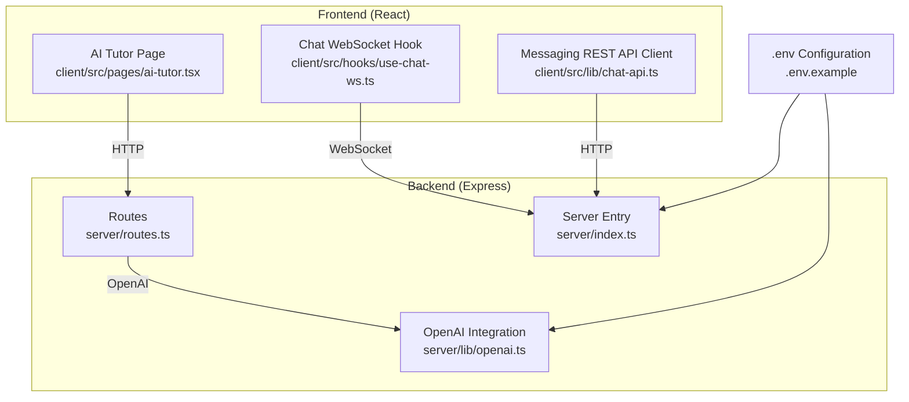
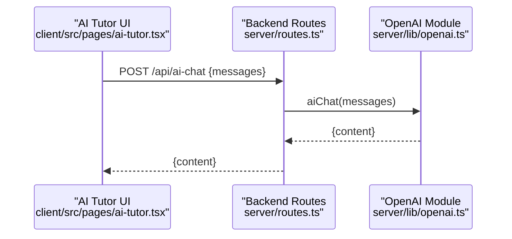
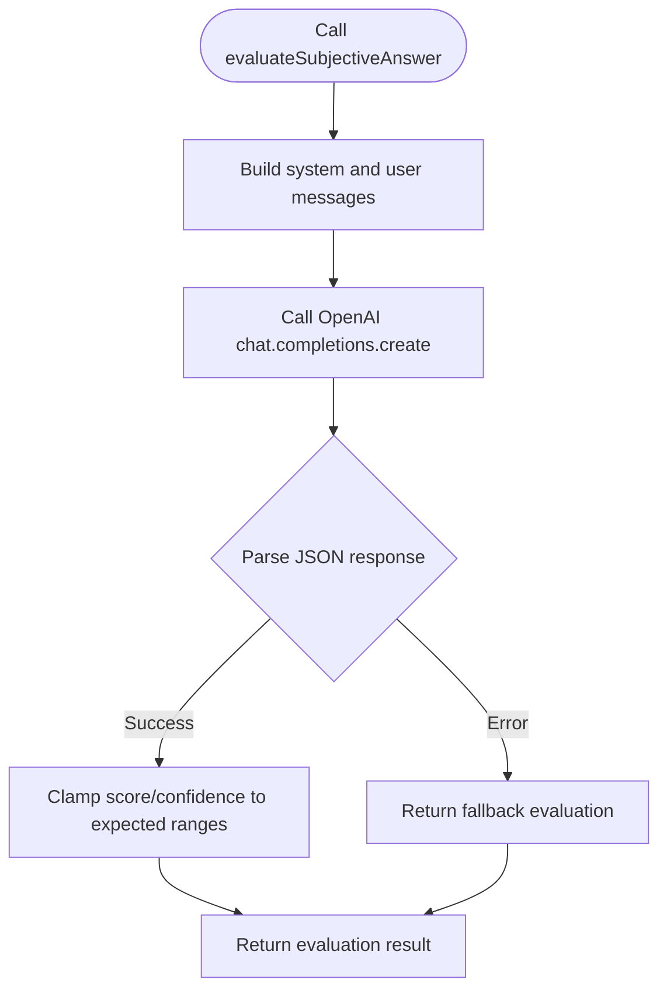
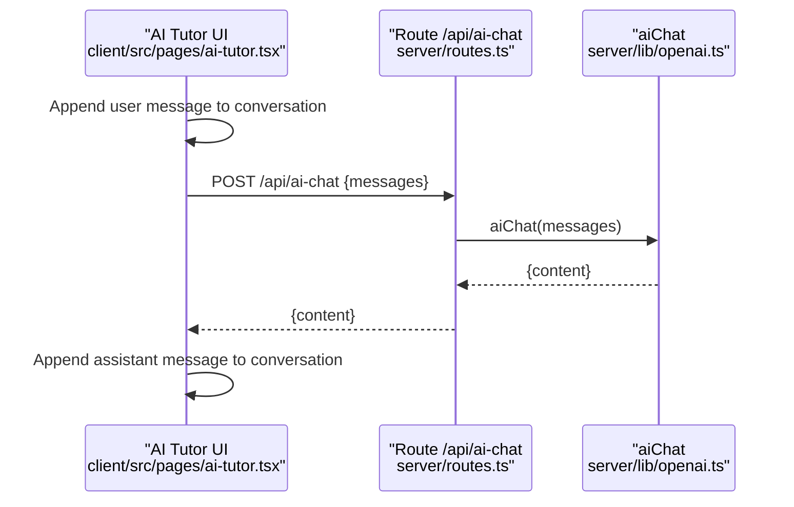
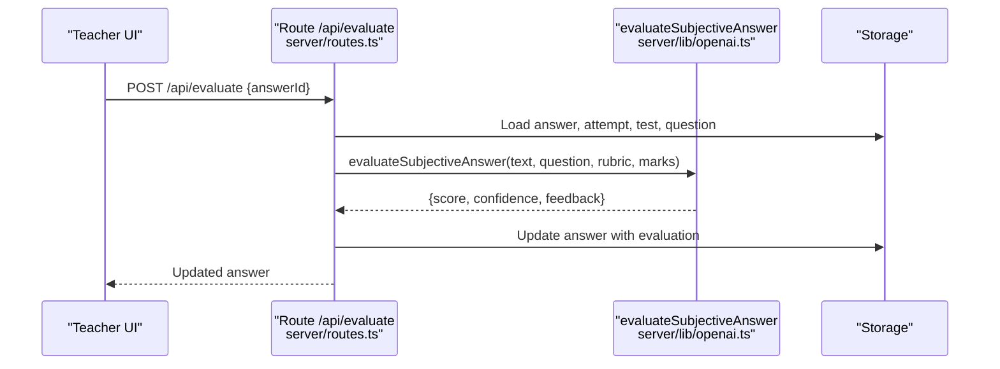
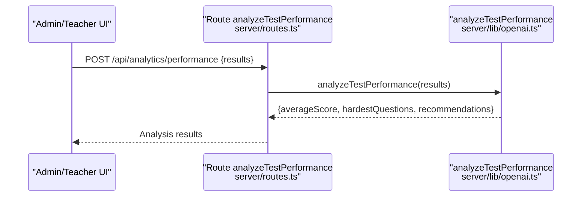
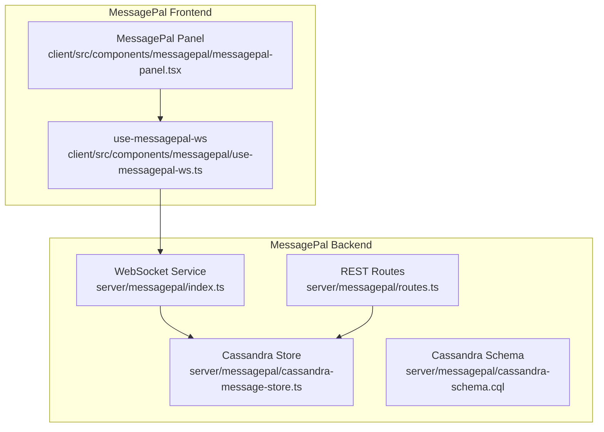
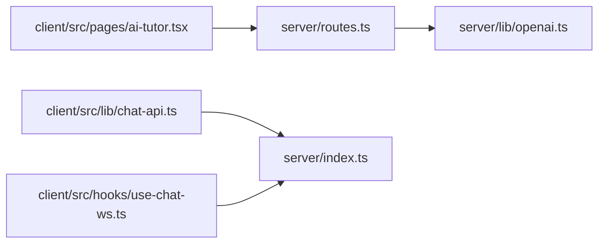

# AI-Powered Features

<cite>
**Referenced Files in This Document**
- [README.md](file://README.md)
- [server/lib/openai.ts](file://server/lib/openai.ts)
- [server/routes.ts](file://server/routes.ts)
- [server/index.ts](file://server/index.ts)
- [client/src/pages/ai-tutor.tsx](file://client/src/pages/ai-tutor.tsx)
- [client/src/hooks/use-chat-ws.ts](file://client/src/hooks/use-chat-ws.ts)
- [client/src/lib/chat-api.ts](file://client/src/lib/chat-api.ts)
- [MESSAGEPAL_IMPLEMENTATION_SUMMARY.md](file://MESSAGEPAL_IMPLEMENTATION_SUMMARY.md)
- [message_pal.md](file://message_pal.md)
- [.env.example](file://.env.example)
</cite>

## Table of Contents
1. [Introduction](#introduction)
2. [Project Structure](#project-structure)
3. [Core Components](#core-components)
4. [Architecture Overview](#architecture-overview)
5. [Detailed Component Analysis](#detailed-component-analysis)
6. [Dependency Analysis](#dependency-analysis)
7. [Performance Considerations](#performance-considerations)
8. [Troubleshooting Guide](#troubleshooting-guide)
9. [Conclusion](#conclusion)
10. [Appendices](#appendices)

## Introduction
This document explains the AI-powered features of PersonalLearningPro, focusing on the OpenAI integration for the AI tutor, intelligent test creation, automated answer evaluation, and performance analysis. It documents the AI assistant chat interface, conversation context management, and response generation. It also covers the performance analytics system using AI insights for learning pattern recognition, API integration patterns, prompt engineering strategies, response handling, model selection, cost optimization, fallback mechanisms, and the MessagePal AI framework implementation within the platform.

## Project Structure
The AI capabilities are implemented across the backend server and the React frontend:
- Backend exposes REST endpoints and integrates OpenAI for chat, evaluation, study plan generation, and performance analysis.
- Frontend provides the AI tutor chat UI and integrates with the backend via HTTP requests and WebSocket for real-time messaging (MessagePal).
- Environment variables configure OpenAI access keys and session secrets.

**Diagram sources**
- [client/src/pages/ai-tutor.tsx](file://client/src/pages/ai-tutor.tsx#L1-L604)
- [client/src/hooks/use-chat-ws.ts](file://client/src/hooks/use-chat-ws.ts#L1-L218)
- [client/src/lib/chat-api.ts](file://client/src/lib/chat-api.ts#L1-L112)
- [server/routes.ts](file://server/routes.ts#L1-L1104)
- [server/lib/openai.ts](file://server/lib/openai.ts#L1-L217)
- [server/index.ts](file://server/index.ts#L1-L114)
- [.env.example](file://.env.example)

**Section sources**
- [README.md](file://README.md#L1-L148)
- [server/lib/openai.ts](file://server/lib/openai.ts#L1-L217)
- [server/routes.ts](file://server/routes.ts#L1-L1104)
- [server/index.ts](file://server/index.ts#L1-L114)
- [client/src/pages/ai-tutor.tsx](file://client/src/pages/ai-tutor.tsx#L1-L604)
- [client/src/hooks/use-chat-ws.ts](file://client/src/hooks/use-chat-ws.ts#L1-L218)
- [client/src/lib/chat-api.ts](file://client/src/lib/chat-api.ts#L1-L112)
- [.env.example](file://.env.example)

## Core Components
- OpenAI integration module encapsulates:
  - AI chat with system prompt injection
  - Subjective answer evaluation with JSON response parsing and bounds checking
  - Study plan generation with JSON schema enforcement
  - Test performance analysis with JSON schema enforcement
- REST routes expose:
  - AI chat endpoint for interactive tutoring
  - AI evaluation endpoint for teacher-driven grading
  - Integration points for OCR and test management
- AI tutor page manages:
  - Conversation history persisted in local storage
  - Message composition and submission to backend
  - Tabbed workflows for explain, solve, and visualize
- MessagePal framework provides:
  - Real-time messaging with WebSocket and HTTP fallback
  - Persistent storage using Cassandra
  - Role-based communication and read receipts

**Section sources**
- [server/lib/openai.ts](file://server/lib/openai.ts#L1-L217)
- [server/routes.ts](file://server/routes.ts#L487-L580)
- [client/src/pages/ai-tutor.tsx](file://client/src/pages/ai-tutor.tsx#L1-L604)
- [MESSAGEPAL_IMPLEMENTATION_SUMMARY.md](file://MESSAGEPAL_IMPLEMENTATION_SUMMARY.md#L1-L135)
- [message_pal.md](file://message_pal.md#L1-L494)

## Architecture Overview
The AI features integrate with the broader platform as follows:
- AI tutor chat uses a dedicated endpoint that forwards messages to OpenAI and returns natural language responses.
- Automated evaluation leverages OpenAI to score subjective answers and provide feedback, with robust fallbacks.
- Performance analytics uses OpenAI to analyze aggregated test results and produce actionable recommendations.
- MessagePal provides real-time communication channels for student-teacher and administrative interactions, complementing AI tutoring.

**Diagram sources**
- [client/src/pages/ai-tutor.tsx](file://client/src/pages/ai-tutor.tsx#L122-L191)
- [server/routes.ts](file://server/routes.ts#L561-L580)
- [server/lib/openai.ts](file://server/lib/openai.ts#L20-L42)

## Detailed Component Analysis

### OpenAI Integration Module
The OpenAI integration module centralizes AI capabilities:
- Model selection: gpt-4o is configured as the default model.
- Chat completions: injects a system prompt if none is provided.
- Evaluation: enforces JSON output with bounded score and confidence values.
- Study plan: returns structured plan and resources in JSON.
- Performance analysis: returns average score, hardest questions, and recommendations in JSON.
- Fallbacks: gracefully handle AI failures with sensible defaults.

**Diagram sources**
- [server/lib/openai.ts](file://server/lib/openai.ts#L50-L105)

**Section sources**
- [server/lib/openai.ts](file://server/lib/openai.ts#L1-L217)

### AI Chat Endpoint and UI
The AI chat endpoint and UI coordinate:
- Endpoint: validates messages array and delegates to the OpenAI module.
- UI: maintains conversation history in local storage, composes messages, and displays assistant responses.
- Prompt engineering: system prompt tailored for high school-level explanations.

**Diagram sources**
- [client/src/pages/ai-tutor.tsx](file://client/src/pages/ai-tutor.tsx#L122-L191)
- [server/routes.ts](file://server/routes.ts#L561-L580)
- [server/lib/openai.ts](file://server/lib/openai.ts#L20-L42)

**Section sources**
- [server/routes.ts](file://server/routes.ts#L561-L580)
- [client/src/pages/ai-tutor.tsx](file://client/src/pages/ai-tutor.tsx#L1-L604)
- [server/lib/openai.ts](file://server/lib/openai.ts#L20-L42)

### Automated Answer Evaluation
The evaluation endpoint:
- Validates teacher permissions and test ownership.
- Retrieves associated question rubric and marks.
- Calls the evaluation function and updates the answer with score, confidence, and feedback.
- Provides a fallback evaluation on failure.

**Diagram sources**
- [server/routes.ts](file://server/routes.ts#L487-L559)
- [server/lib/openai.ts](file://server/lib/openai.ts#L50-L105)

**Section sources**
- [server/routes.ts](file://server/routes.ts#L487-L559)
- [server/lib/openai.ts](file://server/lib/openai.ts#L50-L105)

### Performance Analytics
The performance analysis endpoint:
- Aggregates test results and calls the analysis function.
- Returns average score, the hardest questions, and recommendations.
- Includes JSON schema enforcement and fallback computation.

**Diagram sources**
- [server/lib/openai.ts](file://server/lib/openai.ts#L165-L216)

**Section sources**
- [server/lib/openai.ts](file://server/lib/openai.ts#L165-L216)

### MessagePal AI Framework
MessagePal provides a real-time messaging backbone:
- WebSocket service with authentication, typing indicators, read receipts, and persistent storage.
- REST API endpoints for conversations and message history.
- Cassandra-backed storage with materialized views for efficient queries.
- Frontend components and hooks for seamless integration.

**Diagram sources**
- [MESSAGEPAL_IMPLEMENTATION_SUMMARY.md](file://MESSAGEPAL_IMPLEMENTATION_SUMMARY.md#L1-L135)
- [message_pal.md](file://message_pal.md#L1-L494)

**Section sources**
- [MESSAGEPAL_IMPLEMENTATION_SUMMARY.md](file://MESSAGEPAL_IMPLEMENTATION_SUMMARY.md#L1-L135)
- [message_pal.md](file://message_pal.md#L1-L494)

## Dependency Analysis
- Backend depends on:
  - OpenAI SDK for chat completions and JSON response parsing.
  - Express routes for API exposure.
  - Session middleware for authentication.
- Frontend depends on:
  - HTTP client for REST messaging.
  - WebSocket hook for real-time chat.
  - Local storage for AI tutor conversation persistence.

**Diagram sources**
- [client/src/pages/ai-tutor.tsx](file://client/src/pages/ai-tutor.tsx#L1-L604)
- [server/routes.ts](file://server/routes.ts#L1-L1104)
- [server/lib/openai.ts](file://server/lib/openai.ts#L1-L217)
- [client/src/lib/chat-api.ts](file://client/src/lib/chat-api.ts#L1-L112)
- [client/src/hooks/use-chat-ws.ts](file://client/src/hooks/use-chat-ws.ts#L1-L218)
- [server/index.ts](file://server/index.ts#L1-L114)

**Section sources**
- [server/routes.ts](file://server/routes.ts#L1-L1104)
- [server/lib/openai.ts](file://server/lib/openai.ts#L1-L217)
- [server/index.ts](file://server/index.ts#L1-L114)
- [client/src/pages/ai-tutor.tsx](file://client/src/pages/ai-tutor.tsx#L1-L604)
- [client/src/lib/chat-api.ts](file://client/src/lib/chat-api.ts#L1-L112)
- [client/src/hooks/use-chat-ws.ts](file://client/src/hooks/use-chat-ws.ts#L1-L218)

## Performance Considerations
- Model selection: gpt-4o balances quality and cost for most tasks.
- Prompt engineering: system prompts guide tone, domain expertise, and output format.
- Response handling: enforce JSON output format and bounds checking to avoid downstream errors.
- Fallback mechanisms: return sensible defaults when AI services are unavailable.
- Cost optimization: minimize token usage by trimming context and using concise prompts.
- Storage and caching: leverage local storage for UI state and Cassandra for durable message history.

[No sources needed since this section provides general guidance]

## Troubleshooting Guide
Common issues and resolutions:
- Missing OpenAI API key: The integration warns when the key is not set. Ensure the environment variable is configured.
- AI chat errors: The endpoint catches and surfaces errors; verify network connectivity and API limits.
- Evaluation failures: The evaluation function returns fallback values; inspect logs for underlying causes.
- Session errors: Ensure session middleware is configured and cookies are accepted by the browser.
- WebSocket reconnection: The chat hook implements exponential backoff; unauthorized closures prevent reconnection.

**Section sources**
- [server/lib/openai.ts](file://server/lib/openai.ts#L3-L9)
- [server/routes.ts](file://server/routes.ts#L561-L580)
- [client/src/hooks/use-chat-ws.ts](file://client/src/hooks/use-chat-ws.ts#L144-L157)

## Conclusion
PersonalLearningPro’s AI-powered features combine OpenAI-driven chat, evaluation, study planning, and performance analysis with a robust real-time messaging framework. The system emphasizes prompt engineering, structured JSON responses, and resilient fallbacks to ensure reliability. MessagePal complements these capabilities with scalable, role-based communication channels.

[No sources needed since this section summarizes without analyzing specific files]

## Appendices

### API Integration Patterns
- AI Chat: POST /api/ai-chat with messages array; returns assistant content.
- AI Evaluation: POST /api/evaluate with answerId; returns score, confidence, and feedback.
- Messaging REST: Fetch channels, DMs, and messages; upload files.
- WebSocket: Connect to real-time chat with typed events and presence.

**Section sources**
- [server/routes.ts](file://server/routes.ts#L561-L580)
- [client/src/lib/chat-api.ts](file://client/src/lib/chat-api.ts#L1-L112)
- [client/src/hooks/use-chat-ws.ts](file://client/src/hooks/use-chat-ws.ts#L1-L218)

### Prompt Engineering Strategies
- System prompts define persona, domain expertise, and output expectations.
- JSON response format requests improve parsing reliability.
- Bounds checking ensures numeric values remain within expected ranges.

**Section sources**
- [server/lib/openai.ts](file://server/lib/openai.ts#L20-L42)
- [server/lib/openai.ts](file://server/lib/openai.ts#L50-L105)
- [server/lib/openai.ts](file://server/lib/openai.ts#L107-L163)
- [server/lib/openai.ts](file://server/lib/openai.ts#L165-L216)

### Environment Configuration
- OPENAI_API_KEY: Enables AI features.
- SESSION_SECRET: Secures sessions in production.

**Section sources**
- [.env.example](file://.env.example)