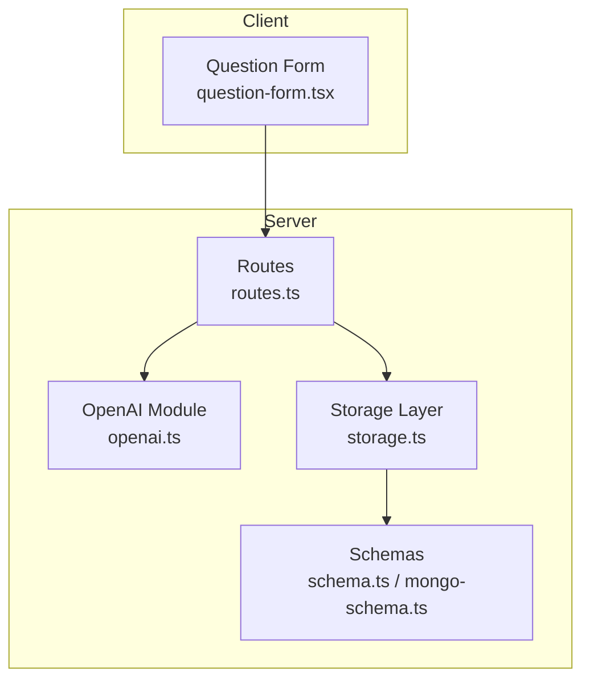
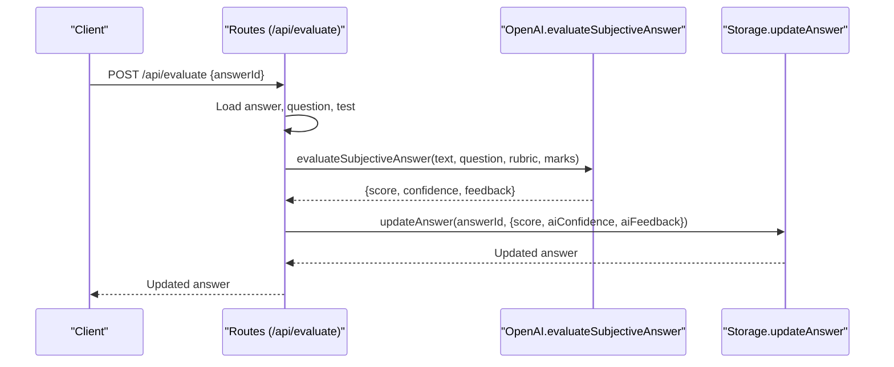
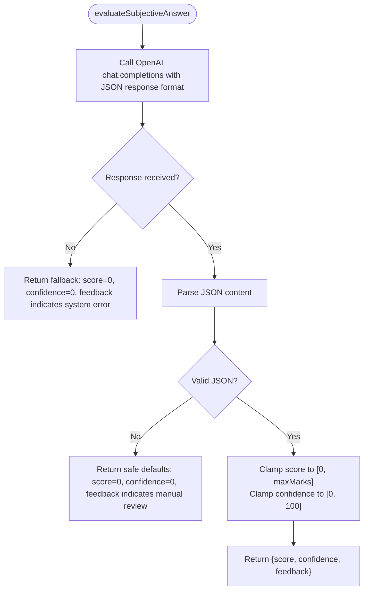
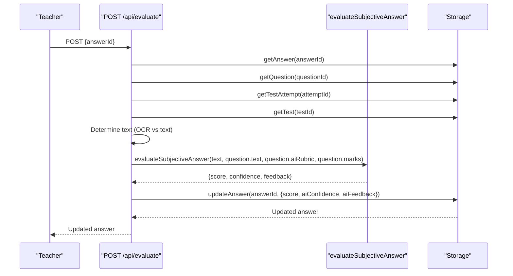
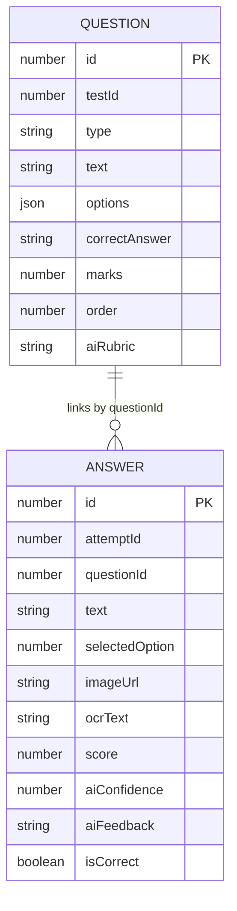
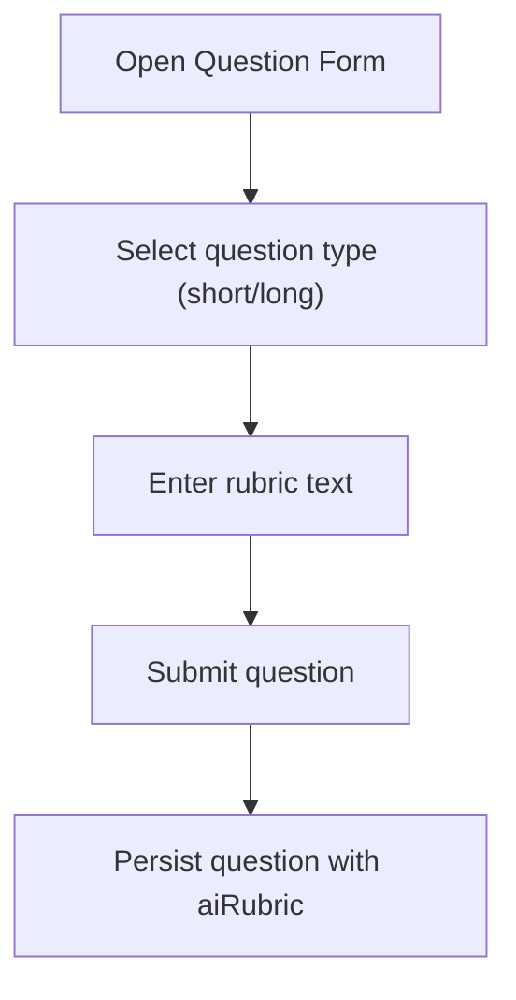
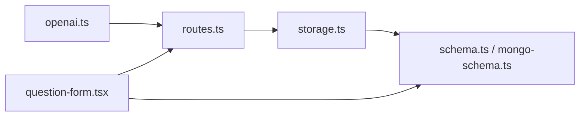

# Automated Answer Evaluation

<cite>
**Referenced Files in This Document**
- [openai.ts](file://server/lib/openai.ts)
- [routes.ts](file://server/routes.ts)
- [schema.ts](file://shared/schema.ts)
- [mongo-schema.ts](file://shared/mongo-schema.ts)
- [storage.ts](file://server/storage.ts)
- [question-form.tsx](file://client/src/components/test/question-form.tsx)
- [routes.ts](file://server/message/routes.ts)
</cite>

## Table of Contents
1. [Introduction](#introduction)
2. [Project Structure](#project-structure)
3. [Core Components](#core-components)
4. [Architecture Overview](#architecture-overview)
5. [Detailed Component Analysis](#detailed-component-analysis)
6. [Dependency Analysis](#dependency-analysis)
7. [Performance Considerations](#performance-considerations)
8. [Troubleshooting Guide](#troubleshooting-guide)
9. [Conclusion](#conclusion)
10. [Appendices](#appendices)

## Introduction
This document describes the automated answer evaluation system designed to evaluate subjective student answers using OpenAI's JSON response format. It covers the evaluation rubric integration, scoring and confidence calculation, feedback generation, manual override capabilities, and quality assurance measures. It also includes examples of evaluation prompts, rubric formatting requirements, score validation logic, edge cases, error handling, and fallback strategies when AI services are unavailable.

## Project Structure
The evaluation system spans backend services, routing, data validation, persistence, and client-side forms:
- Backend AI and evaluation logic: server/lib/openai.ts
- Routes for evaluation and related APIs: server/routes.ts
- Shared data schemas and validation: shared/schema.ts and shared/mongo-schema.ts
- Data access layer: server/storage.ts
- Client-side rubric input: client/src/components/test/question-form.tsx
- Message/chat routes (context): server/message/routes.ts

**Diagram sources**
- [routes.ts](file://server/routes.ts#L487-L559)
- [openai.ts](file://server/lib/openai.ts#L50-L105)
- [schema.ts](file://shared/schema.ts#L28-L59)
- [mongo-schema.ts](file://shared/mongo-schema.ts#L40-L74)
- [question-form.tsx](file://client/src/components/test/question-form.tsx#L354-L372)

**Section sources**
- [routes.ts](file://server/routes.ts#L1-L1104)
- [openai.ts](file://server/lib/openai.ts#L1-L217)
- [schema.ts](file://shared/schema.ts#L1-L142)
- [mongo-schema.ts](file://shared/mongo-schema.ts#L1-L159)
- [question-form.tsx](file://client/src/components/test/question-form.tsx#L1-L390)

## Core Components
- OpenAI evaluation function: Implements JSON-object response parsing, range validation, and robust fallbacks.
- Evaluation route: Orchestrates retrieval of answer, question, and test context, then triggers AI evaluation and persists results.
- Data schemas: Define rubric storage on questions and AI evaluation fields on answers.
- Storage layer: Provides CRUD operations for answers, including updates with AI-generated score, confidence, and feedback.
- Client form: Enables teachers to input rubrics for subjective questions.

Key responsibilities:
- Subjective answer scoring with confidence and feedback
- Rubric integration and prompt construction
- Score validation and bounds enforcement
- Fallback handling for AI failures
- Manual override capability via teacher evaluation endpoint

**Section sources**
- [openai.ts](file://server/lib/openai.ts#L50-L105)
- [routes.ts](file://server/routes.ts#L487-L559)
- [schema.ts](file://shared/schema.ts#L28-L59)
- [mongo-schema.ts](file://shared/mongo-schema.ts#L40-L74)
- [storage.ts](file://server/storage.ts#L241-L262)
- [question-form.tsx](file://client/src/components/test/question-form.tsx#L354-L372)

## Architecture Overview
The evaluation pipeline integrates client input, server routes, OpenAI API, and persistent storage.

**Diagram sources**
- [routes.ts](file://server/routes.ts#L487-L559)
- [openai.ts](file://server/lib/openai.ts#L50-L105)
- [storage.ts](file://server/storage.ts#L259-L262)

## Detailed Component Analysis

### OpenAI Evaluation Module
Responsibilities:
- Build a teacher persona system prompt that requires JSON output with score, confidence, and feedback.
- Accept student answer, question text, rubric, and maximum marks.
- Enforce numeric bounds for score and confidence.
- Parse and validate JSON response; on failure, return safe defaults.
- On AI errors, return fallback zero-score with explicit feedback.

Scoring and confidence:
- Score is validated to lie within [0, maxMarks].
- Confidence is validated to lie within [0, 100].
- Feedback is preserved as-is from AI response.

Fallback behavior:
- On JSON parse errors: score=0, confidence=0, feedback indicates manual review.
- On AI errors: score=0, confidence=0, feedback indicates system error.

**Diagram sources**
- [openai.ts](file://server/lib/openai.ts#L50-L105)

**Section sources**
- [openai.ts](file://server/lib/openai.ts#L50-L105)

### Evaluation Route
Responsibilities:
- Authenticate and authorize teacher requests.
- Retrieve answer, question, test attempt, and test.
- Determine text source: prefer OCR text if present, otherwise original answer text.
- Invoke AI evaluation with question text, rubric, and maximum marks.
- Persist AI-generated score, confidence, and feedback to the answer record.

Manual override:
- Teachers can call the evaluation endpoint to refresh AI results at any time.
- The route enforces ownership: only the test’s teacher can evaluate.

**Diagram sources**
- [routes.ts](file://server/routes.ts#L487-L559)
- [openai.ts](file://server/lib/openai.ts#L50-L105)
- [storage.ts](file://server/storage.ts#L259-L262)

**Section sources**
- [routes.ts](file://server/routes.ts#L487-L559)

### Data Model and Validation
- Question schema supports an optional rubric field used for AI evaluation.
- Answer schema includes optional fields for AI-generated score, confidence, and feedback.
- Zod validation ensures incoming data conforms to expected shapes.

**Diagram sources**
- [schema.ts](file://shared/schema.ts#L28-L59)
- [mongo-schema.ts](file://shared/mongo-schema.ts#L40-L74)

**Section sources**
- [schema.ts](file://shared/schema.ts#L28-L59)
- [mongo-schema.ts](file://shared/mongo-schema.ts#L40-L74)

### Client Rubric Input
Teachers use the question creation form to define rubrics for short and long answer questions. The rubric is stored on the question and later used by the evaluation route.

**Diagram sources**
- [question-form.tsx](file://client/src/components/test/question-form.tsx#L354-L372)

**Section sources**
- [question-form.tsx](file://client/src/components/test/question-form.tsx#L354-L372)

## Dependency Analysis
- Routes depend on OpenAI module for evaluation and on Storage for data access.
- Storage depends on shared schemas for validation and persistence.
- Client form depends on shared schema types for rubric input.

**Diagram sources**
- [openai.ts](file://server/lib/openai.ts#L1-L217)
- [routes.ts](file://server/routes.ts#L1-L1104)
- [storage.ts](file://server/storage.ts#L1-L519)
- [schema.ts](file://shared/schema.ts#L1-L142)
- [mongo-schema.ts](file://shared/mongo-schema.ts#L1-L159)
- [question-form.tsx](file://client/src/components/test/question-form.tsx#L1-L390)

**Section sources**
- [openai.ts](file://server/lib/openai.ts#L1-L217)
- [routes.ts](file://server/routes.ts#L1-L1104)
- [storage.ts](file://server/storage.ts#L1-L519)
- [schema.ts](file://shared/schema.ts#L1-L142)
- [mongo-schema.ts](file://shared/mongo-schema.ts#L1-L159)
- [question-form.tsx](file://client/src/components/test/question-form.tsx#L1-L390)

## Performance Considerations
- JSON response format reduces parsing overhead and improves reliability.
- Range clamping prevents invalid values from persisting.
- Fallbacks avoid blocking the evaluation pipeline during AI outages.
- Consider caching rubrics and frequently used prompts to reduce repeated AI calls.

## Troubleshooting Guide
Common issues and resolutions:
- AI service unavailable or returns non-JSON: The evaluation function returns fallback values and logs an error. Teachers can retry or review manually.
- Malformed rubric: Ensure rubric text is clear and specific. The system passes it directly to the AI; ambiguous rubrics yield inconsistent evaluations.
- Score out of range: The evaluation function clamps scores to [0, maxMarks]; verify question marks and rubric expectations align.
- Missing OCR text: If OCR fails, the system falls back to the original answer text. Verify OCR preprocessing steps if needed.
- Authorization errors: Only the test’s teacher can evaluate answers; ensure the session role and ownership checks pass.

Quality assurance measures:
- JSON response format enforced on OpenAI calls.
- Strict range validation for score and confidence.
- Centralized error logging for AI evaluation failures.
- Manual override capability via teacher-initiated evaluation.

**Section sources**
- [openai.ts](file://server/lib/openai.ts#L50-L105)
- [routes.ts](file://server/routes.ts#L487-L559)

## Conclusion
The automated answer evaluation system integrates teacher-defined rubrics with OpenAI’s JSON response format to produce reliable scores, confidence levels, and feedback. Robust validation, bounds enforcement, and fallback strategies ensure resilience. Teachers retain manual override capabilities, enabling quality control and correction when needed.

## Appendices

### Evaluation Prompt Example
- System prompt instructs the AI to return JSON containing score, confidence, and feedback aligned with the provided rubric and question.
- User prompt includes the question text, rubric, and student answer.

**Section sources**
- [openai.ts](file://server/lib/openai.ts#L50-L105)

### Rubric Formatting Requirements
- Short and long answer questions support an optional rubric.
- The rubric should clearly specify criteria, weighting, and expectations.
- Store rubric via the question creation form; it is retrieved during evaluation.

**Section sources**
- [schema.ts](file://shared/schema.ts#L28-L37)
- [question-form.tsx](file://client/src/components/test/question-form.tsx#L354-L372)

### Score Validation Logic
- Clamp score to [0, maxMarks].
- Clamp confidence to [0, 100].
- On JSON parse failure, return safe defaults and log the error.

**Section sources**
- [openai.ts](file://server/lib/openai.ts#L78-L105)

### Edge Cases and Error Handling
- Missing session or unauthorized role: route returns 401/403.
- Answer or question not found: route returns 404.
- AI errors: route returns fallback values and logs an error.
- JSON parse errors: route returns safe defaults and logs an error.

**Section sources**
- [routes.ts](file://server/routes.ts#L487-L559)
- [openai.ts](file://server/lib/openai.ts#L96-L105)

### Fallback Evaluation Strategies
- Zero-score with explicit feedback when AI is unavailable.
- Teachers can re-evaluate answers to refresh AI results.
- OCR text fallback ensures evaluation proceeds even if original text is missing.

**Section sources**
- [routes.ts](file://server/routes.ts#L533-L546)
- [openai.ts](file://server/lib/openai.ts#L96-L105)