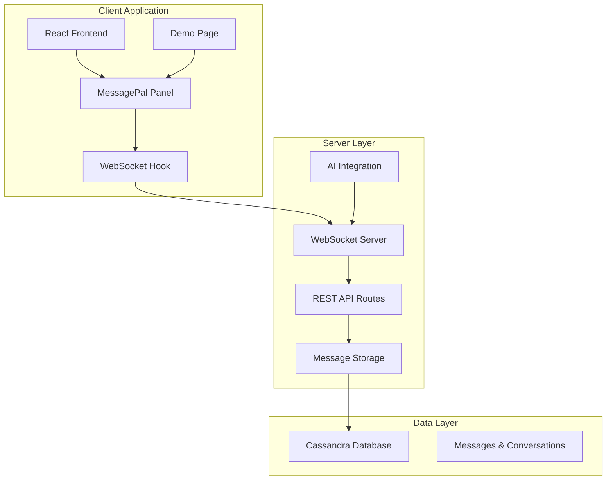
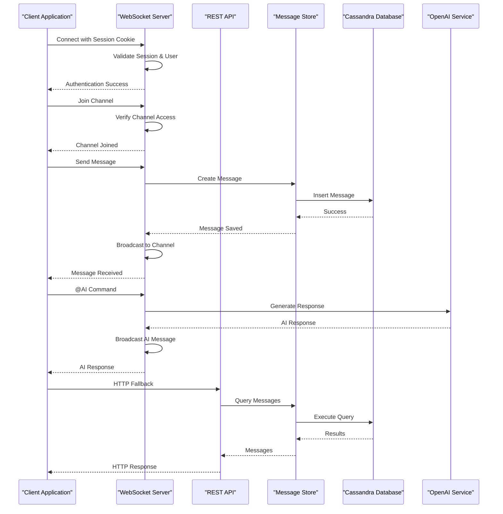
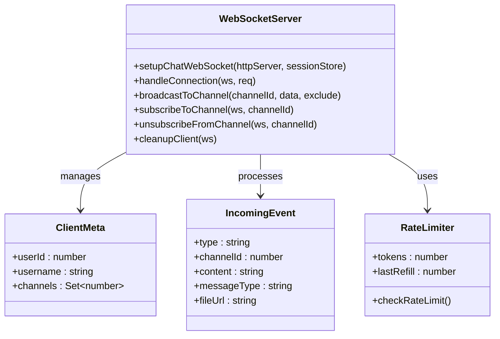
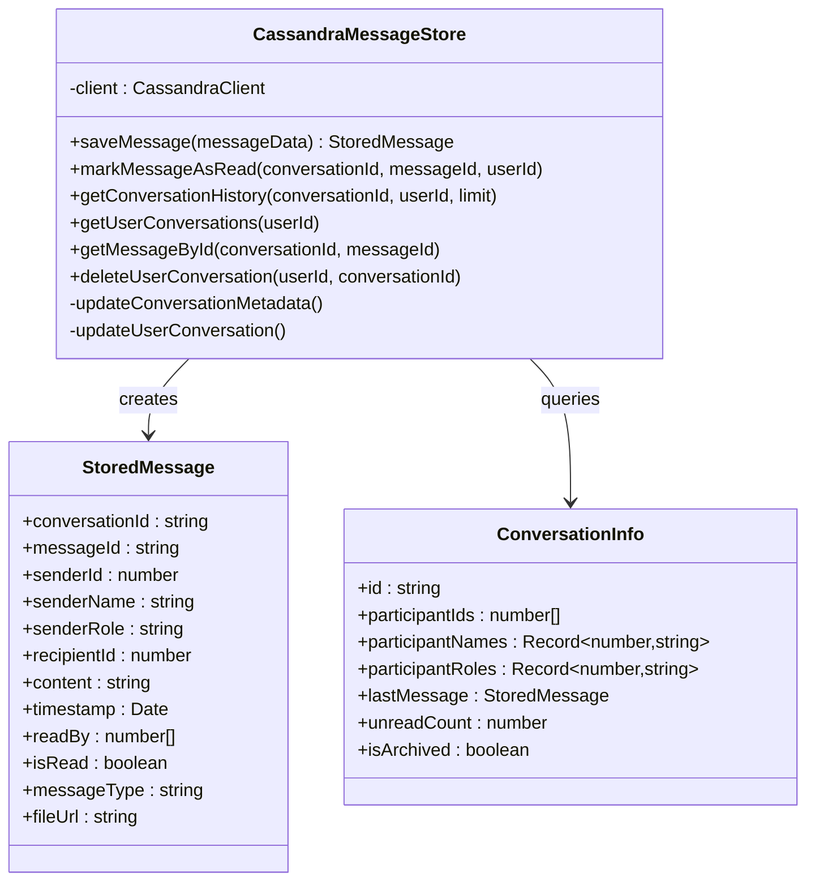
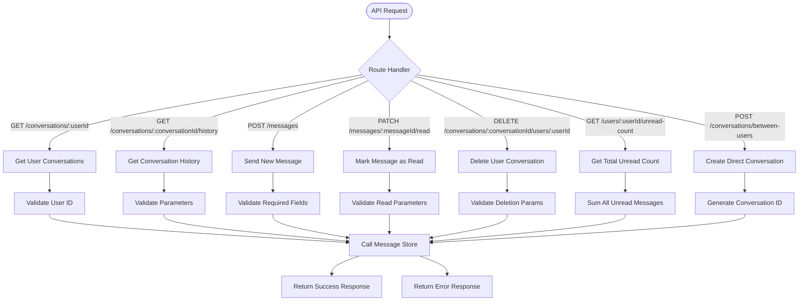
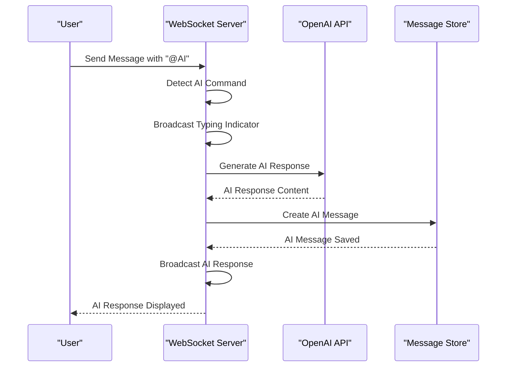
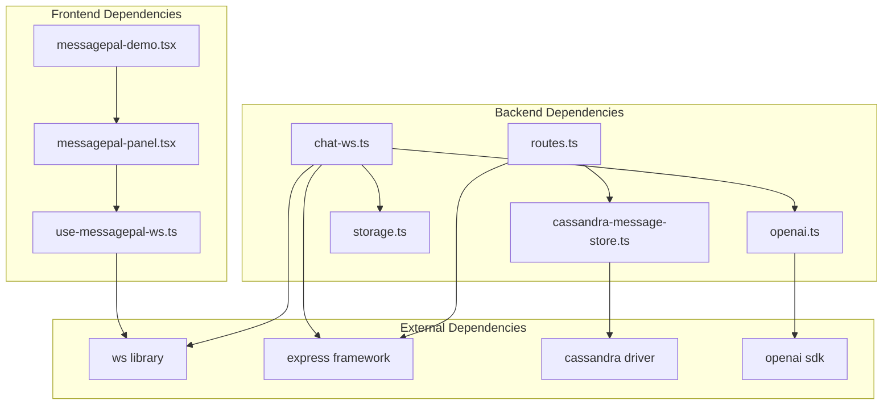
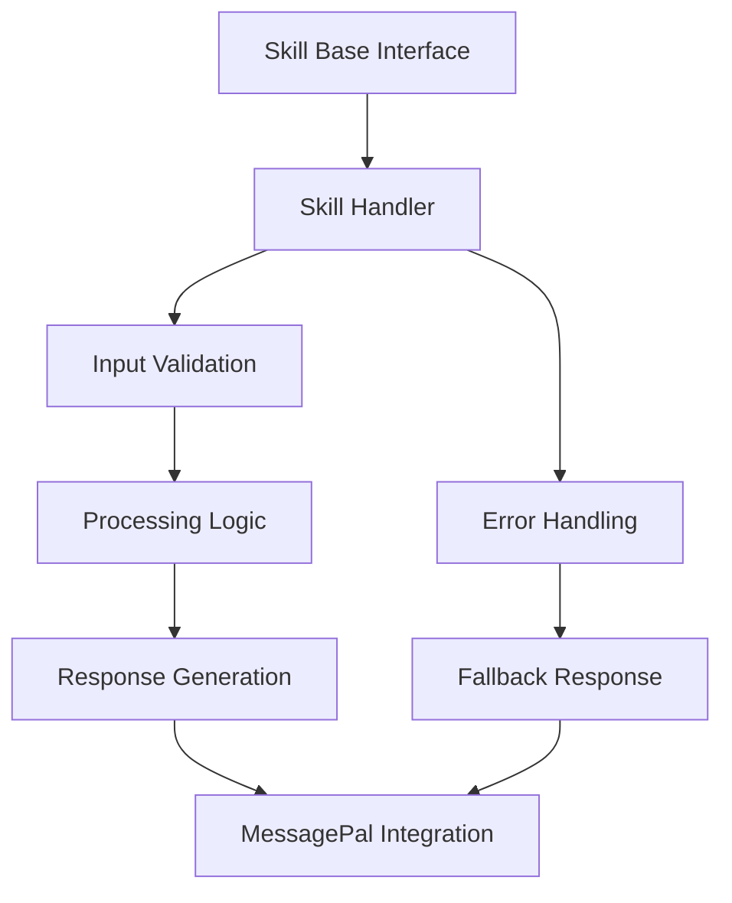

# MessagePal AI Framework

<cite>
**Referenced Files in This Document**
- [README.md](file://README.md)
- [MESSAGEPAL_IMPLEMENTATION_SUMMARY.md](file://MESSAGEPAL_IMPLEMENTATION_SUMMARY.md)
- [message_pal.md](file://message_pal.md)
- [GEMINI.md](file://GEMINI.md)
- [server/messagepal/cassandra-message-store.ts](file://server/messagepal/cassandra-message-store.ts)
- [server/messagepal/routes.ts](file://server/messagepal/routes.ts)
- [server/chat-ws.ts](file://server/chat-ws.ts)
- [server/lib/openai.ts](file://server/lib/openai.ts)
- [client/src/pages/messagepal-demo.tsx](file://client/src/pages/messagepal-demo.tsx)
- [client/src/components/messagepal/messagepal-panel.tsx](file://client/src/components/messagepal/messagepal-panel.tsx)
- [client/src/components/messagepal/use-messagepal-ws.ts](file://client/src/components/messagepal/use-messagepal-ws.ts)
- [server/index.ts](file://server/index.ts)
- [server/routes.ts](file://server/routes.ts)
- [server/storage.ts](file://server/storage.ts)
</cite>

## Table of Contents
1. [Introduction](#introduction)
2. [Project Structure](#project-structure)
3. [Core Components](#core-components)
4. [Architecture Overview](#architecture-overview)
5. [Detailed Component Analysis](#detailed-component-analysis)
6. [Dependency Analysis](#dependency-analysis)
7. [Performance Considerations](#performance-considerations)
8. [Security Considerations](#security-considerations)
9. [Configuration and Integration](#configuration-and-integration)
10. [Custom Skill Development](#custom-skill-development)
11. [Troubleshooting Guide](#troubleshooting-guide)
12. [Conclusion](#conclusion)

## Introduction
MessagePal is an AI-powered real-time messaging framework integrated into the PersonalLearningPro educational platform. It provides secure, scalable communication between students, teachers, parents, and administrators with AI assistance capabilities. The framework combines WebSocket-based real-time messaging with persistent storage, offering features like typing indicators, read receipts, conversation history, and AI tutoring integration.

The system is designed for educational environments with role-based communication patterns, supporting both one-on-one and group conversations. It leverages Apache Cassandra for high-write throughput messaging and integrates with OpenAI's GPT models for AI-powered assistance.

## Project Structure
The MessagePal implementation follows a modular architecture with clear separation between frontend components, backend services, and storage layers.

**Diagram sources**
- [client/src/pages/messagepal-demo.tsx](file://client/src/pages/messagepal-demo.tsx#L1-L18)
- [server/chat-ws.ts](file://server/chat-ws.ts#L119-L393)
- [server/messagepal/routes.ts](file://server/messagepal/routes.ts#L1-L194)

The project structure consists of three main layers:
- **Frontend Layer**: React components with WebSocket integration for real-time messaging
- **Backend Layer**: Express.js server with WebSocket and REST API endpoints
- **Data Layer**: Cassandra database with optimized schemas for messaging patterns

**Section sources**
- [README.md](file://README.md#L70-L102)
- [MESSAGEPAL_IMPLEMENTATION_SUMMARY.md](file://MESSAGEPAL_IMPLEMENTATION_SUMMARY.md#L7-L17)

## Core Components
The MessagePal framework comprises several core components working together to provide a comprehensive messaging solution:

### WebSocket Messaging Service
The WebSocket service handles real-time communication with session-based authentication, channel management, and AI integration capabilities.

### Message Storage System
A Cassandra-based storage system providing durable message persistence with conversation tracking and user relationship management.

### REST API Layer
HTTP endpoints for non-real-time operations, allowing integration with traditional web applications and fallback scenarios.

### AI Assistant Integration
OpenAI integration enabling AI-powered responses, tutoring assistance, and automated content generation within conversations.

**Section sources**
- [MESSAGEPAL_IMPLEMENTATION_SUMMARY.md](file://MESSAGEPAL_IMPLEMENTATION_SUMMARY.md#L19-L55)

## Architecture Overview
The MessagePal architecture implements a hybrid real-time and HTTP-based communication pattern optimized for educational environments.

**Diagram sources**
- [server/chat-ws.ts](file://server/chat-ws.ts#L122-L393)
- [server/messagepal/routes.ts](file://server/messagepal/routes.ts#L73-L109)
- [server/messagepal/cassandra-message-store.ts](file://server/messagepal/cassandra-message-store.ts#L39-L102)

The architecture supports both primary WebSocket communication and HTTP REST API fallback, ensuring compatibility with various client implementations and network conditions.

**Section sources**
- [message_pal.md](file://message_pal.md#L150-L256)
- [MESSAGEPAL_IMPLEMENTATION_SUMMARY.md](file://MESSAGEPAL_IMPLEMENTATION_SUMMARY.md#L81-L104)

## Detailed Component Analysis

### WebSocket Messaging Service
The WebSocket service provides real-time bidirectional communication with comprehensive session management and channel-based message routing.

**Diagram sources**
- [server/chat-ws.ts](file://server/chat-ws.ts#L13-L26)
- [server/chat-ws.ts](file://server/chat-ws.ts#L119-L393)

The service implements:
- **Session-based Authentication**: Validates user identity through Express session cookies
- **Channel Management**: Supports one-on-one and group conversations with proper access control
- **Rate Limiting**: Prevents message flooding with token-based rate limiting
- **Heartbeat Monitoring**: Detects and cleans up inactive connections
- **AI Integration**: Processes "@AI" commands for AI-powered responses

**Section sources**
- [server/chat-ws.ts](file://server/chat-ws.ts#L94-L150)
- [server/chat-ws.ts](file://server/chat-ws.ts#L248-L334)

### Message Storage System
The Cassandra-based storage system provides high-throughput message persistence with optimized queries for conversation management.

**Diagram sources**
- [server/messagepal/cassandra-message-store.ts](file://server/messagepal/cassandra-message-store.ts#L29-L310)

Key storage features include:
- **Message Persistence**: Atomic message insertion with conversation metadata updates
- **Read Receipts**: Track message read status across multiple recipients
- **Conversation Tracking**: Maintain user conversation lists with unread counts
- **History Retrieval**: Efficient querying of message history with pagination
- **User Management**: Individual conversation deletion per user

**Section sources**
- [server/messagepal/cassandra-message-store.ts](file://server/messagepal/cassandra-message-store.ts#L39-L102)
- [server/messagepal/cassandra-message-store.ts](file://server/messagepal/cassandra-message-store.ts#L164-L196)

### REST API Layer
The REST API provides HTTP endpoints for non-real-time operations and system integration.

**Diagram sources**
- [server/messagepal/routes.ts](file://server/messagepal/routes.ts#L7-L194)

**Section sources**
- [server/messagepal/routes.ts](file://server/messagepal/routes.ts#L7-L21)
- [server/messagepal/routes.ts](file://server/messagepal/routes.ts#L23-L44)
- [server/messagepal/routes.ts](file://server/messagepal/routes.ts#L72-L109)

### AI Assistant Integration
The AI integration enables intelligent conversation assistance through OpenAI's GPT models.

**Diagram sources**
- [server/chat-ws.ts](file://server/chat-ws.ts#L299-L334)
- [server/lib/openai.ts](file://server/lib/openai.ts#L20-L42)

**Section sources**
- [server/lib/openai.ts](file://server/lib/openai.ts#L20-L42)
- [server/chat-ws.ts](file://server/chat-ws.ts#L299-L334)

## Dependency Analysis
The MessagePal framework exhibits clear dependency relationships with well-defined interfaces between components.

**Diagram sources**
- [client/src/components/messagepal/messagepal-panel.tsx](file://client/src/components/messagepal/messagepal-panel.tsx)
- [client/src/components/messagepal/use-messagepal-ws.ts](file://client/src/components/messagepal/use-messagepal-ws.ts)
- [server/chat-ws.ts](file://server/chat-ws.ts#L1-L10)
- [server/messagepal/cassandra-message-store.ts](file://server/messagepal/cassandra-message-store.ts#L1)

**Section sources**
- [server/index.ts](file://server/index.ts)
- [server/routes.ts](file://server/routes.ts)

The dependency analysis reveals:
- **Frontend**: Minimal external dependencies with React and WebSocket integration
- **Backend**: Well-separated concerns with clear interfaces between WebSocket, REST, and storage layers
- **External Systems**: Standard libraries with minimal coupling to specific implementations

## Performance Considerations
The MessagePal framework implements several performance optimization strategies:

### Connection Management
- **WebSocket Pooling**: Maintains persistent connections for real-time communication
- **Heartbeat Mechanism**: Detects and cleans up inactive connections automatically
- **Channel-based Broadcasting**: Efficient message distribution to subscribed clients

### Storage Optimization
- **Cassandra Clustering**: Optimized partition keys for high-write throughput
- **Materialized Views**: Pre-computed queries for common access patterns
- **Connection Pooling**: Database connection reuse for improved throughput

### Rate Limiting
- **Token-based Rate Control**: Prevents message flooding with configurable limits
- **Per-connection Limits**: Individual client rate limiting prevents abuse
- **Dynamic Token Refill**: Automatic token restoration based on time intervals

### Caching Strategies
- **Session-based Authentication**: Reduces repeated authentication overhead
- **Message History Caching**: Recent conversations cached for faster access
- **User Presence Tracking**: Efficient online/offline status management

**Section sources**
- [server/chat-ws.ts](file://server/chat-ws.ts#L147-L168)
- [message_pal.md](file://message_pal.md#L142-L147)

## Security Considerations
The MessagePal framework implements comprehensive security measures:

### Authentication & Authorization
- **Session-based Validation**: All WebSocket connections require valid session cookies
- **Channel Access Control**: Validates user membership for group conversations
- **User Identity Verification**: Ensures message senders match authenticated users

### Data Protection
- **Message Content Storage**: Secure storage with proper indexing for retrieval
- **File Attachment Security**: URL-based file references prevent direct content exposure
- **Audit Logging**: Comprehensive logging for security monitoring

### Rate Limiting & Abuse Prevention
- **Message Throttling**: Prevents spam and abuse through token-based limits
- **Connection Limits**: Controls concurrent connections per user
- **Input Validation**: Comprehensive validation for all incoming data

### Transport Security
- **Secure WebSocket**: Support for secure WebSocket connections (wss://)
- **Session Cookie Security**: Proper cookie configuration for HTTPS environments
- **API Endpoint Protection**: All endpoints require proper authentication

**Section sources**
- [server/chat-ws.ts](file://server/chat-ws.ts#L122-L139)
- [server/chat-ws.ts](file://server/chat-ws.ts#L185-L213)
- [message_pal.md](file://message_pal.md#L422-L437)

## Configuration and Integration

### Server Configuration
The MessagePal service integrates seamlessly with the main application through standard Express.js middleware patterns.

**Integration Points:**
- **Main Server**: WebSocket and HTTP servers run on separate ports
- **REST Routes**: API endpoints mounted under `/api/messagepal`
- **Session Integration**: Uses existing Express session configuration
- **Database Connection**: Configured through environment variables

### Frontend Integration
React components provide reusable building blocks for MessagePal integration:

**Component Architecture:**
- **MessagePanel**: Complete messaging interface with conversation management
- **use-messagepal-ws**: Custom hook for WebSocket connection management
- **Demo Page**: Standalone demonstration with route integration

### API Endpoints
The REST API provides comprehensive HTTP access to messaging functionality:

| Endpoint | Method | Description | Required Parameters |
|----------|--------|-------------|-------------------|
| `/api/messagepal/conversations/:userId` | GET | Get user's conversations | userId |
| `/api/messagepal/conversations/:conversationId/history` | GET | Get conversation history | conversationId, userId, limit |
| `/api/messagepal/messages` | POST | Send new message | conversationId, senderId, senderName, recipientId, content |
| `/api/messagepal/messages/:messageId/read` | PATCH | Mark message as read | conversationId, userId |
| `/api/messagepal/conversations/:conversationId/users/:userId` | DELETE | Delete conversation for user | conversationId, userId |
| `/api/messagepal/users/:userId/unread-count` | GET | Get total unread count | userId |
| `/api/messagepal/conversations/between-users` | POST | Create direct conversation | userId1, userId2 |

**Section sources**
- [server/messagepal/routes.ts](file://server/messagepal/routes.ts#L7-L194)
- [client/src/pages/messagepal-demo.tsx](file://client/src/pages/messagepal-demo.tsx#L1-L18)

## Custom Skill Development
The MessagePal framework supports extensible skill development for AI assistants:

### Skill Architecture
Skills follow a standardized pattern for consistent integration:

### Development Guidelines
- **Interface Compliance**: Skills must implement the standard skill interface
- **Error Handling**: Robust error handling with graceful degradation
- **Performance**: Efficient processing with minimal latency impact
- **Security**: Input sanitization and access control enforcement

### Integration Patterns
Skills integrate through the existing WebSocket infrastructure:
- **Command Recognition**: Skills activated by specific command patterns
- **Context Preservation**: Maintains conversation context across skill invocations
- **Response Formatting**: Standardized response formatting for consistent UI rendering

**Section sources**
- [GEMINI.md](file://GEMINI.md#L99-L114)
- [GEMINI.md](file://GEMINI.md#L149-L160)

## Troubleshooting Guide

### Common Issues and Solutions

**WebSocket Connection Problems:**
- **Symptom**: Clients cannot connect to WebSocket server
- **Cause**: Session cookie not being transmitted or invalid
- **Solution**: Verify session configuration and cookie domain settings

**Message Delivery Failures:**
- **Symptom**: Messages not appearing in conversation history
- **Cause**: Database connectivity issues or query timeouts
- **Solution**: Check Cassandra cluster status and network connectivity

**AI Response Errors:**
- **Symptom**: AI commands fail to generate responses
- **Cause**: OpenAI API key not configured or quota exceeded
- **Solution**: Verify API key configuration and account status

**Rate Limiting Issues:**
- **Symptom**: Clients experiencing message throttling
- **Cause**: Excessive message sending within short time periods
- **Solution**: Implement client-side backoff and retry logic

### Debugging Tools
- **WebSocket Inspection**: Browser developer tools for connection monitoring
- **Server Logs**: Comprehensive logging for error tracking and performance analysis
- **Database Queries**: Cassandra query analysis for performance optimization
- **Network Monitoring**: Connection statistics and bandwidth utilization tracking

**Section sources**
- [server/chat-ws.ts](file://server/chat-ws.ts#L161-L168)
- [server/messagepal/cassandra-message-store.ts](file://server/messagepal/cassandra-message-store.ts#L32-L37)

## Conclusion
The MessagePal AI Framework represents a comprehensive solution for real-time educational communication with robust AI assistance capabilities. Its modular architecture, scalable storage system, and security-focused design make it suitable for production deployment in educational environments.

Key strengths include:
- **Real-time Communication**: Efficient WebSocket-based messaging with comprehensive features
- **AI Integration**: Seamless integration with OpenAI models for intelligent assistance
- **Scalable Architecture**: Designed for horizontal scaling with optimized database patterns
- **Security Focus**: Comprehensive authentication, authorization, and data protection measures
- **Extensible Design**: Plugin system supporting custom skills and integrations

The framework successfully addresses the requirements for secure, scalable, and feature-rich messaging in educational contexts while maintaining performance and reliability standards appropriate for enterprise deployment.