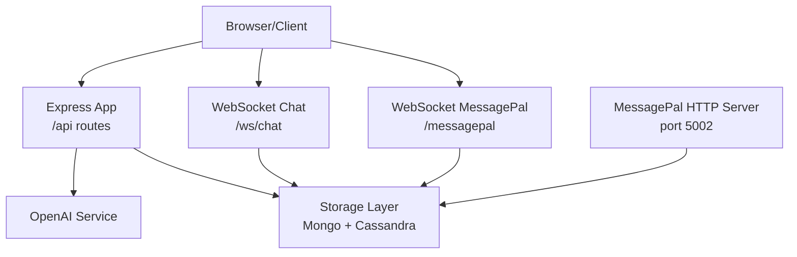
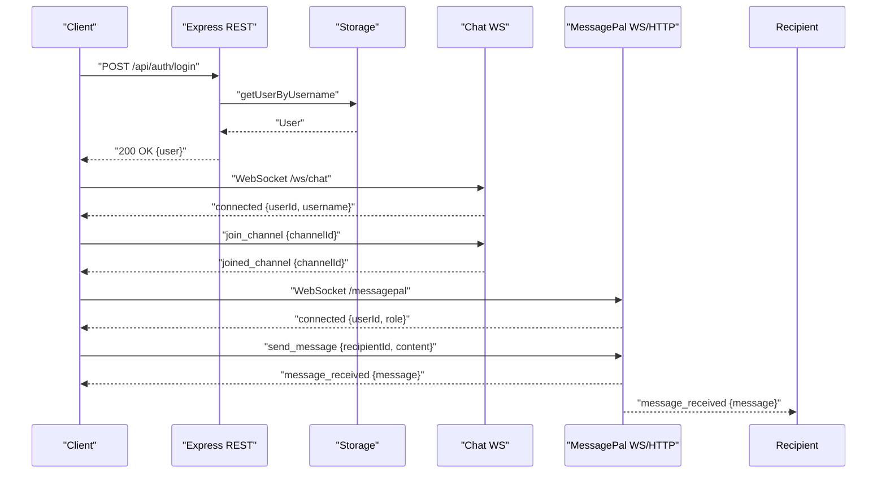
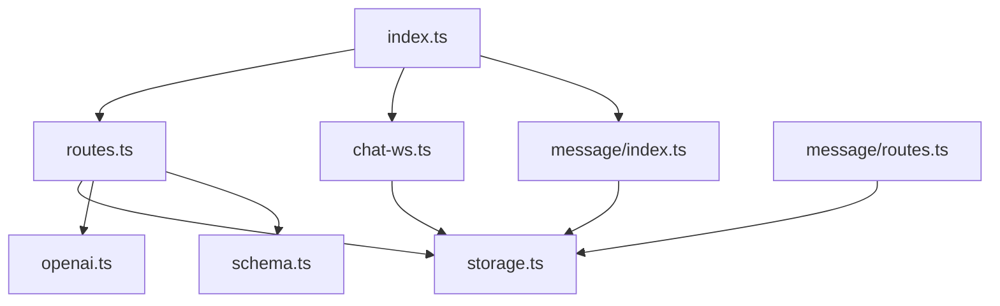

# API Reference

<cite>
**Referenced Files in This Document**
- [server/index.ts](file://server/index.ts)
- [server/routes.ts](file://server/routes.ts)
- [server/chat-ws.ts](file://server/chat-ws.ts)
- [server/message/index.ts](file://server/message/index.ts)
- [server/message/routes.ts](file://server/message/routes.ts)
- [server/storage.ts](file://server/storage.ts)
- [shared/schema.ts](file://shared/schema.ts)
- [server/lib/openai.ts](file://server/lib/openai.ts)
- [client/src/lib/chat-api.ts](file://client/src/lib/chat-api.ts)
- [client/src/hooks/use-chat-ws.ts](file://client/src/hooks/use-chat-ws.ts)
</cite>

## Table of Contents
1. [Introduction](#introduction)
2. [Project Structure](#project-structure)
3. [Core Components](#core-components)
4. [Architecture Overview](#architecture-overview)
5. [Detailed Component Analysis](#detailed-component-analysis)
6. [Dependency Analysis](#dependency-analysis)
7. [Performance Considerations](#performance-considerations)
8. [Troubleshooting Guide](#troubleshooting-guide)
9. [Conclusion](#conclusion)
10. [Appendices](#appendices)

## Introduction
This document provides comprehensive API documentation for PersonalLearningPro’s RESTful and WebSocket endpoints. It covers HTTP endpoints for user management, assessments, communication, and data operations, as well as WebSocket connections for real-time chat and MessagePal messaging. The guide includes endpoint categorization, authentication requirements, request/response schemas, error handling, rate limiting, and client integration patterns.

## Project Structure
The backend is an Express server with:
- REST routes registered under /api
- WebSocket servers for chat (/ws/chat) and MessagePal (/messagepal)
- A dedicated HTTP server for MessagePal endpoints
- Storage abstraction supporting MongoDB and Cassandra fallback
- Shared validation schemas for request bodies

**Diagram sources**
- [server/index.ts](file://server/index.ts#L107-L113)
- [server/routes.ts](file://server/routes.ts#L11-L1102)
- [server/chat-ws.ts](file://server/chat-ws.ts#L119-L392)
- [server/message/index.ts](file://server/message/index.ts#L262-L375)
- [server/message/routes.ts](file://server/message/routes.ts#L1-L194)
- [server/storage.ts](file://server/storage.ts#L110-L519)
- [server/lib/openai.ts](file://server/lib/openai.ts#L20-L42)

**Section sources**
- [server/index.ts](file://server/index.ts#L1-L114)
- [server/routes.ts](file://server/routes.ts#L11-L1102)

## Core Components
- REST API: Routes under /api for authentication, user, test, question, attempt, answer, OCR, AI evaluation, workspace/channel/message CRUD, and uploads.
- Chat WebSocket: Real-time chat over /ws/chat with presence, typing indicators, read receipts, and rate-limited message sending.
- MessagePal WebSocket/HTTP: Real-time messaging over /messagepal with HTTP endpoints for conversations and history.
- Storage: Unified interface for MongoDB and Cassandra-backed persistence.
- Validation: Zod schemas define request/response shapes for robust API contracts.

**Section sources**
- [server/routes.ts](file://server/routes.ts#L11-L1102)
- [server/chat-ws.ts](file://server/chat-ws.ts#L119-L392)
- [server/message/index.ts](file://server/message/index.ts#L262-L375)
- [server/message/routes.ts](file://server/message/routes.ts#L1-L194)
- [server/storage.ts](file://server/storage.ts#L110-L519)
- [shared/schema.ts](file://shared/schema.ts#L1-L142)

## Architecture Overview
The system integrates REST and WebSocket communications:
- REST endpoints handle CRUD and batch operations with session-based authentication.
- WebSocket endpoints enable real-time collaboration with presence, typing, read receipts, and optional AI assistance.
- MessagePal provides a separate real-time messaging service with its own WebSocket and HTTP endpoints.
- OpenAI integrations power AI chat, subjective answer evaluation, study plan generation, and test performance analysis.

**Diagram sources**
- [server/routes.ts](file://server/routes.ts#L49-L85)
- [server/chat-ws.ts](file://server/chat-ws.ts#L122-L156)
- [server/message/index.ts](file://server/message/index.ts#L276-L307)

## Detailed Component Analysis

### Authentication and User Management
- POST /api/auth/register
  - Purpose: Register a new user.
  - Authentication: None.
  - Request body: Matches shared user schema.
  - Responses: 201 Created with user (without password), 400 Bad Request (validation), 409 Conflict (duplicate), 500 Internal Server Error.
  - Notes: Password is not returned; session is not set until login.
  - Section sources
    - [server/routes.ts](file://server/routes.ts#L13-L47)
    - [shared/schema.ts](file://shared/schema.ts#L4-L13)

- POST /api/auth/login
  - Purpose: Login and establish session.
  - Authentication: None.
  - Request body: { username, password }.
  - Responses: 200 OK with user (without password), 400 Bad Request (missing fields), 401 Unauthorized (invalid credentials), 500 Internal Server Error.
  - Section sources
    - [server/routes.ts](file://server/routes.ts#L49-L76)

- POST /api/auth/logout
  - Purpose: Destroy session.
  - Authentication: Session required.
  - Responses: 200 OK, 500 Internal Server Error.
  - Section sources
    - [server/routes.ts](file://server/routes.ts#L77-L85)

- GET /api/users/me
  - Purpose: Retrieve current user profile.
  - Authentication: Session required.
  - Responses: 200 OK with user, 401 Unauthorized, 404 Not Found, 500 Internal Server Error.
  - Section sources
    - [server/routes.ts](file://server/routes.ts#L87-L107)

### Assessment and Test Operations
- POST /api/tests
  - Purpose: Create a test (teacher only).
  - Authentication: Session required; role must be teacher; teacherId must match session.
  - Request body: Matches shared test schema.
  - Responses: 201 Created, 400 Bad Request (validation), 401 Unauthorized, 403 Forbidden, 500 Internal Server Error.
  - Section sources
    - [server/routes.ts](file://server/routes.ts#L110-L132)
    - [shared/schema.ts](file://shared/schema.ts#L15-L26)

- GET /api/tests
  - Purpose: List tests; teachers see their tests or all if admin; students see class tests.
  - Authentication: Session required.
  - Query parameters: teacherId (number), status (string).
  - Responses: 200 OK with array, 401 Unauthorized, 500 Internal Server Error.
  - Section sources
    - [server/routes.ts](file://server/routes.ts#L134-L173)

- GET /api/tests/:id
  - Purpose: Get a specific test with access checks.
  - Authentication: Session required.
  - Path parameters: id (number).
  - Responses: 200 OK, 400 Bad Request (invalid id), 401 Unauthorized, 403 Forbidden, 404 Not Found, 500 Internal Server Error.
  - Section sources
    - [server/routes.ts](file://server/routes.ts#L175-L209)

- PATCH /api/tests/:id
  - Purpose: Update a test (teacher only).
  - Authentication: Session required; role must be teacher; ownership required.
  - Path parameters: id (number).
  - Request body: Partial shared test schema.
  - Responses: 200 OK, 400 Bad Request (validation), 401 Unauthorized, 403 Forbidden, 404 Not Found, 500 Internal Server Error.
  - Section sources
    - [server/routes.ts](file://server/routes.ts#L211-L247)

- POST /api/questions
  - Purpose: Create a question (teacher only).
  - Authentication: Session required; role must be teacher.
  - Request body: Matches shared question schema.
  - Responses: 201 Created, 400 Bad Request (validation), 401 Unauthorized, 403 Forbidden, 404 Not Found, 500 Internal Server Error.
  - Section sources
    - [server/routes.ts](file://server/routes.ts#L250-L278)
    - [shared/schema.ts](file://shared/schema.ts#L28-L37)

- GET /api/tests/:testId/questions
  - Purpose: List questions for a test with access checks.
  - Authentication: Session required.
  - Path parameters: testId (number).
  - Responses: 200 OK, 400 Bad Request (invalid id), 401 Unauthorized, 403 Forbidden, 404 Not Found, 500 Internal Server Error.
  - Section sources
    - [server/routes.ts](file://server/routes.ts#L280-L316)

- POST /api/test-attempts
  - Purpose: Start a test attempt (student only).
  - Authentication: Session required; role must be student.
  - Request body: Matches shared test attempt schema.
  - Constraints: Test must be published, student’s class must match test class, and student must not have an in-progress attempt.
  - Responses: 201 Created, 400 Bad Request (validation or constraints), 401 Unauthorized, 403 Forbidden, 404 Not Found, 500 Internal Server Error.
  - Section sources
    - [server/routes.ts](file://server/routes.ts#L319-L370)
    - [shared/schema.ts](file://shared/schema.ts#L39-L46)

- PATCH /api/test-attempts/:id
  - Purpose: Update an attempt (student or teacher).
  - Authentication: Session required.
  - Path parameters: id (number).
  - Request body: Partial shared test attempt schema.
  - Access: Ownership for students; teacher ownership for tests for teachers.
  - Responses: 200 OK, 400 Bad Request (validation), 401 Unauthorized, 403 Forbidden, 404 Not Found, 500 Internal Server Error.
  - Section sources
    - [server/routes.ts](file://server/routes.ts#L372-L414)

- POST /api/answers
  - Purpose: Submit an answer (student only).
  - Authentication: Session required; role must be student.
  - Request body: Matches shared answer schema.
  - Behavior: For MCQ, correctness and score are auto-computed; for subjective, AI evaluation is available via /api/evaluate.
  - Responses: 201 Created, 400 Bad Request (validation or constraints), 401 Unauthorized, 403 Forbidden, 404 Not Found, 500 Internal Server Error.
  - Section sources
    - [server/routes.ts](file://server/routes.ts#L417-L463)
    - [shared/schema.ts](file://shared/schema.ts#L48-L59)

- POST /api/evaluate
  - Purpose: Evaluate a subjective answer (teacher only).
  - Authentication: Session required; role must be teacher.
  - Request body: { answerId }.
  - Behavior: Uses OpenAI to compute score, confidence, and feedback; updates answer record.
  - Responses: 200 OK with updated answer, 400 Bad Request (validation), 401 Unauthorized, 403 Forbidden, 404 Not Found, 500 Internal Server Error.
  - Section sources
    - [server/routes.ts](file://server/routes.ts#L488-L559)
    - [server/lib/openai.ts](file://server/lib/openai.ts#L50-L105)

- POST /api/ai-chat
  - Purpose: Chat with AI assistant.
  - Authentication: Session not enforced by route; client-side auth is recommended.
  - Request body: { messages: array of chat messages }.
  - Behavior: Calls OpenAI chat completion; ensures a system message if missing.
  - Responses: 200 OK with AI response, 400 Bad Request (invalid messages), 500 Internal Server Error.
  - Section sources
    - [server/routes.ts](file://server/routes.ts#L562-L580)
    - [server/lib/openai.ts](file://server/lib/openai.ts#L20-L42)

### Communication and Messaging (REST)
- POST /api/workspaces
  - Purpose: Create a workspace; owner becomes member.
  - Authentication: Session required.
  - Request body: { name, description?, ownerId, members? }.
  - Responses: 201 Created, 400 Bad Request (validation), 401 Unauthorized, 500 Internal Server Error.
  - Section sources
    - [server/routes.ts](file://server/routes.ts#L584-L603)
    - [shared/schema.ts](file://shared/schema.ts#L107-L112)

- GET /api/workspaces
  - Purpose: List workspaces the current user belongs to.
  - Authentication: Session required.
  - Responses: 200 OK with array, 401 Unauthorized, 500 Internal Server Error.
  - Section sources
    - [server/routes.ts](file://server/routes.ts#L605-L614)

- GET /api/workspaces/:id
  - Purpose: Get a workspace with membership checks.
  - Authentication: Session required.
  - Path parameters: id (number).
  - Responses: 200 OK, 401 Unauthorized, 403 Forbidden, 404 Not Found, 500 Internal Server Error.
  - Section sources
    - [server/routes.ts](file://server/routes.ts#L616-L629)

- POST /api/workspaces/:id/members
  - Purpose: Add a member (owner or teacher).
  - Authentication: Session required.
  - Path parameters: id (number).
  - Request body: { userId (number) }.
  - Responses: 200 OK, 400 Bad Request (validation), 401 Unauthorized, 403 Forbidden, 404 Not Found, 500 Internal Server Error.
  - Section sources
    - [server/routes.ts](file://server/routes.ts#L632-L654)

- DELETE /api/workspaces/:id/members/:userId
  - Purpose: Remove a member (owner or teacher).
  - Authentication: Session required.
  - Path parameters: id (number), userId (number).
  - Responses: 200 OK, 401 Unauthorized, 403 Forbidden, 404 Not Found, 500 Internal Server Error.
  - Section sources
    - [server/routes.ts](file://server/routes.ts#L657-L675)

- POST /api/workspaces/:id/channels
  - Purpose: Create a channel (teacher only).
  - Authentication: Session required; role must be teacher.
  - Path parameters: id (number).
  - Request body: { name, type, workspaceId?, subject?, class? }.
  - Responses: 201 Created, 400 Bad Request (validation), 401 Unauthorized, 403 Forbidden, 404 Not Found, 500 Internal Server Error.
  - Section sources
    - [server/routes.ts](file://server/routes.ts#L680-L701)
    - [shared/schema.ts](file://shared/schema.ts#L114-L120)

- GET /api/workspaces/:id/channels
  - Purpose: List channels in a workspace with membership checks.
  - Authentication: Session required.
  - Path parameters: id (number).
  - Responses: 200 OK, 401 Unauthorized, 403 Forbidden, 404 Not Found, 500 Internal Server Error.
  - Section sources
    - [server/routes.ts](file://server/routes.ts#L704-L718)

- GET /api/channels/:id/messages
  - Purpose: Paginated message history with access checks.
  - Authentication: Session required.
  - Path parameters: id (number).
  - Query parameters: limit (number, default 50, max 100), before (number).
  - Responses: 200 OK, 401 Unauthorized, 403 Forbidden, 404 Not Found, 500 Internal Server Error.
  - Section sources
    - [server/routes.ts](file://server/routes.ts#L723-L745)

- GET /api/messages/:channelId
  - Purpose: Alias for channel messages with DM-specific access checks.
  - Authentication: Session required.
  - Path parameters: channelId (number).
  - Query parameters: limit (number, default 50, max 100), before (number).
  - Responses: 200 OK, 401 Unauthorized, 403 Forbidden, 404 Not Found, 500 Internal Server Error.
  - Section sources
    - [server/routes.ts](file://server/routes.ts#L748-L777)

- POST /api/messages
  - Purpose: Send a message via HTTP (frontend also supports WS).
  - Authentication: Session required.
  - Request body: { channelId, content, type?, fileUrl?, isHomework?, readBy? }.
  - Responses: 201 Created, 400 Bad Request (validation), 401 Unauthorized, 403 Forbidden, 500 Internal Server Error.
  - Section sources
    - [server/routes.ts](file://server/routes.ts#L780-L804)
    - [shared/schema.ts](file://shared/schema.ts#L122-L131)

- POST /api/channels/dm
  - Purpose: Create or get a DM channel for two users.
  - Authentication: Session required.
  - Request body: { userIds: [number, number] }.
  - Responses: 200 OK, 400 Bad Request (validation), 401 Unauthorized, 500 Internal Server Error.
  - Section sources
    - [server/routes.ts](file://server/routes.ts#L807-L828)

- GET /api/users/me/dms
  - Purpose: List DM channels for the current user with partner info.
  - Authentication: Session required.
  - Responses: 200 OK, 401 Unauthorized, 500 Internal Server Error.
  - Section sources
    - [server/routes.ts](file://server/routes.ts#L831-L866)

- DELETE /api/messages/:id
  - Purpose: Delete a message (author or teacher).
  - Authentication: Session required.
  - Path parameters: id (number).
  - Responses: 200 OK, 400 Bad Request (validation), 401 Unauthorized, 403 Forbidden, 404 Not Found, 500 Internal Server Error.
  - Section sources
    - [server/routes.ts](file://server/routes.ts#L869-L894)

- POST /api/channels/:id/pin/:messageId
  - Purpose: Pin a message (teacher only).
  - Authentication: Session required; role must be teacher.
  - Path parameters: id (number), messageId (number).
  - Responses: 200 OK, 400 Bad Request (validation), 401 Unauthorized, 403 Forbidden, 404 Not Found, 500 Internal Server Error.
  - Section sources
    - [server/routes.ts](file://server/routes.ts#L897-L914)

- DELETE /api/channels/:id/pin/:messageId
  - Purpose: Unpin a message (teacher only).
  - Authentication: Session required; role must be teacher.
  - Path parameters: id (number), messageId (number).
  - Responses: 200 OK, 400 Bad Request (validation), 401 Unauthorized, 403 Forbidden, 404 Not Found, 500 Internal Server Error.
  - Section sources
    - [server/routes.ts](file://server/routes.ts#L917-L934)

- GET /api/channels/:id/pinned
  - Purpose: Get pinned messages with access checks.
  - Authentication: Session required.
  - Path parameters: id (number).
  - Responses: 200 OK, 401 Unauthorized, 403 Forbidden, 404 Not Found, 500 Internal Server Error.
  - Section sources
    - [server/routes.ts](file://server/routes.ts#L937-L956)

- GET /api/channels/query/:classOrUser
  - Purpose: Filter channels by class or name/subject.
  - Authentication: Session required.
  - Path parameters: classOrUser (string).
  - Responses: 200 OK, 401 Unauthorized, 500 Internal Server Error.
  - Section sources
    - [server/routes.ts](file://server/routes.ts#L959-L980)

- GET /api/channels/:id/unread
  - Purpose: Get unread count for a channel (last 50 messages).
  - Authentication: Session required.
  - Path parameters: id (number).
  - Responses: 200 OK, 401 Unauthorized, 404 Not Found, 500 Internal Server Error.
  - Section sources
    - [server/routes.ts](file://server/routes.ts#L983-L999)

- POST /api/messages/:id/grade
  - Purpose: Grade homework (teacher only).
  - Authentication: Session required; role must be teacher.
  - Path parameters: id (number).
  - Request body: { status: "pending" | "graded", channelId? }.
  - Responses: 200 OK, 400 Bad Request (validation), 401 Unauthorized, 403 Forbidden, 404 Not Found, 500 Internal Server Error.
  - Section sources
    - [server/routes.ts](file://server/routes.ts#L1002-L1025)

- POST /api/channels
  - Purpose: Create a channel with workspace membership checks.
  - Authentication: Session required.
  - Request body: { workspaceId?, name, type, subject?, class? }.
  - Responses: 201 Created, 400 Bad Request (validation), 401 Unauthorized, 403 Forbidden, 500 Internal Server Error.
  - Section sources
    - [server/routes.ts](file://server/routes.ts#L1028-L1047)

- POST /api/messages/:id/read
  - Purpose: Mark message as read.
  - Authentication: Session required.
  - Path parameters: id (number).
  - Request body: { channelId? }.
  - Responses: 200 OK, 400 Bad Request (validation), 401 Unauthorized, 404 Not Found, 500 Internal Server Error.
  - Section sources
    - [server/routes.ts](file://server/routes.ts#L1050-L1063)

- POST /api/upload
  - Purpose: Upload a file (multipart/form-data).
  - Authentication: Session required.
  - Request body: multipart/form-data with field "file".
  - Responses: 200 OK with { url, name, size, mimeType }, 400 Bad Request (no file), 401 Unauthorized, 500 Internal Server Error.
  - Section sources
    - [server/routes.ts](file://server/routes.ts#L1066-L1095)

### Communication and Messaging (WebSocket: Chat)
- Path: /ws/chat
- Authentication: Session-based; validates session cookie and loads user metadata.
- Events (client -> server):
  - join_channel { channelId }
  - leave_channel { channelId }
  - send_message { channelId, content, messageType?, fileUrl? }
  - typing { channelId }
  - mark_read { messageId, channelId }
- Server events (server -> client):
  - connected { userId, username }
  - joined_channel { channelId }
  - left_channel { channelId }
  - new_message { message: enriched }
  - user_typing { userId, username, channelId }
  - message_read { messageId, userId, channelId }
  - user_presence { userId, username, status, channelId }
  - error { message }
- Rate limiting: Token bucket (tokens refill every 5s).
- Heartbeat: PING/PONG every 30s; inactive clients terminated.
- Section sources
  - [server/chat-ws.ts](file://server/chat-ws.ts#L119-L392)

### Communication and Messaging (WebSocket: MessagePal)
- Path: /messagepal
- Authentication: Session-based; validates session cookie.
- Events (client -> server):
  - send_message { recipientId, content }
  - typing { recipientId }
  - mark_read { messageId }
  - fetch_history { conversationId }
  - subscribe { conversationId }
  - unsubscribe { conversationId }
- Server events (server -> client):
  - connected { userId, username, role, serverTime }
  - message_received { message }
  - user_typing { userId, username, recipientId }
  - message_read { messageId, readBy, readAt }
  - history_response { conversationId, messages }
  - subscribed/unsubscribed { conversationId }
  - error { message }
- Section sources
  - [server/message/index.ts](file://server/message/index.ts#L262-L375)

### MessagePal HTTP Endpoints
- GET /api/conversations/:userId
  - Purpose: List conversations for a user.
  - Responses: 200 OK, 500 Internal Server Error.
- GET /api/conversations/:conversationId/history
  - Purpose: Get conversation history with pagination.
  - Query parameters: userId (required), limit (default 50).
  - Responses: 200 OK, 400 Bad Request (missing userId), 500 Internal Server Error.
- GET /api/messages/:messageId
  - Purpose: Get a specific message by ID.
  - Query parameters: conversationId (required).
  - Responses: 200 OK, 400 Bad Request (missing conversationId), 404 Not Found, 500 Internal Server Error.
- POST /api/messages
  - Purpose: Send a message via HTTP (fallback).
  - Request body: { conversationId, senderId, senderName, senderRole?, recipientId, content, messageType?, fileUrl }.
  - Responses: 201 Created, 400 Bad Request (missing fields), 500 Internal Server Error.
- PATCH /api/messages/:messageId/read
  - Purpose: Mark message as read.
  - Request body: { conversationId, userId }.
  - Responses: 200 OK, 400 Bad Request (missing fields), 500 Internal Server Error.
- DELETE /api/conversations/:conversationId/users/:userId
  - Purpose: Delete a conversation for a user.
  - Responses: 200 OK, 404 Not Found, 500 Internal Server Error.
- GET /api/users/:userId/unread-count
  - Purpose: Sum of unread messages across all conversations.
  - Responses: 200 OK, 400 Bad Request (invalid userId), 500 Internal Server Error.
- POST /api/conversations/between-users
  - Purpose: Create or return a conversation ID between two users.
  - Request body: { userId1, userId2 }.
  - Responses: 200 OK, 400 Bad Request (missing IDs), 500 Internal Server Error.
- Section sources
  - [server/message/routes.ts](file://server/message/routes.ts#L1-L194)

### OCR and AI Evaluation
- POST /api/ocr
  - Purpose: Process image data via OCR.
  - Authentication: Session required.
  - Request body: { imageData }.
  - Responses: 200 OK, 400 Bad Request (missing data), 500 Internal Server Error.
  - Section sources
    - [server/routes.ts](file://server/routes.ts#L466-L485)

- POST /api/evaluate
  - Purpose: Evaluate subjective answer using AI.
  - Authentication: Session required; role must be teacher.
  - Request body: { answerId }.
  - Responses: 200 OK, 400 Bad Request (missing answerId), 401 Unauthorized, 403 Forbidden, 404 Not Found, 500 Internal Server Error.
  - Section sources
    - [server/routes.ts](file://server/routes.ts#L488-L559)
    - [server/lib/openai.ts](file://server/lib/openai.ts#L50-L105)

### Client-Side Integration Patterns
- REST client utilities:
  - Credentials: include cookies for session-based auth.
  - Workspaces: fetch workspaces, channels, DMs.
  - Messages: fetch paginated messages with limit and before.
  - Upload: multipart/form-data upload.
  - Section sources
    - [client/src/lib/chat-api.ts](file://client/src/lib/chat-api.ts#L44-L112)

- WebSocket hook (chat):
  - Connects to /ws/chat with automatic reconnection and exponential backoff.
  - Sends/receives typed events; supports join/leave channels, typing, read receipts.
  - Section sources
    - [client/src/hooks/use-chat-ws.ts](file://client/src/hooks/use-chat-ws.ts#L65-L218)

### Request/Response Schemas
- User: { id, username, name, email, role, avatar?, class?, subject? }
- Test: { id, title, description?, subject, class, teacherId, totalMarks, duration, testDate, questionTypes, status }
- Question: { id, testId, type, text, options?, correctAnswer?, marks, order, aiRubric? }
- TestAttempt: { id, testId, studentId, startTime?, endTime?, score?, status }
- Answer: { id, attemptId, questionId, text?, selectedOption?, imageUrl?, ocrText?, score?, aiConfidence?, aiFeedback?, isCorrect? }
- Workspace: { id, name, description?, ownerId, members }
- Channel: { id, name, type, workspaceId?, subject?, class?, pinnedMessages? }
- Message: { id, channelId, authorId, authorUsername?, content, type, fileUrl?, readBy, isHomework?, homeworkStatus?, createdAt }
- Section sources
  - [shared/schema.ts](file://shared/schema.ts#L72-L141)

### Authentication and Authorization
- Session-based auth:
  - Cookies: connect.sid
  - Roles: student, teacher, principal, admin, parent
  - Access checks: ownership, workspace membership, role gates
- WebSocket auth:
  - Session validated via cookie parsing and session store lookup
  - Unauthorized closes with code 4001
- Section sources
  - [server/index.ts](file://server/index.ts#L35-L44)
  - [server/routes.ts](file://server/routes.ts#L112-L121)
  - [server/chat-ws.ts](file://server/chat-ws.ts#L94-L115)
  - [server/message/index.ts](file://server/message/index.ts#L71-L93)

### Rate Limiting and Backpressure
- Chat WebSocket:
  - Token bucket: 5 tokens every 5 seconds; rejects bursts
  - Heartbeat ping/pong; inactive clients terminated
- Section sources
  - [server/chat-ws.ts](file://server/chat-ws.ts#L147-L168)
  - [server/chat-ws.ts](file://server/chat-ws.ts#L262-L274)

### Error Handling and Status Codes
- Common patterns:
  - 400 Bad Request: validation errors, malformed requests
  - 401 Unauthorized: missing/invalid session
  - 403 Forbidden: insufficient permissions or access denied
  - 404 Not Found: resource not found
  - 500 Internal Server Error: unexpected failures
- Section sources
  - [server/routes.ts](file://server/routes.ts#L13-L47)
  - [server/routes.ts](file://server/routes.ts#L110-L132)
  - [server/chat-ws.ts](file://server/chat-ws.ts#L126-L130)

### API Versioning, Compatibility, and Deprecation
- No explicit versioning scheme observed in the codebase.
- Backward compatibility is not documented; future changes should introduce deprecation notices and migration paths.
- Recommendations:
  - Adopt semantic versioning (e.g., /api/v1/*)
  - Maintain changelog entries for breaking changes
  - Provide grace periods and migration guides
- Section sources
  - [server/index.ts](file://server/index.ts#L107-L113)

## Dependency Analysis

**Diagram sources**
- [server/index.ts](file://server/index.ts#L10-L17)
- [server/routes.ts](file://server/routes.ts#L1-L11)
- [server/storage.ts](file://server/storage.ts#L1-L31)
- [shared/schema.ts](file://shared/schema.ts#L1-L142)
- [server/chat-ws.ts](file://server/chat-ws.ts#L1-L6)
- [server/message/index.ts](file://server/message/index.ts#L1-L6)
- [server/message/routes.ts](file://server/message/routes.ts#L1-L6)
- [server/lib/openai.ts](file://server/lib/openai.ts#L1-L9)

**Section sources**
- [server/index.ts](file://server/index.ts#L10-L17)
- [server/routes.ts](file://server/routes.ts#L1-L11)
- [server/storage.ts](file://server/storage.ts#L1-L31)

## Performance Considerations
- Message pagination: REST endpoints support limit and before parameters to constrain payloads.
- Cassandra fallback: Message retrieval and mutation operations switch to Cassandra when available, otherwise fall back to MongoDB.
- Rate limiting: Chat WebSocket enforces token bucket to prevent spam.
- Recommendations:
  - Use limit and before for long histories
  - Prefer WebSocket for real-time features to reduce polling
  - Monitor OpenAI latency and implement retries with backoff
- Section sources
  - [server/routes.ts](file://server/routes.ts#L737-L741)
  - [server/storage.ts](file://server/storage.ts#L424-L437)
  - [server/chat-ws.ts](file://server/chat-ws.ts#L262-L274)

## Troubleshooting Guide
- WebSocket Unauthorized (code 4001):
  - Cause: Invalid or missing session cookie.
  - Resolution: Re-authenticate and ensure cookies are sent.
- Rate limit exceeded:
  - Cause: Sending messages too frequently.
  - Resolution: Wait for token refill or reduce burst rate.
- Access Denied:
  - Cause: Not a workspace member or not the channel owner/member.
  - Resolution: Join workspace or verify membership.
- AI Service Failures:
  - Cause: Missing or invalid OPENAI_API_KEY.
  - Resolution: Configure environment variable or retry with backoff.
- Section sources
  - [server/chat-ws.ts](file://server/chat-ws.ts#L126-L130)
  - [server/chat-ws.ts](file://server/chat-ws.ts#L269-L272)
  - [server/routes.ts](file://server/routes.ts#L194-L203)
  - [server/lib/openai.ts](file://server/lib/openai.ts#L4-L9)

## Conclusion
PersonalLearningPro provides a robust REST API with comprehensive assessment and communication features, complemented by real-time WebSocket channels for chat and MessagePal messaging. Session-based authentication and strict access controls protect resources. Clients should leverage pagination, WebSocket for real-time updates, and implement resilient error handling and retry strategies.

## Appendices

### Endpoint Index by Feature Area
- Authentication: /api/auth/register, /api/auth/login, /api/auth/logout
- Users: /api/users/me
- Tests: /api/tests, /api/tests/:id, PATCH /api/tests/:id, /api/tests/:testId/questions
- Attempts: /api/test-attempts, PATCH /api/test-attempts/:id
- Answers: /api/answers, /api/evaluate
- OCR/AI: /api/ocr, /api/ai-chat
- Workspaces: /api/workspaces, /api/workspaces/:id, POST/DELETE /api/workspaces/:id/members
- Channels: POST /api/workspaces/:id/channels, GET /api/workspaces/:id/channels
- Messages (REST): GET /api/channels/:id/messages, GET /api/messages/:channelId, POST /api/messages, POST /api/channels/dm, GET /api/users/me/dms, DELETE /api/messages/:id, POST/DELETE /api/channels/:id/pin/:messageId, GET /api/channels/:id/pinned, GET /api/channels/query/:classOrUser, GET /api/channels/:id/unread, POST /api/messages/:id/grade, POST /api/channels, POST /api/messages/:id/read, POST /api/upload
- MessagePal (WebSocket): /messagepal
- MessagePal (HTTP): GET /api/conversations/:userId, GET /api/conversations/:conversationId/history, GET /api/messages/:messageId, POST /api/messages, PATCH /api/messages/:messageId/read, DELETE /api/conversations/:conversationId/users/:userId, GET /api/users/:userId/unread-count, POST /api/conversations/between-users

### Practical Examples
- Login and persist session:
  - POST /api/auth/login with { username, password }
- Create a test and add questions:
  - POST /api/tests with test schema
  - POST /api/questions with question schema
- Start a test attempt:
  - POST /api/test-attempts with { testId, studentId }
- Submit an answer:
  - POST /api/answers with { attemptId, questionId, text?/selectedOption? }
- Evaluate a subjective answer:
  - POST /api/evaluate with { answerId }
- Send a chat message:
  - Via WebSocket: send_message { channelId, content }
  - Or via REST: POST /api/messages
- Upload a file:
  - POST /api/upload with multipart/form-data

### Client Integration Best Practices
- Use credentials: include for session persistence across fetch calls.
- Implement exponential backoff for WebSocket reconnection.
- Respect rate limits; throttle message sends.
- Use pagination for message histories.
- Handle presence and typing events for richer UX.
- Section sources
  - [client/src/lib/chat-api.ts](file://client/src/lib/chat-api.ts#L44-L55)
  - [client/src/hooks/use-chat-ws.ts](file://client/src/hooks/use-chat-ws.ts#L144-L157)