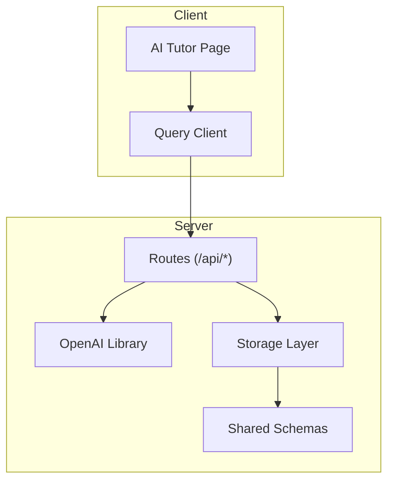
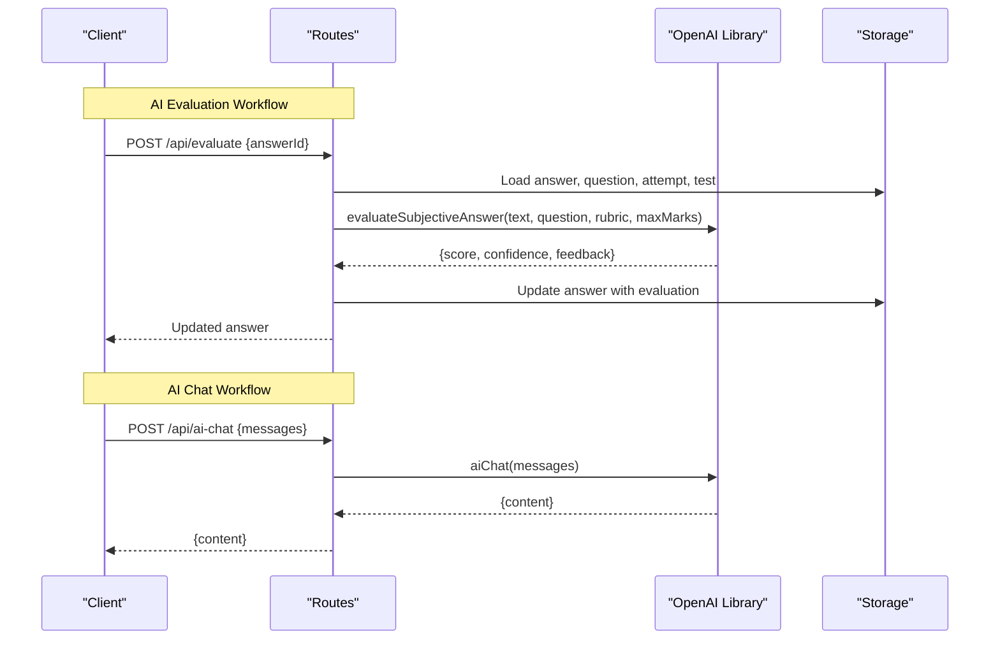
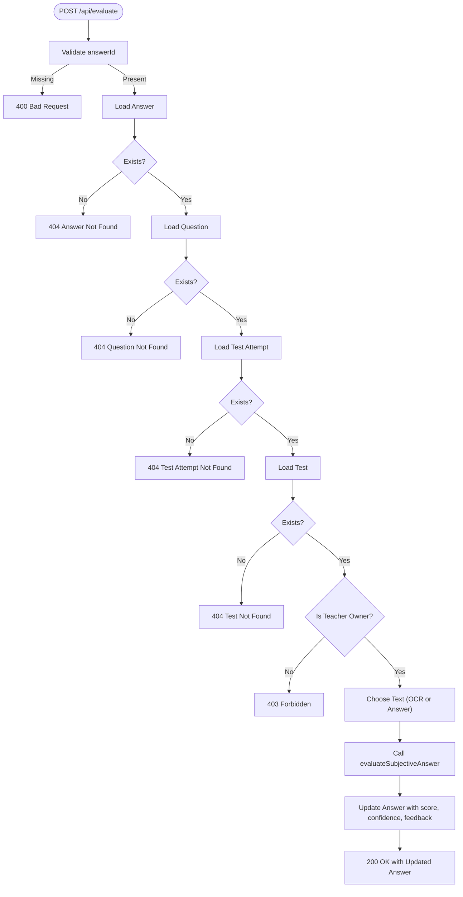
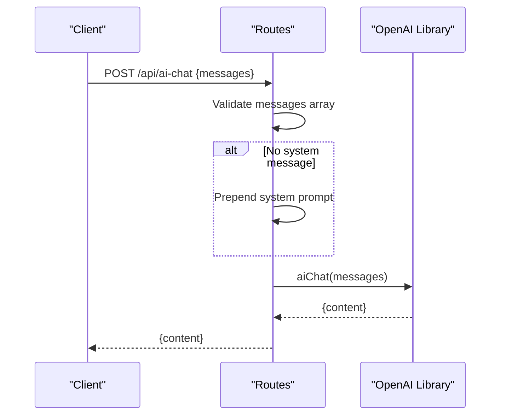
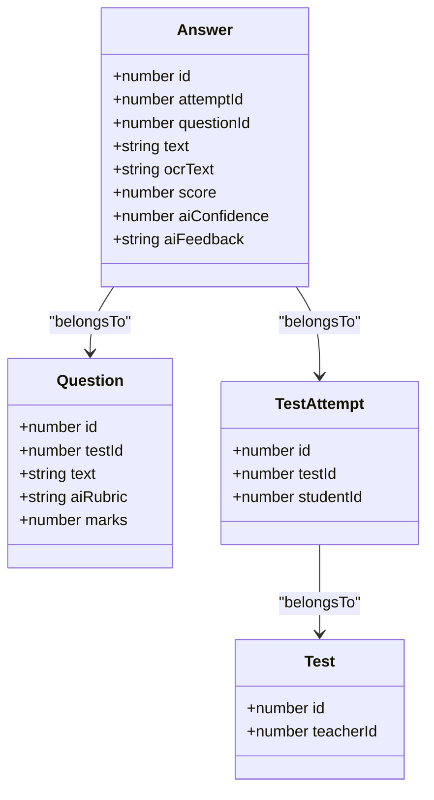
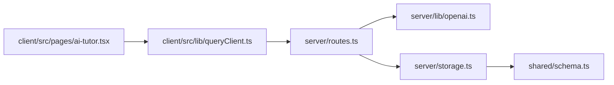

# AI Evaluation & Chat Endpoints

<cite>
**Referenced Files in This Document**
- [server/index.ts](file://server/index.ts)
- [server/routes.ts](file://server/routes.ts)
- [server/lib/openai.ts](file://server/lib/openai.ts)
- [server/storage.ts](file://server/storage.ts)
- [shared/schema.ts](file://shared/schema.ts)
- [client/src/pages/ai-tutor.tsx](file://client/src/pages/ai-tutor.tsx)
- [client/src/lib/queryClient.ts](file://client/src/lib/queryClient.ts)
</cite>

## Table of Contents
1. [Introduction](#introduction)
2. [Project Structure](#project-structure)
3. [Core Components](#core-components)
4. [Architecture Overview](#architecture-overview)
5. [Detailed Component Analysis](#detailed-component-analysis)
6. [Dependency Analysis](#dependency-analysis)
7. [Performance Considerations](#performance-considerations)
8. [Troubleshooting Guide](#troubleshooting-guide)
9. [Conclusion](#conclusion)

## Introduction
This document provides comprehensive API documentation for AI-powered endpoints focused on manual AI evaluation of subjective answers and conversational AI interactions. It covers:
- POST /api/evaluate for manual AI evaluation of subjective answers, including request parameters, AI evaluation response structure, rubric-based scoring, and integration with the assessment system.
- POST /api/ai-chat for conversational AI interactions with message history handling, including request/response schemas, chat interaction patterns, and error handling for AI service failures.

## Project Structure
The AI evaluation and chat features are implemented in the server module with clear separation of concerns:
- Routes define HTTP endpoints and orchestrate business logic.
- OpenAI library encapsulates AI model interactions and response parsing.
- Storage layer manages persistence and retrieval of assessment and chat data.
- Shared schemas define validation and data contracts.
- Client-side pages demonstrate usage patterns for chat interactions.

**Diagram sources**
- [server/routes.ts](file://server/routes.ts#L487-L580)
- [server/lib/openai.ts](file://server/lib/openai.ts#L19-L105)
- [server/storage.ts](file://server/storage.ts#L33-L106)
- [shared/schema.ts](file://shared/schema.ts#L48-L59)
- [client/src/pages/ai-tutor.tsx](file://client/src/pages/ai-tutor.tsx#L122-L191)
- [client/src/lib/queryClient.ts](file://client/src/lib/queryClient.ts#L10-L28)

**Section sources**
- [server/routes.ts](file://server/routes.ts#L1-L1104)
- [server/lib/openai.ts](file://server/lib/openai.ts#L1-L217)
- [server/storage.ts](file://server/storage.ts#L1-L519)
- [shared/schema.ts](file://shared/schema.ts#L1-L142)
- [client/src/pages/ai-tutor.tsx](file://client/src/pages/ai-tutor.tsx#L1-L604)
- [client/src/lib/queryClient.ts](file://client/src/lib/queryClient.ts#L1-L112)

## Core Components
- AI Evaluation Endpoint
  - Endpoint: POST /api/evaluate
  - Purpose: Manually trigger AI evaluation of a subjective answer using question rubric and maximum marks.
  - Request Body: { answerId: number }
  - Response: Updated answer record with score, confidence, and feedback.
- Conversational AI Endpoint
  - Endpoint: POST /api/ai-chat
  - Purpose: Engage in chat with an AI tutor using a message history array.
  - Request Body: { messages: Array<{ role: "system" | "user" | "assistant", content: string }> }
  - Response: { content: string }

**Section sources**
- [server/routes.ts](file://server/routes.ts#L487-L580)
- [server/lib/openai.ts](file://server/lib/openai.ts#L19-L42)

## Architecture Overview
The AI evaluation and chat endpoints follow a layered architecture:
- HTTP layer: Routes validate requests, enforce permissions, and delegate to AI services.
- AI layer: OpenAI library constructs prompts, invokes the model, and parses structured responses.
- Persistence layer: Storage retrieves related assessment data and updates answer records.
- Client integration: Frontend composes message arrays and handles responses.

**Diagram sources**
- [server/routes.ts](file://server/routes.ts#L487-L580)
- [server/lib/openai.ts](file://server/lib/openai.ts#L19-L105)
- [server/storage.ts](file://server/storage.ts#L241-L262)

## Detailed Component Analysis

### AI Evaluation Endpoint: POST /api/evaluate
- Purpose
  - Enable teachers to manually trigger AI evaluation of a subjective answer.
- Request
  - Method: POST
  - Path: /api/evaluate
  - Headers: Content-Type: application/json
  - Body: { answerId: number }
- Authorization
  - Requires authenticated teacher session.
- Processing Logic
  - Validates presence of answerId.
  - Loads answer, associated question (for rubric and max marks), test attempt, and test.
  - Ensures the requesting user is the teacher of the test.
  - Chooses text from either the answer text or OCR text.
  - Calls evaluateSubjectiveAnswer with question text, rubric, and max marks.
  - Updates the answer with returned score, confidence, and feedback.
- Response
  - Status: 200 OK on success.
  - Body: Updated answer object containing score, aiConfidence, and aiFeedback.
- Error Handling
  - 400 Bad Request: Missing answerId.
  - 401 Unauthorized: Not authenticated or not a teacher.
  - 403 Forbidden: Teacher does not own the test.
  - 404 Not Found: Answer, question, attempt, or test not found.
  - 500 Internal Server Error: General failure during evaluation.

**Diagram sources**
- [server/routes.ts](file://server/routes.ts#L487-L559)
- [server/lib/openai.ts](file://server/lib/openai.ts#L50-L105)
- [server/storage.ts](file://server/storage.ts#L241-L262)

**Section sources**
- [server/routes.ts](file://server/routes.ts#L487-L559)
- [server/lib/openai.ts](file://server/lib/openai.ts#L50-L105)
- [shared/schema.ts](file://shared/schema.ts#L48-L59)

### AI Chat Endpoint: POST /api/ai-chat
- Purpose
  - Provide conversational AI interactions with a persistent message history.
- Request
  - Method: POST
  - Path: /api/ai-chat
  - Headers: Content-Type: application/json
  - Body: { messages: Array<{ role: "system" | "user" | "assistant", content: string }> }
- Authorization
  - No session requirement in route; client-side authentication is handled elsewhere.
- Processing Logic
  - Validates messages array.
  - Ensures a system message is present; if missing, prepends a system prompt.
  - Invokes aiChat to generate a response from the model.
- Response
  - Status: 200 OK on success.
  - Body: { content: string }
- Error Handling
  - 400 Bad Request: Invalid messages format.
  - 500 Internal Server Error: AI service failure.

**Diagram sources**
- [server/routes.ts](file://server/routes.ts#L561-L580)
- [server/lib/openai.ts](file://server/lib/openai.ts#L19-L42)

**Section sources**
- [server/routes.ts](file://server/routes.ts#L561-L580)
- [server/lib/openai.ts](file://server/lib/openai.ts#L19-L42)
- [client/src/pages/ai-tutor.tsx](file://client/src/pages/ai-tutor.tsx#L122-L191)

### AI Evaluation Criteria and Rubric-Based Scoring
- Evaluation Inputs
  - Student answer text (answer.text or answer.ocrText).
  - Question text and rubric (question.aiRubric).
  - Maximum marks for the question.
- Output Structure
  - score: Number between 0 and maxMarks (inclusive).
  - confidence: Number between 0 and 100 (inclusive).
  - feedback: Constructive explanation for the score.
- Robustness
  - Values are clamped to expected ranges.
  - JSON parsing fallback returns zeroed metrics with manual review guidance.

**Section sources**
- [server/lib/openai.ts](file://server/lib/openai.ts#L50-L105)
- [shared/schema.ts](file://shared/schema.ts#L28-L37)

### Chat Interaction Patterns
- Message History
  - Clients send an ordered array of messages with roles: system, user, assistant.
  - The system role is optional; if omitted, a default system prompt is injected.
- Client-Side Composition
  - The AI tutor page composes message arrays from conversation state and sends them to the backend.
  - On success, it appends the assistant’s response to the conversation.

**Section sources**
- [server/lib/openai.ts](file://server/lib/openai.ts#L19-L42)
- [client/src/pages/ai-tutor.tsx](file://client/src/pages/ai-tutor.tsx#L122-L191)

### Integration with Assessment System
- Data Retrieval
  - The evaluation endpoint loads the answer, question, test attempt, and test to ensure proper authorization and context.
- Update Persistence
  - After receiving AI evaluation results, the answer record is updated with score, confidence, and feedback.
- Schema Alignment
  - The answer schema includes fields for AI-assigned score, confidence, and feedback.

**Diagram sources**
- [shared/schema.ts](file://shared/schema.ts#L48-L59)
- [shared/schema.ts](file://shared/schema.ts#L28-L37)
- [shared/schema.ts](file://shared/schema.ts#L39-L46)
- [shared/schema.ts](file://shared/schema.ts#L15-L26)

**Section sources**
- [server/routes.ts](file://server/routes.ts#L500-L531)
- [server/storage.ts](file://server/storage.ts#L241-L262)
- [shared/schema.ts](file://shared/schema.ts#L48-L59)

## Dependency Analysis
- Route Dependencies
  - Routes import evaluateSubjectiveAnswer and aiChat from the OpenAI library.
  - Routes depend on storage for CRUD operations on assessments and chat data.
- OpenAI Library
  - Uses OpenAI SDK to call the model and returns structured results.
- Client Integration
  - The AI tutor page uses a generic API request utility to communicate with the backend.

**Diagram sources**
- [server/routes.ts](file://server/routes.ts#L7-L9)
- [server/lib/openai.ts](file://server/lib/openai.ts#L1-L9)
- [server/storage.ts](file://server/storage.ts#L1-L31)
- [shared/schema.ts](file://shared/schema.ts#L1-L13)
- [client/src/pages/ai-tutor.tsx](file://client/src/pages/ai-tutor.tsx#L5)
- [client/src/lib/queryClient.ts](file://client/src/lib/queryClient.ts#L10-L28)

**Section sources**
- [server/routes.ts](file://server/routes.ts#L1-L11)
- [server/lib/openai.ts](file://server/lib/openai.ts#L1-L9)
- [server/storage.ts](file://server/storage.ts#L1-L31)
- [shared/schema.ts](file://shared/schema.ts#L1-L13)
- [client/src/pages/ai-tutor.tsx](file://client/src/pages/ai-tutor.tsx#L5)
- [client/src/lib/queryClient.ts](file://client/src/lib/queryClient.ts#L10-L28)

## Performance Considerations
- Model Invocation Costs
  - Each AI evaluation and chat invocation incurs cost proportional to input length and model pricing.
- Response Parsing
  - JSON parsing is used for structured outputs; ensure inputs are sanitized to avoid parsing overhead.
- Caching
  - Consider caching repeated evaluations for identical answers and rubrics to reduce latency and costs.
- Concurrency
  - Batch multiple chat requests where feasible and apply rate limiting to maintain service stability.

## Troubleshooting Guide
- AI Service Failures
  - Symptoms: 500 Internal Server Error on /api/ai-chat or /api/evaluate.
  - Causes: OpenAI API timeouts, invalid API key, or service unavailability.
  - Resolution: Verify OPENAI_API_KEY environment variable, retry after service restoration, and implement client-side retries with exponential backoff.
- Missing System Prompt in Chat
  - Symptoms: Unexpected assistant behavior.
  - Cause: Client did not include a system message.
  - Resolution: Ensure the first message has role "system" or rely on automatic injection.
- Evaluation Fallback Behavior
  - When JSON parsing fails or AI service errors occur, the evaluation returns zeros and a manual review message. Inspect logs for detailed error context.
- Authentication Issues
  - Evaluation requires a teacher session; ensure the session cookie is included and the user role is "teacher".
- Message Validation Errors
  - Chat endpoint expects a messages array; malformed or missing messages result in 400 errors.

**Section sources**
- [server/lib/openai.ts](file://server/lib/openai.ts#L38-L42)
- [server/lib/openai.ts](file://server/lib/openai.ts#L96-L105)
- [server/routes.ts](file://server/routes.ts#L569-L571)
- [server/routes.ts](file://server/routes.ts#L496-L498)

## Conclusion
The AI evaluation and chat endpoints provide robust mechanisms for manual AI-assisted assessment and conversational tutoring. By adhering to the documented request/response schemas, handling errors gracefully, and integrating with the assessment and storage layers, developers can build reliable AI-powered educational features. Ensure proper environment configuration, monitor AI service health, and consider performance optimizations for production deployments.