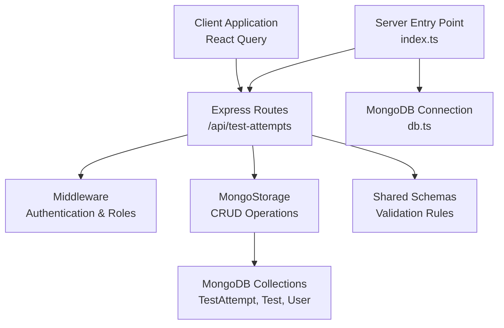
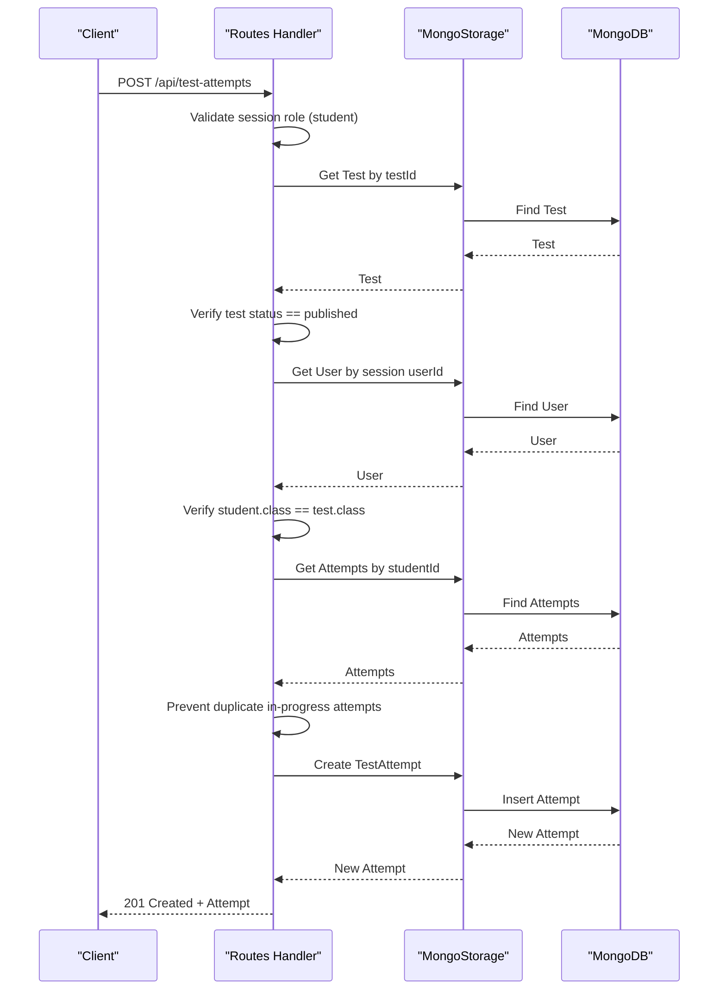
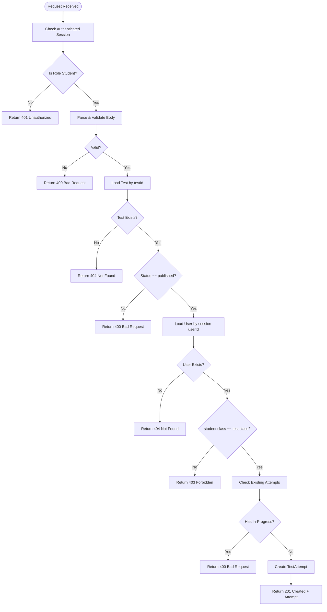
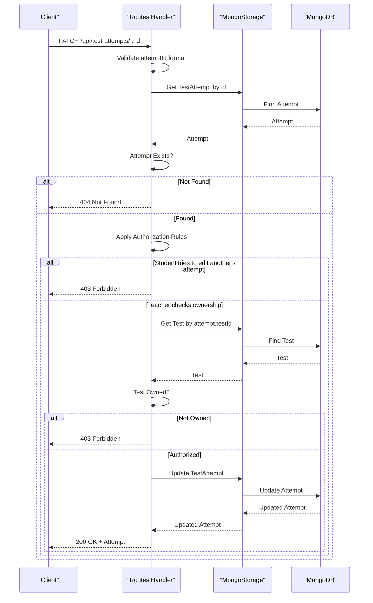
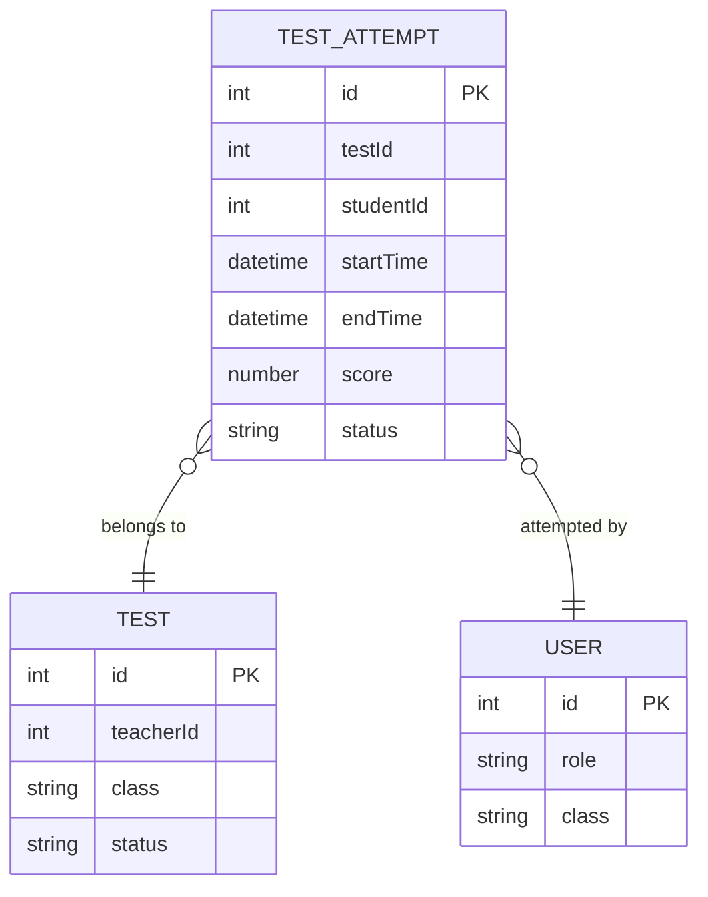
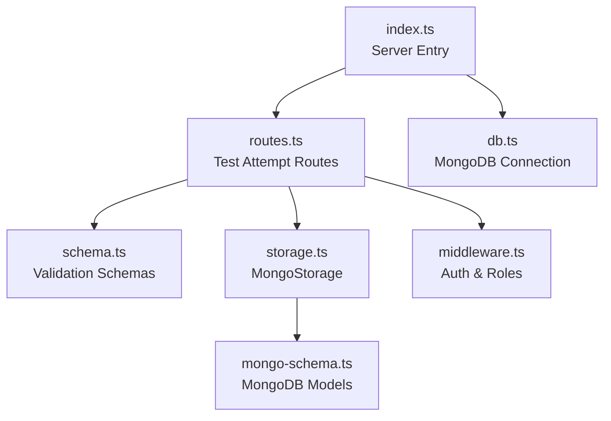

# Test Attempt Management Endpoints

<cite>
**Referenced Files in This Document**
- [index.ts](file://server/index.ts)
- [routes.ts](file://server/routes.ts)
- [schema.ts](file://shared/schema.ts)
- [mongo-schema.ts](file://shared/mongo-schema.ts)
- [storage.ts](file://server/storage.ts)
- [middleware.ts](file://server/middleware.ts)
- [db.ts](file://server/db.ts)
- [queryClient.ts](file://client/src/lib/queryClient.ts)
</cite>

## Table of Contents
1. [Introduction](#introduction)
2. [Project Structure](#project-structure)
3. [Core Components](#core-components)
4. [Architecture Overview](#architecture-overview)
5. [Detailed Component Analysis](#detailed-component-analysis)
6. [Dependency Analysis](#dependency-analysis)
7. [Performance Considerations](#performance-considerations)
8. [Troubleshooting Guide](#troubleshooting-guide)
9. [Conclusion](#conclusion)

## Introduction
This document provides comprehensive API documentation for test attempt management endpoints. It covers:
- POST /api/test-attempts for student test attempt creation with strict student-only access control, automatic test availability validation, class matching verification, and duplicate attempt prevention
- PATCH /api/test-attempts/:id for test attempt updates with dual authorization (student ownership or teacher access for the associated test)
It includes detailed request/response schemas, validation rules, role-based access control implementation, test status validation, student enrollment verification, and attempt state management. Examples illustrate student test enrollment workflows, teacher attempt management scenarios, and error handling for unauthorized access and invalid test states.

## Project Structure
The test attempt management functionality is implemented in the server-side routing layer and backed by shared schemas and MongoDB storage:
- Routes define the API endpoints and enforce access control and validation
- Shared schemas define request/response validation rules
- Storage layer persists and retrieves attempt data
- Middleware enforces authentication and roles
- Database initialization connects to MongoDB

**Diagram sources**
- [index.ts](file://server/index.ts#L1-L114)
- [routes.ts](file://server/routes.ts#L318-L414)
- [storage.ts](file://server/storage.ts#L110-L519)
- [schema.ts](file://shared/schema.ts#L39-L46)
- [db.ts](file://server/db.ts#L1-L21)

**Section sources**
- [index.ts](file://server/index.ts#L1-L114)
- [routes.ts](file://server/routes.ts#L318-L414)
- [schema.ts](file://shared/schema.ts#L39-L46)
- [storage.ts](file://server/storage.ts#L110-L519)
- [db.ts](file://server/db.ts#L1-L21)

## Core Components
- Test Attempt Validation Schema: Defines fields, types, defaults, and enums for test attempts
- Route Handlers: Implement POST and PATCH endpoints with access control and validation
- Storage Layer: Provides CRUD operations for test attempts and related queries
- Access Control: Enforces student-only creation and dual authorization for updates

Key validation rules and data structures:
- TestAttempt fields include identifiers, timestamps, score, and status with allowed values
- Student-only creation requires authenticated student session and matching class
- Duplicate attempt prevention checks for in-progress attempts per student and test
- Dual authorization for updates allows either the attempt owner (student) or the test teacher

**Section sources**
- [schema.ts](file://shared/schema.ts#L39-L46)
- [routes.ts](file://server/routes.ts#L318-L414)
- [storage.ts](file://server/storage.ts#L213-L239)

## Architecture Overview
The test attempt lifecycle spans client requests, server validation, access control, and persistence.

**Diagram sources**
- [routes.ts](file://server/routes.ts#L318-L370)
- [storage.ts](file://server/storage.ts#L213-L239)
- [mongo-schema.ts](file://shared/mongo-schema.ts#L52-L60)

**Section sources**
- [routes.ts](file://server/routes.ts#L318-L370)
- [storage.ts](file://server/storage.ts#L213-L239)

## Detailed Component Analysis

### POST /api/test-attempts
Purpose: Allow authenticated students to create a new test attempt for a published test in their class, preventing duplicate in-progress attempts.

Access Control:
- Requires authenticated session with role "student"
- Validates that the attempt studentId matches the session userId
- Ensures the test exists and has status "published"
- Confirms student's class matches the test's class
- Prevents multiple concurrent in-progress attempts for the same test

Validation:
- Uses shared schema for test attempt creation with defaults and enums
- Zod parsing validates request body against schema

Processing Logic:
- Retrieve test by testId and verify status
- Retrieve user by session userId and verify class matches test class
- Check existing attempts for the same student and test with non-completed status
- Persist new attempt with default status "in_progress"

Response:
- Returns 201 Created with the created attempt
- Returns appropriate error codes for validation failures, missing resources, unauthorized access, forbidden actions, and duplicates

**Diagram sources**
- [routes.ts](file://server/routes.ts#L318-L370)
- [schema.ts](file://shared/schema.ts#L39-L46)

**Section sources**
- [routes.ts](file://server/routes.ts#L318-L370)
- [schema.ts](file://shared/schema.ts#L39-L46)

### PATCH /api/test-attempts/:id
Purpose: Allow authorized users to update an existing test attempt. Students can update their own attempts; teachers can update attempts for tests they own.

Access Control:
- Requires authenticated session
- For students: attempt.studentId must match session userId
- For teachers: must own the test associated with the attempt

Validation:
- Parses partial attempt data against the shared schema
- Validates attemptId format and existence

Processing Logic:
- Retrieve attempt by id
- Apply dual authorization rules
- Update attempt with provided fields
- Return updated attempt

Response:
- Returns 200 OK with the updated attempt
- Returns appropriate error codes for invalid IDs, missing attempts, unauthorized access, and validation failures

**Diagram sources**
- [routes.ts](file://server/routes.ts#L372-L414)
- [storage.ts](file://server/storage.ts#L236-L239)

**Section sources**
- [routes.ts](file://server/routes.ts#L372-L414)
- [storage.ts](file://server/storage.ts#L236-L239)

### Data Models and Schemas
TestAttempt schema defines the structure for test attempts, including identifiers, timestamps, score, and status.

**Diagram sources**
- [mongo-schema.ts](file://shared/mongo-schema.ts#L52-L60)
- [mongo-schema.ts](file://shared/mongo-schema.ts#L25-L38)
- [mongo-schema.ts](file://shared/mongo-schema.ts#L13-L23)

**Section sources**
- [schema.ts](file://shared/schema.ts#L39-L46)
- [mongo-schema.ts](file://shared/mongo-schema.ts#L52-L60)

## Dependency Analysis
The test attempt endpoints depend on:
- Shared validation schemas for request/response shape and constraints
- Storage layer for database operations
- Middleware for authentication and role enforcement
- MongoDB for persistence

**Diagram sources**
- [routes.ts](file://server/routes.ts#L318-L414)
- [schema.ts](file://shared/schema.ts#L39-L46)
- [storage.ts](file://server/storage.ts#L110-L519)
- [mongo-schema.ts](file://shared/mongo-schema.ts#L147-L159)
- [middleware.ts](file://server/middleware.ts#L1-L18)
- [index.ts](file://server/index.ts#L1-L114)
- [db.ts](file://server/db.ts#L1-L21)

**Section sources**
- [routes.ts](file://server/routes.ts#L318-L414)
- [schema.ts](file://shared/schema.ts#L39-L46)
- [storage.ts](file://server/storage.ts#L110-L519)
- [mongo-schema.ts](file://shared/mongo-schema.ts#L147-L159)
- [middleware.ts](file://server/middleware.ts#L1-L18)
- [index.ts](file://server/index.ts#L1-L114)
- [db.ts](file://server/db.ts#L1-L21)

## Performance Considerations
- Attempt creation performs multiple database reads: test lookup, user lookup, and existing attempts check. These are O(1) to O(n) depending on collection indexes.
- Consider adding indexes on testId and studentId for efficient filtering of attempts.
- Batch operations and caching can reduce repeated lookups for frequently accessed tests or users.
- Use pagination for listing attempts if the dataset grows large.

## Troubleshooting Guide
Common error scenarios and resolutions:
- 401 Unauthorized: Ensure the client is authenticated and the session contains a valid userId and role.
- 403 Forbidden: Verify the student's class matches the test class and that the user has proper authorization (student owns attempt or teacher owns test).
- 400 Bad Request: Check that the test is published, the request body conforms to the schema, and there are no duplicate in-progress attempts.
- 404 Not Found: Confirm the test and attempt IDs are valid and exist in the database.
- Session Issues: Ensure cookies are sent with credentials and the session store is properly configured.

Client-side considerations:
- The client uses React Query with credentials included for all requests, ensuring session cookies are transmitted.
- Error handling in queries throws on non-OK responses, enabling centralized error management.

**Section sources**
- [routes.ts](file://server/routes.ts#L318-L414)
- [queryClient.ts](file://client/src/lib/queryClient.ts#L10-L28)

## Conclusion
The test attempt management endpoints provide robust, role-aware operations for students and teachers. Students can initiate attempts for published tests in their class while preventing duplicates, and both students and teachers can update attempts with appropriate authorization checks. The implementation leverages shared schemas for validation, a clear separation of concerns in routes and storage, and consistent error handling across the API.