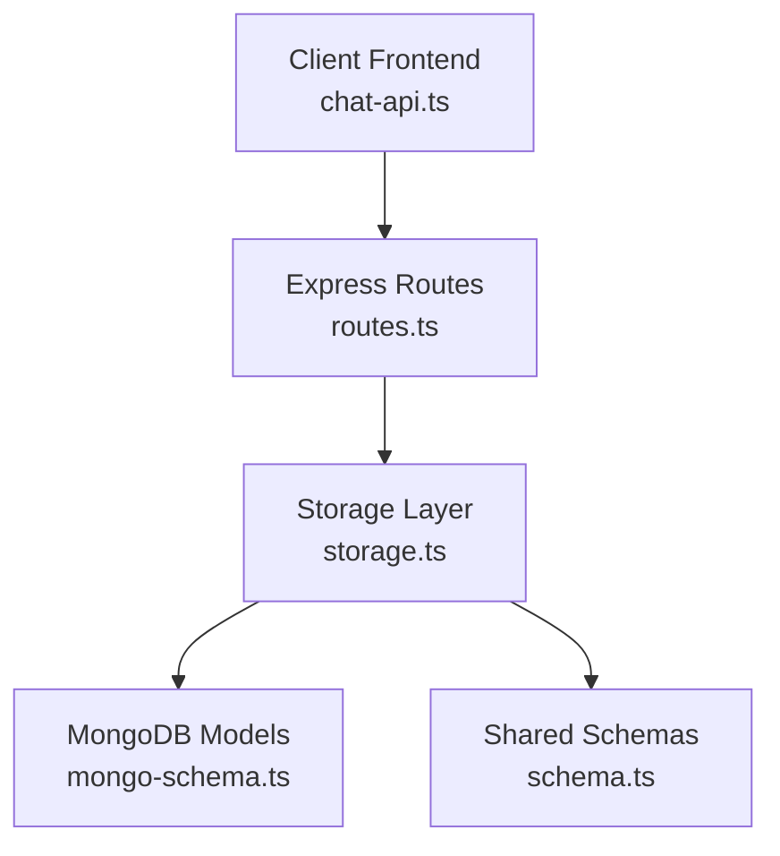
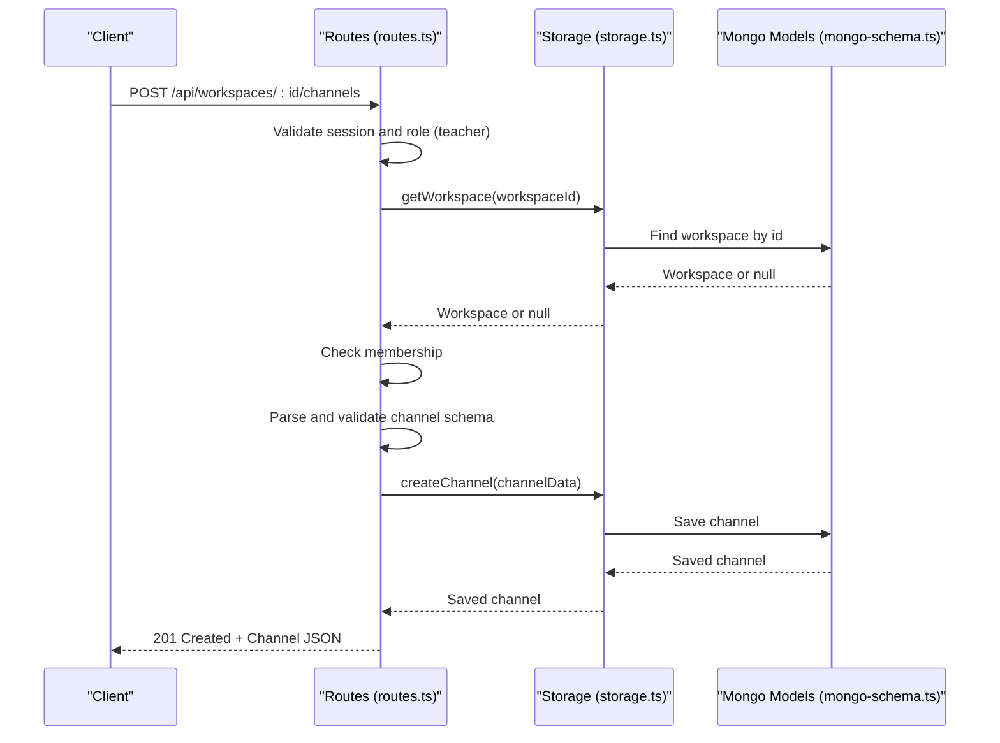
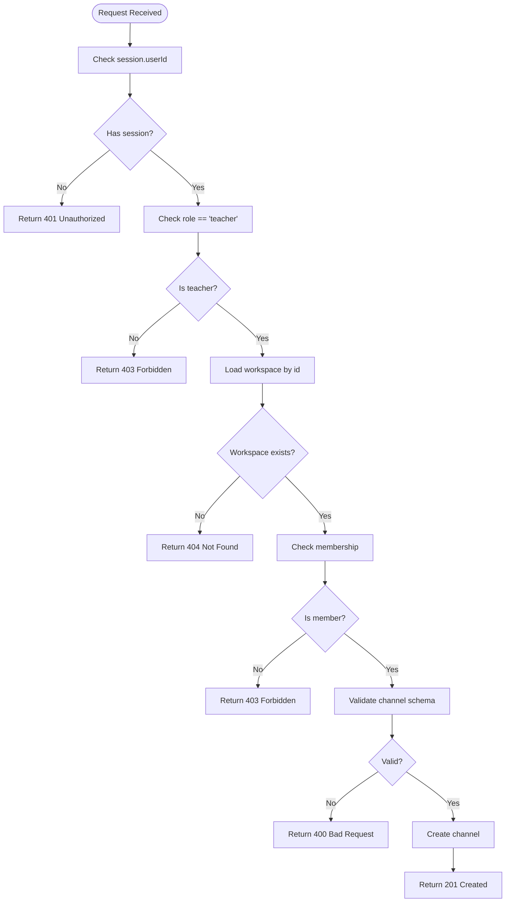
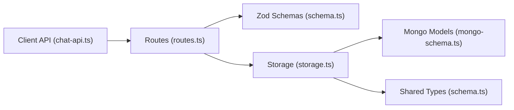

# Channel Management Endpoints

<cite>
**Referenced Files in This Document**
- [routes.ts](file://server/routes.ts)
- [schema.ts](file://shared/schema.ts)
- [mongo-schema.ts](file://shared/mongo-schema.ts)
- [storage.ts](file://server/storage.ts)
- [chat-api.ts](file://client/src/lib/chat-api.ts)
</cite>

## Table of Contents
1. [Introduction](#introduction)
2. [Project Structure](#project-structure)
3. [Core Components](#core-components)
4. [Architecture Overview](#architecture-overview)
5. [Detailed Component Analysis](#detailed-component-analysis)
6. [Dependency Analysis](#dependency-analysis)
7. [Performance Considerations](#performance-considerations)
8. [Troubleshooting Guide](#troubleshooting-guide)
9. [Conclusion](#conclusion)

## Introduction
This document provides comprehensive API documentation for channel management endpoints within the messaging system. It covers:
- Channel creation (POST /api/workspaces/:id/channels) with teacher-only authorization and workspace membership validation
- Channel listing (GET /api/workspaces/:id/channels) showing accessible channels within a workspace
- Channel type restrictions (public, private, direct messages)
- Workspace membership requirements and teacher privilege validation
- Request/response schemas and validation rules
- Error handling for unauthorized access, workspace validation, and channel creation validation

## Project Structure
The channel management functionality is implemented in the server routes and storage layers, with shared schemas defining validation rules and data structures.

**Diagram sources**
- [routes.ts](file://server/routes.ts#L677-L718)
- [storage.ts](file://server/storage.ts#L357-L409)
- [mongo-schema.ts](file://shared/mongo-schema.ts#L121-L144)
- [schema.ts](file://shared/schema.ts#L114-L140)
- [chat-api.ts](file://client/src/lib/chat-api.ts#L63-L71)

**Section sources**
- [routes.ts](file://server/routes.ts#L677-L718)
- [storage.ts](file://server/storage.ts#L357-L409)
- [schema.ts](file://shared/schema.ts#L114-L140)
- [mongo-schema.ts](file://shared/mongo-schema.ts#L121-L144)
- [chat-api.ts](file://client/src/lib/chat-api.ts#L63-L71)

## Core Components
- Channel creation endpoint validates teacher role, workspace existence, and membership before creating channels
- Channel listing endpoint validates workspace membership and returns channels associated with the workspace
- Channel type restrictions are enforced via Zod schemas and MongoDB enums
- Workspace membership checks ensure only authorized users can access channels

**Section sources**
- [routes.ts](file://server/routes.ts#L679-L718)
- [schema.ts](file://shared/schema.ts#L114-L120)
- [mongo-schema.ts](file://shared/mongo-schema.ts#L121-L130)
- [storage.ts](file://server/storage.ts#L359-L374)

## Architecture Overview
The channel management endpoints follow a layered architecture:
- HTTP routes handle authentication and authorization
- Validation occurs using Zod schemas
- Storage layer persists data to MongoDB
- Response schemas align with shared TypeScript interfaces

**Diagram sources**
- [routes.ts](file://server/routes.ts#L679-L701)
- [storage.ts](file://server/storage.ts#L359-L364)
- [mongo-schema.ts](file://shared/mongo-schema.ts#L121-L130)

## Detailed Component Analysis

### Channel Creation Endpoint
- Endpoint: POST /api/workspaces/:id/channels
- Authentication: Requires active session
- Authorization: Only teachers can create channels
- Workspace Validation: Workspace must exist and requester must be a member
- Request Body Schema: Uses insertChannelSchema with validation rules
- Response: 201 Created with created channel object

Validation Rules:
- workspaceId: Required for workspace-scoped channels; optional for DM channels
- name: Required, minimum length 1
- type: Enum ["text", "announcement", "dm"], defaults to "text"
- class: Optional
- subject: Optional

Authorization Flow:

**Diagram sources**
- [routes.ts](file://server/routes.ts#L679-L701)
- [schema.ts](file://shared/schema.ts#L114-L120)

**Section sources**
- [routes.ts](file://server/routes.ts#L679-L701)
- [schema.ts](file://shared/schema.ts#L114-L120)
- [mongo-schema.ts](file://shared/mongo-schema.ts#L121-L130)

### Channel Listing Endpoint
- Endpoint: GET /api/workspaces/:id/channels
- Authentication: Requires active session
- Authorization: Requester must be a member of the workspace
- Response: 200 OK with array of channels

Access Control:
- Validates workspace membership before returning channels
- Ensures requester belongs to the workspace before listing channels

**Section sources**
- [routes.ts](file://server/routes.ts#L703-L718)
- [storage.ts](file://server/storage.ts#L371-L374)

### Channel Types and Restrictions
Supported channel types:
- text: General workspace channels
- announcement: Announcement-only channels
- dm: Direct messages between users

Type enforcement:
- Zod schema enforces enum values
- MongoDB schema enforces enum values
- DM channels are identified by type "dm" and special naming convention

**Section sources**
- [schema.ts](file://shared/schema.ts#L114-L120)
- [mongo-schema.ts](file://shared/mongo-schema.ts#L121-L130)
- [storage.ts](file://server/storage.ts#L376-L396)

### Request/Response Schemas

#### Request Schema: insertChannelSchema
- workspaceId: number | null (optional)
- name: string (required)
- type: "text" | "announcement" | "dm" (defaults to "text")
- class: string | null (optional)
- subject: string | null (optional)

#### Response Schema: Channel
- id: number
- workspaceId: number | null
- name: string
- type: "text" | "announcement" | "dm"
- class: string | null
- subject: string | null
- pinnedMessages: number[]
- createdAt: Date

**Section sources**
- [schema.ts](file://shared/schema.ts#L114-L140)
- [mongo-schema.ts](file://shared/mongo-schema.ts#L121-L130)

## Dependency Analysis
Channel management depends on:
- Session-based authentication for user identity
- Workspace membership validation for access control
- Zod schemas for request validation
- MongoDB models for persistence
- Shared TypeScript interfaces for type safety

**Diagram sources**
- [routes.ts](file://server/routes.ts#L677-L718)
- [schema.ts](file://shared/schema.ts#L114-L140)
- [mongo-schema.ts](file://shared/mongo-schema.ts#L121-L144)
- [storage.ts](file://server/storage.ts#L357-L409)
- [chat-api.ts](file://client/src/lib/chat-api.ts#L63-L71)

**Section sources**
- [routes.ts](file://server/routes.ts#L677-L718)
- [schema.ts](file://shared/schema.ts#L114-L140)
- [mongo-schema.ts](file://shared/mongo-schema.ts#L121-L144)
- [storage.ts](file://server/storage.ts#L357-L409)
- [chat-api.ts](file://client/src/lib/chat-api.ts#L63-L71)

## Performance Considerations
- Channel listing uses database sorting by creation time for consistent ordering
- Workspace membership checks are O(n) against workspace member arrays
- Consider indexing workspaceId for faster channel queries
- DM channel creation uses name-based lookup with regex patterns

## Troubleshooting Guide

Common Error Scenarios:
- 401 Unauthorized: Missing or invalid session
- 403 Forbidden: Non-teacher attempting to create channels, or non-member accessing channels
- 404 Not Found: Workspace does not exist
- 400 Bad Request: Invalid input data according to Zod schema

Validation Failures:
- Missing required fields in channel creation
- Invalid channel type values
- Workspace ID mismatch for workspace-scoped channels

**Section sources**
- [routes.ts](file://server/routes.ts#L679-L718)
- [schema.ts](file://shared/schema.ts#L114-L120)

## Conclusion
The channel management endpoints provide a robust foundation for workspace-based messaging with clear authorization boundaries. The implementation enforces teacher-only creation privileges, workspace membership requirements, and strict schema validation. The architecture cleanly separates concerns between routing, validation, and persistence while maintaining type safety through shared schemas.