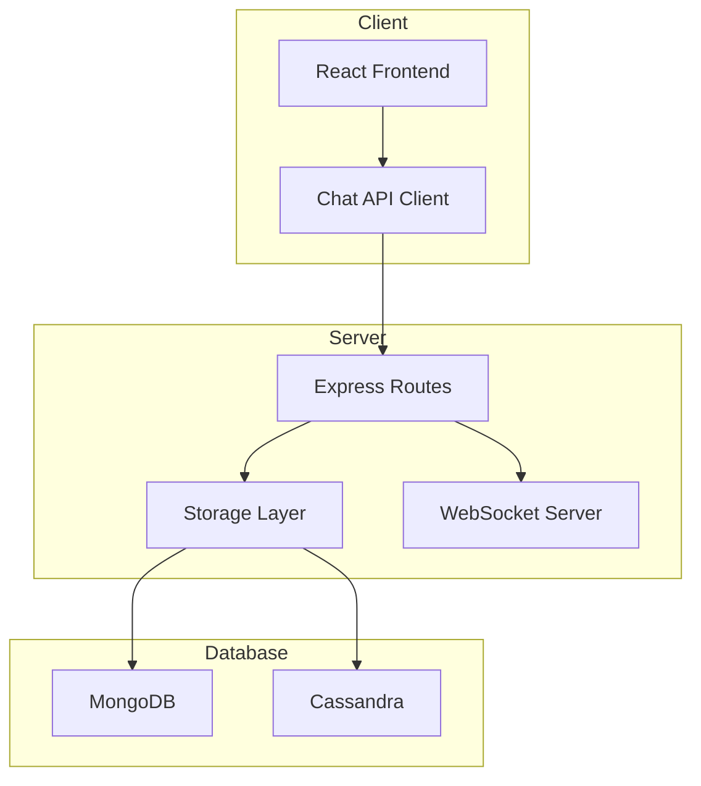
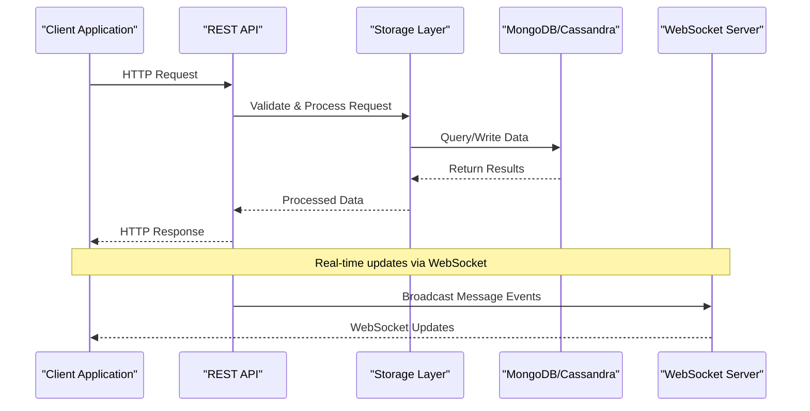
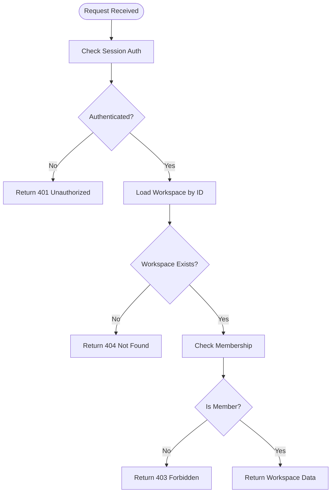
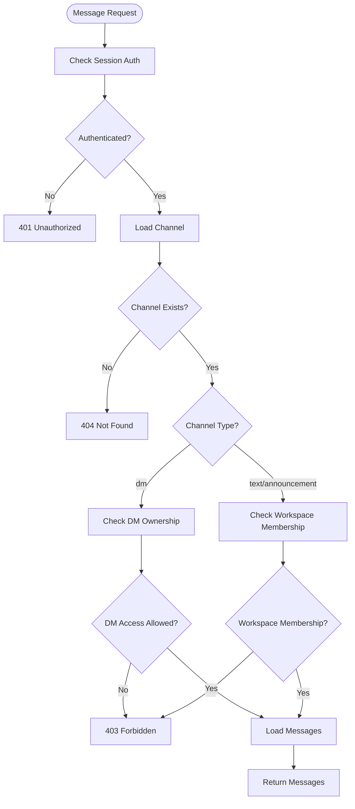
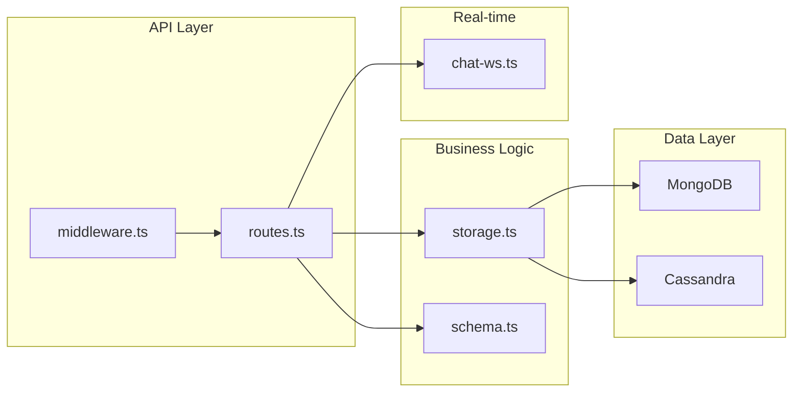
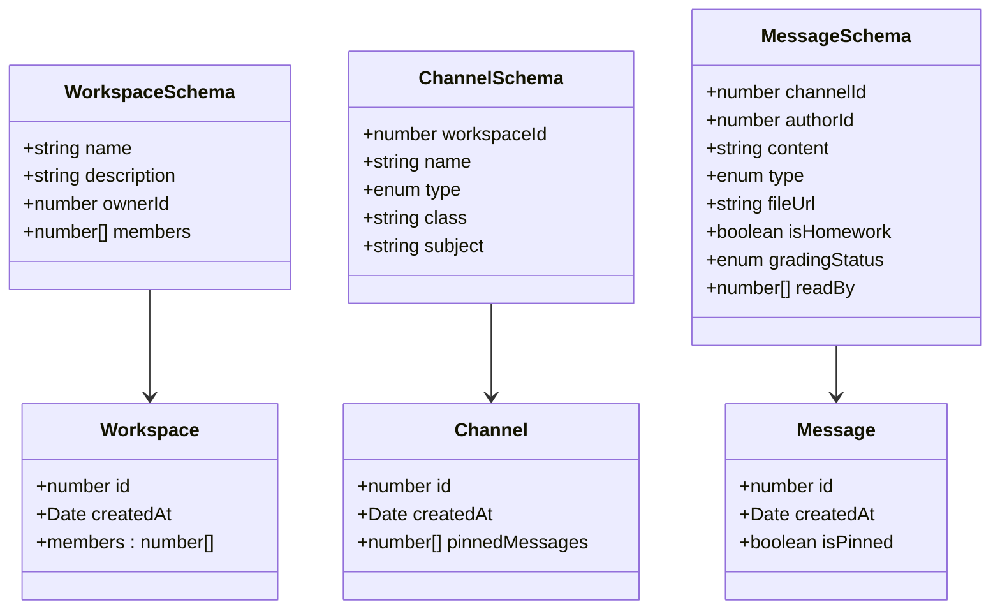

# Chat & Workspace Management Endpoints

<cite>
**Referenced Files in This Document**
- [server/routes.ts](file://server/routes.ts)
- [shared/schema.ts](file://shared/schema.ts)
- [server/storage.ts](file://server/storage.ts)
- [client/src/lib/chat-api.ts](file://client/src/lib/chat-api.ts)
- [client/src/types/chat.ts](file://client/src/types/chat.ts)
- [server/index.ts](file://server/index.ts)
- [server/chat-ws.ts](file://server/chat-ws.ts)
- [server/message/routes.ts](file://server/message/routes.ts)
</cite>

## Table of Contents
1. [Introduction](#introduction)
2. [Project Structure](#project-structure)
3. [Core Components](#core-components)
4. [Architecture Overview](#architecture-overview)
5. [Detailed Component Analysis](#detailed-component-analysis)
6. [Dependency Analysis](#dependency-analysis)
7. [Performance Considerations](#performance-considerations)
8. [Troubleshooting Guide](#troubleshooting-guide)
9. [Conclusion](#conclusion)

## Introduction
This document provides comprehensive API documentation for chat and workspace management endpoints. It covers workspace CRUD operations, member management, channel creation and listing, and message retrieval with pagination. The documentation includes detailed request/response schemas, role-based access controls, workspace membership requirements, and channel type restrictions (public, private, direct messages).

## Project Structure
The API endpoints are implemented in the server routes module and backed by a storage layer that manages both MongoDB and Cassandra data stores. The client-side API client provides typed interfaces for frontend consumption.

**Diagram sources**
- [server/routes.ts](file://server/routes.ts#L1-L1104)
- [server/storage.ts](file://server/storage.ts#L1-L519)
- [server/index.ts](file://server/index.ts#L1-L114)

**Section sources**
- [server/routes.ts](file://server/routes.ts#L1-L1104)
- [server/storage.ts](file://server/storage.ts#L1-L519)
- [server/index.ts](file://server/index.ts#L1-L114)

## Core Components
The chat and workspace management system consists of three primary components:
- Workspace management: creation, listing, retrieval, and member management
- Channel management: creation and listing within workspaces
- Message management: retrieval with pagination and read status tracking

Key data structures are validated using Zod schemas and stored in MongoDB with Cassandra as the primary message store.

**Section sources**
- [shared/schema.ts](file://shared/schema.ts#L107-L142)
- [server/storage.ts](file://server/storage.ts#L33-L106)

## Architecture Overview
The system follows a layered architecture with clear separation between presentation, business logic, and data persistence layers.

**Diagram sources**
- [server/routes.ts](file://server/routes.ts#L1-L1104)
- [server/storage.ts](file://server/storage.ts#L1-L519)
- [server/chat-ws.ts](file://server/chat-ws.ts#L1-L393)

## Detailed Component Analysis

### Workspace Management Endpoints

#### POST /api/workspaces
Creates a new workspace owned by the authenticated user.

**Authentication**: Required (session-based)
**Authorization**: None (any authenticated user can create workspaces)
**Request Body**:
- name: string (required)
- description: string (optional)
- ownerId: number (automatically set from session)
- members: number[] (automatically initialized as empty)

**Response**: Workspace object with auto-generated ID

**Section sources**
- [server/routes.ts](file://server/routes.ts#L584-L603)
- [shared/schema.ts](file://shared/schema.ts#L107-L112)

#### GET /api/workspaces
Lists all workspaces the current user belongs to.

**Authentication**: Required
**Authorization**: None
**Response**: Array of workspace objects

**Section sources**
- [server/routes.ts](file://server/routes.ts#L605-L614)

#### GET /api/workspaces/:id
Retrieves a specific workspace with access control validation.

**Authentication**: Required
**Authorization**: Must be a member of the workspace
**Response**: Workspace object

**Access Control Flow**:

**Diagram sources**
- [server/routes.ts](file://server/routes.ts#L616-L629)

**Section sources**
- [server/routes.ts](file://server/routes.ts#L616-L629)

#### POST /api/workspaces/:id/members
Adds a member to a workspace.

**Authentication**: Required
**Authorization**: Only workspace owner or teachers can add members
**Request Body**:
- userId: number (required)

**Response**: Updated workspace object

**Section sources**
- [server/routes.ts](file://server/routes.ts#L631-L654)

#### DELETE /api/workspaces/:id/members/:userId
Removes a member from a workspace.

**Authentication**: Required
**Authorization**: Only workspace owner or teachers can remove members
**Response**: Updated workspace object

**Section sources**
- [server/routes.ts](file://server/routes.ts#L656-L675)

### Channel Management Endpoints

#### POST /api/workspaces/:id/channels
Creates a new channel within a workspace.

**Authentication**: Required
**Authorization**: Only teachers can create channels
**Request Body**:
- name: string (required)
- type: enum ['text', 'announcement', 'dm'] (default: 'text')
- workspaceId: number (automatically set from path)
- class: string (optional)
- subject: string (optional)

**Response**: Channel object with auto-generated ID

**Section sources**
- [server/routes.ts](file://server/routes.ts#L679-L701)

#### GET /api/workspaces/:id/channels
Lists all channels in a workspace with membership validation.

**Authentication**: Required
**Authorization**: Must be a member of the workspace
**Response**: Array of channel objects

**Section sources**
- [server/routes.ts](file://server/routes.ts#L703-L718)

### Message Management Endpoints

#### GET /api/channels/:id/messages
Retrieves paginated message history for a channel.

**Authentication**: Required
**Authorization**: Channel access validation based on channel type
**Query Parameters**:
- limit: number (default: 50, max: 100)
- before: number (optional, cursor for pagination)

**Response**: Array of message objects ordered by creation time

**Access Control Logic**:

**Diagram sources**
- [server/routes.ts](file://server/routes.ts#L722-L745)

**Section sources**
- [server/routes.ts](file://server/routes.ts#L722-L745)

#### GET /api/messages/:channelId (Alias Endpoint)
Provides an alternative endpoint for retrieving channel messages with DM-specific validation.

**Authentication**: Required
**Authorization**: Same as channel messages endpoint with additional DM validation
**Query Parameters**: Same as above
**Response**: Array of message objects

**Section sources**
- [server/routes.ts](file://server/routes.ts#L747-L777)

### Additional Message Operations

#### POST /api/messages
Creates a new message (HTTP fallback for message sending).

**Authentication**: Required
**Authorization**: None (access controlled at channel level)
**Request Body**:
- channelId: number (required)
- authorId: number (automatically set from session)
- content: string (required)
- type: enum ['text', 'file', 'image'] (default: 'text')
- fileUrl: string (optional)
- isHomework: boolean (default: false)
- readBy: number[] (default: [])

**Response**: Message object with auto-generated ID

**Section sources**
- [server/routes.ts](file://server/routes.ts#L779-L804)

#### POST /api/channels/dm
Creates or retrieves a direct message channel between two users.

**Authentication**: Required
**Authorization**: None
**Request Body**:
- userIds: number[] (required, array of exactly 2 user IDs)

**Response**: Channel object (either existing or newly created)

**Section sources**
- [server/routes.ts](file://server/routes.ts#L806-L828)

#### GET /api/users/me/dms
Retrieves all direct message channels for the current user with partner information.

**Authentication**: Required
**Authorization**: None
**Response**: Array of DM channel objects with enriched partner information

**Section sources**
- [server/routes.ts](file://server/routes.ts#L830-L866)

## Dependency Analysis

**Diagram sources**
- [server/routes.ts](file://server/routes.ts#L1-L1104)
- [server/storage.ts](file://server/storage.ts#L1-L519)
- [shared/schema.ts](file://shared/schema.ts#L1-L142)
- [server/chat-ws.ts](file://server/chat-ws.ts#L1-L393)

### Data Validation and Schemas

The system uses Zod schemas for comprehensive input validation:

**Diagram sources**
- [shared/schema.ts](file://shared/schema.ts#L107-L142)

**Section sources**
- [shared/schema.ts](file://shared/schema.ts#L107-L142)

## Performance Considerations
- Message pagination limits requests to prevent excessive data transfer
- Cassandra is used as the primary message store for better scalability
- MongoDB serves as the primary datastore for workspace and channel metadata
- WebSocket connections provide real-time updates with rate limiting
- Session-based authentication reduces repeated database queries

## Troubleshooting Guide

### Common Authentication Issues
- **401 Unauthorized**: Ensure the client sends session cookies with each request
- **403 Forbidden**: Verify user has proper role and workspace membership
- **Session Management**: Check SESSION_SECRET environment variable in production

### Message Retrieval Issues
- **Pagination**: Use the `before` parameter as a cursor for efficient pagination
- **Limit Constraints**: Maximum 100 messages per request
- **DM Access**: Direct messages require the user ID to be present in the channel name pattern

### WebSocket Integration
- **Connection Issues**: Verify WebSocket server is running on `/ws/chat`
- **Rate Limiting**: Messages are rate-limited to prevent spam
- **Heartbeat**: WebSocket maintains connection health with periodic pings

**Section sources**
- [server/routes.ts](file://server/routes.ts#L722-L777)
- [server/chat-ws.ts](file://server/chat-ws.ts#L157-L169)

## Conclusion
The chat and workspace management system provides a robust foundation for collaborative learning environments. The API enforces strict access controls while maintaining flexibility for different user roles. The dual database architecture ensures optimal performance for both metadata and high-volume message data. The WebSocket integration enables real-time communication capabilities essential for modern chat applications.