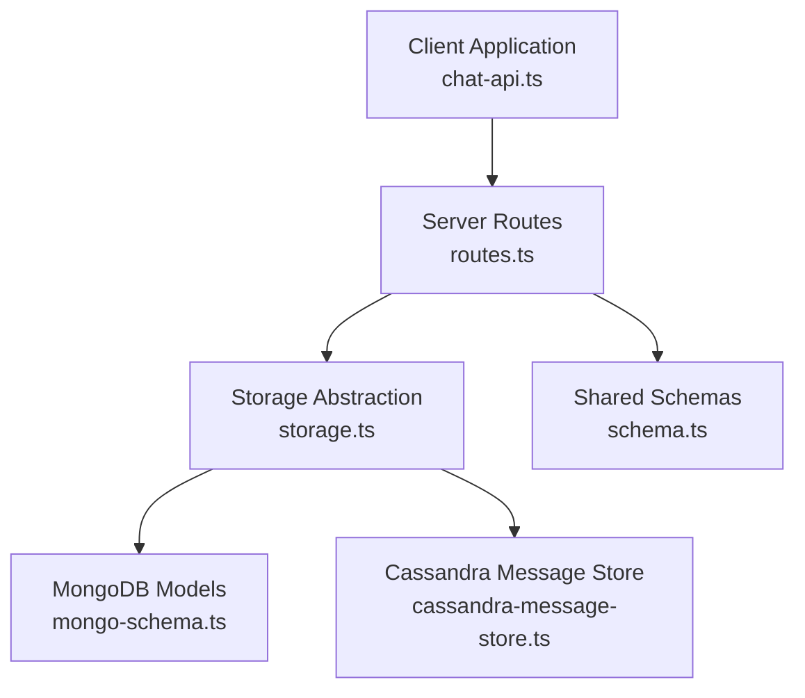
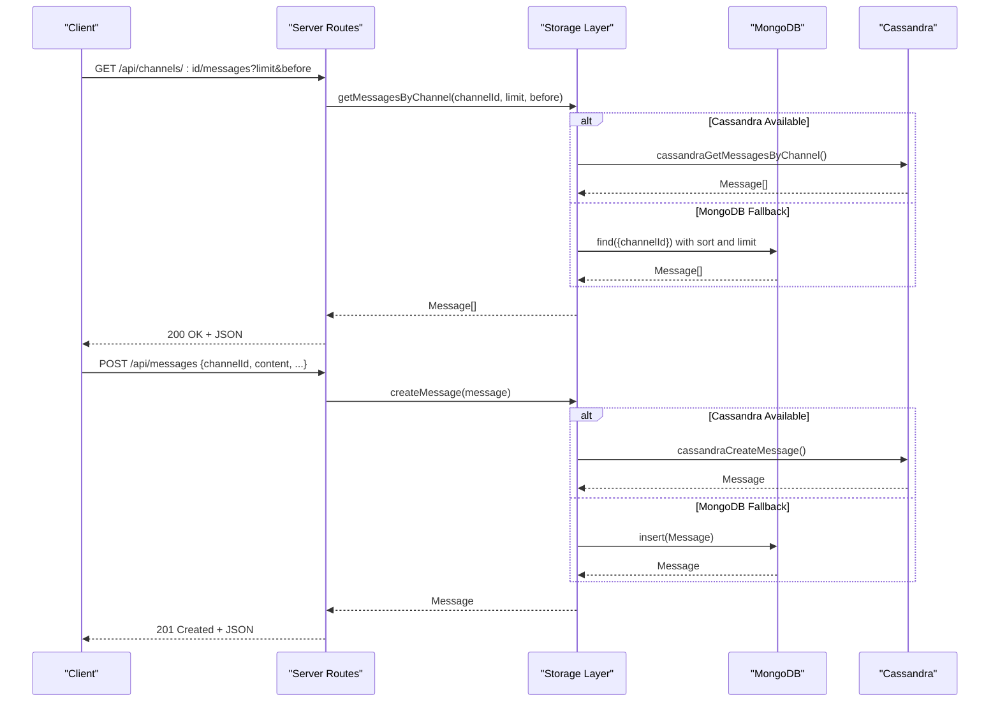
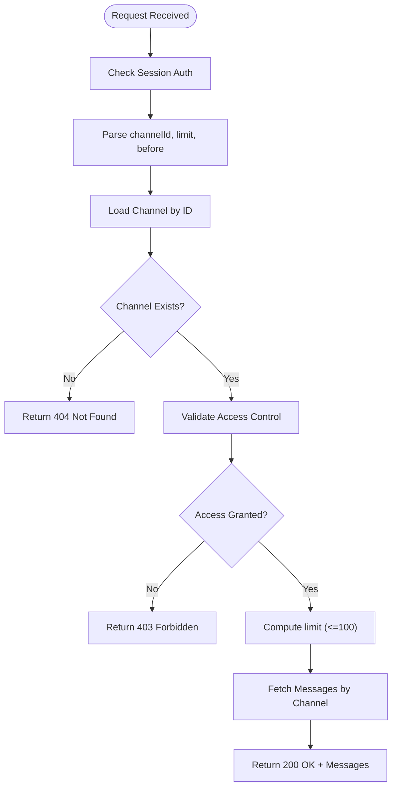
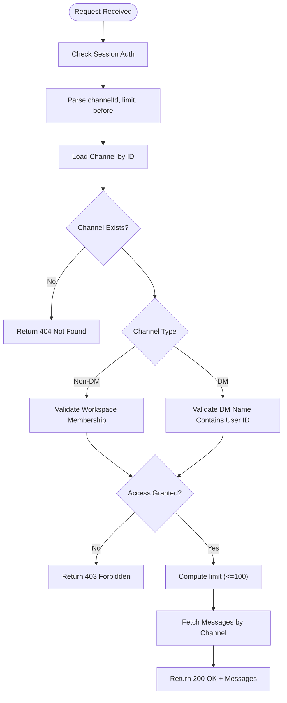
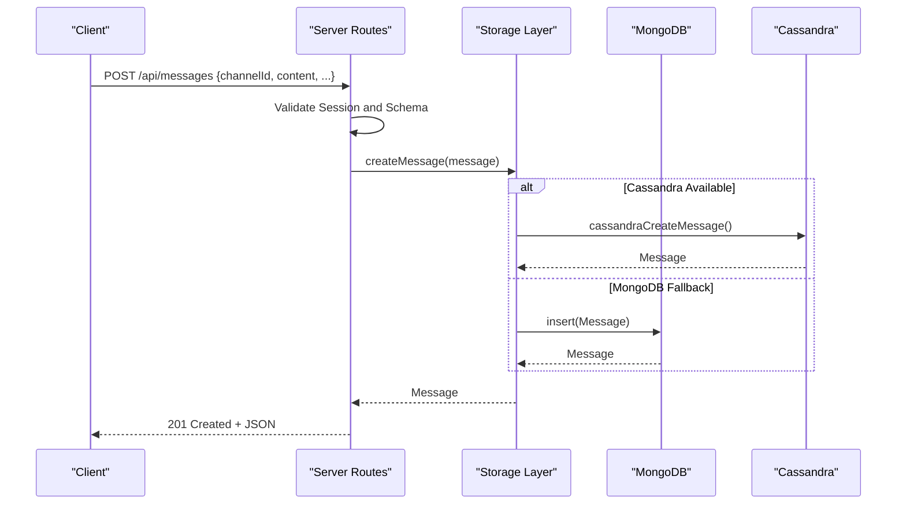
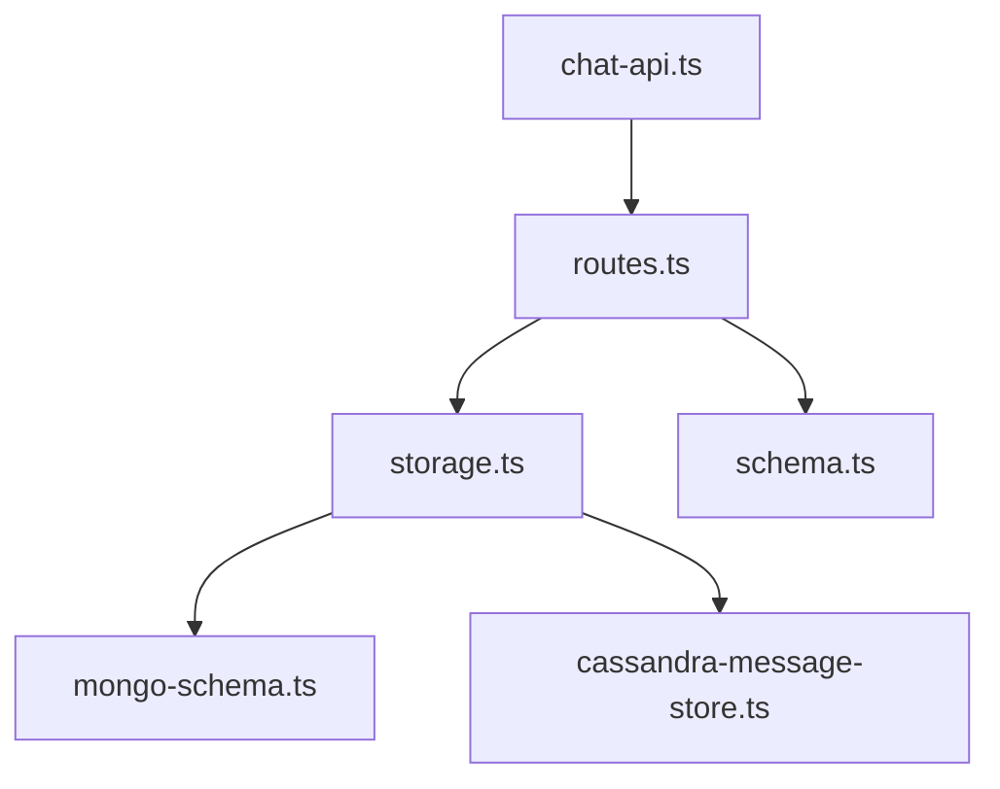

# Message Management Endpoints

<cite>
**Referenced Files in This Document**
- [routes.ts](file://server/routes.ts)
- [storage.ts](file://server/storage.ts)
- [schema.ts](file://shared/schema.ts)
- [mongo-schema.ts](file://shared/mongo-schema.ts)
- [cassandra-message-store.ts](file://server/lib/cassandra-message-store.ts)
- [chat-api.ts](file://client/src/lib/chat-api.ts)
</cite>

## Table of Contents
1. [Introduction](#introduction)
2. [Project Structure](#project-structure)
3. [Core Components](#core-components)
4. [Architecture Overview](#architecture-overview)
5. [Detailed Component Analysis](#detailed-component-analysis)
6. [Dependency Analysis](#dependency-analysis)
7. [Performance Considerations](#performance-considerations)
8. [Troubleshooting Guide](#troubleshooting-guide)
9. [Conclusion](#conclusion)

## Introduction
This document provides comprehensive API documentation for message management endpoints focused on retrieving and sending messages within channels. It covers:
- Message retrieval via GET endpoints with pagination support using limit and before parameters
- Message sending via POST endpoint
- Access control mechanisms distinguishing workspace channels from direct messages (DMs)
- Workspace membership requirements and DM-specific access validation using channel names
- Request/response schemas, error handling, and pagination parameters

## Project Structure
The message management feature spans server-side routing, storage abstraction, and client-side API consumption:
- Server routes define the HTTP endpoints and enforce access control
- Storage abstraction supports both MongoDB and Cassandra backends
- Client library consumes the endpoints and manages pagination parameters

**Diagram sources**
- [routes.ts](file://server/routes.ts#L722-L777)
- [storage.ts](file://server/storage.ts#L33-L106)
- [mongo-schema.ts](file://shared/mongo-schema.ts#L110-L159)
- [cassandra-message-store.ts](file://server/lib/cassandra-message-store.ts#L1-L166)
- [schema.ts](file://shared/schema.ts#L105-L142)
- [chat-api.ts](file://client/src/lib/chat-api.ts#L1-L112)

**Section sources**
- [routes.ts](file://server/routes.ts#L722-L777)
- [storage.ts](file://server/storage.ts#L33-L106)
- [schema.ts](file://shared/schema.ts#L105-L142)
- [mongo-schema.ts](file://shared/mongo-schema.ts#L110-L159)
- [cassandra-message-store.ts](file://server/lib/cassandra-message-store.ts#L1-L166)
- [chat-api.ts](file://client/src/lib/chat-api.ts#L1-L112)

## Core Components
- Message retrieval endpoints:
  - GET /api/channels/:id/messages
  - GET /api/messages/:channelId (alias)
- Message sending endpoint:
  - POST /api/messages
- Pagination parameters:
  - limit: integer, default 50, capped at 100
  - before: integer, optional cursor for pagination
- Access control:
  - Workspace channels require membership in the workspace owning the channel
  - Direct messages (DMs) require the authenticated user to be present in the channel name pattern

**Section sources**
- [routes.ts](file://server/routes.ts#L722-L777)
- [storage.ts](file://server/storage.ts#L424-L437)

## Architecture Overview
The message management flow integrates client requests, server validation, and backend storage:

**Diagram sources**
- [routes.ts](file://server/routes.ts#L722-L777)
- [storage.ts](file://server/storage.ts#L413-L437)
- [cassandra-message-store.ts](file://server/lib/cassandra-message-store.ts#L36-L102)
- [mongo-schema.ts](file://shared/mongo-schema.ts#L132-L144)

## Detailed Component Analysis

### Message Retrieval Endpoints

#### Endpoint: GET /api/channels/:id/messages
- Purpose: Retrieve paginated message history for a specific channel
- Authentication: Required (session-based)
- Path Parameters:
  - id: numeric channel identifier
- Query Parameters:
  - limit: integer, default 50, maximum 100
  - before: integer, optional cursor
- Access Control:
  - Workspace channels: requires membership in the workspace owning the channel
  - DMs: validated via channel workspace presence (for non-DM type branch)
- Response: Array of messages ordered from oldest to newest

**Diagram sources**
- [routes.ts](file://server/routes.ts#L722-L745)
- [storage.ts](file://server/storage.ts#L424-L437)

**Section sources**
- [routes.ts](file://server/routes.ts#L722-L745)
- [storage.ts](file://server/storage.ts#L424-L437)

#### Endpoint: GET /api/messages/:channelId (Alias)
- Purpose: Retrieve paginated message history for a channel with DM-aware access control
- Authentication: Required (session-based)
- Path Parameters:
  - channelId: numeric channel identifier
- Query Parameters:
  - limit: integer, default 50, maximum 100
  - before: integer, optional cursor
- Access Control:
  - Non-DM channels: requires workspace membership
  - DM channels: validates that the authenticated user's ID appears in the channel name
- Response: Array of messages ordered from oldest to newest

**Diagram sources**
- [routes.ts](file://server/routes.ts#L747-L777)
- [storage.ts](file://server/storage.ts#L424-L437)

**Section sources**
- [routes.ts](file://server/routes.ts#L747-L777)
- [storage.ts](file://server/storage.ts#L424-L437)

### Message Sending Endpoint

#### Endpoint: POST /api/messages
- Purpose: Create a new message in a channel
- Authentication: Required (session-based)
- Request Body: Message payload with author auto-assigned from session
- Validation: Uses shared schema for message creation
- Response: Created message object

**Diagram sources**
- [routes.ts](file://server/routes.ts#L779-L800)
- [storage.ts](file://server/storage.ts#L413-L422)
- [cassandra-message-store.ts](file://server/lib/cassandra-message-store.ts#L36-L75)
- [schema.ts](file://shared/schema.ts#L122-L131)

**Section sources**
- [routes.ts](file://server/routes.ts#L779-L800)
- [storage.ts](file://server/storage.ts#L413-L422)
- [schema.ts](file://shared/schema.ts#L122-L131)

### Pagination Parameters
- limit
  - Default value: 50
  - Maximum cap: 100
  - Applied consistently across both retrieval endpoints
- before
  - Optional cursor parameter
  - Used to fetch older messages relative to the specified message ID
  - Backend converts numeric ID to appropriate internal representation for the selected storage engine

**Section sources**
- [routes.ts](file://server/routes.ts#L737-L738)
- [routes.ts](file://server/routes.ts#L769-L770)
- [cassandra-message-store.ts](file://server/lib/cassandra-message-store.ts#L79-L102)
- [storage.ts](file://server/storage.ts#L424-L437)

### Access Control Mechanisms
- Workspace channels
  - Requires the authenticated user to be a member of the workspace that owns the channel
  - Enforced by loading the workspace and checking membership
- Direct messages (DMs)
  - Enforced by validating that the channel name includes the authenticated user's ID
  - Channel names for DMs follow a specific pattern derived from participant IDs

**Section sources**
- [routes.ts](file://server/routes.ts#L731-L735)
- [routes.ts](file://server/routes.ts#L756-L767)

### Request/Response Schemas

#### Shared Message Schema (Server-Side Validation)
- Fields:
  - channelId: number
  - authorId: number (auto-filled from session on create)
  - content: string (required)
  - type: enum ["text", "file", "image"] (default "text")
  - fileUrl: string | null (optional)
  - isHomework: boolean (default false)
  - gradingStatus: enum ["pending", "graded"] | null (optional)
  - readBy: number[] (default [])

**Section sources**
- [schema.ts](file://shared/schema.ts#L122-L131)

#### Client-Side Message Model
- Fields:
  - id: number
  - channelId: number
  - authorId: number
  - authorUsername?: string
  - content: string
  - type: "text" | "file" | "image"
  - fileUrl?: string | null
  - readBy: number[]
  - isHomework?: boolean
  - homeworkStatus?: "pending" | "graded"
  - createdAt: string

**Section sources**
- [chat-api.ts](file://client/src/lib/chat-api.ts#L21-L33)

### Error Handling
Common HTTP responses:
- 401 Unauthorized: Missing or invalid session
- 403 Forbidden: Access denied due to workspace membership or DM access validation
- 404 Not Found: Channel does not exist
- 500 Internal Server Error: General failure during processing

**Section sources**
- [routes.ts](file://server/routes.ts#L725-L725)
- [routes.ts](file://server/routes.ts#L731-L735)
- [routes.ts](file://server/routes.ts#L756-L767)
- [routes.ts](file://server/routes.ts#L782-L782)

## Dependency Analysis
Message retrieval depends on:
- Route handlers for validation and parameter parsing
- Storage abstraction for cross-backend compatibility
- Backend-specific implementations (MongoDB and Cassandra)

**Diagram sources**
- [routes.ts](file://server/routes.ts#L722-L777)
- [storage.ts](file://server/storage.ts#L33-L106)
- [mongo-schema.ts](file://shared/mongo-schema.ts#L110-L159)
- [cassandra-message-store.ts](file://server/lib/cassandra-message-store.ts#L1-L166)
- [schema.ts](file://shared/schema.ts#L105-L142)
- [chat-api.ts](file://client/src/lib/chat-api.ts#L1-L112)

**Section sources**
- [routes.ts](file://server/routes.ts#L722-L777)
- [storage.ts](file://server/storage.ts#L33-L106)
- [schema.ts](file://shared/schema.ts#L105-L142)
- [mongo-schema.ts](file://shared/mongo-schema.ts#L110-L159)
- [cassandra-message-store.ts](file://server/lib/cassandra-message-store.ts#L1-L166)
- [chat-api.ts](file://client/src/lib/chat-api.ts#L1-L112)

## Performance Considerations
- Pagination limits:
  - Default 50 messages per page with a hard cap of 100 to prevent excessive loads
- Backend selection:
  - When Cassandra is available, retrieval leverages partition and clustering keys for efficient ordering and limiting
  - MongoDB fallback uses indexed filters and sorting with limit
- Cursor-based pagination:
  - The before parameter enables efficient backward pagination by constraining the query to earlier messages

**Section sources**
- [routes.ts](file://server/routes.ts#L737-L738)
- [routes.ts](file://server/routes.ts#L769-L770)
- [cassandra-message-store.ts](file://server/lib/cassandra-message-store.ts#L79-L102)
- [storage.ts](file://server/storage.ts#L424-L437)

## Troubleshooting Guide
- 401 Unauthorized:
  - Ensure the session cookie is included with the request
- 403 Forbidden:
  - Workspace channels: confirm membership in the workspace owning the channel
  - DM channels: verify the channel name includes your user ID
- 404 Not Found:
  - Confirm the channel ID exists
- Unexpected empty results:
  - Verify limit and before parameters
  - For DMs, ensure the channel name pattern matches your user ID

**Section sources**
- [routes.ts](file://server/routes.ts#L725-L725)
- [routes.ts](file://server/routes.ts#L731-L735)
- [routes.ts](file://server/routes.ts#L756-L767)
- [routes.ts](file://server/routes.ts#L782-L782)

## Conclusion
The message management endpoints provide robust, paginated access to channel messages with clear access control for both workspace channels and direct messages. The storage abstraction ensures compatibility with multiple backends while maintaining consistent behavior and performance characteristics.