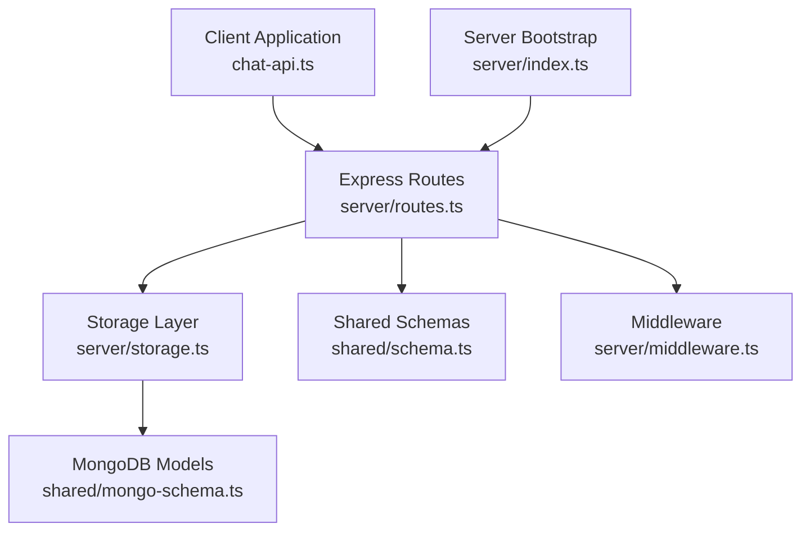
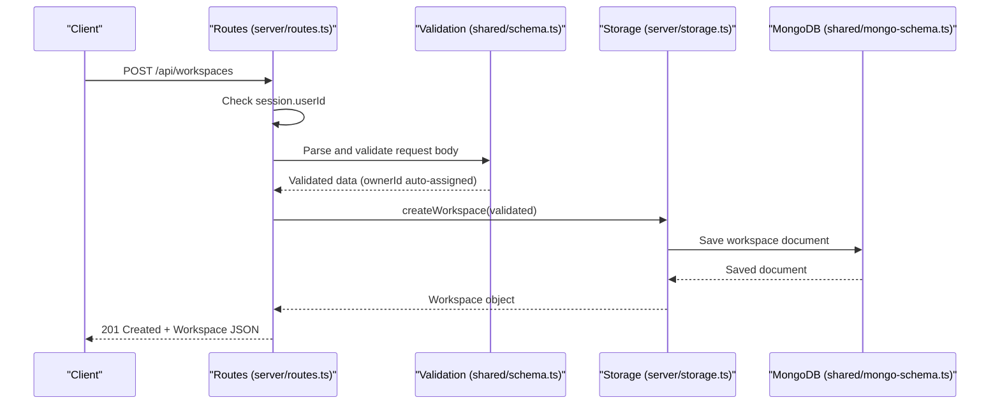
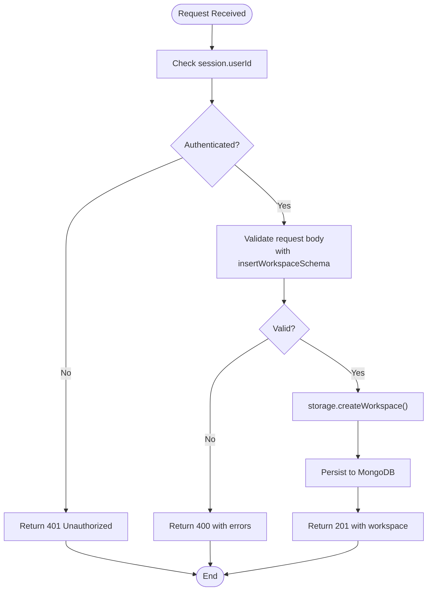
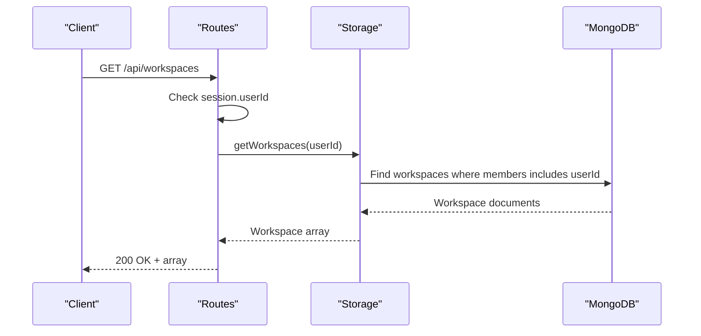
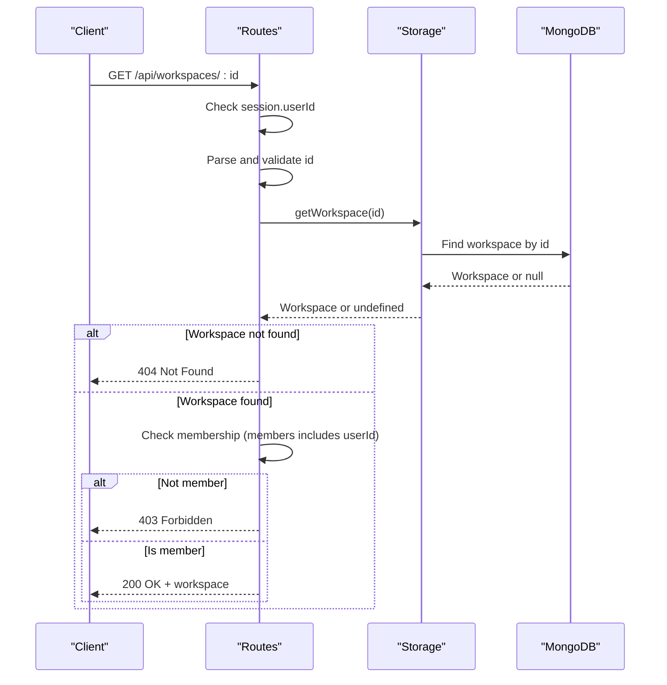
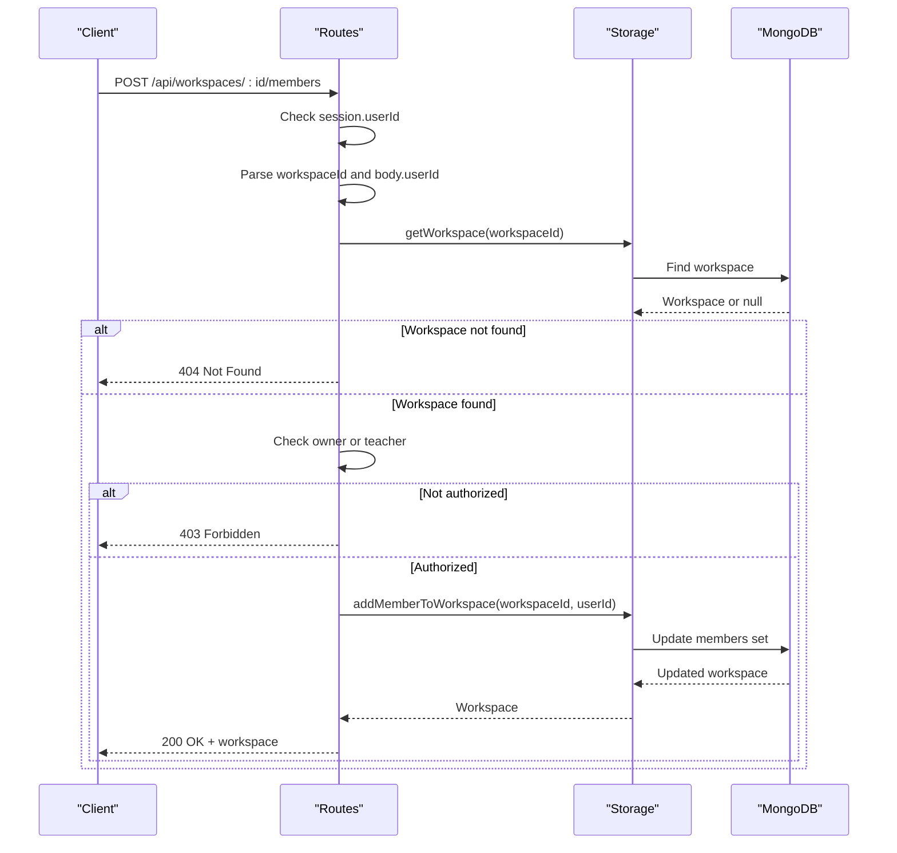
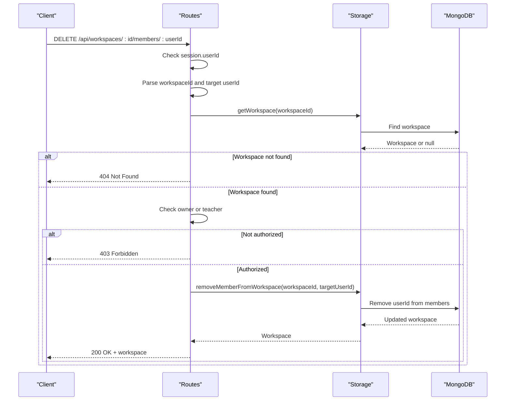
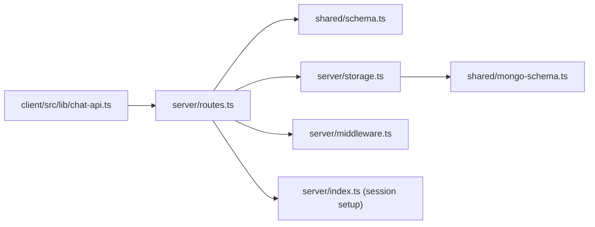

# Workspace Management Endpoints

<cite>
**Referenced Files in This Document**
- [server/routes.ts](file://server/routes.ts)
- [server/storage.ts](file://server/storage.ts)
- [shared/schema.ts](file://shared/schema.ts)
- [shared/mongo-schema.ts](file://shared/mongo-schema.ts)
- [server/index.ts](file://server/index.ts)
- [server/middleware.ts](file://server/middleware.ts)
- [client/src/lib/chat-api.ts](file://client/src/lib/chat-api.ts)
</cite>

## Table of Contents
1. [Introduction](#introduction)
2. [Project Structure](#project-structure)
3. [Core Components](#core-components)
4. [Architecture Overview](#architecture-overview)
5. [Detailed Component Analysis](#detailed-component-analysis)
6. [Dependency Analysis](#dependency-analysis)
7. [Performance Considerations](#performance-considerations)
8. [Troubleshooting Guide](#troubleshooting-guide)
9. [Conclusion](#conclusion)

## Introduction
This document provides comprehensive API documentation for workspace management endpoints. It covers workspace creation, listing, retrieval, and member management, including authentication requirements, role-based access control, workspace ownership rules, and error handling patterns. The documentation is grounded in the actual implementation present in the repository.

## Project Structure
The workspace management functionality is implemented in the server backend with clear separation of concerns:
- Routes define the HTTP endpoints and basic access control checks
- Storage encapsulates data access and persistence
- Shared schemas define validation rules for request bodies
- Middleware enforces authentication and roles
- Client API helpers demonstrate expected response shapes

**Diagram sources**
- [server/routes.ts](file://server/routes.ts#L11-L800)
- [server/storage.ts](file://server/storage.ts#L319-L355)
- [shared/mongo-schema.ts](file://shared/mongo-schema.ts#L112-L158)
- [shared/schema.ts](file://shared/schema.ts#L107-L112)
- [server/middleware.ts](file://server/middleware.ts#L1-L18)
- [server/index.ts](file://server/index.ts#L1-L114)
- [client/src/lib/chat-api.ts](file://client/src/lib/chat-api.ts#L1-L112)

**Section sources**
- [server/routes.ts](file://server/routes.ts#L584-L675)
- [server/storage.ts](file://server/storage.ts#L319-L355)
- [shared/schema.ts](file://shared/schema.ts#L107-L112)
- [shared/mongo-schema.ts](file://shared/mongo-schema.ts#L112-L158)
- [server/index.ts](file://server/index.ts#L1-L114)
- [client/src/lib/chat-api.ts](file://client/src/lib/chat-api.ts#L1-L112)

## Core Components
- Workspace creation endpoint validates input using shared schemas and automatically assigns the authenticated user as the owner
- Workspace listing returns all workspaces where the authenticated user is a member
- Workspace retrieval enforces member-only access control
- Member management endpoints enforce owner or teacher privileges for adding/removing members

Key implementation references:
- Workspace creation: [server/routes.ts](file://server/routes.ts#L584-L603)
- Workspace listing: [server/routes.ts](file://server/routes.ts#L605-L614)
- Workspace retrieval: [server/routes.ts](file://server/routes.ts#L616-L629)
- Member management: [server/routes.ts](file://server/routes.ts#L631-L675)
- Storage operations: [server/storage.ts](file://server/storage.ts#L319-L355)
- Validation schemas: [shared/schema.ts](file://shared/schema.ts#L107-L112)
- Database model: [shared/mongo-schema.ts](file://shared/mongo-schema.ts#L112-L119)

**Section sources**
- [server/routes.ts](file://server/routes.ts#L584-L675)
- [server/storage.ts](file://server/storage.ts#L319-L355)
- [shared/schema.ts](file://shared/schema.ts#L107-L112)
- [shared/mongo-schema.ts](file://shared/mongo-schema.ts#L112-L119)

## Architecture Overview
The workspace endpoints follow a layered architecture:
- HTTP layer: Express routes handle requests and responses
- Validation layer: Zod schemas validate and normalize inputs
- Access control: Session-based authentication and role checks
- Persistence layer: MongoDB-backed storage operations
- Response modeling: Consistent response shapes for clients

**Diagram sources**
- [server/routes.ts](file://server/routes.ts#L584-L603)
- [shared/schema.ts](file://shared/schema.ts#L107-L112)
- [server/storage.ts](file://server/storage.ts#L321-L327)
- [shared/mongo-schema.ts](file://shared/mongo-schema.ts#L112-L119)

## Detailed Component Analysis

### Workspace Creation (POST /api/workspaces)
Purpose: Create a new workspace owned by the authenticated user.

Authentication and Authorization:
- Requires session-based authentication (session.userId must be present)
- Automatically assigns ownerId from session.userId
- members array is initialized as empty and later populated with the owner

Request Schema:
- Required: name (string)
- Optional: description (string|null)
- Automatic: ownerId (number), members (array<number>)

Response:
- 201 Created with the created workspace object
- 400 Bad Request for invalid input (schema validation errors)
- 401 Unauthorized if not authenticated
- 500 Internal Server Error for failures

Implementation details:
- Validation uses insertWorkspaceSchema
- Storage creates a workspace with deduplicated members (owner + any provided members)
- Response shape aligns with Workspace type

**Diagram sources**
- [server/routes.ts](file://server/routes.ts#L584-L603)
- [shared/schema.ts](file://shared/schema.ts#L107-L112)
- [server/storage.ts](file://server/storage.ts#L321-L327)
- [shared/mongo-schema.ts](file://shared/mongo-schema.ts#L112-L119)

**Section sources**
- [server/routes.ts](file://server/routes.ts#L584-L603)
- [shared/schema.ts](file://shared/schema.ts#L107-L112)
- [server/storage.ts](file://server/storage.ts#L321-L327)
- [shared/mongo-schema.ts](file://shared/mongo-schema.ts#L112-L119)

### Workspace Listing (GET /api/workspaces)
Purpose: Retrieve all workspaces accessible to the authenticated user.

Authentication and Authorization:
- Requires session-based authentication
- Returns workspaces where the user is a member

Request:
- No path or query parameters required

Response:
- 200 OK with array of workspace objects
- 401 Unauthorized if not authenticated
- 500 Internal Server Error for failures

Implementation details:
- Uses storage.getWorkspaces(userId)
- Filters workspaces by membership

**Diagram sources**
- [server/routes.ts](file://server/routes.ts#L605-L614)
- [server/storage.ts](file://server/storage.ts#L334-L337)
- [shared/mongo-schema.ts](file://shared/mongo-schema.ts#L112-L119)

**Section sources**
- [server/routes.ts](file://server/routes.ts#L605-L614)
- [server/storage.ts](file://server/storage.ts#L334-L337)
- [shared/mongo-schema.ts](file://shared/mongo-schema.ts#L112-L119)

### Workspace Retrieval (GET /api/workspaces/:id)
Purpose: Retrieve a specific workspace by ID with member-only access control.

Authentication and Authorization:
- Requires session-based authentication
- Enforces member-only access: user must be in workspace.members

Request:
- Path parameter: id (number)

Response:
- 200 OK with workspace object
- 401 Unauthorized if not authenticated
- 403 Forbidden if user is not a member
- 404 Not Found if workspace does not exist
- 500 Internal Server Error for failures

Implementation details:
- Validates numeric ID
- Checks existence and membership

**Diagram sources**
- [server/routes.ts](file://server/routes.ts#L616-L629)
- [server/storage.ts](file://server/storage.ts#L329-L332)
- [shared/mongo-schema.ts](file://shared/mongo-schema.ts#L112-L119)

**Section sources**
- [server/routes.ts](file://server/routes.ts#L616-L629)
- [server/storage.ts](file://server/storage.ts#L329-L332)
- [shared/mongo-schema.ts](file://shared/mongo-schema.ts#L112-L119)

### Member Management Endpoints

#### Add Member (POST /api/workspaces/:id/members)
Purpose: Add a user to a workspace.

Authorization:
- Only the workspace owner or users with role "teacher" may add members

Request:
- Path parameter: id (number)
- Body: { userId: number }

Response:
- 200 OK with updated workspace object
- 400 Bad Request if userId is missing or invalid
- 401 Unauthorized if not authenticated
- 403 Forbidden if requester lacks permission
- 404 Not Found if workspace does not exist
- 500 Internal Server Error for failures

Implementation details:
- Validates numeric workspaceId and userId
- Enforces owner or teacher privilege
- Uses storage.addMemberToWorkspace

**Diagram sources**
- [server/routes.ts](file://server/routes.ts#L631-L654)
- [server/storage.ts](file://server/storage.ts#L339-L346)
- [shared/mongo-schema.ts](file://shared/mongo-schema.ts#L112-L119)

**Section sources**
- [server/routes.ts](file://server/routes.ts#L631-L654)
- [server/storage.ts](file://server/storage.ts#L339-L346)
- [shared/mongo-schema.ts](file://shared/mongo-schema.ts#L112-L119)

#### Remove Member (DELETE /api/workspaces/:id/members/:userId)
Purpose: Remove a user from a workspace.

Authorization:
- Only the workspace owner or users with role "teacher" may remove members

Request:
- Path parameters: id (number), userId (number)

Response:
- 200 OK with updated workspace object
- 401 Unauthorized if not authenticated
- 403 Forbidden if requester lacks permission
- 404 Not Found if workspace does not exist
- 500 Internal Server Error for failures

Implementation details:
- Validates numeric workspaceId and target userId
- Enforces owner or teacher privilege
- Uses storage.removeMemberFromWorkspace

**Diagram sources**
- [server/routes.ts](file://server/routes.ts#L656-L675)
- [server/storage.ts](file://server/storage.ts#L348-L355)
- [shared/mongo-schema.ts](file://shared/mongo-schema.ts#L112-L119)

**Section sources**
- [server/routes.ts](file://server/routes.ts#L656-L675)
- [server/storage.ts](file://server/storage.ts#L348-L355)
- [shared/mongo-schema.ts](file://shared/mongo-schema.ts#L112-L119)

### Request and Response Schemas

Workspace (response):
- id: number
- name: string
- description: string | null
- ownerId: number
- members: number[]
- createdAt: string (ISO date)

Member management request (add/remove):
- userId: number

Notes:
- The client-side API interface for workspaces excludes description, while the server response includes it. Clients should handle optional fields gracefully.

**Section sources**
- [shared/schema.ts](file://shared/schema.ts#L133-L134)
- [shared/mongo-schema.ts](file://shared/mongo-schema.ts#L112-L119)
- [client/src/lib/chat-api.ts](file://client/src/lib/chat-api.ts#L4-L9)

## Dependency Analysis
The workspace endpoints depend on:
- Session-based authentication (session.userId, session.role)
- Zod schemas for validation
- MongoDB models for persistence
- Storage methods for data operations

**Diagram sources**
- [server/routes.ts](file://server/routes.ts#L1-L10)
- [shared/schema.ts](file://shared/schema.ts#L1-L142)
- [server/storage.ts](file://server/storage.ts#L1-L10)
- [shared/mongo-schema.ts](file://shared/mongo-schema.ts#L112-L158)
- [server/middleware.ts](file://server/middleware.ts#L1-L18)
- [server/index.ts](file://server/index.ts#L30-L44)
- [client/src/lib/chat-api.ts](file://client/src/lib/chat-api.ts#L1-L112)

**Section sources**
- [server/routes.ts](file://server/routes.ts#L1-L10)
- [shared/schema.ts](file://shared/schema.ts#L1-L142)
- [server/storage.ts](file://server/storage.ts#L1-L10)
- [shared/mongo-schema.ts](file://shared/mongo-schema.ts#L112-L158)
- [server/middleware.ts](file://server/middleware.ts#L1-L18)
- [server/index.ts](file://server/index.ts#L30-L44)
- [client/src/lib/chat-api.ts](file://client/src/lib/chat-api.ts#L1-L112)

## Performance Considerations
- Workspace listing queries workspaces by membership using a simple equality match; ensure appropriate indexing on the members array for large datasets
- Member operations use atomic MongoDB operators ($addToSet/$pull) to avoid race conditions
- Consider pagination for listing endpoints if workspaces per user grows substantially

## Troubleshooting Guide
Common error scenarios and resolutions:
- 401 Unauthorized: Ensure the client sends session cookies and the user is logged in
- 403 Forbidden: Verify the user is either the workspace owner or has role "teacher"
- 404 Not Found: Confirm the workspace ID exists and is accessible to the user
- 400 Bad Request: Validate request body against insertWorkspaceSchema requirements

**Section sources**
- [server/routes.ts](file://server/routes.ts#L584-L675)
- [shared/schema.ts](file://shared/schema.ts#L107-L112)

## Conclusion
The workspace management endpoints provide a clear, role-aware API for creating, listing, retrieving, and managing workspace memberships. They rely on session-based authentication, strict input validation, and robust access control to maintain data integrity and security. The documented schemas and flows enable consistent client-server integration and predictable error handling.