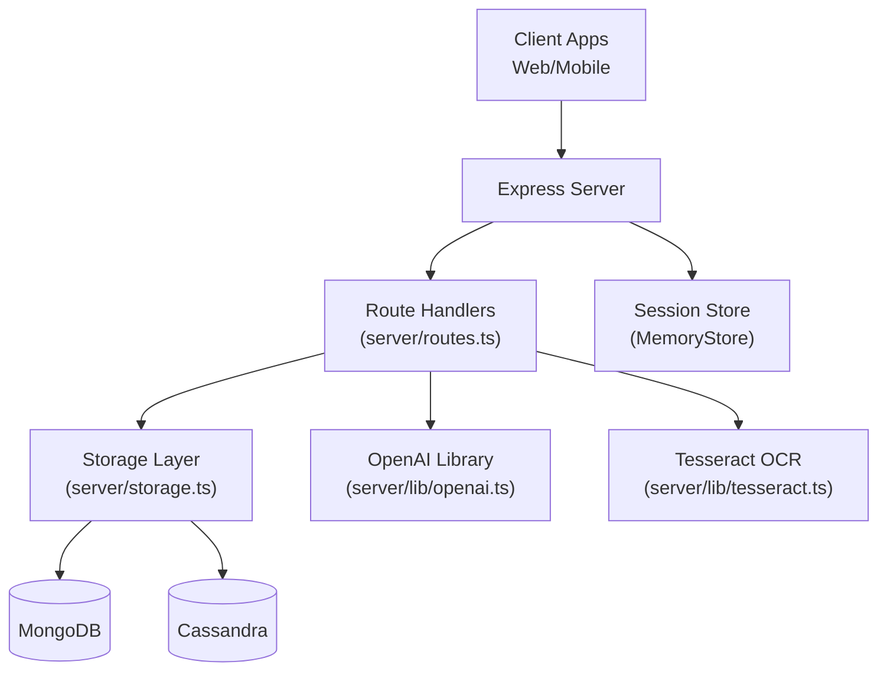
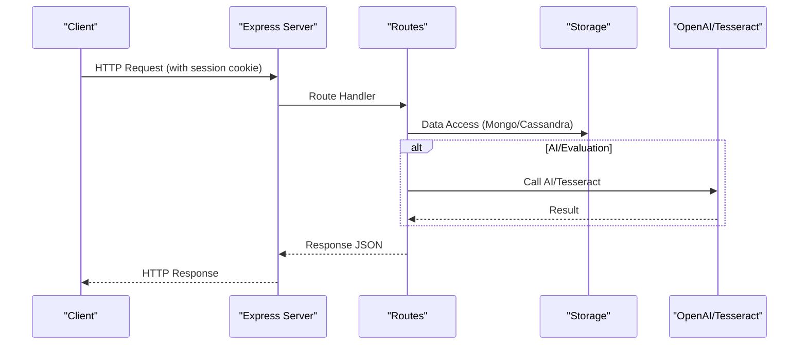
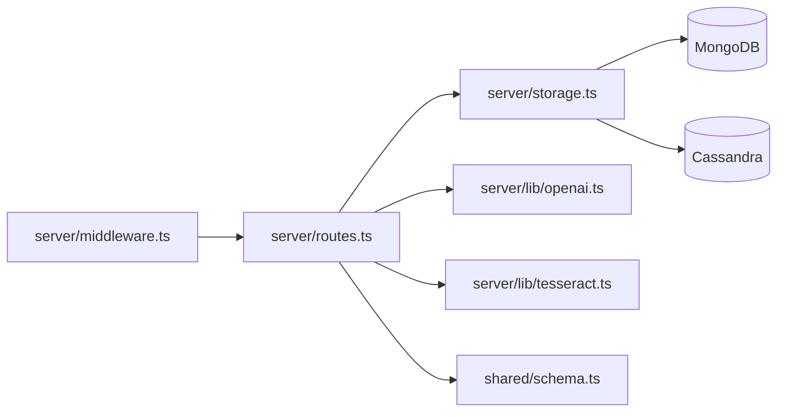

# REST API Endpoints

<cite>
**Referenced Files in This Document**
- [server/index.ts](file://server/index.ts)
- [server/routes.ts](file://server/routes.ts)
- [server/middleware.ts](file://server/middleware.ts)
- [shared/schema.ts](file://shared/schema.ts)
- [server/lib/openai.ts](file://server/lib/openai.ts)
- [server/lib/tesseract.ts](file://server/lib/tesseract.ts)
- [server/storage.ts](file://server/storage.ts)
- [server/message/routes.ts](file://server/message/routes.ts)
- [client/src/lib/chat-api.ts](file://client/src/lib/chat-api.ts)
</cite>

## Table of Contents
1. [Introduction](#introduction)
2. [Project Structure](#project-structure)
3. [Core Components](#core-components)
4. [Architecture Overview](#architecture-overview)
5. [Detailed Component Analysis](#detailed-component-analysis)
6. [Dependency Analysis](#dependency-analysis)
7. [Performance Considerations](#performance-considerations)
8. [Troubleshooting Guide](#troubleshooting-guide)
9. [Conclusion](#conclusion)

## Introduction
This document provides comprehensive REST API documentation for PersonalLearningPro’s HTTP endpoints. It covers authentication, user management, assessments (tests, questions, attempts, answers), AI-powered evaluation and chat, OCR processing, and the integrated chat system (workspaces, channels, messages). For each endpoint, you will find HTTP methods, URL patterns, request/response schemas, authentication requirements, parameter specifications, validation rules, and response codes. Practical examples and troubleshooting guidance are included to help developers integrate and operate the API effectively.

## Project Structure
The API is implemented in a Node.js/Express server with TypeScript. Routes are registered centrally and validated using Zod schemas. Sessions are used for authentication and authorization. MongoDB stores most entities, while Cassandra is used for message history and related operations. OpenAI is used for AI chat and evaluation, and Tesseract is used for OCR.

**Diagram sources**
- [server/index.ts](file://server/index.ts#L1-L114)
- [server/routes.ts](file://server/routes.ts#L1-L1104)
- [server/storage.ts](file://server/storage.ts#L1-L200)
- [server/lib/openai.ts](file://server/lib/openai.ts#L1-L217)
- [server/lib/tesseract.ts](file://server/lib/tesseract.ts#L1-L33)

**Section sources**
- [server/index.ts](file://server/index.ts#L1-L114)
- [server/routes.ts](file://server/routes.ts#L1-L1104)

## Core Components
- Authentication and session management: Login, logout, and session-based access control.
- User management: Registration, profile retrieval, and role-based access.
- Assessment lifecycle: Tests, questions, test attempts, and answers.
- AI evaluation and chat: Subjective answer evaluation and AI tutoring chat.
- OCR: Text extraction from images.
- Chat system: Workspaces, channels, messages, read status, pinning, grading, and uploads.

**Section sources**
- [server/routes.ts](file://server/routes.ts#L11-L1104)
- [shared/schema.ts](file://shared/schema.ts#L1-L142)
- [server/lib/openai.ts](file://server/lib/openai.ts#L1-L217)
- [server/lib/tesseract.ts](file://server/lib/tesseract.ts#L1-L33)

## Architecture Overview
The API is organized by feature areas with strict session-based authentication and role checks. Validation is enforced via Zod schemas. Responses are JSON with consistent error handling.

**Diagram sources**
- [server/index.ts](file://server/index.ts#L1-L114)
- [server/routes.ts](file://server/routes.ts#L1-L1104)
- [server/storage.ts](file://server/storage.ts#L1-L200)
- [server/lib/openai.ts](file://server/lib/openai.ts#L1-L217)
- [server/lib/tesseract.ts](file://server/lib/tesseract.ts#L1-L33)

## Detailed Component Analysis

### Authentication and Session
- Purpose: Establish and terminate user sessions; enforce session-based access.
- Authentication requirement: Cookie-based session (credentials: include).
- Roles: student, teacher.

Endpoints
- POST /api/auth/register
  - Request body: User registration payload validated by insertUserSchema.
  - Response: User object without password; sets session with userId and role.
  - Errors: 400 invalid input; 400 duplicate username/email; 500 failure.
- POST /api/auth/login
  - Request body: { username, password }.
  - Response: User object without password; sets session.
  - Errors: 400 missing fields; 401 invalid credentials; 500 failure.
- POST /api/auth/logout
  - Response: Success message; destroys session.
  - Errors: 500 failure.

Validation and schemas
- insertUserSchema defines required fields and defaults.

Security considerations
- Session cookie configured with secure flag in production.
- Session store uses in-memory store; consider Redis in production.

**Section sources**
- [server/routes.ts](file://server/routes.ts#L13-L85)
- [shared/schema.ts](file://shared/schema.ts#L4-L13)
- [server/index.ts](file://server/index.ts#L35-L44)

### User Management
- GET /api/users/me
  - Authentication: Requires session.
  - Response: Current user object without password.
  - Errors: 401 not authenticated; 404 user not found; 500 failure.

Notes
- Role-based access is enforced elsewhere (e.g., teacher-only endpoints).

**Section sources**
- [server/routes.ts](file://server/routes.ts#L87-L107)

### Assessments: Tests
- POST /api/tests
  - Authentication: Requires session; role must be teacher.
  - Request body: Test payload validated by insertTestSchema; teacherId must match session userId.
  - Response: Created test.
  - Errors: 401 unauthorized; 403 forbidden; 400 invalid input; 500 failure.
- GET /api/tests
  - Authentication: Requires session.
  - Query parameters: teacherId (optional), status (optional).
  - Behavior:
    - Teachers: own tests or all tests if admin.
    - Students: tests for their class; optional status filter.
  - Response: Array of tests.
  - Errors: 401 not authenticated; 500 failure.
- GET /api/tests/:id
  - Authentication: Requires session.
  - Path parameter: testId.
  - Access control:
    - Teachers: must own the test.
    - Students: must belong to the test’s class.
  - Response: Test object.
  - Errors: 401/403 access denied; 400 invalid ID; 404 not found; 500 failure.
- PATCH /api/tests/:id
  - Authentication: Requires session; role must be teacher.
  - Path parameter: testId.
  - Request body: Partial test update validated by insertTestSchema.partial().
  - Access control: Must own the test.
  - Response: Updated test.
  - Errors: 401/403; 400 invalid input; 404 not found; 500 failure.

Validation and schemas
- insertTestSchema defines fields and enums.

**Section sources**
- [server/routes.ts](file://server/routes.ts#L110-L247)
- [shared/schema.ts](file://shared/schema.ts#L15-L26)

### Assessments: Questions
- POST /api/questions
  - Authentication: Requires session; role must be teacher.
  - Request body: Question payload validated by insertQuestionSchema; testId must belong to the teacher.
  - Response: Created question.
  - Errors: 401/403; 404 test not found; 400 invalid input; 500 failure.
- GET /api/tests/:testId/questions
  - Authentication: Requires session.
  - Path parameter: testId.
  - Access control:
    - Teachers: must own the test.
    - Students: must belong to the test’s class.
  - Response: Array of questions.
  - Errors: 401/403; 400 invalid ID; 404 not found; 500 failure.

Validation and schemas
- insertQuestionSchema defines fields and enums.

**Section sources**
- [server/routes.ts](file://server/routes.ts#L250-L316)
- [shared/schema.ts](file://shared/schema.ts#L28-L37)

### Assessments: Test Attempts
- POST /api/test-attempts
  - Authentication: Requires session; role must be student.
  - Request body: Test attempt validated by insertTestAttemptSchema; studentId must match session userId.
  - Business rules:
    - Test must be published and match student’s class.
    - Student cannot have an in-progress attempt for the same test.
  - Response: Created attempt.
  - Errors: 401/403; 400 invalid input or unavailable test; 404 not found; 500 failure.
- PATCH /api/test-attempts/:id
  - Authentication: Requires session.
  - Path parameter: attemptId.
  - Access control:
    - Students: must own the attempt.
    - Teachers: must own the associated test.
  - Request body: Partial attempt update validated by insertTestAttemptSchema.partial().
  - Response: Updated attempt.
  - Errors: 401/403; 400 invalid input; 404 not found; 500 failure.

Validation and schemas
- insertTestAttemptSchema defines fields and enums.

**Section sources**
- [server/routes.ts](file://server/routes.ts#L319-L414)
- [shared/schema.ts](file://shared/schema.ts#L39-L46)

### Assessments: Answers
- POST /api/answers
  - Authentication: Requires session; role must be student.
  - Request body: Answer validated by insertAnswerSchema; attemptId must belong to the student; attempt must not be completed.
  - Behavior:
    - For MCQ: automatically evaluated; isCorrect and score set accordingly.
  - Response: Created answer.
  - Errors: 401/403; 400 invalid input or attempt completed; 404 not found; 500 failure.

Validation and schemas
- insertAnswerSchema defines fields and optional AI fields.

**Section sources**
- [server/routes.ts](file://server/routes.ts#L417-L463)
- [shared/schema.ts](file://shared/schema.ts#L48-L59)

### OCR
- POST /api/ocr
  - Authentication: Requires session.
  - Request body: { imageData } (base64 or data URL).
  - Response: { text, confidence }.
  - Errors: 401 not authenticated; 400 missing image data; 500 failure.

**Section sources**
- [server/routes.ts](file://server/routes.ts#L466-L485)
- [server/lib/tesseract.ts](file://server/lib/tesseract.ts#L1-L33)

### AI Evaluation
- POST /api/evaluate
  - Authentication: Requires session; role must be teacher.
  - Request body: { answerId }.
  - Behavior:
    - Validates answer, question, attempt, and test ownership.
    - Uses AI to evaluate subjective answers with rubric and max marks.
    - Updates answer with score, confidence, and feedback.
  - Response: Updated answer.
  - Errors: 401/403; 400 invalid input; 404 not found; 500 failure.

**Section sources**
- [server/routes.ts](file://server/routes.ts#L488-L559)
- [server/lib/openai.ts](file://server/lib/openai.ts#L50-L105)

### AI Chat
- POST /api/ai-chat
  - Authentication: No session required; relies on client-side Firebase auth.
  - Request body: { messages: array of chat messages }.
  - Response: { content }.
  - Errors: 400 invalid messages; 500 failure.

**Section sources**
- [server/routes.ts](file://server/routes.ts#L562-L580)
- [server/lib/openai.ts](file://server/lib/openai.ts#L20-L42)

### Workspaces
- POST /api/workspaces
  - Authentication: Requires session.
  - Request body: Workspace payload validated by insertWorkspaceSchema; ownerId set to session userId; members default empty.
  - Response: Created workspace.
  - Errors: 401 not authenticated; 400 invalid input; 500 failure.
- GET /api/workspaces
  - Authentication: Requires session.
  - Response: Workspaces the user belongs to.
  - Errors: 401 not authenticated; 500 failure.
- GET /api/workspaces/:id
  - Authentication: Requires session.
  - Path parameter: id.
  - Access control: Must be a member.
  - Response: Workspace.
  - Errors: 401/403; 404 not found; 500 failure.
- POST /api/workspaces/:id/members
  - Authentication: Requires session.
  - Path parameter: id.
  - Request body: { userId }.
  - Access control: Owner or teacher can add.
  - Response: Updated workspace.
  - Errors: 401/403; 400 invalid input; 404 not found; 500 failure.
- DELETE /api/workspaces/:id/members/:userId
  - Authentication: Requires session.
  - Path parameters: id, userId.
  - Access control: Owner or teacher can remove.
  - Response: Updated workspace.
  - Errors: 401/403; 404 not found; 500 failure.

Validation and schemas
- insertWorkspaceSchema defines fields.

**Section sources**
- [server/routes.ts](file://server/routes.ts#L584-L675)
- [shared/schema.ts](file://shared/schema.ts#L107-L112)

### Channels
- POST /api/workspaces/:id/channels
  - Authentication: Requires session; role must be teacher.
  - Path parameter: id.
  - Request body: Channel payload validated by insertChannelSchema; workspaceId set to id.
  - Access control: Must be a member of workspace.
  - Response: Created channel.
  - Errors: 401/403; 400 invalid input; 404 not found; 500 failure.
- GET /api/workspaces/:id/channels
  - Authentication: Requires session.
  - Path parameter: id.
  - Access control: Must be a member of workspace.
  - Response: Channels in workspace.
  - Errors: 401/403; 404 not found; 500 failure.
- POST /api/channels
  - Authentication: Requires session.
  - Request body: Channel payload validated by insertChannelSchema; workspaceId required and must be a member.
  - Response: Created channel.
  - Errors: 401/403; 400 invalid input; 404 not found; 500 failure.
- POST /api/channels/dm
  - Authentication: Requires session.
  - Request body: { userIds: array of two integers }.
  - Response: DM channel object.
  - Errors: 400 invalid input; 500 failure.
- GET /api/users/me/dms
  - Authentication: Requires session.
  - Response: DMs enriched with partner info.
  - Errors: 500 failure.

Validation and schemas
- insertChannelSchema defines fields.

**Section sources**
- [server/routes.ts](file://server/routes.ts#L679-L866)
- [shared/schema.ts](file://shared/schema.ts#L114-L120)

### Messages
- GET /api/channels/:id/messages
  - Authentication: Requires session.
  - Path parameter: id.
  - Query parameters: limit (default 50, max 100), before (optional).
  - Access control: Workspace member for workspace channels; DM access controlled by channel name.
  - Response: Messages.
  - Errors: 401/403; 404 not found; 500 failure.
- GET /api/messages/:channelId
  - Authentication: Requires session.
  - Path parameter: channelId.
  - Query parameters: limit (default 50, max 100), before (optional).
  - Access control: Same as above.
  - Response: Messages.
  - Errors: 401/403; 404 not found; 500 failure.
- POST /api/messages
  - Authentication: Requires session.
  - Request body: Message payload validated by insertMessageSchema; authorId set to session userId.
  - Response: Created message.
  - Errors: 401 not authenticated; 400 invalid input; 500 failure.
- DELETE /api/messages/:id
  - Authentication: Requires session.
  - Path parameter: id.
  - Access control: Author or teacher.
  - Response: Deletion confirmation.
  - Errors: 401/403; 400 invalid ID; 404 not found; 500 failure.
- POST /api/channels/:id/pin/:messageId
  - Authentication: Requires session; role must be teacher.
  - Path parameters: id (channel), messageId.
  - Response: Updated channel.
  - Errors: 401/403; 404 not found; 500 failure.
- DELETE /api/channels/:id/pin/:messageId
  - Authentication: Requires session; role must be teacher.
  - Path parameters: id (channel), messageId.
  - Response: Updated channel.
  - Errors: 401/403; 404 not found; 500 failure.
- GET /api/channels/:id/pinned
  - Authentication: Requires session.
  - Path parameter: id.
  - Access control: Workspace member.
  - Response: Pinned messages.
  - Errors: 401/403; 404 not found; 500 failure.
- GET /api/channels/query/:classOrUser
  - Authentication: Requires session.
  - Path parameter: classOrUser.
  - Response: Filtered channels across user’s workspaces.
  - Errors: 500 failure.
- GET /api/channels/:id/unread
  - Authentication: Requires session.
  - Path parameter: id.
  - Response: { unreadCount } from last 50 messages.
  - Errors: 401/403; 404 not found; 500 failure.
- POST /api/messages/:id/grade
  - Authentication: Requires session; role must be teacher.
  - Path parameter: id.
  - Request body: { status, channelId (optional) }.
  - Response: Updated message.
  - Errors: 401/403; 400 invalid status; 404 not found; 500 failure.
- POST /api/messages/:id/read
  - Authentication: Requires session.
  - Path parameter: id.
  - Request body: { channelId (optional) }.
  - Response: Updated message.
  - Errors: 401 not authenticated; 400 invalid ID; 404 not found; 500 failure.
- POST /api/upload
  - Authentication: Requires session.
  - Request: multipart/form-data with field name file.
  - Response: { url, name, size, mimeType }.
  - Errors: 401 not authenticated; 400 no file; 500 failure.

Validation and schemas
- insertMessageSchema defines fields.

**Section sources**
- [server/routes.ts](file://server/routes.ts#L722-L1095)
- [shared/schema.ts](file://shared/schema.ts#L122-L131)

### MessagePal HTTP API (External)
- GET /api/message/conversations/:userId
  - Response: User conversations.
  - Errors: 400 invalid user ID; 500 failure.
- GET /api/message/conversations/:conversationId/history
  - Query parameters: userId (required), limit (default 50).
  - Response: Conversation history.
  - Errors: 400 missing userId; 500 failure.
- GET /api/message/messages/:messageId
  - Query parameters: conversationId (required).
  - Response: Specific message.
  - Errors: 400 missing conversationId; 404 not found; 500 failure.
- POST /api/message/messages
  - Request body: { conversationId, senderId, senderName, recipientId, content, messageType?, fileUrl? }.
  - Response: Created message.
  - Errors: 400 missing fields; 500 failure.
- PATCH /api/message/messages/:messageId/read
  - Request body: { conversationId, userId }.
  - Response: Success indicator.
  - Errors: 400 missing fields; 500 failure.
- DELETE /api/message/conversations/:conversationId/users/:userId
  - Response: Success indicator or 404.
  - Errors: 500 failure.
- GET /api/message/users/:userId/unread-count
  - Response: Total unread count across conversations.
  - Errors: 400 invalid user ID; 500 failure.
- POST /api/message/conversations/between-users
  - Request body: { userId1, userId2 }.
  - Response: { conversationId }.
  - Errors: 400 missing IDs; 500 failure.

**Section sources**
- [server/message/routes.ts](file://server/message/routes.ts#L1-L194)

## Dependency Analysis
Key dependencies and relationships:
- Routes depend on storage for data access and on OpenAI/Tesseract for AI/OCR.
- Validation is centralized via Zod schemas in shared/schema.ts.
- Session middleware enforces authentication and authorization across routes.
- Cassandra is used for message persistence and operations.

**Diagram sources**
- [server/routes.ts](file://server/routes.ts#L1-L1104)
- [server/storage.ts](file://server/storage.ts#L1-L200)
- [server/lib/openai.ts](file://server/lib/openai.ts#L1-L217)
- [server/lib/tesseract.ts](file://server/lib/tesseract.ts#L1-L33)
- [shared/schema.ts](file://shared/schema.ts#L1-L142)
- [server/middleware.ts](file://server/middleware.ts#L1-L18)

**Section sources**
- [server/routes.ts](file://server/routes.ts#L1-L1104)
- [server/storage.ts](file://server/storage.ts#L1-L200)
- [shared/schema.ts](file://shared/schema.ts#L1-L142)

## Performance Considerations
- Pagination: Message endpoints accept limit and before parameters; limit is capped at 100.
- Read status: Efficiently computed from last N messages for unread counts.
- AI calls: OpenAI requests incur latency; consider caching or batching evaluations.
- Session store: In-memory store suitable for development; use Redis in production for horizontal scaling.
- CORS and cookies: Ensure credentials include for session-based APIs.

[No sources needed since this section provides general guidance]

## Troubleshooting Guide
Common errors and resolutions:
- 401 Not authenticated
  - Cause: Missing or invalid session cookie.
  - Resolution: Ensure login and include credentials in requests.
- 403 Forbidden
  - Cause: Insufficient permissions or access control violation.
  - Resolution: Verify role and ownership (e.g., teacher owns test/channel/workspace).
- 400 Bad Request
  - Cause: Invalid input data or missing required fields.
  - Resolution: Validate against Zod schemas; check request bodies and query parameters.
- 404 Not Found
  - Cause: Resource does not exist.
  - Resolution: Confirm IDs and relationships (e.g., test, question, attempt, answer).
- 500 Internal Server Error
  - Cause: Unexpected server error.
  - Resolution: Check server logs; verify database connectivity and external service keys.

Validation and schemas
- Zod schemas define precise validation rules for all endpoints.

**Section sources**
- [server/routes.ts](file://server/routes.ts#L1-L1104)
- [shared/schema.ts](file://shared/schema.ts#L1-L142)

## Conclusion
PersonalLearningPro’s API provides a robust, session-based REST interface covering authentication, assessment lifecycle, AI evaluation and chat, OCR, and a comprehensive chat system. Strict validation, role-based access control, and clear error responses facilitate reliable integrations. For production deployments, consider securing sessions with Redis, enabling HTTPS, and monitoring AI and OCR service reliability.