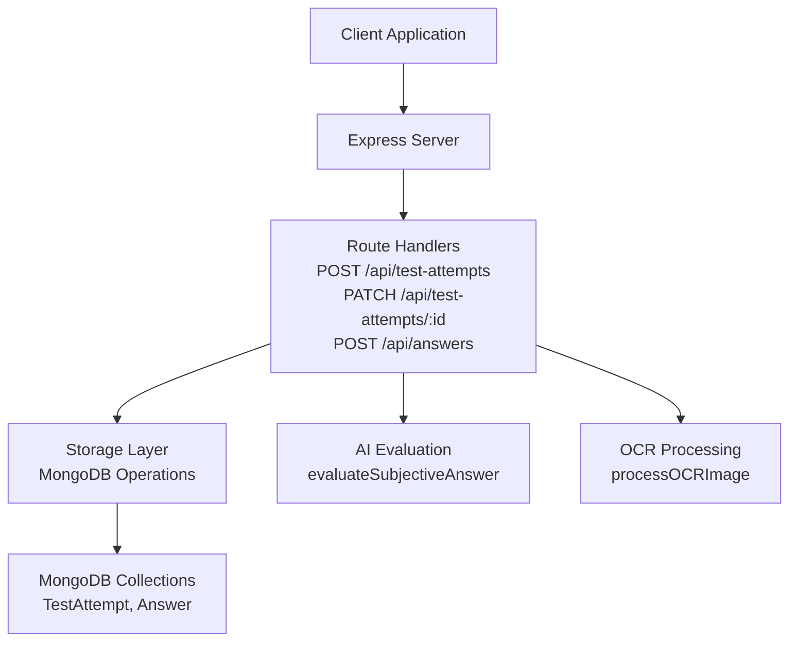
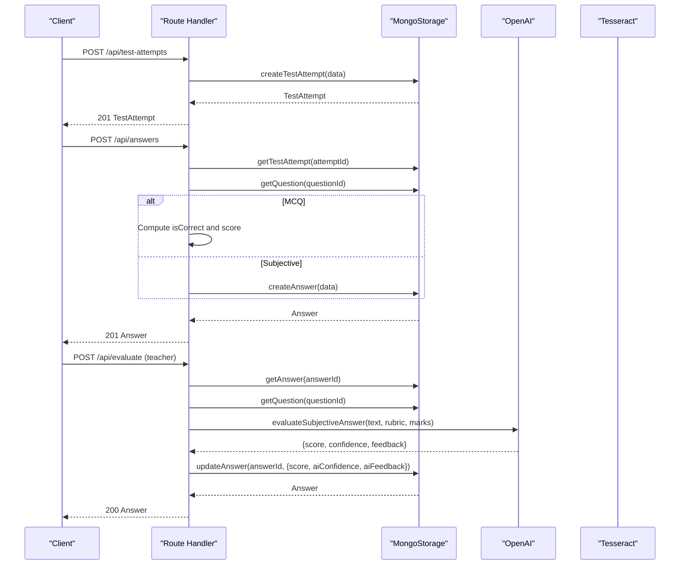
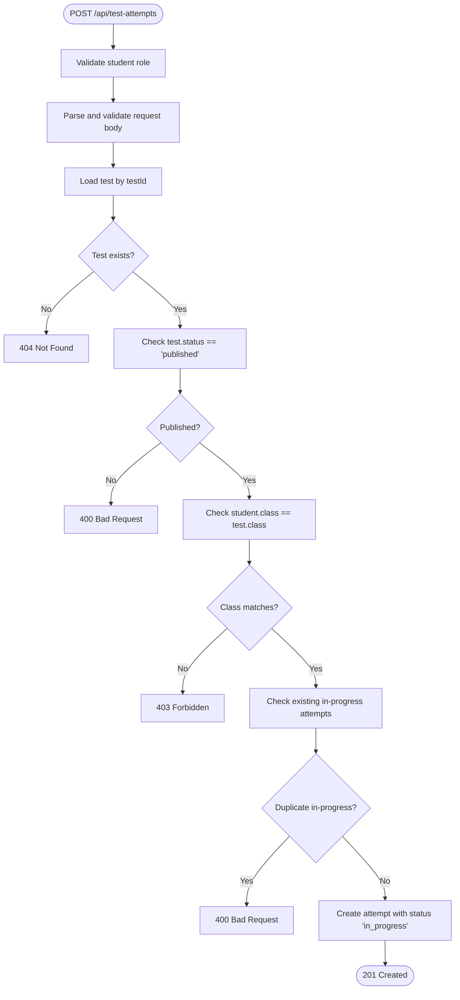
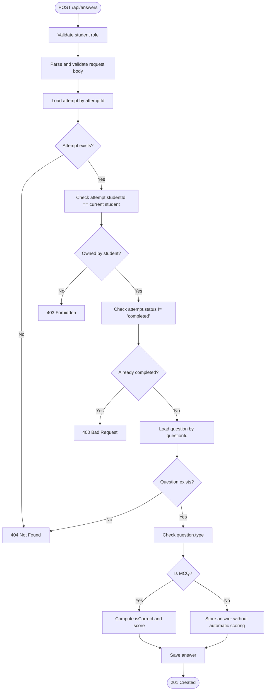
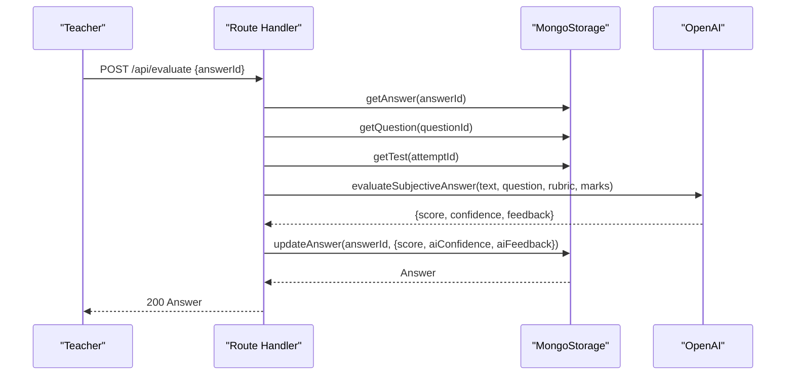
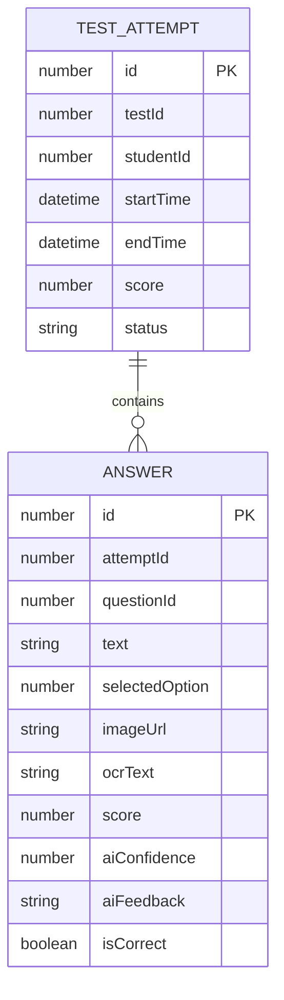
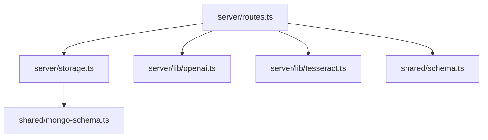

# Test Attempt & Answer Submission Endpoints

<cite>
**Referenced Files in This Document**
- [server/index.ts](file://server/index.ts)
- [server/routes.ts](file://server/routes.ts)
- [server/storage.ts](file://server/storage.ts)
- [server/lib/openai.ts](file://server/lib/openai.ts)
- [server/lib/tesseract.ts](file://server/lib/tesseract.ts)
- [shared/schema.ts](file://shared/schema.ts)
- [shared/mongo-schema.ts](file://shared/mongo-schema.ts)
</cite>

## Table of Contents
1. [Introduction](#introduction)
2. [Project Structure](#project-structure)
3. [Core Components](#core-components)
4. [Architecture Overview](#architecture-overview)
5. [Detailed Component Analysis](#detailed-component-analysis)
6. [Dependency Analysis](#dependency-analysis)
7. [Performance Considerations](#performance-considerations)
8. [Troubleshooting Guide](#troubleshooting-guide)
9. [Conclusion](#conclusion)

## Introduction
This document provides comprehensive API documentation for test attempt and answer submission endpoints. It covers:
- POST /api/test-attempts for student test initiation
- PATCH /api/test-attempts/:id for attempt updates
- POST /api/answers for answer submissions

It includes request/response schemas, validation rules, business logic such as attempt status management, question type handling (MCQ vs subjective), automatic scoring for MCQ questions, and AI evaluation integration for subjective answers. Examples demonstrate test attempt workflows, answer submission patterns, scoring mechanisms, and error handling for attempt completion and duplicate submissions.

## Project Structure
The API endpoints are implemented in the server module with clear separation of concerns:
- Routes define HTTP endpoints and orchestrate business logic
- Storage encapsulates data access and persistence
- Shared schemas define validation rules and TypeScript types
- AI and OCR utilities integrate external services for evaluation and text extraction

**Diagram sources**
- [server/routes.ts](file://server/routes.ts#L318-L463)
- [server/storage.ts](file://server/storage.ts#L57-L69)
- [server/lib/openai.ts](file://server/lib/openai.ts#L50-L105)
- [server/lib/tesseract.ts](file://server/lib/tesseract.ts#L8-L32)
- [shared/mongo-schema.ts](file://shared/mongo-schema.ts#L52-L74)

**Section sources**
- [server/index.ts](file://server/index.ts#L1-L114)
- [server/routes.ts](file://server/routes.ts#L1-L1104)

## Core Components
This section documents the three primary endpoints with their request/response schemas, validation rules, and business logic.

### POST /api/test-attempts
Purpose: Create a new test attempt for a student.

- Method: POST
- Path: /api/test-attempts
- Authentication: Student session required
- Authorization: Only the owning student can create attempts

Request Body Schema (validated via Zod):
- testId: number
- studentId: number
- startTime: string | Date (optional)
- endTime: string | Date (optional)
- score: number (optional)
- status: "in_progress" | "completed" | "evaluated" (default: "in_progress")

Validation Rules:
- Student must be logged in and have role "student"
- Attempt data is validated against insertTestAttemptSchema
- Test must exist and have status "published"
- Student's class must match the test's class
- Student cannot have an in-progress attempt for the same test

Success Response:
- Status: 201 Created
- Body: Full TestAttempt object including auto-generated id

Error Responses:
- 400 Bad Request: Invalid input data, test not published, duplicate in-progress attempt
- 401 Unauthorized: Not authenticated or wrong role
- 403 Forbidden: Test not available for student's class or attempt ownership violation
- 404 Not Found: Test not found
- 500 Internal Server Error: General failure

Business Logic Highlights:
- Duplicate attempt prevention: Checks existing attempts with status !== "completed"
- Automatic status initialization to "in_progress"

Example Workflow:
1. Student initiates attempt → attempt created with status "in_progress"
2. Student submits answers → attempt remains "in_progress"
3. Student completes attempt → PATCH endpoint sets status "completed" (see below)

**Section sources**
- [server/routes.ts](file://server/routes.ts#L318-L370)
- [shared/schema.ts](file://shared/schema.ts#L39-L46)
- [shared/mongo-schema.ts](file://shared/mongo-schema.ts#L52-L60)

### PATCH /api/test-attempts/:id
Purpose: Update an existing test attempt (commonly to mark completion).

- Method: PATCH
- Path: /api/test-attempts/:id
- Authentication: Required
- Authorization: Attempt owner (student) or teacher of the test

Request Path Parameter:
- id: number (attempt identifier)

Request Body Schema (partial update):
- testId: number (optional)
- studentId: number (optional)
- startTime: string | Date (optional)
- endTime: string | Date (optional)
- score: number (optional)
- status: "in_progress" | "completed" | "evaluated" (optional)

Validation Rules:
- Attempt must exist
- User must own the attempt (student) or be the teacher of the associated test (teacher)
- Update data is validated via partial insertTestAttemptSchema

Success Response:
- Status: 200 OK
- Body: Updated TestAttempt object

Error Responses:
- 400 Bad Request: Invalid attempt ID
- 401 Unauthorized: Not authenticated
- 403 Forbidden: Not authorized to modify attempt
- 404 Not Found: Attempt not found
- 500 Internal Server Error: General failure

Business Logic Highlights:
- Teachers can update attempts for their tests
- Students can update their own attempts

Example Workflow:
1. Student completes test → sends PATCH with status "completed"
2. System updates attempt record
3. Optional: Teacher can later set status "evaluated" after manual review

**Section sources**
- [server/routes.ts](file://server/routes.ts#L372-L414)
- [shared/schema.ts](file://shared/schema.ts#L39-L46)

### POST /api/answers
Purpose: Submit an answer for a specific question within a test attempt.

- Method: POST
- Path: /api/answers
- Authentication: Student session required
- Authorization: Attempt must belong to the student

Request Body Schema (validated via Zod):
- attemptId: number
- questionId: number
- text: string (optional)
- selectedOption: number (optional)
- imageUrl: string (optional)
- ocrText: string (optional)
- score: number (optional)
- aiConfidence: number (optional)
- aiFeedback: string (optional)
- isCorrect: boolean (optional)

Validation Rules:
- Student must be logged in and have role "student"
- Answer data is validated against insertAnswerSchema
- Attempt must exist and belong to the student
- Attempt status must not be "completed"
- Question must exist
- Question type determines evaluation behavior

Business Logic Highlights:
- MCQ handling:
  - If question.type === "mcq" and selectedOption is provided, automatically compute correctness and score
  - isCorrect is set based on selectedOption === correctAnswer
  - score is set to question.marks if correct, otherwise 0
- Subjective handling:
  - For non-MCQ types, store answer without automatic scoring
  - AI evaluation endpoint (/api/evaluate) can later update score, aiConfidence, and aiFeedback

Success Response:
- Status: 201 Created
- Body: Full Answer object including auto-generated id

Error Responses:
- 400 Bad Request: Invalid input data, attempt already completed, missing required fields for question type
- 401 Unauthorized: Not authenticated or wrong role
- 403 Forbidden: Attempt does not belong to student
- 404 Not Found: Attempt or question not found
- 500 Internal Server Error: General failure

Example Workflow:
1. Student selects an option for an MCQ → answer submitted with selectedOption
2. System automatically sets isCorrect and score based on question.correctAnswer and question.marks
3. Student writes a response for a subjective question → answer submitted with text
4. Later, teacher triggers AI evaluation → answer updated with AI-generated score/confidence/feedback

**Section sources**
- [server/routes.ts](file://server/routes.ts#L416-L463)
- [shared/schema.ts](file://shared/schema.ts#L48-L59)
- [shared/mongo-schema.ts](file://shared/mongo-schema.ts#L62-L74)

## Architecture Overview
The endpoints follow a layered architecture:
- Route handlers validate requests, enforce authorization, and delegate to storage
- Storage performs CRUD operations against MongoDB collections
- AI and OCR utilities are invoked conditionally based on question type and evaluation needs

**Diagram sources**
- [server/routes.ts](file://server/routes.ts#L318-L463)
- [server/storage.ts](file://server/storage.ts#L57-L69)
- [server/lib/openai.ts](file://server/lib/openai.ts#L50-L105)
- [server/lib/tesseract.ts](file://server/lib/tesseract.ts#L8-L32)

## Detailed Component Analysis

### Test Attempt Creation Flow

**Diagram sources**
- [server/routes.ts](file://server/routes.ts#L318-L370)

**Section sources**
- [server/routes.ts](file://server/routes.ts#L318-L370)
- [shared/schema.ts](file://shared/schema.ts#L39-L46)

### Answer Submission and Scoring Logic

**Diagram sources**
- [server/routes.ts](file://server/routes.ts#L416-L463)
- [shared/schema.ts](file://shared/schema.ts#L48-L59)

**Section sources**
- [server/routes.ts](file://server/routes.ts#L416-L463)
- [shared/schema.ts](file://shared/schema.ts#L28-L37)

### AI Evaluation Integration

**Diagram sources**
- [server/routes.ts](file://server/routes.ts#L487-L559)
- [server/lib/openai.ts](file://server/lib/openai.ts#L50-L105)

**Section sources**
- [server/routes.ts](file://server/routes.ts#L487-L559)
- [server/lib/openai.ts](file://server/lib/openai.ts#L50-L105)

### Data Models and Validation

**Diagram sources**
- [shared/mongo-schema.ts](file://shared/mongo-schema.ts#L52-L74)

**Section sources**
- [shared/schema.ts](file://shared/schema.ts#L39-L59)
- [shared/mongo-schema.ts](file://shared/mongo-schema.ts#L52-L74)

## Dependency Analysis
The endpoints depend on:
- Route handlers for request parsing, validation, and authorization
- Storage layer for database operations
- AI utilities for subjective evaluation
- OCR utilities for text extraction

**Diagram sources**
- [server/routes.ts](file://server/routes.ts#L1-L1104)
- [server/storage.ts](file://server/storage.ts#L1-L519)
- [server/lib/openai.ts](file://server/lib/openai.ts#L1-L217)
- [server/lib/tesseract.ts](file://server/lib/tesseract.ts#L1-L33)
- [shared/schema.ts](file://shared/schema.ts#L1-L142)
- [shared/mongo-schema.ts](file://shared/mongo-schema.ts#L1-L159)

**Section sources**
- [server/routes.ts](file://server/routes.ts#L1-L1104)
- [server/storage.ts](file://server/storage.ts#L1-L519)
- [shared/schema.ts](file://shared/schema.ts#L1-L142)
- [shared/mongo-schema.ts](file://shared/mongo-schema.ts#L1-L159)

## Performance Considerations
- Use partial updates for PATCH to minimize write overhead
- Batch answer submissions where feasible to reduce round trips
- Cache frequently accessed test and question metadata
- Monitor AI evaluation latency and implement retry/backoff for robustness
- Ensure proper indexing on attemptId and questionId for answer queries

## Troubleshooting Guide
Common Issues and Resolutions:
- Attempt Already Exists: Ensure no in-progress attempts for the same test before creating a new one
- Attempt Already Completed: Cannot submit answers to completed attempts; use a new attempt
- Unauthorized Access: Verify session role and ownership of attempt/test
- Invalid Input Data: Confirm adherence to Zod schemas for request bodies
- AI Evaluation Failures: Check OPENAI_API_KEY and network connectivity; fallback responses are provided

**Section sources**
- [server/routes.ts](file://server/routes.ts#L318-L463)
- [server/lib/openai.ts](file://server/lib/openai.ts#L1-L217)

## Conclusion
The test attempt and answer submission endpoints provide a robust foundation for online testing with built-in validation, authorization, and intelligent evaluation capabilities. The design supports both automated MCQ scoring and AI-powered subjective evaluation, enabling flexible assessment workflows tailored to diverse question types and educational needs.