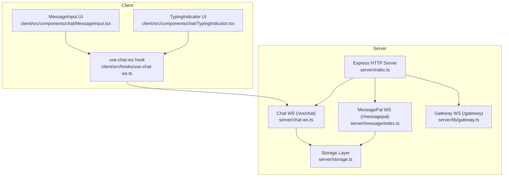
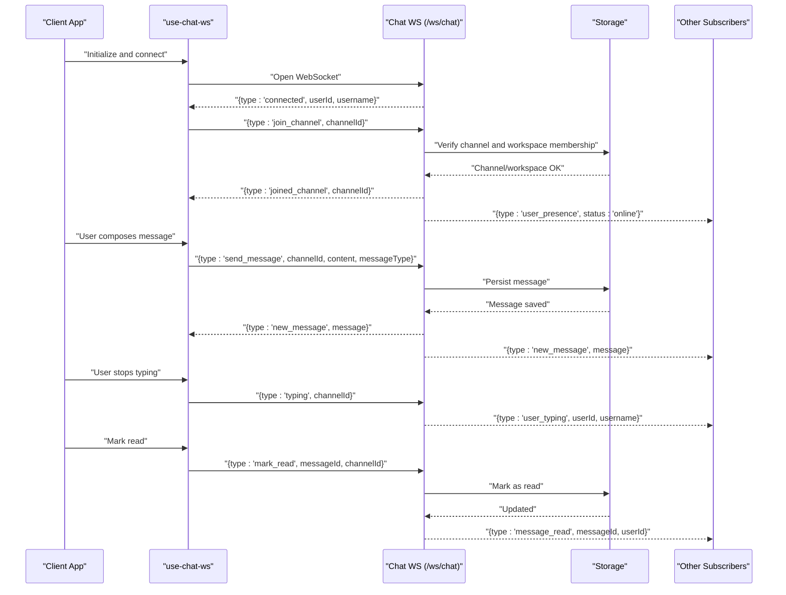
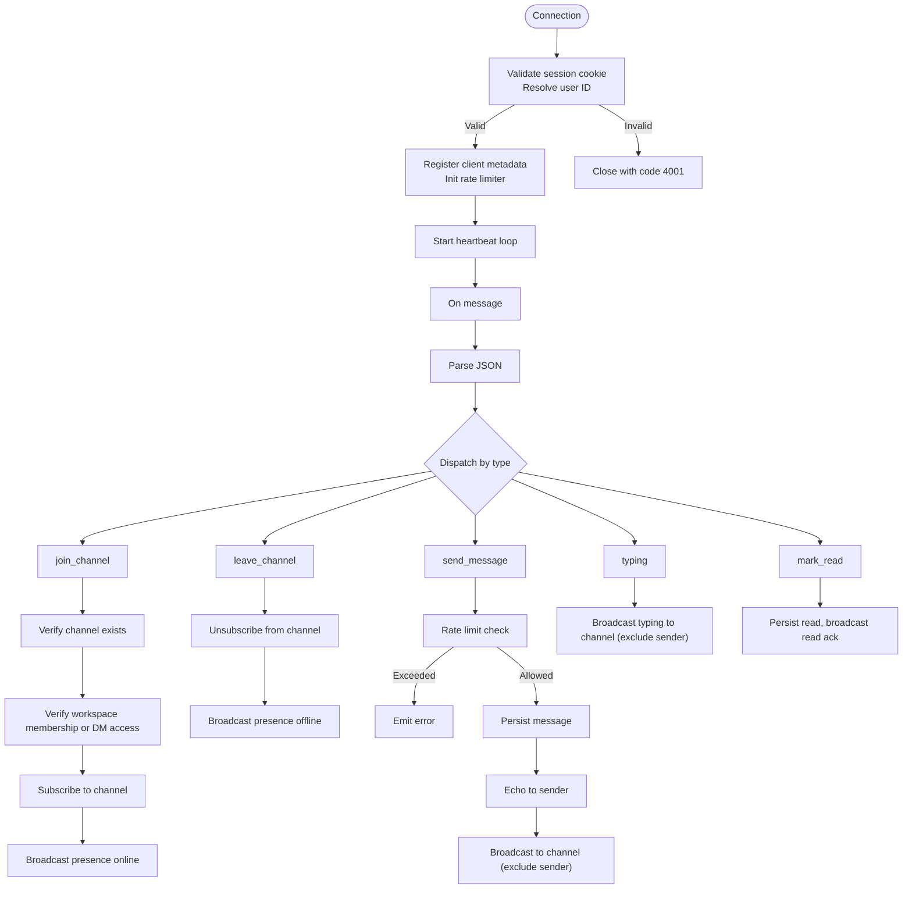
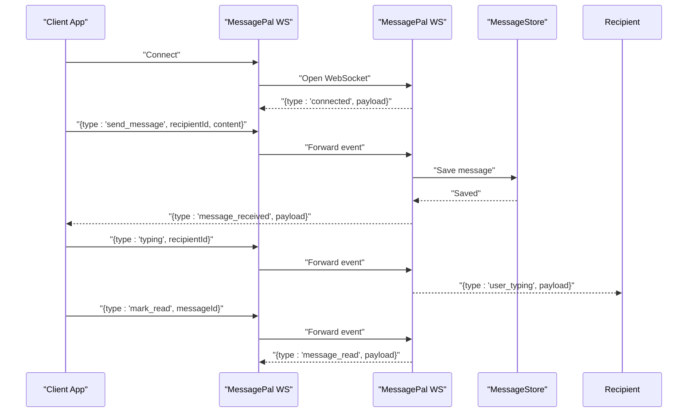
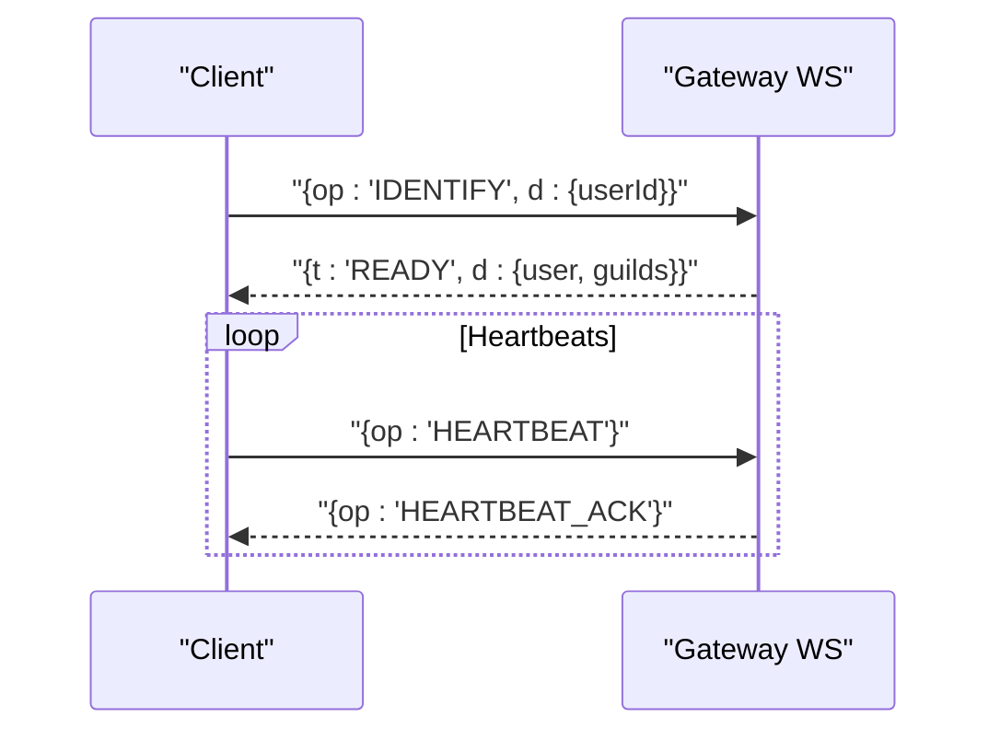
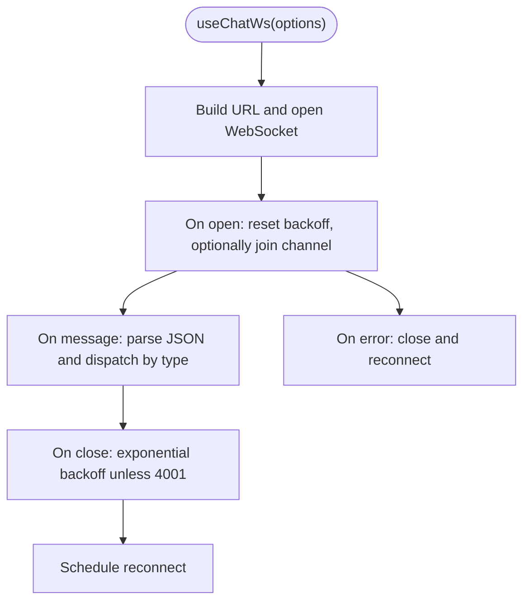
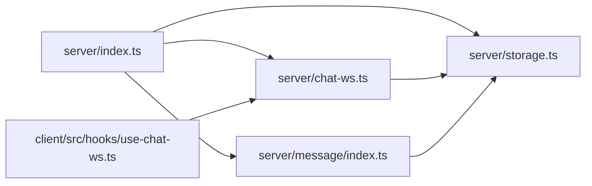

# WebSocket API

<cite>
**Referenced Files in This Document**
- [server/index.ts](file://server/index.ts)
- [server/chat-ws.ts](file://server/chat-ws.ts)
- [server/storage.ts](file://server/storage.ts)
- [server/lib/gateway.ts](file://server/lib/gateway.ts)
- [server/message/index.ts](file://server/message/index.ts)
- [client/src/hooks/use-chat-ws.ts](file://client/src/hooks/use-chat-ws.ts)
- [client/src/components/chat/MessageInput.tsx](file://client/src/components/chat/MessageInput.tsx)
- [client/src/components/chat/TypingIndicator.tsx](file://client/src/components/chat/TypingIndicator.tsx)
- [client/src/types/chat.ts](file://client/src/types/chat.ts)
</cite>

## Table of Contents
1. [Introduction](#introduction)
2. [Project Structure](#project-structure)
3. [Core Components](#core-components)
4. [Architecture Overview](#architecture-overview)
5. [Detailed Component Analysis](#detailed-component-analysis)
6. [Dependency Analysis](#dependency-analysis)
7. [Performance Considerations](#performance-considerations)
8. [Troubleshooting Guide](#troubleshooting-guide)
9. [Conclusion](#conclusion)

## Introduction
This document describes the WebSocket API powering real-time chat in PersonalLearningPro. It covers connection lifecycle, authentication via sessions, message broadcasting, presence updates, typing indicators, read receipts, and rate limiting. It also documents client-server protocols, error handling, reconnection logic, and practical scenarios such as group chat, direct messaging, and collaborative workspaces.

## Project Structure
The WebSocket stack consists of:
- A primary chat WebSocket server under the `/ws/chat` path
- A secondary MessagePal WebSocket server under the `/messagepal` path
- A gateway WebSocket for membership-aware broadcasts
- A client hook that manages connection, reconnection, and event dispatch
- UI components for composing and displaying messages and typing indicators

**Diagram sources**
- [server/index.ts](file://server/index.ts#L76-L84)
- [server/chat-ws.ts](file://server/chat-ws.ts#L119-L120)
- [server/message/index.ts](file://server/message/index.ts#L262-L266)
- [server/lib/gateway.ts](file://server/lib/gateway.ts#L10-L11)
- [server/storage.ts](file://server/storage.ts#L33-L106)
- [client/src/hooks/use-chat-ws.ts](file://client/src/hooks/use-chat-ws.ts#L95-L103)

**Section sources**
- [server/index.ts](file://server/index.ts#L76-L84)

## Core Components
- Chat WebSocket server: Handles join/leave channels, send message, typing, read receipts, presence, and heartbeat.
- MessagePal WebSocket server: Handles direct messaging, typing, read receipts, and conversation history.
- Gateway WebSocket: Provides membership-aware broadcasts and readiness handshake.
- Client hook: Manages connection, reconnection, and dispatches events to UI components.

**Section sources**
- [server/chat-ws.ts](file://server/chat-ws.ts#L119-L120)
- [server/message/index.ts](file://server/message/index.ts#L262-L266)
- [server/lib/gateway.ts](file://server/lib/gateway.ts#L10-L11)
- [client/src/hooks/use-chat-ws.ts](file://client/src/hooks/use-chat-ws.ts#L65-L82)

## Architecture Overview
The WebSocket servers are attached to the same HTTP server and share session-based authentication. The chat server organizes users into channels and broadcasts to channel subscribers. The MessagePal server routes messages to individual users. The gateway supports membership-aware broadcasts.

**Diagram sources**
- [server/chat-ws.ts](file://server/chat-ws.ts#L122-L155)
- [server/chat-ws.ts](file://server/chat-ws.ts#L185-L246)
- [server/chat-ws.ts](file://server/chat-ws.ts#L248-L340)
- [server/chat-ws.ts](file://server/chat-ws.ts#L342-L370)
- [server/storage.ts](file://server/storage.ts#L98-L105)

## Detailed Component Analysis

### Chat WebSocket Server
- Path: `/ws/chat`
- Authentication: Session cookie-based; validates `connect.sid`, resolves user ID from session store, and loads user metadata.
- Channels: Users join/leave channels; server tracks subscribers per channel.
- Broadcasting: Messages are echoed to sender and broadcast to channel subscribers excluding sender.
- Presence: On join/leave, server emits presence events to channel subscribers.
- Typing: Clients emit typing events; server broadcasts to channel excluding sender.
- Read receipts: Clients mark read; server persists and broadcasts read acknowledgements.
- Rate limiting: Token bucket (5 tokens, refilled every 5 seconds) prevents spam.
- Heartbeat: Server pings every 30 seconds; closes inactive connections.

**Diagram sources**
- [server/chat-ws.ts](file://server/chat-ws.ts#L94-L115)
- [server/chat-ws.ts](file://server/chat-ws.ts#L119-L168)
- [server/chat-ws.ts](file://server/chat-ws.ts#L185-L375)

**Section sources**
- [server/chat-ws.ts](file://server/chat-ws.ts#L94-L115)
- [server/chat-ws.ts](file://server/chat-ws.ts#L119-L168)
- [server/chat-ws.ts](file://server/chat-ws.ts#L185-L375)

### MessagePal WebSocket Server
- Path: `/messagepal`
- Authentication: Session cookie validated similarly; registers user metadata.
- Routing: Messages are stored and broadcast to both conversation participants.
- Typing: Broadcasts typing events to the intended recipient.
- Read receipts: Marks message as read and acknowledges sender.
- History: Fetches conversation history for a given conversation ID.
- Subscriptions: Optional subscribe/unsubscribe to a conversation.

**Diagram sources**
- [server/message/index.ts](file://server/message/index.ts#L276-L306)
- [server/message/index.ts](file://server/message/index.ts#L105-L152)
- [server/message/index.ts](file://server/message/index.ts#L154-L168)
- [server/message/index.ts](file://server/message/index.ts#L170-L191)
- [server/message/index.ts](file://server/message/index.ts#L193-L224)

**Section sources**
- [server/message/index.ts](file://server/message/index.ts#L71-L101)
- [server/message/index.ts](file://server/message/index.ts#L105-L191)
- [server/message/index.ts](file://server/message/index.ts#L193-L258)

### Gateway WebSocket
- Path: `/gateway`
- Purpose: Membership-aware broadcasting and readiness handshake.
- Heartbeat: Responds to HEARTBEAT with HEARTBEAT_ACK.
- Identification: Accepts IDENTIFY with a user ID and responds with READY containing user and guilds.

**Diagram sources**
- [server/lib/gateway.ts](file://server/lib/gateway.ts#L10-L68)

**Section sources**
- [server/lib/gateway.ts](file://server/lib/gateway.ts#L10-L68)

### Client Hook: use-chat-ws
- Establishes WebSocket connection using the current origin with `wss` over HTTPS.
- Automatically joins a provided channel on connect and leaves on unmount.
- Reconnects on close with exponential backoff, capped at 30 seconds.
- Ignores unauthorized closures (code 4001).
- Emits typed events to callbacks for new messages, typing, read receipts, and presence.

**Diagram sources**
- [client/src/hooks/use-chat-ws.ts](file://client/src/hooks/use-chat-ws.ts#L95-L162)

**Section sources**
- [client/src/hooks/use-chat-ws.ts](file://client/src/hooks/use-chat-ws.ts#L65-L82)
- [client/src/hooks/use-chat-ws.ts](file://client/src/hooks/use-chat-ws.ts#L95-L162)
- [client/src/hooks/use-chat-ws.ts](file://client/src/hooks/use-chat-ws.ts#L199-L214)

### Message Payload Schemas

#### Chat Events
- connected
  - Fields: type, userId, username
- joined_channel
  - Fields: type, channelId
- left_channel
  - Fields: type, channelId
- new_message
  - Fields: type, message.id, message.channelId, message.authorId, message.authorUsername, message.content, message.messageType, message.fileUrl, message.readBy, message.createdAt
- user_typing
  - Fields: type, userId, username, channelId
- user_presence
  - Fields: type, userId, username, status, channelId
- message_read
  - Fields: type, messageId, userId, channelId
- error
  - Fields: type, message

#### MessagePal Events
- connected
  - Fields: type, payload.userId, payload.username, payload.role, payload.serverTime, timestamp
- message_received
  - Fields: type, payload.senderId, payload.senderName, payload.senderRole, payload.recipientId, payload.content, payload.timestamp, timestamp
- user_typing
  - Fields: type, payload.userId, payload.username, payload.recipientId, timestamp
- message_read
  - Fields: type, payload.messageId, payload.readBy, payload.readAt, timestamp
- history_response
  - Fields: type, payload.conversationId, payload.messages, timestamp
- subscribed/unsubscribed
  - Fields: type, payload.conversationId, timestamp
- error
  - Fields: type, message

**Section sources**
- [client/src/hooks/use-chat-ws.ts](file://client/src/hooks/use-chat-ws.ts#L42-L50)
- [server/chat-ws.ts](file://server/chat-ws.ts#L286-L296)
- [server/message/index.ts](file://server/message/index.ts#L297-L306)
- [server/message/index.ts](file://server/message/index.ts#L129-L136)
- [server/message/index.ts](file://server/message/index.ts#L157-L167)
- [server/message/index.ts](file://server/message/index.ts#L177-L187)
- [server/message/index.ts](file://server/message/index.ts#L209-L216)
- [server/message/index.ts](file://server/message/index.ts#L235-L239)
- [server/message/index.ts](file://server/message/index.ts#L334-L337)

### Real-Time Interaction Patterns

#### Group Chat
- Join a channel, send messages, receive echoes and broadcasts, see typing indicators, and mark read.

**Section sources**
- [server/chat-ws.ts](file://server/chat-ws.ts#L185-L246)
- [server/chat-ws.ts](file://server/chat-ws.ts#L248-L340)
- [server/chat-ws.ts](file://server/chat-ws.ts#L342-L370)

#### Direct Messaging (MessagePal)
- Establish a conversation ID between two users, send messages, receive them on both sides, and exchange typing/read receipts.

**Section sources**
- [server/message/index.ts](file://server/message/index.ts#L105-L152)
- [server/message/index.ts](file://server/message/index.ts#L154-L168)
- [server/message/index.ts](file://server/message/index.ts#L170-L191)

#### Collaborative Workspaces
- Use the gateway to broadcast to workspace members; use chat channels for topic-specific collaboration.

**Section sources**
- [server/lib/gateway.ts](file://server/lib/gateway.ts#L10-L68)
- [server/chat-ws.ts](file://server/chat-ws.ts#L185-L246)

## Dependency Analysis
- Server initialization attaches both WebSocket servers to the HTTP server and wires session middleware.
- Chat and MessagePal servers depend on the shared storage layer for persistence and membership checks.
- Client hook depends on browser WebSocket APIs and React lifecycle.

**Diagram sources**
- [server/index.ts](file://server/index.ts#L76-L84)
- [server/chat-ws.ts](file://server/chat-ws.ts#L119-L120)
- [server/message/index.ts](file://server/message/index.ts#L262-L266)
- [server/storage.ts](file://server/storage.ts#L33-L106)
- [client/src/hooks/use-chat-ws.ts](file://client/src/hooks/use-chat-ws.ts#L95-L103)

**Section sources**
- [server/index.ts](file://server/index.ts#L76-L84)
- [server/storage.ts](file://server/storage.ts#L33-L106)

## Performance Considerations
- Connection limits: No explicit per-user or per-channel limits are enforced in code; scale depends on server resources and network capacity.
- Rate limiting: Chat server enforces a token bucket (5 tokens, 5-second refill) to throttle message bursts.
- Heartbeats: Both servers ping clients periodically; inactive connections are terminated to reclaim resources.
- Persistence: Messages are persisted to Cassandra when available, otherwise MongoDB, with fallbacks.

**Section sources**
- [server/chat-ws.ts](file://server/chat-ws.ts#L147-L149)
- [server/chat-ws.ts](file://server/chat-ws.ts#L161-L168)
- [server/storage.ts](file://server/storage.ts#L413-L422)

## Troubleshooting Guide
- Unauthorized errors (code 4001): Occur when session validation fails. The client will not reconnect automatically for this code.
- Invalid JSON payload: Server responds with an error event; ensure clients send properly formatted JSON.
- Channel not found or access denied: Join attempts on non-existent or inaccessible channels fail with error events.
- Rate limit exceeded: Sending too fast triggers a throttling error; slow down or wait for refill.
- Reconnection behavior: The client reconnects with exponential backoff up to 30 seconds; verify network connectivity and server logs.

**Section sources**
- [client/src/hooks/use-chat-ws.ts](file://client/src/hooks/use-chat-ws.ts#L144-L157)
- [server/chat-ws.ts](file://server/chat-ws.ts#L175-L180)
- [server/chat-ws.ts](file://server/chat-ws.ts#L189-L198)
- [server/chat-ws.ts](file://server/chat-ws.ts#L269-L272)

## Conclusion
PersonalLearningPro’s WebSocket API provides robust, session-authenticated real-time chat with channel-based broadcasting, presence, typing indicators, read receipts, and rate limiting. The dual server model supports both group collaboration and direct messaging. Clients benefit from resilient reconnection logic and clear event schemas. For production scaling, monitor resource usage, consider connection quotas, and ensure reliable session stores.