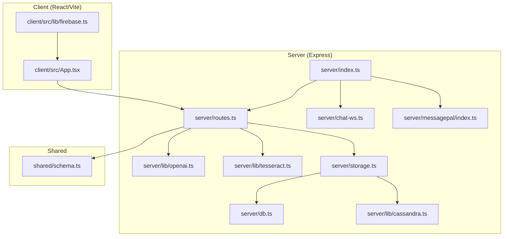
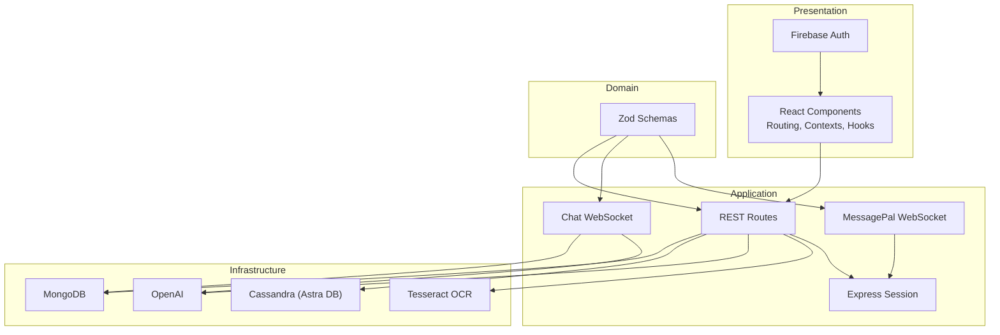
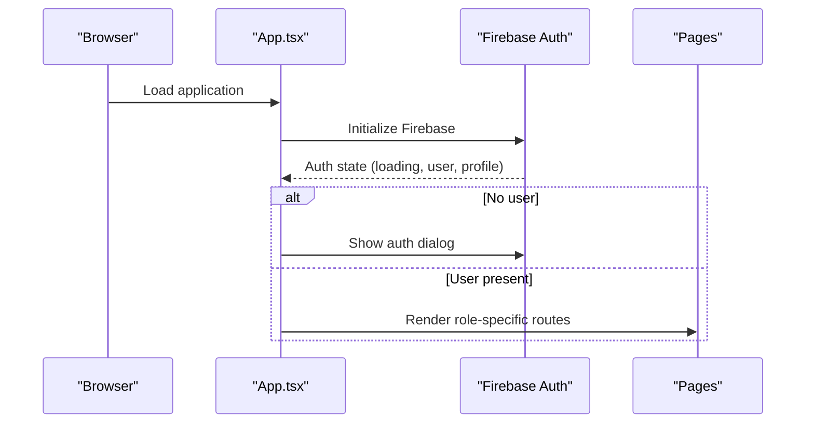
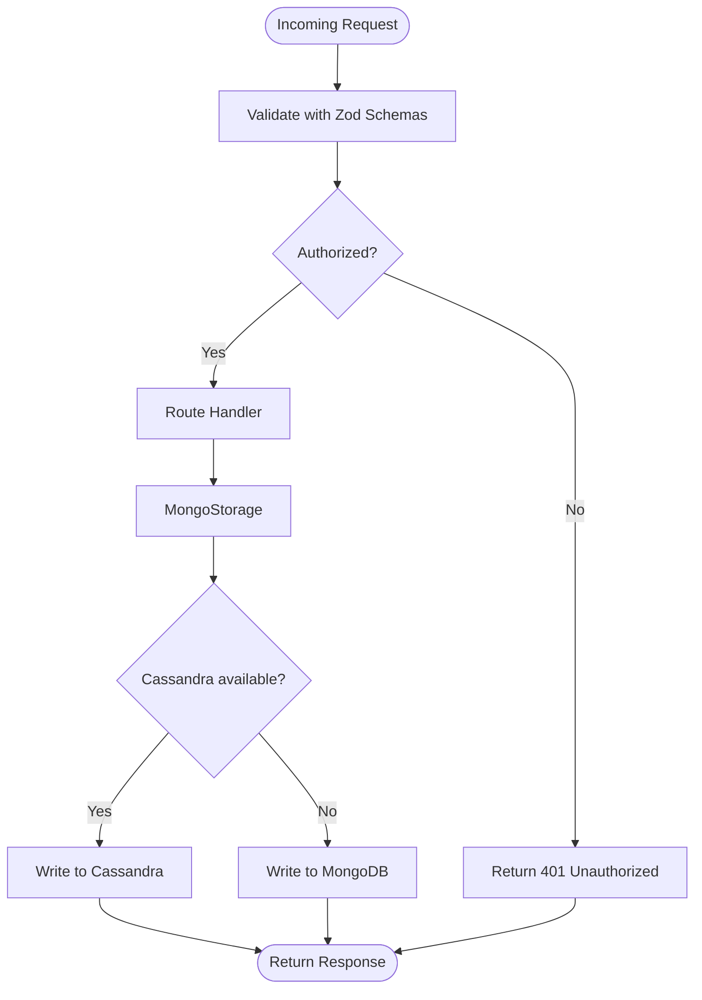
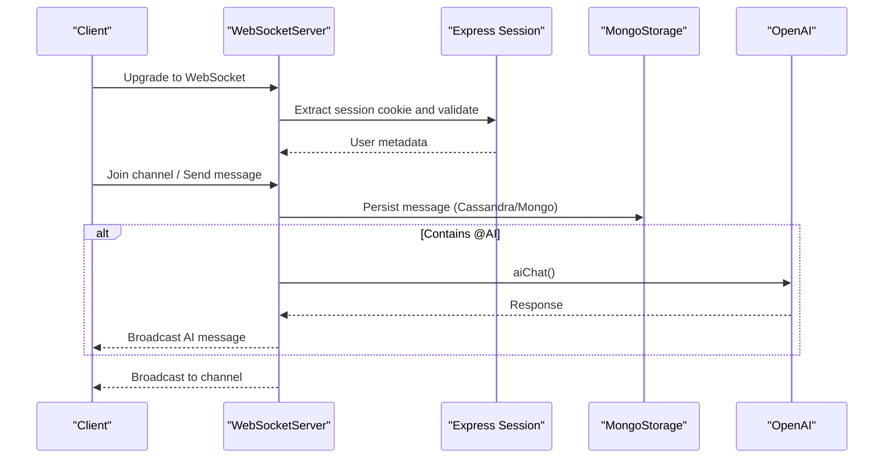
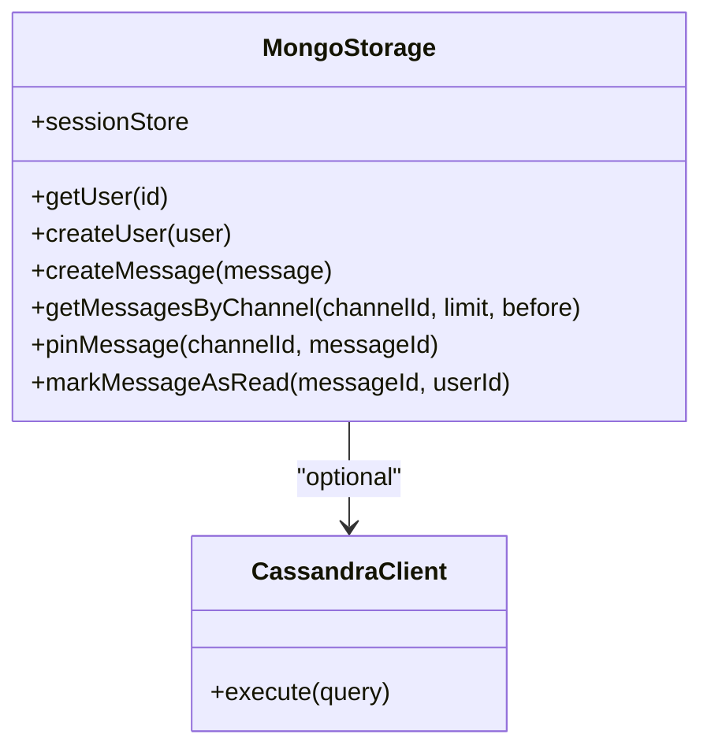
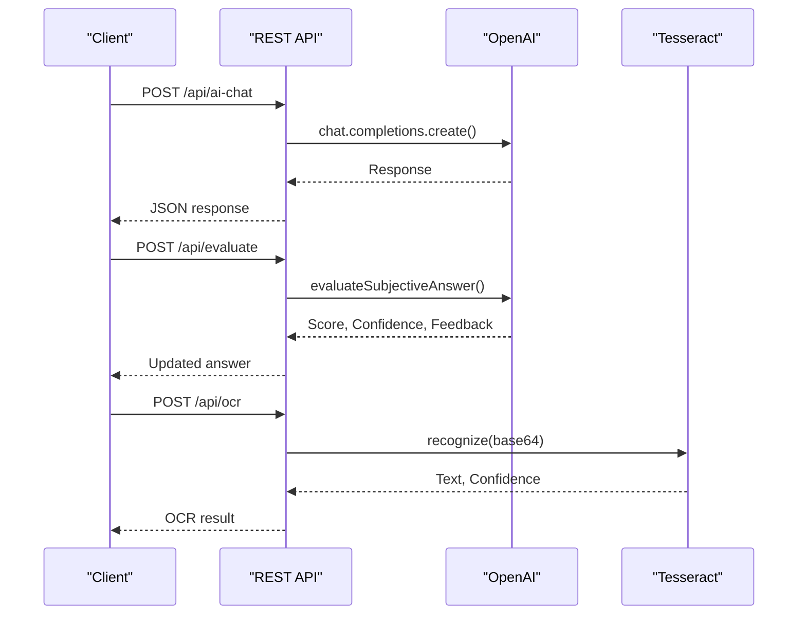
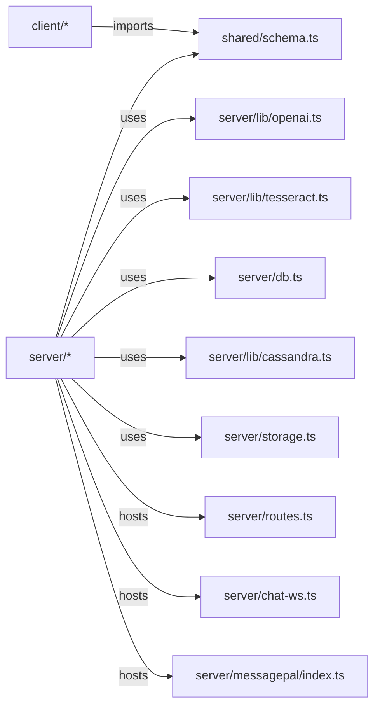
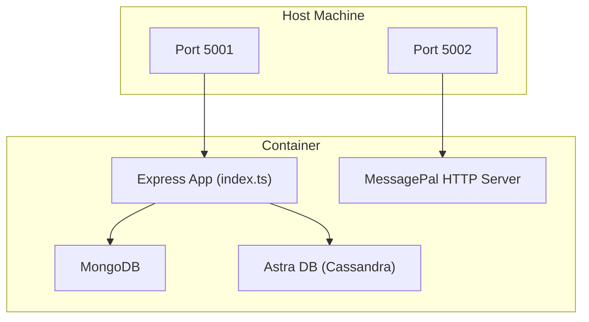
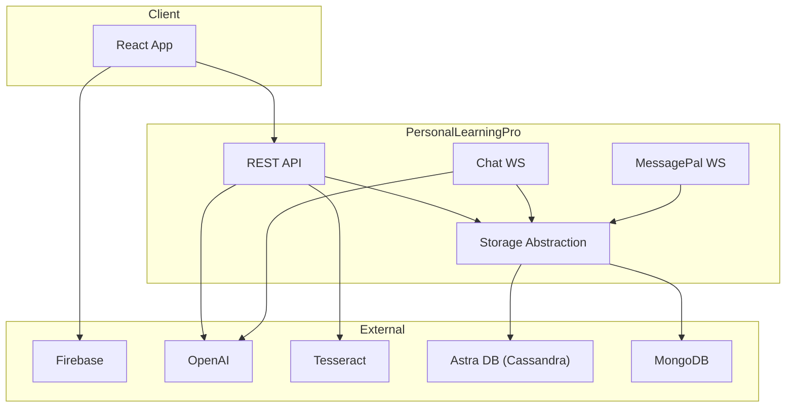

# Architecture Overview

<cite>
**Referenced Files in This Document**
- [README.md](file://README.md)
- [package.json](file://package.json)
- [docker-compose.yml](file://docker-compose.yml)
- [server/index.ts](file://server/index.ts)
- [server/routes.ts](file://server/routes.ts)
- [server/db.ts](file://server/db.ts)
- [server/lib/cassandra.ts](file://server/lib/cassandra.ts)
- [server/lib/openai.ts](file://server/lib/openai.ts)
- [server/lib/tesseract.ts](file://server/lib/tesseract.ts)
- [server/chat-ws.ts](file://server/chat-ws.ts)
- [server/messagepal/index.ts](file://server/messagepal/index.ts)
- [server/storage.ts](file://server/storage.ts)
- [shared/schema.ts](file://shared/schema.ts)
- [client/src/App.tsx](file://client/src/App.tsx)
- [client/src/lib/firebase.ts](file://client/src/lib/firebase.ts)
</cite>

## Table of Contents
1. [Introduction](#introduction)
2. [Project Structure](#project-structure)
3. [Core Components](#core-components)
4. [Architecture Overview](#architecture-overview)
5. [Detailed Component Analysis](#detailed-component-analysis)
6. [Dependency Analysis](#dependency-analysis)
7. [Performance Considerations](#performance-considerations)
8. [Security Architecture](#security-architecture)
9. [Deployment Topology](#deployment-topology)
10. [System Context and External Dependencies](#system-context-and-external-dependencies)
11. [Troubleshooting Guide](#troubleshooting-guide)
12. [Conclusion](#conclusion)

## Introduction
This document presents the architecture of PersonalLearningPro, an AI-powered personalized learning platform. The system follows a layered clean architecture with clear separation between presentation, application, domain, and infrastructure concerns. It integrates a React frontend with an Express backend, multi-database persistence using MongoDB and Cassandra (via Astra DB), WebSocket real-time communication, and AI services (OpenAI and Tesseract). The document explains component roles, data flows, and operational patterns, and provides guidance on scalability, security, and deployment.

## Project Structure
The repository is organized into three primary areas:
- client: React application built with Vite, providing role-aware dashboards, chat UI, OCR scanning, analytics, and AI tutoring.
- server: Express server hosting REST APIs, WebSocket servers, session management, and integrations with AI and databases.
- shared: Validation schemas and shared types used by both client and server.

**Diagram sources**
- [server/index.ts](file://server/index.ts#L1-L114)
- [server/routes.ts](file://server/routes.ts#L1-L1104)
- [server/chat-ws.ts](file://server/chat-ws.ts#L1-L393)
- [server/messagepal/index.ts](file://server/messagepal/index.ts#L1-L410)
- [server/db.ts](file://server/db.ts#L1-L21)
- [server/lib/cassandra.ts](file://server/lib/cassandra.ts#L1-L73)
- [server/lib/openai.ts](file://server/lib/openai.ts#L1-L217)
- [server/lib/tesseract.ts](file://server/lib/tesseract.ts#L1-L33)
- [server/storage.ts](file://server/storage.ts#L1-L519)
- [shared/schema.ts](file://shared/schema.ts#L1-L142)
- [client/src/App.tsx](file://client/src/App.tsx#L1-L165)
- [client/src/lib/firebase.ts](file://client/src/lib/firebase.ts#L1-L212)

**Section sources**
- [README.md](file://README.md#L70-L102)
- [package.json](file://package.json#L1-L120)

## Core Components
- Presentation Layer (client):
  - Role-aware routing and UI composition in App.tsx.
  - Firebase integration for authentication and user profiles.
- Application Layer (server):
  - REST routes for user, test, question, attempt, answer, analytics, and chat/workspace/message management.
  - WebSocket servers for real-time chat and MessagePal.
  - Session middleware and logging.
- Domain Layer (shared):
  - Zod schemas for input validation and type safety across boundaries.
- Infrastructure Layer (server):
  - MongoDB connection and fallback storage.
  - Cassandra/Astra DB client initialization and schema management.
  - AI integrations (OpenAI, Tesseract).
  - Storage abstraction coordinating MongoDB and Cassandra.

**Section sources**
- [client/src/App.tsx](file://client/src/App.tsx#L93-L150)
- [client/src/lib/firebase.ts](file://client/src/lib/firebase.ts#L1-L212)
- [server/routes.ts](file://server/routes.ts#L1-L1104)
- [server/chat-ws.ts](file://server/chat-ws.ts#L1-L393)
- [server/messagepal/index.ts](file://server/messagepal/index.ts#L1-L410)
- [server/storage.ts](file://server/storage.ts#L1-L519)
- [shared/schema.ts](file://shared/schema.ts#L1-L142)

## Architecture Overview
The system adheres to clean architecture principles:
- Presentation depends on application interfaces.
- Application orchestrates use cases and delegates persistence to the domain.
- Domain defines schemas and validation.
- Infrastructure provides concrete implementations for storage, AI, and transport.

**Diagram sources**
- [client/src/App.tsx](file://client/src/App.tsx#L1-L165)
- [client/src/lib/firebase.ts](file://client/src/lib/firebase.ts#L1-L212)
- [server/routes.ts](file://server/routes.ts#L1-L1104)
- [server/chat-ws.ts](file://server/chat-ws.ts#L1-L393)
- [server/messagepal/index.ts](file://server/messagepal/index.ts#L1-L410)
- [server/db.ts](file://server/db.ts#L1-L21)
- [server/lib/cassandra.ts](file://server/lib/cassandra.ts#L1-L73)
- [server/lib/openai.ts](file://server/lib/openai.ts#L1-L217)
- [server/lib/tesseract.ts](file://server/lib/tesseract.ts#L1-L33)
- [shared/schema.ts](file://shared/schema.ts#L1-L142)

## Detailed Component Analysis

### Frontend: Client Application
- Routing and layout:
  - Role-aware routing selects dashboards and feature pages.
  - AppLayout composes sidebar and main content area.
- Authentication:
  - Firebase auth provider and dialogs integrate with Firestore user profiles.
- Real-time UX:
  - Toast notifications and query caching via React Query.

**Diagram sources**
- [client/src/App.tsx](file://client/src/App.tsx#L93-L150)
- [client/src/lib/firebase.ts](file://client/src/lib/firebase.ts#L1-L212)

**Section sources**
- [client/src/App.tsx](file://client/src/App.tsx#L1-L165)
- [client/src/lib/firebase.ts](file://client/src/lib/firebase.ts#L1-L212)

### Backend: REST API and Middleware
- Entry point:
  - Express server initializes sessions, static uploads, logging, and routes.
- Routes:
  - Authentication, user, test, question, attempt, answer, analytics, chat, and message endpoints.
  - Zod-based validation ensures robust input handling.
- Storage abstraction:
  - MongoStorage implements IStorage with MongoDB as primary store and Cassandra as secondary for messages.

**Diagram sources**
- [server/routes.ts](file://server/routes.ts#L1-L1104)
- [server/storage.ts](file://server/storage.ts#L1-L519)
- [shared/schema.ts](file://shared/schema.ts#L1-L142)

**Section sources**
- [server/index.ts](file://server/index.ts#L1-L114)
- [server/routes.ts](file://server/routes.ts#L1-L1104)
- [server/storage.ts](file://server/storage.ts#L1-L519)
- [shared/schema.ts](file://shared/schema.ts#L1-L142)

### Real-Time Communication: WebSocket Servers
- Chat WebSocket (/ws/chat):
  - Session-based authentication, presence, typing indicators, rate limiting, and AI command support.
- MessagePal WebSocket (/messagepal):
  - Session-based authentication, per-user broadcasting, typing, read receipts, and history retrieval.

**Diagram sources**
- [server/chat-ws.ts](file://server/chat-ws.ts#L119-L393)
- [server/messagepal/index.ts](file://server/messagepal/index.ts#L262-L375)
- [server/storage.ts](file://server/storage.ts#L413-L422)
- [server/lib/openai.ts](file://server/lib/openai.ts#L20-L42)

**Section sources**
- [server/chat-ws.ts](file://server/chat-ws.ts#L1-L393)
- [server/messagepal/index.ts](file://server/messagepal/index.ts#L1-L410)

### Multi-Database Architecture: MongoDB and Cassandra
- MongoDB:
  - Primary store for user, test, question, attempt, answer, analytics, workspace, channel, and message metadata.
- Cassandra (Astra DB):
  - Secondary store optimized for message writes and reads with time-ordered clustering.
- Storage abstraction:
  - Conditional write/read path chooses Cassandra when available; otherwise falls back to MongoDB.

**Diagram sources**
- [server/storage.ts](file://server/storage.ts#L110-L519)
- [server/lib/cassandra.ts](file://server/lib/cassandra.ts#L1-L73)

**Section sources**
- [server/db.ts](file://server/db.ts#L1-L21)
- [server/lib/cassandra.ts](file://server/lib/cassandra.ts#L1-L73)
- [server/storage.ts](file://server/storage.ts#L1-L519)

### AI Integration Patterns
- OpenAI:
  - Chat completions for AI tutor, evaluation of subjective answers, study plan generation, and test performance analysis.
- Tesseract:
  - OCR processing for scanned test images.

**Diagram sources**
- [server/lib/openai.ts](file://server/lib/openai.ts#L1-L217)
- [server/lib/tesseract.ts](file://server/lib/tesseract.ts#L1-L33)
- [server/routes.ts](file://server/routes.ts#L488-L580)

**Section sources**
- [server/lib/openai.ts](file://server/lib/openai.ts#L1-L217)
- [server/lib/tesseract.ts](file://server/lib/tesseract.ts#L1-L33)
- [server/routes.ts](file://server/routes.ts#L466-L580)

## Dependency Analysis
- Internal dependencies:
  - Routes depend on storage, schemas, and AI/OCR utilities.
  - Storage depends on MongoDB and optional Cassandra client.
  - WebSocket servers depend on storage and AI.
- External dependencies:
  - Client: React, Radix UI, TanStack Query, Firebase, Tailwind.
  - Server: Express, ws, mongoose, cassandra-driver, openai, tesseract.js.

**Diagram sources**
- [shared/schema.ts](file://shared/schema.ts#L1-L142)
- [server/lib/openai.ts](file://server/lib/openai.ts#L1-L217)
- [server/lib/tesseract.ts](file://server/lib/tesseract.ts#L1-L33)
- [server/db.ts](file://server/db.ts#L1-L21)
- [server/lib/cassandra.ts](file://server/lib/cassandra.ts#L1-L73)
- [server/storage.ts](file://server/storage.ts#L1-L519)
- [server/routes.ts](file://server/routes.ts#L1-L1104)
- [server/chat-ws.ts](file://server/chat-ws.ts#L1-L393)
- [server/messagepal/index.ts](file://server/messagepal/index.ts#L1-L410)

**Section sources**
- [package.json](file://package.json#L12-L88)

## Performance Considerations
- Database choice:
  - Cassandra is optimized for high write throughput and time-ordered reads for messages, reducing latency for chat histories.
- Caching and polling:
  - React Query manages client-side caching; WebSocket broadcasts reduce polling needs.
- Rate limiting:
  - Chat WS enforces per-connection rate limiting to prevent spam.
- Logging and observability:
  - Centralized request logging for API endpoints aids in diagnosing slow requests.

[No sources needed since this section provides general guidance]

## Security Architecture
- Authentication:
  - Firebase Auth integrated in the client; session middleware on the server maintains authenticated state.
- Authorization:
  - Role-based access checks on routes (e.g., teachers can create tests; students can attempt tests).
- Transport:
  - Secure cookies in production; optional TLS for MongoDB; Cassandra via Astra DB secure bundle.
- Secrets:
  - Environment variables for Firebase, OpenAI, and database credentials.

**Section sources**
- [client/src/lib/firebase.ts](file://client/src/lib/firebase.ts#L1-L212)
- [server/index.ts](file://server/index.ts#L35-L44)
- [server/routes.ts](file://server/routes.ts#L110-L247)
- [server/db.ts](file://server/db.ts#L4-L14)
- [server/lib/cassandra.ts](file://server/lib/cassandra.ts#L9-L27)

## Deployment Topology
- Single-container deployment:
  - Docker Compose exposes port 5001 and mounts source directories for hot reload.
- Ports:
  - Backend serves on port 5001; MessagePal HTTP server runs on port 5002 (internal to container).
- Environment:
  - Development and production modes supported; production requires SESSION_SECRET.

**Diagram sources**
- [docker-compose.yml](file://docker-compose.yml#L1-L24)
- [server/index.ts](file://server/index.ts#L103-L113)
- [server/messagepal/index.ts](file://server/messagepal/index.ts#L379-L410)

**Section sources**
- [docker-compose.yml](file://docker-compose.yml#L1-L24)
- [README.md](file://README.md#L21-L52)

## System Context and External Dependencies
External systems and their roles:
- Firebase:
  - Authentication and user profiles for the client.
- OpenAI:
  - AI chat, evaluation, study plan generation, and analytics insights.
- Tesseract:
  - OCR processing for scanned test images.
- Astra DB (Cassandra):
  - Scalable, time-optimized storage for messages.

**Diagram sources**
- [client/src/lib/firebase.ts](file://client/src/lib/firebase.ts#L1-L212)
- [server/lib/openai.ts](file://server/lib/openai.ts#L1-L217)
- [server/lib/tesseract.ts](file://server/lib/tesseract.ts#L1-L33)
- [server/lib/cassandra.ts](file://server/lib/cassandra.ts#L1-L73)
- [server/storage.ts](file://server/storage.ts#L1-L519)

**Section sources**
- [README.md](file://README.md#L53-L69)
- [client/src/lib/firebase.ts](file://client/src/lib/firebase.ts#L1-L212)
- [server/lib/openai.ts](file://server/lib/openai.ts#L1-L217)
- [server/lib/tesseract.ts](file://server/lib/tesseract.ts#L1-L33)
- [server/lib/cassandra.ts](file://server/lib/cassandra.ts#L1-L73)

## Troubleshooting Guide
- MongoDB connectivity:
  - Missing MONGODB_URL prevents MongoDB connection; server continues without it.
- Cassandra connectivity:
  - Missing Astra DB credentials disables Cassandra; storage falls back to MongoDB.
- Session security:
  - Missing SESSION_SECRET in production causes startup failure.
- WebSocket authentication:
  - Unauthorized connections receive error frames; verify session cookie presence.
- AI service failures:
  - OpenAI errors are caught and surfaced; ensure OPENAI_API_KEY is configured.

**Section sources**
- [server/db.ts](file://server/db.ts#L4-L19)
- [server/lib/cassandra.ts](file://server/lib/cassandra.ts#L13-L16)
- [server/index.ts](file://server/index.ts#L31-L33)
- [server/chat-ws.ts](file://server/chat-ws.ts#L126-L139)
- [server/lib/openai.ts](file://server/lib/openai.ts#L38-L41)

## Conclusion
PersonalLearningPro applies clean architecture to separate concerns across presentation, application, domain, and infrastructure layers. The system’s frontend and backend communicate via REST and WebSockets, backed by a dual-database strategy that leverages MongoDB for rich domain modeling and Cassandra for scalable message operations. AI services (OpenAI and Tesseract) augment core capabilities, while Firebase provides authentication. The documented patterns and diagrams should guide future development, scaling, and maintenance.