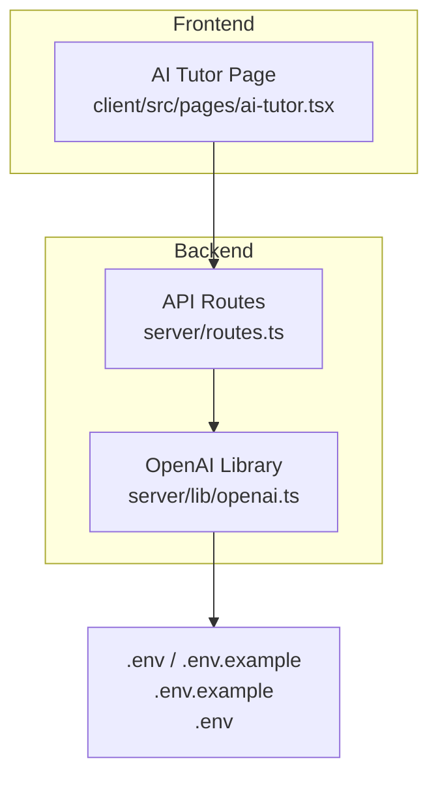
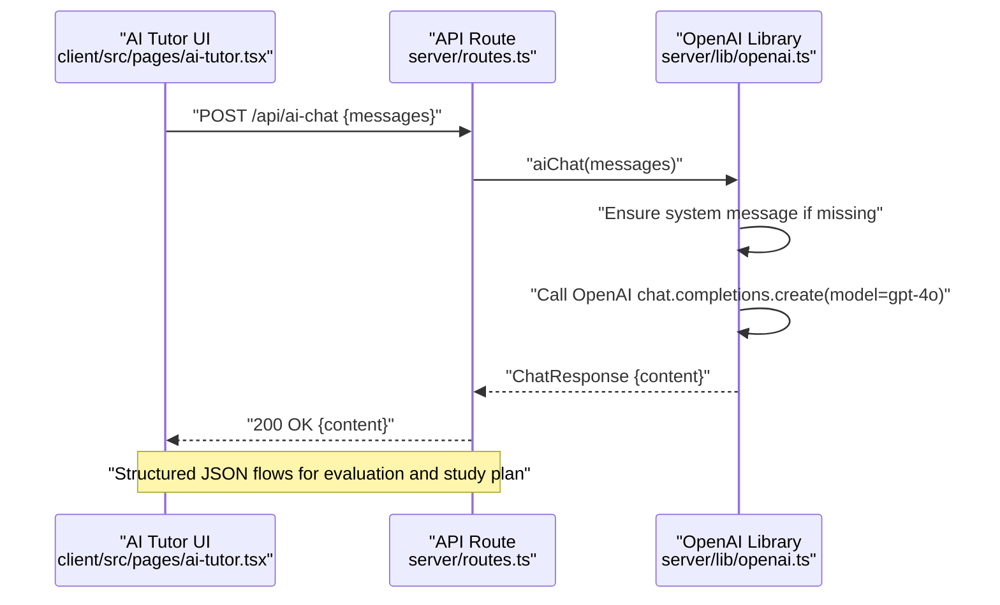
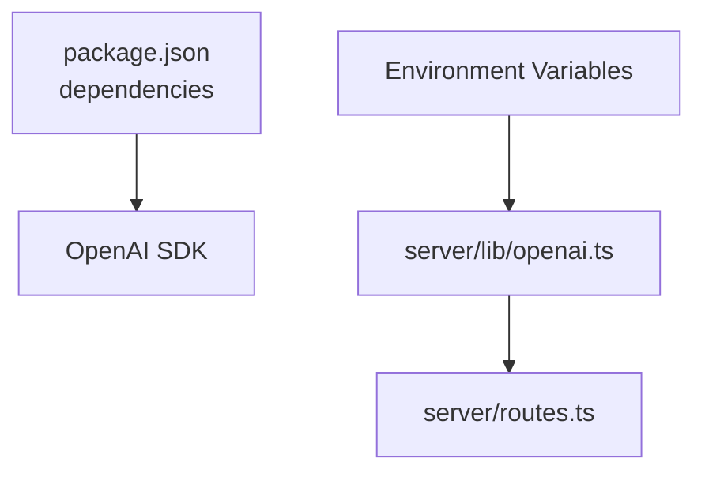

# OpenAI Integration

<cite>
**Referenced Files in This Document**
- [openai.ts](file://server/lib/openai.ts)
- [.env.example](file://.env.example)
- [.env](file://.env)
- [routes.ts](file://server/routes.ts)
- [ai-tutor.tsx](file://client/src/pages/ai-tutor.tsx)
- [package.json](file://package.json)
- [LOCAL_SETUP.md](file://LOCAL_SETUP.md)
</cite>

## Table of Contents
1. [Introduction](#introduction)
2. [Project Structure](#project-structure)
3. [Core Components](#core-components)
4. [Architecture Overview](#architecture-overview)
5. [Detailed Component Analysis](#detailed-component-analysis)
6. [Dependency Analysis](#dependency-analysis)
7. [Performance Considerations](#performance-considerations)
8. [Troubleshooting Guide](#troubleshooting-guide)
9. [Conclusion](#conclusion)

## Introduction
This document explains the OpenAI integration in PersonalLearningPro, focusing on configuration, API key management, client initialization, model selection rationale, and the chat completion interface for AI tutoring. It also covers error handling, fallback mechanisms, response format handling, and JSON parsing for structured outputs. Guidance is provided for environment setup, rate limiting considerations, and troubleshooting common integration issues.

## Project Structure
The OpenAI integration spans the backend library module, API routes, and the frontend AI tutor page. The backend initializes the OpenAI SDK using an environment variable, exposes endpoints for chat and evaluation, and parses structured JSON responses. The frontend integrates with the backend to power conversational AI tutoring.

**Diagram sources**
- [openai.ts](file://server/lib/openai.ts#L1-L217)
- [routes.ts](file://server/routes.ts#L561-L580)
- [ai-tutor.tsx](file://client/src/pages/ai-tutor.tsx#L1-L604)
- [.env.example](file://.env.example#L1-L36)
- [.env](file://.env#L1-L12)

**Section sources**
- [openai.ts](file://server/lib/openai.ts#L1-L217)
- [routes.ts](file://server/routes.ts#L561-L580)
- [ai-tutor.tsx](file://client/src/pages/ai-tutor.tsx#L1-L604)
- [.env.example](file://.env.example#L16-L19)
- [.env](file://.env#L6-L6)

## Core Components
- OpenAI SDK configuration and client initialization
- Chat completion interface for AI tutoring
- Structured JSON evaluation and study plan generation
- Frontend integration for conversational tutoring

Key implementation highlights:
- SDK initialization reads the API key from environment variables and warns if missing.
- The chat endpoint ensures a system message is present before invoking the model.
- Structured JSON responses are requested and parsed with robust fallbacks.
- Frontend maintains conversation state and triggers backend chat completion.

**Section sources**
- [openai.ts](file://server/lib/openai.ts#L3-L9)
- [openai.ts](file://server/lib/openai.ts#L20-L42)
- [openai.ts](file://server/lib/openai.ts#L50-L105)
- [openai.ts](file://server/lib/openai.ts#L107-L163)
- [routes.ts](file://server/routes.ts#L561-L580)
- [ai-tutor.tsx](file://client/src/pages/ai-tutor.tsx#L60-L84)

## Architecture Overview
The AI tutoring flow connects the frontend to backend routes, which delegate to the OpenAI library. The library constructs chat completions with a fixed model and enforces a system message when missing. Structured JSON responses are used for evaluation and planning, with resilient error handling and fallbacks.

**Diagram sources**
- [routes.ts](file://server/routes.ts#L561-L580)
- [openai.ts](file://server/lib/openai.ts#L20-L42)
- [openai.ts](file://server/lib/openai.ts#L50-L105)
- [openai.ts](file://server/lib/openai.ts#L107-L163)

## Detailed Component Analysis

### OpenAI SDK Configuration and Initialization
- The OpenAI client is initialized with the API key from environment variables.
- If the key is missing, a warning is logged and AI features are effectively disabled.
- The SDK version used is specified in dependencies.

Implementation notes:
- Client creation and environment variable usage
- Warning for missing API key
- SDK version reference

**Section sources**
- [openai.ts](file://server/lib/openai.ts#L3-L9)
- [package.json](file://package.json#L65-L65)

### Model Selection: gpt-4o
- The integration targets the “gpt-4o” model for chat completions.
- A comment indicates this is the newest model as of a specific release date and should not be changed unless explicitly requested.

Operational implications:
- Consistent model behavior across endpoints
- Version stability unless intentionally updated

**Section sources**
- [openai.ts](file://server/lib/openai.ts#L3-L3)
- [openai.ts](file://server/lib/openai.ts#L30-L32)

### Chat Completion Interface for AI Tutoring
- Endpoint: POST /api/ai-chat
- Request: messages array with role and content
- Behavior:
  - Ensures a system message is present at the start of the messages array if not provided
  - Calls the OpenAI chat completion API with the configured model
  - Returns the assistant’s response content

Frontend integration:
- The AI tutor page manages conversation history and sends user messages to the backend
- It displays typing indicators and renders responses

**Section sources**
- [routes.ts](file://server/routes.ts#L561-L580)
- [openai.ts](file://server/lib/openai.ts#L20-L42)
- [ai-tutor.tsx](file://client/src/pages/ai-tutor.tsx#L60-L84)

### Structured JSON Responses: Evaluation and Study Plan
- Evaluation endpoint:
  - Accepts student answer, question, rubric, and max marks
  - Requests JSON output from the model
  - Parses and validates numeric ranges for score and confidence
  - Provides fallback values on parse or service errors
- Study plan endpoint:
  - Requests JSON with a plan and resource list
  - Parses and returns structured results with fallbacks

Error handling:
- Try/catch around OpenAI calls
- JSON parse error handling with defaults
- Service failure fallback responses

**Section sources**
- [openai.ts](file://server/lib/openai.ts#L50-L105)
- [openai.ts](file://server/lib/openai.ts#L107-L163)

### Frontend Integration for Conversational AI
- Maintains conversation state in local storage
- Sends messages to the backend chat endpoint
- Displays user and assistant messages, with a typing indicator during processing
- Uses a system prompt constant aligned with backend behavior

**Section sources**
- [ai-tutor.tsx](file://client/src/pages/ai-tutor.tsx#L60-L84)
- [ai-tutor.tsx](file://client/src/pages/ai-tutor.tsx#L396-L421)

## Dependency Analysis
The OpenAI integration relies on the official OpenAI SDK and environment configuration. The backend routes depend on the OpenAI library for chat and evaluation features.

**Diagram sources**
- [package.json](file://package.json#L65-L65)
- [openai.ts](file://server/lib/openai.ts#L1-L9)
- [routes.ts](file://server/routes.ts#L7-L7)

**Section sources**
- [package.json](file://package.json#L65-L65)
- [openai.ts](file://server/lib/openai.ts#L1-L9)
- [routes.ts](file://server/routes.ts#L7-L7)

## Performance Considerations
- Model choice: gpt-4o is selected for balanced performance and capabilities; avoid frequent model changes unless necessary.
- Request volume: Limit concurrent requests and implement client-side throttling to prevent rate limiting.
- Response parsing: Structured JSON reduces downstream parsing overhead but requires robust fallbacks.
- Caching: Consider caching repeated prompts or low-churn evaluations to reduce API calls.

[No sources needed since this section provides general guidance]

## Troubleshooting Guide
Common issues and resolutions:
- Missing API key:
  - Symptom: Warning logged and AI features unavailable
  - Action: Set OPENAI_API_KEY in environment
- Environment variable not loading:
  - Symptom: Backend still reports missing key
  - Action: Ensure .env is in the project root and restart the server
- JSON parse failures:
  - Symptom: Evaluation/study plan falls back to defaults
  - Action: Verify model returns valid JSON; adjust system prompts to enforce JSON format
- Service errors:
  - Symptom: Backend throws or returns fallback responses
  - Action: Retry with backoff; monitor quotas and limits

Configuration references:
- Environment variables and setup steps
- Example environment file

**Section sources**
- [openai.ts](file://server/lib/openai.ts#L4-L6)
- [LOCAL_SETUP.md](file://LOCAL_SETUP.md#L26-L53)
- [.env.example](file://.env.example#L16-L19)
- [.env](file://.env#L6-L6)

## Conclusion
The OpenAI integration in PersonalLearningPro centers on a stable gpt-4o model, robust error handling, and structured JSON responses for evaluation and planning. The backend exposes a clear chat endpoint, while the frontend provides a responsive tutoring interface. Proper environment configuration and cautious rate limiting ensure reliable operation.