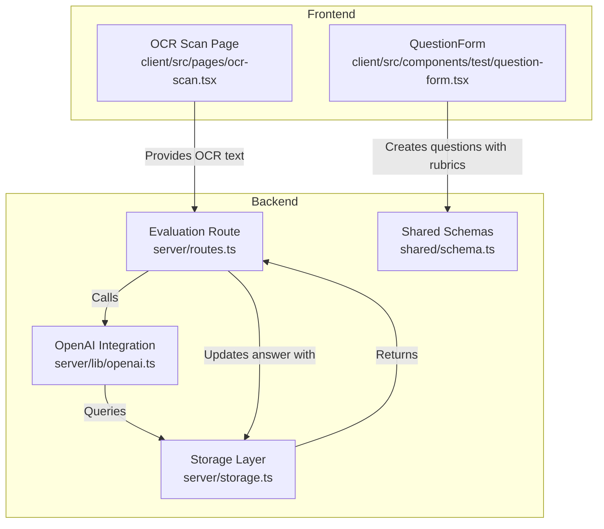
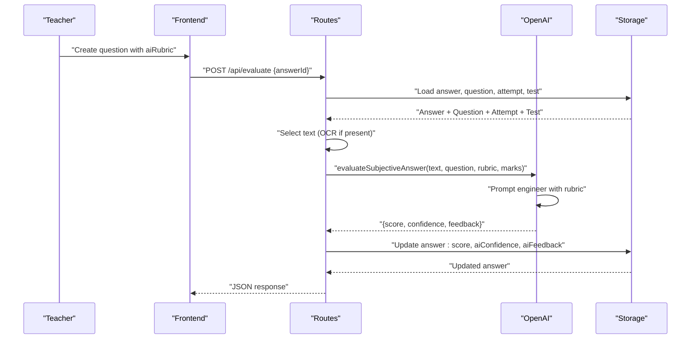
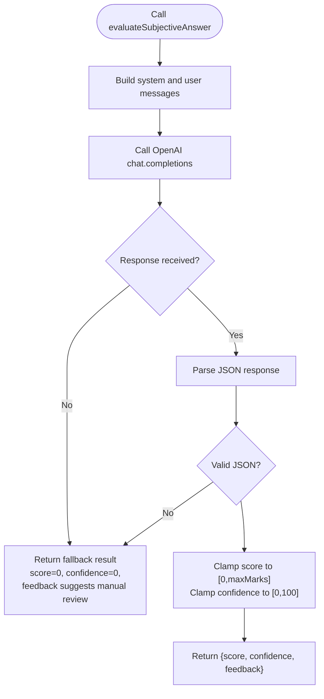
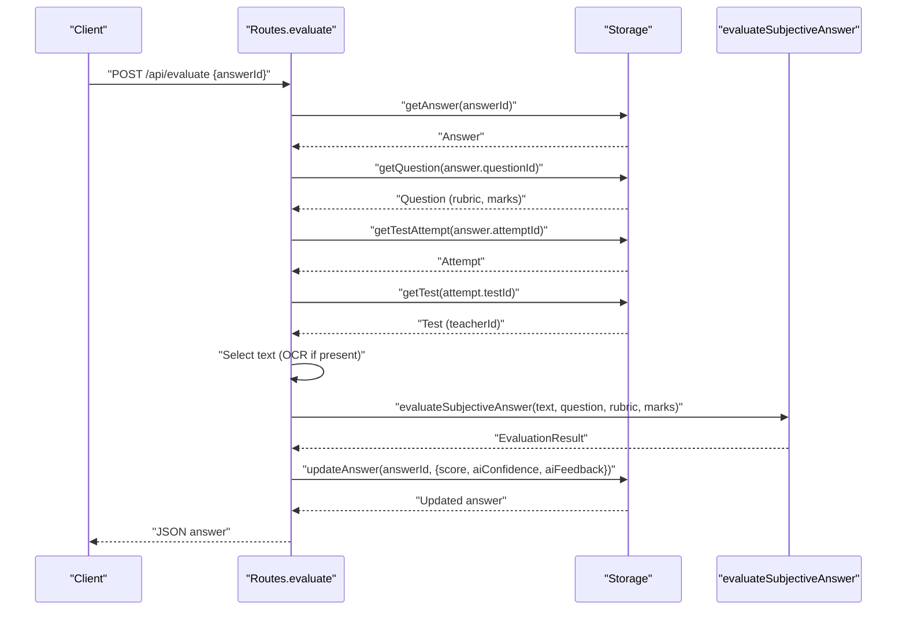
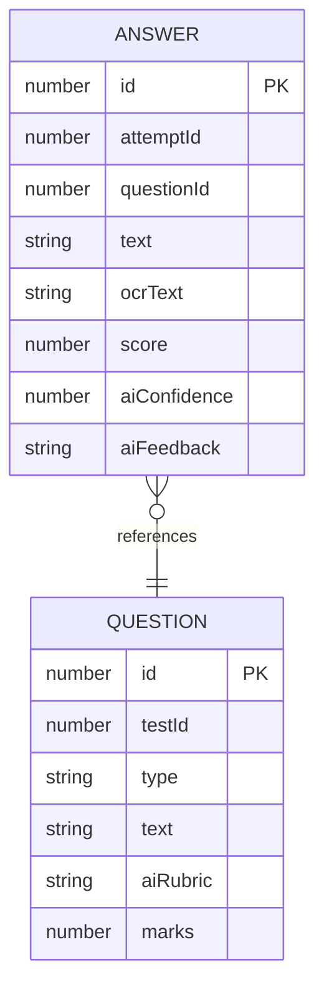
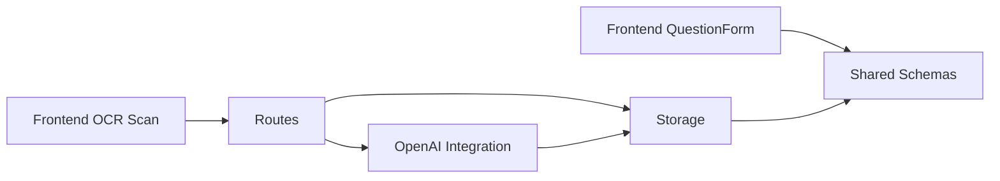

# Subjective Answer Evaluation

<cite>
**Referenced Files in This Document**
- [openai.ts](file://server/lib/openai.ts)
- [routes.ts](file://server/routes.ts)
- [schema.ts](file://shared/schema.ts)
- [storage.ts](file://server/storage.ts)
- [question-form.tsx](file://client/src/components/test/question-form.tsx)
- [ocr-scan.tsx](file://client/src/pages/ocr-scan.tsx)
</cite>

## Table of Contents
1. [Introduction](#introduction)
2. [Project Structure](#project-structure)
3. [Core Components](#core-components)
4. [Architecture Overview](#architecture-overview)
5. [Detailed Component Analysis](#detailed-component-analysis)
6. [Dependency Analysis](#dependency-analysis)
7. [Performance Considerations](#performance-considerations)
8. [Troubleshooting Guide](#troubleshooting-guide)
9. [Conclusion](#conclusion)

## Introduction
This document explains the subjective answer evaluation system used to automatically score descriptive and constructed-response questions. It covers the evaluateSubjectiveAnswer function implementation, prompt engineering for rubric-based assessment, scoring and confidence mechanisms, feedback generation, JSON response format and validation, integration with question rubrics and maximum marks, partial credit handling, examples of evaluation prompts across subjects, and error handling with manual review fallback.

## Project Structure
The evaluation pipeline spans backend and frontend components:
- Backend: OpenAI integration, route orchestration, and persistent storage
- Frontend: Question creation UI enabling rubric authoring and OCR-assisted text capture

**Diagram sources**
- [routes.ts](file://server/routes.ts#L487-L559)
- [openai.ts](file://server/lib/openai.ts#L50-L105)
- [schema.ts](file://shared/schema.ts#L28-L59)
- [storage.ts](file://server/storage.ts#L44-L262)
- [question-form.tsx](file://client/src/components/test/question-form.tsx#L354-L372)
- [ocr-scan.tsx](file://client/src/pages/ocr-scan.tsx#L31-L95)

**Section sources**
- [routes.ts](file://server/routes.ts#L487-L559)
- [openai.ts](file://server/lib/openai.ts#L50-L105)
- [schema.ts](file://shared/schema.ts#L28-L59)
- [storage.ts](file://server/storage.ts#L44-L262)
- [question-form.tsx](file://client/src/components/test/question-form.tsx#L354-L372)
- [ocr-scan.tsx](file://client/src/pages/ocr-scan.tsx#L31-L95)

## Core Components
- evaluateSubjectiveAnswer: Orchestrates rubric-based evaluation using OpenAI, validates JSON output, clamps scores/confidence to configured bounds, and returns feedback.
- Evaluation route: Validates permissions, loads answer and question context, selects OCR text if available, invokes evaluation, and persists results.
- Storage integration: Loads answers, questions, attempts, and tests; updates answers with score, confidence, and feedback.
- Frontend rubric authoring: Allows teachers to define AI rubrics for short/long questions during test creation.
- OCR text ingestion: Supplies recognized text for scanned answer sheets.

**Section sources**
- [openai.ts](file://server/lib/openai.ts#L50-L105)
- [routes.ts](file://server/routes.ts#L487-L559)
- [storage.ts](file://server/storage.ts#L44-L262)
- [question-form.tsx](file://client/src/components/test/question-form.tsx#L354-L372)
- [ocr-scan.tsx](file://client/src/pages/ocr-scan.tsx#L31-L95)

## Architecture Overview
The evaluation flow integrates teacher-defined rubrics, question context, and student answer text to produce a score, confidence, and feedback.

**Diagram sources**
- [routes.ts](file://server/routes.ts#L487-L559)
- [openai.ts](file://server/lib/openai.ts#L50-L105)
- [storage.ts](file://server/storage.ts#L44-L262)

## Detailed Component Analysis

### evaluateSubjectiveAnswer Implementation
- Purpose: Accepts student answer, question text, rubric, and maximum marks; returns a validated evaluation result.
- Prompt engineering:
  - System message establishes the evaluator persona and required JSON schema.
  - User message provides question, rubric, and student answer.
  - response_format enforces JSON output.
- Validation and normalization:
  - Parses returned JSON; on failure, returns safe defaults and guidance to manual review.
  - Clamps score to [0, maxMarks] and confidence to [0, 100].
- Error handling:
  - Catches OpenAI errors and returns fallback result instructing manual review.

**Diagram sources**
- [openai.ts](file://server/lib/openai.ts#L50-L105)

**Section sources**
- [openai.ts](file://server/lib/openai.ts#L50-L105)

### Evaluation Route Orchestration
- Permission checks: Ensures the requesting teacher owns the test associated with the answer attempt.
- Context loading: Retrieves answer, question, attempt, and test to validate ownership and load rubric/marks.
- Text selection: Prefers OCR text if available; otherwise uses typed answer text.
- Evaluation invocation: Calls evaluateSubjectiveAnswer with question text, rubric, and marks.
- Persistence: Updates the answer record with score, confidence, and feedback.

**Diagram sources**
- [routes.ts](file://server/routes.ts#L487-L559)
- [storage.ts](file://server/storage.ts#L44-L262)
- [openai.ts](file://server/lib/openai.ts#L50-L105)

**Section sources**
- [routes.ts](file://server/routes.ts#L487-L559)
- [storage.ts](file://server/storage.ts#L44-L262)

### Data Model and Validation
- Answer schema fields used for evaluation persistence:
  - score: numeric score assigned by AI
  - aiConfidence: numeric confidence percentage
  - aiFeedback: evaluation commentary
- Question schema fields used for evaluation:
  - aiRubric: teacher-provided rubric text
  - marks: maximum marks for the question

**Diagram sources**
- [schema.ts](file://shared/schema.ts#L48-L59)
- [schema.ts](file://shared/schema.ts#L28-L37)

**Section sources**
- [schema.ts](file://shared/schema.ts#L28-L59)

### Frontend Rubric Authoring
- During question creation, teachers can specify an AI rubric for short/long questions.
- The rubric is stored with the question and used by the evaluation pipeline.

**Section sources**
- [question-form.tsx](file://client/src/components/test/question-form.tsx#L354-L372)
- [schema.ts](file://shared/schema.ts#L28-L37)

### OCR Text Integration
- OCR recognition supplies text extracted from scanned answer sheets.
- The evaluation route prefers OCR text when available.

**Section sources**
- [routes.ts](file://server/routes.ts#L533-L538)
- [ocr-scan.tsx](file://client/src/pages/ocr-scan.tsx#L31-L95)

## Dependency Analysis
- Routes depend on Storage for data retrieval and updates.
- Storage depends on shared schemas for type safety.
- OpenAI integration encapsulates LLM calls and response parsing/validation.
- Frontend components feed rubrics and OCR text into the backend.

**Diagram sources**
- [routes.ts](file://server/routes.ts#L487-L559)
- [openai.ts](file://server/lib/openai.ts#L50-L105)
- [schema.ts](file://shared/schema.ts#L28-L59)
- [storage.ts](file://server/storage.ts#L44-L262)
- [question-form.tsx](file://client/src/components/test/question-form.tsx#L354-L372)
- [ocr-scan.tsx](file://client/src/pages/ocr-scan.tsx#L31-L95)

**Section sources**
- [routes.ts](file://server/routes.ts#L487-L559)
- [openai.ts](file://server/lib/openai.ts#L50-L105)
- [schema.ts](file://shared/schema.ts#L28-L59)
- [storage.ts](file://server/storage.ts#L44-L262)

## Performance Considerations
- Single synchronous OpenAI call per evaluation; keep rubric length reasonable to minimize latency.
- JSON parsing and range clamping are O(1); negligible overhead.
- Consider batching evaluations server-side if scaling to many simultaneous grading tasks.

## Troubleshooting Guide
Common failure modes and remedies:
- OpenAI service unavailable or rate-limited:
  - Behavior: evaluateSubjectiveAnswer returns fallback result with score and confidence at zero and guidance to manual review.
  - Action: Retry later or instruct teacher to review manually.
- Malformed JSON response from OpenAI:
  - Behavior: JSON parse failure triggers fallback result and logs the error.
  - Action: Verify prompt stability; adjust rubric clarity; retry.
- Permission denied:
  - Behavior: Routes return 403 if the teacher does not own the test.
  - Action: Ensure the logged-in teacher created the test.
- Answer or question missing:
  - Behavior: Routes return 404 for missing entities.
  - Action: Confirm answerId and related identifiers are valid.

**Section sources**
- [openai.ts](file://server/lib/openai.ts#L89-L104)
- [routes.ts](file://server/routes.ts#L503-L531)

## Conclusion
The subjective answer evaluation system combines teacher-authored rubrics, question-specific maximum marks, and AI-powered reasoning to produce a score, confidence, and feedback. Robust validation and error handling ensure resilient operation, while manual review remains available as a fallback. The design cleanly separates concerns across frontend rubric authoring, backend orchestration, and persistent storage.