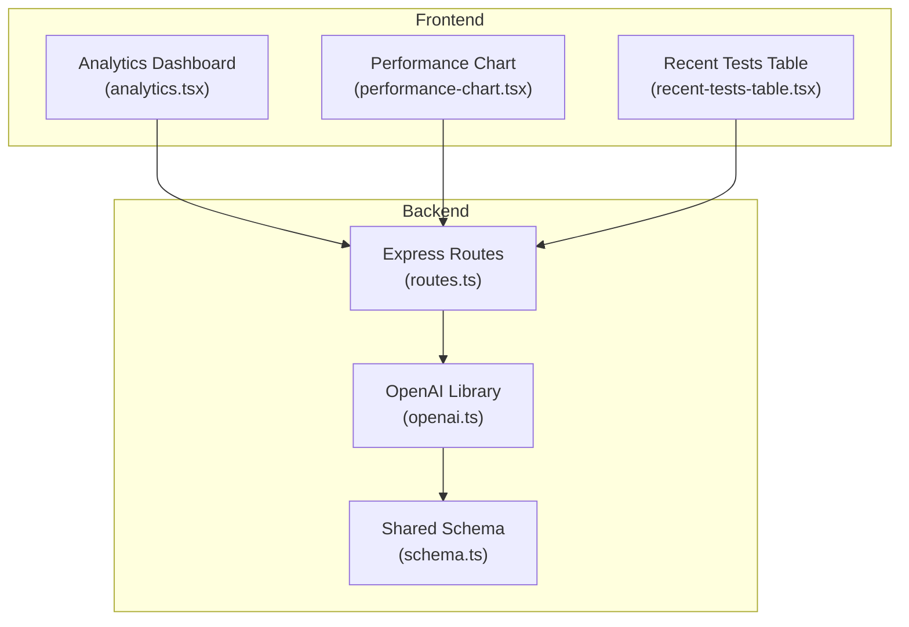
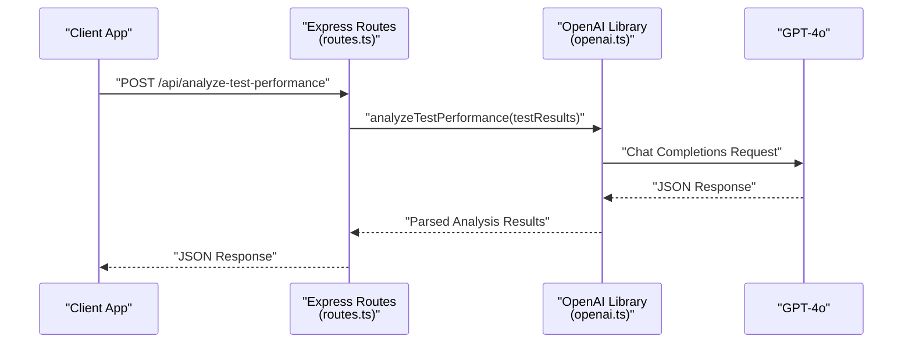
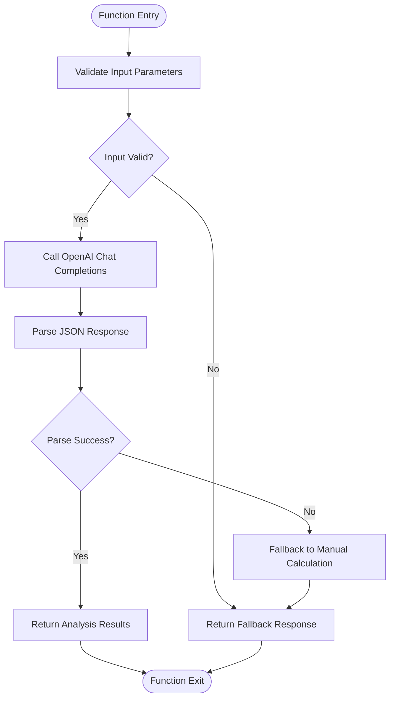
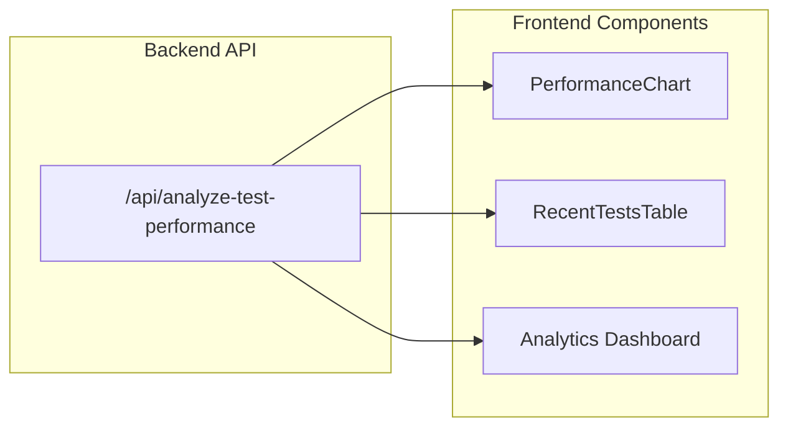
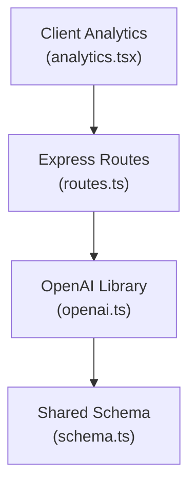

# Test Performance Analysis

<cite>
**Referenced Files in This Document**
- [openai.ts](file://server/lib/openai.ts)
- [routes.ts](file://server/routes.ts)
- [schema.ts](file://shared/schema.ts)
- [analytics.tsx](file://client/src/pages/analytics.tsx)
- [performance-chart.tsx](file://client/src/components/dashboard/performance-chart.tsx)
- [recent-tests-table.tsx](file://client/src/components/dashboard/recent-tests-table.tsx)
</cite>

## Table of Contents
1. [Introduction](#introduction)
2. [Project Structure](#project-structure)
3. [Core Components](#core-components)
4. [Architecture Overview](#architecture-overview)
5. [Detailed Component Analysis](#detailed-component-analysis)
6. [Dependency Analysis](#dependency-analysis)
7. [Performance Considerations](#performance-considerations)
8. [Troubleshooting Guide](#troubleshooting-guide)
9. [Conclusion](#conclusion)

## Introduction
This document provides comprehensive documentation for the test performance analysis system. It focuses on the analyzeTestPerformance function that processes student results to generate insights, including data structure requirements, AI-generated recommendations, identification of difficult questions, and statistical calculations. It also covers the JSON response schema, error handling, and practical examples of input and output formats.

## Project Structure
The test performance analysis spans backend AI processing, API routing, and frontend analytics visualization:
- Backend AI processing: analyzeTestPerformance function in the OpenAI library
- API integration: route registration and usage in the Express server
- Frontend analytics: dashboards and charts for performance visualization
- Shared schemas: validation and typing for test and analytics data

**Diagram sources**
- [openai.ts](file://server/lib/openai.ts#L165-L216)
- [routes.ts](file://server/routes.ts#L1-L1104)
- [schema.ts](file://shared/schema.ts#L1-L142)
- [analytics.tsx](file://client/src/pages/analytics.tsx#L1-L177)
- [performance-chart.tsx](file://client/src/components/dashboard/performance-chart.tsx#L1-L98)
- [recent-tests-table.tsx](file://client/src/components/dashboard/recent-tests-table.tsx#L1-L234)

**Section sources**
- [openai.ts](file://server/lib/openai.ts#L165-L216)
- [routes.ts](file://server/routes.ts#L1-L1104)
- [schema.ts](file://shared/schema.ts#L1-L142)
- [analytics.tsx](file://client/src/pages/analytics.tsx#L1-L177)
- [performance-chart.tsx](file://client/src/components/dashboard/performance-chart.tsx#L1-L98)
- [recent-tests-table.tsx](file://client/src/components/dashboard/recent-tests-table.tsx#L1-L234)

## Core Components
- analyzeTestPerformance: Processes test results and returns average score, difficult questions, and recommendations
- Route integration: Exposes analyzeTestPerformance via API endpoints
- Frontend analytics: Visualizes performance metrics and insights
- Shared schemas: Define data structures for validation and type safety

**Section sources**
- [openai.ts](file://server/lib/openai.ts#L165-L216)
- [routes.ts](file://server/routes.ts#L1-L1104)
- [schema.ts](file://shared/schema.ts#L1-L142)
- [analytics.tsx](file://client/src/pages/analytics.tsx#L1-L177)

## Architecture Overview
The system integrates frontend dashboards with backend AI analysis through Express routes. The analyzeTestPerformance function sends processed test results to OpenAI's GPT-4o model and returns structured insights.

**Diagram sources**
- [routes.ts](file://server/routes.ts#L1-L1104)
- [openai.ts](file://server/lib/openai.ts#L165-L216)

## Detailed Component Analysis

### analyzeTestPerformance Function
The analyzeTestPerformance function orchestrates AI-driven analysis of test results:
- Accepts an array of student results with scores and per-question performance
- Sends structured prompts to OpenAI GPT-4o
- Returns standardized JSON with average score, hardest questions, and recommendations
- Includes robust error handling with fallback calculations

**Diagram sources**
- [openai.ts](file://server/lib/openai.ts#L165-L216)

**Section sources**
- [openai.ts](file://server/lib/openai.ts#L165-L216)

### Data Structure Requirements
The analyzeTestPerformance function expects a specific array structure for test results:

Input Data Format:
- Array of student result objects
- Each student object includes:
  - studentId: number
  - score: number
  - answers: Array of question objects
    - questionId: number
    - score: number
    - question: string

Statistical Analysis:
- Average score calculation: Sum of all student scores divided by number of students
- Hardest questions: Identified by lowest average scores across questions
- Recommendations: AI-generated teaching suggestions based on performance patterns

**Section sources**
- [openai.ts](file://server/lib/openai.ts#L165-L167)

### JSON Response Schema
The analyzeTestPerformance function returns a standardized JSON object:

Response Fields:
- averageScore: number (calculated average)
- hardestQuestions: Array of question objects
  - questionId: number
  - question: string
  - avgScore: number
- recommendations: string (teaching recommendations)

Example Response Structure:
{
  "averageScore": 78.5,
  "hardestQuestions": [
    {
      "questionId": 101,
      "question": "Explain Newton's laws of motion",
      "avgScore": 65.2
    }
  ],
  "recommendations": "Focus on conceptual understanding of fundamental principles"
}

**Section sources**
- [openai.ts](file://server/lib/openai.ts#L167-L171)

### Frontend Integration and Visualization
The frontend analytics dashboard displays performance insights through:
- Performance charts showing class vs school averages
- Recent tests table with completion rates and average scores
- AI-generated learning insights cards

**Diagram sources**
- [routes.ts](file://server/routes.ts#L1-L1104)
- [performance-chart.tsx](file://client/src/components/dashboard/performance-chart.tsx#L1-L98)
- [recent-tests-table.tsx](file://client/src/components/dashboard/recent-tests-table.tsx#L1-L234)
- [analytics.tsx](file://client/src/pages/analytics.tsx#L1-L177)

**Section sources**
- [analytics.tsx](file://client/src/pages/analytics.tsx#L1-L177)
- [performance-chart.tsx](file://client/src/components/dashboard/performance-chart.tsx#L1-L98)
- [recent-tests-table.tsx](file://client/src/components/dashboard/recent-tests-table.tsx#L1-L234)

## Dependency Analysis
The test performance analysis system has the following key dependencies:

**Diagram sources**
- [openai.ts](file://server/lib/openai.ts#L1-L217)
- [routes.ts](file://server/routes.ts#L1-L1104)
- [schema.ts](file://shared/schema.ts#L1-L142)
- [analytics.tsx](file://client/src/pages/analytics.tsx#L1-L177)

**Section sources**
- [openai.ts](file://server/lib/openai.ts#L1-L217)
- [routes.ts](file://server/routes.ts#L1-L1104)
- [schema.ts](file://shared/schema.ts#L1-L142)

## Performance Considerations
- API latency: OpenAI requests introduce network latency; implement caching for repeated analyses
- Batch processing: Consider batching multiple test analyses to reduce overhead
- Data volume: Large test result arrays may impact parsing performance; monitor JSON payload sizes
- Error resilience: Built-in fallback mechanisms ensure system stability during AI service issues

## Troubleshooting Guide
Common issues and resolutions:

JSON Parse Errors:
- Symptom: Analysis returns fallback with error message
- Cause: Malformed JSON response from OpenAI
- Resolution: Verify input data format and retry analysis

AI Service Failures:
- Symptom: Performance analysis unavailable
- Cause: OpenAI API unavailability or rate limits
- Resolution: System falls back to manual calculations using available data

Input Validation Issues:
- Symptom: 400 Bad Request responses
- Cause: Invalid test result structure
- Resolution: Ensure all required fields are present and properly formatted

**Section sources**
- [openai.ts](file://server/lib/openai.ts#L193-L215)

## Conclusion
The test performance analysis system provides a robust framework for processing student results and generating actionable insights. Through structured data formats, AI-powered analysis, and comprehensive error handling, it enables educators to identify learning gaps and improve instructional strategies effectively.