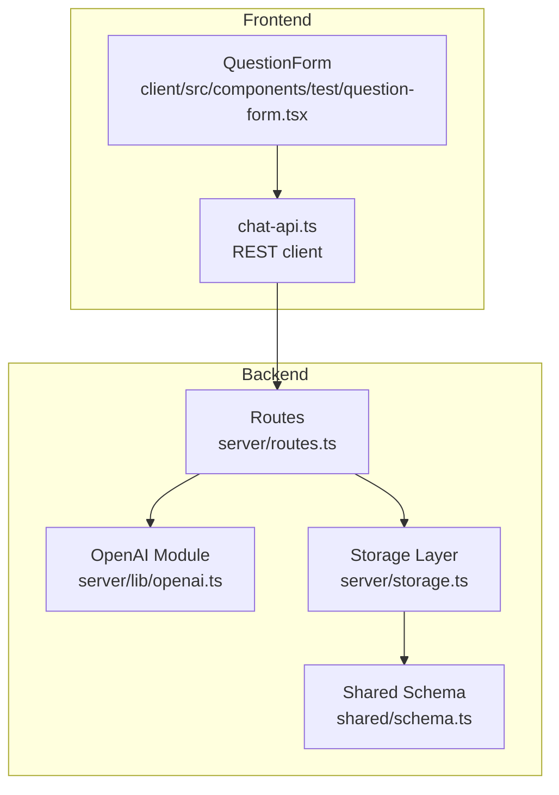
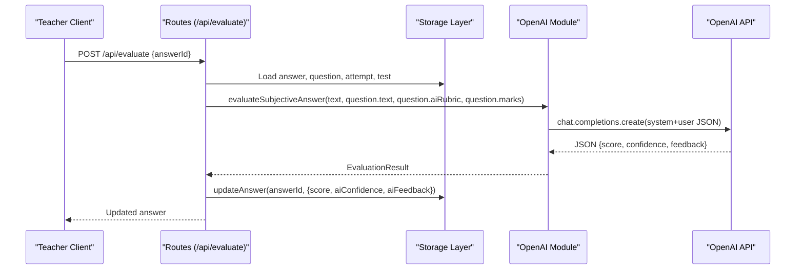
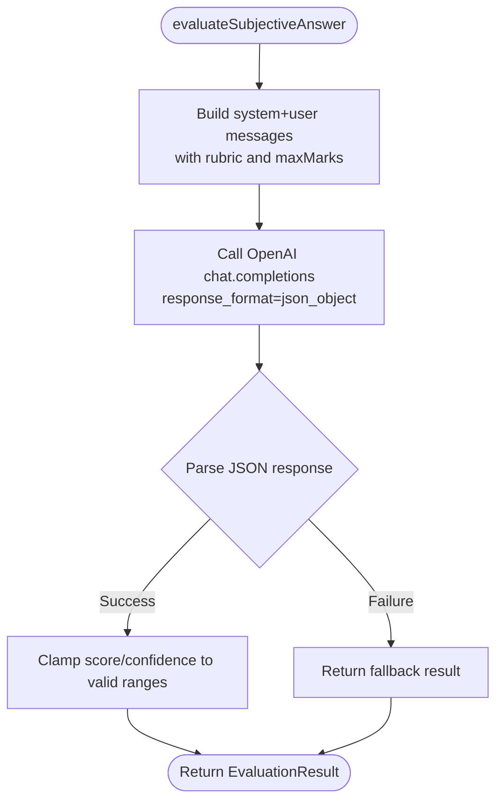
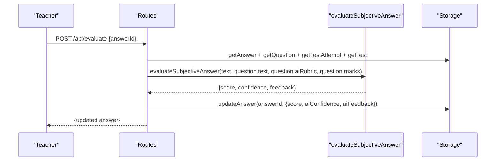
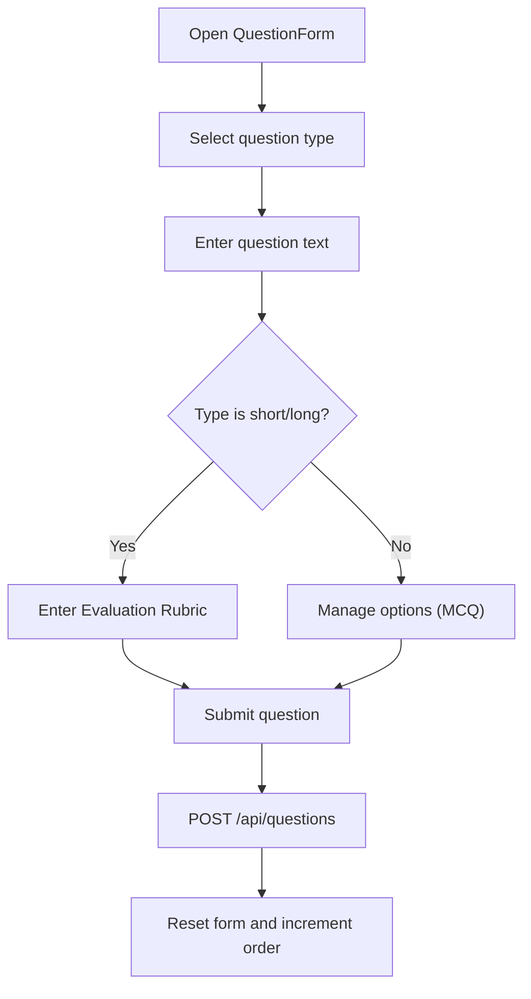
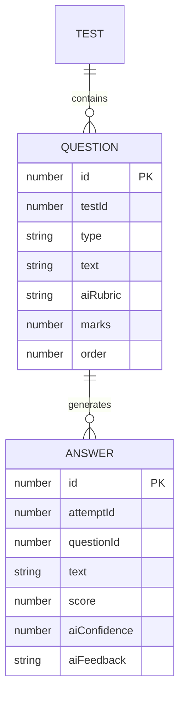
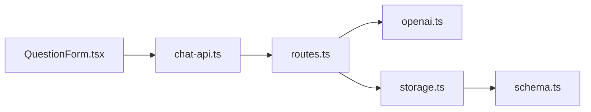

# AI Integration for Question Management

<cite>
**Referenced Files in This Document**
- [openai.ts](file://server/lib/openai.ts)
- [routes.ts](file://server/routes.ts)
- [question-form.tsx](file://client/src/components/test/question-form.tsx)
- [schema.ts](file://shared/schema.ts)
- [storage.ts](file://server/storage.ts)
- [chat-api.ts](file://client/src/lib/chat-api.ts)
</cite>

## Table of Contents
1. [Introduction](#introduction)
2. [Project Structure](#project-structure)
3. [Core Components](#core-components)
4. [Architecture Overview](#architecture-overview)
5. [Detailed Component Analysis](#detailed-component-analysis)
6. [Dependency Analysis](#dependency-analysis)
7. [Performance Considerations](#performance-considerations)
8. [Troubleshooting Guide](#troubleshooting-guide)
9. [Conclusion](#conclusion)

## Introduction
This document explains how AI is integrated into the question management system to support question creation, enhancement, and evaluation. It covers how the backend integrates with the OpenAI API, how prompts are engineered for rubric generation and subjective answer evaluation, and how the frontend enables teachers to define AI-powered rubrics for short and long answer questions. It also documents fallback mechanisms, error handling, and performance considerations for AI operations.

## Project Structure
The AI integration spans three layers:
- Backend service exposing REST endpoints and orchestrating OpenAI requests
- Shared schema defining persistent fields for rubrics and AI evaluation metadata
- Frontend forms enabling teachers to specify rubrics and submit questions

**Diagram sources**
- [routes.ts](file://server/routes.ts#L487-L580)
- [openai.ts](file://server/lib/openai.ts#L20-L105)
- [question-form.tsx](file://client/src/components/test/question-form.tsx#L354-L372)
- [schema.ts](file://shared/schema.ts#L28-L59)
- [storage.ts](file://server/storage.ts#L191-L211)
- [chat-api.ts](file://client/src/lib/chat-api.ts#L44-L55)

**Section sources**
- [routes.ts](file://server/routes.ts#L487-L580)
- [openai.ts](file://server/lib/openai.ts#L1-L217)
- [question-form.tsx](file://client/src/components/test/question-form.tsx#L1-L390)
- [schema.ts](file://shared/schema.ts#L28-L59)
- [storage.ts](file://server/storage.ts#L191-L211)
- [chat-api.ts](file://client/src/lib/chat-api.ts#L1-L112)

## Core Components
- OpenAI integration module encapsulates:
  - Chat completions for AI tutoring
  - Subjective answer evaluation with rubric-aware scoring
  - Study plan generation and test performance analysis
- Routes expose:
  - AI chat endpoint for tutoring
  - Manual evaluation endpoint for subjective answers
- Frontend form supports:
  - Question creation with rubric input for short/long answers
  - Automatic MCQ scoring and numerical answer validation
- Shared schema defines:
  - Question entity with optional AI rubric
  - Answer entity with AI-generated score, confidence, and feedback

**Section sources**
- [openai.ts](file://server/lib/openai.ts#L20-L105)
- [routes.ts](file://server/routes.ts#L487-L580)
- [question-form.tsx](file://client/src/components/test/question-form.tsx#L354-L372)
- [schema.ts](file://shared/schema.ts#L28-L59)

## Architecture Overview
The AI-powered evaluation flow is initiated by a teacher after a student submits a subjective answer. The backend retrieves the answer and associated question, constructs a rubric-aware prompt, queries OpenAI, parses the JSON response, and persists AI-generated metrics back to the answer record.

**Diagram sources**
- [routes.ts](file://server/routes.ts#L487-L580)
- [openai.ts](file://server/lib/openai.ts#L50-L105)
- [storage.ts](file://server/storage.ts#L241-L262)

## Detailed Component Analysis

### OpenAI Integration Module
- aiChat: Ensures a system message is present, then calls chat.completions with the gpt-4o model. Returns the assistant’s content or a safe fallback.
- evaluateSubjectiveAnswer: Builds a rubric-aware prompt instructing the model to return a JSON object containing score, confidence, and feedback. Includes robust JSON parsing and fallback behavior on error.
- generateStudyPlan and analyzeTestPerformance: Demonstrates consistent prompt engineering and JSON response handling patterns.

**Diagram sources**
- [openai.ts](file://server/lib/openai.ts#L50-L105)

**Section sources**
- [openai.ts](file://server/lib/openai.ts#L20-L105)

### Routes and Evaluation Workflow
- POST /api/evaluate validates permissions, loads related entities, selects rubric (fallback if missing), invokes evaluation, and persists AI metrics to the answer.
- POST /api/ai-chat exposes a tutoring endpoint for chat-style interactions.

**Diagram sources**
- [routes.ts](file://server/routes.ts#L487-L580)
- [openai.ts](file://server/lib/openai.ts#L50-L105)
- [storage.ts](file://server/storage.ts#L241-L262)

**Section sources**
- [routes.ts](file://server/routes.ts#L487-L580)

### Frontend Question Creation and Rubric Input
- QuestionForm supports multiple question types and collects aiRubric for short/long answers.
- On submission, the form posts to /api/questions and resets state for quick iteration.

**Diagram sources**
- [question-form.tsx](file://client/src/components/test/question-form.tsx#L354-L372)
- [routes.ts](file://server/routes.ts#L250-L278)

**Section sources**
- [question-form.tsx](file://client/src/components/test/question-form.tsx#L354-L372)
- [routes.ts](file://server/routes.ts#L250-L278)

### Shared Schema and Persistence
- Question schema includes aiRubric as an optional string.
- Answer schema includes aiConfidence and aiFeedback for storing AI evaluation metadata.
- Storage layer persists and retrieves these fields.

**Diagram sources**
- [schema.ts](file://shared/schema.ts#L28-L59)
- [storage.ts](file://server/storage.ts#L191-L211)

**Section sources**
- [schema.ts](file://shared/schema.ts#L28-L59)
- [storage.ts](file://server/storage.ts#L191-L211)

## Dependency Analysis
- Routes depend on OpenAI module for evaluation and chat, and on Storage for data retrieval and persistence.
- Frontend depends on REST client and routes to submit questions and rubrics.
- Shared schema defines the contract for aiRubric and AI evaluation metadata.

**Diagram sources**
- [question-form.tsx](file://client/src/components/test/question-form.tsx#L1-L390)
- [chat-api.ts](file://client/src/lib/chat-api.ts#L44-L55)
- [routes.ts](file://server/routes.ts#L487-L580)
- [openai.ts](file://server/lib/openai.ts#L1-L217)
- [storage.ts](file://server/storage.ts#L191-L211)
- [schema.ts](file://shared/schema.ts#L28-L59)

**Section sources**
- [routes.ts](file://server/routes.ts#L487-L580)
- [openai.ts](file://server/lib/openai.ts#L1-L217)
- [question-form.tsx](file://client/src/components/test/question-form.tsx#L1-L390)
- [schema.ts](file://shared/schema.ts#L28-L59)
- [storage.ts](file://server/storage.ts#L191-L211)
- [chat-api.ts](file://client/src/lib/chat-api.ts#L1-L112)

## Performance Considerations
- Model selection: Uses gpt-4o for balanced quality and cost.
- Prompt engineering: JSON response_format ensures structured output, reducing parsing overhead and retries.
- Caching: Consider caching rubric prompts per subject or question category to reduce repeated prompt construction.
- Batch operations: Group evaluations when feasible to amortize network latency.
- Rate limits: Respect OpenAI rate limits; implement backoff and queueing for bursts.
- Streaming: For chat tutoring, consider streaming responses to improve perceived performance.

## Troubleshooting Guide
Common issues and remedies:
- Missing OPENAI_API_KEY: The module logs a warning and throws on chat completion. Ensure environment variable is configured.
- JSON parsing failures: The evaluation function falls back to zero-score results with manual review guidance.
- Network errors: Routes catch exceptions and return server errors; clients should surface user-friendly messages.
- Permission errors: Evaluation requires teacher role and ownership of the test; verify session and authorization checks.

Operational checks:
- Verify environment variable presence before startup.
- Monitor OpenAI API health and quota usage.
- Validate rubric content for clarity and completeness to improve evaluation quality.
- Confirm frontend form captures aiRubric for short/long questions.

**Section sources**
- [openai.ts](file://server/lib/openai.ts#L4-L10)
- [openai.ts](file://server/lib/openai.ts#L96-L105)
- [routes.ts](file://server/routes.ts#L487-L580)

## Conclusion
The system integrates OpenAI to power rubric-driven evaluation of subjective answers, while providing a straightforward UI for teachers to define rubrics during question creation. Robust fallbacks, consistent prompt engineering, and clear separation of concerns across frontend, backend, and shared schemas enable reliable AI-assisted assessment workflows. Extending the system with advanced prompt caching, streaming, and batch evaluation can further enhance performance and user experience.