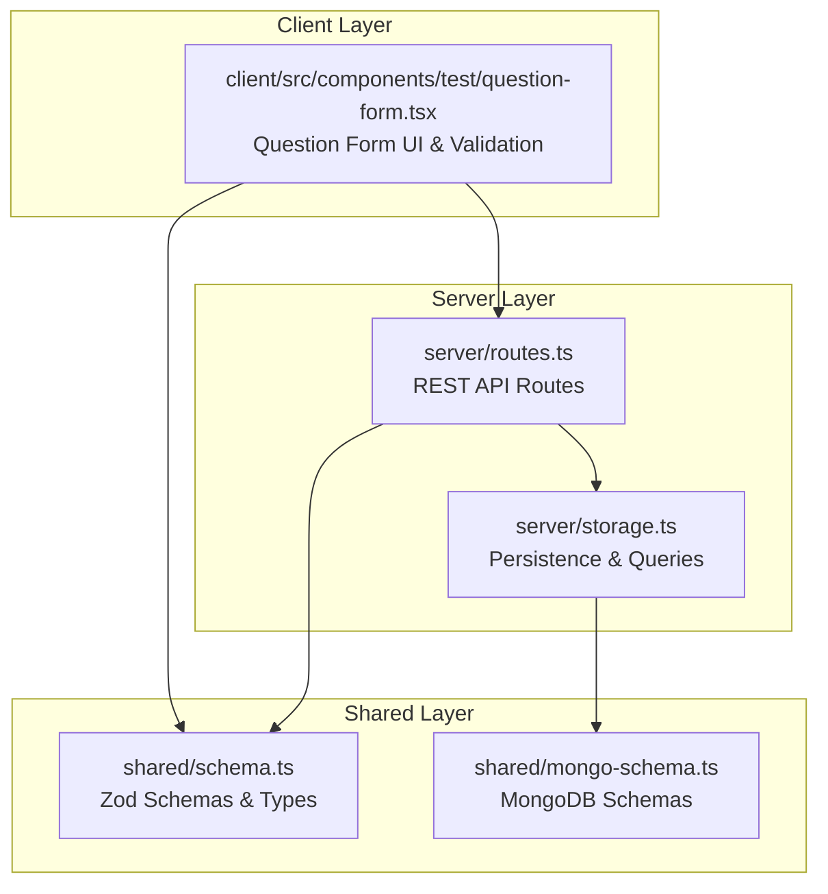
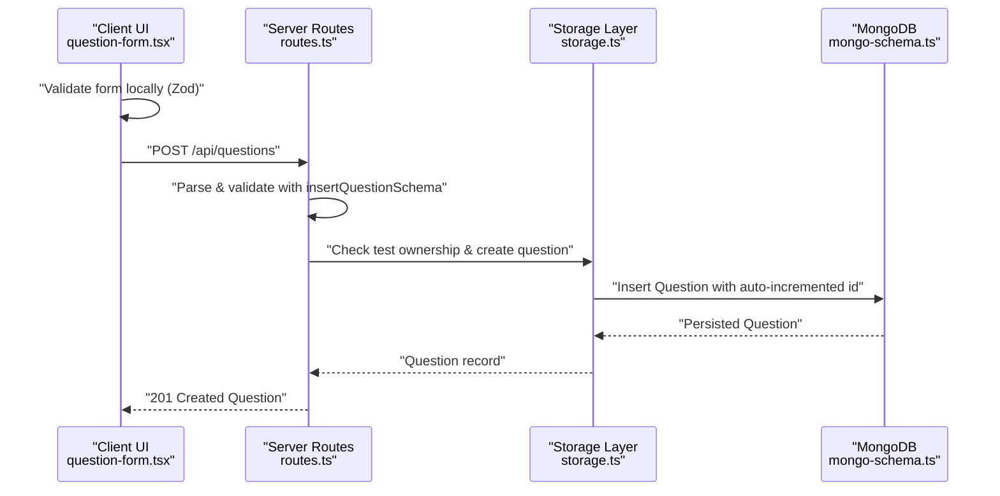
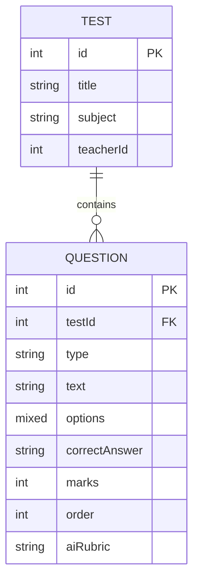
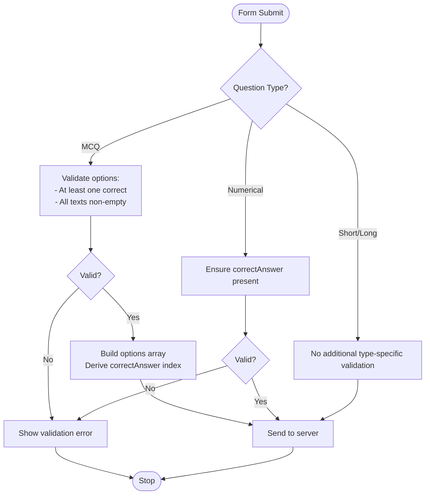
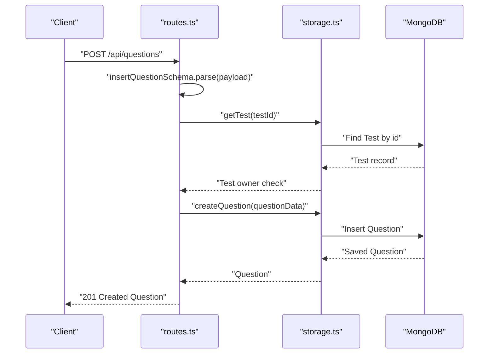
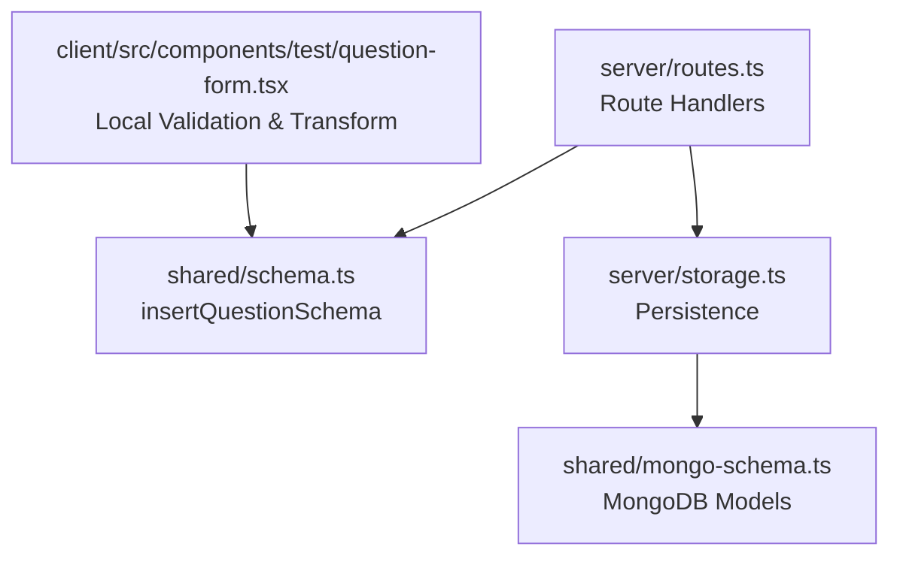

# Question Data Model & Validation

<cite>
**Referenced Files in This Document**
- [schema.ts](file://shared/schema.ts)
- [mongo-schema.ts](file://shared/mongo-schema.ts)
- [question-form.tsx](file://client/src/components/test/question-form.tsx)
- [storage.ts](file://server/storage.ts)
- [routes.ts](file://server/routes.ts)
</cite>

## Table of Contents
1. [Introduction](#introduction)
2. [Project Structure](#project-structure)
3. [Core Components](#core-components)
4. [Architecture Overview](#architecture-overview)
5. [Detailed Component Analysis](#detailed-component-analysis)
6. [Dependency Analysis](#dependency-analysis)
7. [Performance Considerations](#performance-considerations)
8. [Troubleshooting Guide](#troubleshooting-guide)
9. [Conclusion](#conclusion)

## Introduction
This document provides comprehensive documentation for the question data model and validation system in PersonalLearningPro. It covers the Question interface definition, Zod validation schema, relationships with tests, question ordering mechanisms, optional field handling for different question types, and the end-to-end data transformation and API flow. The goal is to enable developers to understand how questions are modeled, validated, persisted, and retrieved within the system.

## Project Structure
The question data model spans three layers:
- Shared validation layer: Defines Zod schemas and TypeScript types for runtime validation and type inference.
- Client-side form layer: Handles user input, conditional validation, and payload transformation before submission.
- Server-side persistence layer: Validates requests, enforces ownership and access rules, persists to MongoDB, and exposes REST endpoints.

**Diagram sources**
- [schema.ts](file://shared/schema.ts#L28-L37)
- [mongo-schema.ts](file://shared/mongo-schema.ts#L40-L50)
- [question-form.tsx](file://client/src/components/test/question-form.tsx#L36-L45)
- [routes.ts](file://server/routes.ts#L250-L278)
- [storage.ts](file://server/storage.ts#L192-L211)

**Section sources**
- [schema.ts](file://shared/schema.ts#L28-L37)
- [mongo-schema.ts](file://shared/mongo-schema.ts#L40-L50)
- [question-form.tsx](file://client/src/components/test/question-form.tsx#L36-L45)
- [routes.ts](file://server/routes.ts#L250-L278)
- [storage.ts](file://server/storage.ts#L192-L211)

## Core Components
This section defines the Question interface and its validation schema, including field requirements, constraints, and data types.

- Question Interface Definition
  - testId: Number. Foreign key to Test.id. Required.
  - type: Enum. Allowed values: mcq, short, long, numerical. Required.
  - text: String. Required and minimum length enforced.
  - options: Mixed array/object. Optional. Used for MCQ to store option text and correctness flag.
  - correctAnswer: String. Optional. Used for numerical and derived for MCQ from options.
  - marks: Number. Default value applied if not provided.
  - order: Number. Required. Determines question sequence within a test.
  - aiRubric: String. Optional. Used for short/long answer evaluation rubrics.

- Zod Validation Schema
  - insertQuestionSchema enforces:
    - testId: number
    - type: enum ["mcq","short","long","numerical"]
    - text: string with minimum length
    - options: any (nullable/optional)
    - correctAnswer: string (nullable/optional)
    - marks: number with default
    - order: number
    - aiRubric: string (nullable/optional)

- TypeScript Types
  - InsertQuestion: Infer from insertQuestionSchema for creation payloads.
  - Question: InsertQuestion with additional id and createdAt fields.

**Section sources**
- [schema.ts](file://shared/schema.ts#L28-L37)
- [schema.ts](file://shared/schema.ts#L78-L79)

## Architecture Overview
The question lifecycle involves client-side form validation, server-side Zod parsing, ownership checks, persistence, and retrieval with ordering.

**Diagram sources**
- [question-form.tsx](file://client/src/components/test/question-form.tsx#L77-L88)
- [routes.ts](file://server/routes.ts#L250-L278)
- [storage.ts](file://server/storage.ts#L192-L197)
- [mongo-schema.ts](file://shared/mongo-schema.ts#L40-L50)

## Detailed Component Analysis

### Question Data Model
The Question model is defined in both shared Zod schemas and MongoDB schemas to ensure consistency across client, server, and persistence layers.

- Foreign Key Relationship
  - testId references Test.id. Ownership verification ensures only the test's teacher can modify associated questions.
- Ordering
  - Questions are stored with an order field and retrieved sorted ascending by order for consistent sequencing.

**Diagram sources**
- [mongo-schema.ts](file://shared/mongo-schema.ts#L25-L38)
- [mongo-schema.ts](file://shared/mongo-schema.ts#L40-L50)
- [storage.ts](file://server/storage.ts#L204-L207)

**Section sources**
- [mongo-schema.ts](file://shared/mongo-schema.ts#L40-L50)
- [storage.ts](file://server/storage.ts#L204-L207)

### Zod Validation Schema
The insertQuestionSchema defines strict validation rules for incoming question payloads.

- Field Requirements and Constraints
  - testId: number, required
  - type: enum ["mcq","short","long","numerical"], required
  - text: string with minimum length, required
  - options: any (nullable/optional), used for MCQ
  - correctAnswer: string (nullable/optional), used for numerical
  - marks: number with default value
  - order: number, required
  - aiRubric: string (nullable/optional), used for subjective questions

- Type Inference
  - InsertQuestion: inferred from insertQuestionSchema for creation payloads.
  - Question: InsertQuestion augmented with id and createdAt.

**Section sources**
- [schema.ts](file://shared/schema.ts#L28-L37)
- [schema.ts](file://shared/schema.ts#L78-L79)

### Client-Side Form Validation and Transformation
The QuestionForm component manages dynamic question types, local validation, and payload transformation before sending to the server.

- Conditional Fields and Validation
  - MCQ: Requires at least one correct option and all options must have text. Options are transformed into an array of objects with text and isCorrect flags.
  - Numerical: Requires correctAnswer to be present.
  - Short/Long: Supports aiRubric for AI scoring rubrics.
- Payload Transformation
  - For MCQ, correctAnswer is derived from the selected option index and embedded into the payload.
  - Options are normalized to an array of objects with text and correctness flags.
- Local Defaults
  - marks defaults to 1 if not provided.
  - order is passed from the parent and incremented after successful submission.

**Diagram sources**
- [question-form.tsx](file://client/src/components/test/question-form.tsx#L162-L204)
- [question-form.tsx](file://client/src/components/test/question-form.tsx#L77-L88)

**Section sources**
- [question-form.tsx](file://client/src/components/test/question-form.tsx#L36-L45)
- [question-form.tsx](file://client/src/components/test/question-form.tsx#L162-L204)
- [question-form.tsx](file://client/src/components/test/question-form.tsx#L77-L88)

### Server-Side Validation, Ownership, and Persistence
The server validates requests, enforces ownership, and persists questions to MongoDB.

- Route: POST /api/questions
  - Authentication: Teachers only.
  - Ownership: Validates that the requesting teacher owns the test via testId.
  - Validation: Uses insertQuestionSchema.parse to validate the request body.
  - Persistence: Creates a new question with an auto-incremented id and returns the created record.
- Retrieval: GET /api/tests/:testId/questions
  - Access control: Teachers must own the test; students can access tests they are enrolled in.
  - Sorting: Returns questions ordered by order ascending.

**Diagram sources**
- [routes.ts](file://server/routes.ts#L250-L278)
- [storage.ts](file://server/storage.ts#L192-L197)
- [mongo-schema.ts](file://shared/mongo-schema.ts#L40-L50)

**Section sources**
- [routes.ts](file://server/routes.ts#L250-L278)
- [storage.ts](file://server/storage.ts#L192-L197)
- [storage.ts](file://server/storage.ts#L204-L207)

### Question Ordering System
Questions maintain sequence within a test using the order field.

- Creation: The order value is supplied by the client (typically incremented from the last question’s order).
- Retrieval: Questions are fetched sorted by order ascending to preserve sequence.
- UI Behavior: After adding a question, the form resets with order incremented by 1 to facilitate sequential addition.

**Section sources**
- [question-form.tsx](file://client/src/components/test/question-form.tsx#L95-L104)
- [storage.ts](file://server/storage.ts#L204-L207)

### Optional Fields and Conditional Validation
Different question types utilize optional fields conditionally:

- MCQ
  - options: Required for MCQ; must include at least one correct option and all options must have text.
  - correctAnswer: Derived from the selected option index during submission.
- Numerical
  - correctAnswer: Required for numerical questions.
- Short/Long
  - aiRubric: Optional; used to guide AI evaluation rubrics.
- General
  - marks: Defaults to 1 if not provided.
  - aiRubric: Optional for all types.

**Section sources**
- [question-form.tsx](file://client/src/components/test/question-form.tsx#L162-L204)
- [schema.ts](file://shared/schema.ts#L28-L37)

### Data Transformation and API Payload Handling
- Client to Server
  - MCQ: Options are normalized and correctAnswer is derived from the selected option index.
  - Numerical: correctAnswer must be present.
  - Payload sent to POST /api/questions with testId, type, text, marks, order, and optional fields.
- Server to Client
  - On success, the server responds with the created Question object including id and createdAt.
  - On validation errors, the server responds with a structured error payload containing validation details.

**Section sources**
- [question-form.tsx](file://client/src/components/test/question-form.tsx#L77-L88)
- [routes.ts](file://server/routes.ts#L272-L277)

## Dependency Analysis
The question system exhibits clear separation of concerns across layers with explicit dependencies.

**Diagram sources**
- [schema.ts](file://shared/schema.ts#L28-L37)
- [question-form.tsx](file://client/src/components/test/question-form.tsx#L36-L45)
- [routes.ts](file://server/routes.ts#L250-L278)
- [storage.ts](file://server/storage.ts#L192-L211)
- [mongo-schema.ts](file://shared/mongo-schema.ts#L40-L50)

**Section sources**
- [schema.ts](file://shared/schema.ts#L28-L37)
- [question-form.tsx](file://client/src/components/test/question-form.tsx#L36-L45)
- [routes.ts](file://server/routes.ts#L250-L278)
- [storage.ts](file://server/storage.ts#L192-L211)
- [mongo-schema.ts](file://shared/mongo-schema.ts#L40-L50)

## Performance Considerations
- Query Sorting: Retrieving questions by testId and sorting by order is efficient with an appropriate index on the Question collection.
- Auto-increment IDs: Using a counter collection ensures predictable IDs but requires atomic updates; monitor contention under high write loads.
- Validation Overhead: Zod parsing occurs on every request; keep schemas minimal and avoid unnecessary transformations in hot paths.
- Caching: Consider caching frequently accessed test-question sets to reduce database load.

## Troubleshooting Guide
Common issues and resolutions:

- Validation Errors
  - Symptom: 400 Bad Request with validation details.
  - Causes: Missing required fields, invalid type values, or incorrect data types.
  - Resolution: Ensure testId, type, text, order are provided; for MCQ, supply options with non-empty text and at least one correct option; for numerical, provide correctAnswer.
- Ownership Errors
  - Symptom: 403 Forbidden when modifying questions.
  - Cause: Requesting user does not own the test.
  - Resolution: Verify the teacherId matches the session user for the given testId.
- Missing Test
  - Symptom: 404 Not Found when creating questions.
  - Cause: testId does not correspond to an existing test.
  - Resolution: Confirm the test exists and belongs to the authenticated teacher.
- Duplicate or Incorrect Ordering
  - Symptom: Questions appear out of order.
  - Cause: Incorrect order values or missing order field.
  - Resolution: Ensure order values are unique and sequential per test; retrieve with sort(order: 1).

**Section sources**
- [routes.ts](file://server/routes.ts#L250-L278)
- [storage.ts](file://server/storage.ts#L204-L207)

## Conclusion
The question data model in PersonalLearningPro is designed with clear validation, robust ownership enforcement, and consistent ordering. The shared Zod schemas ensure type safety across the stack, while client-side transformations prepare payloads tailored to each question type. Server routes validate inputs rigorously, enforce ownership, and persist records efficiently. Together, these components provide a reliable foundation for managing assessments and their constituent questions.