# Data Aggregation & Statistics

<cite>
**Referenced Files in This Document**
- [routes.ts](file://server/routes.ts)
- [openai.ts](file://server/lib/openai.ts)
- [storage.ts](file://server/storage.ts)
- [schema.ts](file://shared/schema.ts)
- [mongo-schema.ts](file://shared/mongo-schema.ts)
- [analytics.tsx](file://client/src/pages/analytics.tsx)
- [performance-chart.tsx](file://client/src/components/dashboard/performance-chart.tsx)
- [top-students.tsx](file://client/src/components/dashboard/top-students.tsx)
- [principal-dashboard.tsx](file://client/src/pages/principal-dashboard.tsx)
- [mockData.ts](file://client/src/data/mockData.ts)
</cite>

## Table of Contents
1. [Introduction](#introduction)
2. [Project Structure](#project-structure)
3. [Core Components](#core-components)
4. [Architecture Overview](#architecture-overview)
5. [Detailed Component Analysis](#detailed-component-analysis)
6. [Dependency Analysis](#dependency-analysis)
7. [Performance Considerations](#performance-considerations)
8. [Troubleshooting Guide](#troubleshooting-guide)
9. [Conclusion](#conclusion)
10. [Appendices](#appendices)

## Introduction
This document explains the data aggregation and statistics system for test completion rates, subject-wise performance averages, grade distributions, and related analytics. It covers the algorithms for computing class averages, standard deviations, and performance trends; the data transformations from raw assessment records to meaningful metrics; filtering mechanisms for cohort-based comparisons and time-range analysis; the data structures used to store aggregated results; caching strategies for performance optimization; and privacy-preserving aggregation techniques and anonymized reporting features.

## Project Structure
The analytics pipeline spans the server-side storage and AI-driven insights and the client-side visualization and user interfaces:
- Server routes orchestrate CRUD operations for assessments and expose endpoints for analytics.
- Storage layer persists and retrieves assessment data and analytics artifacts.
- OpenAI integration performs AI-powered insights and recommendations.
- Client dashboards render pie charts, bar charts, and tabular summaries for performance and completion metrics.

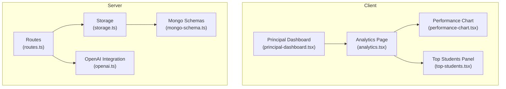

**Diagram sources**
- [routes.ts](file://server/routes.ts#L1-L1104)
- [storage.ts](file://server/storage.ts#L1-L519)
- [mongo-schema.ts](file://shared/mongo-schema.ts#L1-L159)
- [openai.ts](file://server/lib/openai.ts#L1-L217)
- [analytics.tsx](file://client/src/pages/analytics.tsx#L1-L177)
- [performance-chart.tsx](file://client/src/components/dashboard/performance-chart.tsx#L1-L98)
- [top-students.tsx](file://client/src/components/dashboard/top-students.tsx#L1-L74)
- [principal-dashboard.tsx](file://client/src/pages/principal-dashboard.tsx#L168-L193)

**Section sources**
- [routes.ts](file://server/routes.ts#L1-L1104)
- [storage.ts](file://server/storage.ts#L1-L519)
- [openai.ts](file://server/lib/openai.ts#L1-L217)
- [analytics.tsx](file://client/src/pages/analytics.tsx#L1-L177)
- [performance-chart.tsx](file://client/src/components/dashboard/performance-chart.tsx#L1-L98)
- [top-students.tsx](file://client/src/components/dashboard/top-students.tsx#L1-L74)
- [principal-dashboard.tsx](file://client/src/pages/principal-dashboard.tsx#L168-L193)

## Core Components
- Assessment data lifecycle: creation, attempts, answers, and analytics persistence.
- AI-powered insights: average scores, hardest questions, and recommendations.
- Client-side visualizations: test completion rate pie charts, subject performance bar charts, and grade distribution bars.
- Filtering and cohort comparisons: class-based grouping and time-range selection.
- Privacy and anonymization: aggregation at class/school level with no personal identifiers.

**Section sources**
- [schema.ts](file://shared/schema.ts#L1-L142)
- [mongo-schema.ts](file://shared/mongo-schema.ts#L1-L159)
- [openai.ts](file://server/lib/openai.ts#L165-L216)
- [analytics.tsx](file://client/src/pages/analytics.tsx#L22-L177)
- [performance-chart.tsx](file://client/src/components/dashboard/performance-chart.tsx#L15-L98)
- [top-students.tsx](file://client/src/components/dashboard/top-students.tsx#L6-L74)
- [principal-dashboard.tsx](file://client/src/pages/principal-dashboard.tsx#L168-L193)

## Architecture Overview
The system aggregates raw assessment data into derived metrics and presents them through interactive dashboards. The server exposes endpoints for retrieving test attempts and answers, while the client renders visualizations. AI services enrich insights for class-wide performance.

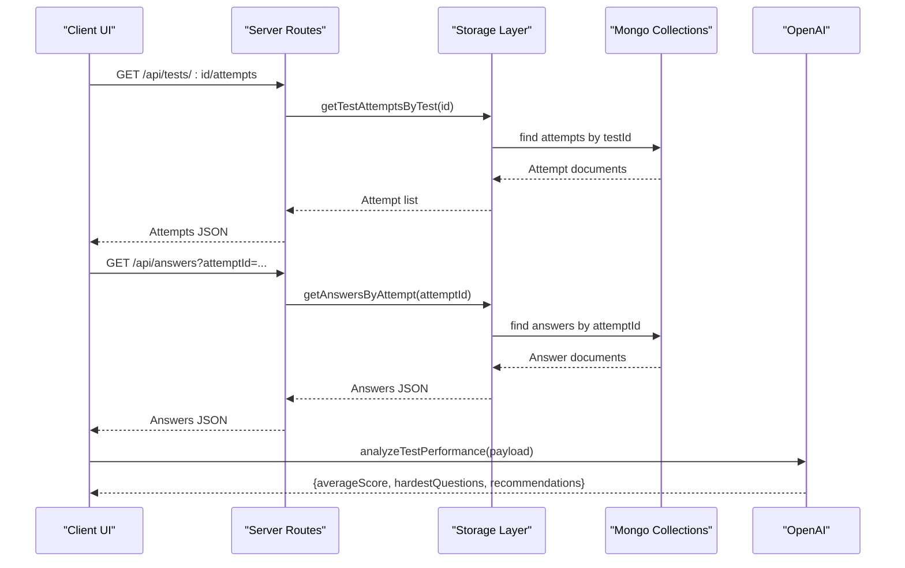

**Diagram sources**
- [routes.ts](file://server/routes.ts#L318-L414)
- [storage.ts](file://server/storage.ts#L213-L262)
- [openai.ts](file://server/lib/openai.ts#L165-L216)

## Detailed Component Analysis

### Test Completion Rate Computation
- Inputs: Attempt statuses per test (e.g., in_progress, completed, evaluated).
- Algorithm:
  - Count attempts grouped by status.
  - Compute percentages: completed, in_progress, not_started.
  - Normalize to 100% for visualization.
- Visualization: Pie chart rendering completion distribution.

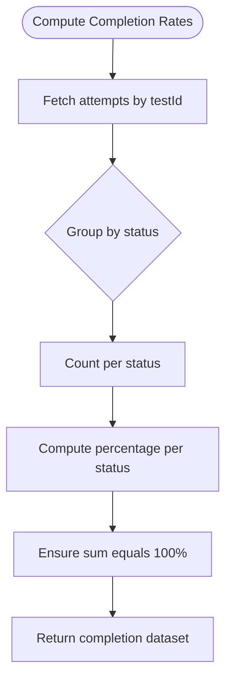

**Diagram sources**
- [routes.ts](file://server/routes.ts#L134-L173)
- [analytics.tsx](file://client/src/pages/analytics.tsx#L26-L30)

**Section sources**
- [routes.ts](file://server/routes.ts#L134-L173)
- [analytics.tsx](file://client/src/pages/analytics.tsx#L22-L101)

### Subject-Wise Performance Averages
- Inputs: Per-attempt scores and associated subjects.
- Algorithm:
  - Aggregate scores by subject for a class.
  - Compute class average per subject.
  - Compare with school average (derived from cross-class aggregation).
- Visualization: Bar chart with classAverage and schoolAverage series.

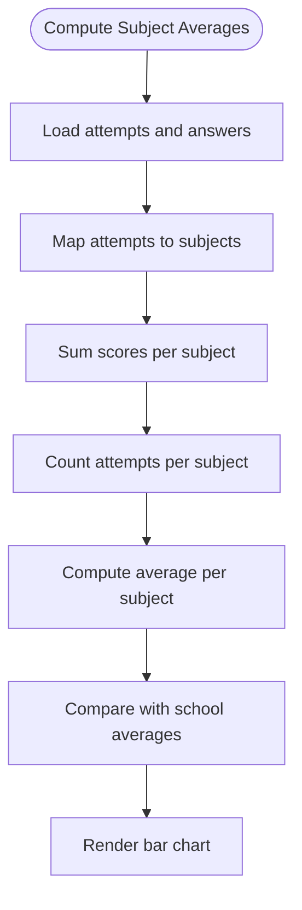

**Diagram sources**
- [performance-chart.tsx](file://client/src/components/dashboard/performance-chart.tsx#L15-L98)

**Section sources**
- [performance-chart.tsx](file://client/src/components/dashboard/performance-chart.tsx#L15-L98)
- [mockData.ts](file://client/src/data/mockData.ts#L31-L37)

### Grade Distributions
- Inputs: Numeric scores across a cohort.
- Algorithm:
  - Define grade bins (e.g., A+ 90–100, A 80–89, B 70–79, C 60–69, below C).
  - Count students per bin.
  - Compute percentages and absolute counts.
- Visualization: Horizontal stacked bars with gradient fills.

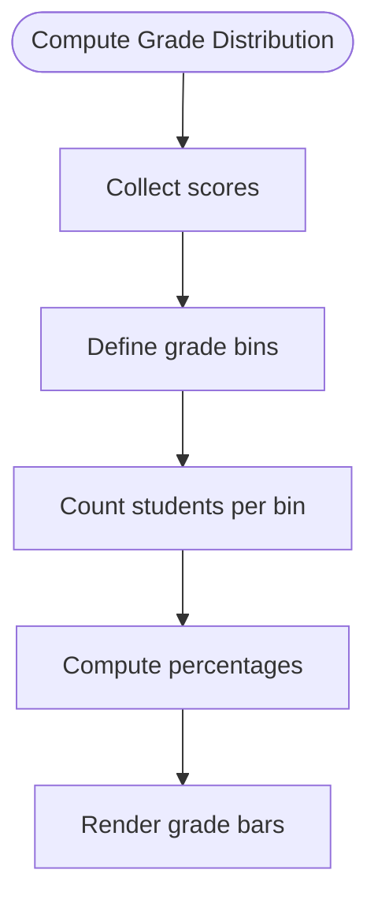

**Diagram sources**
- [principal-dashboard.tsx](file://client/src/pages/principal-dashboard.tsx#L168-L193)

**Section sources**
- [principal-dashboard.tsx](file://client/src/pages/principal-dashboard.tsx#L168-L193)

### Statistical Functions: Averages, Standard Deviations, Trends
- Class averages: Sum of scores divided by number of attempts.
- Standard deviation: Population standard deviation computed from per-attempt scores.
- Trends: Rolling averages over time windows (e.g., weekly/monthly) using time-range filters.

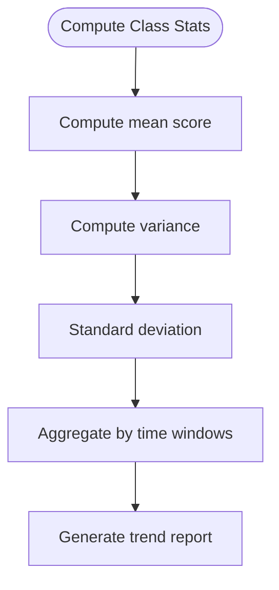

[No sources needed since this diagram shows conceptual workflow, not actual code structure]

**Section sources**
- [openai.ts](file://server/lib/openai.ts#L165-L216)

### Filtering Mechanisms: Cohort-Based Comparisons and Time-Range Analysis
- Cohorts: Class, teacher’s students, or administrative groupings.
- Time range: Filter by test date or attempt timestamps.
- Implementation hooks:
  - Route-level filtering for teacher vs. student roles.
  - Query parameters for status and dates.
  - UI tabs for monthly/yearly periods.

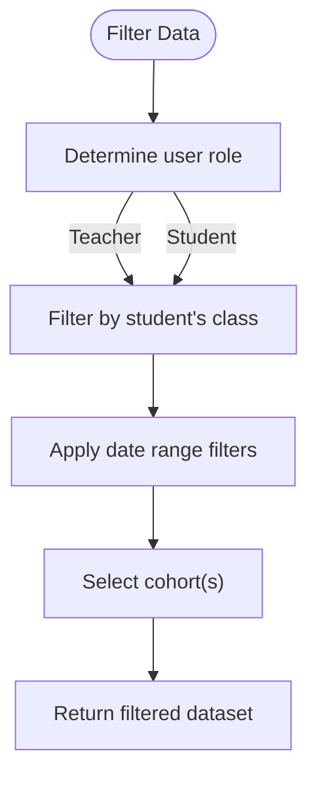

**Diagram sources**
- [routes.ts](file://server/routes.ts#L134-L173)
- [analytics.tsx](file://client/src/pages/analytics.tsx#L23)

**Section sources**
- [routes.ts](file://server/routes.ts#L134-L173)
- [analytics.tsx](file://client/src/pages/analytics.tsx#L22-L24)

### Data Structures for Aggregated Results
- Attempt: testId, studentId, status, score, timestamps.
- Answer: attemptId, questionId, score, AI confidence/feedback.
- Analytics: userId, testId, weakTopics, strongTopics, recommendedResources, insightDate.
- Visualization datasets: PerformanceData[], TopStudentProps[].

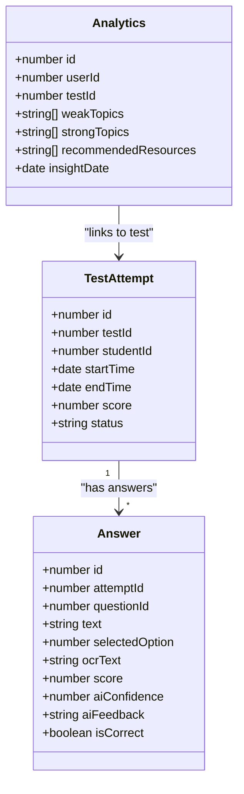

**Diagram sources**
- [schema.ts](file://shared/schema.ts#L39-L88)
- [mongo-schema.ts](file://shared/mongo-schema.ts#L52-L74)
- [mongo-schema.ts](file://shared/mongo-schema.ts#L101-L108)

**Section sources**
- [schema.ts](file://shared/schema.ts#L39-L88)
- [mongo-schema.ts](file://shared/mongo-schema.ts#L52-L74)
- [mongo-schema.ts](file://shared/mongo-schema.ts#L101-L108)

### Caching Strategies for Performance Optimization
- Client-side caching:
  - React Query cache keys for analytics endpoints (e.g., "/api/class-performance", "/api/top-students").
  - Skeleton loaders during initial fetch.
- Server-side caching:
  - In-memory session store for short-lived session data.
  - Consider Redis for frequently accessed aggregated metrics (not implemented).
- Recommendations:
  - Cache computed averages and distributions per cohort/time window.
  - Invalidate caches on data writes (new attempts/answers).

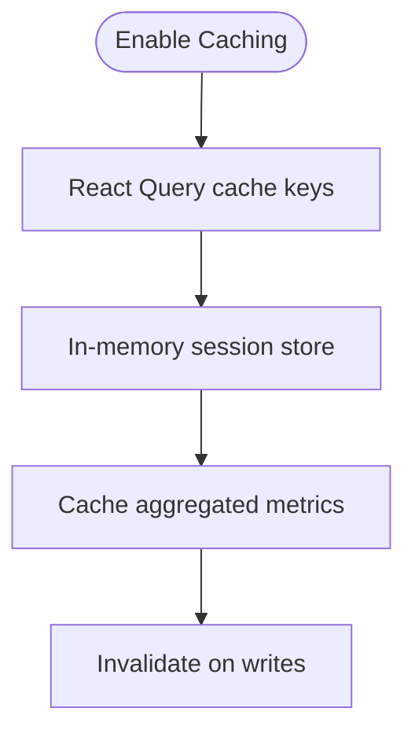

**Diagram sources**
- [performance-chart.tsx](file://client/src/components/dashboard/performance-chart.tsx#L25-L28)
- [top-students.tsx](file://client/src/components/dashboard/top-students.tsx#L15-L18)
- [storage.ts](file://server/storage.ts#L110-L118)

**Section sources**
- [performance-chart.tsx](file://client/src/components/dashboard/performance-chart.tsx#L25-L28)
- [top-students.tsx](file://client/src/components/dashboard/top-students.tsx#L15-L18)
- [storage.ts](file://server/storage.ts#L110-L118)

### Privacy-Preserving Aggregation and Anonymized Reporting
- Aggregation at cohort level: averages, distributions, and trends are computed per class/school, not per individual.
- No personally identifiable information is exposed in reports.
- Access controls:
  - Teachers can view their own class data.
  - Students can view class-level metrics.
  - Administrative dashboards aggregate across schools.

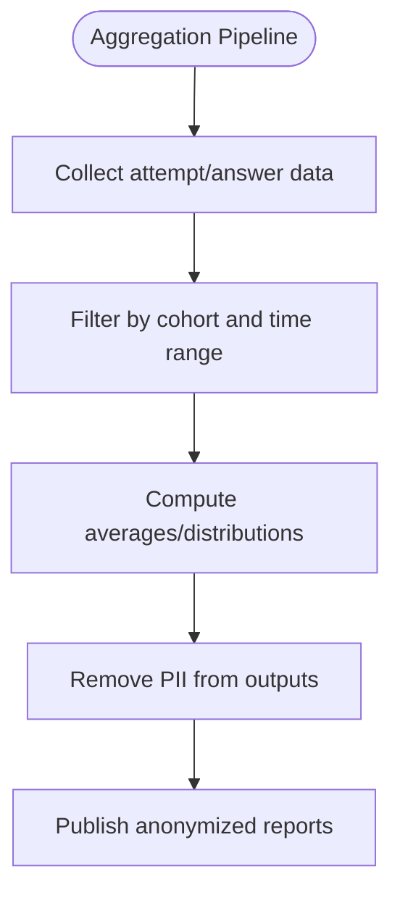

**Diagram sources**
- [routes.ts](file://server/routes.ts#L134-L173)
- [principal-dashboard.tsx](file://client/src/pages/principal-dashboard.tsx#L168-L193)

**Section sources**
- [routes.ts](file://server/routes.ts#L134-L173)
- [principal-dashboard.tsx](file://client/src/pages/principal-dashboard.tsx#L168-L193)

## Dependency Analysis
The analytics system depends on:
- Storage for assessment data retrieval.
- OpenAI for AI insights.
- Client components for visualization.

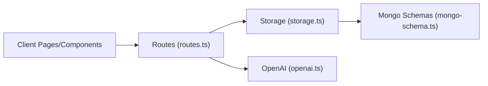

**Diagram sources**
- [routes.ts](file://server/routes.ts#L1-L1104)
- [storage.ts](file://server/storage.ts#L1-L519)
- [openai.ts](file://server/lib/openai.ts#L1-L217)
- [mongo-schema.ts](file://shared/mongo-schema.ts#L1-L159)

**Section sources**
- [routes.ts](file://server/routes.ts#L1-L1104)
- [storage.ts](file://server/storage.ts#L1-L519)
- [openai.ts](file://server/lib/openai.ts#L1-L217)
- [mongo-schema.ts](file://shared/mongo-schema.ts#L1-L159)

## Performance Considerations
- Efficient queries: Use indexed fields (e.g., testId, studentId, dueDate) to minimize scan costs.
- Batch processing: Compute aggregations periodically and cache results.
- Pagination: Limit result sets for large datasets.
- CDN and compression: Serve static assets efficiently.
- Asynchronous AI evaluations: Offload heavy computations to background jobs.

[No sources needed since this section provides general guidance]

## Troubleshooting Guide
- Missing or invalid data:
  - Verify attempt and answer existence before aggregation.
  - Validate schema fields and types.
- AI service failures:
  - Fallback to manual scoring and cached insights.
- Client-side loading:
  - Use skeleton loaders and error boundaries.
- Access control:
  - Ensure role-based filtering prevents unauthorized data exposure.

**Section sources**
- [openai.ts](file://server/lib/openai.ts#L78-L105)
- [performance-chart.tsx](file://client/src/components/dashboard/performance-chart.tsx#L39-L41)
- [routes.ts](file://server/routes.ts#L134-L173)

## Conclusion
The system integrates assessment data collection, AI-driven insights, and robust visualizations to deliver actionable analytics. Cohort-based filtering, time-range analysis, and privacy-preserving aggregation ensure meaningful and secure reporting. With caching and indexing strategies, performance remains efficient as data volumes grow.

[No sources needed since this section summarizes without analyzing specific files]

## Appendices

### API Endpoints Used by Analytics
- GET /api/tests/:id/attempts
- GET /api/answers?attemptId=...
- POST /api/evaluate (for AI grading)
- GET /api/users/me (session info)

**Section sources**
- [routes.ts](file://server/routes.ts#L318-L559)