# Reporting & Export

<cite>
**Referenced Files in This Document**
- [analytics.tsx](file://client/src/pages/analytics.tsx)
- [admin-dashboard.tsx](file://client/src/pages/admin-dashboard.tsx)
- [routes.ts](file://server/routes.ts)
- [storage.ts](file://server/storage.ts)
- [schema.ts](file://shared/schema.ts)
- [upload.ts](file://server/lib/upload.ts)
- [openai.ts](file://server/lib/openai.ts)
- [student-directory.tsx](file://client/src/pages/student-directory.tsx)
- [dashboard.tsx](file://client/src/pages/dashboard.tsx)
- [principal-dashboard.tsx](file://client/src/pages/principal-dashboard.tsx)
</cite>

## Table of Contents
1. [Introduction](#introduction)
2. [Project Structure](#project-structure)
3. [Core Components](#core-components)
4. [Architecture Overview](#architecture-overview)
5. [Detailed Component Analysis](#detailed-component-analysis)
6. [Dependency Analysis](#dependency-analysis)
7. [Performance Considerations](#performance-considerations)
8. [Troubleshooting Guide](#troubleshooting-guide)
9. [Conclusion](#conclusion)
10. [Appendices](#appendices)

## Introduction
This document describes the reporting and export functionality for result analysis within the Personal Learning Pro platform. It covers:
- Report generation capabilities for class performance summaries and individual progress reports
- Export formats supported for sharing analytics data
- Filtering and sorting options for customizing report content and time ranges
- Integration with document generation libraries and styling systems for professional report layouts
- Automation features for scheduled report generation
- Sharing mechanisms for distributing reports to stakeholders
- Access controls and permission systems for report visibility

## Project Structure
The reporting and export features span the client-side analytics dashboards, server-side routes and storage, shared schemas, and supporting libraries for uploads and AI-powered insights.

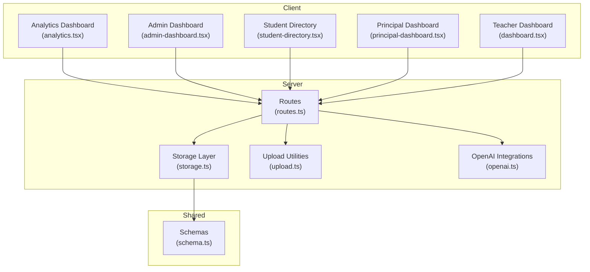

**Diagram sources**
- [analytics.tsx](file://client/src/pages/analytics.tsx#L1-L177)
- [admin-dashboard.tsx](file://client/src/pages/admin-dashboard.tsx#L1-L302)
- [student-directory.tsx](file://client/src/pages/student-directory.tsx#L268-L358)
- [principal-dashboard.tsx](file://client/src/pages/principal-dashboard.tsx#L195-L226)
- [dashboard.tsx](file://client/src/pages/dashboard.tsx#L98-L127)
- [routes.ts](file://server/routes.ts#L1-L800)
- [storage.ts](file://server/storage.ts#L70-L293)
- [upload.ts](file://server/lib/upload.ts#L30-L68)
- [openai.ts](file://server/lib/openai.ts#L107-L163)
- [schema.ts](file://shared/schema.ts#L61-L68)

**Section sources**
- [analytics.tsx](file://client/src/pages/analytics.tsx#L1-L177)
- [admin-dashboard.tsx](file://client/src/pages/admin-dashboard.tsx#L1-L302)
- [routes.ts](file://server/routes.ts#L1-L800)
- [storage.ts](file://server/storage.ts#L70-L293)
- [schema.ts](file://shared/schema.ts#L61-L68)
- [upload.ts](file://server/lib/upload.ts#L30-L68)
- [openai.ts](file://server/lib/openai.ts#L107-L163)
- [student-directory.tsx](file://client/src/pages/student-directory.tsx#L268-L358)
- [dashboard.tsx](file://client/src/pages/dashboard.tsx#L98-L127)
- [principal-dashboard.tsx](file://client/src/pages/principal-dashboard.tsx#L195-L226)

## Core Components
- Analytics dashboards render class performance summaries and top-performing students using charting libraries. These dashboards provide the foundation for reportable insights.
- Server routes expose endpoints for retrieving analytics data and integrating AI insights, enabling backend-driven report generation.
- Storage layer persists analytics records and supports queries by user and test, forming the data backbone for reports.
- Upload utilities support file ingestion and MIME-type validation, enabling export delivery via downloadable artifacts.
- OpenAI integrations power AI-generated insights that can be included in reports.

**Section sources**
- [analytics.tsx](file://client/src/pages/analytics.tsx#L1-L177)
- [routes.ts](file://server/routes.ts#L1-L800)
- [storage.ts](file://server/storage.ts#L264-L280)
- [upload.ts](file://server/lib/upload.ts#L30-L68)
- [openai.ts](file://server/lib/openai.ts#L107-L163)

## Architecture Overview
The reporting pipeline connects client dashboards to server endpoints, storage, and optional export delivery.

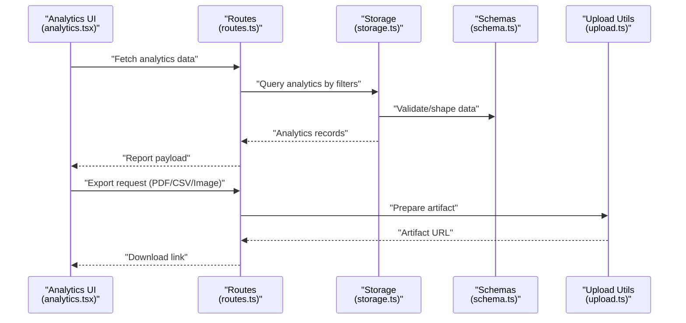

**Diagram sources**
- [analytics.tsx](file://client/src/pages/analytics.tsx#L1-L177)
- [routes.ts](file://server/routes.ts#L1-L800)
- [storage.ts](file://server/storage.ts#L264-L280)
- [schema.ts](file://shared/schema.ts#L61-L68)
- [upload.ts](file://server/lib/upload.ts#L30-L68)

## Detailed Component Analysis

### Analytics Dashboards and Reportable Insights
- Class performance summaries and top students panels provide the primary visualizations for reportable insights.
- Filtering and sorting are present in related dashboards (e.g., student directory) and can be adapted for analytics contexts.

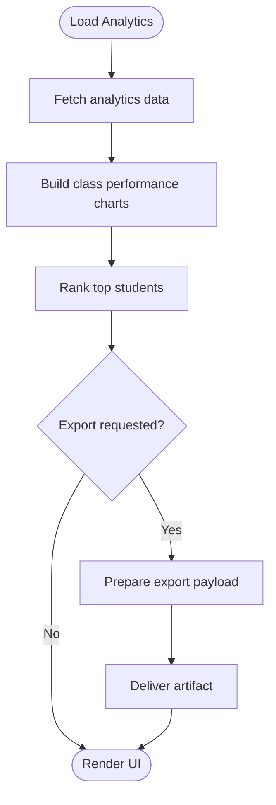

**Diagram sources**
- [analytics.tsx](file://client/src/pages/analytics.tsx#L1-L177)
- [student-directory.tsx](file://client/src/pages/student-directory.tsx#L268-L358)

**Section sources**
- [analytics.tsx](file://client/src/pages/analytics.tsx#L1-L177)
- [student-directory.tsx](file://client/src/pages/student-directory.tsx#L268-L358)

### Server Routes and Access Controls
- Routes define endpoints for user, test, and analytics operations with role-based access checks.
- Access controls ensure that only authorized users can view or generate reports for specific contexts (e.g., teacher-owned tests, student class access).

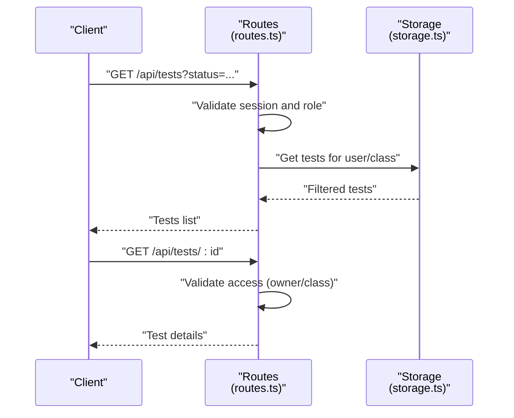

**Diagram sources**
- [routes.ts](file://server/routes.ts#L134-L209)
- [storage.ts](file://server/storage.ts#L282-L293)

**Section sources**
- [routes.ts](file://server/routes.ts#L134-L209)
- [storage.ts](file://server/storage.ts#L282-L293)

### Analytics Data Model and Persistence
- Analytics records capture user-level insights, including weak and strong topics, recommended resources, and timestamps.
- Storage layer supports creation and retrieval of analytics entries by user and test.

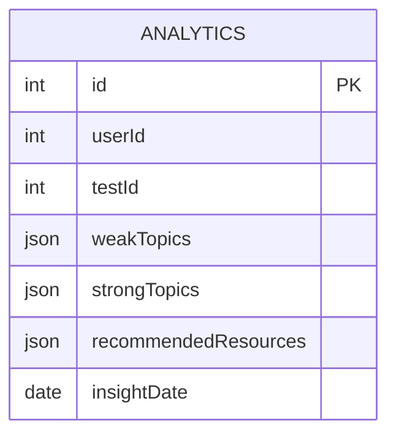

**Diagram sources**
- [schema.ts](file://shared/schema.ts#L61-L68)
- [storage.ts](file://server/storage.ts#L264-L280)

**Section sources**
- [schema.ts](file://shared/schema.ts#L61-L68)
- [storage.ts](file://server/storage.ts#L264-L280)

### Export Formats and Delivery
- Supported export formats include PDF, CSV, and images, aligned with allowed MIME types for uploads.
- Delivery is performed via server-side artifact preparation and download links.

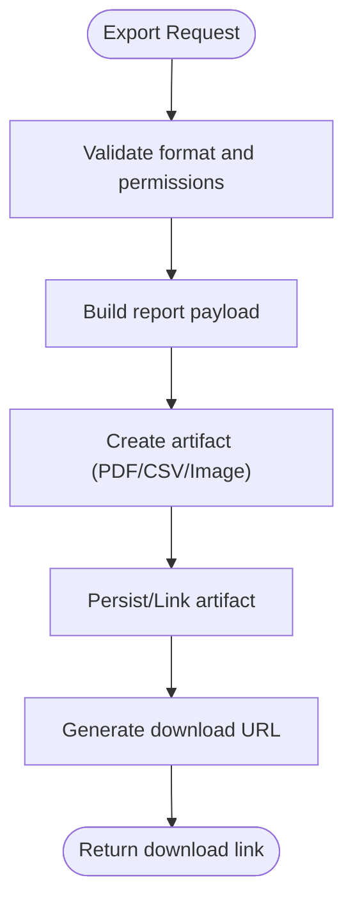

**Diagram sources**
- [upload.ts](file://server/lib/upload.ts#L30-L68)

**Section sources**
- [upload.ts](file://server/lib/upload.ts#L30-L68)

### AI-Enhanced Insights for Reports
- OpenAI integrations can enrich reports with AI-generated insights and recommendations.
- These insights can be embedded into exported documents alongside visual charts.

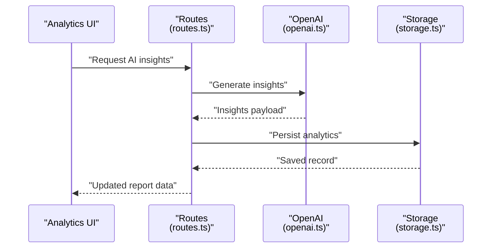

**Diagram sources**
- [openai.ts](file://server/lib/openai.ts#L107-L163)
- [routes.ts](file://server/routes.ts#L1-L800)
- [storage.ts](file://server/storage.ts#L264-L280)

**Section sources**
- [openai.ts](file://server/lib/openai.ts#L107-L163)
- [routes.ts](file://server/routes.ts#L1-L800)
- [storage.ts](file://server/storage.ts#L264-L280)

### Filtering and Sorting Options
- Filtering and sorting are exemplified in the student directory dashboard and can be extended to analytics contexts.
- Typical options include standard/group/state filters and reset controls.

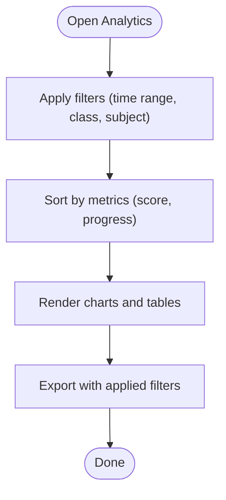

**Diagram sources**
- [student-directory.tsx](file://client/src/pages/student-directory.tsx#L268-L358)

**Section sources**
- [student-directory.tsx](file://client/src/pages/student-directory.tsx#L268-L358)

### Sharing Mechanisms and Automation
- Admin dashboard surfaces recent reports and provides download actions, indicating a sharing mechanism for stakeholders.
- Automation for scheduled report generation can be implemented by invoking analytics endpoints and exporting artifacts on a schedule.

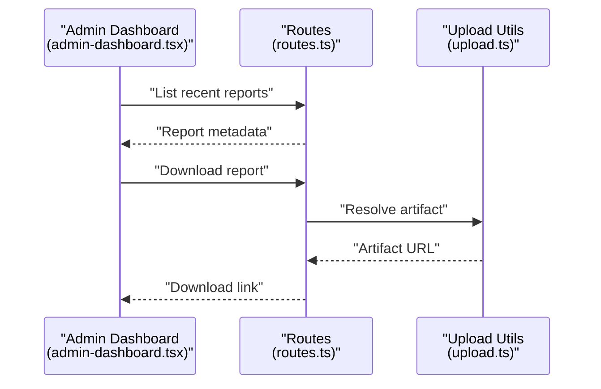

**Diagram sources**
- [admin-dashboard.tsx](file://client/src/pages/admin-dashboard.tsx#L211-L237)
- [routes.ts](file://server/routes.ts#L1-L800)
- [upload.ts](file://server/lib/upload.ts#L30-L68)

**Section sources**
- [admin-dashboard.tsx](file://client/src/pages/admin-dashboard.tsx#L211-L237)
- [routes.ts](file://server/routes.ts#L1-L800)
- [upload.ts](file://server/lib/upload.ts#L30-L68)

### Access Controls and Permission Systems
- Routes enforce role-based access for analytics and report-related operations.
- Teachers can manage their own tests and associated analytics; students can access analytics for their class.
- Workspaces and channels further refine access boundaries.

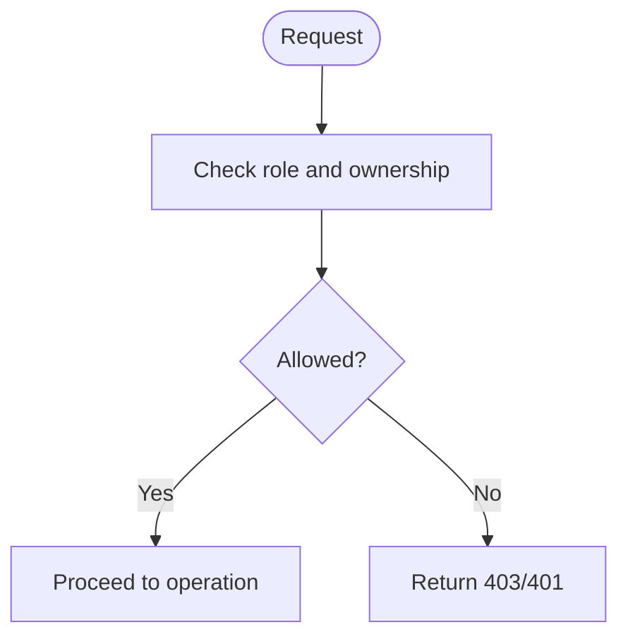

**Diagram sources**
- [routes.ts](file://server/routes.ts#L110-L173)

**Section sources**
- [routes.ts](file://server/routes.ts#L110-L173)

## Dependency Analysis
- Client dashboards depend on charting libraries and UI components to render analytics.
- Server routes depend on storage and schemas for data operations and on upload utilities for export delivery.
- OpenAI integrations augment analytics with AI insights.

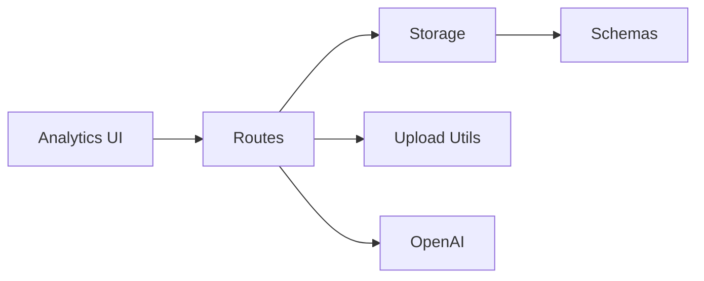

**Diagram sources**
- [analytics.tsx](file://client/src/pages/analytics.tsx#L1-L177)
- [routes.ts](file://server/routes.ts#L1-L800)
- [storage.ts](file://server/storage.ts#L70-L293)
- [upload.ts](file://server/lib/upload.ts#L30-L68)
- [openai.ts](file://server/lib/openai.ts#L107-L163)
- [schema.ts](file://shared/schema.ts#L61-L68)

**Section sources**
- [routes.ts](file://server/routes.ts#L1-L800)
- [storage.ts](file://server/storage.ts#L70-L293)
- [schema.ts](file://shared/schema.ts#L61-L68)
- [upload.ts](file://server/lib/upload.ts#L30-L68)
- [openai.ts](file://server/lib/openai.ts#L107-L163)

## Performance Considerations
- Use efficient filtering and pagination on the server to avoid large payloads.
- Cache frequently accessed analytics datasets to reduce database load.
- Optimize chart rendering by limiting data granularity and leveraging responsive containers.
- Minimize export sizes by compressing artifacts and selecting appropriate image resolutions.

## Troubleshooting Guide
- Authentication failures: Ensure session-based checks pass and roles are correctly set.
- Access denied errors: Verify ownership and class membership for tests and analytics.
- Export failures: Confirm allowed MIME types and artifact generation steps.

**Section sources**
- [routes.ts](file://server/routes.ts#L49-L85)
- [routes.ts](file://server/routes.ts#L194-L203)
- [upload.ts](file://server/lib/upload.ts#L43-L54)

## Conclusion
The platform provides a robust foundation for analytics reporting and export, with role-based access controls, extensible filtering, and integration points for AI-enhanced insights. By leveraging the existing routes, storage, and upload utilities, teams can implement comprehensive report generation, scheduling, and distribution workflows tailored to stakeholders across roles.

## Appendices
- Example export formats: PDF, CSV, Image
- Representative UI components: Analytics dashboard, Admin dashboard, Student directory, Principal dashboard, Teacher dashboard