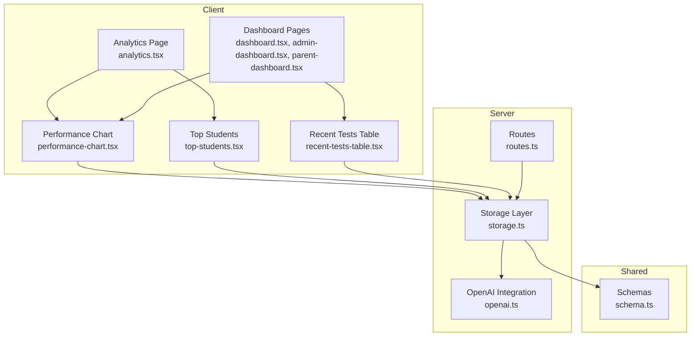
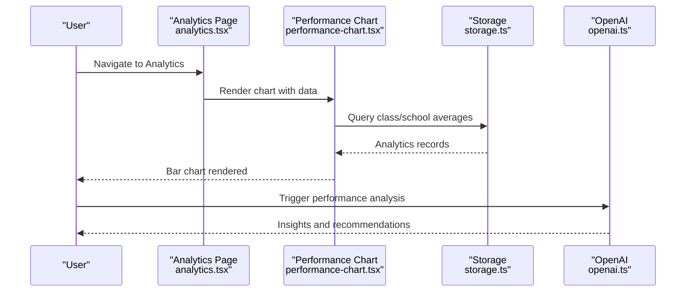
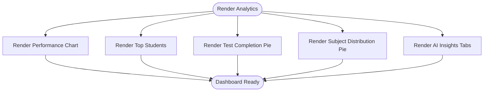
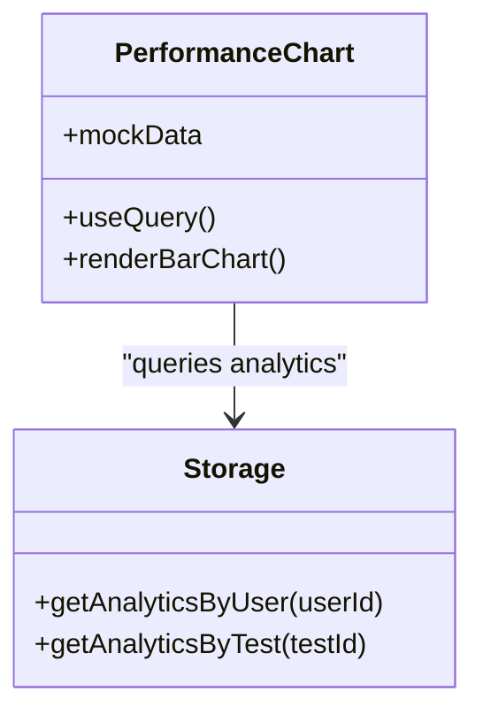
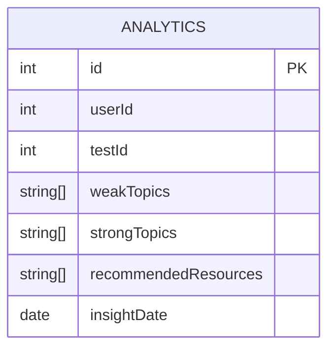
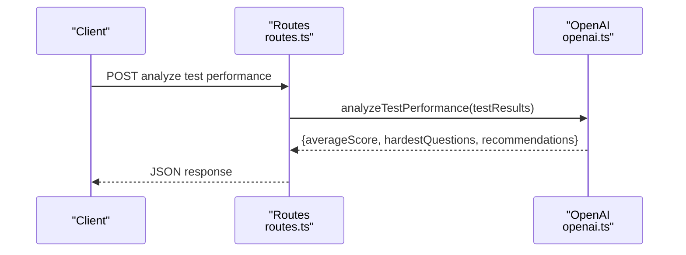
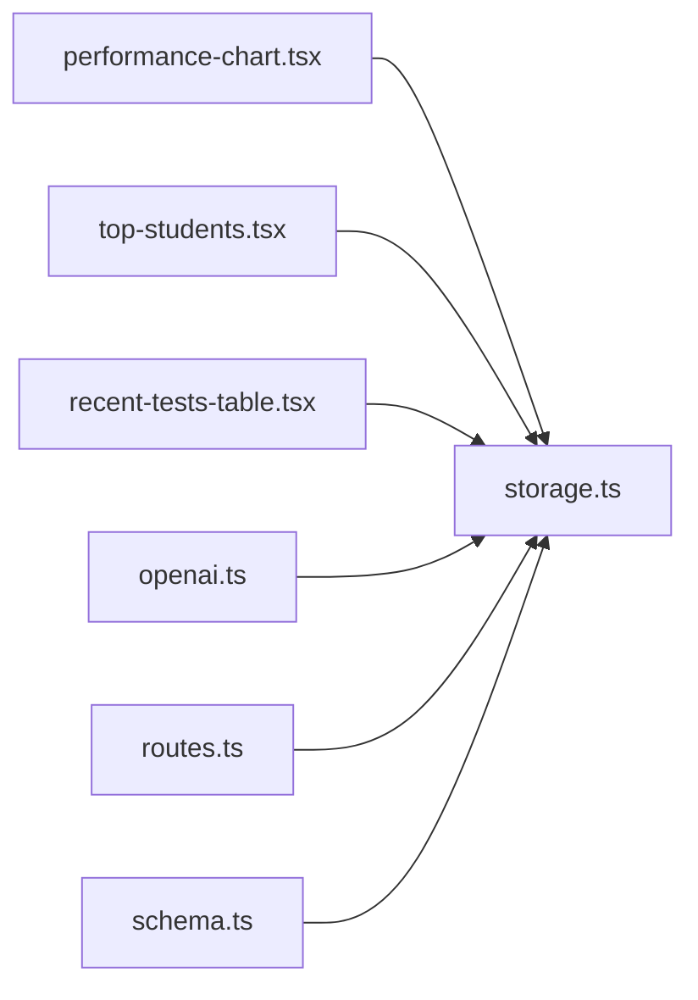

# Result Analysis & Tracking

<cite>
**Referenced Files in This Document**
- [analytics.tsx](file://client/src/pages/analytics.tsx)
- [performance-chart.tsx](file://client/src/components/dashboard/performance-chart.tsx)
- [top-students.tsx](file://client/src/components/dashboard/top-students.tsx)
- [recent-tests-table.tsx](file://client/src/components/dashboard/recent-tests-table.tsx)
- [dashboard.tsx](file://client/src/pages/dashboard.tsx)
- [admin-dashboard.tsx](file://client/src/pages/admin-dashboard.tsx)
- [parent-dashboard.tsx](file://client/src/pages/parent-dashboard.tsx)
- [storage.ts](file://server/storage.ts)
- [openai.ts](file://server/lib/openai.ts)
- [schema.ts](file://shared/schema.ts)
- [routes.ts](file://server/routes.ts)
- [mockData.ts](file://client/src/data/mockData.ts)
- [config.ts](file://client/src/config.ts)
</cite>

## Table of Contents
1. [Introduction](#introduction)
2. [Project Structure](#project-structure)
3. [Core Components](#core-components)
4. [Architecture Overview](#architecture-overview)
5. [Detailed Component Analysis](#detailed-component-analysis)
6. [Dependency Analysis](#dependency-analysis)
7. [Performance Considerations](#performance-considerations)
8. [Troubleshooting Guide](#troubleshooting-guide)
9. [Conclusion](#conclusion)
10. [Appendices](#appendices)

## Introduction
This document describes the result analysis and tracking system in PersonalLearningPro. It covers the analytics dashboard components for individual and class performance metrics, the data aggregation processes for grades and averages, visualization components for charts and trends, result export/report generation capabilities, integration with learning analytics for knowledge gap identification, filtering and sorting options, and privacy/access controls aligned with user roles.

## Project Structure
The analytics and result tracking functionality spans client-side dashboards and server-side storage and AI analysis:
- Client dashboards render performance charts, recent tests, and top students.
- Server-side storage persists analytics records and exposes operations for retrieving analytics by user or test.
- AI integration computes insights from test performance data.
- Shared schemas define the analytics record structure used across client and server.

**Diagram sources**
- [analytics.tsx](file://client/src/pages/analytics.tsx#L1-L177)
- [performance-chart.tsx](file://client/src/components/dashboard/performance-chart.tsx#L1-L98)
- [top-students.tsx](file://client/src/components/dashboard/top-students.tsx#L1-L74)
- [recent-tests-table.tsx](file://client/src/components/dashboard/recent-tests-table.tsx#L1-L234)
- [dashboard.tsx](file://client/src/pages/dashboard.tsx#L197-L219)
- [admin-dashboard.tsx](file://client/src/pages/admin-dashboard.tsx#L1-L302)
- [parent-dashboard.tsx](file://client/src/pages/parent-dashboard.tsx#L139-L180)
- [storage.ts](file://server/storage.ts#L264-L293)
- [openai.ts](file://server/lib/openai.ts#L165-L216)
- [routes.ts](file://server/routes.ts#L1-L29)
- [schema.ts](file://shared/schema.ts#L61-L68)

**Section sources**
- [analytics.tsx](file://client/src/pages/analytics.tsx#L1-L177)
- [performance-chart.tsx](file://client/src/components/dashboard/performance-chart.tsx#L1-L98)
- [top-students.tsx](file://client/src/components/dashboard/top-students.tsx#L1-L74)
- [recent-tests-table.tsx](file://client/src/components/dashboard/recent-tests-table.tsx#L1-L234)
- [dashboard.tsx](file://client/src/pages/dashboard.tsx#L197-L219)
- [admin-dashboard.tsx](file://client/src/pages/admin-dashboard.tsx#L161-L236)
- [parent-dashboard.tsx](file://client/src/pages/parent-dashboard.tsx#L150-L180)
- [storage.ts](file://server/storage.ts#L264-L293)
- [openai.ts](file://server/lib/openai.ts#L165-L216)
- [schema.ts](file://shared/schema.ts#L61-L68)
- [routes.ts](file://server/routes.ts#L1-L29)

## Core Components
- Analytics dashboard page renders class performance by subject, top students, completion rates, subject distribution, and AI-generated insights.
- Performance chart displays class vs school averages per subject using bar charts.
- Top students panel lists high-achieving students with scores.
- Recent tests table shows test status, completion rate, and average score where available.
- Storage layer supports creating and retrieving analytics records by user or test.
- OpenAI integration analyzes test performance to compute averages, identify hard questions, and generate recommendations.
- Shared schema defines the analytics record shape.

**Section sources**
- [analytics.tsx](file://client/src/pages/analytics.tsx#L15-L177)
- [performance-chart.tsx](file://client/src/components/dashboard/performance-chart.tsx#L15-L98)
- [top-students.tsx](file://client/src/components/dashboard/top-students.tsx#L6-L74)
- [recent-tests-table.tsx](file://client/src/components/dashboard/recent-tests-table.tsx#L22-L234)
- [storage.ts](file://server/storage.ts#L264-L293)
- [openai.ts](file://server/lib/openai.ts#L165-L216)
- [schema.ts](file://shared/schema.ts#L61-L68)

## Architecture Overview
The analytics pipeline integrates client dashboards, server storage, and AI insights:
- Client dashboards fetch data via React Query and render charts and tables.
- Server routes expose endpoints for user and test operations; analytics persistence is handled by storage.
- AI analysis consumes test results to produce insights and recommendations.

**Diagram sources**
- [analytics.tsx](file://client/src/pages/analytics.tsx#L1-L177)
- [performance-chart.tsx](file://client/src/components/dashboard/performance-chart.tsx#L25-L43)
- [storage.ts](file://server/storage.ts#L264-L293)
- [openai.ts](file://server/lib/openai.ts#L165-L216)

## Detailed Component Analysis

### Analytics Dashboard Page
- Purpose: Aggregates multiple analytics widgets into a single view.
- Features:
  - Class performance by subject via a bar chart component.
  - Top students leaderboard.
  - Test completion rate pie chart.
  - Subject distribution pie chart.
  - AI-generated insights with tabs for class and individual views.
- Data sources: Uses mock data for visualizations; connects to backend APIs via query keys.

**Diagram sources**
- [analytics.tsx](file://client/src/pages/analytics.tsx#L40-L177)

**Section sources**
- [analytics.tsx](file://client/src/pages/analytics.tsx#L15-L177)

### Performance Chart Component
- Purpose: Visualizes class average versus school average per subject.
- Data model: Accepts an array of objects with subject, classAverage, and schoolAverage.
- Behavior:
  - Disabled by default until backend endpoint is implemented; uses mock data.
  - Applies theme-aware styling and tooltips.
- Integration: Connects to a query key for class performance data.

**Diagram sources**
- [performance-chart.tsx](file://client/src/components/dashboard/performance-chart.tsx#L15-L98)
- [storage.ts](file://server/storage.ts#L264-L293)

**Section sources**
- [performance-chart.tsx](file://client/src/components/dashboard/performance-chart.tsx#L15-L98)
- [storage.ts](file://server/storage.ts#L264-L293)

### Top Students Component
- Purpose: Displays top-performing students with avatar, name, class, and score.
- Behavior:
  - Disabled by default until backend endpoint is implemented; uses mock data.
  - Skeleton loading while data is fetching.

**Section sources**
- [top-students.tsx](file://client/src/components/dashboard/top-students.tsx#L6-L74)

### Recent Tests Table
- Purpose: Lists recent tests with status, completion rate, and average score.
- Features:
  - Status badges for completed, in-progress, scheduled, canceled.
  - Progress bars for completion rate.
  - Action links to view test details.
- Behavior:
  - Fetches test data via query key.
  - Shows empty state with a link to create a test.

**Section sources**
- [recent-tests-table.tsx](file://client/src/components/dashboard/recent-tests-table.tsx#L22-L234)

### Dashboard Pages Integration
- Dashboard pages integrate performance charts and recent tests tables for quick insights.
- Admin and parent dashboards include additional analytics visuals (e.g., academic progression line chart).

**Section sources**
- [dashboard.tsx](file://client/src/pages/dashboard.tsx#L197-L219)
- [admin-dashboard.tsx](file://client/src/pages/admin-dashboard.tsx#L161-L236)
- [parent-dashboard.tsx](file://client/src/pages/parent-dashboard.tsx#L150-L180)

### Storage and Analytics Records
- Storage operations:
  - Create analytics record.
  - Retrieve analytics by user or test.
- Analytics record fields:
  - userId, testId, weakTopics, strongTopics, recommendedResources, insightDate.

**Diagram sources**
- [storage.ts](file://server/storage.ts#L264-L293)
- [schema.ts](file://shared/schema.ts#L61-L68)

**Section sources**
- [storage.ts](file://server/storage.ts#L264-L293)
- [schema.ts](file://shared/schema.ts#L61-L68)

### AI-Generated Learning Insights
- Functionality: analyzeTestPerformance computes average score, identifies hardest questions, and generates recommendations.
- Inputs: Array of student results with studentId, score, and answers.
- Output: averageScore, hardestQuestions, recommendations.
- Fallback: Computes average score if AI parsing fails.

**Diagram sources**
- [routes.ts](file://server/routes.ts#L1-L29)
- [openai.ts](file://server/lib/openai.ts#L165-L216)

**Section sources**
- [openai.ts](file://server/lib/openai.ts#L165-L216)
- [routes.ts](file://server/routes.ts#L1-L29)

### Data Aggregation Processes
- Class vs School Averages:
  - Aggregated per subject from analytics records.
  - Visualized using bar charts.
- Test Completion and Subject Distribution:
  - Derived from test and analytics datasets.
  - Visualized using pie charts.
- Average Scores:
  - Computed either by AI analysis or fallback logic.

**Section sources**
- [performance-chart.tsx](file://client/src/components/dashboard/performance-chart.tsx#L30-L43)
- [analytics.tsx](file://client/src/pages/analytics.tsx#L25-L38)
- [openai.ts](file://server/lib/openai.ts#L165-L216)

### Visualization Components
- Bar charts for class vs school averages.
- Pie charts for completion rates and subject distributions.
- Line charts for academic progression (parent dashboard).
- Tabbed UI for class vs individual insights.

**Section sources**
- [analytics.tsx](file://client/src/pages/analytics.tsx#L71-L133)
- [parent-dashboard.tsx](file://client/src/pages/parent-dashboard.tsx#L162-L180)

### Filtering and Sorting Options
- Filtering:
  - Dropdown menus for grouping and state filters in student directory.
  - Cohort-based comparisons can be achieved by selecting specific classes or groups.
- Sorting:
  - Sorting options for student lists and tables are available in dashboards.
- Time-series analysis:
  - Academic progression line chart enables trend analysis over time.

**Section sources**
- [analytics.tsx](file://client/src/pages/analytics.tsx#L141-L174)
- [parent-dashboard.tsx](file://client/src/pages/parent-dashboard.tsx#L150-L180)
- [mockData.ts](file://client/src/data/mockData.ts#L191-L231)
- [config.ts](file://client/src/config.ts#L1-L7)

### Result Export, Report Generation, and Sharing
- Admin dashboard includes report generation cards for academic performance, attendance, exam results, and calendar.
- Download actions for recent reports are exposed in the admin UI.
- Sharing capabilities are not implemented in the current codebase; future enhancements can leverage these report endpoints.

**Section sources**
- [admin-dashboard.tsx](file://client/src/pages/admin-dashboard.tsx#L161-L236)

### Privacy and Access Controls
- Role-specific data configuration:
  - Defines role-specific attributes such as classId, subjects, institutionId, studentId.
- Access patterns:
  - Dashboards and analytics are role-aware; UI surfaces differ by role.
  - Storage operations support retrieving analytics by user or test, enabling role-based filtering.

**Section sources**
- [config.ts](file://client/src/config.ts#L1-L7)
- [storage.ts](file://server/storage.ts#L272-L279)

## Dependency Analysis
- Client dashboards depend on:
  - React Query for data fetching.
  - Recharts for visualization.
  - Theme context for dark/light mode styling.
- Server depends on:
  - Storage abstraction for analytics persistence.
  - OpenAI integration for insights.
  - Routes for exposing endpoints.

**Diagram sources**
- [performance-chart.tsx](file://client/src/components/dashboard/performance-chart.tsx#L1-L14)
- [top-students.tsx](file://client/src/components/dashboard/top-students.tsx#L1-L4)
- [recent-tests-table.tsx](file://client/src/components/dashboard/recent-tests-table.tsx#L1-L20)
- [storage.ts](file://server/storage.ts#L264-L293)
- [openai.ts](file://server/lib/openai.ts#L165-L216)
- [routes.ts](file://server/routes.ts#L1-L29)
- [schema.ts](file://shared/schema.ts#L61-L68)

**Section sources**
- [performance-chart.tsx](file://client/src/components/dashboard/performance-chart.tsx#L1-L14)
- [top-students.tsx](file://client/src/components/dashboard/top-students.tsx#L1-L4)
- [recent-tests-table.tsx](file://client/src/components/dashboard/recent-tests-table.tsx#L1-L20)
- [storage.ts](file://server/storage.ts#L264-L293)
- [openai.ts](file://server/lib/openai.ts#L165-L216)
- [routes.ts](file://server/routes.ts#L1-L29)
- [schema.ts](file://shared/schema.ts#L61-L68)

## Performance Considerations
- Client-side:
  - Use skeletons during data fetches to maintain responsiveness.
  - Defer chart rendering until data is available to avoid unnecessary computations.
- Server-side:
  - Persist analytics records to reduce repeated computation.
  - Batch queries for analytics by user or test to minimize database round-trips.

[No sources needed since this section provides general guidance]

## Troubleshooting Guide
- Charts not rendering:
  - Verify query keys and ensure backend endpoints are implemented.
  - Confirm theme context is applied for chart colors.
- Missing analytics data:
  - Check storage operations for analytics retrieval by user or test.
  - Ensure analytics records are created after assessments.
- AI analysis failures:
  - Validate input payload format for analyzeTestPerformance.
  - Inspect fallback logic for average score calculation.

**Section sources**
- [performance-chart.tsx](file://client/src/components/dashboard/performance-chart.tsx#L25-L43)
- [storage.ts](file://server/storage.ts#L264-L293)
- [openai.ts](file://server/lib/openai.ts#L165-L216)

## Conclusion
PersonalLearningPro’s result analysis and tracking system combines client-side dashboards with server-side analytics storage and AI insights. While several endpoints are currently disabled for demonstration, the architecture supports scalable aggregation, visualization, and reporting. Future enhancements can focus on implementing backend endpoints, expanding filtering/sorting, and adding export/share capabilities.

[No sources needed since this section summarizes without analyzing specific files]

## Appendices
- Example analytics record fields:
  - userId, testId, weakTopics, strongTopics, recommendedResources, insightDate.

**Section sources**
- [schema.ts](file://shared/schema.ts#L61-L68)