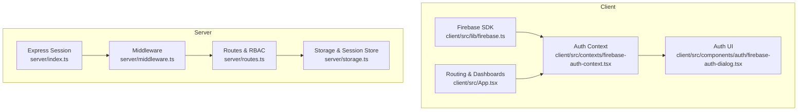
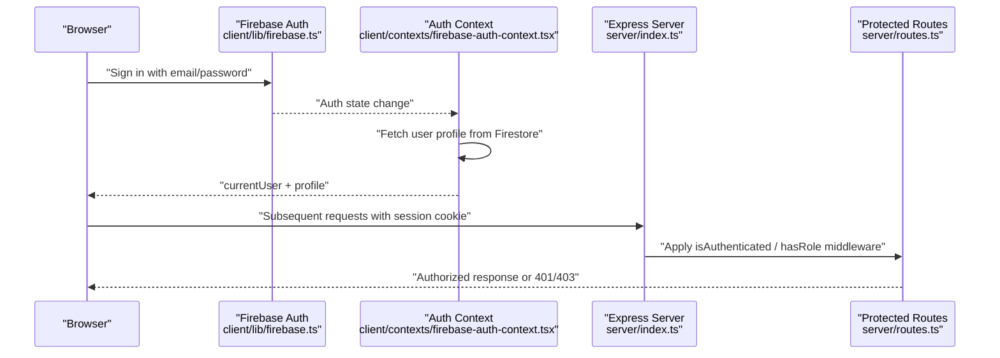
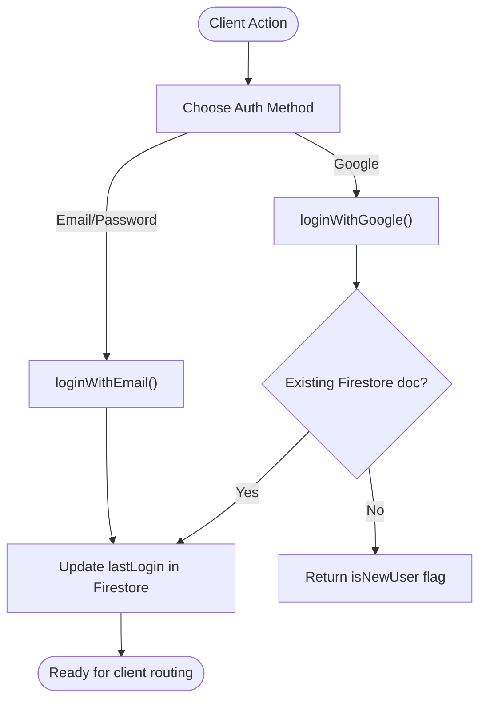
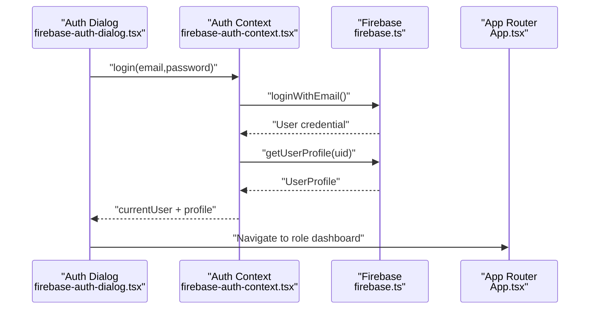
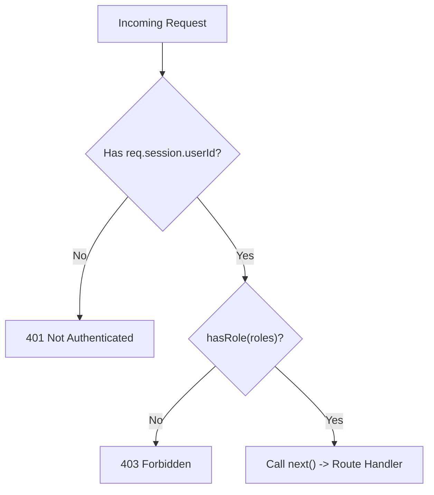
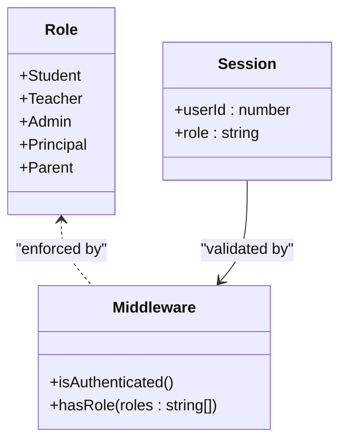
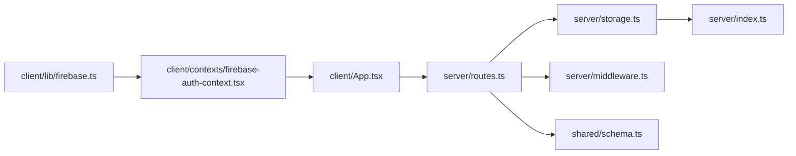

# Authentication & Authorization

<cite>
**Referenced Files in This Document**
- [firebase.ts](file://client/src/lib/firebase.ts)
- [firebase-auth-context.tsx](file://client/src/contexts/firebase-auth-context.tsx)
- [firebase-auth-dialog.tsx](file://client/src/components/auth/firebase-auth-dialog.tsx)
- [LoginPage.tsx](file://client/src/pages/LoginPage.tsx)
- [register.tsx](file://client/src/pages/register.tsx)
- [App.tsx](file://client/src/App.tsx)
- [index.ts](file://server/index.ts)
- [middleware.ts](file://server/middleware.ts)
- [routes.ts](file://server/routes.ts)
- [storage.ts](file://server/storage.ts)
- [express-session.d.ts](file://server/types/express-session.d.ts)
- [schema.ts](file://shared/schema.ts)
- [chat.ts](file://client/src/types/chat.ts)
</cite>

## Table of Contents
1. [Introduction](#introduction)
2. [Project Structure](#project-structure)
3. [Core Components](#core-components)
4. [Architecture Overview](#architecture-overview)
5. [Detailed Component Analysis](#detailed-component-analysis)
6. [Dependency Analysis](#dependency-analysis)
7. [Performance Considerations](#performance-considerations)
8. [Troubleshooting Guide](#troubleshooting-guide)
9. [Conclusion](#conclusion)

## Introduction
This document explains the authentication and authorization system for PersonalLearningPro. The platform integrates Firebase Authentication for user identity and session lifecycle, while maintaining a custom session store on the server for role-based access control (RBAC). It covers:
- Firebase-based user registration and login flows
- Role-based access control with five roles (Student, Teacher, Admin, Principal, Parent)
- Session handling and middleware enforcement
- Security considerations and best practices
- Authorization patterns and UI routing per role

## Project Structure
The authentication system spans the client and server:
- Client-side Firebase integration and UI dialogs
- Server-side session management and RBAC middleware
- Shared schemas for validation and data contracts

**Diagram sources**
- [firebase.ts](file://client/src/lib/firebase.ts#L1-L212)
- [firebase-auth-context.tsx](file://client/src/contexts/firebase-auth-context.tsx#L1-L267)
- [firebase-auth-dialog.tsx](file://client/src/components/auth/firebase-auth-dialog.tsx#L1-L500)
- [App.tsx](file://client/src/App.tsx#L1-L165)
- [index.ts](file://server/index.ts#L1-L114)
- [middleware.ts](file://server/middleware.ts#L1-L18)
- [routes.ts](file://server/routes.ts#L1-L800)
- [storage.ts](file://server/storage.ts#L1-L519)

**Section sources**
- [firebase.ts](file://client/src/lib/firebase.ts#L1-L212)
- [firebase-auth-context.tsx](file://client/src/contexts/firebase-auth-context.tsx#L1-L267)
- [firebase-auth-dialog.tsx](file://client/src/components/auth/firebase-auth-dialog.tsx#L1-L500)
- [App.tsx](file://client/src/App.tsx#L1-L165)
- [index.ts](file://server/index.ts#L1-L114)
- [middleware.ts](file://server/middleware.ts#L1-L18)
- [routes.ts](file://server/routes.ts#L1-L800)
- [storage.ts](file://server/storage.ts#L1-L519)

## Core Components
- Firebase Authentication client library and user profile model
- React context for centralized auth state and actions
- Authentication dialog supporting email/password and Google OAuth
- Server-side session middleware and RBAC enforcement
- Route-level authorization guards and protected endpoints
- Shared validation schemas for user and resource creation

**Section sources**
- [firebase.ts](file://client/src/lib/firebase.ts#L47-L63)
- [firebase-auth-context.tsx](file://client/src/contexts/firebase-auth-context.tsx#L18-L34)
- [firebase-auth-dialog.tsx](file://client/src/components/auth/firebase-auth-dialog.tsx#L39-L233)
- [middleware.ts](file://server/middleware.ts#L3-L17)
- [routes.ts](file://server/routes.ts#L110-L132)
- [schema.ts](file://shared/schema.ts#L4-L13)

## Architecture Overview
The system combines Firebase Authentication with a custom server session:
- Firebase manages identity and emits auth state changes
- The client context hydrates user profiles from Firestore
- The server sets and validates session cookies for RBAC
- Middleware enforces authenticated and role-based access
- Routes implement fine-grained authorization checks

**Diagram sources**
- [firebase.ts](file://client/src/lib/firebase.ts#L66-L78)
- [firebase-auth-context.tsx](file://client/src/contexts/firebase-auth-context.tsx#L43-L71)
- [index.ts](file://server/index.ts#L35-L44)
- [routes.ts](file://server/routes.ts#L49-L76)

## Detailed Component Analysis

### Firebase Authentication Client
- Provides typed user roles and profile shape
- Implements login, register, Google sign-in, logout, and password reset
- Updates Firestore user documents and timestamps

**Diagram sources**
- [firebase.ts](file://client/src/lib/firebase.ts#L66-L150)

**Section sources**
- [firebase.ts](file://client/src/lib/firebase.ts#L47-L63)
- [firebase.ts](file://client/src/lib/firebase.ts#L66-L150)
- [firebase.ts](file://client/src/lib/firebase.ts#L179-L197)

### Authentication Context and UI
- Centralizes auth actions and exposes loading state
- Handles Google OAuth first-time user flow with role selection
- Provides toast feedback and error handling

**Diagram sources**
- [firebase-auth-dialog.tsx](file://client/src/components/auth/firebase-auth-dialog.tsx#L98-L118)
- [firebase-auth-context.tsx](file://client/src/contexts/firebase-auth-context.tsx#L73-L95)
- [firebase.ts](file://client/src/lib/firebase.ts#L199-L212)
- [App.tsx](file://client/src/App.tsx#L113-L124)

**Section sources**
- [firebase-auth-context.tsx](file://client/src/contexts/firebase-auth-context.tsx#L38-L267)
- [firebase-auth-dialog.tsx](file://client/src/components/auth/firebase-auth-dialog.tsx#L39-L233)
- [App.tsx](file://client/src/App.tsx#L93-L150)

### Server Session and RBAC Middleware
- Express session configured with a memory store and secure cookie
- Middleware enforces authenticated access and role checks
- Routes embed role-based authorization logic

**Diagram sources**
- [index.ts](file://server/index.ts#L35-L44)
- [middleware.ts](file://server/middleware.ts#L3-L17)
- [routes.ts](file://server/routes.ts#L110-L115)

**Section sources**
- [index.ts](file://server/index.ts#L30-L44)
- [middleware.ts](file://server/middleware.ts#L3-L17)
- [routes.ts](file://server/routes.ts#L49-L76)
- [routes.ts](file://server/routes.ts#L110-L132)

### Role-Based Access Control (RBAC)
- Roles: Student, Teacher, Admin, Principal, Parent
- Session carries role for enforcement
- Route-level checks restrict endpoints to permitted roles

**Diagram sources**
- [firebase.ts](file://client/src/lib/firebase.ts#L48)
- [express-session.d.ts](file://server/types/express-session.d.ts#L4-L9)
- [middleware.ts](file://server/middleware.ts#L10-L17)

**Section sources**
- [firebase.ts](file://client/src/lib/firebase.ts#L48)
- [express-session.d.ts](file://server/types/express-session.d.ts#L4-L9)
- [routes.ts](file://server/routes.ts#L110-L132)

### Protected Routes and Authorization Patterns
- Authentication: require session presence
- Role-based: restrict endpoints to specific roles
- Ownership: ensure users act on their own resources
- Class scoping: limit access to class-associated data

Examples:
- Tests creation: Teachers only
- Test attempts: Students only
- Answers submission: Students only
- Channel/message access: membership or ownership checks

**Section sources**
- [routes.ts](file://server/routes.ts#L110-L132)
- [routes.ts](file://server/routes.ts#L319-L370)
- [routes.ts](file://server/routes.ts#L417-L463)
- [routes.ts](file://server/routes.ts#L722-L777)

### JWT Token Structure and Security Notes
- The server does not issue JWT tokens; session cookies are used instead
- Session cookie includes userId, role, and other attributes
- Cookie security is configured based on environment (secure flag)

**Section sources**
- [index.ts](file://server/index.ts#L35-L44)
- [express-session.d.ts](file://server/types/express-session.d.ts#L4-L9)

### Password Policies and Account Management
- Client-side validation enforces minimum length for email/password
- Firebase handles password reset flows
- Account management features include profile updates and role-specific fields

**Section sources**
- [LoginPage.tsx](file://client/src/pages/LoginPage.tsx#L20-L38)
- [register.tsx](file://client/src/pages/register.tsx#L36-L46)
- [firebase.ts](file://client/src/lib/firebase.ts#L189-L197)

## Dependency Analysis
- Client depends on Firebase SDK and Firestore for identity and profile persistence
- Server depends on Express session and a storage abstraction for user data
- Shared schemas unify validation across client and server boundaries

**Diagram sources**
- [firebase.ts](file://client/src/lib/firebase.ts#L1-L212)
- [firebase-auth-context.tsx](file://client/src/contexts/firebase-auth-context.tsx#L1-L267)
- [App.tsx](file://client/src/App.tsx#L1-L165)
- [routes.ts](file://server/routes.ts#L1-L800)
- [storage.ts](file://server/storage.ts#L1-L519)
- [index.ts](file://server/index.ts#L1-L114)
- [middleware.ts](file://server/middleware.ts#L1-L18)
- [schema.ts](file://shared/schema.ts#L1-L142)

**Section sources**
- [routes.ts](file://server/routes.ts#L1-L800)
- [storage.ts](file://server/storage.ts#L1-L519)
- [schema.ts](file://shared/schema.ts#L1-L142)

## Performance Considerations
- Client auth state hydration uses a race between profile fetch and a timeout to avoid long hangs
- Firestore reads are minimized by caching user profile in context
- Server session store uses memory store; consider scaling to Redis in production

**Section sources**
- [firebase-auth-context.tsx](file://client/src/contexts/firebase-auth-context.tsx#L53-L59)
- [storage.ts](file://server/storage.ts#L114-L118)

## Troubleshooting Guide
Common issues and resolutions:
- Firebase not configured: client disables auth features and logs a warning
- Authentication errors: client shows user-friendly toasts and rethrows for upstream handling
- Session not set: server routes return 401 for missing session
- Role mismatch: server routes return 403 for unauthorized roles
- CORS/session cookie problems: verify cookie settings and origin configuration

**Section sources**
- [firebase.ts](file://client/src/lib/firebase.ts#L27-L37)
- [firebase-auth-context.tsx](file://client/src/contexts/firebase-auth-context.tsx#L73-L95)
- [routes.ts](file://server/routes.ts#L88-L107)
- [middleware.ts](file://server/middleware.ts#L3-L8)
- [index.ts](file://server/index.ts#L35-L44)

## Conclusion
PersonalLearningPro’s authentication and authorization combine Firebase Authentication for identity with server-managed sessions and RBAC for access control. The system provides:
- Secure, role-aware routing
- Clear middleware and route-level guards
- Extensible role model and profile management
- Practical UI flows for login, registration, and Google OAuth