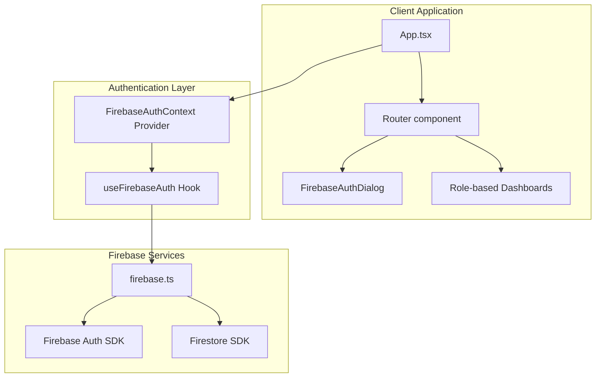
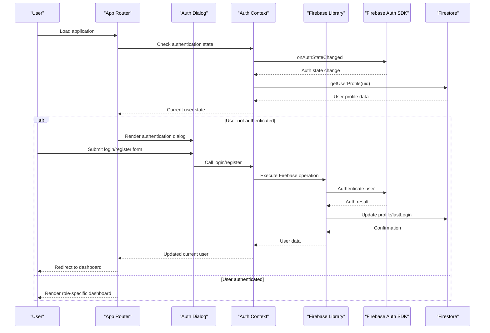
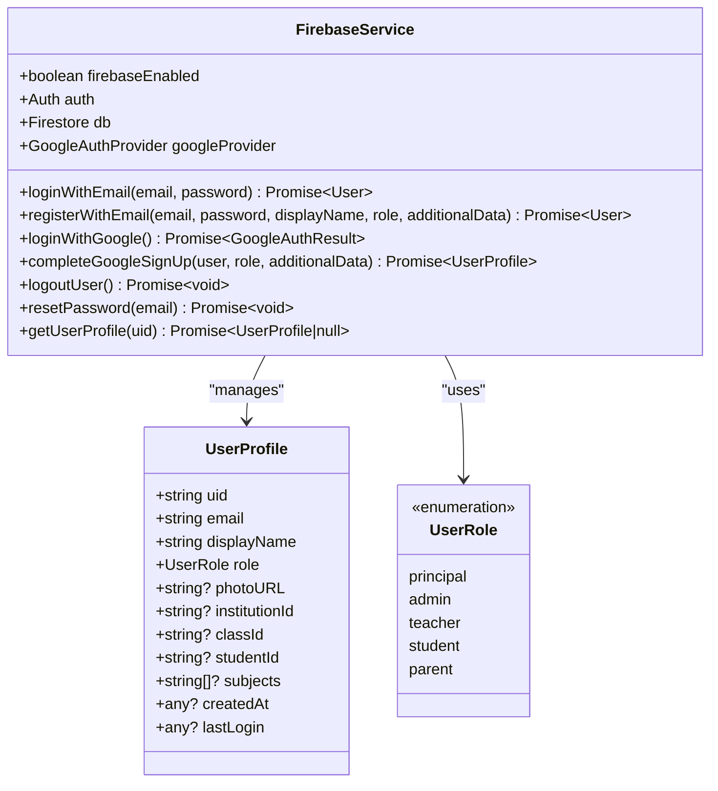
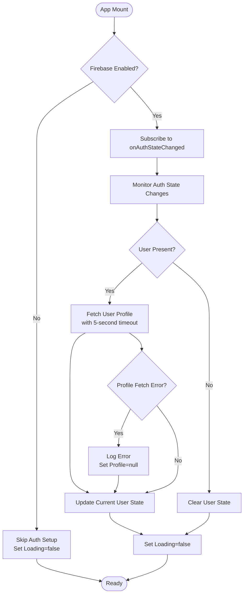
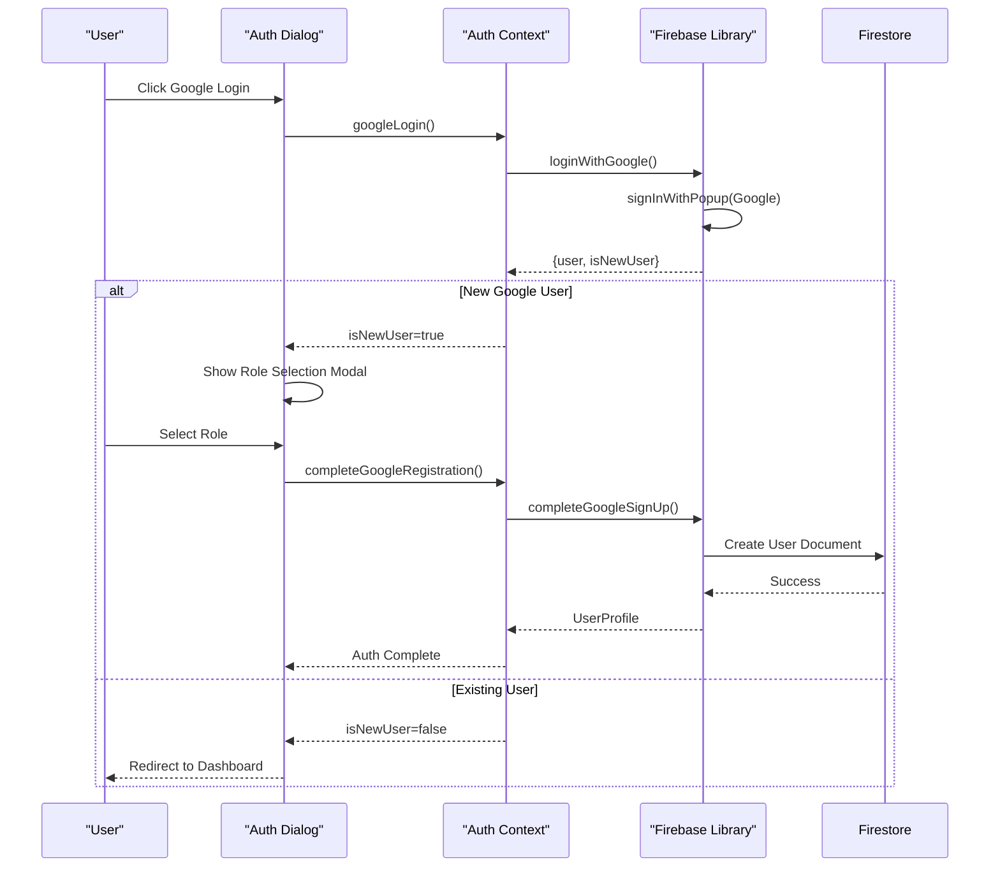
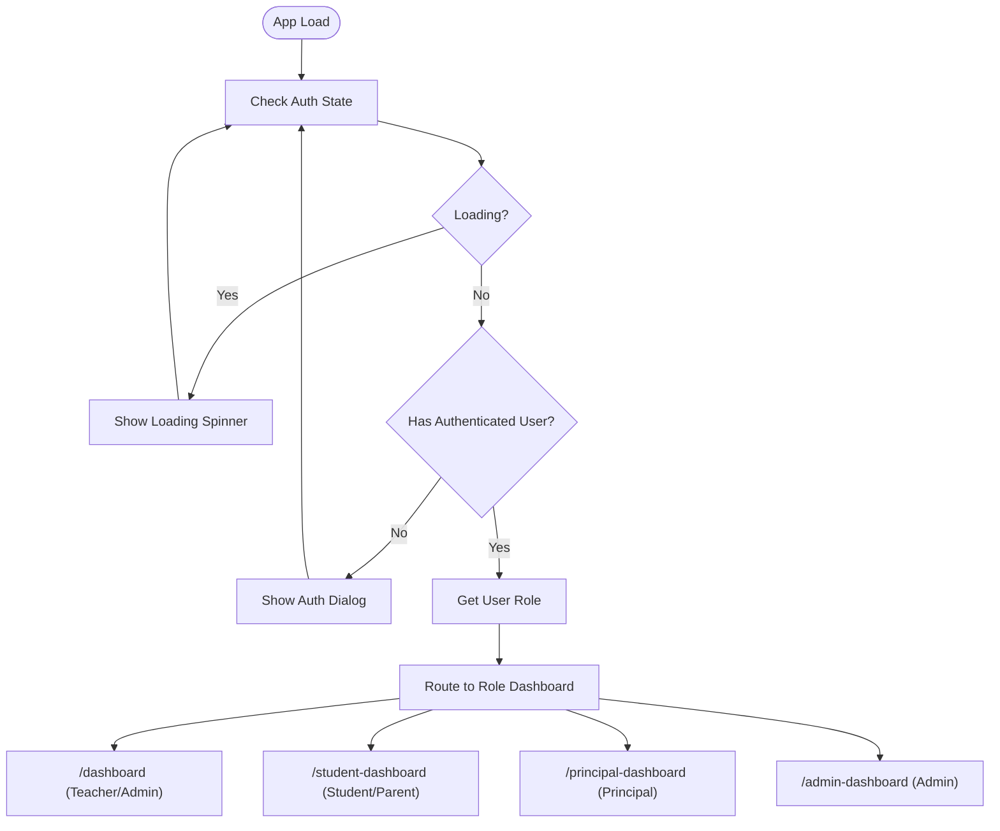
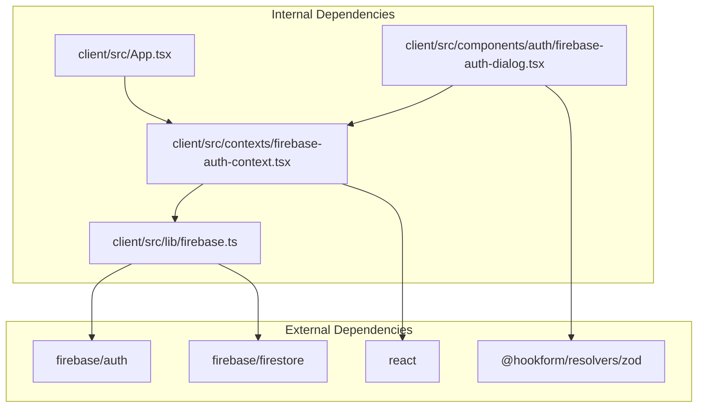

# Firebase Authentication Integration

<cite>
**Referenced Files in This Document**
- [firebase.ts](file://client/src/lib/firebase.ts)
- [firebase-auth-context.tsx](file://client/src/contexts/firebase-auth-context.tsx)
- [firebase-auth-dialog.tsx](file://client/src/components/auth/firebase-auth-dialog.tsx)
- [App.tsx](file://client/src/App.tsx)
- [LoginPage.tsx](file://client/src/pages/LoginPage.tsx)
- [dashboard.tsx](file://client/src/pages/dashboard.tsx)
- [student-dashboard.tsx](file://client/src/pages/student-dashboard.tsx)
- [.env.example](file://.env.example)
</cite>

## Table of Contents
1. [Introduction](#introduction)
2. [Project Structure](#project-structure)
3. [Core Components](#core-components)
4. [Architecture Overview](#architecture-overview)
5. [Detailed Component Analysis](#detailed-component-analysis)
6. [Dependency Analysis](#dependency-analysis)
7. [Performance Considerations](#performance-considerations)
8. [Troubleshooting Guide](#troubleshooting-guide)
9. [Conclusion](#conclusion)

## Introduction
This document provides comprehensive documentation for Firebase Authentication integration in PersonalLearningPro. It covers Firebase configuration setup, authentication methods (email/password and Google OAuth), user session management, and real-time authentication state monitoring via onAuthStateChanged. The documentation explains the authentication flow from login to logout, including error handling, loading states, and user profile synchronization. It also includes code examples for authentication hooks, login dialogs, and session persistence, along with security considerations and best practices for managing authentication state.

## Project Structure
The authentication system is organized around three primary layers:
- Firebase configuration and service functions
- Authentication context provider for state management
- UI components for authentication dialogs and protected routing

**Diagram sources**
- [App.tsx](file://client/src/App.tsx#L93-L150)
- [firebase-auth-context.tsx](file://client/src/contexts/firebase-auth-context.tsx#L38-L71)
- [firebase-auth-dialog.tsx](file://client/src/components/auth/firebase-auth-dialog.tsx#L39-L40)
- [firebase.ts](file://client/src/lib/firebase.ts#L1-L212)

**Section sources**
- [App.tsx](file://client/src/App.tsx#L1-L165)
- [firebase-auth-context.tsx](file://client/src/contexts/firebase-auth-context.tsx#L1-L267)
- [firebase-auth-dialog.tsx](file://client/src/components/auth/firebase-auth-dialog.tsx#L1-L500)
- [firebase.ts](file://client/src/lib/firebase.ts#L1-L212)

## Core Components
This section outlines the core components that implement Firebase Authentication in PersonalLearningPro.

- Firebase configuration and service functions
  - Centralized Firebase initialization and exported authentication functions
  - User roles and profile interfaces
  - Email/password and Google OAuth login flows
  - User registration and profile updates
  - Logout and password reset capabilities

- Authentication context provider
  - Real-time authentication state monitoring using onAuthStateChanged
  - Loading state management during authentication transitions
  - Error handling and user feedback via toast notifications
  - User profile synchronization from Firestore

- Authentication dialog and UI components
  - Unified login/register dialog supporting email/password and Google OAuth
  - Role selection flow for new Google users
  - Form validation and submission handling
  - Protected routing based on authentication state

**Section sources**
- [firebase.ts](file://client/src/lib/firebase.ts#L1-L212)
- [firebase-auth-context.tsx](file://client/src/contexts/firebase-auth-context.tsx#L1-L267)
- [firebase-auth-dialog.tsx](file://client/src/components/auth/firebase-auth-dialog.tsx#L1-L500)

## Architecture Overview
The authentication architecture follows a layered pattern with clear separation of concerns:
- Firebase service layer encapsulates all Firebase operations
- Context provider manages global authentication state
- UI components consume authentication state and trigger actions
- Routing enforces authentication requirements

**Diagram sources**
- [App.tsx](file://client/src/App.tsx#L93-L150)
- [firebase-auth-context.tsx](file://client/src/contexts/firebase-auth-context.tsx#L43-L71)
- [firebase-auth-dialog.tsx](file://client/src/components/auth/firebase-auth-dialog.tsx#L98-L118)
- [firebase.ts](file://client/src/lib/firebase.ts#L66-L115)

**Section sources**
- [App.tsx](file://client/src/App.tsx#L93-L150)
- [firebase-auth-context.tsx](file://client/src/contexts/firebase-auth-context.tsx#L38-L71)
- [firebase-auth-dialog.tsx](file://client/src/components/auth/firebase-auth-dialog.tsx#L39-L185)
- [firebase.ts](file://client/src/lib/firebase.ts#L66-L115)

## Detailed Component Analysis

### Firebase Configuration and Service Functions
The Firebase service layer provides a centralized interface for all authentication operations. It handles configuration, initialization, and exposes typed functions for common authentication tasks.

Key features:
- Graceful fallback when Firebase is not configured
- Strongly typed user profiles and roles
- Integrated Firestore operations for user data
- Comprehensive error handling and logging

**Diagram sources**
- [firebase.ts](file://client/src/lib/firebase.ts#L17-L63)
- [firebase.ts](file://client/src/lib/firebase.ts#L66-L115)
- [firebase.ts](file://client/src/lib/firebase.ts#L117-L177)

**Section sources**
- [firebase.ts](file://client/src/lib/firebase.ts#L1-L212)

### Authentication Context Provider Implementation
The authentication context provider manages global authentication state and exposes a comprehensive set of methods for authentication operations. It implements real-time state monitoring and robust error handling.

Core functionality:
- Real-time authentication state monitoring via onAuthStateChanged
- Loading state management during authentication transitions
- User profile synchronization with Firestore
- Toast-based user feedback for all operations
- Graceful degradation when Firebase is unavailable

**Diagram sources**
- [firebase-auth-context.tsx](file://client/src/contexts/firebase-auth-context.tsx#L43-L71)
- [firebase-auth-context.tsx](file://client/src/contexts/firebase-auth-context.tsx#L50-L68)

**Section sources**
- [firebase-auth-context.tsx](file://client/src/contexts/firebase-auth-context.tsx#L1-L267)

### Authentication Dialog and User Interface
The authentication dialog provides a unified interface for both email/password and Google OAuth authentication flows. It supports role selection for new Google users and integrates with form validation libraries.

Key features:
- Tabbed interface for login and registration
- Form validation using Zod schemas
- Role-specific data collection for new users
- Google OAuth integration with seamless user experience
- Loading states and error handling

**Diagram sources**
- [firebase-auth-dialog.tsx](file://client/src/components/auth/firebase-auth-dialog.tsx#L174-L185)
- [firebase-auth-dialog.tsx](file://client/src/components/auth/firebase-auth-dialog.tsx#L128-L139)
- [firebase.ts](file://client/src/lib/firebase.ts#L117-L177)

**Section sources**
- [firebase-auth-dialog.tsx](file://client/src/components/auth/firebase-auth-dialog.tsx#L1-L500)
- [firebase.ts](file://client/src/lib/firebase.ts#L117-L177)

### Protected Routing and Role-Based Access
The application implements role-based routing where authentication state determines which dashboard is displayed. The router checks authentication status and redirects accordingly.

**Diagram sources**
- [App.tsx](file://client/src/App.tsx#L93-L150)
- [dashboard.tsx](file://client/src/pages/dashboard.tsx#L44-L45)
- [student-dashboard.tsx](file://client/src/pages/student-dashboard.tsx#L123-L124)

**Section sources**
- [App.tsx](file://client/src/App.tsx#L93-L150)
- [dashboard.tsx](file://client/src/pages/dashboard.tsx#L44-L45)
- [student-dashboard.tsx](file://client/src/pages/student-dashboard.tsx#L123-L124)

## Dependency Analysis
The authentication system exhibits clean dependency management with clear boundaries between layers.

**Diagram sources**
- [firebase.ts](file://client/src/lib/firebase.ts#L1-L14)
- [firebase-auth-context.tsx](file://client/src/contexts/firebase-auth-context.tsx#L1-L16)
- [firebase-auth-dialog.tsx](file://client/src/components/auth/firebase-auth-dialog.tsx#L1-L7)

**Section sources**
- [firebase.ts](file://client/src/lib/firebase.ts#L1-L14)
- [firebase-auth-context.tsx](file://client/src/contexts/firebase-auth-context.tsx#L1-L16)
- [firebase-auth-dialog.tsx](file://client/src/components/auth/firebase-auth-dialog.tsx#L1-L7)

## Performance Considerations
The authentication system implements several performance optimizations:

- **Graceful Degradation**: When Firebase is not configured, the system continues to operate with reduced functionality rather than failing completely.
- **Timeout Handling**: Profile fetching includes a 5-second timeout to prevent hanging when Firestore is offline.
- **Efficient State Updates**: Authentication state changes trigger minimal re-renders by updating only necessary state.
- **Loading State Management**: Proper loading indicators prevent UI flickering during authentication transitions.

Best practices for optimization:
- Implement proper caching strategies for user data
- Consider implementing exponential backoff for retry mechanisms
- Optimize Firestore queries for user profile retrieval
- Use React.memo for expensive UI components that depend on auth state

## Troubleshooting Guide

### Common Authentication Issues

**Firebase Not Configured**
- Symptom: Authentication features disabled with warning message
- Solution: Copy `.env.example` to `.env` and fill in Firebase credentials
- Impact: App continues to run but authentication features are unavailable

**Authentication State Not Persisting**
- Symptom: Users appear logged out after page refresh
- Solution: Verify Firebase Auth persistence settings and browser storage permissions
- Check: Ensure proper initialization of Firebase app and auth instances

**Google OAuth Errors**
- Symptom: Google login fails with popup blocking or redirect errors
- Solution: Check Google OAuth configuration in Firebase Console and domain restrictions
- Verify: Proper OAuth client ID configuration and redirect URI settings

**Profile Synchronization Issues**
- Symptom: User profile not loading or showing outdated data
- Solution: Implement proper error handling and retry mechanisms
- Check: Network connectivity and Firestore security rules

**Section sources**
- [firebase.ts](file://client/src/lib/firebase.ts#L27-L37)
- [firebase-auth-context.tsx](file://client/src/contexts/firebase-auth-context.tsx#L52-L63)

## Conclusion
PersonalLearningPro's Firebase Authentication integration provides a robust, scalable foundation for user management with the following strengths:

- **Modular Architecture**: Clean separation between Firebase services, context providers, and UI components
- **Real-time State Management**: Efficient onAuthStateChanged monitoring with proper error handling
- **Flexible Authentication Methods**: Support for both email/password and Google OAuth with seamless user experience
- **Role-based Access Control**: Dynamic routing based on user roles with comprehensive profile management
- **Developer Experience**: Strong TypeScript support, comprehensive error handling, and intuitive APIs

The implementation demonstrates best practices for Firebase Authentication integration, including graceful degradation, proper loading state management, and comprehensive user feedback. The system is well-suited for educational environments requiring flexible user management across multiple roles while maintaining security and performance standards.