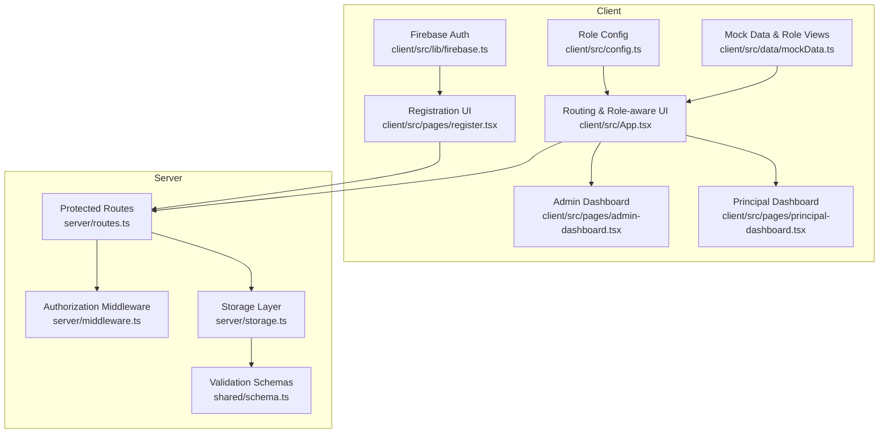
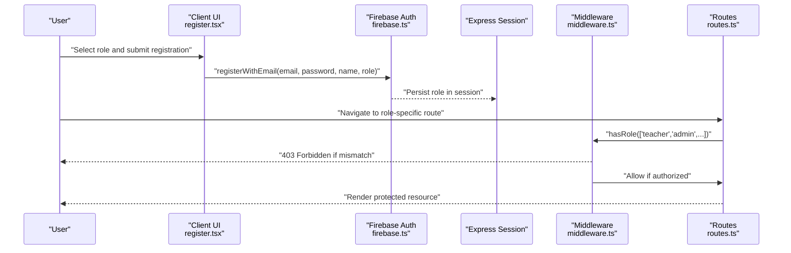
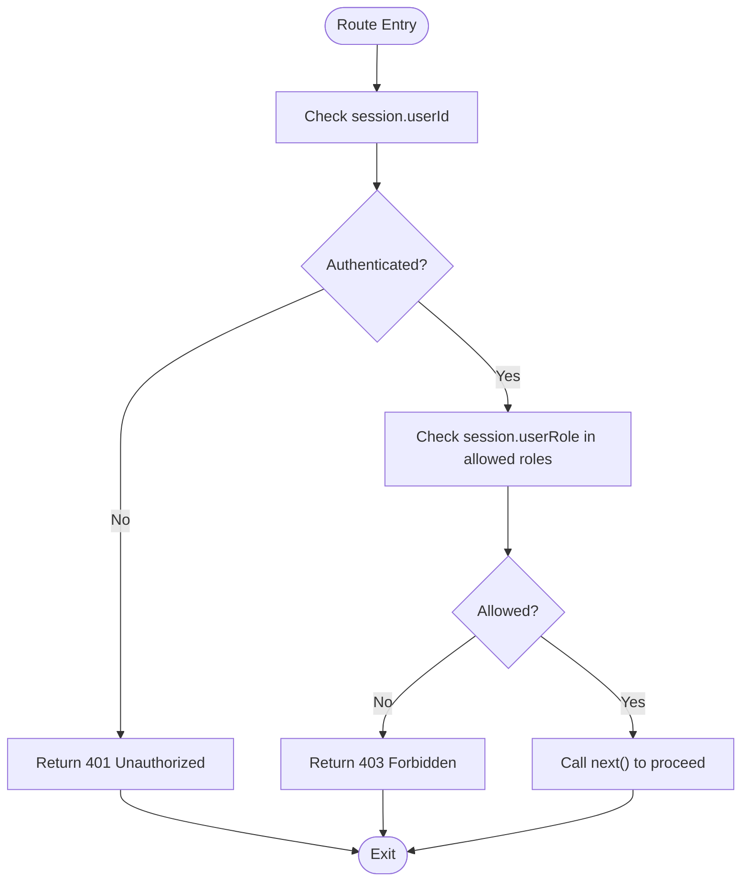
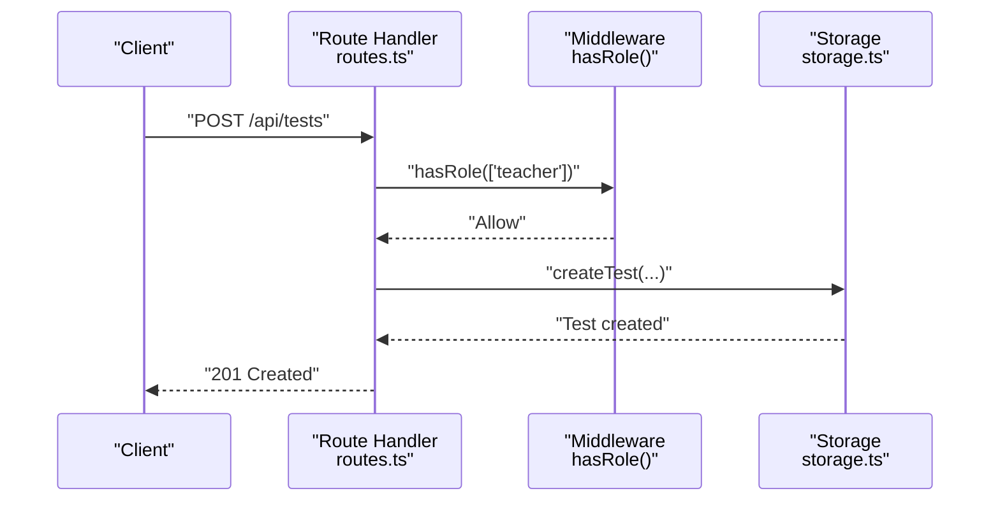
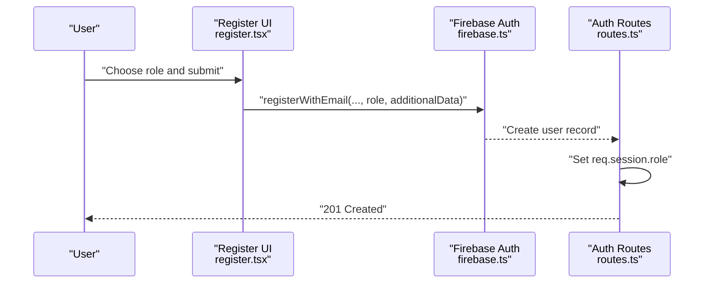
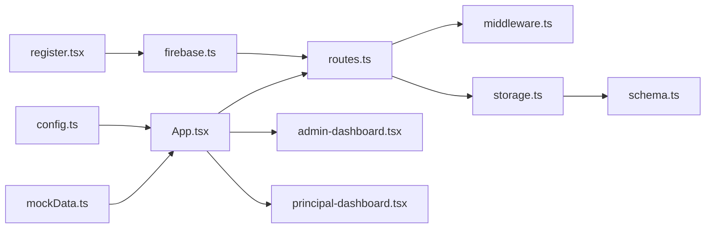

# Role-Based Access Control (RBAC)

<cite>
**Referenced Files in This Document**
- [middleware.ts](file://server/middleware.ts)
- [routes.ts](file://server/routes.ts)
- [storage.ts](file://server/storage.ts)
- [schema.ts](file://shared/schema.ts)
- [firebase.ts](file://client/src/lib/firebase.ts)
- [register.tsx](file://client/src/pages/register.tsx)
- [App.tsx](file://client/src/App.tsx)
- [admin-dashboard.tsx](file://client/src/pages/admin-dashboard.tsx)
- [principal-dashboard.tsx](file://client/src/pages/principal-dashboard.tsx)
- [config.ts](file://client/src/config.ts)
- [mockData.ts](file://client/src/data/mockData.ts)
</cite>

## Table of Contents
1. [Introduction](#introduction)
2. [Project Structure](#project-structure)
3. [Core Components](#core-components)
4. [Architecture Overview](#architecture-overview)
5. [Detailed Component Analysis](#detailed-component-analysis)
6. [Dependency Analysis](#dependency-analysis)
7. [Performance Considerations](#performance-considerations)
8. [Troubleshooting Guide](#troubleshooting-guide)
9. [Conclusion](#conclusion)

## Introduction
This document describes the Role-Based Access Control (RBAC) model implemented in PersonalLearningPro. It covers the five-user role system (Student, Teacher, Admin, Principal, Parent), permission hierarchies, authorization middleware, role-based route protection, permission checking mechanisms, role assignment during registration, dynamic permission enforcement, role-based UI rendering, protected route implementations, and permission matrices. It also addresses role escalation policies, temporary role assignments, and audit trail for role changes.

## Project Structure
The RBAC implementation spans the server (Express middleware and routes), shared validation schemas, and the client (Firebase-based authentication and role-aware UI).



**Diagram sources**
- [firebase.ts](file://client/src/lib/firebase.ts#L47-L63)
- [register.tsx](file://client/src/pages/register.tsx#L36-L46)
- [App.tsx](file://client/src/App.tsx#L93-L150)
- [admin-dashboard.tsx](file://client/src/pages/admin-dashboard.tsx#L29-L302)
- [principal-dashboard.tsx](file://client/src/pages/principal-dashboard.tsx#L44-L365)
- [config.ts](file://client/src/config.ts#L1-L8)
- [mockData.ts](file://client/src/data/mockData.ts#L1-L240)
- [middleware.ts](file://server/middleware.ts#L1-L18)
- [routes.ts](file://server/routes.ts#L11-L86)
- [storage.ts](file://server/storage.ts#L1-L106)
- [schema.ts](file://shared/schema.ts#L4-L13)

**Section sources**
- [middleware.ts](file://server/middleware.ts#L1-L18)
- [routes.ts](file://server/routes.ts#L11-L86)
- [firebase.ts](file://client/src/lib/firebase.ts#L47-L63)
- [register.tsx](file://client/src/pages/register.tsx#L36-L46)
- [App.tsx](file://client/src/App.tsx#L93-L150)
- [admin-dashboard.tsx](file://client/src/pages/admin-dashboard.tsx#L29-L302)
- [principal-dashboard.tsx](file://client/src/pages/principal-dashboard.tsx#L44-L365)
- [config.ts](file://client/src/config.ts#L1-L8)
- [mockData.ts](file://client/src/data/mockData.ts#L1-L240)
- [storage.ts](file://server/storage.ts#L1-L106)
- [schema.ts](file://shared/schema.ts#L4-L13)

## Core Components
- UserRole enum and typed profiles:
  - Client-side role union type and user profile shape define the supported roles and associated attributes.
  - Registration UI enforces role selection and collects role-specific fields (class, subject).
- Authorization middleware:
  - Authentication guard checks session presence.
  - Role guard validates session role against allowed roles.
- Protected routes:
  - Routes enforce role-based access and ownership checks (e.g., tests, attempts, messages).
- Storage and validation:
  - Zod schemas define allowed roles and data structures.
  - Storage layer persists users and supports role queries.
- Role-aware UI:
  - Routing selects dashboards per role.
  - Dashboards render role-appropriate content and actions.

**Section sources**
- [firebase.ts](file://client/src/lib/firebase.ts#L47-L63)
- [register.tsx](file://client/src/pages/register.tsx#L36-L46)
- [middleware.ts](file://server/middleware.ts#L3-L17)
- [routes.ts](file://server/routes.ts#L110-L132)
- [schema.ts](file://shared/schema.ts#L4-L13)
- [storage.ts](file://server/storage.ts#L142-L147)
- [App.tsx](file://client/src/App.tsx#L113-L124)

## Architecture Overview
The RBAC architecture combines client-side Firebase authentication with server-side session-based authorization and route-level guards.



**Diagram sources**
- [register.tsx](file://client/src/pages/register.tsx#L70-L86)
- [firebase.ts](file://client/src/lib/firebase.ts#L80-L115)
- [middleware.ts](file://server/middleware.ts#L10-L17)
- [routes.ts](file://server/routes.ts#L110-L132)

## Detailed Component Analysis

### UserRole Enum and Permission Hierarchies
- Roles:
  - Student, Teacher, Admin, Principal, Parent.
- Role-specific attributes:
  - Client profile includes role plus institution/class/student/subjects metadata.
- Permission matrix (derived from route guards):
  - Admin: Full administrative capabilities (institution settings, user management).
  - Principal: Institution oversight, reporting, staff/finance/infrastructure views.
  - Teacher: Create/manage tests, evaluate answers, manage channels/workspaces (limited to members).
  - Student: Attempt tests, view class content, participate in conversations.
  - Parent: Receive notices, communicate with teachers, monitor child’s progress.

```mermaid
classDiagram
class UserRole {
<<enum>>
"student"
"teacher"
"admin"
"principal"
"parent"
}
class UserProfile {
+string uid
+string email
+string displayName
+UserRole role
+string? institutionId
+string? classId
+string? studentId
+string[]? subjects
}
class RegisterSchema {
+string username
+string password
+string name
+string email
+UserRole role
+string? class
+string? subject
}
UserProfile --> UserRole : "has"
RegisterSchema --> UserRole : "validates"
```

**Diagram sources**
- [firebase.ts](file://client/src/lib/firebase.ts#L47-L63)
- [register.tsx](file://client/src/pages/register.tsx#L36-L46)

**Section sources**
- [firebase.ts](file://client/src/lib/firebase.ts#L47-L63)
- [register.tsx](file://client/src/pages/register.tsx#L36-L46)

### Authorization Middleware Implementation
- isAuthenticated:
  - Ensures a session exists with a user identifier.
- hasRole:
  - Guards routes by checking session role against allowed roles.



**Diagram sources**
- [middleware.ts](file://server/middleware.ts#L3-L17)

**Section sources**
- [middleware.ts](file://server/middleware.ts#L3-L17)

### Role-Based Route Protection
- Authentication and role enforcement:
  - Login/Register endpoints set session role and user id.
  - Routes enforce role checks (e.g., tests creation requires teacher).
  - Ownership checks ensure users act within permitted scopes (e.g., editing own test attempts).
- Examples:
  - Tests: Only teachers can create/update tests; ownership verified by teacherId.
  - Attempts: Only students can create attempts; class and status checks enforced.
  - Workspaces/Channels: Teachers can create channels; membership checks enforced.
  - Messages: Workspace/channel membership and DM ownership validated.



**Diagram sources**
- [routes.ts](file://server/routes.ts#L110-L132)
- [middleware.ts](file://server/middleware.ts#L10-L17)
- [storage.ts](file://server/storage.ts#L160-L166)

**Section sources**
- [routes.ts](file://server/routes.ts#L110-L132)
- [routes.ts](file://server/routes.ts#L318-L370)
- [routes.ts](file://server/routes.ts#L584-L603)
- [routes.ts](file://server/routes.ts#L677-L701)
- [routes.ts](file://server/routes.ts#L720-L777)
- [storage.ts](file://server/storage.ts#L160-L166)

### Permission Checking Mechanisms
- Session-based checks:
  - Server reads req.session.userRole and applies hasRole guards.
- Ownership and scope checks:
  - Routes verify ownership (e.g., test.teacherId) or class membership (e.g., student.class).
- Validation:
  - Zod schemas enforce allowed roles and data correctness.

**Section sources**
- [middleware.ts](file://server/middleware.ts#L10-L17)
- [routes.ts](file://server/routes.ts#L112-L121)
- [routes.ts](file://server/routes.ts#L194-L203)
- [routes.ts](file://server/routes.ts#L321-L348)
- [schema.ts](file://shared/schema.ts#L4-L13)

### Role Assignment During Registration
- Client:
  - Registration form collects role and role-specific fields (class/subject).
  - Frontend passes role to authentication provider.
- Server:
  - Registration endpoint persists user and sets session role.
  - Zod schema validates allowed roles and fields.



**Diagram sources**
- [register.tsx](file://client/src/pages/register.tsx#L70-L86)
- [firebase.ts](file://client/src/lib/firebase.ts#L80-L115)
- [routes.ts](file://server/routes.ts#L13-L47)

**Section sources**
- [register.tsx](file://client/src/pages/register.tsx#L36-L46)
- [firebase.ts](file://client/src/lib/firebase.ts#L80-L115)
- [routes.ts](file://server/routes.ts#L13-L47)

### Dynamic Permission Enforcement
- Runtime role-aware UI:
  - App selects dashboards based on session role.
  - Admin and Principal dashboards render role-specific features.
- Role-configured data:
  - Role-specific identifiers (institutionId, classId, studentId, subjects) guide UI behavior.

**Section sources**
- [App.tsx](file://client/src/App.tsx#L113-L124)
- [admin-dashboard.tsx](file://client/src/pages/admin-dashboard.tsx#L29-L302)
- [principal-dashboard.tsx](file://client/src/pages/principal-dashboard.tsx#L44-L365)
- [config.ts](file://client/src/config.ts#L1-L8)

### Role-Based UI Rendering
- Root dashboard selection:
  - Router chooses role-specific dashboard components.
- Static role views:
  - Dashboards hard-code role-appropriate sections and actions.

**Section sources**
- [App.tsx](file://client/src/App.tsx#L113-L124)
- [admin-dashboard.tsx](file://client/src/pages/admin-dashboard.tsx#L29-L302)
- [principal-dashboard.tsx](file://client/src/pages/principal-dashboard.tsx#L44-L365)

### Protected Route Implementations
- Example: Test lifecycle
  - Creation: Only teachers; ownership validated.
  - Retrieval: Teachers see own tests or all tests (admin); students see class tests.
  - Updates: Ownership enforced.
- Example: Test attempts
  - Creation: Only students; class and status checks.
  - Updates: Ownership or teacher-for-test checks.
- Example: Messaging
  - Channels: Teachers create channels; membership enforced.
  - Messages: Workspace membership or DM ownership enforced.

**Section sources**
- [routes.ts](file://server/routes.ts#L110-L132)
- [routes.ts](file://server/routes.ts#L134-L173)
- [routes.ts](file://server/routes.ts#L211-L247)
- [routes.ts](file://server/routes.ts#L280-L316)
- [routes.ts](file://server/routes.ts#L318-L370)
- [routes.ts](file://server/routes.ts#L372-L414)
- [routes.ts](file://server/routes.ts#L584-L603)
- [routes.ts](file://server/routes.ts#L677-L701)
- [routes.ts](file://server/routes.ts#L720-L777)

### Permission Matrices
- Derived from route guards and ownership checks:
  - Admin: Full administrative access; can manage users, classes, reports, settings.
  - Principal: Institution oversight; academic/staff/finance/infrastructure views.
  - Teacher: Test creation/management, answer evaluation, channel/workspace membership.
  - Student: Attempt tests, view class content, participate in conversations.
  - Parent: Notices, teacher communication, progress monitoring.

**Section sources**
- [routes.ts](file://server/routes.ts#L110-L132)
- [routes.ts](file://server/routes.ts#L211-L247)
- [routes.ts](file://server/routes.ts#L318-L370)
- [routes.ts](file://server/routes.ts#L584-L603)
- [routes.ts](file://server/routes.ts#L677-L701)
- [routes.ts](file://server/routes.ts#L720-L777)

### Role Escalation Policies
- Current implementation does not expose explicit role escalation endpoints or mechanisms.
- Role changes would require:
  - Admin-only mutation endpoints.
  - Audit logging of role change events.
  - Session invalidation and re-authentication upon role change.

[No sources needed since this section provides general guidance]

### Temporary Role Assignments
- No temporary role assignment endpoints or mechanisms are present in the current codebase.
- If introduced, they should:
  - Accept a role scope and expiry.
  - Enforce time-bound access windows.
  - Log and revoke roles on expiry.

[No sources needed since this section provides general guidance]

### Audit Trail for Role Changes
- No dedicated audit trail for role changes exists.
- Recommended additions:
  - Track role change events with timestamps, actor, subject, old/new roles.
  - Store in a dedicated audit collection/table.
  - Enforce read/write permissions for audit data.

[No sources needed since this section provides general guidance]

## Dependency Analysis


**Diagram sources**
- [register.tsx](file://client/src/pages/register.tsx#L70-L86)
- [firebase.ts](file://client/src/lib/firebase.ts#L80-L115)
- [routes.ts](file://server/routes.ts#L11-L86)
- [middleware.ts](file://server/middleware.ts#L1-L18)
- [storage.ts](file://server/storage.ts#L1-L106)
- [schema.ts](file://shared/schema.ts#L4-L13)
- [App.tsx](file://client/src/App.tsx#L93-L150)
- [admin-dashboard.tsx](file://client/src/pages/admin-dashboard.tsx#L29-L302)
- [principal-dashboard.tsx](file://client/src/pages/principal-dashboard.tsx#L44-L365)
- [config.ts](file://client/src/config.ts#L1-L8)
- [mockData.ts](file://client/src/data/mockData.ts#L1-L240)

**Section sources**
- [register.tsx](file://client/src/pages/register.tsx#L70-L86)
- [firebase.ts](file://client/src/lib/firebase.ts#L80-L115)
- [routes.ts](file://server/routes.ts#L11-L86)
- [middleware.ts](file://server/middleware.ts#L1-L18)
- [storage.ts](file://server/storage.ts#L1-L106)
- [schema.ts](file://shared/schema.ts#L4-L13)
- [App.tsx](file://client/src/App.tsx#L93-L150)
- [admin-dashboard.tsx](file://client/src/pages/admin-dashboard.tsx#L29-L302)
- [principal-dashboard.tsx](file://client/src/pages/principal-dashboard.tsx#L44-L365)
- [config.ts](file://client/src/config.ts#L1-L8)
- [mockData.ts](file://client/src/data/mockData.ts#L1-L240)

## Performance Considerations
- Middleware checks are lightweight and short-circuit unauthorized requests.
- Route-level ownership checks minimize unnecessary database calls by validating early.
- Consider caching frequently accessed role metadata at the edge or in CDN for static dashboards.

[No sources needed since this section provides general guidance]

## Troubleshooting Guide
- 401 Unauthorized on protected routes:
  - Verify session initialization and presence of userId.
- 403 Forbidden on protected routes:
  - Confirm session role matches allowed roles for the route.
  - Check ownership validations (e.g., teacherId, studentId, class).
- Registration role not applied:
  - Ensure role is passed to authentication provider and stored in session.
  - Validate Zod schema allows the chosen role.

**Section sources**
- [middleware.ts](file://server/middleware.ts#L3-L17)
- [routes.ts](file://server/routes.ts#L112-L121)
- [routes.ts](file://server/routes.ts#L194-L203)
- [routes.ts](file://server/routes.ts#L321-L348)
- [register.tsx](file://client/src/pages/register.tsx#L70-L86)

## Conclusion
PersonalLearningPro implements a clear RBAC model with role-aware UI and robust server-side authorization. The system leverages session-based middleware and route-level guards to enforce permissions, with role-specific UI rendering and role-specific data configurations. Future enhancements should include explicit role escalation, temporary role assignments, and an audit trail for role changes to strengthen governance and compliance.