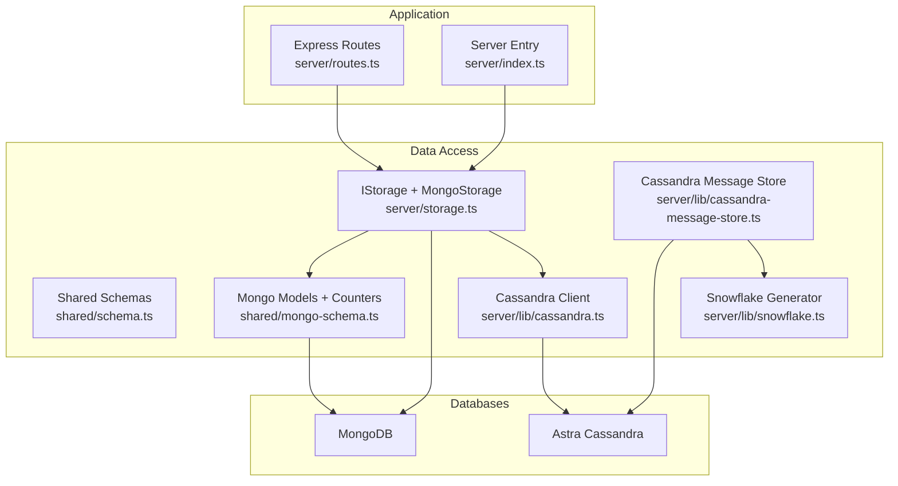
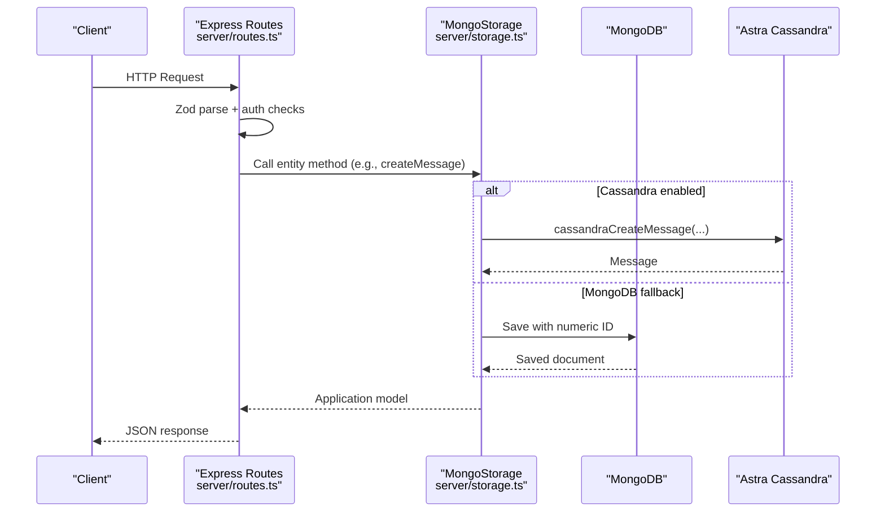
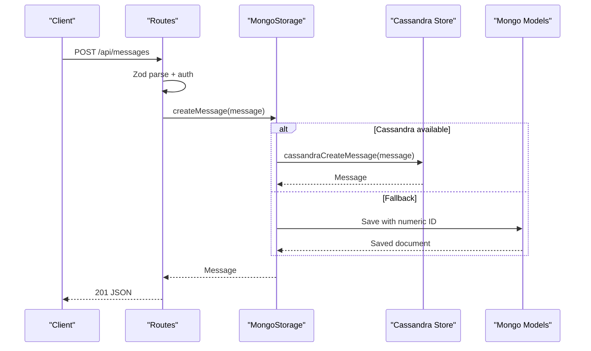
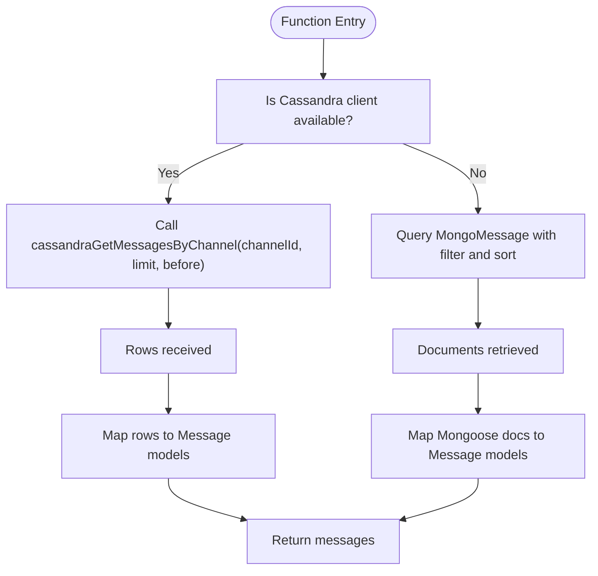
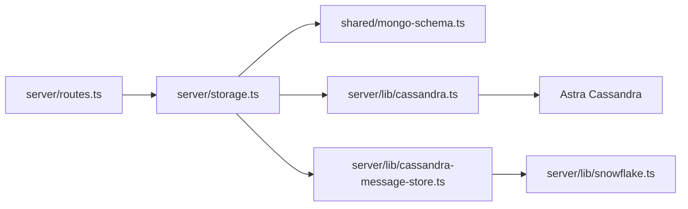

# Data Access Layer

<cite>
**Referenced Files in This Document**
- [storage.ts](file://server/storage.ts)
- [schema.ts](file://shared/schema.ts)
- [mongo-schema.ts](file://shared/mongo-schema.ts)
- [cassandra.ts](file://server/lib/cassandra.ts)
- [cassandra-message-store.ts](file://server/lib/cassandra-message-store.ts)
- [snowflake.ts](file://server/lib/snowflake.ts)
- [db.ts](file://server/db.ts)
- [index.ts](file://server/index.ts)
- [routes.ts](file://server/routes.ts)
</cite>

## Table of Contents
1. [Introduction](#introduction)
2. [Project Structure](#project-structure)
3. [Core Components](#core-components)
4. [Architecture Overview](#architecture-overview)
5. [Detailed Component Analysis](#detailed-component-analysis)
6. [Dependency Analysis](#dependency-analysis)
7. [Performance Considerations](#performance-considerations)
8. [Troubleshooting Guide](#troubleshooting-guide)
9. [Conclusion](#conclusion)

## Introduction
This document explains the data access layer implementation, focusing on the unified storage interface and its MongoDB-backed implementation, alongside optional Cassandra-backed messaging. It covers the repository pattern usage, CRUD operations per entity, parameter validation, error handling, response formatting, Snowflake ID generation, legacy compatibility, data mapping, transaction handling, bulk operations, and performance optimization. It also clarifies how MongoDB and Cassandra operations are separated within a single interface.

## Project Structure
The data access layer centers around a single storage interface and implementation, with supporting schemas and database initialization utilities:
- Unified storage interface and implementation
- Shared application schemas and Mongoose models
- Optional Cassandra client and message store
- Snowflake ID generator for time-sorted identifiers
- Database connection initializers and route integration

**Diagram sources**
- [storage.ts](file://server/storage.ts#L33-L106)
- [schema.ts](file://shared/schema.ts#L1-L142)
- [mongo-schema.ts](file://shared/mongo-schema.ts#L1-L159)
- [cassandra.ts](file://server/lib/cassandra.ts#L1-L73)
- [cassandra-message-store.ts](file://server/lib/cassandra-message-store.ts#L1-L166)
- [snowflake.ts](file://server/lib/snowflake.ts#L1-L74)
- [db.ts](file://server/db.ts#L1-L21)
- [index.ts](file://server/index.ts#L1-L114)
- [routes.ts](file://server/routes.ts#L1-L800)

**Section sources**
- [storage.ts](file://server/storage.ts#L1-L519)
- [schema.ts](file://shared/schema.ts#L1-L142)
- [mongo-schema.ts](file://shared/mongo-schema.ts#L1-L159)
- [cassandra.ts](file://server/lib/cassandra.ts#L1-L73)
- [cassandra-message-store.ts](file://server/lib/cassandra-message-store.ts#L1-L166)
- [snowflake.ts](file://server/lib/snowflake.ts#L1-L74)
- [db.ts](file://server/db.ts#L1-L21)
- [index.ts](file://server/index.ts#L1-L114)
- [routes.ts](file://server/routes.ts#L1-L800)

## Core Components
- IStorage: Defines the contract for all data operations across entities (users, tests, questions, attempts, answers, analytics, workspaces, channels, messages). It also exposes a session store for Express sessions.
- MongoStorage: Implements IStorage using MongoDB for most entities and falls back to Cassandra for message operations when configured.
- Shared Schemas: Define Zod validation schemas and TypeScript types for all domain entities.
- Mongo Models: Mongoose models and counters for MongoDB entities, including a sequence generator for numeric IDs.
- Cassandra Client and Message Store: Optional Cassandra client and message store for high-throughput messaging with Snowflake IDs.
- Snowflake: Generates time-sorted, globally unique IDs suitable for Cassandra clustering.

Key responsibilities:
- Repository pattern: Each entity operation is encapsulated in MongoStorage methods, acting as repositories.
- Validation: Route handlers parse and validate inputs using Zod schemas before delegating to storage.
- Mapping: MongoStorage maps Mongoose documents to application types and vice versa.
- ID generation: Numeric IDs for MongoDB entities via counters; Snowflake IDs for Cassandra messages.
- Hybrid backend: MongoDB for structured entities; Cassandra for scalable message history.

**Section sources**
- [storage.ts](file://server/storage.ts#L33-L106)
- [storage.ts](file://server/storage.ts#L110-L519)
- [schema.ts](file://shared/schema.ts#L1-L142)
- [mongo-schema.ts](file://shared/mongo-schema.ts#L94-L159)
- [cassandra.ts](file://server/lib/cassandra.ts#L1-L73)
- [cassandra-message-store.ts](file://server/lib/cassandra-message-store.ts#L1-L166)
- [snowflake.ts](file://server/lib/snowflake.ts#L1-L74)

## Architecture Overview
The storage layer sits between route handlers and databases. Route handlers validate inputs, enforce authorization, and call storage methods. MongoStorage orchestrates:
- MongoDB CRUD for most entities using Mongoose models and numeric auto-increment IDs.
- Optional Cassandra integration for message operations when the Cassandra client is available.
- Consistent response mapping to shared application types.

**Diagram sources**
- [routes.ts](file://server/routes.ts#L779-L800)
- [storage.ts](file://server/storage.ts#L413-L422)
- [cassandra-message-store.ts](file://server/lib/cassandra-message-store.ts#L36-L75)
- [mongo-schema.ts](file://shared/mongo-schema.ts#L132-L144)

**Section sources**
- [routes.ts](file://server/routes.ts#L1-L800)
- [storage.ts](file://server/storage.ts#L413-L422)
- [cassandra-message-store.ts](file://server/lib/cassandra-message-store.ts#L36-L75)
- [mongo-schema.ts](file://shared/mongo-schema.ts#L132-L144)

## Detailed Component Analysis

### IStorage Interface
Defines CRUD operations for:
- Users: get by id/username/email, create, list by role/class
- Tests: create, get by id, list by teacher/status/class
- Questions: create, get by id, list by test
- Test Attempts: create, get by id, list by student/test
- Answers: create, get by id, list by attempt
- Analytics: create, list by user/test
- Test Assignments: create, get by id, list by filters, update, list by test, lookup by student+test
- Workspaces: create, get by id, list by user, add/remove members
- Channels: create, get by id, list by workspace, get-or-create DM, list DMs by user
- Messages: create, list by channel with pagination, delete, pin/unpin, get pinned, grade, mark read

It also exposes a session store for Express sessions.

**Section sources**
- [storage.ts](file://server/storage.ts#L33-L106)

### MongoStorage Implementation
MongoStorage implements IStorage using Mongoose models and numeric auto-increment IDs sourced from a Counter collection. It centralizes:
- Data mapping: Removes internal fields and returns normalized application models.
- Pagination and filtering: Uses MongoDB queries with sort and limit.
- Conditional Cassandra fallback: For message operations, delegates to Cassandra when available.

Entity operations overview:
- Users: find by id/username/email, create with next sequence, list by role/class
- Tests: create with next sequence, get/update by id, list by teacher/status/class
- Questions: create with next sequence, get/update by id, list by test with ordering
- Test Attempts: create with next sequence, get/update by id, list by student/test
- Answers: create with next sequence, get/update by id, list by attempt
- Analytics: create with next sequence, list by user/test
- Test Assignments: create with next sequence, get/update by id, list by filters, list by test, lookup by student+test
- Workspaces: create with next sequence, get by id, list by user, add/remove members using set operations
- Channels: create with next sequence, get by id, list by workspace, get-or-create DM by name pattern, list DMs by user
- Messages: create with next sequence or delegate to Cassandra, list by channel with before pagination, delete, pin/unpin, get pinned, grade, mark read

Error handling and validation:
- Route handlers validate inputs using Zod schemas and return structured errors.
- MongoStorage methods return undefined for missing entities and rely on route handlers to translate to HTTP 404/403/400 as appropriate.

Response formatting:
- All methods return normalized application models via mapping helpers.

**Section sources**
- [storage.ts](file://server/storage.ts#L110-L519)
- [mongo-schema.ts](file://shared/mongo-schema.ts#L94-L159)

### Data Mapping Functions
MongoStorage uses a generic mapping helper to convert Mongoose documents to application models by:
- Extracting internal fields (e.g., ObjectId, version key) and returning a clean object.
- Returning undefined when input is null/undefined.

This ensures route handlers receive normalized models without internal persistence details.

**Section sources**
- [storage.ts](file://server/storage.ts#L120-L124)

### Sequence Generation and Legacy Compatibility
Numeric IDs for MongoDB entities are generated using a Counter collection and an atomic increment operation. This provides:
- Monotonic numeric IDs for legacy compatibility and predictable sorting.
- Atomicity via findOneAndUpdate with upsert.

Cassandra messaging uses Snowflake IDs for:
- Global uniqueness across nodes.
- Time-sorted clustering for efficient reads.

Hybrid approach:
- MongoStorage delegates message operations to Cassandra when available; otherwise, it falls back to MongoDB with numeric IDs.

**Section sources**
- [mongo-schema.ts](file://shared/mongo-schema.ts#L94-L108)
- [snowflake.ts](file://server/lib/snowflake.ts#L1-L74)
- [storage.ts](file://server/storage.ts#L413-L422)

### Transaction Handling Patterns
- MongoDB: Mongoose operations are executed within a single request context. There is no explicit multi-document ACID transaction orchestration in the storage layer; updates are performed per-operation.
- Cassandra: Operations are executed individually with prepared statements. There is no multi-table transaction support; callers should design around eventual consistency and idempotent writes.

Bulk operations:
- MongoDB: Queries return arrays; pagination is supported via limit and sort.
- Cassandra: Prepared statements are used for inserts and updates; pagination uses partition and clustering key constraints.

**Section sources**
- [storage.ts](file://server/storage.ts#L149-L158)
- [cassandra-message-store.ts](file://server/lib/cassandra-message-store.ts#L36-L75)

### Parameter Validation and Error Handling
Validation:
- Route handlers parse request bodies using Zod schemas and return structured validation errors.

Error handling:
- Route handlers catch validation errors and return HTTP 400 with error details.
- General server errors are caught centrally and returned as HTTP 500.

MongoStorage:
- Returns undefined for missing entities; route handlers translate to 404.
- Throws or returns false for failures (e.g., delete operations).

**Section sources**
- [routes.ts](file://server/routes.ts#L13-L47)
- [routes.ts](file://server/routes.ts#L110-L132)
- [routes.ts](file://server/routes.ts#L779-L800)
- [index.ts](file://server/index.ts#L86-L92)

### Repository Pattern Usage
Each entity CRUD method in MongoStorage acts as a repository method:
- Encapsulates persistence logic
- Normalizes inputs and outputs
- Delegates to appropriate database backend (MongoDB or Cassandra)

This pattern promotes separation of concerns and testability.

**Section sources**
- [storage.ts](file://server/storage.ts#L126-L519)

### Class Diagram: IStorage and MongoStorage

```mermaid
classDiagram
class IStorage {
+sessionStore
+getUser(id)
+getUserByUsername(username)
+getUserByEmail(email)
+createUser(user)
+getUsers(role)
+getUsersByClass(className)
+createTest(test)
+getTest(id)
+getTests(teacherId,status)
+getTestsByClass(className)
+updateTest(id,test)
+createQuestion(question)
+getQuestion(id)
+getQuestionsByTest(testId)
+updateQuestion(id,question)
+createTestAttempt(attempt)
+getTestAttempt(id)
+getTestAttemptsByStudent(studentId)
+getTestAttemptsByTest(testId)
+updateTestAttempt(id,attempt)
+createAnswer(answer)
+getAnswer(id)
+getAnswersByAttempt(attemptId)
+updateAnswer(id,answer)
+createAnalytics(analytics)
+getAnalyticsByUser(userId)
+getAnalyticsByTest(testId)
+createTestAssignment(assignment)
+getTestAssignment(id)
+getTestAssignments(filters)
+updateTestAssignment(id,update)
+getTestAssignmentsByTest(testId)
+getTestAssignmentByStudentAndTest(studentId,testId)
+createWorkspace(workspace)
+getWorkspace(id)
+getWorkspaces(userId)
+addMemberToWorkspace(workspaceId,userId)
+removeMemberFromWorkspace(workspaceId,userId)
+createChannel(channel)
+getChannel(id)
+getChannelsByWorkspace(workspaceId)
+getOrCreateDMChannel(userId1,userId2)
+getDMsByUser(userId)
+createMessage(message)
+getMessagesByChannel(channelId,limit,before)
+deleteMessage(id,channelId)
+pinMessage(channelId,messageId)
+unpinMessage(channelId,messageId)
+getPinnedMessages(channelId)
+gradeMessage(messageId,status,channelId)
+markMessageAsRead(messageId,userId,channelId)
}
class MongoStorage {
-sessionStore
-mapMongoDoc(doc)
+constructor()
+getUser(id)
+getUserByUsername(username)
+getUserByEmail(email)
+createUser(user)
+getUsers(role)
+getUsersByClass(className)
+createTest(test)
+getTest(id)
+getTests(teacherId,status)
+getTestsByClass(className)
+updateTest(id,test)
+createQuestion(question)
+getQuestion(id)
+getQuestionsByTest(testId)
+updateQuestion(id,question)
+createTestAttempt(attempt)
+getTestAttempt(id)
+getTestAttemptsByStudent(studentId)
+getTestAttemptsByTest(testId)
+updateTestAttempt(id,attempt)
+createAnswer(answer)
+getAnswer(id)
+getAnswersByAttempt(attemptId)
+updateAnswer(id,answer)
+createAnalytics(analytics)
+getAnalyticsByUser(userId)
+getAnalyticsByTest(testId)
+createTestAssignment(assignment)
+getTestAssignment(id)
+getTestAssignments(filters)
+updateTestAssignment(id,update)
+getTestAssignmentsByTest(testId)
+getTestAssignmentByStudentAndTest(studentId,testId)
+createWorkspace(workspace)
+getWorkspace(id)
+getWorkspaces(userId)
+addMemberToWorkspace(workspaceId,userId)
+removeMemberFromWorkspace(workspaceId,userId)
+createChannel(channel)
+getChannel(id)
+getChannelsByWorkspace(workspaceId)
+getOrCreateDMChannel(userId1,userId2)
+getDMsByUser(userId)
+createMessage(message)
+getMessagesByChannel(channelId,limit,before)
+deleteMessage(id,channelId)
+pinMessage(channelId,messageId)
+unpinMessage(channelId,messageId)
+getPinnedMessages(channelId)
+gradeMessage(messageId,status,channelId)
+markMessageAsRead(messageId,userId,channelId)
}
IStorage <|.. MongoStorage
```

**Diagram sources**
- [storage.ts](file://server/storage.ts#L33-L106)
- [storage.ts](file://server/storage.ts#L110-L519)

### Sequence Diagram: Message Creation Flow

**Diagram sources**
- [routes.ts](file://server/routes.ts#L779-L800)
- [storage.ts](file://server/storage.ts#L413-L422)
- [cassandra-message-store.ts](file://server/lib/cassandra-message-store.ts#L36-L75)
- [mongo-schema.ts](file://shared/mongo-schema.ts#L132-L144)

### Flowchart: Message Retrieval with Pagination

**Diagram sources**
- [storage.ts](file://server/storage.ts#L424-L437)
- [cassandra-message-store.ts](file://server/lib/cassandra-message-store.ts#L79-L102)
- [mongo-schema.ts](file://shared/mongo-schema.ts#L132-L144)

## Dependency Analysis
- Route handlers depend on IStorage for all persistence operations.
- MongoStorage depends on:
  - Mongoose models for MongoDB entities
  - Counter collection for numeric ID generation
  - Optional Cassandra client and message store for messaging
- Cassandra client initialization is guarded by environment variables.
- Snowflake generator is used exclusively for Cassandra message IDs.

**Diagram sources**
- [routes.ts](file://server/routes.ts#L1-L800)
- [storage.ts](file://server/storage.ts#L1-L519)
- [mongo-schema.ts](file://shared/mongo-schema.ts#L1-L159)
- [cassandra.ts](file://server/lib/cassandra.ts#L1-L73)
- [cassandra-message-store.ts](file://server/lib/cassandra-message-store.ts#L1-L166)
- [snowflake.ts](file://server/lib/snowflake.ts#L1-L74)

**Section sources**
- [routes.ts](file://server/routes.ts#L1-L800)
- [storage.ts](file://server/storage.ts#L1-L519)
- [mongo-schema.ts](file://shared/mongo-schema.ts#L1-L159)
- [cassandra.ts](file://server/lib/cassandra.ts#L1-L73)
- [cassandra-message-store.ts](file://server/lib/cassandra-message-store.ts#L1-L166)
- [snowflake.ts](file://server/lib/snowflake.ts#L1-L74)

## Performance Considerations
- Cassandra for messages:
  - Partition key: channel_id; clustering key: message_id (Snowflake) enables efficient range scans and pagination.
  - Prepared statements reduce parsing overhead.
  - Index on is_pinned supports filtered retrieval without ALLOW FILTERING.
- MongoDB for entities:
  - Numeric IDs enable efficient sorting and indexing.
  - Queries use targeted filters and sorts; pagination via limit and skip.
- Hybrid design:
  - Message-heavy workloads benefit from Cassandra; other entities remain in MongoDB for richer queries and relationships.
- Initialization:
  - MongoDB connection is non-fatal; server continues serving. Cassandra is optional and initialized only if credentials are present.

[No sources needed since this section provides general guidance]

## Troubleshooting Guide
Common issues and resolutions:
- Missing MongoDB URL:
  - Symptom: MongoDB connection error logged; server continues.
  - Resolution: Set MONGODB_URL environment variable.
- Cassandra credentials not configured:
  - Symptom: Cassandra client not initialized; message operations fall back to MongoDB.
  - Resolution: Provide ASTRA_DB_SECURE_BUNDLE_PATH, ASTRA_DB_APPLICATION_TOKEN, and ASTRA_DB_KEYSPACE.
- Validation errors:
  - Symptom: HTTP 400 with Zod error details.
  - Resolution: Ensure request payload conforms to shared Zod schemas.
- Authorization failures:
  - Symptom: HTTP 401/403 depending on role and ownership checks in routes.
  - Resolution: Authenticate and ensure user has required permissions.
- Message operations:
  - Symptom: Pin/grade/read operations behave differently when Cassandra is enabled vs. fallback.
  - Resolution: Verify Cassandra availability and confirm channel metadata updates occur in MongoDB.

**Section sources**
- [db.ts](file://server/db.ts#L1-L21)
- [cassandra.ts](file://server/lib/cassandra.ts#L13-L16)
- [routes.ts](file://server/routes.ts#L13-L47)
- [routes.ts](file://server/routes.ts#L110-L132)
- [storage.ts](file://server/storage.ts#L448-L475)

## Conclusion
The data access layer employs a clean repository pattern via IStorage and MongoStorage, validating inputs at the route boundary and returning normalized application models. Numeric IDs for MongoDB entities ensure legacy compatibility, while Snowflake IDs power Cassandra messaging for scalability. The hybrid design allows optimal data stores per workload, with clear separation of concerns between MongoDB and Cassandra operations within a unified interface.