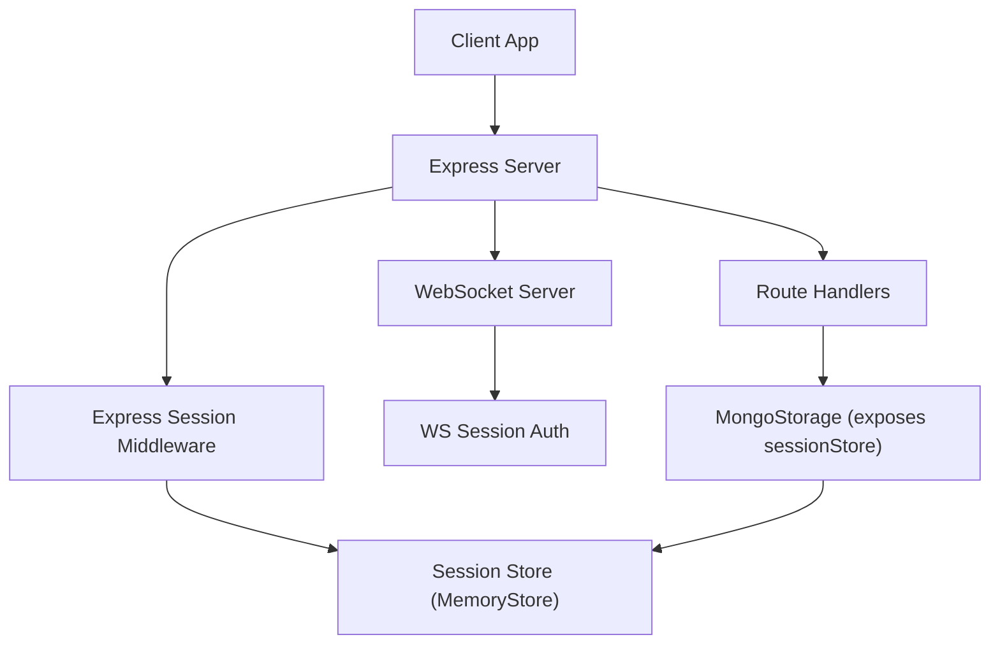
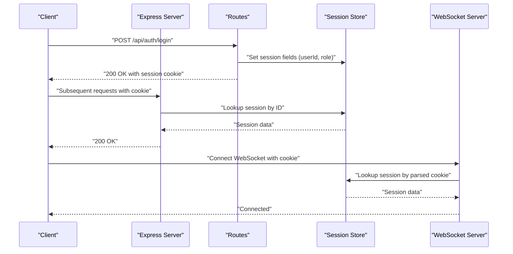
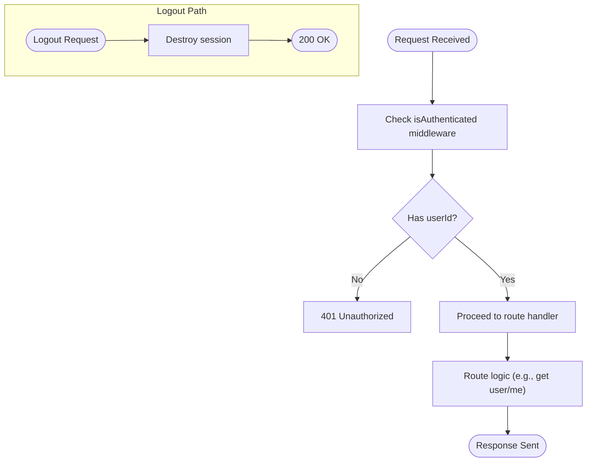
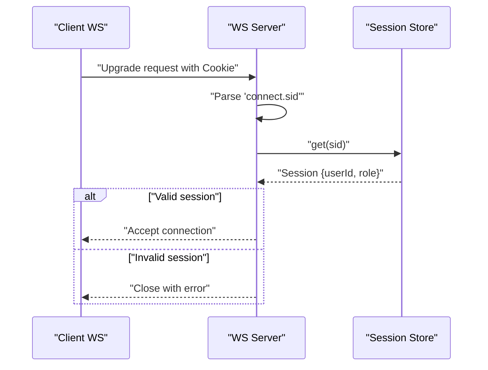
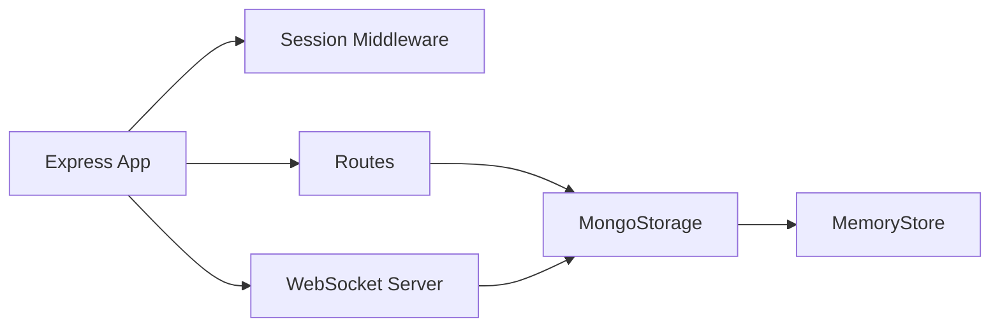

# Session Management

<cite>
**Referenced Files in This Document**
- [index.ts](file://server/index.ts)
- [storage.ts](file://server/storage.ts)
- [middleware.ts](file://server/middleware.ts)
- [routes.ts](file://server/routes.ts)
- [chat-ws.ts](file://server/chat-ws.ts)
- [db.ts](file://server/db.ts)
- [.env](file://.env)
- [.env.example](file://.env.example)
- [express-session.d.ts](file://server/types/express-session.d.ts)
- [firebase.ts](file://client/src/lib/firebase.ts)
- [firebase-auth-context.tsx](file://client/src/contexts/firebase-auth-context.tsx)
</cite>

## Table of Contents
1. [Introduction](#introduction)
2. [Project Structure](#project-structure)
3. [Core Components](#core-components)
4. [Architecture Overview](#architecture-overview)
5. [Detailed Component Analysis](#detailed-component-analysis)
6. [Dependency Analysis](#dependency-analysis)
7. [Performance Considerations](#performance-considerations)
8. [Troubleshooting Guide](#troubleshooting-guide)
9. [Conclusion](#conclusion)

## Introduction
This document explains the session management system used by the backend server. It covers how sessions are configured, stored, and integrated with authentication flows, including the current in-memory store, WebSocket authentication, and the separation between server-side sessions and Firebase client-side authentication. It also outlines security considerations, lifecycle management, invalidation strategies, and scaling implications for distributed deployments.

## Project Structure
The session management spans several server modules:
- Express session initialization and middleware configuration
- Storage abstraction that exposes a session store
- Route handlers that set session data upon login and destroy sessions on logout
- Middleware enforcing authentication and roles
- WebSocket server authenticating via session store
- Client-side Firebase authentication (independent from server sessions)

**Diagram sources**
- [index.ts](file://server/index.ts#L30-L44)
- [storage.ts](file://server/storage.ts#L110-L118)
- [routes.ts](file://server/routes.ts#L34-L67)
- [chat-ws.ts](file://server/chat-ws.ts#L94-L115)

**Section sources**
- [index.ts](file://server/index.ts#L30-L44)
- [storage.ts](file://server/storage.ts#L110-L118)

## Core Components
- Express session configuration: Secret, cookie security, max age, and store binding
- Session store: In-memory store via MemoryStore
- Route handlers: Login sets session data; Logout destroys session
- Middleware: Authentication and role checks
- WebSocket authentication: Extracts session from cookie and validates via store
- Client-side Firebase auth: Independent of server sessions

**Section sources**
- [index.ts](file://server/index.ts#L30-L44)
- [storage.ts](file://server/storage.ts#L110-L118)
- [routes.ts](file://server/routes.ts#L34-L85)
- [middleware.ts](file://server/middleware.ts#L3-L17)
- [chat-ws.ts](file://server/chat-ws.ts#L94-L115)
- [express-session.d.ts](file://server/types/express-session.d.ts#L3-L9)

## Architecture Overview
The session lifecycle integrates with HTTP routes and WebSockets:
- On login, the server sets session fields (userId, role) and sends a signed session cookie
- Subsequent requests carry the cookie; the server validates via the session store
- WebSocket connections authenticate using the same session store by parsing the cookie
- On logout, the server destroys the session, invalidating the cookie

**Diagram sources**
- [routes.ts](file://server/routes.ts#L34-L67)
- [index.ts](file://server/index.ts#L30-L44)
- [chat-ws.ts](file://server/chat-ws.ts#L94-L115)

## Detailed Component Analysis

### Express Session Configuration
- Secret: Required in production; defaults in development
- Cookie security: Secure flag enabled in production
- Max age: 24 hours
- Store: Bound to MongoStorage.sessionStore (currently MemoryStore)

Operational notes:
- The store is initialized with periodic pruning to clean expired entries
- The store is exposed via the storage singleton and attached to the Express app

**Section sources**
- [index.ts](file://server/index.ts#L30-L44)
- [storage.ts](file://server/storage.ts#L110-L118)
- [.env.example](file://.env.example#L25-L28)

### Session Store Implementation
- Current implementation: MemoryStore with periodic pruning
- Interface contract: Implements express-session Store interface
- Exposed via MongoStorage for binding to Express and WebSocket servers

Important observations:
- MemoryStore is local to the process and not suitable for multi-instance deployments
- There is no explicit TTL configuration in the current setup

**Section sources**
- [storage.ts](file://server/storage.ts#L110-L118)

### Session Lifecycle: Login, Access, and Logout
- Login: Route handler sets req.session fields and returns user data
- Access: isAuthenticated middleware checks req.session.userId
- Logout: Route handler destroys the session

**Diagram sources**
- [middleware.ts](file://server/middleware.ts#L3-L8)
- [routes.ts](file://server/routes.ts#L78-L85)
- [routes.ts](file://server/routes.ts#L88-L107)

**Section sources**
- [routes.ts](file://server/routes.ts#L34-L85)
- [middleware.ts](file://server/middleware.ts#L3-L8)

### WebSocket Authentication Using Sessions
- Parses the "connect.sid" cookie from the HTTP upgrade request
- Decodes the session ID and retrieves session data from the store
- Rejects unauthorized connections and closes them

**Diagram sources**
- [chat-ws.ts](file://server/chat-ws.ts#L94-L115)

**Section sources**
- [chat-ws.ts](file://server/chat-ws.ts#L94-L115)

### Session Data Types and Schema
- Session fields include userId, username, role, email
- These are set during login and used for authorization checks

**Section sources**
- [express-session.d.ts](file://server/types/express-session.d.ts#L4-L9)
- [routes.ts](file://server/routes.ts#L34-L67)

### MongoDB Integration and Session Storage
- MongoDB connection is established early in startup
- The current session store is MemoryStore; there is no explicit connect-mongo integration
- MongoDB is used for application data (not session persistence)

**Section sources**
- [db.ts](file://server/db.ts#L8-L20)
- [storage.ts](file://server/storage.ts#L110-L118)

### Client-Side Firebase Authentication
- Client initializes Firebase and manages auth state independently
- Login/registration flows write user profile to Firestore
- This is separate from server-side sessions; routes explicitly note reliance on Firebase for AI chat

**Section sources**
- [firebase.ts](file://client/src/lib/firebase.ts#L66-L115)
- [firebase.ts](file://client/src/lib/firebase.ts#L179-L187)
- [firebase-auth-context.tsx](file://client/src/contexts/firebase-auth-context.tsx#L38-L71)
- [routes.ts](file://server/routes.ts#L562-L580)

## Dependency Analysis
- Express app depends on session middleware and MongoStorage.sessionStore
- Routes depend on session data for authorization
- WebSocket server depends on the same session store for authentication
- Client-side Firebase auth is independent of server sessions

**Diagram sources**
- [index.ts](file://server/index.ts#L30-L44)
- [storage.ts](file://server/storage.ts#L110-L118)
- [routes.ts](file://server/routes.ts#L34-L67)
- [chat-ws.ts](file://server/chat-ws.ts#L119-L125)

**Section sources**
- [index.ts](file://server/index.ts#L30-L44)
- [storage.ts](file://server/storage.ts#L110-L118)
- [routes.ts](file://server/routes.ts#L34-L67)
- [chat-ws.ts](file://server/chat-ws.ts#L119-L125)

## Performance Considerations
- MemoryStore is efficient for single-instance deployments but does not scale across multiple nodes
- Periodic pruning reduces memory pressure but does not eliminate the need for a distributed store in clustered environments
- WebSocket authentication performs a synchronous store lookup per connection; ensure store latency is acceptable

[No sources needed since this section provides general guidance]

## Troubleshooting Guide
Common issues and remedies:
- Missing SESSION_SECRET in production: The server throws an error at startup
- Session not found during WebSocket auth: Verify the cookie is present and valid; ensure the session store is reachable
- Logout does not invalidate session: Confirm the session is destroyed and the client clears any cached state

**Section sources**
- [index.ts](file://server/index.ts#L31-L33)
- [routes.ts](file://server/routes.ts#L78-L85)
- [chat-ws.ts](file://server/chat-ws.ts#L94-L115)

## Conclusion
The current session management uses an in-memory store bound to Express and consumed by HTTP routes and WebSocket connections. While functional for single-instance deployments, it requires migration to a distributed session store (such as connect-mongo with MongoDB) for horizontal scaling. Client-side Firebase authentication operates independently and complements server-side sessions where needed. Security enhancements should include robust secret management, secure cookies, and consideration of session hijacking prevention strategies.