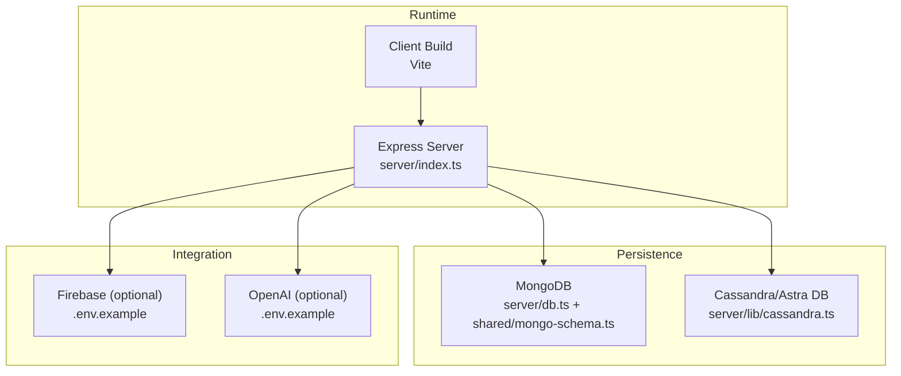
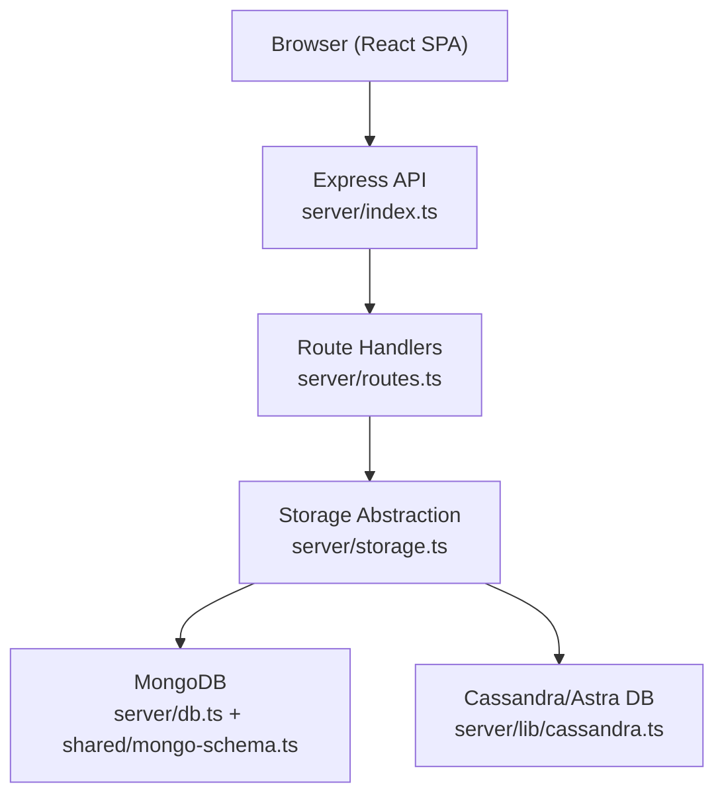
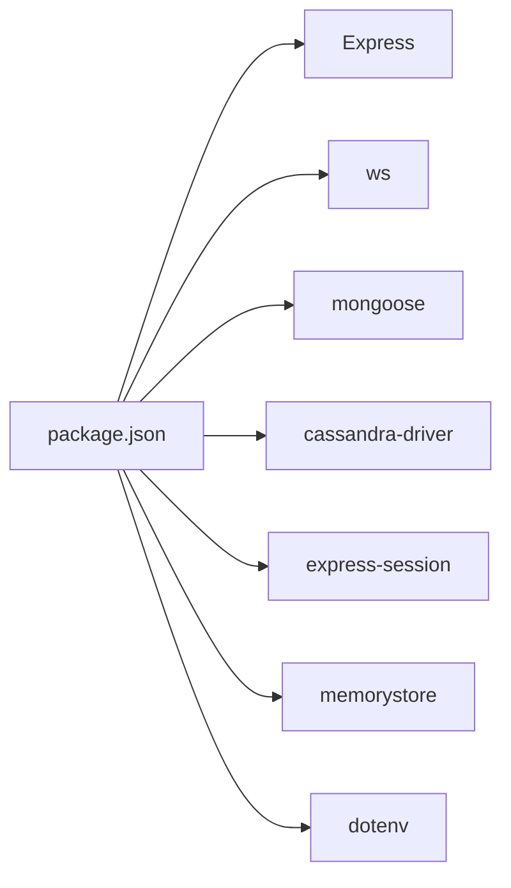
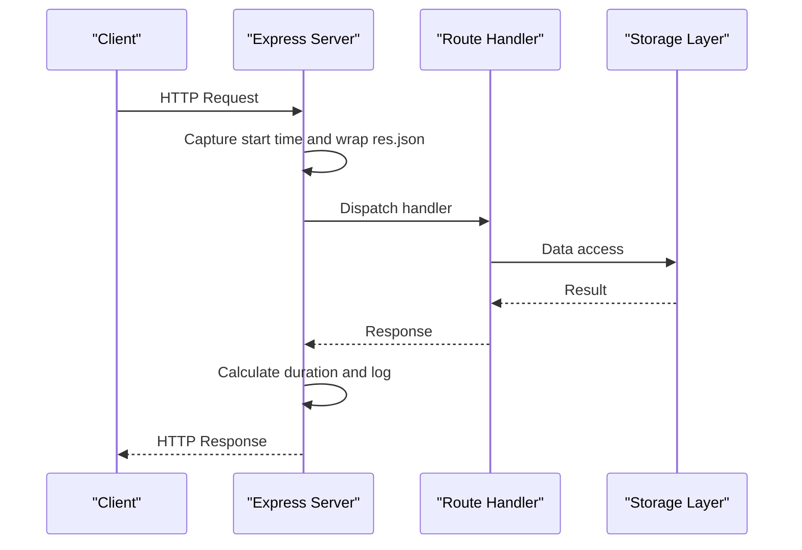
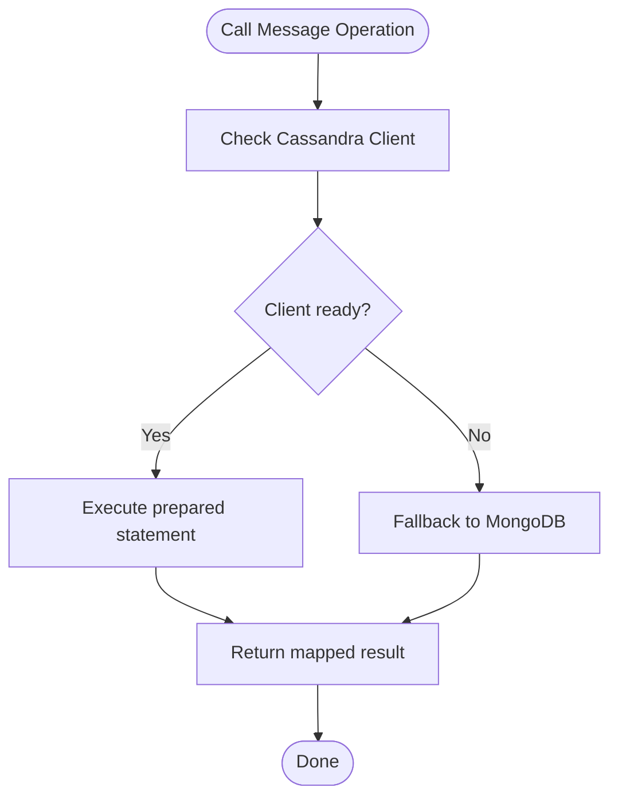

# Infrastructure & Monitoring

<cite>
**Referenced Files in This Document**
- [package.json](file://package.json)
- [Dockerfile](file://Dockerfile)
- [docker-compose.yml](file://docker-compose.yml)
- [.env.example](file://.env.example)
- [vercel.json](file://vercel.json)
- [LOCAL_SETUP.md](file://LOCAL_SETUP.md)
- [server/index.ts](file://server/index.ts)
- [server/routes.ts](file://server/routes.ts)
- [server/storage.ts](file://server/storage.ts)
- [server/db.ts](file://server/db.ts)
- [server/lib/cassandra.ts](file://server/lib/cassandra.ts)
- [server/lib/cassandra-message-store.ts](file://server/lib/cassandra-message-store.ts)
- [server/messagepal/cassandra-message-store.ts](file://server/messagepal/cassandra-message-store.ts)
- [shared/mongo-schema.ts](file://shared/mongo-schema.ts)
- [shared/cassandra-schema.ts](file://shared/cassandra-schema.ts)
- [server/middleware.ts](file://server/middleware.ts)
</cite>

## Table of Contents
1. [Introduction](#introduction)
2. [Project Structure](#project-structure)
3. [Core Components](#core-components)
4. [Architecture Overview](#architecture-overview)
5. [Detailed Component Analysis](#detailed-component-analysis)
6. [Dependency Analysis](#dependency-analysis)
7. [Performance Considerations](#performance-considerations)
8. [Troubleshooting Guide](#troubleshooting-guide)
9. [Conclusion](#conclusion)
10. [Appendices](#appendices)

## Introduction
This document provides comprehensive infrastructure and monitoring guidance for PersonalLearningPro. It covers system requirements, deployment options, database monitoring, application performance monitoring, security controls, capacity planning, autoscaling, and cost monitoring strategies. The goal is to help operators deploy, monitor, and scale the system reliably while maintaining strong security and observability.

## Project Structure
PersonalLearningPro is a full-stack application with:
- A Node.js/Express server serving both API and static assets
- A React client bundled via Vite
- Hybrid persistence using MongoDB for analytics and relational-like entities, and optional Cassandra/Astra DB for chat message history
- Optional Firebase and OpenAI integrations
- Containerized deployment via Docker and Compose
- Platform deployment via Vercel for Node runtime

**Diagram sources**
- [server/index.ts](file://server/index.ts#L1-L114)
- [server/db.ts](file://server/db.ts#L1-L21)
- [server/lib/cassandra.ts](file://server/lib/cassandra.ts#L1-L73)
- [shared/mongo-schema.ts](file://shared/mongo-schema.ts#L1-L159)
- [.env.example](file://.env.example#L1-L36)

**Section sources**
- [Dockerfile](file://Dockerfile#L1-L58)
- [docker-compose.yml](file://docker-compose.yml#L1-L24)
- [vercel.json](file://vercel.json#L1-L28)
- [LOCAL_SETUP.md](file://LOCAL_SETUP.md#L1-L136)

## Core Components
- Express server with JSON parsing, sessions, static file serving, and WebSocket integration
- Route handlers for authentication, tests, questions, attempts, answers, OCR, AI chat, and chat workspaces/channels/messages
- Storage abstraction layer that transparently uses MongoDB and optionally Cassandra for messages
- Database connectors for MongoDB and Cassandra/Astra DB
- Session store backed by an in-memory store with periodic cleanup

Key runtime and configuration touchpoints:
- Port exposure and environment handling
- Session cookie security flags
- Structured request logging with timing and response capture
- Graceful fallback when MongoDB is unavailable

**Section sources**
- [server/index.ts](file://server/index.ts#L1-L114)
- [server/routes.ts](file://server/routes.ts#L1-L800)
- [server/storage.ts](file://server/storage.ts#L1-L519)
- [server/db.ts](file://server/db.ts#L1-L21)
- [server/lib/cassandra.ts](file://server/lib/cassandra.ts#L1-L73)

## Architecture Overview
The system exposes a unified API and serves the client from a single process. Persistence is hybrid:
- MongoDB stores user, test, question, attempt, answer, analytics, workspace, channel, and message entities
- Cassandra/Astra DB stores chat messages with partitioning and clustering optimized for time-series reads

**Diagram sources**
- [server/index.ts](file://server/index.ts#L1-L114)
- [server/routes.ts](file://server/routes.ts#L1-L800)
- [server/storage.ts](file://server/storage.ts#L1-L519)
- [server/db.ts](file://server/db.ts#L1-L21)
- [server/lib/cassandra.ts](file://server/lib/cassandra.ts#L1-L73)

## Detailed Component Analysis

### System Requirements and Deployment Options
- Hardware
  - CPU: Minimum dual-core; recommended quad-core for concurrent builds and traffic
  - RAM: Minimum 4 GB; recommended 8 GB+ for development and production
  - Disk: SSD recommended; at least 10 GB free for app, databases, and logs
- Network
  - Single-port exposure: Application listens on port 5001
  - CORS and origin policies should be enforced at the platform/proxy level if fronting the app
- Database capacity planning
  - MongoDB: Scale vertically initially; consider sharding and replicas for high write/read loads
  - Cassandra: Provision nodes based on partition key distribution and replication factor; ensure adequate IOPS for message writes
- Deployment targets
  - Docker multi-stage build supports development, build, and production stages
  - docker-compose mounts source directories for hot reload during development
  - Vercel deployment configured for Node runtime and static assets

Operational notes:
- Port 5001 is exposed in both Docker and Vercel configurations
- Environment variables drive optional integrations and database connectivity

**Section sources**
- [Dockerfile](file://Dockerfile#L1-L58)
- [docker-compose.yml](file://docker-compose.yml#L1-L24)
- [vercel.json](file://vercel.json#L1-L28)
- [.env.example](file://.env.example#L1-L36)

### Database Monitoring: MongoDB
- Connectivity
  - TLS enabled for MongoDB connections
  - Non-fatal connection failure allows the server to continue operating without analytics/chat persistence
- Schema and indexing
  - Rich schema for analytics, user, test, question, attempt, answer, workspace, channel, and message entities
  - Indexes on frequently filtered fields (e.g., test assignments)
- Recommendations
  - Monitor connection pool health and retry logic
  - Track slow queries and missing indexes
  - Backups: Automated snapshots and point-in-time recovery; verify restore procedures regularly

**Section sources**
- [server/db.ts](file://server/db.ts#L1-L21)
- [shared/mongo-schema.ts](file://shared/mongo-schema.ts#L1-L159)

### Database Monitoring: Cassandra/Astra DB
- Connectivity
  - Secure connect bundle path, application token, and keyspace configured via environment variables
  - Client lazily initializes; warnings logged if credentials are incomplete
- Schema and secondary indexes
  - Messages table partitioned by channel_id and clustered by message_id (Snowflake)
  - Secondary index on is_pinned to optimize filtering
- Recommendations
  - Monitor Astra DB cluster health and replication lag
  - Optimize queries with ALLOW FILTERING sparingly; leverage partition key usage
  - Use prepared statements consistently (as implemented)
  - Backup verification: Validate schema and sample rows post-backup

**Section sources**
- [server/lib/cassandra.ts](file://server/lib/cassandra.ts#L1-L73)
- [server/lib/cassandra-message-store.ts](file://server/lib/cassandra-message-store.ts#L1-L166)
- [server/messagepal/cassandra-message-store.ts](file://server/messagepal/cassandra-message-store.ts#L1-L310)
- [.env.example](file://.env.example#L30-L36)

### Application Performance Monitoring
- Built-in request logging
  - Middleware captures request method, path, status, duration, and response payload (truncated) for /api paths
- Session security
  - Cookie flags set based on environment; SESSION_SECRET required in production
- Recommendations
  - Integrate structured logging (e.g., Winston/Pino) with correlation IDs
  - Add latency histograms and error rates per endpoint
  - Instrument WebSocket message handling and AI/OpenAI calls
  - Track memory usage and garbage collection metrics

**Section sources**
- [server/index.ts](file://server/index.ts#L46-L74)
- [server/index.ts](file://server/index.ts#L30-L44)

### Security Controls
- Transport security
  - MongoDB TLS enabled
  - Session cookies marked secure in production
- Access control
  - Session-based authentication middleware
  - Role-based checks for privileged operations
- Secrets management
  - Environment variables for Firebase, OpenAI, MongoDB, and Cassandra credentials
  - SESSION_SECRET mandatory in production

Recommendations:
- Enforce HTTPS termination at ingress/proxy
- Rotate secrets periodically; restrict access to environment files
- Audit session store usage and consider Redis/Memcached for distributed deployments

**Section sources**
- [server/db.ts](file://server/db.ts#L10-L14)
- [server/index.ts](file://server/index.ts#L30-L44)
- [server/middleware.ts](file://server/middleware.ts#L1-L18)
- [.env.example](file://.env.example#L1-L36)

### Capacity Planning and Autoscaling
- Horizontal scaling
  - Stateless API: scale replicas behind a load balancer
  - Sticky sessions: avoid if possible; otherwise use session affinity
- Vertical scaling
  - Increase CPU/RAM for Node.js process; ensure database clusters keep pace
- Database scaling
  - MongoDB: replica sets, sharding, read replicas
  - Cassandra: add nodes, tune replication factor, monitor repair jobs
- Autoscaling triggers
  - Target CPU utilization and queue depth for message processing
  - Database read/write latency and connection pool exhaustion

[No sources needed since this section provides general guidance]

### Cost Monitoring Strategies
- Compute costs
  - Track container CPU/memory usage; right-size instances
- Storage costs
  - Monitor database storage growth and archival policies
- Egress and API costs
  - Track outbound bandwidth and third-party API usage (OpenAI/Firebase)
- Observability costs
  - Centralized logs and metrics retention budgets

[No sources needed since this section provides general guidance]

## Dependency Analysis
The server composes multiple libraries and integrations. The most relevant for infrastructure and monitoring:

**Diagram sources**
- [package.json](file://package.json#L12-L87)

Operational implications:
- Express and ws power the HTTP and WebSocket servers
- Mongoose connects to MongoDB; cassandra-driver connects to Cassandra/Astra DB
- express-session and memorystore manage session state
- dotenv loads environment variables

**Section sources**
- [package.json](file://package.json#L12-L87)

## Performance Considerations
- Logging overhead
  - Response payload capture adds minor overhead; consider sampling in high-throughput environments
- Database access patterns
  - Cassandra queries use prepared statements and partition keys; avoid ALLOW FILTERING on large partitions
  - MongoDB indexes support frequent filters; monitor slow queries
- Session store
  - Memory-based store suitable for small deployments; consider Redis for production scale

[No sources needed since this section provides general guidance]

## Troubleshooting Guide
Common operational issues and remedies:
- MongoDB connectivity failures
  - Non-fatal connection allows partial functionality; verify TLS settings and credentials
- Cassandra initialization
  - Missing secure bundle/token/keyspace prevents client creation; confirm environment variables
- Session cookie problems in production
  - Ensure SESSION_SECRET is set; cookies marked secure only over HTTPS
- Port conflicts
  - Default port 5001; adjust in development as needed

**Section sources**
- [server/db.ts](file://server/db.ts#L1-L21)
- [server/lib/cassandra.ts](file://server/lib/cassandra.ts#L1-L73)
- [server/index.ts](file://server/index.ts#L30-L44)
- [LOCAL_SETUP.md](file://LOCAL_SETUP.md#L112-L136)

## Conclusion
PersonalLearningPro’s infrastructure is designed for flexibility and incremental adoption of persistence and integrations. By implementing robust logging, database monitoring, security hardening, and capacity planning, operators can achieve reliable, scalable, and observable operations. Start with the provided Docker and Vercel configurations, then layer in centralized observability and autoscaling.

[No sources needed since this section summarizes without analyzing specific files]

## Appendices

### API Logging Flow

**Diagram sources**
- [server/index.ts](file://server/index.ts#L46-L74)
- [server/routes.ts](file://server/routes.ts#L1-L800)
- [server/storage.ts](file://server/storage.ts#L1-L519)

### Cassandra Message Store Operations

**Diagram sources**
- [server/storage.ts](file://server/storage.ts#L413-L422)
- [server/lib/cassandra-message-store.ts](file://server/lib/cassandra-message-store.ts#L36-L75)
- [server/lib/cassandra.ts](file://server/lib/cassandra.ts#L6-L30)