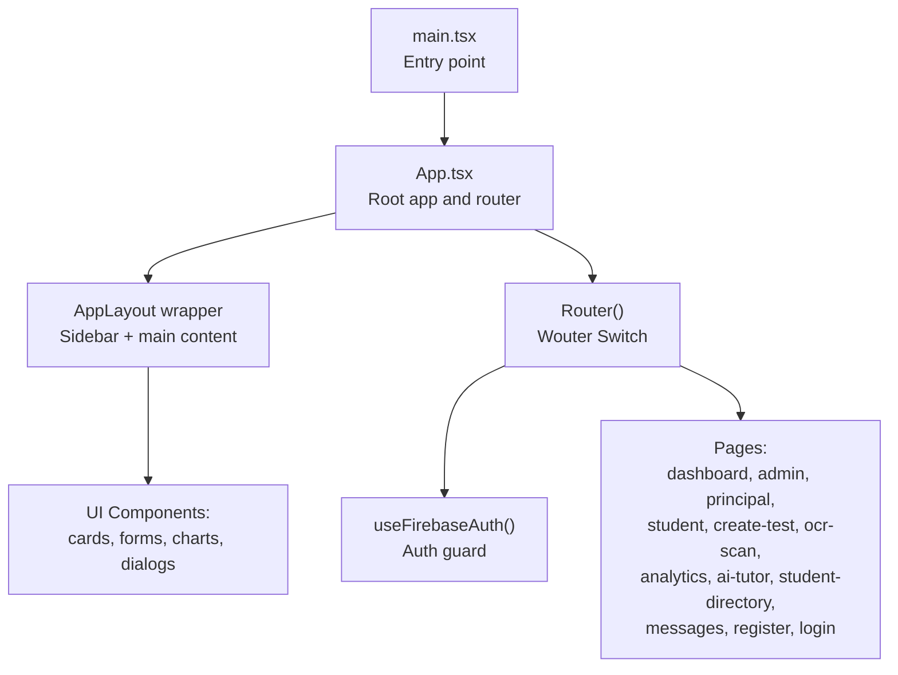
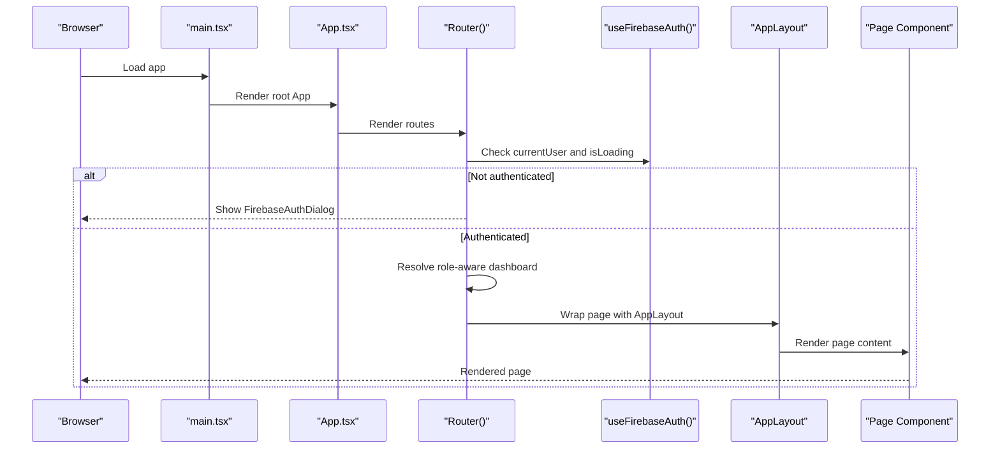
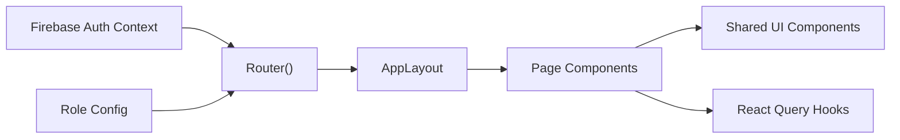

# Page Components

<cite>
**Referenced Files in This Document**
- [App.tsx](file://client/src/App.tsx)
- [main.tsx](file://client/src/main.tsx)
- [config.ts](file://client/src/config.ts)
- [dashboard.tsx](file://client/src/pages/dashboard.tsx)
- [admin-dashboard.tsx](file://client/src/pages/admin-dashboard.tsx)
- [principal-dashboard.tsx](file://client/src/pages/principal-dashboard.tsx)
- [student-dashboard.tsx](file://client/src/pages/student-dashboard.tsx)
- [LoginPage.tsx](file://client/src/pages/LoginPage.tsx)
- [register.tsx](file://client/src/pages/register.tsx)
- [create-test.tsx](file://client/src/pages/create-test.tsx)
- [ocr-scan.tsx](file://client/src/pages/ocr-scan.tsx)
- [analytics.tsx](file://client/src/pages/analytics.tsx)
- [ai-tutor.tsx](file://client/src/pages/ai-tutor.tsx)
- [student-directory.tsx](file://client/src/pages/student-directory.tsx)
- [messages.tsx](file://client/src/pages/messages.tsx)
</cite>

## Table of Contents
1. [Introduction](#introduction)
2. [Project Structure](#project-structure)
3. [Core Components](#core-components)
4. [Architecture Overview](#architecture-overview)
5. [Detailed Component Analysis](#detailed-component-analysis)
6. [Dependency Analysis](#dependency-analysis)
7. [Performance Considerations](#performance-considerations)
8. [Troubleshooting Guide](#troubleshooting-guide)
9. [Conclusion](#conclusion)
10. [Appendices](#appendices)

## Introduction
This document provides a comprehensive guide to PersonalLearningPro’s page-level components and routing structure. It covers all major pages including dashboards, authentication pages, assessment interfaces, and administrative panels. The documentation explains page composition, route protection and role-based access control, page lifecycle and data fetching patterns, integration with application state, and page-specific features such as forms, data visualization, and real-time capabilities. It also details routing configuration, navigation patterns, transitions, performance optimization strategies, and SEO considerations for educational content management.

## Project Structure
The client-side application is organized around a single-page app built with a lightweight router and a layout wrapper. Pages are grouped under a dedicated pages directory and composed from reusable UI components. Authentication is enforced at the routing level, and a layout wrapper applies consistent spacing and sidebar integration across pages.

**Diagram sources**
- [main.tsx](file://client/src/main.tsx#L1-L8)
- [App.tsx](file://client/src/App.tsx#L1-L165)

**Section sources**
- [main.tsx](file://client/src/main.tsx#L1-L8)
- [App.tsx](file://client/src/App.tsx#L1-L165)

## Core Components
- Root application and routing:
  - The application initializes React DOM and mounts the root App component.
  - App sets up providers for theme, Firebase authentication, React Query, and a global toast system.
  - A layout wrapper applies a sidebar and responsive main content area with configurable full-width mode.
  - Router enforces authentication checks and selects role-aware dashboards; otherwise, it renders the authentication dialog.
- Page wrappers:
  - Module-level memoized wrappers apply AppLayout to each page, ensuring consistent margins and responsiveness.
- Role-aware routing:
  - The root route resolves to a role-specific dashboard determined by the authenticated user’s profile.
  - Explicit routes are provided for each dashboard and feature page.

Key implementation references:
- Application bootstrap and providers: [main.tsx](file://client/src/main.tsx#L1-L8), [App.tsx](file://client/src/App.tsx#L152-L163)
- Layout wrapper and page wrappers: [App.tsx](file://client/src/App.tsx#L34-L78)
- Router and auth guard: [App.tsx](file://client/src/App.tsx#L93-L150)
- Role mapping and selection: [App.tsx](file://client/src/App.tsx#L113-L124)

**Section sources**
- [main.tsx](file://client/src/main.tsx#L1-L8)
- [App.tsx](file://client/src/App.tsx#L34-L163)

## Architecture Overview
The routing architecture uses a lightweight router to manage page-level navigation and enforce authentication. Pages are grouped by functional domain and share common UI components. Data fetching is integrated via React Query hooks within pages, and state is managed through React hooks and persisted where applicable (e.g., AI chat history).

**Diagram sources**
- [main.tsx](file://client/src/main.tsx#L1-L8)
- [App.tsx](file://client/src/App.tsx#L93-L150)

**Section sources**
- [App.tsx](file://client/src/App.tsx#L93-L150)

## Detailed Component Analysis

### Dashboards

#### Teacher Dashboard
- Composition:
  - Header with breadcrumbs and action buttons.
  - Stats cards, quick actions grid, class schedule, recent tests table, performance chart, AI insights, top students, notifications, and resource suggestions.
- Data fetching:
  - Uses React Query to fetch notifications; currently disabled via query configuration.
- Lifecycle:
  - Renders immediately after authentication; no explicit lifecycle hooks are used.
- Features:
  - Interactive quick actions with gradient cards and links.
  - Embedded charts and tables for performance and analytics.
  - Breadcrumb navigation and responsive layout.

References:
- [dashboard.tsx](file://client/src/pages/dashboard.tsx#L44-L338)

**Section sources**
- [dashboard.tsx](file://client/src/pages/dashboard.tsx#L44-L338)

#### Student Dashboard
- Composition:
  - Hero session card, quick actions, today’s schedule, live rooms, subject progress, upcoming tests, recent results, achievements, and analytics.
- Data fetching:
  - Uses React Query for student data; currently disabled via query configuration.
- Lifecycle:
  - Initializes state for UI toggles and renders with animations.
- Features:
  - Subject-specific theming and progress bars.
  - Live room indicators with participant counts and roles.
  - Achievement badges and streak counters.

References:
- [student-dashboard.tsx](file://client/src/pages/student-dashboard.tsx#L123-L1001)

**Section sources**
- [student-dashboard.tsx](file://client/src/pages/student-dashboard.tsx#L123-L1001)

#### Principal Dashboard
- Composition:
  - Stats grid, tabs for Academic, Staff, Finance, and Infrastructure, charts for performance and distribution, and events/notifications.
- Data fetching:
  - Uses React Query for data; currently disabled via query configuration.
- Features:
  - Bar charts and pie charts for academic and staff metrics.
  - Tabs for segmented content and responsive layouts.

References:
- [principal-dashboard.tsx](file://client/src/pages/principal-dashboard.tsx#L44-L365)

**Section sources**
- [principal-dashboard.tsx](file://client/src/pages/principal-dashboard.tsx#L44-L365)

#### Admin Dashboard
- Composition:
  - Tabs for User Management, Class Management, Reports & Analytics, and System Settings.
  - Static summaries and lists with action controls.
- Data fetching:
  - No active data fetching in this component.
- Features:
  - Grid-based summaries and tabbed navigation.

References:
- [admin-dashboard.tsx](file://client/src/pages/admin-dashboard.tsx#L29-L302)

**Section sources**
- [admin-dashboard.tsx](file://client/src/pages/admin-dashboard.tsx#L29-L302)

### Authentication Pages

#### Login Page
- Composition:
  - Form with email and password fields, validation, and submit handling.
- Validation:
  - Client-side validation for required fields and format.
- Accessibility:
  - Proper labeling, aria attributes, and focus management.
- Navigation:
  - Integrates with the rest of the app via routing; not directly exposed in the main Router.

References:
- [LoginPage.tsx](file://client/src/pages/LoginPage.tsx#L7-L112)

**Section sources**
- [LoginPage.tsx](file://client/src/pages/LoginPage.tsx#L7-L112)

#### Registration Page
- Composition:
  - Multi-step form with react-hook-form and Zod validation.
  - Role-dependent fields (class for student, subject for teacher).
- Lifecycle:
  - Submits registration to Firebase auth context and navigates to dashboard on success.
- Features:
  - Dynamic form fields based on selected role.

References:
- [register.tsx](file://client/src/pages/register.tsx#L50-L338)

**Section sources**
- [register.tsx](file://client/src/pages/register.tsx#L50-L338)

### Assessment Interfaces

#### Create Test
- Composition:
  - Multi-tab UI: Test Details, Add Questions, Settings & Review.
  - Conditional enabling of tabs based on test creation state.
- Lifecycle:
  - Manages local state for active tab, test ID, and question order.
- Features:
  - Delegated child components for test details and question creation.

References:
- [create-test.tsx](file://client/src/pages/create-test.tsx#L15-L122)

**Section sources**
- [create-test.tsx](file://client/src/pages/create-test.tsx#L15-L122)

#### OCR Scan
- Composition:
  - Upload card, processing card, and optional confidence analysis card.
- State:
  - Maintains OCR text and confidence level.
- Features:
  - Conditional rendering of confidence analysis with progress bar and tips.

References:
- [ocr-scan.tsx](file://client/src/pages/ocr-scan.tsx#L13-L96)

**Section sources**
- [ocr-scan.tsx](file://client/src/pages/ocr-scan.tsx#L13-L96)

#### Analytics
- Composition:
  - Performance charts, top students panel, and AI-generated insights tabs.
- Data fetching:
  - Uses React Query for data; currently disabled via query configuration.
- Features:
  - Pie charts and responsive containers for visualizations.

References:
- [analytics.tsx](file://client/src/pages/analytics.tsx#L22-L177)

**Section sources**
- [analytics.tsx](file://client/src/pages/analytics.tsx#L22-L177)

### AI Tutor
- Composition:
  - Collapsible conversation history sidebar, chat interface, and tabs for Explain, Solve, Visualize.
- State and persistence:
  - Conversations stored in localStorage; supports creating, switching, and updating conversations.
- API integration:
  - Sends messages to an AI chat endpoint via a shared query client.
- Features:
  - Real-time-like chat experience with loading states and error handling.

References:
- [ai-tutor.tsx](file://client/src/pages/ai-tutor.tsx#L60-L604)

**Section sources**
- [ai-tutor.tsx](file://client/src/pages/ai-tutor.tsx#L60-L604)

### Student Directory
- Composition:
  - Search input, filters (standard, state, group), and tabbed display by standard groups.
- Data fetching:
  - Uses React Query for student data; currently disabled via query configuration.
- Features:
  - Mock data for demonstration; filtering and grouping logic.

References:
- [student-directory.tsx](file://client/src/pages/student-directory.tsx#L69-L453)

**Section sources**
- [student-directory.tsx](file://client/src/pages/student-directory.tsx#L69-L453)

### Messages
- Composition:
  - Full-screen chat layout component.
- Integration:
  - Leverages role-based chat context provided by the chat layout.

References:
- [messages.tsx](file://client/src/pages/messages.tsx#L8-L15)

**Section sources**
- [messages.tsx](file://client/src/pages/messages.tsx#L8-L15)

## Dependency Analysis
- Routing and guards:
  - Router depends on Firebase auth context to decide whether to show the auth dialog or the role-aware dashboard.
  - Page wrappers depend on AppLayout for consistent spacing and sidebar integration.
- Data fetching:
  - Pages use React Query hooks; queries are configured per page and can be enabled/disabled as needed.
- UI components:
  - Pages compose reusable UI components (cards, forms, tabs, charts) from the shared component library.
- Role configuration:
  - Role-specific data mapping is centralized for demonstration and can be extended to backend-provided profiles.

**Diagram sources**
- [App.tsx](file://client/src/App.tsx#L93-L150)
- [config.ts](file://client/src/config.ts#L1-L8)

**Section sources**
- [App.tsx](file://client/src/App.tsx#L93-L150)
- [config.ts](file://client/src/config.ts#L1-L8)

## Performance Considerations
- Lazy loading:
  - Routes are pre-wrapped at module level to avoid recreating components on each render. Consider dynamic imports for heavy pages to defer bundle load.
- Rendering:
  - Use React.memo and useMemo for expensive computations within pages.
  - Virtualize long lists (e.g., student directory) to reduce DOM nodes.
- Data fetching:
  - Enable queries only when needed; leverage queryClient invalidation and background refetch strategies.
- Charts and media:
  - Lazy-load chart libraries and images; defer heavy visualizations until visible.
- Hydration and SSR:
  - For SEO, consider server-side rendering or static generation for public pages; keep interactive pages client-rendered.

[No sources needed since this section provides general guidance]

## Troubleshooting Guide
- Authentication issues:
  - Ensure Firebase auth context is initialized before Router renders. Verify that the auth dialog appears when unauthenticated.
- Route resolution:
  - Confirm that the root route resolves to the correct role-aware dashboard. Check the role mapping logic in Router.
- Data fetching:
  - If queries do not load, verify query keys and enabled flags. Ensure queryClient is configured globally.
- Forms and validation:
  - For registration and login, check form submission callbacks and error handling. Validate client-side constraints.
- Chat and real-time:
  - For AI tutor, confirm API endpoint availability and network connectivity. Inspect localStorage persistence for conversations.

**Section sources**
- [App.tsx](file://client/src/App.tsx#L93-L150)
- [register.tsx](file://client/src/pages/register.tsx#L70-L86)
- [LoginPage.tsx](file://client/src/pages/LoginPage.tsx#L40-L52)
- [ai-tutor.tsx](file://client/src/pages/ai-tutor.tsx#L122-L191)

## Conclusion
PersonalLearningPro’s page-level architecture emphasizes role-aware routing, consistent layout wrapping, and modular UI components. Authentication is enforced at the routing layer, and pages integrate React Query for data fetching. The dashboards provide rich, role-specific experiences with charts and actionable insights. Assessment interfaces and administrative panels offer focused workflows tailored to educators and administrators. By applying lazy loading, virtualization, and careful query configuration, the application can maintain strong performance and scalability.

[No sources needed since this section summarizes without analyzing specific files]

## Appendices

### Routing Configuration and Navigation Patterns
- Root route resolves to a role-aware dashboard based on user profile.
- Explicit routes for dashboards and feature pages.
- Navigation uses a lightweight router with a layout wrapper for consistent spacing and sidebar integration.

References:
- [App.tsx](file://client/src/App.tsx#L113-L149)

**Section sources**
- [App.tsx](file://client/src/App.tsx#L113-L149)

### Role-Based Access Control
- Role mapping is handled in Router to select the appropriate dashboard component.
- Role-specific data mapping is available for demonstration and can be extended to backend-provided profiles.

References:
- [App.tsx](file://client/src/App.tsx#L113-L124)
- [config.ts](file://client/src/config.ts#L1-L8)

**Section sources**
- [App.tsx](file://client/src/App.tsx#L113-L124)
- [config.ts](file://client/src/config.ts#L1-L8)

### Page-Specific Features
- Forms:
  - Registration uses react-hook-form and Zod validation; login uses manual validation.
- Data visualization:
  - Dashboards and analytics use chart libraries for performance and distribution insights.
- Real-time updates:
  - AI tutor simulates real-time chat with loading states and error handling.

References:
- [register.tsx](file://client/src/pages/register.tsx#L50-L338)
- [LoginPage.tsx](file://client/src/pages/LoginPage.tsx#L7-L112)
- [analytics.tsx](file://client/src/pages/analytics.tsx#L22-L177)
- [ai-tutor.tsx](file://client/src/pages/ai-tutor.tsx#L60-L604)

**Section sources**
- [register.tsx](file://client/src/pages/register.tsx#L50-L338)
- [LoginPage.tsx](file://client/src/pages/LoginPage.tsx#L7-L112)
- [analytics.tsx](file://client/src/pages/analytics.tsx#L22-L177)
- [ai-tutor.tsx](file://client/src/pages/ai-tutor.tsx#L60-L604)