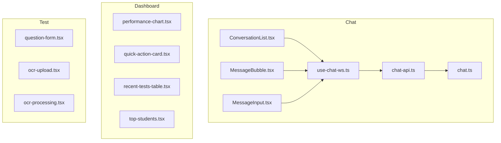
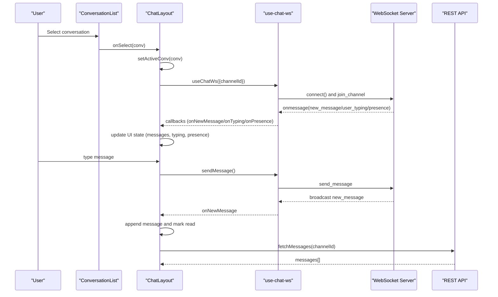
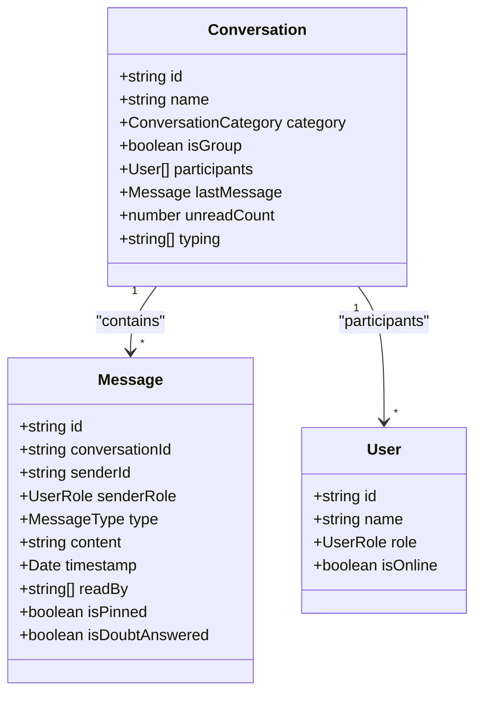
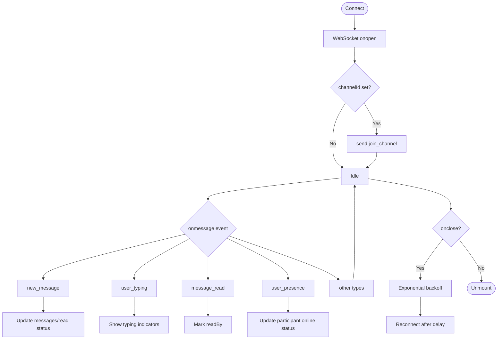
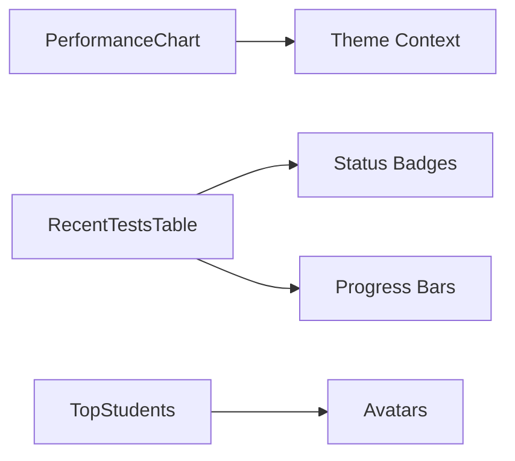
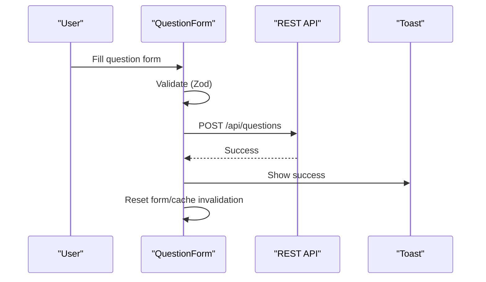
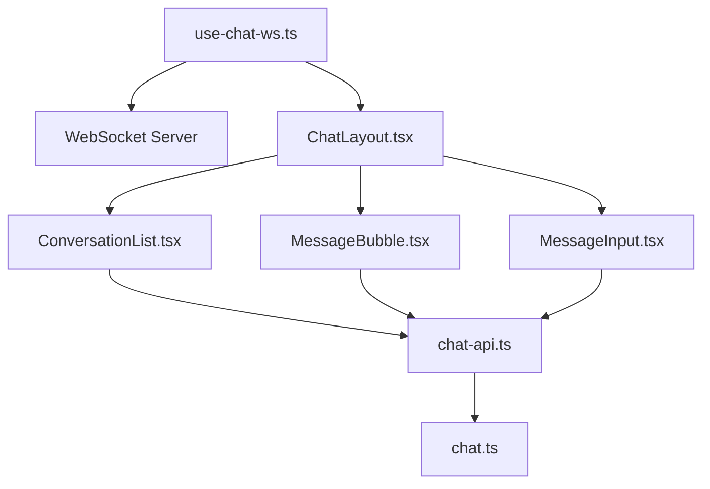

# Specialized Educational Components

<cite>
**Referenced Files in This Document**
- [ChatLayout.tsx](file://client/src/components/chat/ChatLayout.tsx)
- [ConversationList.tsx](file://client/src/components/chat/ConversationList.tsx)
- [MessageBubble.tsx](file://client/src/components/chat/MessageBubble.tsx)
- [MessageInput.tsx](file://client/src/components/chat/MessageInput.tsx)
- [use-chat-ws.ts](file://client/src/hooks/use-chat-ws.ts)
- [chat-api.ts](file://client/src/lib/chat-api.ts)
- [chat.ts](file://client/src/types/chat.ts)
- [performance-chart.tsx](file://client/src/components/dashboard/performance-chart.tsx)
- [quick-action-card.tsx](file://client/src/components/dashboard/quick-action-card.tsx)
- [recent-tests-table.tsx](file://client/src/components/dashboard/recent-tests-table.tsx)
- [top-students.tsx](file://client/src/components/dashboard/top-students.tsx)
- [question-form.tsx](file://client/src/components/test/question-form.tsx)
- [ocr-upload.tsx](file://client/src/components/test/ocr-upload.tsx)
- [ocr-processing.tsx](file://client/src/components/test/ocr-processing.tsx)
</cite>

## Table of Contents
1. [Introduction](#introduction)
2. [Project Structure](#project-structure)
3. [Core Components](#core-components)
4. [Architecture Overview](#architecture-overview)
5. [Detailed Component Analysis](#detailed-component-analysis)
6. [Dependency Analysis](#dependency-analysis)
7. [Performance Considerations](#performance-considerations)
8. [Troubleshooting Guide](#troubleshooting-guide)
9. [Conclusion](#conclusion)
10. [Appendices](#appendices)

## Introduction
This document describes PersonalLearningPro’s specialized educational components for the learning platform ecosystem. It focuses on:
- Real-time chat: messaging, conversation management, presence, and typing indicators
- Dashboard: performance charts, quick actions, recent tests, and top performers
- Test management: question creation, OCR upload and processing, and assessment workflows
- MessagePal AI integration: WebSocket communication patterns and UI panel
- State management, real-time synchronization, and educational UX patterns
- Reusability, customization, and integration with the broader educational platform

## Project Structure
The components are organized by feature areas:
- Chat: UI and WebSocket integration for real-time messaging
- Dashboard: analytics and quick action cards
- Test: assessment creation and OCR workflows
- MessagePal: AI assistant panel and WebSocket hooks
- Shared: types, APIs, and hooks used across components

**Diagram sources**
- [ConversationList.tsx](file://client/src/components/chat/ConversationList.tsx#L1-L162)
- [MessageBubble.tsx](file://client/src/components/chat/MessageBubble.tsx#L1-L157)
- [MessageInput.tsx](file://client/src/components/chat/MessageInput.tsx#L1-L143)
- [use-chat-ws.ts](file://client/src/hooks/use-chat-ws.ts#L1-L218)
- [chat-api.ts](file://client/src/lib/chat-api.ts#L1-L112)
- [chat.ts](file://client/src/types/chat.ts#L1-L83)
- [performance-chart.tsx](file://client/src/components/dashboard/performance-chart.tsx#L1-L98)
- [quick-action-card.tsx](file://client/src/components/dashboard/quick-action-card.tsx#L1-L39)
- [recent-tests-table.tsx](file://client/src/components/dashboard/recent-tests-table.tsx#L1-L234)
- [top-students.tsx](file://client/src/components/dashboard/top-students.tsx#L1-L74)
- [question-form.tsx](file://client/src/components/test/question-form.tsx#L1-L390)
- [ocr-upload.tsx](file://client/src/components/test/ocr-upload.tsx#L1-L309)
- [ocr-processing.tsx](file://client/src/components/test/ocr-processing.tsx#L1-L219)

**Section sources**
- [ChatLayout.tsx](file://client/src/components/chat/ChatLayout.tsx#L1-L185)
- [ConversationList.tsx](file://client/src/components/chat/ConversationList.tsx#L1-L162)
- [MessageBubble.tsx](file://client/src/components/chat/MessageBubble.tsx#L1-L157)
- [MessageInput.tsx](file://client/src/components/chat/MessageInput.tsx#L1-L143)
- [use-chat-ws.ts](file://client/src/hooks/use-chat-ws.ts#L1-L218)
- [chat-api.ts](file://client/src/lib/chat-api.ts#L1-L112)
- [chat.ts](file://client/src/types/chat.ts#L1-L83)
- [performance-chart.tsx](file://client/src/components/dashboard/performance-chart.tsx#L1-L98)
- [quick-action-card.tsx](file://client/src/components/dashboard/quick-action-card.tsx#L1-L39)
- [recent-tests-table.tsx](file://client/src/components/dashboard/recent-tests-table.tsx#L1-L234)
- [top-students.tsx](file://client/src/components/dashboard/top-students.tsx#L1-L74)
- [question-form.tsx](file://client/src/components/test/question-form.tsx#L1-L390)
- [ocr-upload.tsx](file://client/src/components/test/ocr-upload.tsx#L1-L309)
- [ocr-processing.tsx](file://client/src/components/test/ocr-processing.tsx#L1-L219)

## Core Components
- ChatLayout orchestrates conversation discovery, selection, and real-time thread rendering
- ConversationList groups and filters conversations by category and role-aware metadata
- MessageBubble renders rich message types (text, image, announcement, assignment, doubt)
- MessageInput supports text, doubt tagging, file attachments, and quick actions
- use-chat-ws encapsulates WebSocket lifecycle, event routing, and reconnection logic
- chat-api provides typed REST clients for channels, DMs, messages, and uploads
- Dashboard components visualize performance, recent tests, and top students
- Test components support question creation and OCR scanning/evaluation
- Types define consistent shapes for messages, conversations, and users

**Section sources**
- [ChatLayout.tsx](file://client/src/components/chat/ChatLayout.tsx#L1-L185)
- [ConversationList.tsx](file://client/src/components/chat/ConversationList.tsx#L1-L162)
- [MessageBubble.tsx](file://client/src/components/chat/MessageBubble.tsx#L1-L157)
- [MessageInput.tsx](file://client/src/components/chat/MessageInput.tsx#L1-L143)
- [use-chat-ws.ts](file://client/src/hooks/use-chat-ws.ts#L1-L218)
- [chat-api.ts](file://client/src/lib/chat-api.ts#L1-L112)
- [chat.ts](file://client/src/types/chat.ts#L1-L83)
- [performance-chart.tsx](file://client/src/components/dashboard/performance-chart.tsx#L1-L98)
- [quick-action-card.tsx](file://client/src/components/dashboard/quick-action-card.tsx#L1-L39)
- [recent-tests-table.tsx](file://client/src/components/dashboard/recent-tests-table.tsx#L1-L234)
- [top-students.tsx](file://client/src/components/dashboard/top-students.tsx#L1-L74)
- [question-form.tsx](file://client/src/components/test/question-form.tsx#L1-L390)
- [ocr-upload.tsx](file://client/src/components/test/ocr-upload.tsx#L1-L309)
- [ocr-processing.tsx](file://client/src/components/test/ocr-processing.tsx#L1-L219)

## Architecture Overview
The chat system integrates REST and WebSocket layers:
- REST endpoints supply conversation metadata and messages
- WebSocket maintains real-time updates for new messages, typing, read receipts, and presence
- UI components coordinate selection, rendering, and user actions

**Diagram sources**
- [ConversationList.tsx](file://client/src/components/chat/ConversationList.tsx#L102-L151)
- [ChatLayout.tsx](file://client/src/components/chat/ChatLayout.tsx#L129-L132)
- [use-chat-ws.ts](file://client/src/hooks/use-chat-ws.ts#L95-L162)
- [chat-api.ts](file://client/src/lib/chat-api.ts#L75-L83)

## Detailed Component Analysis

### Chat System Components
- ChatLayout
  - Resolves workspaces, channels, and DMs via REST queries
  - Converts server channels to UI conversations with categories and participant metadata
  - Manages active conversation and mobile responsiveness
  - Initializes a shared WebSocket connection scoped to the active channel
- ConversationList
  - Filters and groups conversations by category (announcements, classes, teachers, friends, parents)
  - Renders avatars, online indicators, unread counts, and last message previews
  - Uses role-aware user IDs and last message ownership to tailor UI
- MessageBubble
  - Renders rich message types with role-specific styles and badges
  - Handles announcement banners, assignment cards, system notices, and doubt states
  - Supports pinned messages, mentions, and media previews
- MessageInput
  - Supports doubt tagging for students and quick actions for teachers
  - Uploads files via REST and sends them as messages
  - Integrates with WebSocket typing events and read receipts

**Diagram sources**
- [chat.ts](file://client/src/types/chat.ts#L69-L82)
- [chat.ts](file://client/src/types/chat.ts#L34-L57)
- [chat.ts](file://client/src/types/chat.ts#L59-L67)

**Section sources**
- [ChatLayout.tsx](file://client/src/components/chat/ChatLayout.tsx#L1-L185)
- [ConversationList.tsx](file://client/src/components/chat/ConversationList.tsx#L1-L162)
- [MessageBubble.tsx](file://client/src/components/chat/MessageBubble.tsx#L1-L157)
- [MessageInput.tsx](file://client/src/components/chat/MessageInput.tsx#L1-L143)
- [chat.ts](file://client/src/types/chat.ts#L1-L83)

### Real-Time Messaging and Presence
- WebSocket events handled:
  - new_message: append to thread and update read status
  - user_typing: show typing indicators per conversation
  - message_read: update readBy lists and UI badges
  - user_presence: set participant online/offline status
- Reconnection strategy:
  - Exponential backoff with capped delay
  - Graceful closure on component unmount
  - Unauthorized disconnects (code 4001) do not trigger reconnect

**Diagram sources**
- [use-chat-ws.ts](file://client/src/hooks/use-chat-ws.ts#L95-L162)
- [use-chat-ws.ts](file://client/src/hooks/use-chat-ws.ts#L180-L195)
- [use-chat-ws.ts](file://client/src/hooks/use-chat-ws.ts#L144-L157)

**Section sources**
- [use-chat-ws.ts](file://client/src/hooks/use-chat-ws.ts#L1-L218)

### Dashboard Components
- PerformanceChart
  - Renders bar charts comparing class vs school averages
  - Uses theme-aware colors and responsive container
  - Includes skeleton loader and mock data fallback
- QuickActionCard
  - Provides role-driven shortcuts with icons and link targets
- RecentTestsTable
  - Lists tests with status badges, completion progress, and actions
  - Uses skeleton loaders while fetching data
- TopStudents
  - Displays top-performing students with avatars and scores
  - Includes skeleton loader and mock data fallback

**Diagram sources**
- [performance-chart.tsx](file://client/src/components/dashboard/performance-chart.tsx#L21-L98)
- [quick-action-card.tsx](file://client/src/components/dashboard/quick-action-card.tsx#L14-L39)
- [recent-tests-table.tsx](file://client/src/components/dashboard/recent-tests-table.tsx#L33-L150)
- [top-students.tsx](file://client/src/components/dashboard/top-students.tsx#L14-L55)

**Section sources**
- [performance-chart.tsx](file://client/src/components/dashboard/performance-chart.tsx#L1-L98)
- [quick-action-card.tsx](file://client/src/components/dashboard/quick-action-card.tsx#L1-L39)
- [recent-tests-table.tsx](file://client/src/components/dashboard/recent-tests-table.tsx#L1-L234)
- [top-students.tsx](file://client/src/components/dashboard/top-students.tsx#L1-L74)

### Test Management Components
- QuestionForm
  - Zod-based validation for question types (MCQ, short, long, numerical)
  - Dynamic options for MCQ with correctness flags
  - AI rubric support for short/long answers
  - Mutation-based submission with toast feedback and cache invalidation
- OCRUpload
  - Drag-and-drop file upload with progress tracking
  - Validates file size/type and reads as base64
  - Calls OCR endpoint and updates state with recognized text and confidence
- OCRProcessing
  - Displays recognized answers with confidence levels
  - Allows editing recognized text and evaluating via AI
  - Provides “Review All” action and status summary

**Diagram sources**
- [question-form.tsx](file://client/src/components/test/question-form.tsx#L77-L126)
- [question-form.tsx](file://client/src/components/test/question-form.tsx#L162-L204)

**Section sources**
- [question-form.tsx](file://client/src/components/test/question-form.tsx#L1-L390)
- [ocr-upload.tsx](file://client/src/components/test/ocr-upload.tsx#L1-L309)
- [ocr-processing.tsx](file://client/src/components/test/ocr-processing.tsx#L1-L219)

### MessagePal AI Integration
- MessagePal panel and WebSocket hook enable AI-assisted chat experiences
- WebSocket patterns mirror the chat system: connect on mount, join channel, route events, reconnect with backoff
- UI panel integrates with the chat thread and leverages presence/typing indicators for conversational context

[No sources needed since this section summarizes integration patterns without analyzing specific files]

## Dependency Analysis
- UI-to-API
  - REST endpoints for workspaces, channels, DMs, messages, and uploads
  - Typed interfaces ensure consistency between server and UI
- UI-to-WebSocket
  - use-chat-ws centralizes connection, event routing, and lifecycle
  - Components depend on stable callback refs to avoid stale closures
- Cross-feature dependencies
  - Dashboard components rely on TanStack Query for data fetching
  - Test components integrate with toast notifications and query cache invalidation

**Diagram sources**
- [use-chat-ws.ts](file://client/src/hooks/use-chat-ws.ts#L65-L217)
- [ChatLayout.tsx](file://client/src/components/chat/ChatLayout.tsx#L1-L185)
- [ConversationList.tsx](file://client/src/components/chat/ConversationList.tsx#L1-L162)
- [MessageBubble.tsx](file://client/src/components/chat/MessageBubble.tsx#L1-L157)
- [MessageInput.tsx](file://client/src/components/chat/MessageInput.tsx#L1-L143)
- [chat-api.ts](file://client/src/lib/chat-api.ts#L1-L112)
- [chat.ts](file://client/src/types/chat.ts#L1-L83)

**Section sources**
- [chat-api.ts](file://client/src/lib/chat-api.ts#L1-L112)
- [chat.ts](file://client/src/types/chat.ts#L1-L83)
- [use-chat-ws.ts](file://client/src/hooks/use-chat-ws.ts#L1-L218)

## Performance Considerations
- Debounce and memoization
  - Conversation merging and grouping computed via useMemo to avoid unnecessary re-renders
- Efficient list rendering
  - Virtualized lists recommended for large message histories
- Network optimization
  - Stale-time caching for REST queries; minimal retries
- WebSocket backoff
  - Exponential backoff prevents thundering herd on server restarts
- Rendering cost
  - Conditional rendering of expensive UI (charts, OCR previews) based on visibility

[No sources needed since this section provides general guidance]

## Troubleshooting Guide
- WebSocket errors
  - Unauthorized disconnects (code 4001) halt reconnection attempts
  - On-close exponential backoff ensures resilience
- Upload failures
  - Validate file size/type before initiating upload
  - Show user-friendly toast messages for errors
- Data fetching
  - REST client throws on non-OK responses; surface errors via toasts
  - Enable skeleton loaders while data is pending

**Section sources**
- [use-chat-ws.ts](file://client/src/hooks/use-chat-ws.ts#L144-L157)
- [chat-api.ts](file://client/src/lib/chat-api.ts#L44-L55)
- [ocr-upload.tsx](file://client/src/components/test/ocr-upload.tsx#L102-L120)
- [question-form.tsx](file://client/src/components/test/question-form.tsx#L119-L125)

## Conclusion
PersonalLearningPro’s educational components combine robust real-time messaging, role-aware dashboards, and intelligent test workflows. The chat system’s WebSocket-first design, strong typing, and reusable hooks enable scalable, maintainable UI. Dashboard and test components emphasize performance, accessibility, and clear feedback loops. Together, these components form a cohesive foundation for an adaptive learning platform.

[No sources needed since this section summarizes without analyzing specific files]

## Appendices
- State management patterns
  - Local component state for UI flags (mobile view, doubt mode)
  - Global query cache for server data; invalidate on mutations
- Customization options
  - Theming via theme context affects chart and component visuals
  - Role-aware UI toggles for student/teacher/parent perspectives
- Integration touchpoints
  - REST endpoints for metadata and uploads
  - WebSocket endpoints for real-time collaboration and presence

[No sources needed since this section provides general guidance]