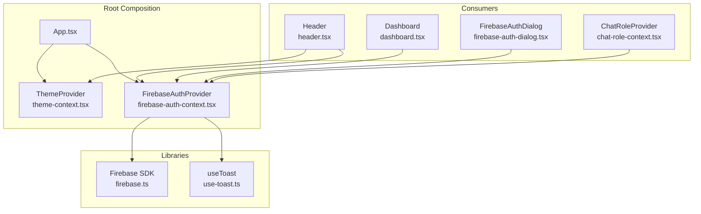
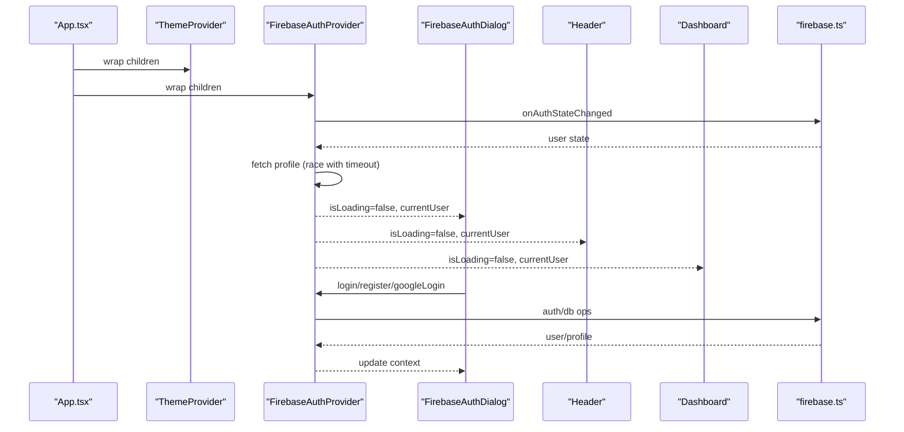
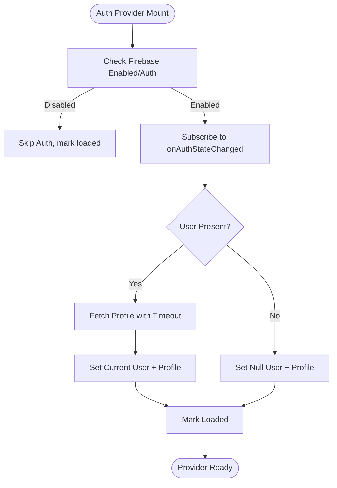
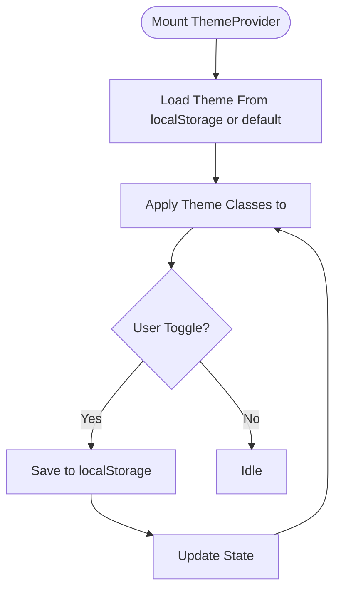
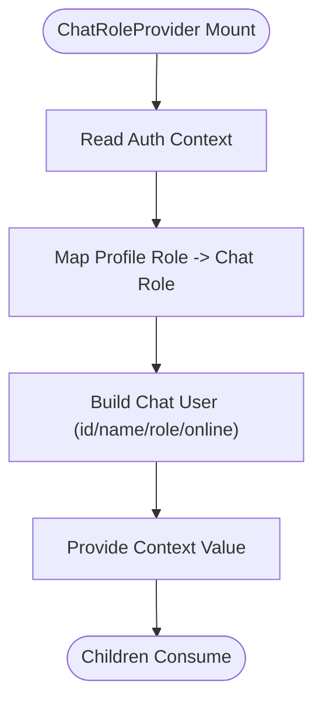
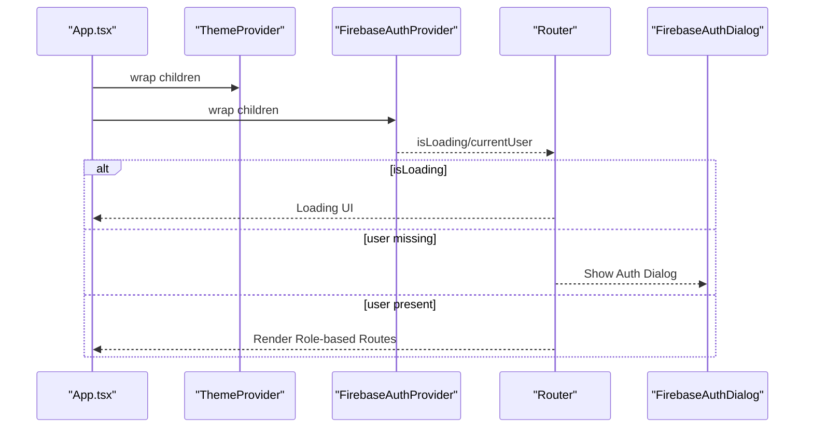
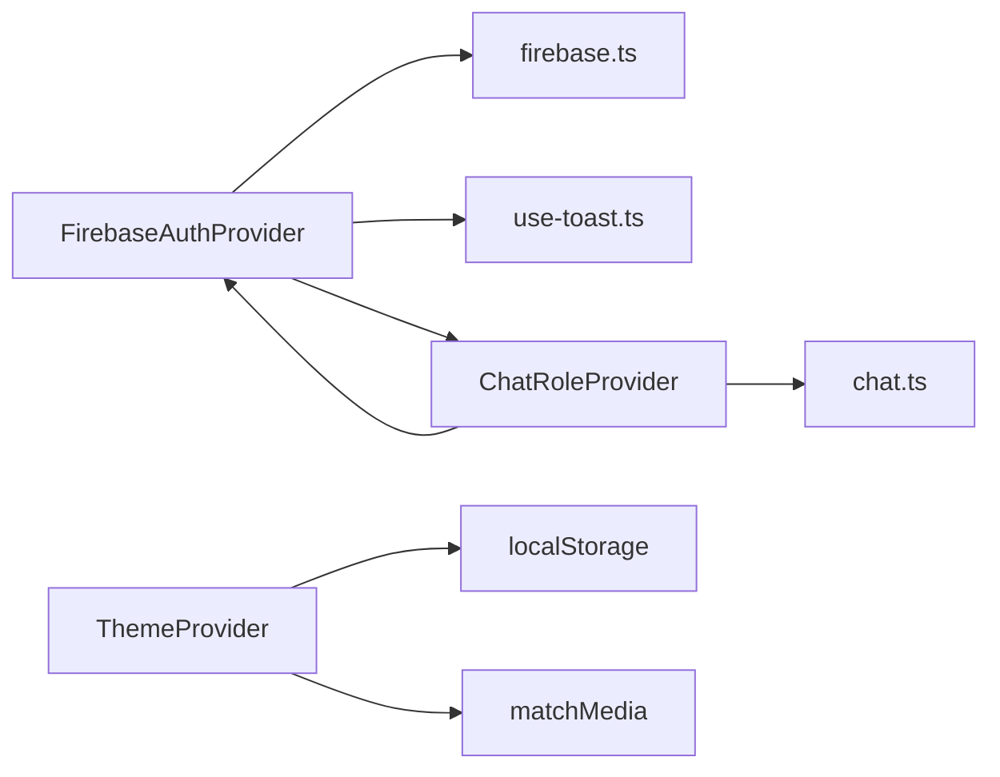

# Context Providers

<cite>
**Referenced Files in This Document**
- [firebase-auth-context.tsx](file://client/src/contexts/firebase-auth-context.tsx)
- [theme-context.tsx](file://client/src/contexts/theme-context.tsx)
- [chat-role-context.tsx](file://client/src/contexts/chat-role-context.tsx)
- [firebase.ts](file://client/src/lib/firebase.ts)
- [App.tsx](file://client/src/App.tsx)
- [firebase-auth-dialog.tsx](file://client/src/components/auth/firebase-auth-dialog.tsx)
- [header.tsx](file://client/src/components/layout/header.tsx)
- [theme-toggle.tsx](file://client/src/components/ui/theme-toggle.tsx)
- [dashboard.tsx](file://client/src/pages/dashboard.tsx)
- [chat.ts](file://client/src/types/chat.ts)
- [use-toast.ts](file://client/src/hooks/use-toast.ts)
</cite>

## Table of Contents
1. [Introduction](#introduction)
2. [Project Structure](#project-structure)
3. [Core Components](#core-components)
4. [Architecture Overview](#architecture-overview)
5. [Detailed Component Analysis](#detailed-component-analysis)
6. [Dependency Analysis](#dependency-analysis)
7. [Performance Considerations](#performance-considerations)
8. [Troubleshooting Guide](#troubleshooting-guide)
9. [Conclusion](#conclusion)
10. [Appendices](#appendices)

## Introduction
This document explains PersonalLearningPro’s context provider system with a focus on:
- FirebaseAuthProvider: authentication state management, user profile handling, and Firebase integration patterns
- ThemeContext: UI theming with dark/light mode switching and persistent theme preferences
- ChatRoleContext: managing real-time communication preferences and user roles derived from authentication

It covers provider composition patterns, error boundary handling, context value optimization, performance considerations for frequently updated contexts, and memory leak prevention. Practical usage examples across different component hierarchies are included.

## Project Structure
The context providers are organized under client/src/contexts and integrate with Firebase under client/src/lib. The App component composes providers at the root, and individual components consume contexts via dedicated hooks.

**Diagram sources**
- [App.tsx](file://client/src/App.tsx#L152-L163)
- [theme-context.tsx](file://client/src/contexts/theme-context.tsx#L23-L63)
- [firebase-auth-context.tsx](file://client/src/contexts/firebase-auth-context.tsx#L38-L259)
- [header.tsx](file://client/src/components/layout/header.tsx#L32-L133)
- [dashboard.tsx](file://client/src/pages/dashboard.tsx#L44-L338)
- [firebase-auth-dialog.tsx](file://client/src/components/auth/firebase-auth-dialog.tsx#L39-L500)
- [chat-role-context.tsx](file://client/src/contexts/chat-role-context.tsx#L23-L52)
- [firebase.ts](file://client/src/lib/firebase.ts#L1-L212)
- [use-toast.ts](file://client/src/hooks/use-toast.ts#L171-L192)

**Section sources**
- [App.tsx](file://client/src/App.tsx#L152-L163)
- [theme-context.tsx](file://client/src/contexts/theme-context.tsx#L23-L63)
- [firebase-auth-context.tsx](file://client/src/contexts/firebase-auth-context.tsx#L38-L259)
- [chat-role-context.tsx](file://client/src/contexts/chat-role-context.tsx#L23-L52)

## Core Components
- FirebaseAuthProvider: centralizes authentication state, user profile fetching, and Firebase operations with graceful offline handling and toast-driven UX feedback.
- ThemeProvider: manages theme state, persists preferences to localStorage, and applies system theme detection.
- ChatRoleProvider: derives chat user identity and role from authenticated user profile, ensuring role consistency across chat UIs.

**Section sources**
- [firebase-auth-context.tsx](file://client/src/contexts/firebase-auth-context.tsx#L25-L36)
- [theme-context.tsx](file://client/src/contexts/theme-context.tsx#L11-L19)
- [chat-role-context.tsx](file://client/src/contexts/chat-role-context.tsx#L5-L11)

## Architecture Overview
The provider stack is composed at the application root. Consumers access contexts through dedicated hooks. Firebase integration is encapsulated in a library module that handles initialization, guards, and Firestore operations.

**Diagram sources**
- [App.tsx](file://client/src/App.tsx#L93-L150)
- [firebase-auth-context.tsx](file://client/src/contexts/firebase-auth-context.tsx#L43-L71)
- [firebase-auth-dialog.tsx](file://client/src/components/auth/firebase-auth-dialog.tsx#L98-L118)
- [firebase.ts](file://client/src/lib/firebase.ts#L66-L187)

## Detailed Component Analysis

### FirebaseAuthProvider
Implements authentication state management with:
- Initialization guard for Firebase availability
- Auth state subscription with profile fetching
- Offline-safe profile retrieval using a race between Firestore promise and a timeout
- Comprehensive action methods: login, register, Google login, complete Google registration, logout, and password reset
- Toast-driven UX feedback and consistent loading state management

Key implementation patterns:
- Context value memoization to avoid unnecessary re-renders
- Cleanup of auth listener on unmount
- Graceful degradation when Firebase is not configured
- Error handling with user-friendly toasts

**Diagram sources**
- [firebase-auth-context.tsx](file://client/src/contexts/firebase-auth-context.tsx#L43-L71)
- [firebase-auth-context.tsx](file://client/src/contexts/firebase-auth-context.tsx#L243-L252)
- [firebase.ts](file://client/src/lib/firebase.ts#L199-L212)

**Section sources**
- [firebase-auth-context.tsx](file://client/src/contexts/firebase-auth-context.tsx#L38-L259)
- [firebase.ts](file://client/src/lib/firebase.ts#L27-L45)
- [firebase.ts](file://client/src/lib/firebase.ts#L66-L187)
- [use-toast.ts](file://client/src/hooks/use-toast.ts#L171-L192)

### ThemeProvider
Manages theme state with:
- Persistent preference stored in localStorage
- System theme detection via media query
- Root class manipulation for theme application
- Controlled setter that updates both state and storage

**Diagram sources**
- [theme-context.tsx](file://client/src/contexts/theme-context.tsx#L29-L48)
- [theme-context.tsx](file://client/src/contexts/theme-context.tsx#L50-L56)

**Section sources**
- [theme-context.tsx](file://client/src/contexts/theme-context.tsx#L23-L63)
- [theme-toggle.tsx](file://client/src/components/ui/theme-toggle.tsx#L5-L20)

### ChatRoleProvider
Derives chat user identity and role from authenticated user profile:
- Maps Firebase user role to internal chat role type
- Constructs a stable chat user object with computed display name and online status
- Exposes currentRole and currentUser for chat UIs
- Ignores manual role changes since it is derived from auth

**Diagram sources**
- [chat-role-context.tsx](file://client/src/contexts/chat-role-context.tsx#L24-L49)
- [chat.ts](file://client/src/types/chat.ts#L1-L83)

**Section sources**
- [chat-role-context.tsx](file://client/src/contexts/chat-role-context.tsx#L23-L52)
- [chat.ts](file://client/src/types/chat.ts#L1-L83)

### Provider Composition Patterns
- Root composition in App wraps children with ThemeProvider and FirebaseAuthProvider
- Router conditionally renders authentication dialog while auth is loading or user is missing
- Route selection depends on user role from auth context

**Diagram sources**
- [App.tsx](file://client/src/App.tsx#L152-L163)
- [App.tsx](file://client/src/App.tsx#L93-L150)

**Section sources**
- [App.tsx](file://client/src/App.tsx#L152-L163)
- [App.tsx](file://client/src/App.tsx#L93-L150)

### Context Value Optimization
- FirebaseAuthProvider exposes a single context value object to minimize re-renders
- ChatRoleProvider uses useMemo to derive currentRole and chat user, preventing unnecessary recalculations when profile role does not change
- ThemeProvider uses a minimal state object with a setter function

Best practices demonstrated:
- Avoid spreading large objects into context; pass a single value object
- Use useMemo for derived values that depend on expensive computations or external data
- Keep context consumers focused on the specific fields they need

**Section sources**
- [firebase-auth-context.tsx](file://client/src/contexts/firebase-auth-context.tsx#L243-L252)
- [chat-role-context.tsx](file://client/src/contexts/chat-role-context.tsx#L26-L39)
- [theme-context.tsx](file://client/src/contexts/theme-context.tsx#L50-L56)

### Error Boundary Handling
- FirebaseAuthProvider catches errors during auth operations and displays user-friendly toasts
- Uses a timeout mechanism to prevent hanging when Firestore is offline
- Router handles loading and authentication states gracefully

Recommended patterns:
- Centralize error handling in providers and surface via toasts
- Provide fallback UIs (loading spinners, auth dialogs) while async operations complete
- Avoid throwing errors from providers; log and notify users instead

**Section sources**
- [firebase-auth-context.tsx](file://client/src/contexts/firebase-auth-context.tsx#L50-L68)
- [firebase-auth-context.tsx](file://client/src/contexts/firebase-auth-context.tsx#L84-L94)
- [App.tsx](file://client/src/App.tsx#L96-L111)

### Practical Usage Examples
- Header consumes ThemeContext to toggle theme and FirebaseAuthContext for user avatar and logout
- Dashboard consumes FirebaseAuthContext to personalize content and display user profile
- FirebaseAuthDialog consumes FirebaseAuthContext to perform login, register, and Google sign-in flows
- ChatRoleProvider ensures chat UIs reflect the authenticated user’s role consistently

**Section sources**
- [header.tsx](file://client/src/components/layout/header.tsx#L32-L133)
- [dashboard.tsx](file://client/src/pages/dashboard.tsx#L44-L338)
- [firebase-auth-dialog.tsx](file://client/src/components/auth/firebase-auth-dialog.tsx#L39-L500)
- [chat-role-context.tsx](file://client/src/contexts/chat-role-context.tsx#L23-L52)

## Dependency Analysis
- FirebaseAuthProvider depends on:
  - Firebase SDK for auth and Firestore
  - useToast hook for UX feedback
  - ChatRoleProvider for chat-specific role mapping
- ThemeProvider depends on:
  - localStorage for persistence
  - window.matchMedia for system theme detection
- ChatRoleProvider depends on:
  - FirebaseAuthContext for user profile
  - chat.ts for role and user types

**Diagram sources**
- [firebase-auth-context.tsx](file://client/src/contexts/firebase-auth-context.tsx#L1-L16)
- [firebase.ts](file://client/src/lib/firebase.ts#L1-L212)
- [use-toast.ts](file://client/src/hooks/use-toast.ts#L171-L192)
- [chat-role-context.tsx](file://client/src/contexts/chat-role-context.tsx#L2-L3)
- [chat.ts](file://client/src/types/chat.ts#L1-L83)
- [theme-context.tsx](file://client/src/contexts/theme-context.tsx#L33-L48)

**Section sources**
- [firebase-auth-context.tsx](file://client/src/contexts/firebase-auth-context.tsx#L1-L16)
- [theme-context.tsx](file://client/src/contexts/theme-context.tsx#L33-L48)
- [chat-role-context.tsx](file://client/src/contexts/chat-role-context.tsx#L2-L3)

## Performance Considerations
- Frequently updated contexts:
  - FirebaseAuthProvider’s context value is a single object; consumers should only subscribe to the fields they need
  - ChatRoleProvider uses useMemo to derive chat user and role; avoid passing new objects on each render
- Memory leak prevention:
  - FirebaseAuthProvider unsubscribes the auth listener on unmount
  - ThemeProvider does not introduce subscriptions; safe by design
- Offline resilience:
  - FirebaseAuthProvider uses a timeout when fetching profiles to avoid indefinite hangs
- Toast performance:
  - use-toast maintains a bounded toast queue and cleans timeouts on unmount

**Section sources**
- [firebase-auth-context.tsx](file://client/src/contexts/firebase-auth-context.tsx#L70-L71)
- [firebase-auth-context.tsx](file://client/src/contexts/firebase-auth-context.tsx#L54-L58)
- [use-toast.ts](file://client/src/hooks/use-toast.ts#L58-L72)
- [use-toast.ts](file://client/src/hooks/use-toast.ts#L174-L182)

## Troubleshooting Guide
Common issues and resolutions:
- Firebase not configured:
  - The app warns and disables auth features; ensure environment variables are set
- Auth state not updating:
  - Verify onAuthStateChanged subscription and that cleanup occurs on unmount
- Profile fetch failures:
  - The provider falls back to null profile and continues; check Firestore permissions and network connectivity
- Theme not persisting:
  - Confirm localStorage is writable and the storage key matches expectations
- Role mismatch in chat:
  - Ensure the user’s profile role is correctly mapped; ChatRoleProvider derives role from profile

**Section sources**
- [firebase.ts](file://client/src/lib/firebase.ts#L27-L45)
- [firebase-auth-context.tsx](file://client/src/contexts/firebase-auth-context.tsx#L50-L68)
- [theme-context.tsx](file://client/src/contexts/theme-context.tsx#L30-L31)
- [chat-role-context.tsx](file://client/src/contexts/chat-role-context.tsx#L17-L21)

## Conclusion
PersonalLearningPro’s context providers deliver a robust, resilient, and user-friendly foundation for authentication, theming, and chat roles. The design emphasizes:
- Clear separation of concerns across providers
- Strong error handling and graceful fallbacks
- Performance-conscious patterns like memoization and cleanup
- Practical composition at the application root with role-aware routing

These patterns provide a solid foundation for scalable UI development and can serve as a model for similar systems.

## Appendices
- Provider composition order matters: wrap children in ThemeProvider first, then FirebaseAuthProvider, and finally ChatRoleProvider where needed
- Keep context consumers small and focused to minimize re-renders
- Prefer useMemo for derived values and avoid passing new objects/functions down context unnecessarily