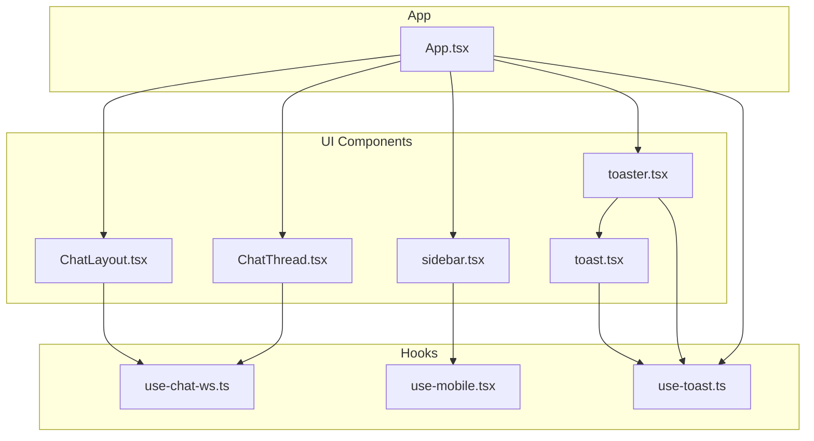
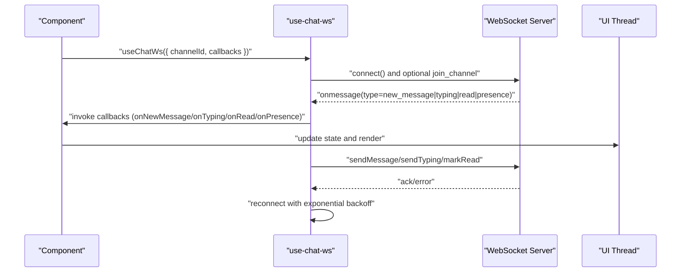
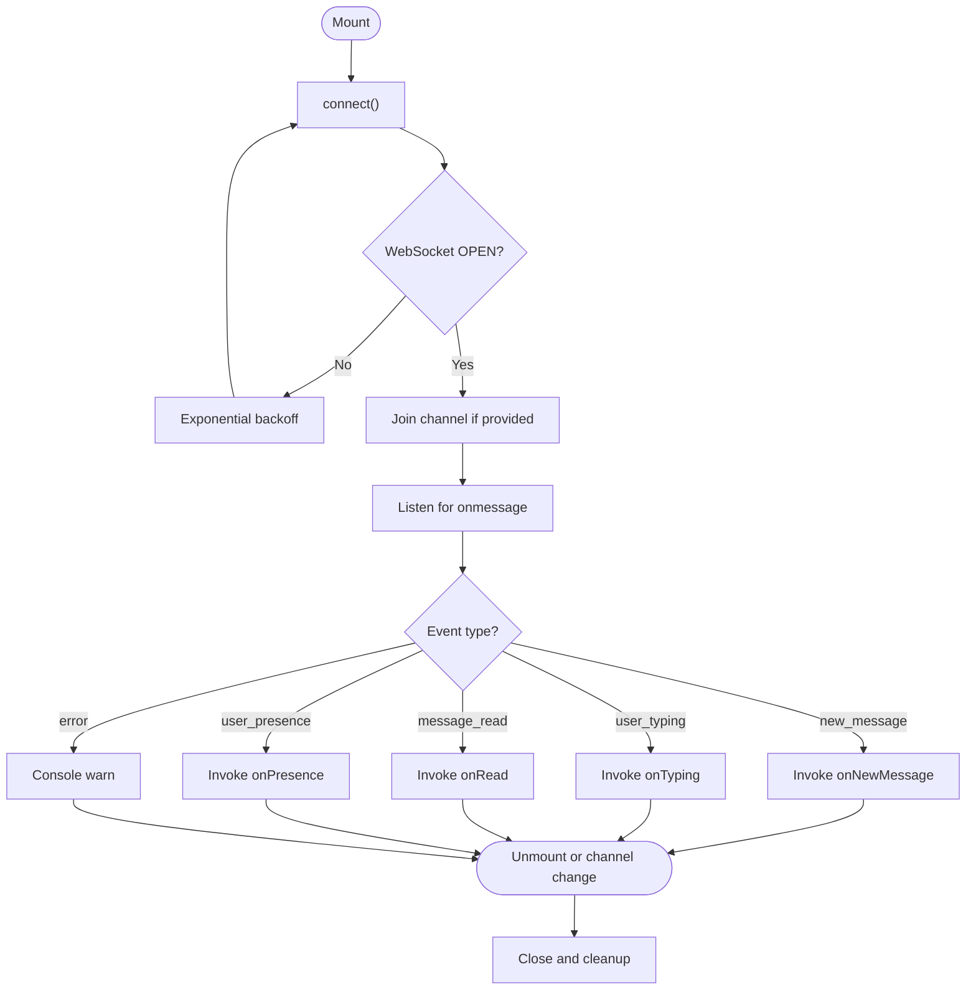
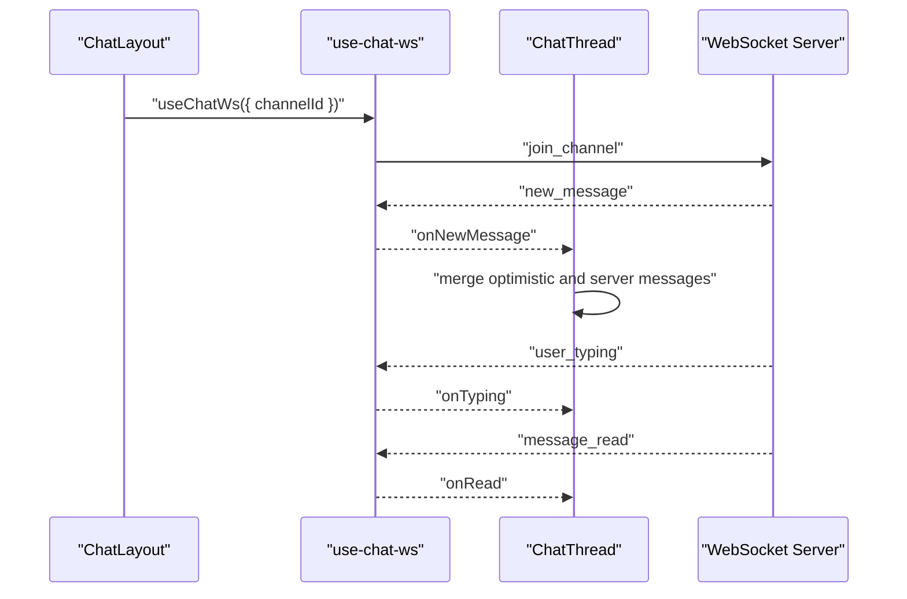
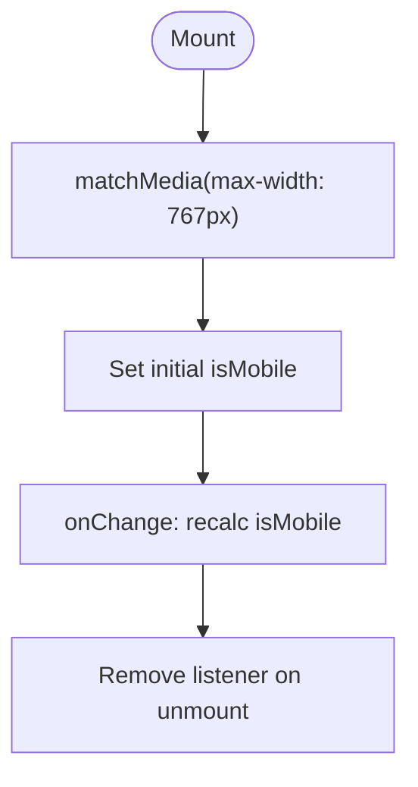
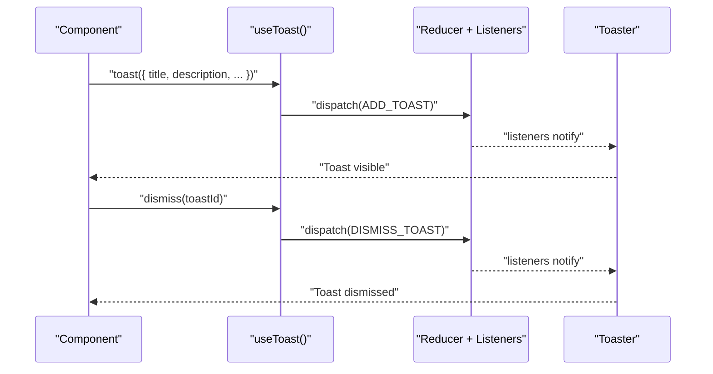
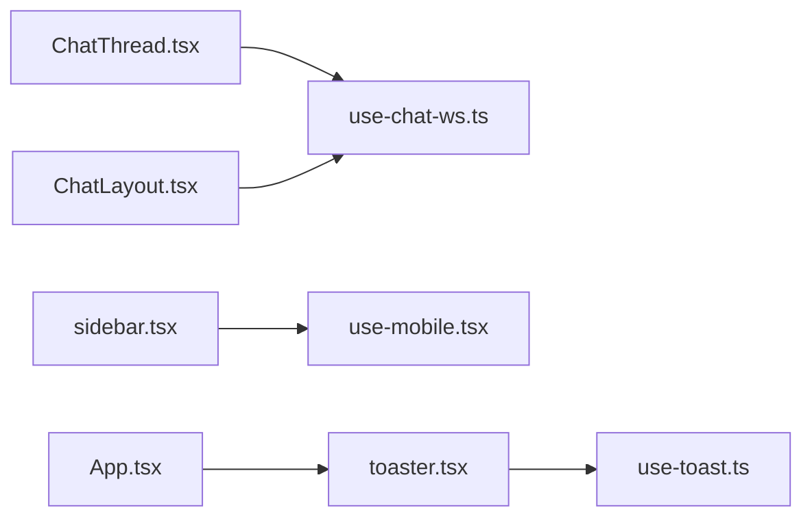

# Custom Hooks

<cite>
**Referenced Files in This Document**
- [use-chat-ws.ts](file://client/src/hooks/use-chat-ws.ts)
- [use-mobile.tsx](file://client/src/hooks/use-mobile.tsx)
- [use-toast.ts](file://client/src/hooks/use-toast.ts)
- [ChatLayout.tsx](file://client/src/components/chat/ChatLayout.tsx)
- [ChatThread.tsx](file://client/src/components/chat/ChatThread.tsx)
- [sidebar.tsx](file://client/src/components/ui/sidebar.tsx)
- [toaster.tsx](file://client/src/components/ui/toaster.tsx)
- [toast.tsx](file://client/src/components/ui/toast.tsx)
- [App.tsx](file://client/src/App.tsx)
- [ocr-processing.tsx](file://client/src/components/test/ocr-processing.tsx)
- [firebase-auth-context.tsx](file://client/src/contexts/firebase-auth-context.tsx)
</cite>

## Table of Contents
1. [Introduction](#introduction)
2. [Project Structure](#project-structure)
3. [Core Components](#core-components)
4. [Architecture Overview](#architecture-overview)
5. [Detailed Component Analysis](#detailed-component-analysis)
6. [Dependency Analysis](#dependency-analysis)
7. [Performance Considerations](#performance-considerations)
8. [Troubleshooting Guide](#troubleshooting-guide)
9. [Conclusion](#conclusion)
10. [Appendices](#appendices)

## Introduction
This document explains PersonalLearningPro’s custom hook architecture with a focus on:
- use-chat-ws: WebSocket connection management, real-time message handling, and connection state synchronization
- use-mobile: responsive design detection and mobile-specific UI adaptations
- use-toast: notification management and user feedback systems

It covers hook composition patterns, dependency management, performance optimizations, testing strategies, error handling, and integration with React’s rendering lifecycle. Practical usage examples are included to demonstrate how these hooks are applied across components.

## Project Structure
The hooks live under client/src/hooks and are consumed by UI components and pages. The App initializes providers and global UI elements, including the toast renderer.

**Diagram sources**
- [App.tsx](file://client/src/App.tsx#L152-L163)
- [ChatLayout.tsx](file://client/src/components/chat/ChatLayout.tsx#L125-L127)
- [ChatThread.tsx](file://client/src/components/chat/ChatThread.tsx#L68-L103)
- [sidebar.tsx](file://client/src/components/ui/sidebar.tsx#L67-L96)
- [toaster.tsx](file://client/src/components/ui/toaster.tsx#L11-L33)
- [toast.tsx](file://client/src/components/ui/toast.tsx#L1-L127)
- [use-chat-ws.ts](file://client/src/hooks/use-chat-ws.ts#L65-L217)
- [use-mobile.tsx](file://client/src/hooks/use-mobile.tsx#L5-L19)
- [use-toast.ts](file://client/src/hooks/use-toast.ts#L171-L189)

**Section sources**
- [App.tsx](file://client/src/App.tsx#L152-L163)

## Core Components
- use-chat-ws: Manages a WebSocket connection, joins/leaves channels, sends/receives typed events, reconnects with exponential backoff, and exposes typed helpers for messaging actions.
- use-mobile: Detects mobile viewport and adapts UI behavior accordingly.
- use-toast: Centralized toast manager with a Redux-like reducer, queue-based dismissal, and a provider-renderer pair.

**Section sources**
- [use-chat-ws.ts](file://client/src/hooks/use-chat-ws.ts#L65-L217)
- [use-mobile.tsx](file://client/src/hooks/use-mobile.tsx#L5-L19)
- [use-toast.ts](file://client/src/hooks/use-toast.ts#L171-L189)

## Architecture Overview
The hooks integrate with React components and providers to deliver real-time chat, responsive UI, and user feedback.

**Diagram sources**
- [use-chat-ws.ts](file://client/src/hooks/use-chat-ws.ts#L95-L162)
- [ChatThread.tsx](file://client/src/components/chat/ChatThread.tsx#L68-L103)

## Detailed Component Analysis

### use-chat-ws: WebSocket Hook
Purpose:
- Establish and maintain a WebSocket connection
- Join/leave channels dynamically
- Deliver typed incoming events to callbacks
- Provide typed helpers to send messages, typing indicators, and read receipts

Key behaviors:
- Connection lifecycle: connect on mount, close on unmount, and cancel pending reconnects
- Channel lifecycle: join on mount and leave on unmount; join/leave on channelId changes
- Reconnection: exponential backoff up to a cap, with special handling for unauthorized closures
- Event routing: parses JSON messages and dispatches to registered callbacks
- Public API: sendMessage, sendTyping, markRead

**Diagram sources**
- [use-chat-ws.ts](file://client/src/hooks/use-chat-ws.ts#L95-L162)
- [use-chat-ws.ts](file://client/src/hooks/use-chat-ws.ts#L164-L195)

Usage examples:
- ChatLayout establishes a long-lived connection bound to the active conversation channel.
- ChatThread consumes callbacks to synchronize UI state and integrates with a caching layer.

**Diagram sources**
- [ChatLayout.tsx](file://client/src/components/chat/ChatLayout.tsx#L125-L127)
- [ChatThread.tsx](file://client/src/components/chat/ChatThread.tsx#L68-L103)
- [use-chat-ws.ts](file://client/src/hooks/use-chat-ws.ts#L115-L142)

Best practices:
- Always pass a stable callback ref for event handlers to avoid stale closures
- Guard send operations by readiness state
- Use channel lifecycle effects to join/leave appropriately
- Respect unauthorized disconnects and avoid reconnect loops

**Section sources**
- [use-chat-ws.ts](file://client/src/hooks/use-chat-ws.ts#L65-L217)
- [ChatLayout.tsx](file://client/src/components/chat/ChatLayout.tsx#L125-L127)
- [ChatThread.tsx](file://client/src/components/chat/ChatThread.tsx#L68-L103)

### use-mobile: Responsive Detection Hook
Purpose:
- Detect whether the viewport width is below a mobile breakpoint
- Provide a boolean flag to adapt UI behavior

Implementation highlights:
- Uses matchMedia to track viewport changes
- Initializes state on mount and cleans up listeners on unmount
- Returns a boolean coerced value

**Diagram sources**
- [use-mobile.tsx](file://client/src/hooks/use-mobile.tsx#L8-L16)

Usage example:
- Sidebar uses the hook to decide between overlay modal and desktop sidebar behavior.

**Section sources**
- [use-mobile.tsx](file://client/src/hooks/use-mobile.tsx#L5-L19)
- [sidebar.tsx](file://client/src/components/ui/sidebar.tsx#L67-L96)

### use-toast: Notification Management Hook
Purpose:
- Provide a global toast notification system with a simple imperative API
- Manage toast lifecycle, limits, and dismissal queues

Core mechanics:
- Internal reducer manages a bounded list of toasts
- Queue-based removal timers per toast id
- Provider-renderer pattern: a dedicated component subscribes to state and renders Radix toast primitives

**Diagram sources**
- [use-toast.ts](file://client/src/hooks/use-toast.ts#L171-L189)
- [toaster.tsx](file://client/src/components/ui/toaster.tsx#L11-L33)
- [toast.tsx](file://client/src/components/ui/toast.tsx#L1-L127)

Usage examples:
- Authentication flows show success and error notifications after login/register/logout actions.
- OCR processing demonstrates success and informational toasts during user interactions.

**Section sources**
- [use-toast.ts](file://client/src/hooks/use-toast.ts#L171-L189)
- [toaster.tsx](file://client/src/components/ui/toaster.tsx#L11-L33)
- [toast.tsx](file://client/src/components/ui/toast.tsx#L1-L127)
- [firebase-auth-context.tsx](file://client/src/contexts/firebase-auth-context.tsx#L79-L90)
- [ocr-processing.tsx](file://client/src/components/test/ocr-processing.tsx#L49-L61)

## Dependency Analysis
- use-chat-ws depends on:
  - React refs and effects for connection lifecycle
  - WebSocket API for transport
  - Optional external caching layer (React Query) in consumers
- use-mobile depends on:
  - matchMedia for responsive queries
- use-toast depends on:
  - React state and effects for subscription
  - Radix UI toast primitives for rendering

**Diagram sources**
- [ChatThread.tsx](file://client/src/components/chat/ChatThread.tsx#L68-L103)
- [ChatLayout.tsx](file://client/src/components/chat/ChatLayout.tsx#L125-L127)
- [sidebar.tsx](file://client/src/components/ui/sidebar.tsx#L67-L96)
- [toaster.tsx](file://client/src/components/ui/toaster.tsx#L11-L33)
- [use-toast.ts](file://client/src/hooks/use-toast.ts#L171-L189)
- [App.tsx](file://client/src/App.tsx#L152-L163)

**Section sources**
- [ChatThread.tsx](file://client/src/components/chat/ChatThread.tsx#L68-L103)
- [ChatLayout.tsx](file://client/src/components/chat/ChatLayout.tsx#L125-L127)
- [sidebar.tsx](file://client/src/components/ui/sidebar.tsx#L67-L96)
- [toaster.tsx](file://client/src/components/ui/toaster.tsx#L11-L33)
- [use-toast.ts](file://client/src/hooks/use-toast.ts#L171-L189)
- [App.tsx](file://client/src/App.tsx#L152-L163)

## Performance Considerations
- use-chat-ws
  - Uses memoized callbacks and refs to avoid stale closures and unnecessary re-renders
  - Limits reconnection attempts with exponential backoff to reduce resource contention
  - Guards send operations by ready state to prevent errors and wasted work
- use-mobile
  - Efficiently tracks media queries and updates only on change events
- use-toast
  - Limits concurrent toasts to a small number
  - Queues removal timers per toast id to avoid global re-renders on dismissal

[No sources needed since this section provides general guidance]

## Troubleshooting Guide
- use-chat-ws
  - Unauthorized disconnects (code 4001) halt reconnection attempts; verify authentication and session validity
  - If messages do not appear, confirm the channel id is set and the connection is open before sending
  - For stale callbacks, ensure event handlers are passed via refs and updated on each render
- use-mobile
  - If the hook does not reflect viewport changes, verify the media query listener is attached and cleaned up
- use-toast
  - If toasts do not dismiss automatically, check that the global timer queue is initialized and timers are scheduled
  - If multiple toasts overlap, confirm the limit is enforced and older toasts are removed

**Section sources**
- [use-chat-ws.ts](file://client/src/hooks/use-chat-ws.ts#L144-L157)
- [use-mobile.tsx](file://client/src/hooks/use-mobile.tsx#L8-L16)
- [use-toast.ts](file://client/src/hooks/use-toast.ts#L58-L72)

## Conclusion
These hooks encapsulate cross-cutting concerns—real-time communication, responsive behavior, and user feedback—into reusable, composable units. They leverage React patterns (refs, effects, callbacks) and integrate cleanly with UI providers and external libraries. Following the recommended patterns ensures predictable behavior, robust error handling, and optimal performance.

[No sources needed since this section summarizes without analyzing specific files]

## Appendices

### Hook Composition Patterns
- use-chat-ws
  - Compose with UI components that require real-time updates
  - Combine with caching libraries to reconcile optimistic and server data
- use-mobile
  - Compose with layout components to switch between mobile and desktop modes
- use-toast
  - Compose with any component needing user feedback, especially in async flows

[No sources needed since this section provides general guidance]

### Testing Strategies
- use-chat-ws
  - Mock WebSocket and intercept send calls to assert payload correctness
  - Simulate onmessage events to verify callback invocation
  - Test reconnection behavior by simulating close events with different codes
- use-mobile
  - Mock matchMedia and simulate viewport resize events
- use-toast
  - Assert reducer transitions and listener updates
  - Verify toast limits and automatic dismissal timers

[No sources needed since this section provides general guidance]

### Integration with React Lifecycle
- All hooks rely on useEffect for side effects and cleanup
- Callback refs ensure event handlers remain current across renders
- Provider-renderer pattern for toasts ensures global state updates are reflected immediately

**Section sources**
- [use-chat-ws.ts](file://client/src/hooks/use-chat-ws.ts#L74-L82)
- [use-toast.ts](file://client/src/hooks/use-toast.ts#L171-L189)
- [toaster.tsx](file://client/src/components/ui/toaster.tsx#L11-L33)