# State Management

<cite>
**Referenced Files in This Document**
- [App.tsx](file://client/src/App.tsx)
- [firebase-auth-context.tsx](file://client/src/contexts/firebase-auth-context.tsx)
- [theme-context.tsx](file://client/src/contexts/theme-context.tsx)
- [chat-role-context.tsx](file://client/src/contexts/chat-role-context.tsx)
- [queryClient.ts](file://client/src/lib/queryClient.ts)
- [use-chat-ws.ts](file://client/src/hooks/use-chat-ws.ts)
- [firebase.ts](file://client/src/lib/firebase.ts)
- [chat-api.ts](file://client/src/lib/chat-api.ts)
- [mockData.ts](file://client/src/data/mockData.ts)
- [ChatLayout.tsx](file://client/src/components/chat/ChatLayout.tsx)
- [firebase-auth-dialog.tsx](file://client/src/components/auth/firebase-auth-dialog.tsx)
- [LoginPage.tsx](file://client/src/pages/LoginPage.tsx)
- [use-toast.ts](file://client/src/hooks/use-toast.ts)
- [chat.ts](file://client/src/types/chat.ts)
</cite>

## Table of Contents
1. [Introduction](#introduction)
2. [Project Structure](#project-structure)
3. [Core Components](#core-components)
4. [Architecture Overview](#architecture-overview)
5. [Detailed Component Analysis](#detailed-component-analysis)
6. [Dependency Analysis](#dependency-analysis)
7. [Performance Considerations](#performance-considerations)
8. [Troubleshooting Guide](#troubleshooting-guide)
9. [Conclusion](#conclusion)

## Introduction
This document explains the frontend state management architecture for PersonalLearningPro. It covers:
- Context providers for authentication, theming, and chat role preferences
- Custom hooks for real-time communication and toast notifications
- Integration with TanStack Query for server state, caching, and error handling
- Patterns for local state, persistence, and synchronization across components
- Strategies for performance optimization with large datasets and real-time updates

## Project Structure
The frontend composes state management via layered providers and hooks:
- Providers wrap the app and expose global state to components
- TanStack Query manages server state and caching
- Real-time WebSocket hooks manage live chat events
- Local state and memoization optimize UI responsiveness

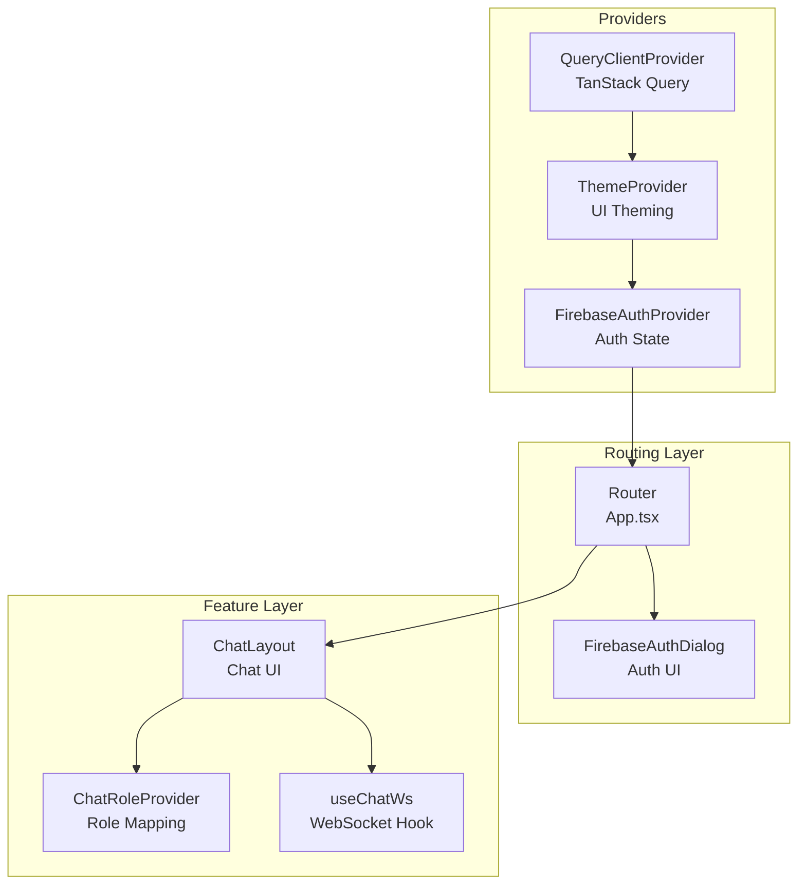

**Diagram sources**
- [App.tsx](file://client/src/App.tsx#L152-L163)
- [firebase-auth-context.tsx](file://client/src/contexts/firebase-auth-context.tsx#L38-L259)
- [theme-context.tsx](file://client/src/contexts/theme-context.tsx#L23-L63)
- [ChatLayout.tsx](file://client/src/components/chat/ChatLayout.tsx#L178-L182)
- [chat-role-context.tsx](file://client/src/contexts/chat-role-context.tsx#L23-L51)
- [use-chat-ws.ts](file://client/src/hooks/use-chat-ws.ts#L65-L218)

**Section sources**
- [App.tsx](file://client/src/App.tsx#L1-L165)

## Core Components
- FirebaseAuthContext: Centralizes authentication state, user profile, and actions (login, register, logout, reset password). Integrates with Firebase Auth and Firestore.
- ThemeContext: Manages UI theme selection and persists it to localStorage.
- ChatRoleContext: Derives the chat role from the authenticated user’s profile and exposes a normalized chat user object.
- TanStack Query: Provides caching, retries, and error handling for server data via a shared QueryClient.
- Real-time WebSocket Hook: Handles connection lifecycle, event parsing, and emits typed events for chat UI.
- Toast System: A lightweight, centralized notification system with a capped queue and dismissal behavior.

**Section sources**
- [firebase-auth-context.tsx](file://client/src/contexts/firebase-auth-context.tsx#L18-L36)
- [theme-context.tsx](file://client/src/contexts/theme-context.tsx#L3-L19)
- [chat-role-context.tsx](file://client/src/contexts/chat-role-context.tsx#L5-L21)
- [queryClient.ts](file://client/src/lib/queryClient.ts#L48-L61)
- [use-chat-ws.ts](file://client/src/hooks/use-chat-ws.ts#L65-L218)
- [use-toast.ts](file://client/src/hooks/use-toast.ts#L171-L191)

## Architecture Overview
The app initializes providers at the root, then routes depend on authentication state. Feature components consume context and hooks to manage UI state, server state, and real-time updates.

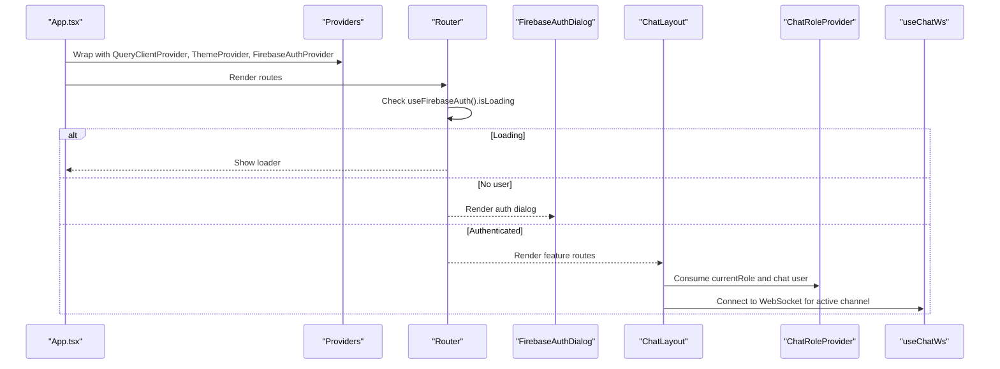

**Diagram sources**
- [App.tsx](file://client/src/App.tsx#L93-L150)
- [firebase-auth-context.tsx](file://client/src/contexts/firebase-auth-context.tsx#L38-L71)
- [firebase-auth-dialog.tsx](file://client/src/components/auth/firebase-auth-dialog.tsx#L39-L104)
- [ChatLayout.tsx](file://client/src/components/chat/ChatLayout.tsx#L178-L182)
- [chat-role-context.tsx](file://client/src/contexts/chat-role-context.tsx#L23-L51)
- [use-chat-ws.ts](file://client/src/hooks/use-chat-ws.ts#L95-L178)

## Detailed Component Analysis

### Authentication State Management (FirebaseAuthContext)
- Responsibilities:
  - Initialize auth state via onAuthStateChanged
  - Load user profile from Firestore with a timeout guard
  - Provide login, register, Google login, logout, and password reset actions
  - Manage loading state and show user-friendly toasts on outcomes
- Persistence and resilience:
  - Graceful fallback when Firebase is disabled
  - Timeout prevents UI hangs while fetching profile
- Integration:
  - Used by App router to gate routes and by auth dialogs to drive actions

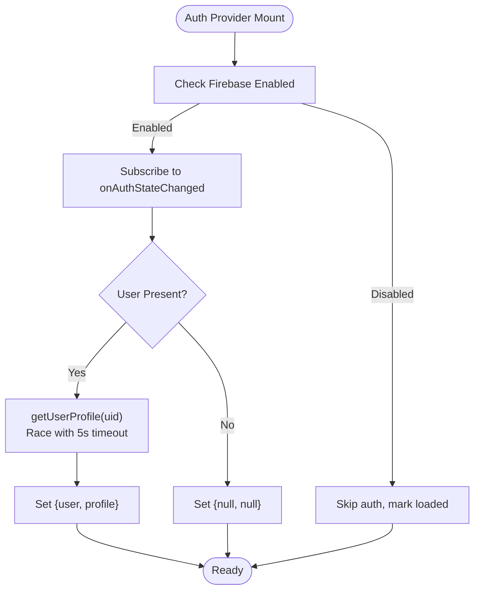

**Diagram sources**
- [firebase-auth-context.tsx](file://client/src/contexts/firebase-auth-context.tsx#L43-L71)
- [firebase.ts](file://client/src/lib/firebase.ts#L199-L212)

**Section sources**
- [firebase-auth-context.tsx](file://client/src/contexts/firebase-auth-context.tsx#L38-L259)
- [firebase.ts](file://client/src/lib/firebase.ts#L27-L42)

### UI Theming (ThemeContext)
- Responsibilities:
  - Persist theme preference to localStorage
  - Apply theme to document root (light/dark/system)
  - Expose setter to update theme and storage atomically
- Behavior:
  - On system preference change, applies light or dark automatically
  - Defaults to “system” if no stored preference

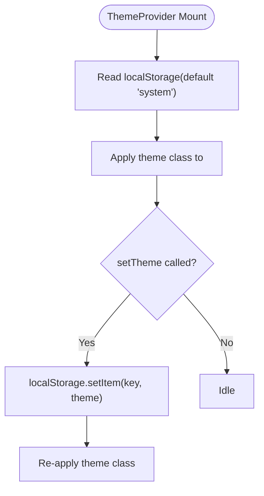

**Diagram sources**
- [theme-context.tsx](file://client/src/contexts/theme-context.tsx#L29-L48)

**Section sources**
- [theme-context.tsx](file://client/src/contexts/theme-context.tsx#L23-L72)

### Chat Role Preferences (ChatRoleContext)
- Responsibilities:
  - Map authenticated user’s role to a chat UserRole
  - Construct a normalized chat user object with online status
  - Provide currentRole and currentUser for chat UI
- Notes:
  - Role is derived from profile; manual overrides are intentionally ignored

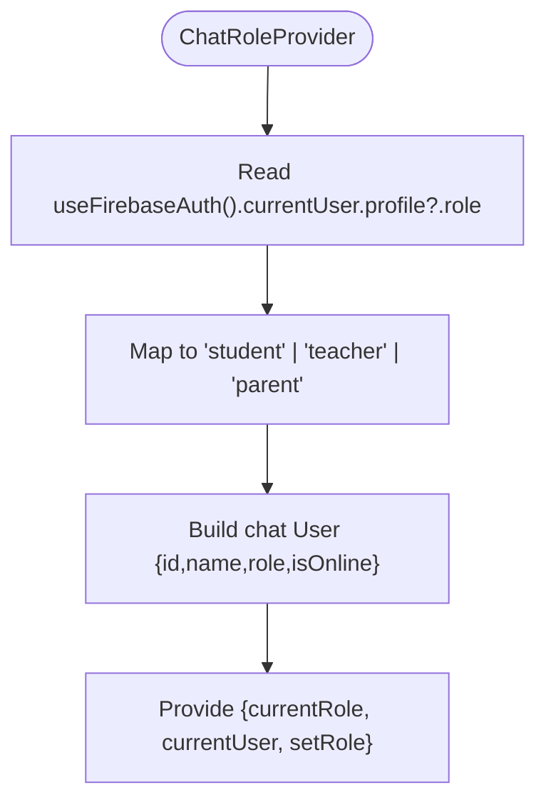

**Diagram sources**
- [chat-role-context.tsx](file://client/src/contexts/chat-role-context.tsx#L23-L51)

**Section sources**
- [chat-role-context.tsx](file://client/src/contexts/chat-role-context.tsx#L17-L58)
- [chat.ts](file://client/src/types/chat.ts#L1-L1)

### Server State Management (TanStack Query)
- Responsibilities:
  - Centralized cache and invalidation
  - Controlled refetch policies and retry behavior
  - Uniform error handling via query function wrapper
- Defaults:
  - Queries: staleTime Infinity, refetchOnWindowFocus false, retry false
  - Mutations: retry false
- Utility:
  - apiRequest centralizes credential handling and response validation
  - getQueryFn handles 401 behavior consistently

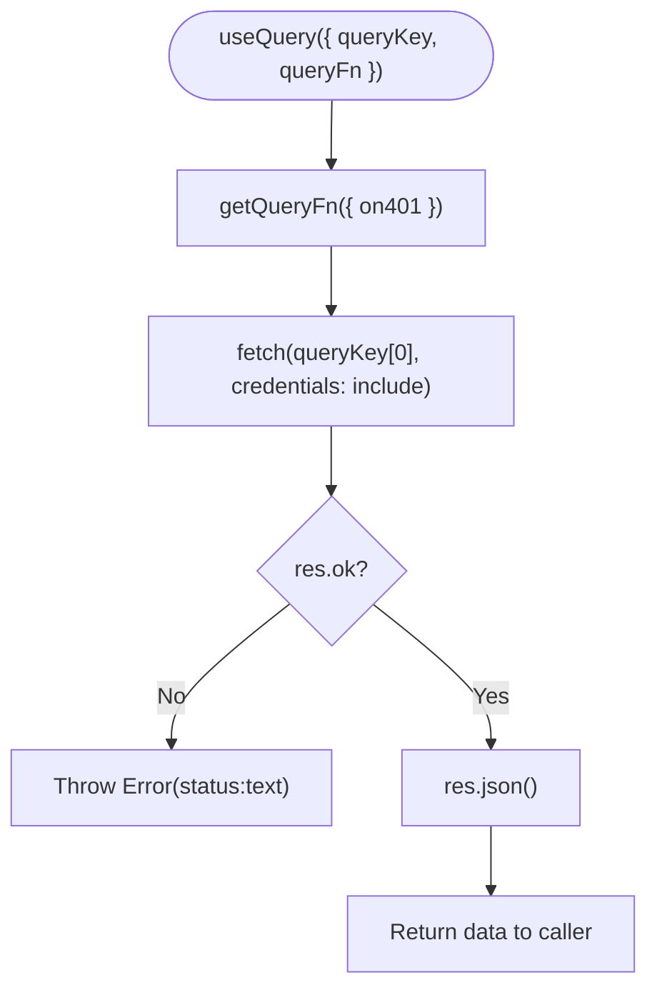

**Diagram sources**
- [queryClient.ts](file://client/src/lib/queryClient.ts#L31-L46)

**Section sources**
- [queryClient.ts](file://client/src/lib/queryClient.ts#L1-L62)

### Real-Time Communication (useChatWs)
- Responsibilities:
  - Establish and maintain a WebSocket connection
  - Join/leave channels dynamically
  - Emit typed events to callbacks (new message, typing, read, presence)
  - Implement exponential backoff with early exit on 4001 (unauthorized)
- Public API:
  - sendMessage, sendTyping, markRead
- Stability:
  - Uses ref callbacks to avoid stale closures
  - Ensures cleanup on unmount and channel changes

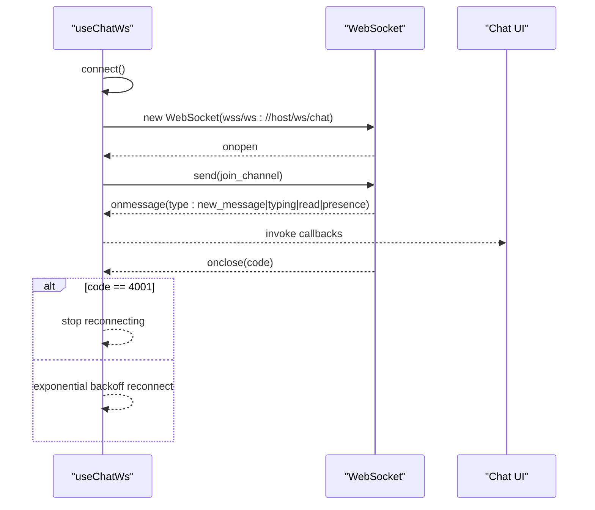

**Diagram sources**
- [use-chat-ws.ts](file://client/src/hooks/use-chat-ws.ts#L95-L178)
- [use-chat-ws.ts](file://client/src/hooks/use-chat-ws.ts#L180-L195)

**Section sources**
- [use-chat-ws.ts](file://client/src/hooks/use-chat-ws.ts#L65-L218)

### Chat Feature Composition (ChatLayout)
- Responsibilities:
  - Fetch workspaces, channels, and DMs via TanStack Query
  - Merge server data with mock fallbacks
  - Track active conversation and auto-select first when lists update
  - Share a single WebSocket connection scoped to the active channel
- Caching:
  - Stale time 60 seconds for lists
  - Conditional enabling to avoid unnecessary requests
- Synchronization:
  - Resets active conversation when conversation list changes
  - Uses memoization to derive categories and participant roles

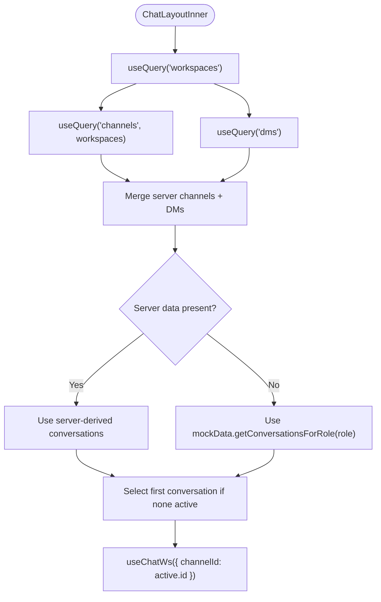

**Diagram sources**
- [ChatLayout.tsx](file://client/src/components/chat/ChatLayout.tsx#L47-L127)
- [chat-api.ts](file://client/src/lib/chat-api.ts#L59-L71)
- [mockData.ts](file://client/src/data/mockData.ts#L211-L231)

**Section sources**
- [ChatLayout.tsx](file://client/src/components/chat/ChatLayout.tsx#L41-L182)
- [chat-api.ts](file://client/src/lib/chat-api.ts#L1-L112)
- [mockData.ts](file://client/src/data/mockData.ts#L1-L240)

### Authentication UI and Forms (FirebaseAuthDialog and LoginPage)
- Responsibilities:
  - Provide login/register forms with validation
  - Drive FirebaseAuthContext actions
  - Handle Google OAuth flow and new user role selection
- Patterns:
  - Zod schemas for form validation
  - Controlled components with React Hook Form
  - Toast feedback for user actions

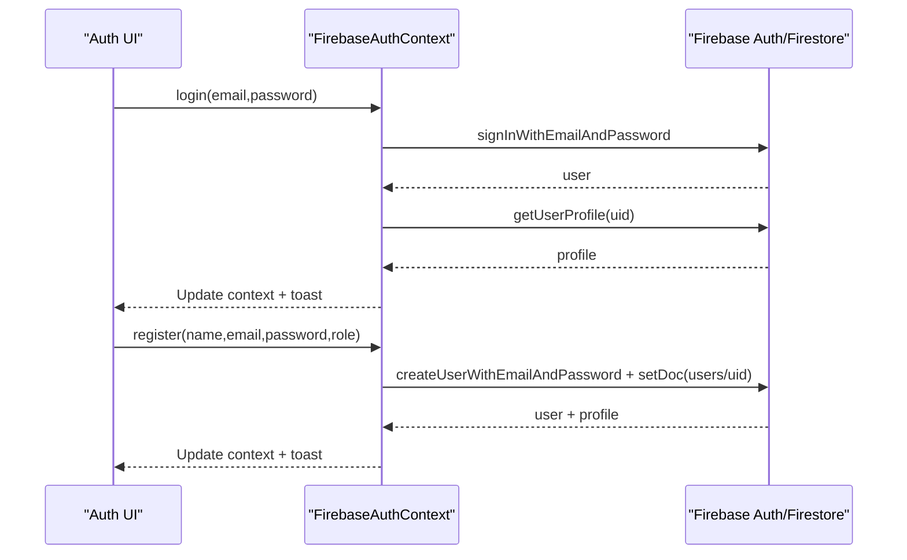

**Diagram sources**
- [firebase-auth-dialog.tsx](file://client/src/components/auth/firebase-auth-dialog.tsx#L98-L118)
- [firebase-auth-context.tsx](file://client/src/contexts/firebase-auth-context.tsx#L73-L125)
- [firebase.ts](file://client/src/lib/firebase.ts#L66-L115)

**Section sources**
- [firebase-auth-dialog.tsx](file://client/src/components/auth/firebase-auth-dialog.tsx#L39-L233)
- [LoginPage.tsx](file://client/src/pages/LoginPage.tsx#L1-L112)
- [firebase-auth-context.tsx](file://client/src/contexts/firebase-auth-context.tsx#L73-L125)
- [firebase.ts](file://client/src/lib/firebase.ts#L66-L115)

### Toast Notifications (use-toast)
- Responsibilities:
  - Centralized toast state with reducer
  - Limit queue to one toast at a time
  - Dismiss after delay and support programmatic dismissal
- Integration:
  - Used throughout auth flows to surface success/error messages

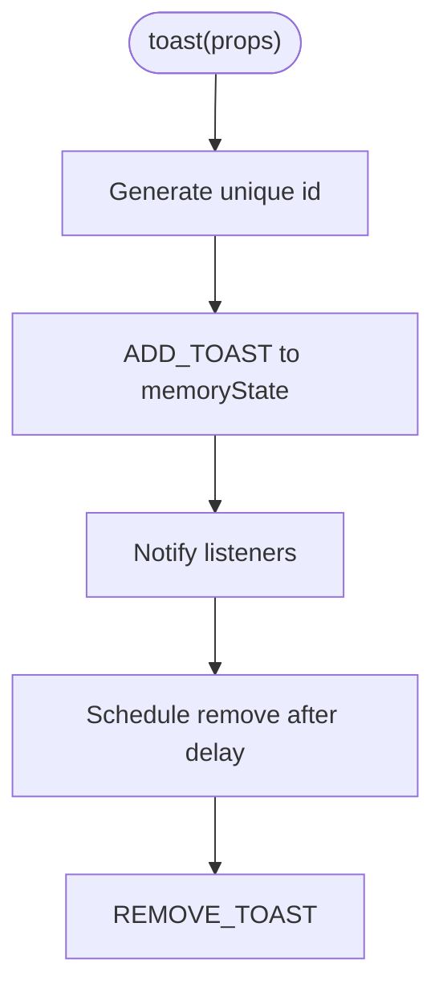

**Diagram sources**
- [use-toast.ts](file://client/src/hooks/use-toast.ts#L142-L169)
- [use-toast.ts](file://client/src/hooks/use-toast.ts#L171-L191)

**Section sources**
- [use-toast.ts](file://client/src/hooks/use-toast.ts#L1-L192)

## Dependency Analysis
- Provider hierarchy:
  - QueryClientProvider wraps all other providers
  - ThemeProvider wraps FirebaseAuthProvider
  - Router depends on FirebaseAuthContext for gating
- Feature dependencies:
  - ChatLayout depends on ChatRoleProvider and useChatWs
  - Auth dialogs depend on FirebaseAuthContext
- External integrations:
  - Firebase Auth and Firestore for authentication and profiles
  - REST endpoints for workspaces, channels, DMs, and uploads
  - WebSocket endpoint for real-time chat

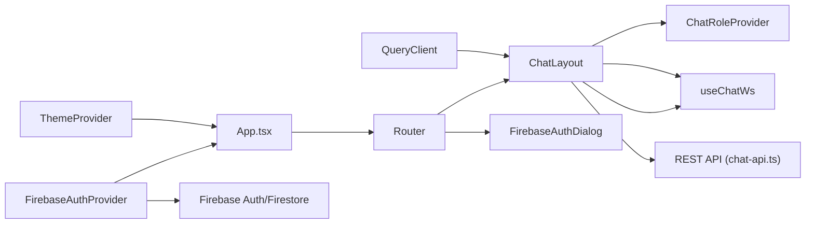

**Diagram sources**
- [App.tsx](file://client/src/App.tsx#L152-L163)
- [ChatLayout.tsx](file://client/src/components/chat/ChatLayout.tsx#L178-L182)
- [chat-role-context.tsx](file://client/src/contexts/chat-role-context.tsx#L23-L51)
- [use-chat-ws.ts](file://client/src/hooks/use-chat-ws.ts#L65-L218)
- [chat-api.ts](file://client/src/lib/chat-api.ts#L44-L55)
- [firebase.ts](file://client/src/lib/firebase.ts#L1-L42)

**Section sources**
- [App.tsx](file://client/src/App.tsx#L152-L163)
- [ChatLayout.tsx](file://client/src/components/chat/ChatLayout.tsx#L178-L182)
- [chat-api.ts](file://client/src/lib/chat-api.ts#L1-L112)
- [firebase.ts](file://client/src/lib/firebase.ts#L1-L42)

## Performance Considerations
- Caching and staleness:
  - Use staleTime to reduce redundant network calls for lists
  - Keep queries disabled until preconditions (e.g., workspaces present) to avoid wasted requests
- Real-time updates:
  - WebSocket hook implements exponential backoff and stops reconnecting on 4001
  - Single shared connection per layout reduces overhead
- Rendering:
  - useMemo to derive conversation categories and participant roles
  - Reset active conversation safely when lists change
- Network reliability:
  - Query function validates response status and throws descriptive errors
  - Auth profile fetch uses a timeout to prevent UI stalls

[No sources needed since this section provides general guidance]

## Troubleshooting Guide
- Authentication not loading:
  - Verify Firebase configuration and that the app does not short-circuit when credentials are missing
  - Check onAuthStateChanged subscription and profile fetch timeout
- Toasts not appearing:
  - Confirm Toaster is rendered at the root and useToast is invoked correctly
- WebSocket disconnects:
  - Inspect close codes; unauthorized closes (4001) halt reconnect attempts
  - Ensure channel join/leave messages are sent when channelId changes
- Server state errors:
  - TanStack Query throws on non-OK responses; review queryKey and endpoint URLs
  - For 401 behavior, ensure on401 option matches desired policy

**Section sources**
- [firebase-auth-context.tsx](file://client/src/contexts/firebase-auth-context.tsx#L43-L71)
- [App.tsx](file://client/src/App.tsx#L158-L159)
- [use-chat-ws.ts](file://client/src/hooks/use-chat-ws.ts#L144-L161)
- [queryClient.ts](file://client/src/lib/queryClient.ts#L3-L8)

## Conclusion
PersonalLearningPro’s frontend employs a clean separation of concerns:
- Context providers supply global state (auth, theme, chat role)
- TanStack Query standardizes server state management with explicit caching and error handling
- Real-time WebSocket hooks encapsulate connection lifecycle and event handling
- Local state and memoization keep UI responsive and synchronized
Adhering to these patterns ensures predictable state flows, robust error handling, and scalable performance for large datasets and real-time updates.