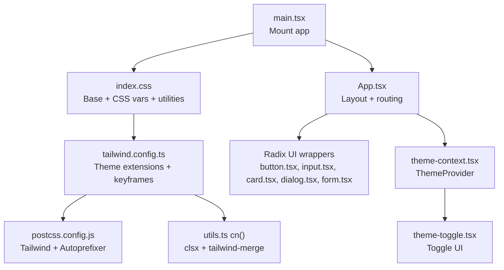
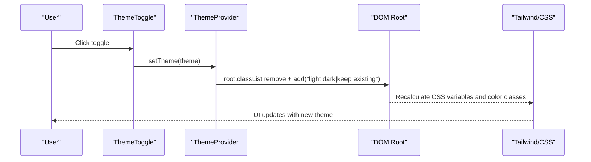
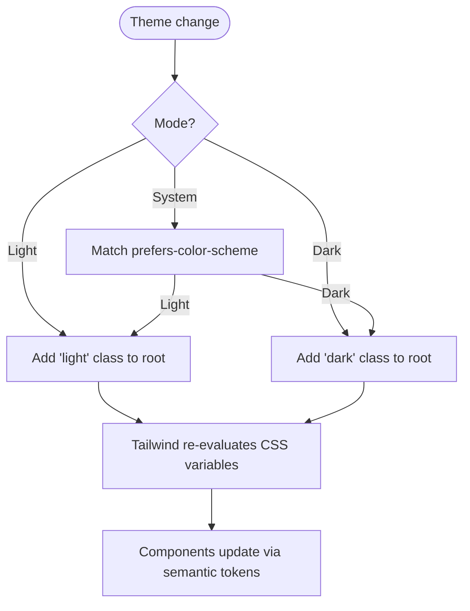
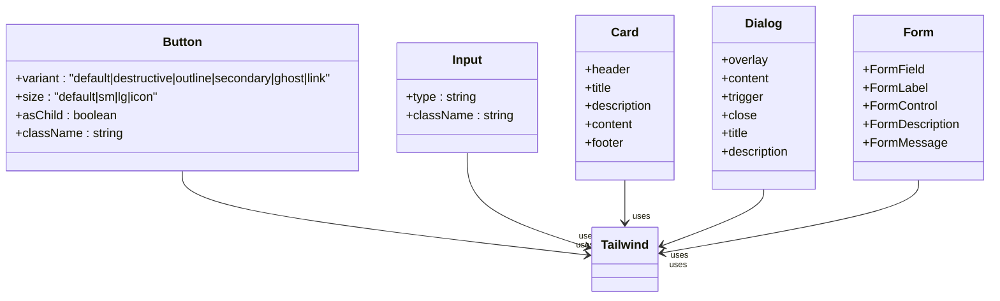
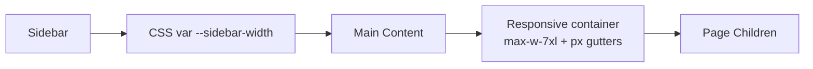
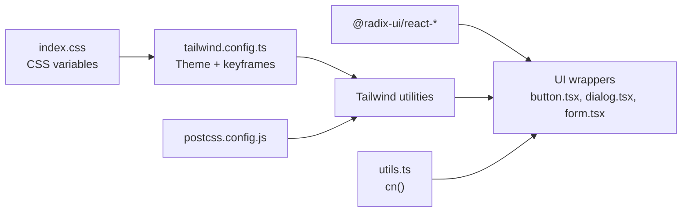

# UI Frameworks & Styling

<cite>
**Referenced Files in This Document**
- [index.css](file://client/src/index.css)
- [tailwind.config.ts](file://tailwind.config.ts)
- [postcss.config.js](file://postcss.config.js)
- [theme.json](file://theme.json)
- [theme-context.tsx](file://client/src/contexts/theme-context.tsx)
- [theme-toggle.tsx](file://client/src/components/ui/theme-toggle.tsx)
- [button.tsx](file://client/src/components/ui/button.tsx)
- [input.tsx](file://client/src/components/ui/input.tsx)
- [card.tsx](file://client/src/components/ui/card.tsx)
- [dialog.tsx](file://client/src/components/ui/dialog.tsx)
- [form.tsx](file://client/src/components/ui/form.tsx)
- [App.tsx](file://client/src/App.tsx)
- [main.tsx](file://client/src/main.tsx)
- [utils.ts](file://client/src/lib/utils.ts)
</cite>

## Table of Contents
1. [Introduction](#introduction)
2. [Project Structure](#project-structure)
3. [Core Components](#core-components)
4. [Architecture Overview](#architecture-overview)
5. [Detailed Component Analysis](#detailed-component-analysis)
6. [Dependency Analysis](#dependency-analysis)
7. [Performance Considerations](#performance-considerations)
8. [Troubleshooting Guide](#troubleshooting-guide)
9. [Conclusion](#conclusion)
10. [Appendices](#appendices)

## Introduction
This document describes the UI frameworks and styling architecture of PersonalLearningPro. It explains how Radix UI components integrate with a custom design system built on Tailwind CSS, how CSS custom properties power a unified theme, and how the system supports light/dark/system themes, animations, and responsive patterns. It also covers design token management, color and typography systems, spacing conventions, accessibility, and performance best practices for large-scale applications.

## Project Structure
The styling pipeline centers around:
- A global stylesheet that defines CSS custom properties and base styles
- Tailwind CSS configured to consume those properties and extend design tokens
- PostCSS to process Tailwind and vendor prefixes
- A theme provider that toggles light/dark/system modes via DOM classes
- Radix UI components wrapped with Tailwind classes and CVA variants
- Utility helpers for merging class names and generating initials

**Diagram sources**
- [main.tsx](file://client/src/main.tsx#L1-L8)
- [index.css](file://client/src/index.css#L1-L344)
- [App.tsx](file://client/src/App.tsx#L1-L165)
- [theme-context.tsx](file://client/src/contexts/theme-context.tsx#L1-L72)
- [theme-toggle.tsx](file://client/src/components/ui/theme-toggle.tsx#L1-L20)
- [button.tsx](file://client/src/components/ui/button.tsx#L1-L57)
- [input.tsx](file://client/src/components/ui/input.tsx#L1-L26)
- [card.tsx](file://client/src/components/ui/card.tsx#L1-L80)
- [dialog.tsx](file://client/src/components/ui/dialog.tsx#L1-L121)
- [form.tsx](file://client/src/components/ui/form.tsx#L1-L177)
- [tailwind.config.ts](file://tailwind.config.ts#L1-L164)
- [postcss.config.js](file://postcss.config.js#L1-L7)
- [utils.ts](file://client/src/lib/utils.ts#L1-L21)

**Section sources**
- [main.tsx](file://client/src/main.tsx#L1-L8)
- [index.css](file://client/src/index.css#L1-L344)
- [tailwind.config.ts](file://tailwind.config.ts#L1-L164)
- [postcss.config.js](file://postcss.config.js#L1-L7)
- [App.tsx](file://client/src/App.tsx#L1-L165)

## Core Components
- Global design tokens and base styles: CSS custom properties define semantic roles for backgrounds, foregrounds, borders, inputs, rings, radii, and specialized tokens for charts, subjects, sidebar, and chat. Dark mode variants are provided under a dedicated class.
- Tailwind theme extension: Tailwind reads those CSS variables to generate color palettes, border radius scales, and keyframe animations. Plugins enable advanced typography and animation utilities.
- Theme provider: A React context manages theme state, persists preferences, and applies light/dark/system classes to the root element.
- Radix UI component wrappers: Components like Button, Input, Card, Dialog, and Form are thin wrappers around Radix primitives, styled with Tailwind utilities and CVA variants. They consistently use semantic color tokens and maintain accessibility attributes.
- Utilities: A class merging utility ensures deterministic Tailwind class ordering and avoids conflicts.

**Section sources**
- [index.css](file://client/src/index.css#L5-L180)
- [tailwind.config.ts](file://tailwind.config.ts#L8-L162)
- [theme-context.tsx](file://client/src/contexts/theme-context.tsx#L23-L72)
- [button.tsx](file://client/src/components/ui/button.tsx#L7-L57)
- [input.tsx](file://client/src/components/ui/input.tsx#L8-L26)
- [card.tsx](file://client/src/components/ui/card.tsx#L5-L80)
- [dialog.tsx](file://client/src/components/ui/dialog.tsx#L15-L53)
- [form.tsx](file://client/src/components/ui/form.tsx#L16-L177)
- [utils.ts](file://client/src/lib/utils.ts#L4-L6)

## Architecture Overview
The styling architecture follows a layered approach:
- Tokens: CSS custom properties in the base layer define the design system.
- Theme: Tailwind consumes tokens to produce utility classes and color scales.
- Components: Radix UI primitives are composed into UI components with Tailwind classes and CVA variants.
- Provider: A theme provider switches between light and dark modes by toggling a class on the root element.
- Routing/Layout: The app’s layout integrates sidebar widths and responsive containers using CSS variables and Tailwind utilities.

**Diagram sources**
- [theme-toggle.tsx](file://client/src/components/ui/theme-toggle.tsx#L5-L20)
- [theme-context.tsx](file://client/src/contexts/theme-context.tsx#L33-L48)
- [index.css](file://client/src/index.css#L97-L171)
- [tailwind.config.ts](file://tailwind.config.ts#L29-L120)

## Detailed Component Analysis

### Theme System and Token Management
- Design tokens: Centralized in the base stylesheet as CSS custom properties grouped by semantic roles (background, foreground, card, popover, primary, secondary, muted, accent, destructive, border, input, ring), plus specialized tokens for charts, subjects, sidebar, and chat.
- Dark mode: A dedicated selector overrides tokens for reduced contrast and improved readability in dark environments.
- Tailwind integration: Tailwind theme maps CSS variables to color scales and keyframes, enabling utilities like text-primary, bg-secondary, ring-primary, and custom keys like chart-1..5 and subject-math.
- Theme provider: Applies “light” or “dark” classes to the root element and respects system preference when configured. Persists user choice in local storage.

**Diagram sources**
- [theme-context.tsx](file://client/src/contexts/theme-context.tsx#L33-L48)
- [index.css](file://client/src/index.css#L97-L171)
- [tailwind.config.ts](file://tailwind.config.ts#L29-L120)

**Section sources**
- [index.css](file://client/src/index.css#L5-L180)
- [tailwind.config.ts](file://tailwind.config.ts#L29-L120)
- [theme-context.tsx](file://client/src/contexts/theme-context.tsx#L23-L72)

### Radix UI Integration and Component Wrappers
- Button: Uses CVA to define variants (default, destructive, outline, secondary, ghost, link) and sizes (default, sm, lg, icon). Renders either a native button or a slot for composition, with focus-visible ring utilities and SVG sizing.
- Input: A thin wrapper around the native input, applying focus rings, placeholder styling, and background tokens.
- Card: Composed of Card, CardHeader, CardTitle, CardDescription, CardContent, and CardFooter with consistent spacing and typography.
- Dialog: A portal-backed overlay with animated transitions, close button, and semantic heading utilities.
- Form: Integrates react-hook-form with Radix Label, providing field context, aria attributes, and error styling.

**Diagram sources**
- [button.tsx](file://client/src/components/ui/button.tsx#L7-L57)
- [input.tsx](file://client/src/components/ui/input.tsx#L8-L26)
- [card.tsx](file://client/src/components/ui/card.tsx#L5-L80)
- [dialog.tsx](file://client/src/components/ui/dialog.tsx#L15-L121)
- [form.tsx](file://client/src/components/ui/form.tsx#L16-L177)

**Section sources**
- [button.tsx](file://client/src/components/ui/button.tsx#L1-L57)
- [input.tsx](file://client/src/components/ui/input.tsx#L1-L26)
- [card.tsx](file://client/src/components/ui/card.tsx#L1-L80)
- [dialog.tsx](file://client/src/components/ui/dialog.tsx#L1-L121)
- [form.tsx](file://client/src/components/ui/form.tsx#L1-L177)

### Layout and Container Patterns
- AppLayout: Provides a two-pane layout with a sidebar and a main content area. The left margin of the main content is driven by a CSS variable for sidebar width, allowing easy expansion/collapse.
- Responsive container: The main content uses max-width and padding utilities for consistent gutters across breakpoints.
- Full-width option: Some pages remove container constraints for immersive experiences.

**Diagram sources**
- [App.tsx](file://client/src/App.tsx#L34-L54)
- [index.css](file://client/src/index.css#L64-L66)

**Section sources**
- [App.tsx](file://client/src/App.tsx#L34-L54)

### Accessibility and Cross-Browser Considerations
- Focus management: Buttons and inputs apply focus-visible rings and outline utilities for keyboard navigation.
- Semantic roles: Dialog overlays and portals ensure modals are announced by assistive technologies.
- ARIA attributes: Form controls set aria-invalid and aria-describedby for error communication.
- Cross-browser compatibility: PostCSS autoprefixer ensures vendor-prefixed properties for older browsers.

**Section sources**
- [button.tsx](file://client/src/components/ui/button.tsx#L8-L34)
- [dialog.tsx](file://client/src/components/ui/dialog.tsx#L36-L50)
- [form.tsx](file://client/src/components/ui/form.tsx#L108-L122)
- [postcss.config.js](file://postcss.config.js#L1-L7)

### Typography and Spacing Conventions
- Typography: Tailwind is configured with a system font stack optimized for education and readability. Headings and paragraphs use semantic sizes and weights aligned with the card component hierarchy.
- Spacing: Consistent padding/margin utilities are applied across cards, dialogs, and forms. Border radius values derive from the CSS variable for roundedness.

**Section sources**
- [tailwind.config.ts](file://tailwind.config.ts#L10-L28)
- [card.tsx](file://client/src/components/ui/card.tsx#L36-L44)
- [dialog.tsx](file://client/src/components/ui/dialog.tsx#L36-L43)

### Animation and Motion
- CSS keyframes: Base stylesheet defines reusable animations (fade-in-up, scale-in, slide-in-right, pulse-live, float, shimmer).
- Tailwind keyframes: Tailwind theme extends these keyframes and exposes them as animation utilities for components and transitions.

**Section sources**
- [index.css](file://client/src/index.css#L183-L253)
- [tailwind.config.ts](file://tailwind.config.ts#L121-L159)

## Dependency Analysis
The styling stack depends on:
- Tailwind CSS for utility-first classes and theme extensions
- PostCSS for processing Tailwind and adding vendor prefixes
- Radix UI for accessible component primitives
- class-variance-authority and clsx/tailwind-merge for variant-driven component APIs and deterministic class merging

**Diagram sources**
- [index.css](file://client/src/index.css#L1-L344)
- [tailwind.config.ts](file://tailwind.config.ts#L1-L164)
- [postcss.config.js](file://postcss.config.js#L1-L7)
- [button.tsx](file://client/src/components/ui/button.tsx#L1-L57)
- [dialog.tsx](file://client/src/components/ui/dialog.tsx#L1-L121)
- [form.tsx](file://client/src/components/ui/form.tsx#L1-L177)
- [utils.ts](file://client/src/lib/utils.ts#L4-L6)

**Section sources**
- [tailwind.config.ts](file://tailwind.config.ts#L1-L164)
- [postcss.config.js](file://postcss.config.js#L1-L7)
- [utils.ts](file://client/src/lib/utils.ts#L4-L6)

## Performance Considerations
- Atomic utilities: Prefer Tailwind utilities over ad hoc CSS to reduce bundle size and improve cacheability.
- CSS variables: Centralized tokens minimize duplication and reduce repaint costs when switching themes.
- Class merging: Using a single utility for merging classes prevents cascade conflicts and reduces runtime overhead.
- Animations: Keep keyframes minimal and reuse predefined animations to avoid layout thrashing.
- Tree shaking: Tailwind’s content scanning ensures unused styles are purged in production builds.

[No sources needed since this section provides general guidance]

## Troubleshooting Guide
- Theme not switching: Verify the root element receives the correct class and that CSS variables are defined for both light and dark.
- Colors appear incorrect: Confirm Tailwind theme maps match CSS variable names and that the dark selector is properly structured.
- Conflicting classes: Use the provided class merging utility to ensure deterministic order and avoid specificity wars.
- Missing animations: Ensure Tailwind’s keyframes are extended and that animation utilities are applied correctly.

**Section sources**
- [theme-context.tsx](file://client/src/contexts/theme-context.tsx#L33-L48)
- [index.css](file://client/src/index.css#L97-L171)
- [tailwind.config.ts](file://tailwind.config.ts#L29-L120)
- [utils.ts](file://client/src/lib/utils.ts#L4-L6)

## Conclusion
PersonalLearningPro’s styling system combines Radix UI primitives with a robust Tailwind-based design system powered by CSS custom properties. The theme provider enables seamless light/dark/system switching, while component wrappers ensure consistency, accessibility, and maintainability. The architecture supports scalability through atomic utilities, centralized tokens, and predictable class merging.

[No sources needed since this section summarizes without analyzing specific files]

## Appendices

### Appendix A: Theme JSON
- Purpose: Stores theme metadata such as variant, primary color, appearance, and corner radius.
- Usage: Can be used by tooling or documentation to reflect current theme defaults.

**Section sources**
- [theme.json](file://theme.json#L1-L7)

### Appendix B: Mounting and Base Styles
- The app mounts with the global stylesheet included, ensuring base styles, tokens, and utilities are available before any component renders.

**Section sources**
- [main.tsx](file://client/src/main.tsx#L1-L8)
- [index.css](file://client/src/index.css#L1-L3)