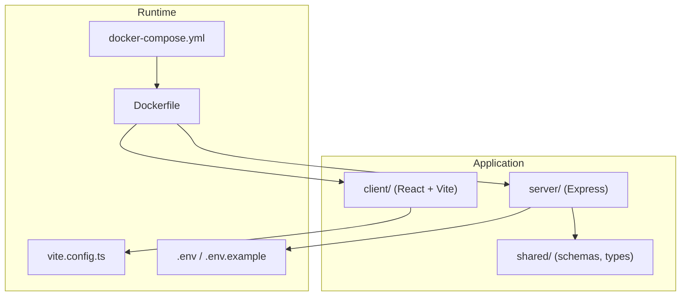
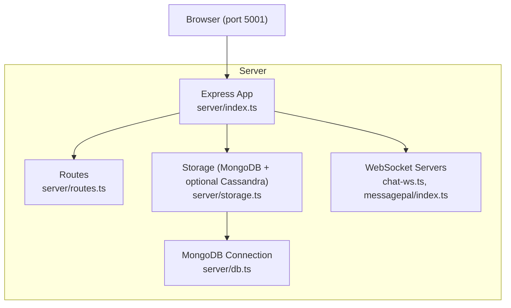
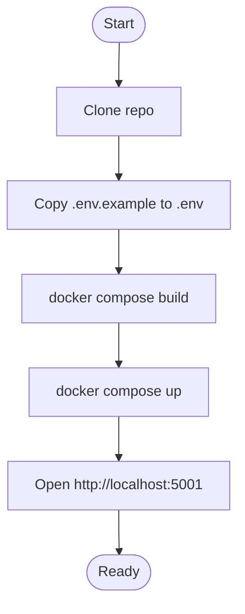
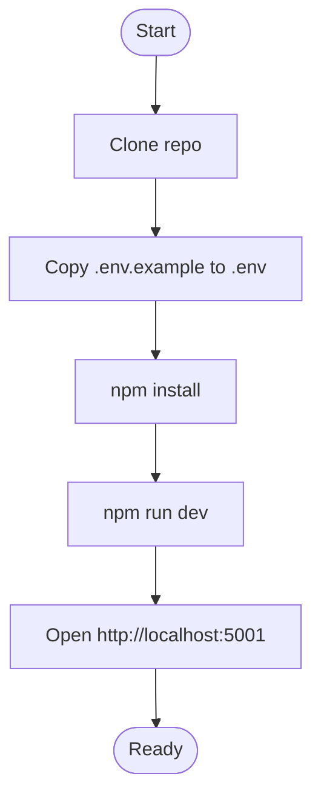
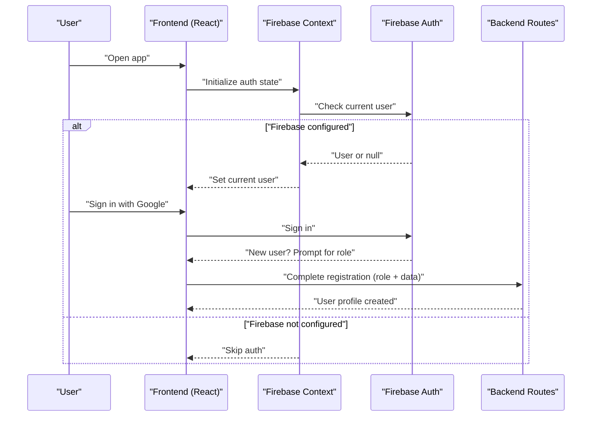
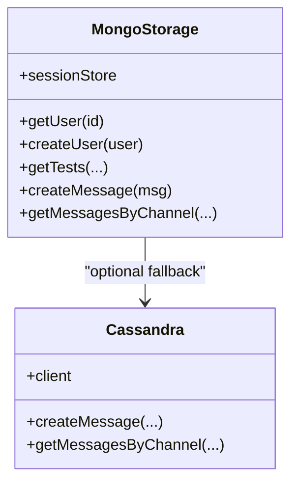
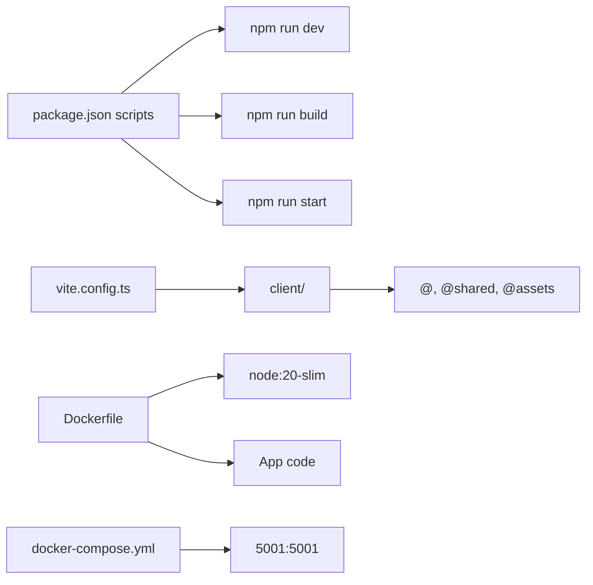

# Getting Started

<cite>
**Referenced Files in This Document**
- [README.md](file://README.md)
- [LOCAL_SETUP.md](file://LOCAL_SETUP.md)
- [.env.example](file://.env.example)
- [Dockerfile](file://Dockerfile)
- [docker-compose.yml](file://docker-compose.yml)
- [package.json](file://package.json)
- [server/index.ts](file://server/index.ts)
- [server/db.ts](file://server/db.ts)
- [server/storage.ts](file://server/storage.ts)
- [vite.config.ts](file://vite.config.ts)
- [client/src/env.d.ts](file://client/src/env.d.ts)
- [client/src/config.ts](file://client/src/config.ts)
- [client/src/contexts/firebase-auth-context.tsx](file://client/src/contexts/firebase-auth-context.tsx)
- [client/src/components/auth/firebase-auth-dialog.tsx](file://client/src/components/auth/firebase-auth-dialog.tsx)
- [client/src/lib/firebase.ts](file://client/src/lib/firebase.ts)
- [server/routes.ts](file://server/routes.ts)
</cite>

## Table of Contents
1. [Introduction](#introduction)
2. [Project Structure](#project-structure)
3. [Core Components](#core-components)
4. [Architecture Overview](#architecture-overview)
5. [Detailed Component Analysis](#detailed-component-analysis)
6. [Dependency Analysis](#dependency-analysis)
7. [Performance Considerations](#performance-considerations)
8. [Troubleshooting Guide](#troubleshooting-guide)
9. [Conclusion](#conclusion)
10. [Appendices](#appendices)

## Introduction
PersonalLearningPro is an AI-powered personalized learning platform with integrated chat, test creation, OCR scanning, analytics, and role-based access control. This guide helps you install, configure, and run the project quickly using either Docker (recommended) or a manual setup with Node.js and local databases.

Key highlights:
- Single development port 5001 serving both API and frontend
- Optional AI features powered by OpenAI
- Optional Firebase authentication
- Hybrid data storage using MongoDB and optional Cassandra/Astra DB for messaging

## Project Structure
High-level structure relevant to setup and operation:
- Frontend (React + Vite): client/
- Backend (Express): server/
- Shared code: shared/
- Docker and Compose: Dockerfile, docker-compose.yml
- Environment variables: .env, .env.example
- Scripts and tooling: package.json, vite.config.ts

**Diagram sources**
- [Dockerfile](file://Dockerfile#L1-L58)
- [docker-compose.yml](file://docker-compose.yml#L1-L24)
- [vite.config.ts](file://vite.config.ts#L1-L35)
- [server/index.ts](file://server/index.ts#L1-L114)

**Section sources**
- [README.md](file://README.md#L70-L102)
- [Dockerfile](file://Dockerfile#L1-L58)
- [docker-compose.yml](file://docker-compose.yml#L1-L24)
- [vite.config.ts](file://vite.config.ts#L1-L35)

## Core Components
- Backend server: Express app with session middleware, static uploads, WebSocket support, and hybrid storage (MongoDB + optional Cassandra/Astra DB)
- Frontend: React SPA served by Vite in development; built assets served in production
- Environment configuration: .env and .env.example define optional integrations (Firebase, OpenAI, databases)
- Docker: Multi-stage build with development and production targets

What you need installed:
- Docker (recommended) or Node.js v18+ with npm
- PostgreSQL and MongoDB for data persistence (manual setup)
- Optional: OpenAI API key for AI features; Firebase project for authentication

**Section sources**
- [README.md](file://README.md#L21-L51)
- [LOCAL_SETUP.md](file://LOCAL_SETUP.md#L5-L12)
- [server/index.ts](file://server/index.ts#L1-L114)
- [server/db.ts](file://server/db.ts#L1-L21)
- [server/storage.ts](file://server/storage.ts#L1-L519)
- [.env.example](file://.env.example#L1-L36)
- [Dockerfile](file://Dockerfile#L1-L58)

## Architecture Overview
The application runs on a single port (5001) in development and production. The backend serves:
- REST API routes
- Static frontend assets (in production)
- WebSocket endpoints for real-time chat
- Optional MessagePal HTTP server

**Diagram sources**
- [server/index.ts](file://server/index.ts#L1-L114)
- [server/routes.ts](file://server/routes.ts#L1-L800)
- [server/storage.ts](file://server/storage.ts#L1-L519)
- [server/db.ts](file://server/db.ts#L1-L21)

## Detailed Component Analysis

### Installation Methods

#### Option 1: Docker (Recommended)
- Prerequisites: Docker Engine
- Steps:
  - Clone the repository
  - Copy and edit .env.example to .env
  - Build and start with Docker Compose
- Access: http://localhost:5001

**Diagram sources**
- [README.md](file://README.md#L23-L35)
- [docker-compose.yml](file://docker-compose.yml#L1-L24)
- [Dockerfile](file://Dockerfile#L1-L58)

**Section sources**
- [README.md](file://README.md#L23-L35)
- [docker-compose.yml](file://docker-compose.yml#L1-L24)
- [Dockerfile](file://Dockerfile#L1-L58)

#### Option 2: Manual Setup (Node.js)
- Prerequisites: Node.js v18+, npm, PostgreSQL, MongoDB
- Steps:
  - Clone the repository
  - Copy and edit .env
  - Install dependencies
  - Start development server
- Access: http://localhost:5001

**Diagram sources**
- [README.md](file://README.md#L37-L49)
- [LOCAL_SETUP.md](file://LOCAL_SETUP.md#L13-L82)
- [package.json](file://package.json#L6-L11)

**Section sources**
- [README.md](file://README.md#L37-L49)
- [LOCAL_SETUP.md](file://LOCAL_SETUP.md#L13-L82)
- [package.json](file://package.json#L6-L11)

### Environment Configuration (.env and .env.example)
- Copy the example to .env and set values for optional integrations:
  - Firebase: VITE_FIREBASE_* keys
  - OpenAI: OPENAI_API_KEY
  - MongoDB: MONGODB_URL
  - Session: SESSION_SECRET (required in production)
  - Cassandra/Astra DB: ASTRA_DB_* for message store fallback
- Notes:
  - Without Firebase, the app loads but authentication features are disabled
  - Without OpenAI, AI features are unavailable

**Section sources**
- [.env.example](file://.env.example#L1-L36)
- [README.md](file://README.md#L53-L69)

### Ports and Services
- Port 5001 is used for both development and production
  - API endpoints
  - Frontend (Vite in dev, built assets in prod)
  - WebSocket servers
- Docker Compose exposes port 5001 from the container to the host

**Section sources**
- [server/index.ts](file://server/index.ts#L103-L112)
- [docker-compose.yml](file://docker-compose.yml#L6-L7)
- [README.md](file://README.md#L35-L35)

### Initial Setup Verification
After starting the app:
- Visit http://localhost:5001
- Expected behavior:
  - Application loads
  - If Firebase is configured, authentication UI appears
  - If databases are configured, features like chat and analytics become available

**Section sources**
- [README.md](file://README.md#L35-L35)
- [LOCAL_SETUP.md](file://LOCAL_SETUP.md#L72-L82)

### Authentication and First-Time User Setup
- Firebase-based authentication is optional:
  - If configured, users can log in with email/password or Google
  - New Google users are guided to select a role during registration
- Without Firebase, the app loads but authentication features are disabled
- First-time user flow:
  - Email/password registration creates a user record
  - Google sign-in checks Firestore for existing users; new users are prompted to select a role and additional profile data is stored

**Diagram sources**
- [client/src/contexts/firebase-auth-context.tsx](file://client/src/contexts/firebase-auth-context.tsx#L43-L78)
- [client/src/components/auth/firebase-auth-dialog.tsx](file://client/src/components/auth/firebase-auth-dialog.tsx#L1-L276)
- [client/src/lib/firebase.ts](file://client/src/lib/firebase.ts#L80-L177)
- [server/routes.ts](file://server/routes.ts#L13-L85)

**Section sources**
- [client/src/contexts/firebase-auth-context.tsx](file://client/src/contexts/firebase-auth-context.tsx#L43-L78)
- [client/src/components/auth/firebase-auth-dialog.tsx](file://client/src/components/auth/firebase-auth-dialog.tsx#L1-L276)
- [client/src/lib/firebase.ts](file://client/src/lib/firebase.ts#L80-L177)
- [server/routes.ts](file://server/routes.ts#L13-L85)

### Data Storage and Dependencies
- MongoDB is required for user, test, and analytics data
- Optional Cassandra/Astra DB can be used for message storage; if absent, messages fall back to MongoDB
- PostgreSQL is not required by the backend; the project documentation mentions it for manual setup

**Diagram sources**
- [server/storage.ts](file://server/storage.ts#L110-L519)
- [server/db.ts](file://server/db.ts#L1-L21)

**Section sources**
- [server/storage.ts](file://server/storage.ts#L1-L519)
- [server/db.ts](file://server/db.ts#L1-L21)
- [LOCAL_SETUP.md](file://LOCAL_SETUP.md#L10-L11)

## Dependency Analysis
- Node.js and npm are required for manual setup
- Docker simplifies dependency isolation and avoids local database setup
- Frontend and backend share aliases and build configuration via Vite

**Diagram sources**
- [package.json](file://package.json#L6-L11)
- [vite.config.ts](file://vite.config.ts#L1-L35)
- [Dockerfile](file://Dockerfile#L1-L58)
- [docker-compose.yml](file://docker-compose.yml#L1-L24)

**Section sources**
- [package.json](file://package.json#L6-L11)
- [vite.config.ts](file://vite.config.ts#L1-L35)
- [Dockerfile](file://Dockerfile#L1-L58)
- [docker-compose.yml](file://docker-compose.yml#L1-L24)

## Performance Considerations
- Development uses hot module replacement and bind-mounted source directories for fast iteration
- Production builds optimize frontend assets and runs a single Node.js process
- WebSocket servers enable real-time chat; ensure adequate memory for concurrent connections

[No sources needed since this section provides general guidance]

## Troubleshooting Guide
Common issues and resolutions:
- Port 5001 in use
  - Change the port in the server entry point and update Docker Compose if needed
- Firebase authentication not working
  - Ensure Google authentication is enabled in Firebase
  - Verify all VITE_FIREBASE_* variables are set
  - Confirm the API key format and spelling
- Environment variables not loading
  - Ensure .env is at the project root
  - Restart the development server after edits
- npm install failures
  - Clean install by removing node_modules and package-lock.json, then reinstall
- Database connection errors
  - Verify PostgreSQL and MongoDB are running
  - Check connection strings for correctness and credentials

**Section sources**
- [LOCAL_SETUP.md](file://LOCAL_SETUP.md#L112-L136)

## Conclusion
You can get PersonalLearningPro running quickly with Docker or manually with Node.js. Configure .env for optional integrations, ensure databases are available, and access the app at http://localhost:501. Authentication and first-time user flows are handled via Firebase when configured, while the backend remains functional without it.

[No sources needed since this section summarizes without analyzing specific files]

## Appendices

### Quick Start Examples
- Docker
  - Build and run: docker compose build; docker compose up
  - Access: http://localhost:5001
- Manual
  - Install dependencies: npm install
  - Start development: npm run dev
  - Access: http://localhost:5001

**Section sources**
- [README.md](file://README.md#L23-L49)
- [docker-compose.yml](file://docker-compose.yml#L1-L24)
- [package.json](file://package.json#L6-L11)

### System Requirements and Supported Operating Systems
- Recommended: Docker (cross-platform)
- Manual setup: Node.js v18+ on Linux/macOS/Windows
- Databases: PostgreSQL and MongoDB (manual setup)
- Hardware: Sufficient RAM for Node.js processes and database instances; Docker resources can be tuned via Compose

**Section sources**
- [README.md](file://README.md#L23-L49)
- [LOCAL_SETUP.md](file://LOCAL_SETUP.md#L5-L12)