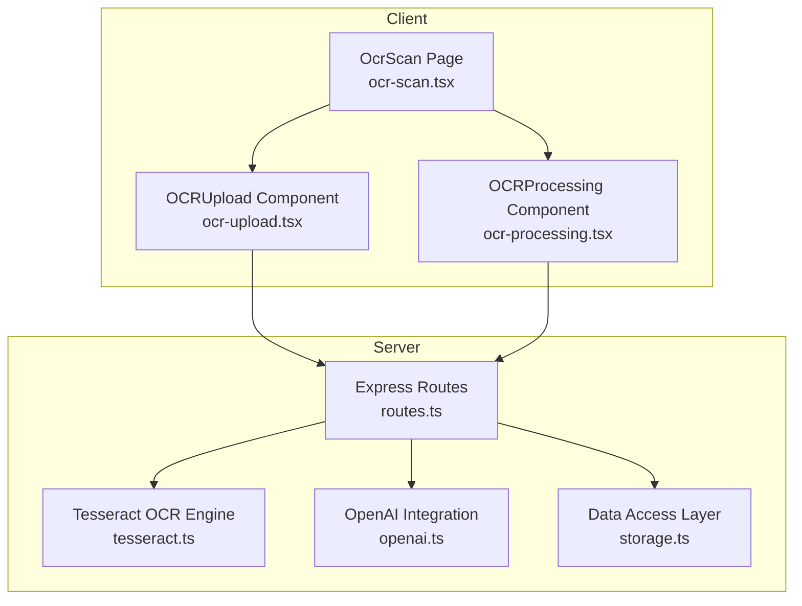
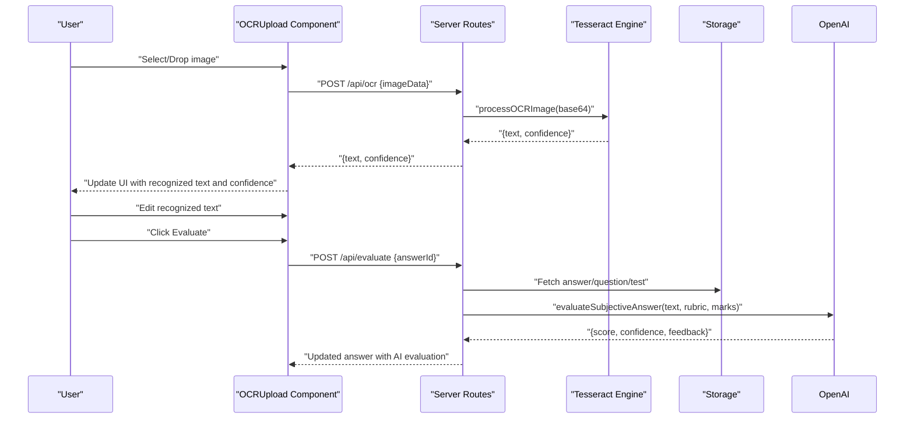
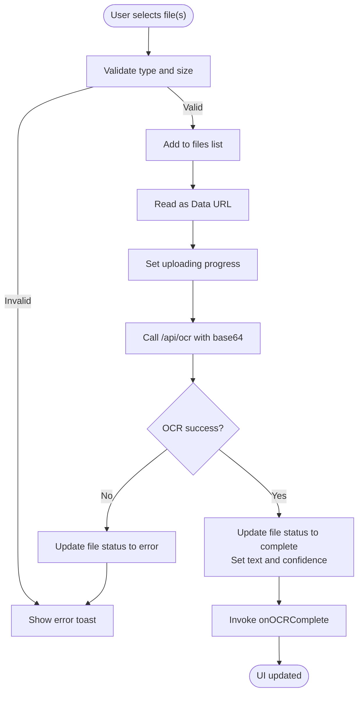
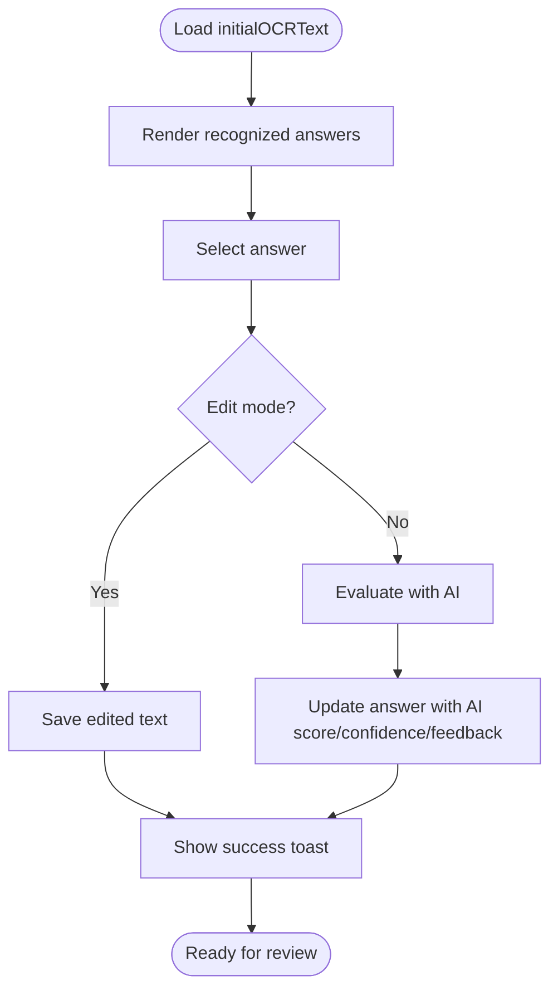
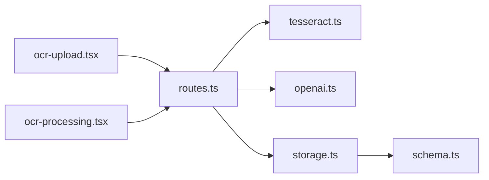

# OCR Processing System

<cite>
**Referenced Files in This Document**
- [ocr-scan.tsx](file://client/src/pages/ocr-scan.tsx)
- [ocr-upload.tsx](file://client/src/components/test/ocr-upload.tsx)
- [ocr-processing.tsx](file://client/src/components/test/ocr-processing.tsx)
- [tesseract.ts](file://server/lib/tesseract.ts)
- [routes.ts](file://server/routes.ts)
- [index.ts](file://server/index.ts)
- [openai.ts](file://server/lib/openai.ts)
- [schema.ts](file://shared/schema.ts)
- [storage.ts](file://server/storage.ts)
- [upload.ts](file://server/lib/upload.ts)
</cite>

## Table of Contents
1. [Introduction](#introduction)
2. [Project Structure](#project-structure)
3. [Core Components](#core-components)
4. [Architecture Overview](#architecture-overview)
5. [Detailed Component Analysis](#detailed-component-analysis)
6. [Dependency Analysis](#dependency-analysis)
7. [Performance Considerations](#performance-considerations)
8. [Troubleshooting Guide](#troubleshooting-guide)
9. [Conclusion](#conclusion)

## Introduction
This document describes the OCR processing system for PersonalLearningPro’s handwritten test scanning. It explains how images are uploaded, preprocessed, and transformed into machine-readable text using Tesseract.js, how confidence metrics are computed and presented, and how the recognized text integrates with the assessment system for automated digitization and evaluation. It also covers supported formats, resolution expectations, processing limitations, UI components for scanning and validation, and strategies for performance optimization and accuracy improvements.

## Project Structure
The OCR pipeline spans the client and server:
- Client-side UI components orchestrate image selection, drag-and-drop, progress tracking, and result display.
- Server-side routes expose an OCR endpoint that delegates to Tesseract.js for text extraction and confidence scoring.
- The assessment integration allows teachers to evaluate subjective answers using AI with rubrics derived from test questions.

**Diagram sources**
- [ocr-scan.tsx](file://client/src/pages/ocr-scan.tsx#L13-L95)
- [ocr-upload.tsx](file://client/src/components/test/ocr-upload.tsx#L25-L308)
- [ocr-processing.tsx](file://client/src/components/test/ocr-processing.tsx#L23-L218)
- [routes.ts](file://server/routes.ts#L465-L485)
- [tesseract.ts](file://server/lib/tesseract.ts#L8-L32)
- [openai.ts](file://server/lib/openai.ts#L50-L105)
- [storage.ts](file://server/storage.ts#L33-L106)

**Section sources**
- [ocr-scan.tsx](file://client/src/pages/ocr-scan.tsx#L13-L95)
- [ocr-upload.tsx](file://client/src/components/test/ocr-upload.tsx#L25-L308)
- [ocr-processing.tsx](file://client/src/components/test/ocr-processing.tsx#L23-L218)
- [routes.ts](file://server/routes.ts#L465-L485)
- [tesseract.ts](file://server/lib/tesseract.ts#L8-L32)
- [openai.ts](file://server/lib/openai.ts#L50-L105)
- [storage.ts](file://server/storage.ts#L33-L106)

## Core Components
- OCR Upload Component: Handles file selection, drag-and-drop, progress simulation, base64 conversion, and invokes the OCR endpoint.
- OCR Processing Component: Displays recognized answers, confidence indicators, editing controls, and evaluation triggers.
- OCR Scan Page: Composes upload and processing UI, and renders confidence analysis.
- OCR Route: Validates session, extracts base64 image data, calls Tesseract, and returns text and confidence.
- Tesseract Engine: Performs OCR on base64 image data and returns extracted text and confidence.
- OpenAI Integration: Powers AI evaluation of subjective answers using question rubrics.
- Data Schema: Defines Answer entity with OCR text and evaluation fields.
- Storage Layer: Provides CRUD operations for answers and evaluation persistence.

**Section sources**
- [ocr-upload.tsx](file://client/src/components/test/ocr-upload.tsx#L25-L308)
- [ocr-processing.tsx](file://client/src/components/test/ocr-processing.tsx#L23-L218)
- [ocr-scan.tsx](file://client/src/pages/ocr-scan.tsx#L13-L95)
- [routes.ts](file://server/routes.ts#L465-L485)
- [tesseract.ts](file://server/lib/tesseract.ts#L8-L32)
- [openai.ts](file://server/lib/openai.ts#L50-L105)
- [schema.ts](file://shared/schema.ts#L48-L59)
- [storage.ts](file://server/storage.ts#L241-L262)

## Architecture Overview
The OCR pipeline follows a client-server architecture:
- Client uploads images and receives OCR results with confidence.
- Server validates session, processes the image via Tesseract, and returns structured results.
- The UI updates in real-time, allowing manual edits and initiating AI evaluation for subjective answers.

**Diagram sources**
- [ocr-upload.tsx](file://client/src/components/test/ocr-upload.tsx#L32-L91)
- [routes.ts](file://server/routes.ts#L465-L485)
- [tesseract.ts](file://server/lib/tesseract.ts#L8-L32)
- [openai.ts](file://server/lib/openai.ts#L50-L105)
- [storage.ts](file://server/storage.ts#L499-L559)

## Detailed Component Analysis

### OCR Upload Component
Responsibilities:
- Accepts image files (JPG, PNG, PDF) and enforces size limits.
- Converts files to base64 and simulates upload/processing progress.
- Invokes the OCR endpoint and updates UI with results and confidence.
- Displays status icons and progress bars per file.

Key behaviors:
- File filtering by MIME type and size.
- Reader progress tracking and state updates.
- Base64 extraction and OCR mutation invocation.
- Success/error callbacks to update global OCR state.

**Diagram sources**
- [ocr-upload.tsx](file://client/src/components/test/ocr-upload.tsx#L93-L196)
- [routes.ts](file://server/routes.ts#L465-L485)
- [tesseract.ts](file://server/lib/tesseract.ts#L8-L32)

**Section sources**
- [ocr-upload.tsx](file://client/src/components/test/ocr-upload.tsx#L25-L308)
- [routes.ts](file://server/routes.ts#L465-L485)
- [tesseract.ts](file://server/lib/tesseract.ts#L8-L32)

### OCR Processing Component
Responsibilities:
- Renders recognized answers with confidence indicators.
- Allows inline editing of recognized text.
- Triggers AI evaluation for subjective answers.
- Provides bulk actions and status indicators.

Key behaviors:
- Maintains local state for selected answer and editing mode.
- Uses mutation hooks to call evaluation endpoint.
- Displays confidence thresholds with color-coded indicators.
- Shows “Review All” action to prepare answers for teacher review.

**Diagram sources**
- [ocr-processing.tsx](file://client/src/components/test/ocr-processing.tsx#L23-L218)
- [routes.ts](file://server/routes.ts#L487-L559)
- [openai.ts](file://server/lib/openai.ts#L50-L105)

**Section sources**
- [ocr-processing.tsx](file://client/src/components/test/ocr-processing.tsx#L23-L218)
- [routes.ts](file://server/routes.ts#L487-L559)
- [openai.ts](file://server/lib/openai.ts#L50-L105)

### OCR Scan Page
Responsibilities:
- Composes Upload and Processing cards.
- Receives OCR results and renders confidence analysis card with tips.

Behavior:
- Passes recognized text to the processing component.
- Conditionally renders confidence indicator card when confidence > 0.

**Section sources**
- [ocr-scan.tsx](file://client/src/pages/ocr-scan.tsx#L13-L95)

### OCR Route and Tesseract Engine
Responsibilities:
- Validate authenticated session.
- Extract base64 image data and normalize data URLs.
- Delegate to Tesseract engine for OCR.
- Return extracted text and confidence.

Behavior:
- Removes data URL prefix if present.
- Calls Tesseract recognize with English language model.
- Returns structured result or throws on error.

**Section sources**
- [routes.ts](file://server/routes.ts#L465-L485)
- [tesseract.ts](file://server/lib/tesseract.ts#L8-L32)

### Assessment Integration
Responsibilities:
- Teachers initiate AI evaluation for subjective answers.
- Uses question rubric and maximum marks to score answers.
- Updates answer record with AI score, confidence, and feedback.

Behavior:
- Fetches answer, question, attempt, and test context.
- Calls OpenAI to evaluate text against rubric.
- Persists evaluation results to storage.

**Section sources**
- [routes.ts](file://server/routes.ts#L487-L559)
- [openai.ts](file://server/lib/openai.ts#L50-L105)
- [storage.ts](file://server/storage.ts#L241-L262)

## Dependency Analysis
The OCR system exhibits clear separation of concerns:
- Client components depend on React Query for mutations and UI state.
- Server routes depend on Tesseract for OCR and OpenAI for evaluation.
- Storage provides a unified interface for answer CRUD operations.
- Shared schema defines the Answer entity with OCR and evaluation fields.

**Diagram sources**
- [ocr-upload.tsx](file://client/src/components/test/ocr-upload.tsx#L25-L308)
- [ocr-processing.tsx](file://client/src/components/test/ocr-processing.tsx#L23-L218)
- [routes.ts](file://server/routes.ts#L465-L559)
- [tesseract.ts](file://server/lib/tesseract.ts#L8-L32)
- [openai.ts](file://server/lib/openai.ts#L50-L105)
- [storage.ts](file://server/storage.ts#L241-L262)
- [schema.ts](file://shared/schema.ts#L48-L59)

**Section sources**
- [ocr-upload.tsx](file://client/src/components/test/ocr-upload.tsx#L25-L308)
- [ocr-processing.tsx](file://client/src/components/test/ocr-processing.tsx#L23-L218)
- [routes.ts](file://server/routes.ts#L465-L559)
- [tesseract.ts](file://server/lib/tesseract.ts#L8-L32)
- [openai.ts](file://server/lib/openai.ts#L50-L105)
- [storage.ts](file://server/storage.ts#L241-L262)
- [schema.ts](file://shared/schema.ts#L48-L59)

## Performance Considerations
- Image preprocessing: The current implementation sends raw base64 data to the OCR engine. To improve performance:
  - Downscale images to a reasonable resolution before encoding.
  - Convert PDFs to images at an optimal DPI (e.g., 200–300 DPI) prior to upload.
  - Apply contrast and threshold adjustments server-side to enhance readability.
- Concurrency: Limit concurrent OCR requests per user to prevent resource exhaustion.
- Caching: Cache frequent OCR results keyed by hash of base64 content to avoid repeated processing.
- Streaming: For large PDFs, stream pages individually and process incrementally.
- Model tuning: Use region-specific language packs or custom Tesseract models for improved accuracy on educational content.
- Client-side retries: Implement exponential backoff for OCR mutations to handle transient failures gracefully.

[No sources needed since this section provides general guidance]

## Troubleshooting Guide
Common issues and resolutions:
- OCR endpoint returns unauthorized:
  - Ensure the user is authenticated; the route checks for a valid session.
- OCR endpoint returns processing failure:
  - Verify base64 image data is properly formatted and not corrupted.
  - Confirm Tesseract engine availability and logging output.
- Evaluation endpoint returns not found:
  - Ensure the answer ID exists and the requesting user is the teacher of the associated test.
- Low OCR confidence:
  - Improve image quality (lighting, focus, no glare).
  - Use higher DPI scans and ensure the entire answer sheet is captured.
- UI does not reflect results:
  - Confirm the success callback is invoked and state updates occur.
  - Check toast notifications for error messages.

**Section sources**
- [routes.ts](file://server/routes.ts#L465-L485)
- [routes.ts](file://server/routes.ts#L487-L559)
- [tesseract.ts](file://server/lib/tesseract.ts#L8-L32)
- [ocr-upload.tsx](file://client/src/components/test/ocr-upload.tsx#L32-L91)

## Conclusion
The OCR processing system integrates client-side image handling with server-side Tesseract.js-powered text extraction and confidence scoring. It feeds results into the assessment workflow, enabling teachers to evaluate subjective answers efficiently. By implementing preprocessing, caching, and concurrency controls, the system can achieve better performance and reliability. Continued enhancements to image quality and model training will further improve accuracy for handwritten test digitization.