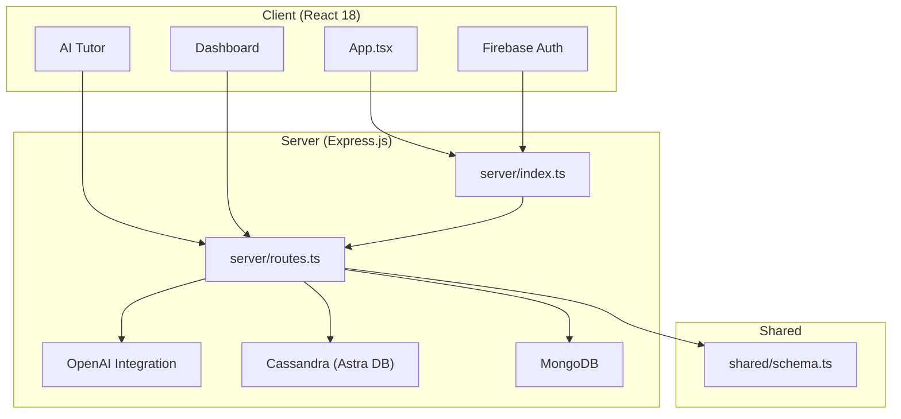
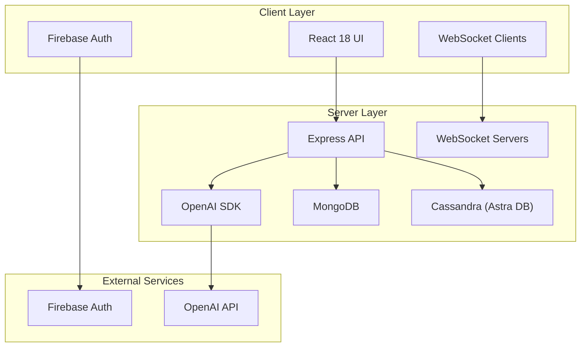
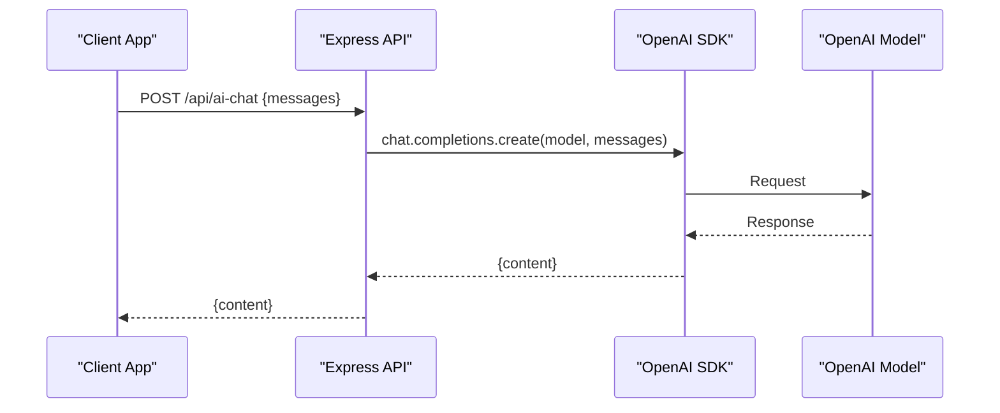
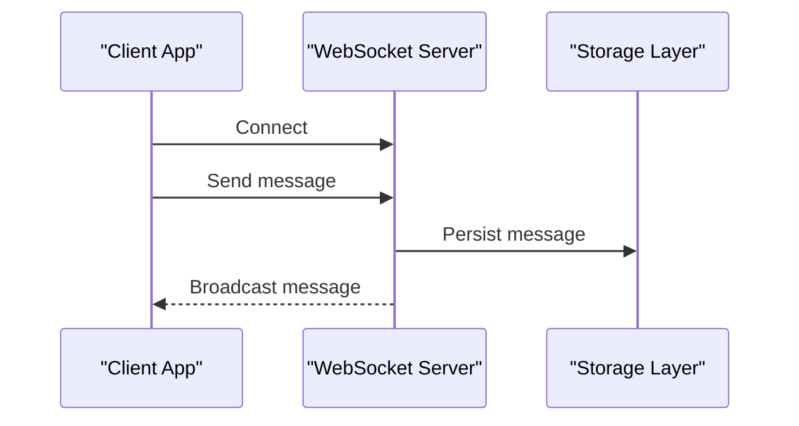
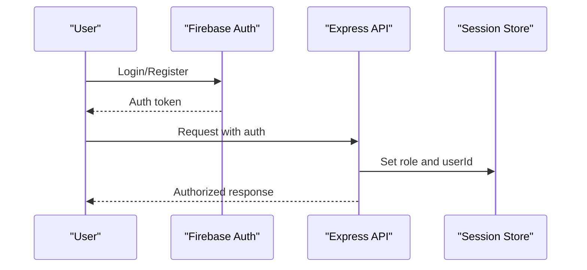
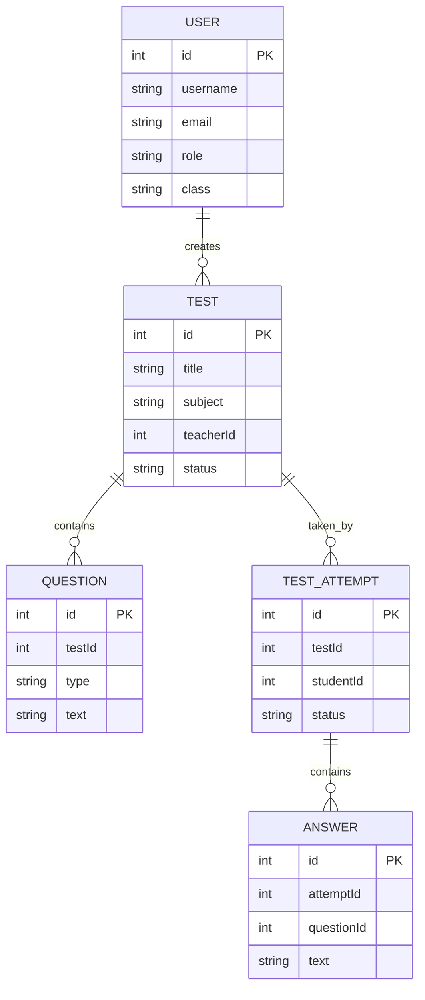
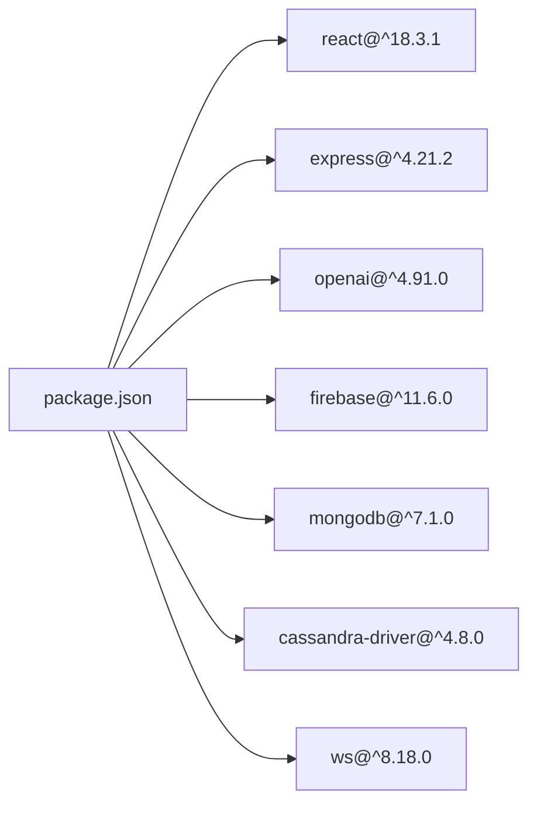

# Project Overview

<cite>
**Referenced Files in This Document**
- [README.md](file://README.md)
- [package.json](file://package.json)
- [server/index.ts](file://server/index.ts)
- [server/routes.ts](file://server/routes.ts)
- [server/lib/openai.ts](file://server/lib/openai.ts)
- [server/lib/cassandra.ts](file://server/lib/cassandra.ts)
- [server/db.ts](file://server/db.ts)
- [client/src/App.tsx](file://client/src/App.tsx)
- [client/src/lib/firebase.ts](file://client/src/lib/firebase.ts)
- [client/src/pages/ai-tutor.tsx](file://client/src/pages/ai-tutor.tsx)
- [client/src/pages/dashboard.tsx](file://client/src/pages/dashboard.tsx)
- [docker-compose.yml](file://docker-compose.yml)
- [shared/schema.ts](file://shared/schema.ts)
</cite>

## Table of Contents
1. [Introduction](#introduction)
2. [Project Structure](#project-structure)
3. [Core Components](#core-components)
4. [Architecture Overview](#architecture-overview)
5. [Detailed Component Analysis](#detailed-component-analysis)
6. [Dependency Analysis](#dependency-analysis)
7. [Performance Considerations](#performance-considerations)
8. [Troubleshooting Guide](#troubleshooting-guide)
9. [Conclusion](#conclusion)

## Introduction
PersonalLearningPro is an AI-powered personalized learning platform designed to enhance educational experiences through intelligent test creation, comprehensive performance analytics, and adaptive learning tools for students, teachers, administrators, and parents. The platform integrates modern technologies to deliver a seamless, real-time learning environment that supports both synchronous and asynchronous interactions, automated assessment, and AI-driven insights.

The platform’s mission is to democratize access to personalized education by combining robust backend infrastructure with a responsive frontend, enabling institutions to improve learning outcomes through data-informed strategies and AI-assisted tutoring.

## Project Structure
The repository follows a monorepo-style organization with clear separation between client, server, and shared code:
- client: React 18 frontend built with Vite, providing role-aware dashboards, AI tutoring, chat, and analytics.
- server: Express.js backend serving APIs, managing sessions, integrating OpenAI, and handling WebSocket connections.
- shared: Zod schemas and shared types used across client and server for consistent validation.
- docker-compose: Container orchestration for local development and deployment.

**Diagram sources**
- [server/index.ts](file://server/index.ts#L1-L114)
- [server/routes.ts](file://server/routes.ts#L1-L1104)
- [client/src/App.tsx](file://client/src/App.tsx#L1-L165)
- [client/src/lib/firebase.ts](file://client/src/lib/firebase.ts#L1-L212)
- [shared/schema.ts](file://shared/schema.ts#L1-L142)

**Section sources**
- [README.md](file://README.md#L70-L102)
- [docker-compose.yml](file://docker-compose.yml#L1-L24)

## Core Components
- AI-Powered Capabilities
  - AI Tutor: Interactive learning assistant with chat-based help and conversation persistence.
  - Test Creation: AI-assisted question generation and rubric-based evaluation.
  - Answer Evaluation: Automatic evaluation of subjective answers using OpenAI.
  - Performance Analysis: AI insights into student performance patterns and recommendations.
- Core Functionality
  - User Management: Role-based access control (Teacher, Student, Principal, Admin, Parent).
  - Test Management: Create, distribute, and evaluate tests with class-based visibility.
  - OCR Test Scanning: Convert physical test papers to digital format.
  - Student Directory: Browse students organized by standards (nursery to 12th grade).
  - Analytics Dashboard: Visual representation of performance metrics.
  - Learning Progress Tracking: Monitor improvement over time.

**Section sources**
- [README.md](file://README.md#L5-L20)
- [server/routes.ts](file://server/routes.ts#L110-L209)
- [client/src/pages/ai-tutor.tsx](file://client/src/pages/ai-tutor.tsx#L1-L604)

## Architecture Overview
The platform employs a layered architecture with clear separation of concerns:
- Frontend (React 18/Vite): Provides role-aware UIs, real-time chat, and AI tutoring.
- Backend (Express.js): Exposes RESTful APIs, manages sessions, and orchestrates integrations.
- Real-Time Communication: WebSocket servers for chat and MessagePal features.
- Data Layer: MongoDB for general user and metadata storage, Cassandra (Astra DB) for scalable message storage.
- AI Integration: OpenAI for chat, evaluation, study plan generation, and performance analysis.
- Authentication: Firebase for user authentication and profile management.

**Diagram sources**
- [server/index.ts](file://server/index.ts#L1-L114)
- [server/routes.ts](file://server/routes.ts#L1-L1104)
- [server/lib/openai.ts](file://server/lib/openai.ts#L1-L217)
- [server/lib/cassandra.ts](file://server/lib/cassandra.ts#L1-L73)
- [server/db.ts](file://server/db.ts#L1-L21)
- [client/src/lib/firebase.ts](file://client/src/lib/firebase.ts#L1-L212)

## Detailed Component Analysis

### Technology Stack Overview
- Frontend: React 18 with Vite, Radix UI, Tailwind CSS, React Query for caching, and WebSocket clients for real-time features.
- Backend: Express.js with TypeScript, session management, and modular route handlers.
- Databases: MongoDB for general data and Cassandra (Astra DB) for message storage with partitioned and clustering keys.
- Real-Time: WebSocket servers for chat and MessagePal.
- AI: OpenAI integration for chat, evaluation, study plan generation, and performance analysis.
- Authentication: Firebase for user registration, login, and profile management.

**Section sources**
- [package.json](file://package.json#L12-L88)
- [server/index.ts](file://server/index.ts#L1-L114)
- [server/lib/openai.ts](file://server/lib/openai.ts#L1-L217)
- [server/lib/cassandra.ts](file://server/lib/cassandra.ts#L1-L73)
- [server/db.ts](file://server/db.ts#L1-L21)
- [client/src/lib/firebase.ts](file://client/src/lib/firebase.ts#L1-L212)

### AI Integration Flow
The AI integration is centralized in the backend and consumed by the frontend:
- AI Chat: Endpoint accepts a message array and returns a response from OpenAI.
- Answer Evaluation: Teachers can evaluate subjective answers using AI with rubrics.
- Study Plan Generation: Personalized study plans based on weak and strong topics.
- Performance Analysis: Insights into average scores, hardest questions, and recommendations.

**Diagram sources**
- [server/routes.ts](file://server/routes.ts#L561-L580)
- [server/lib/openai.ts](file://server/lib/openai.ts#L20-L42)

**Section sources**
- [server/routes.ts](file://server/routes.ts#L487-L580)
- [server/lib/openai.ts](file://server/lib/openai.ts#L1-L217)

### Real-Time Communication (WebSocket)
The backend initializes WebSocket servers for chat and MessagePal, enabling real-time messaging and collaboration:
- Chat WebSocket: Manages real-time chat events and broadcasts messages to connected clients.
- MessagePal WebSocket: Dedicated server for MessagePal features with separate routes and storage.

**Diagram sources**
- [server/index.ts](file://server/index.ts#L76-L85)

**Section sources**
- [server/index.ts](file://server/index.ts#L1-L114)

### Authentication and Authorization
Firebase provides authentication and user profiles, while the backend enforces role-based access control:
- Firebase Auth: Email/password and Google OAuth with Firestore user profiles.
- Session Management: Express session stores user roles and permissions.
- Role-Based Routes: Teachers can create tests; students can attempt tests; admins/principals have elevated access.

**Diagram sources**
- [client/src/lib/firebase.ts](file://client/src/lib/firebase.ts#L66-L115)
- [server/routes.ts](file://server/routes.ts#L13-L85)

**Section sources**
- [client/src/lib/firebase.ts](file://client/src/lib/firebase.ts#L1-L212)
- [server/routes.ts](file://server/routes.ts#L11-L85)

### Data Models and Validation
Shared Zod schemas define strict validation for requests and responses across the client-server boundary:
- User, Test, Question, TestAttempt, Answer, Analytics, Workspace, Channel, Message schemas.
- Ensures consistent data structures and reduces runtime errors.

**Diagram sources**
- [shared/schema.ts](file://shared/schema.ts#L4-L88)

**Section sources**
- [shared/schema.ts](file://shared/schema.ts#L1-L142)

### Target Audience and Value Proposition
- Students: Personalized AI tutoring, test-taking assistance, and progress tracking.
- Teachers: Test creation, automated evaluation, analytics, and classroom management.
- Administrators/Principals: Institutional analytics, resource allocation, and performance monitoring.
- Parents: Access to student performance and learning insights.

Key Differentiators:
- AI-driven personalization for learning and assessment.
- Real-time collaboration and messaging.
- Role-based dashboards tailored to each stakeholder.
- Scalable data storage with MongoDB and Cassandra.

**Section sources**
- [README.md](file://README.md#L5-L20)
- [client/src/pages/dashboard.tsx](file://client/src/pages/dashboard.tsx#L1-L338)

### Modern Education Technology Impact
- Adaptive Learning: AI insights guide personalized study plans and remediation.
- Data-Driven Instruction: Teachers leverage analytics to adjust pedagogy and focus areas.
- Accessibility: Real-time features and OCR scanning support diverse learning needs.
- Scalability: Containerized deployment and managed databases ensure reliable growth.

[No sources needed since this section synthesizes insights without quoting specific files]

## Dependency Analysis
The project’s dependencies reflect a cohesive tech stack emphasizing modern frontend/backend practices, AI integration, and real-time capabilities.

**Diagram sources**
- [package.json](file://package.json#L12-L88)

**Section sources**
- [package.json](file://package.json#L1-L120)

## Performance Considerations
- Real-Time Efficiency: WebSocket servers minimize latency for chat and collaboration.
- Database Scaling: Cassandra’s partitioned design supports high-throughput message storage.
- AI Responsiveness: OpenAI requests are asynchronous; consider caching responses for repeated queries.
- Frontend Caching: React Query optimizes client-side data fetching and updates.
- Containerization: Docker Compose enables efficient local development and deployment scaling.

[No sources needed since this section provides general guidance]

## Troubleshooting Guide
Common issues and resolutions:
- Missing Environment Variables: Ensure OPENAI_API_KEY and Firebase credentials are configured; otherwise, AI features or auth will be disabled.
- Database Connectivity: MongoDB connection errors are non-fatal; verify MONGODB_URL; Cassandra requires Astra DB credentials.
- WebSocket Issues: Confirm WebSocket initialization and port exposure; verify client connectivity.
- CORS and Sessions: Validate session configuration and cookie settings for production deployments.

**Section sources**
- [README.md](file://README.md#L53-L69)
- [server/db.ts](file://server/db.ts#L1-L21)
- [server/lib/cassandra.ts](file://server/lib/cassandra.ts#L1-L73)
- [server/index.ts](file://server/index.ts#L31-L44)

## Conclusion
PersonalLearningPro represents a forward-thinking approach to modern education technology, combining AI-driven insights, real-time collaboration, and scalable infrastructure to support learners and educators. Its layered architecture, robust validation, and containerized deployment position it to adapt and grow with evolving institutional needs, ultimately aiming to improve learning outcomes through personalized, data-informed strategies.

[No sources needed since this section summarizes without analyzing specific files]