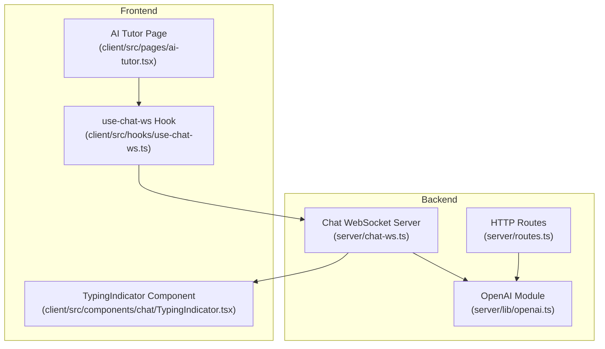
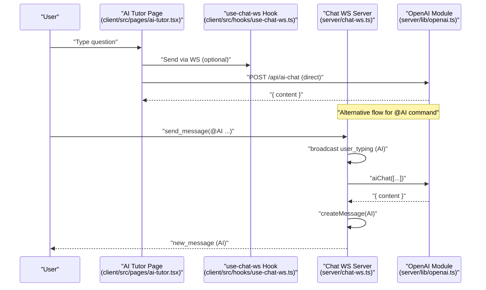
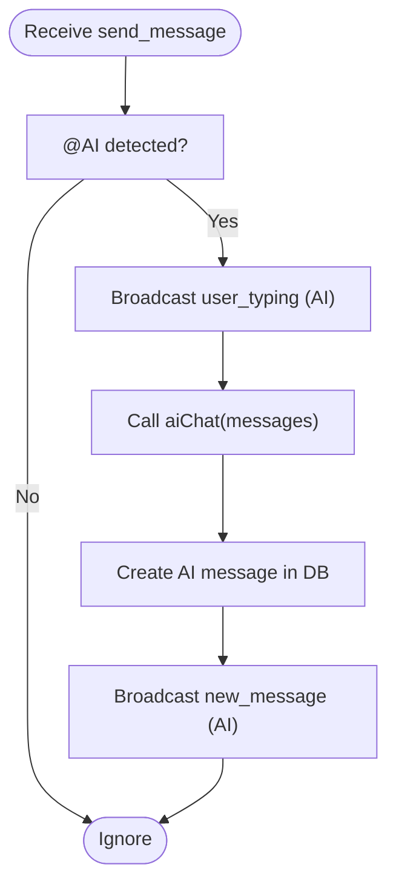
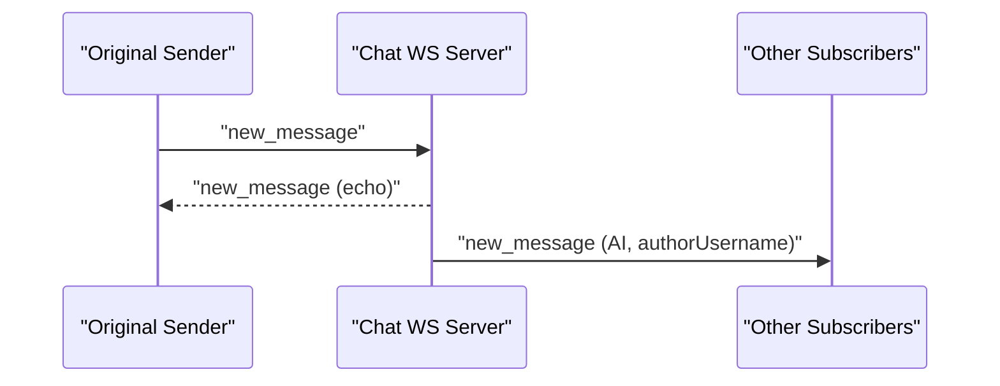
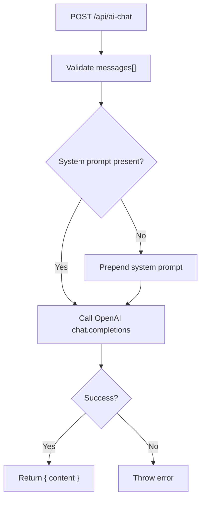
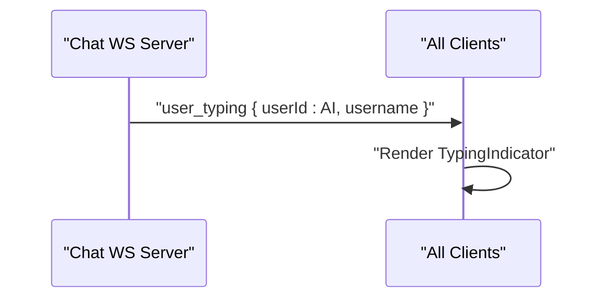
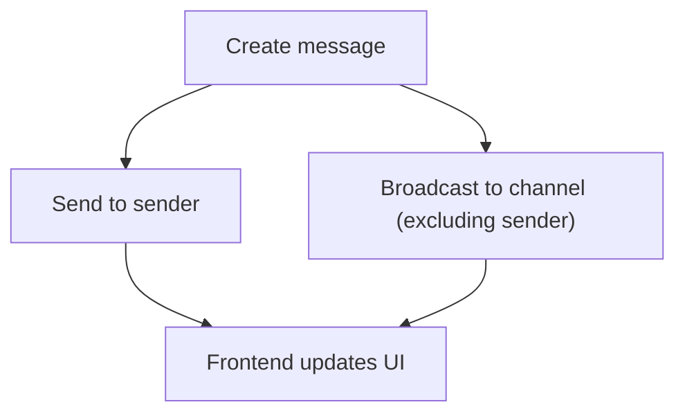
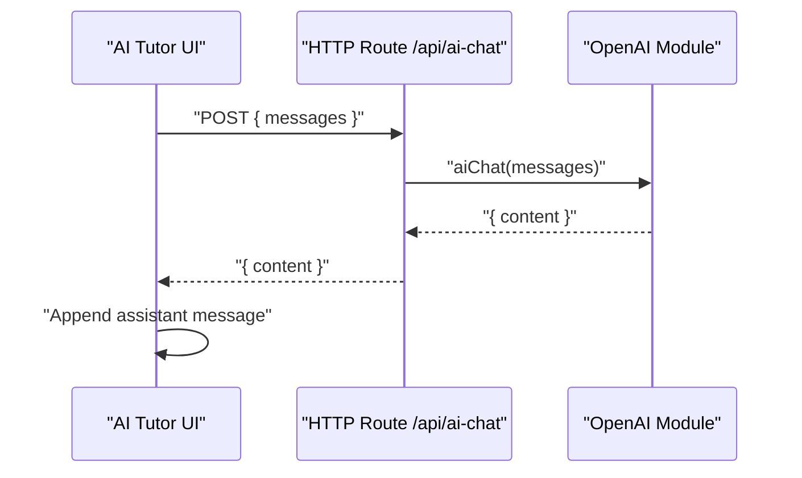
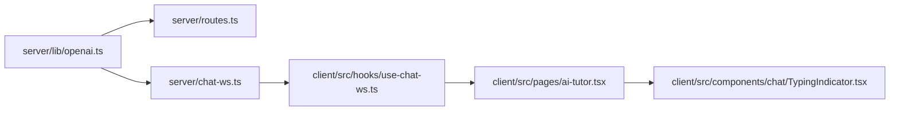

# AI Assistant Integration

<cite>
**Referenced Files in This Document**
- [server/chat-ws.ts](file://server/chat-ws.ts)
- [server/lib/openai.ts](file://server/lib/openai.ts)
- [server/routes.ts](file://server/routes.ts)
- [client/src/pages/ai-tutor.tsx](file://client/src/pages/ai-tutor.tsx)
- [client/src/components/chat/TypingIndicator.tsx](file://client/src/components/chat/TypingIndicator.tsx)
- [client/src/hooks/use-chat-ws.ts](file://client/src/hooks/use-chat-ws.ts)
- [.env.example](file://.env.example)
- [README.md](file://README.md)
</cite>

## Table of Contents
1. [Introduction](#introduction)
2. [Project Structure](#project-structure)
3. [Core Components](#core-components)
4. [Architecture Overview](#architecture-overview)
5. [Detailed Component Analysis](#detailed-component-analysis)
6. [Dependency Analysis](#dependency-analysis)
7. [Performance Considerations](#performance-considerations)
8. [Troubleshooting Guide](#troubleshooting-guide)
9. [Conclusion](#conclusion)

## Introduction
This document explains how the AI assistant is integrated into the real-time communication system. It covers the @AI command processing, AI tutor message handling, automated response generation, typing indicator simulation, and response broadcasting. It also documents configuration options for AI integration, error handling and fallback mechanisms, AI tutor identity management, message attribution, user interaction patterns, and performance considerations.

## Project Structure
The AI integration spans both the backend WebSocket server and the frontend chat UI:
- Backend: WebSocket message handling, AI chat orchestration, and HTTP route for direct AI chat requests
- Frontend: AI tutor page, WebSocket hook for real-time events, and typing indicator UI

**Diagram sources**
- [server/chat-ws.ts](file://server/chat-ws.ts#L1-L393)
- [server/lib/openai.ts](file://server/lib/openai.ts#L1-L217)
- [server/routes.ts](file://server/routes.ts#L561-L580)
- [client/src/pages/ai-tutor.tsx](file://client/src/pages/ai-tutor.tsx#L1-L604)
- [client/src/hooks/use-chat-ws.ts](file://client/src/hooks/use-chat-ws.ts#L1-L218)
- [client/src/components/chat/TypingIndicator.tsx](file://client/src/components/chat/TypingIndicator.tsx#L1-L19)

**Section sources**
- [README.md](file://README.md#L1-L69)
- [server/chat-ws.ts](file://server/chat-ws.ts#L1-L393)
- [server/lib/openai.ts](file://server/lib/openai.ts#L1-L217)
- [server/routes.ts](file://server/routes.ts#L561-L580)
- [client/src/pages/ai-tutor.tsx](file://client/src/pages/ai-tutor.tsx#L1-L604)
- [client/src/hooks/use-chat-ws.ts](file://client/src/hooks/use-chat-ws.ts#L1-L218)
- [client/src/components/chat/TypingIndicator.tsx](file://client/src/components/chat/TypingIndicator.tsx#L1-L19)

## Core Components
- AI chat orchestration and identity management in the WebSocket server
- OpenAI integration with automatic system prompt injection and robust error handling/fallbacks
- HTTP route for direct AI chat requests from the AI tutor page
- Real-time typing indicators and message broadcasting
- Frontend AI tutor page with conversation persistence and error handling

**Section sources**
- [server/chat-ws.ts](file://server/chat-ws.ts#L7-L8)
- [server/lib/openai.ts](file://server/lib/openai.ts#L20-L42)
- [server/routes.ts](file://server/routes.ts#L561-L580)
- [client/src/pages/ai-tutor.tsx](file://client/src/pages/ai-tutor.tsx#L122-L191)
- [client/src/components/chat/TypingIndicator.tsx](file://client/src/components/chat/TypingIndicator.tsx#L1-L19)

## Architecture Overview
The AI assistant integrates through two primary flows:
- Real-time chat with @AI command triggering: WebSocket receives a message, broadcasts a typing indicator, queries OpenAI, creates and broadcasts an AI message
- Direct AI chat via HTTP: The AI tutor page sends a POST request to /api/ai-chat, which invokes the same OpenAI module

**Diagram sources**
- [server/chat-ws.ts](file://server/chat-ws.ts#L298-L334)
- [server/lib/openai.ts](file://server/lib/openai.ts#L20-L42)
- [server/routes.ts](file://server/routes.ts#L561-L580)
- [client/src/pages/ai-tutor.tsx](file://client/src/pages/ai-tutor.tsx#L122-L191)
- [client/src/hooks/use-chat-ws.ts](file://client/src/hooks/use-chat-ws.ts#L199-L217)

## Detailed Component Analysis

### AI Command Processing in Real-Time Chat
- Identity management: The AI tutor is represented by a fixed identity (ID and name) to distinguish AI messages from user messages
- @AI detection: The server checks if the incoming message content starts with or includes the @AI marker
- Typing indicator: Before querying the AI, the server broadcasts a typing indicator for the AI identity
- AI response generation: Calls the OpenAI chat completion function and creates a message attributed to the AI identity
- Broadcasting: Broadcasts the AI message to all channel subscribers except the original sender

**Diagram sources**
- [server/chat-ws.ts](file://server/chat-ws.ts#L298-L334)

**Section sources**
- [server/chat-ws.ts](file://server/chat-ws.ts#L7-L8)
- [server/chat-ws.ts](file://server/chat-ws.ts#L298-L334)

### AI Tutor Message Handling and Attribution
- Message creation: The server creates a message with authorId set to the AI identity and marks the sender as read for the original user
- Author attribution: The outgoing payload includes the AI username for display
- Message echo: The original sender receives the message back immediately, while others receive it via broadcast

**Diagram sources**
- [server/chat-ws.ts](file://server/chat-ws.ts#L286-L296)
- [server/chat-ws.ts](file://server/chat-ws.ts#L314-L329)

**Section sources**
- [server/chat-ws.ts](file://server/chat-ws.ts#L286-L296)
- [server/chat-ws.ts](file://server/chat-ws.ts#L314-L329)

### Automated Response Generation Workflow
- Endpoint: /api/ai-chat accepts an array of messages and returns a content field
- System prompt: If no system message is present, the module injects a default system prompt tailored for high school tutoring
- Model: Uses a specific OpenAI model configured in the module
- Error handling: Wraps OpenAI calls and throws a standardized error on failure

**Diagram sources**
- [server/routes.ts](file://server/routes.ts#L561-L580)
- [server/lib/openai.ts](file://server/lib/openai.ts#L20-L42)

**Section sources**
- [server/routes.ts](file://server/routes.ts#L561-L580)
- [server/lib/openai.ts](file://server/lib/openai.ts#L20-L42)

### Typing Indicator Simulation
- Real-time typing: The server broadcasts a typing event for the AI identity when processing @AI commands
- Frontend rendering: The typing indicator component renders animated dots with optional name label

**Diagram sources**
- [server/chat-ws.ts](file://server/chat-ws.ts#L302-L308)
- [client/src/components/chat/TypingIndicator.tsx](file://client/src/components/chat/TypingIndicator.tsx#L1-L19)

**Section sources**
- [server/chat-ws.ts](file://server/chat-ws.ts#L302-L308)
- [client/src/components/chat/TypingIndicator.tsx](file://client/src/components/chat/TypingIndicator.tsx#L1-L19)

### Response Broadcasting Mechanisms
- Echo back: The sender receives the message immediately after creation
- Broadcast to channel: All other subscribers receive the message payload
- Presence and typing: Additional events (presence, typing) are broadcast similarly

**Diagram sources**
- [server/chat-ws.ts](file://server/chat-ws.ts#L294-L296)

**Section sources**
- [server/chat-ws.ts](file://server/chat-ws.ts#L294-L296)

### AI Tutor Page Interaction Patterns
- Conversation persistence: Conversations are stored in local storage with system prompts injected for continuity
- Direct HTTP chat: Sends POST /api/ai-chat with the current conversation messages
- Error handling: Displays a friendly error message if the AI request fails
- Loading states: Shows a loader and “Thinking…” while awaiting a response

**Diagram sources**
- [client/src/pages/ai-tutor.tsx](file://client/src/pages/ai-tutor.tsx#L122-L191)
- [server/routes.ts](file://server/routes.ts#L561-L580)
- [server/lib/openai.ts](file://server/lib/openai.ts#L20-L42)

**Section sources**
- [client/src/pages/ai-tutor.tsx](file://client/src/pages/ai-tutor.tsx#L66-L191)

### Configuration Options for AI Integration
- OpenAI API key: Required for AI features (tutor, test generation). If missing, AI features are disabled with a warning
- Environment variables: Firebase keys for authentication and database URIs for persistence

**Section sources**
- [.env.example](file://.env.example#L16-L28)
- [README.md](file://README.md#L53-L69)
- [server/lib/openai.ts](file://server/lib/openai.ts#L4-L6)

### Error Handling and Fallback Mechanisms
- OpenAI module: Throws a standardized error on failures; HTTP route returns a 500 with a generic message
- AI evaluation and study plan generation: Return structured fallbacks with safe defaults when AI calls fail or JSON parsing fails
- WebSocket server: Catches and logs AI-related errors during @AI command processing

**Section sources**
- [server/lib/openai.ts](file://server/lib/openai.ts#L38-L42)
- [server/lib/openai.ts](file://server/lib/openai.ts#L96-L105)
- [server/routes.ts](file://server/routes.ts#L576-L579)
- [server/chat-ws.ts](file://server/chat-ws.ts#L330-L333)

## Dependency Analysis
The AI integration depends on:
- OpenAI SDK for chat completions
- WebSocket server for real-time broadcasting
- HTTP routes for direct AI chat requests
- Frontend hooks and components for UI and event handling

**Diagram sources**
- [server/lib/openai.ts](file://server/lib/openai.ts#L1-L217)
- [server/routes.ts](file://server/routes.ts#L561-L580)
- [server/chat-ws.ts](file://server/chat-ws.ts#L1-L393)
- [client/src/hooks/use-chat-ws.ts](file://client/src/hooks/use-chat-ws.ts#L1-L218)
- [client/src/pages/ai-tutor.tsx](file://client/src/pages/ai-tutor.tsx#L1-L604)
- [client/src/components/chat/TypingIndicator.tsx](file://client/src/components/chat/TypingIndicator.tsx#L1-L19)

**Section sources**
- [server/lib/openai.ts](file://server/lib/openai.ts#L1-L217)
- [server/routes.ts](file://server/routes.ts#L561-L580)
- [server/chat-ws.ts](file://server/chat-ws.ts#L1-L393)
- [client/src/hooks/use-chat-ws.ts](file://client/src/hooks/use-chat-ws.ts#L1-L218)
- [client/src/pages/ai-tutor.tsx](file://client/src/pages/ai-tutor.tsx#L1-L604)
- [client/src/components/chat/TypingIndicator.tsx](file://client/src/components/chat/TypingIndicator.tsx#L1-L19)

## Performance Considerations
- Rate limiting: The WebSocket server enforces rate limiting on message sending to prevent flooding
- Asynchronous AI processing: AI responses are computed asynchronously; the UI remains responsive
- Typing indicators: Lightweight real-time signals that avoid heavy computations
- Persistence: AI messages are persisted to the database and broadcast to all channel subscribers

Recommendations:
- Consider caching frequent prompts or partial responses where appropriate
- Monitor OpenAI latency and implement client-side timeouts
- Use exponential backoff for reconnections in the WebSocket hook
- Batch or debounce typing indicators if needed to reduce traffic

**Section sources**
- [server/chat-ws.ts](file://server/chat-ws.ts#L262-L273)
- [client/src/hooks/use-chat-ws.ts](file://client/src/hooks/use-chat-ws.ts#L144-L157)

## Troubleshooting Guide
Common issues and resolutions:
- Missing OpenAI API key: AI features are disabled; set OPENAI_API_KEY in environment variables
- Unauthorized WebSocket connections: Ensure proper session-based authentication before connecting
- AI service failures: The OpenAI module throws errors; the HTTP route returns a 500 with a generic message; UI displays a friendly error message
- JSON parsing errors: AI evaluation and study plan generation include fallbacks when JSON parsing fails
- WebSocket disconnections: The hook implements exponential backoff and stops reconnecting on unauthorized codes

**Section sources**
- [.env.example](file://.env.example#L16-L19)
- [server/lib/openai.ts](file://server/lib/openai.ts#L4-L6)
- [server/lib/openai.ts](file://server/lib/openai.ts#L96-L105)
- [server/routes.ts](file://server/routes.ts#L576-L579)
- [client/src/pages/ai-tutor.tsx](file://client/src/pages/ai-tutor.tsx#L175-L191)
- [client/src/hooks/use-chat-ws.ts](file://client/src/hooks/use-chat-ws.ts#L144-L157)

## Conclusion
The AI assistant integration combines a robust backend with a responsive frontend to deliver real-time, personalized tutoring experiences. The @AI command triggers a seamless flow involving typing indicators, asynchronous AI processing, and immediate broadcasting. Configuration is straightforward, error handling is resilient, and the system scales with the existing chat infrastructure.