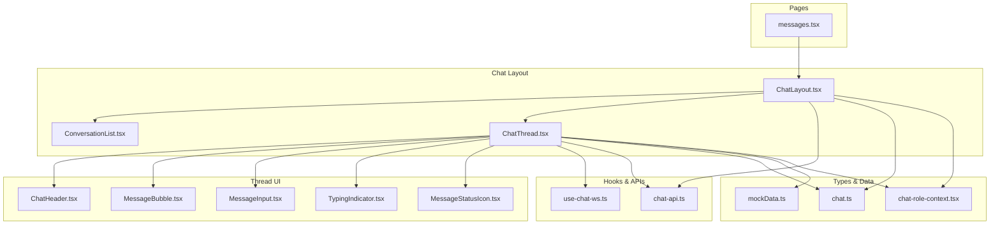
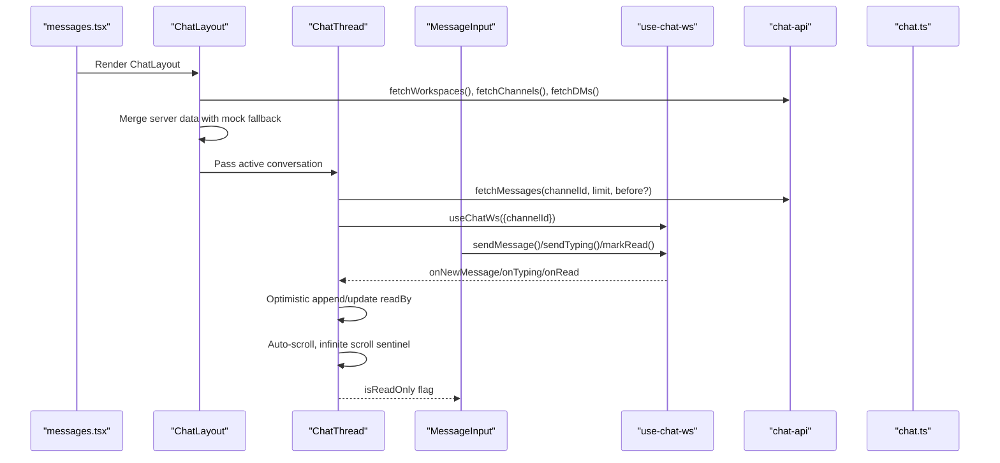
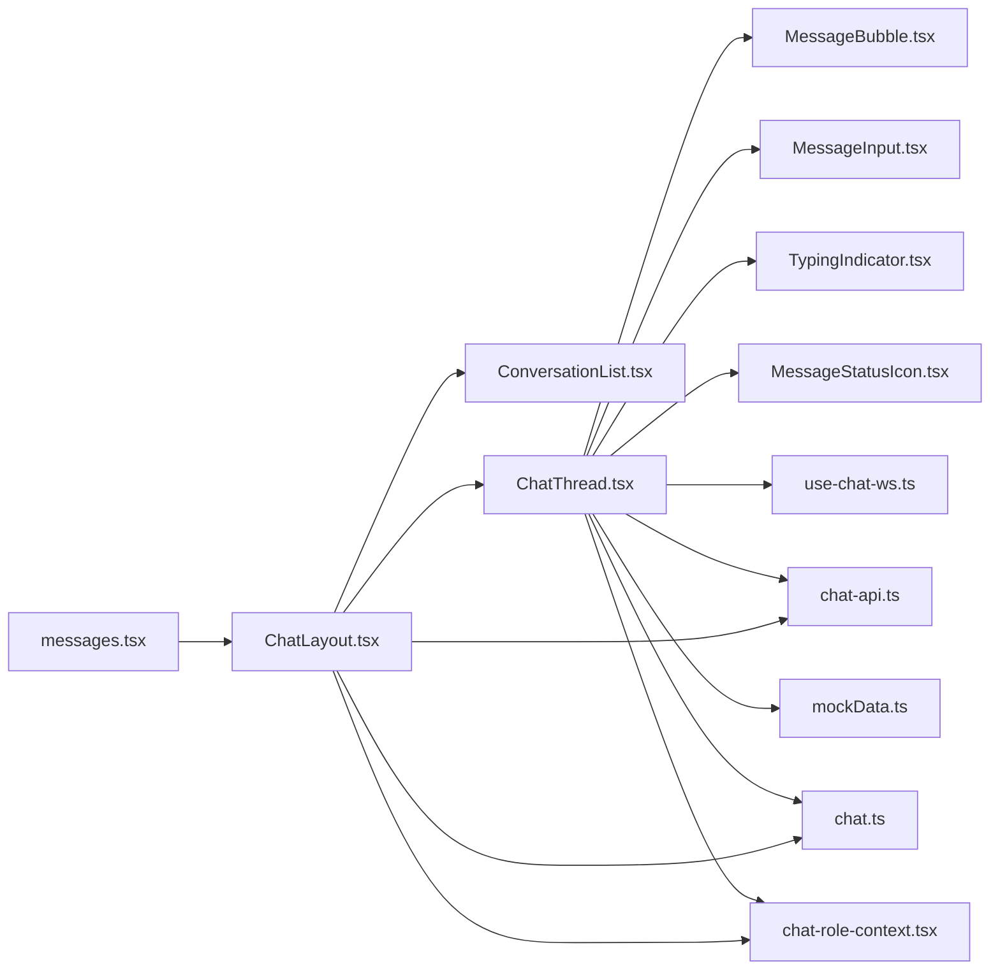
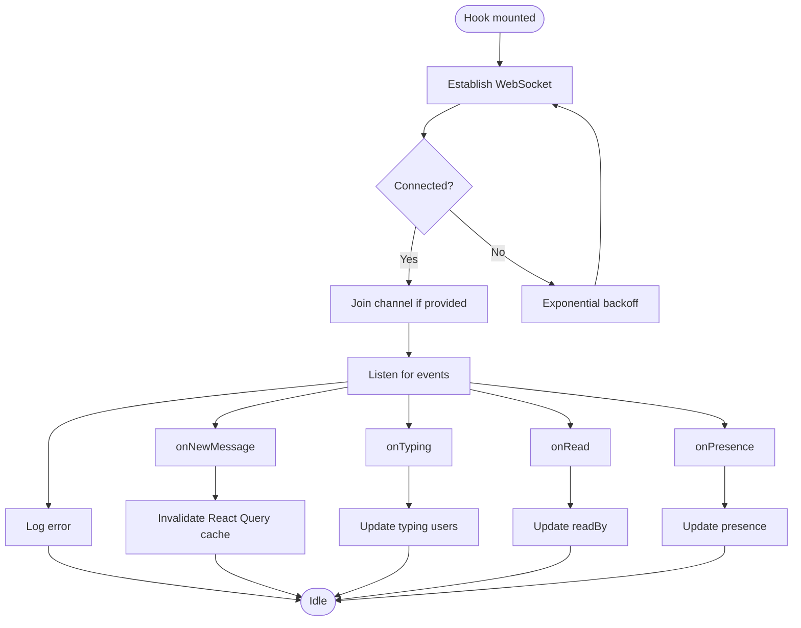

# Frontend Integration & Components

<cite>
**Referenced Files in This Document**
- [ChatLayout.tsx](file://client/src/components/chat/ChatLayout.tsx)
- [ChatThread.tsx](file://client/src/components/chat/ChatThread.tsx)
- [ConversationList.tsx](file://client/src/components/chat/ConversationList.tsx)
- [MessageBubble.tsx](file://client/src/components/chat/MessageBubble.tsx)
- [MessageInput.tsx](file://client/src/components/chat/MessageInput.tsx)
- [TypingIndicator.tsx](file://client/src/components/chat/TypingIndicator.tsx)
- [MessageStatusIcon.tsx](file://client/src/components/chat/MessageStatusIcon.tsx)
- [ChatHeader.tsx](file://client/src/components/chat/ChatHeader.tsx)
- [use-chat-ws.ts](file://client/src/hooks/use-chat-ws.ts)
- [chat-api.ts](file://client/src/lib/chat-api.ts)
- [chat.ts](file://client/src/types/chat.ts)
- [mockData.ts](file://client/src/data/mockData.ts)
- [chat-role-context.tsx](file://client/src/contexts/chat-role-context.tsx)
- [messages.tsx](file://client/src/pages/messages.tsx)
</cite>

## Table of Contents
1. [Introduction](#introduction)
2. [Project Structure](#project-structure)
3. [Core Components](#core-components)
4. [Architecture Overview](#architecture-overview)
5. [Detailed Component Analysis](#detailed-component-analysis)
6. [Dependency Analysis](#dependency-analysis)
7. [Performance Considerations](#performance-considerations)
8. [Troubleshooting Guide](#troubleshooting-guide)
9. [Conclusion](#conclusion)
10. [Appendices](#appendices)

## Introduction
This document explains the frontend integration and real-time chat components in PersonalLearningPro. It focuses on the React component architecture for chat, including ChatLayout, ChatThread, MessageBubble, MessageInput, and related UI components. It details the WebSocket hook implementation (use-chat-ws.ts) for managing real-time connections, state synchronization, and event handling. It also covers the message rendering system, typing indicators, user presence management, and real-time updates. Component prop interfaces, event handlers, and integration patterns with the overall application state are documented, along with responsive design considerations, accessibility features, and performance optimizations for smooth real-time communication.

## Project Structure
The chat feature is organized under client/src/components/chat and client/src/hooks, with supporting libraries and types under client/src/lib and client/src/types. The main entry is the Messages page that renders ChatLayout, which orchestrates conversation discovery, selection, and thread rendering.

**Diagram sources**
- [messages.tsx](file://client/src/pages/messages.tsx#L1-L15)
- [ChatLayout.tsx](file://client/src/components/chat/ChatLayout.tsx#L1-L185)
- [ConversationList.tsx](file://client/src/components/chat/ConversationList.tsx#L1-L162)
- [ChatThread.tsx](file://client/src/components/chat/ChatThread.tsx#L1-L376)
- [ChatHeader.tsx](file://client/src/components/chat/ChatHeader.tsx#L1-L116)
- [MessageBubble.tsx](file://client/src/components/chat/MessageBubble.tsx#L1-L157)
- [MessageInput.tsx](file://client/src/components/chat/MessageInput.tsx#L1-L143)
- [TypingIndicator.tsx](file://client/src/components/chat/TypingIndicator.tsx#L1-L19)
- [MessageStatusIcon.tsx](file://client/src/components/chat/MessageStatusIcon.tsx#L1-L24)
- [use-chat-ws.ts](file://client/src/hooks/use-chat-ws.ts#L1-L218)
- [chat-api.ts](file://client/src/lib/chat-api.ts#L1-L112)
- [chat.ts](file://client/src/types/chat.ts#L1-L83)
- [mockData.ts](file://client/src/data/mockData.ts#L1-L240)
- [chat-role-context.tsx](file://client/src/contexts/chat-role-context.tsx#L1-L59)

**Section sources**
- [messages.tsx](file://client/src/pages/messages.tsx#L1-L15)
- [ChatLayout.tsx](file://client/src/components/chat/ChatLayout.tsx#L1-L185)
- [chat.ts](file://client/src/types/chat.ts#L1-L83)

## Core Components
- ChatLayout: Orchestrates conversation discovery, merges server channels and DMs with mock fallback, manages active conversation, and mounts the shared WebSocket connection.
- ChatThread: Renders the selected conversation thread, handles message fetching/pagination, optimistic updates, read receipts, typing indicators, and integrates MessageInput and MessageBubble.
- ConversationList: Displays grouped conversations by category, supports search, and triggers selection callbacks.
- MessageBubble: Renders individual messages with type-specific styles, sender info, mentions, replies, and status badges.
- MessageInput: Provides text input, file attachment, doubt mode, and sends messages via WebSocket or mock flow.
- TypingIndicator: Shows typing dots with optional user name.
- MessageStatusIcon: Visualizes message delivery/read status.
- use-chat-ws: Manages WebSocket lifecycle, joins/leaves channels, emits typed events, and exposes send helpers.
- chat-api: REST client for workspaces, channels, DMs, messages, and uploads.
- Types: Unified message/conversation/user types and server shapes.
- mockData: Dev-mode fallback data for conversations and messages.
- chat-role-context: Provides current user role and identity derived from authentication.

**Section sources**
- [ChatLayout.tsx](file://client/src/components/chat/ChatLayout.tsx#L1-L185)
- [ChatThread.tsx](file://client/src/components/chat/ChatThread.tsx#L1-L376)
- [ConversationList.tsx](file://client/src/components/chat/ConversationList.tsx#L1-L162)
- [MessageBubble.tsx](file://client/src/components/chat/MessageBubble.tsx#L1-L157)
- [MessageInput.tsx](file://client/src/components/chat/MessageInput.tsx#L1-L143)
- [TypingIndicator.tsx](file://client/src/components/chat/TypingIndicator.tsx#L1-L19)
- [MessageStatusIcon.tsx](file://client/src/components/chat/MessageStatusIcon.tsx#L1-L24)
- [use-chat-ws.ts](file://client/src/hooks/use-chat-ws.ts#L1-L218)
- [chat-api.ts](file://client/src/lib/chat-api.ts#L1-L112)
- [chat.ts](file://client/src/types/chat.ts#L1-L83)
- [mockData.ts](file://client/src/data/mockData.ts#L1-L240)
- [chat-role-context.tsx](file://client/src/contexts/chat-role-context.tsx#L1-L59)

## Architecture Overview
The chat architecture combines React Query for caching and pagination, a shared WebSocket connection for real-time updates, and a hybrid server/dev mode using mock data. ChatLayout discovers channels/DMs and selects the active conversation. ChatThread fetches messages, applies optimistic updates, and subscribes to WebSocket events. MessageInput sends messages and typing indicators. MessageBubble renders messages with rich formatting. TypingIndicator and MessageStatusIcon provide UX feedback.

**Diagram sources**
- [messages.tsx](file://client/src/pages/messages.tsx#L1-L15)
- [ChatLayout.tsx](file://client/src/components/chat/ChatLayout.tsx#L1-L185)
- [ChatThread.tsx](file://client/src/components/chat/ChatThread.tsx#L1-L376)
- [MessageInput.tsx](file://client/src/components/chat/MessageInput.tsx#L1-L143)
- [use-chat-ws.ts](file://client/src/hooks/use-chat-ws.ts#L1-L218)
- [chat-api.ts](file://client/src/lib/chat-api.ts#L1-L112)
- [chat.ts](file://client/src/types/chat.ts#L1-L83)

## Detailed Component Analysis

### ChatLayout
Responsibilities:
- Discover workspaces, channels, and DMs via React Query.
- Merge server channels/DMs with mock fallback conversations.
- Track and update the active conversation, resetting selection when lists change.
- Mount a shared WebSocket bound to the active channel.

Key behaviors:
- Converts server ApiChannel shapes to UI Conversation.
- Uses ChatRoleProvider to derive current role and user.
- Conditionally enables queries based on fetched data.
- Integrates ConversationList and ChatThread.

Prop interfaces and events:
- Props: none (wraps inner component).
- Events: onSelect callback to select a conversation; handleBack to return to list.

Integration patterns:
- React Query keys depend on workspaces and channels; staleTime and retries configured.
- WebSocket options pass channelId and event callbacks.

Accessibility and responsiveness:
- Responsive sidebar with hidden-on-mobile behavior.
- Placeholder guidance when no conversation is selected.

**Section sources**
- [ChatLayout.tsx](file://client/src/components/chat/ChatLayout.tsx#L1-L185)
- [chat-api.ts](file://client/src/lib/chat-api.ts#L1-L112)
- [chat.ts](file://client/src/types/chat.ts#L1-L83)
- [chat-role-context.tsx](file://client/src/contexts/chat-role-context.tsx#L1-L59)

### ChatThread
Responsibilities:
- Render the selected conversation thread with grouped-by-day messages.
- Manage optimistic message insertion and deduplication.
- Handle infinite scroll to load older messages.
- Track and clear read receipts when messages become visible.
- Integrate MessageInput and MessageBubble.

Real-time and state:
- Subscribes to WebSocket events: new_message, user_typing, message_read.
- Converts server message shapes to UI Message.
- Uses React Query cache invalidation and updates for consistency.

Message rendering:
- Groups messages by sender and day labels.
- Supports reply previews, mentions, and type-specific rendering (announcement, assignment, image).
- Applies sender role-based colors and doubt badges.

Read receipts:
- Observes message visibility to mark as read via WebSocket.

Optimistic UI:
- Inserts temporary messages during send; transitions statuses if WebSocket is unavailable.

**Section sources**
- [ChatThread.tsx](file://client/src/components/chat/ChatThread.tsx#L1-L376)
- [MessageBubble.tsx](file://client/src/components/chat/MessageBubble.tsx#L1-L157)
- [MessageInput.tsx](file://client/src/components/chat/MessageInput.tsx#L1-L143)
- [use-chat-ws.ts](file://client/src/hooks/use-chat-ws.ts#L1-L218)
- [chat.ts](file://client/src/types/chat.ts#L1-L83)
- [chat-api.ts](file://client/src/lib/chat-api.ts#L1-L112)

### ConversationList
Responsibilities:
- Filter and group conversations by category (Announcements, Classes, Teachers, Friends, Parents).
- Display last message preview, unread counts, and online indicators for DMs.
- Provide search and selection callbacks.

Interaction:
- onSelect triggers ChatLayout to switch active conversation.
- Uses current role and user ID to tailor previews.

**Section sources**
- [ConversationList.tsx](file://client/src/components/chat/ConversationList.tsx#L1-L162)
- [chat.ts](file://client/src/types/chat.ts#L1-L83)
- [mockData.ts](file://client/src/data/mockData.ts#L1-L240)

### MessageBubble
Responsibilities:
- Render message content with type-specific styling and metadata.
- Support announcement, assignment, system, and regular text/media messages.
- Show sender name, reply preview, mentions, pins, and timestamps.
- Display status icons for own messages.

Rendering logic:
- Conditional rendering for announcement, assignment, system, and doubt modes.
- Role-based sender color classes.
- Image attachments with lazy loading.

**Section sources**
- [MessageBubble.tsx](file://client/src/components/chat/MessageBubble.tsx#L1-L157)
- [MessageStatusIcon.tsx](file://client/src/components/chat/MessageStatusIcon.tsx#L1-L24)
- [chat.ts](file://client/src/types/chat.ts#L1-L83)

### MessageInput
Responsibilities:
- Capture text input, support doubt mode, and file uploads.
- Send messages via WebSocket or mock flow.
- Emit typing indicators periodically.

Features:
- Doubt mode toggles for student/teacher roles.
- File upload with progress-aware UI.
- Read-only mode for announcement channels.

**Section sources**
- [MessageInput.tsx](file://client/src/components/chat/MessageInput.tsx#L1-L143)
- [chat-api.ts](file://client/src/lib/chat-api.ts#L1-L112)
- [chat-role-context.tsx](file://client/src/contexts/chat-role-context.tsx#L1-L59)

### TypingIndicator
Responsibilities:
- Visual indicator for who is typing with animated dots.
- Optional user name display.

**Section sources**
- [TypingIndicator.tsx](file://client/src/components/chat/TypingIndicator.tsx#L1-L19)

### MessageStatusIcon
Responsibilities:
- Visual status indicators for message sending/sent/delivered/read.

**Section sources**
- [MessageStatusIcon.tsx](file://client/src/components/chat/MessageStatusIcon.tsx#L1-L24)
- [chat.ts](file://client/src/types/chat.ts#L1-L83)

### use-chat-ws Hook
Responsibilities:
- Establish and manage a WebSocket connection to /ws/chat.
- Join/leave channels dynamically based on active conversation.
- Parse incoming events and dispatch typed callbacks.
- Provide public APIs: sendMessage, sendTyping, markRead.

Event model:
- WsIncomingEvent union includes new_message, user_typing, message_read, user_presence, and connection lifecycle events.
- Options allow injecting custom handlers for each event type.

Connection management:
- Connect on mount; exponential backoff on disconnect (except 4001 unauthorized).
- Cleanup on unmount, cancel pending timeouts, and close socket cleanly.
- Stable refs for callbacks to avoid stale closures.

Public API:
- sendMessage(channelId, content, messageType?, fileUrl?)
- sendTyping(channelId)
- markRead(channelId, messageId)

**Section sources**
- [use-chat-ws.ts](file://client/src/hooks/use-chat-ws.ts#L1-L218)

### chat-api Library
Responsibilities:
- REST client for workspaces, channels, DMs, messages, and uploads.
- Enforces credential inclusion and JSON parsing.

Endpoints:
- GET /api/workspaces
- GET /api/workspaces/{id}/channels
- GET /api/users/me/dms
- GET /api/channels/{id}/messages?limit&before
- POST /api/upload (multipart/form-data)

**Section sources**
- [chat-api.ts](file://client/src/lib/chat-api.ts#L1-L112)

### Types and Data
- chat.ts defines server shapes (ApiChannel, ApiMessage), UI shapes (Message, Conversation, User), and enums (UserRole, MessageType, ConversationCategory).
- mockData.ts provides dev-mode conversations and messages keyed by role and conversation ID.

**Section sources**
- [chat.ts](file://client/src/types/chat.ts#L1-L83)
- [mockData.ts](file://client/src/data/mockData.ts#L1-L240)

### Role Context
- chat-role-context.tsx derives current role from Firebase auth profile and exposes current user and setter (derived, not mutable).

**Section sources**
- [chat-role-context.tsx](file://client/src/contexts/chat-role-context.tsx#L1-L59)

## Dependency Analysis
The chat module exhibits clear separation of concerns:
- Pages depend on ChatLayout.
- ChatLayout depends on ConversationList and ChatThread, and on chat-api and types.
- ChatThread depends on MessageBubble, MessageInput, TypingIndicator, MessageStatusIcon, use-chat-ws, chat-api, and types.
- use-chat-ws is a standalone hook consumed by ChatThread and optionally by other components.
- mockData is used by ChatLayout and ChatThread in dev mode.

**Diagram sources**
- [messages.tsx](file://client/src/pages/messages.tsx#L1-L15)
- [ChatLayout.tsx](file://client/src/components/chat/ChatLayout.tsx#L1-L185)
- [ConversationList.tsx](file://client/src/components/chat/ConversationList.tsx#L1-L162)
- [ChatThread.tsx](file://client/src/components/chat/ChatThread.tsx#L1-L376)
- [MessageBubble.tsx](file://client/src/components/chat/MessageBubble.tsx#L1-L157)
- [MessageInput.tsx](file://client/src/components/chat/MessageInput.tsx#L1-L143)
- [TypingIndicator.tsx](file://client/src/components/chat/TypingIndicator.tsx#L1-L19)
- [MessageStatusIcon.tsx](file://client/src/components/chat/MessageStatusIcon.tsx#L1-L24)
- [use-chat-ws.ts](file://client/src/hooks/use-chat-ws.ts#L1-L218)
- [chat-api.ts](file://client/src/lib/chat-api.ts#L1-L112)
- [chat.ts](file://client/src/types/chat.ts#L1-L83)
- [mockData.ts](file://client/src/data/mockData.ts#L1-L240)
- [chat-role-context.tsx](file://client/src/contexts/chat-role-context.tsx#L1-L59)

**Section sources**
- [ChatLayout.tsx](file://client/src/components/chat/ChatLayout.tsx#L1-L185)
- [ChatThread.tsx](file://client/src/components/chat/ChatThread.tsx#L1-L376)
- [use-chat-ws.ts](file://client/src/hooks/use-chat-ws.ts#L1-L218)

## Performance Considerations
- Infinite scroll: IntersectionObserver sentinel loads older messages without re-rendering the entire list.
- Optimistic UI: Adds perceived responsiveness by inserting local messages immediately; deduplicates with server confirmations.
- React Query: Caching and selective invalidation reduce redundant network calls.
- Memoization: useMemo and useCallback minimize re-renders in ChatLayout and ChatThread.
- Lazy image loading: MessageBubble uses lazy loading for media attachments.
- Debounced typing: Periodic typing events prevent excessive traffic.
- Scroll anchoring: Smooth scroll-to-bottom on new messages; preserve scroll position when loading older messages.
- Conditional rendering: Hide read-only UI and typing indicators when not applicable.

[No sources needed since this section provides general guidance]

## Troubleshooting Guide
Common issues and resolutions:
- WebSocket not connecting:
  - Verify server endpoint and protocol (wss vs ws) based on window location.
  - Check unauthorized disconnects (code 4001) and re-login if needed.
  - Inspect reconnect backoff behavior and console warnings.
- Messages not appearing:
  - Confirm channelId is numeric and positive; server channels only.
  - Ensure onNewMessage handler deduplicates optimistic messages and invalidates cache.
- Read receipts not updating:
  - Verify IntersectionObserver targets and element IDs match message IDs.
  - Confirm markRead is called with numeric message IDs.
- Typing indicators not clearing:
  - Ensure typing timers are reset on keystrokes and cleared after silence.
- File uploads failing:
  - Check multipart/form-data handling and upload endpoint availability.
- Read-only channels:
  - MessageInput displays a read-only banner; ensure isReadOnly is passed correctly.

**Section sources**
- [use-chat-ws.ts](file://client/src/hooks/use-chat-ws.ts#L1-L218)
- [ChatThread.tsx](file://client/src/components/chat/ChatThread.tsx#L1-L376)
- [MessageInput.tsx](file://client/src/components/chat/MessageInput.tsx#L1-L143)
- [chat-api.ts](file://client/src/lib/chat-api.ts#L1-L112)

## Conclusion
The chat feature integrates React Query for efficient data fetching and caching, a robust WebSocket hook for real-time updates, and a cohesive set of UI components for composing and rendering messages. The architecture supports server-backed channels and DMs with a seamless fallback to mock data for development. Real-time capabilities include live message delivery, typing indicators, read receipts, and presence-like signals. The design emphasizes responsiveness, accessibility, and performance through optimized rendering and caching strategies.

[No sources needed since this section summarizes without analyzing specific files]

## Appendices

### Component Prop Interfaces Summary
- ChatLayoutInner: no props; manages active conversation and WebSocket.
- ChatThread: requires Conversation; optional onBack.
- MessageBubble: requires Message, isOwn; optional showSender, senderName, replyContent.
- MessageInput: requires onSend; optional onTyping, isReadOnly.
- TypingIndicator: optional name.
- MessageStatusIcon: requires status.
- ChatHeader: requires Conversation; optional onBack.

**Section sources**
- [ChatLayout.tsx](file://client/src/components/chat/ChatLayout.tsx#L1-L185)
- [ChatThread.tsx](file://client/src/components/chat/ChatThread.tsx#L1-L376)
- [MessageBubble.tsx](file://client/src/components/chat/MessageBubble.tsx#L1-L157)
- [MessageInput.tsx](file://client/src/components/chat/MessageInput.tsx#L1-L143)
- [TypingIndicator.tsx](file://client/src/components/chat/TypingIndicator.tsx#L1-L19)
- [MessageStatusIcon.tsx](file://client/src/components/chat/MessageStatusIcon.tsx#L1-L24)
- [ChatHeader.tsx](file://client/src/components/chat/ChatHeader.tsx#L1-L116)

### WebSocket Event Flow

**Diagram sources**
- [use-chat-ws.ts](file://client/src/hooks/use-chat-ws.ts#L1-L218)