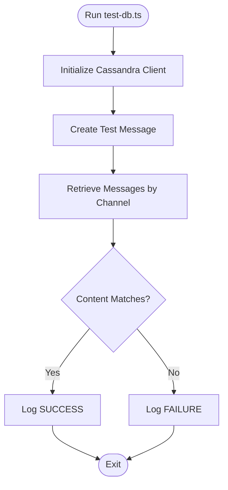

# Testing Strategy

<cite>
**Referenced Files in This Document**
- [package.json](file://package.json)
- [vite.config.ts](file://vite.config.ts)
- [client/src/tests/LoginPage.test.tsx](file://client/src/tests/LoginPage.test.tsx)
- [scripts/test-db.ts](file://scripts/test-db.ts)
- [server/storage.ts](file://server/storage.ts)
- [server/lib/cassandra.ts](file://server/lib/cassandra.ts)
- [server/routes.ts](file://server/routes.ts)
</cite>

## Table of Contents
1. [Introduction](#introduction)
2. [Project Structure](#project-structure)
3. [Core Components](#core-components)
4. [Architecture Overview](#architecture-overview)
5. [Detailed Component Analysis](#detailed-component-analysis)
6. [Dependency Analysis](#dependency-analysis)
7. [Performance Considerations](#performance-considerations)
8. [Troubleshooting Guide](#troubleshooting-guide)
9. [Conclusion](#conclusion)
10. [Appendices](#appendices)

## Introduction
This document defines a comprehensive testing strategy for PersonalLearningPro. It outlines the testing pyramid implementation across unit, integration, and component (UI) tests, details Vitest configuration and utilities, and documents backend testing approaches including database integration and API validation. It also covers best practices for React components, async operations, and WebSocket interactions, along with coverage expectations, CI testing, performance testing, debugging techniques, test data management, and automated workflows.

## Project Structure
The repository follows a frontend/backend split with a clear separation of concerns:
- Frontend (React + Vite): Located under client/. Includes UI components, pages, hooks, contexts, and tests.
- Backend (Express + TypeScript): Located under server/. Includes routes, storage abstraction, libraries for external integrations, and database helpers.
- Shared schemas/types: Located under shared/.
- Scripts: Utility scripts for local development and testing (e.g., database connectivity checks).

**Diagram sources**
- [vite.config.ts](file://vite.config.ts#L1-L35)
- [client/src/tests/LoginPage.test.tsx](file://client/src/tests/LoginPage.test.tsx#L1-L80)
- [server/routes.ts](file://server/routes.ts#L1-L800)
- [server/storage.ts](file://server/storage.ts#L1-L519)
- [server/lib/cassandra.ts](file://server/lib/cassandra.ts#L1-L73)
- [scripts/test-db.ts](file://scripts/test-db.ts#L1-L41)

**Section sources**
- [vite.config.ts](file://vite.config.ts#L1-L35)
- [package.json](file://package.json#L1-L120)

## Core Components
- Frontend testing framework: Vitest with React Testing Library and user-event for UI interactions.
- Backend testing: HTTP route tests against a real storage layer with optional Cassandra integration.
- Storage abstraction: Provides a unified interface for MongoDB and Cassandra-backed operations.
- Cassandra helpers: Initialize and validate the Cassandra connection and schema.

Key testing capabilities present:
- Unit tests for UI components using Vitest and Testing Library.
- Backend route tests validating request/response flows and authorization logic.
- Database connectivity and CRUD validation via a dedicated script.

**Section sources**
- [client/src/tests/LoginPage.test.tsx](file://client/src/tests/LoginPage.test.tsx#L1-L80)
- [server/routes.ts](file://server/routes.ts#L1-L800)
- [server/storage.ts](file://server/storage.ts#L1-L519)
- [server/lib/cassandra.ts](file://server/lib/cassandra.ts#L1-L73)
- [scripts/test-db.ts](file://scripts/test-db.ts#L1-L41)

## Architecture Overview
The testing architecture aligns with the application’s layered design:
- UI layer: React components tested via Vitest and Testing Library.
- Service/Storage layer: Unified interface abstracting MongoDB and Cassandra.
- API layer: Express routes enforcing authentication, authorization, and data validation.
- External integrations: OCR, AI evaluation, and uploads handled by service libraries.

**Diagram sources**
- [client/src/tests/LoginPage.test.tsx](file://client/src/tests/LoginPage.test.tsx#L1-L80)
- [server/routes.ts](file://server/routes.ts#L1-L800)
- [server/storage.ts](file://server/storage.ts#L1-L519)
- [server/lib/cassandra.ts](file://server/lib/cassandra.ts#L1-L73)

## Detailed Component Analysis

### Frontend Testing with Vitest and React Testing Library
- Test runner: Vitest configured for React projects.
- Utilities:
  - @testing-library/react for DOM queries and assertions.
  - @testing-library/user-event for realistic user interactions.
  - jest-dom matchers for accessibility and DOM assertions.
- Example patterns:
  - Rendering components and asserting presence of roles/labels.
  - Simulating user input and verifying controlled component updates.
  - Triggering form submission and asserting handler invocations.
  - Async validations and error message assertions.

**Diagram sources**
- [client/src/tests/LoginPage.test.tsx](file://client/src/tests/LoginPage.test.tsx#L1-L80)

**Section sources**
- [client/src/tests/LoginPage.test.tsx](file://client/src/tests/LoginPage.test.tsx#L1-L80)
- [package.json](file://package.json#L89-L114)

### Backend Testing Approaches and API Validation
- Route-level tests: Validate authentication, authorization, input validation, and response shapes.
- Storage integration: Tests exercise the storage layer to ensure CRUD operations and cross-database fallbacks.
- Cassandra integration: Optional Astra DB integration with schema initialization and message operations.

**Diagram sources**
- [server/routes.ts](file://server/routes.ts#L11-L47)
- [server/storage.ts](file://server/storage.ts#L110-L147)
- [server/lib/cassandra.ts](file://server/lib/cassandra.ts#L1-L73)

**Section sources**
- [server/routes.ts](file://server/routes.ts#L1-L800)
- [server/storage.ts](file://server/storage.ts#L1-L519)
- [server/lib/cassandra.ts](file://server/lib/cassandra.ts#L1-L73)

### Database Testing with Test Fixtures and Connectivity
- Dedicated script validates Cassandra connectivity and performs basic CRUD operations against the messages table.
- The script initializes Cassandra, creates a test message, retrieves messages for a channel, and asserts content correctness.

**Diagram sources**
- [scripts/test-db.ts](file://scripts/test-db.ts#L1-L41)
- [server/lib/cassandra.ts](file://server/lib/cassandra.ts#L32-L72)

**Section sources**
- [scripts/test-db.ts](file://scripts/test-db.ts#L1-L41)
- [server/lib/cassandra.ts](file://server/lib/cassandra.ts#L1-L73)

### WebSocket Interactions and Async Operations
- WebSocket handling is present in the frontend and backend chat modules. For testing:
  - Use Vitest spies to mock WebSocket connections and verify event emissions.
  - For async operations, wrap assertions with waitFor and use fake timers where appropriate.
  - Validate optimistic UI updates and subsequent reconciliation after API responses.

[No sources needed since this section provides general guidance]

### Mock Strategies for Frontend Components
- Use Vitest mocks for:
  - External APIs and services (e.g., chat API, OCR).
  - Firebase authentication dialogs and contexts.
  - WebSocket hooks to simulate connection events and message broadcasts.
- Prefer mocking at the module boundary (e.g., lib/chat-api.ts) to isolate component logic.

[No sources needed since this section provides general guidance]

## Dependency Analysis
- Frontend depends on Vitest, React Testing Library, and user-event for UI tests.
- Backend routes depend on the storage abstraction and external libraries for OCR and AI evaluation.
- Storage abstraction conditionally delegates to Cassandra when a client is available, otherwise falls back to MongoDB.

**Diagram sources**
- [package.json](file://package.json#L89-L114)
- [server/routes.ts](file://server/routes.ts#L1-L800)
- [server/storage.ts](file://server/storage.ts#L1-L519)
- [server/lib/cassandra.ts](file://server/lib/cassandra.ts#L1-L73)

**Section sources**
- [package.json](file://package.json#L89-L114)
- [server/routes.ts](file://server/routes.ts#L1-L800)
- [server/storage.ts](file://server/storage.ts#L1-L519)
- [server/lib/cassandra.ts](file://server/lib/cassandra.ts#L1-L73)

## Performance Considerations
- UI rendering performance: Prefer lightweight renders in unit tests; avoid unnecessary re-renders by passing minimal props.
- API latency: Mock network requests to eliminate flakiness and speed up tests.
- Database load: Use in-memory stores or test containers for integration tests; avoid hitting production databases.
- Asynchronous operations: Use fake timers to deterministically advance time in tests involving timeouts or polling.

[No sources needed since this section provides general guidance]

## Troubleshooting Guide
Common issues and resolutions:
- Missing environment variables for Cassandra:
  - Ensure ASTRA_DB_SECURE_BUNDLE_PATH, ASTRA_DB_APPLICATION_TOKEN, and ASTRA_DB_KEYSPACE are set for database tests.
- Session-based authentication failures:
  - Verify session store initialization and that tests set req.session appropriately when simulating authenticated requests.
- CORS or origin mismatches:
  - Configure Vite proxy or adjust test environment to match backend origins.
- WebSocket test flakiness:
  - Stub WebSocket connections and dispatch synthetic events to validate component behavior.

**Section sources**
- [server/lib/cassandra.ts](file://server/lib/cassandra.ts#L9-L16)
- [server/routes.ts](file://server/routes.ts#L34-L38)

## Conclusion
PersonalLearningPro currently implements a solid foundation for frontend unit testing with Vitest and React Testing Library, and backend route-level tests leveraging a unified storage abstraction. Extending the strategy involves adding component tests for complex UI flows, expanding backend integration tests with test fixtures, formalizing coverage thresholds, and incorporating performance and end-to-end testing. The existing storage abstraction and Cassandra helpers provide a strong base for database-focused tests.

[No sources needed since this section summarizes without analyzing specific files]

## Appendices

### Testing Pyramid Implementation
- Unit tests (frontend):
  - Focus on pure functions, hooks, and small component units.
  - Use mocks for external services and rely on React Testing Library for DOM queries.
- Component tests (frontend):
  - Render components with realistic props and contexts.
  - Validate user interactions, async flows, and accessibility attributes.
- Integration tests (backend):
  - Validate routes with representative payloads and session states.
  - Exercise storage layer operations and cross-database fallbacks.
- End-to-end tests (recommended):
  - Use Playwright or Cypress to automate browser workflows across registration, login, messaging, and test creation.

[No sources needed since this section provides general guidance]

### Coverage Requirements
- Target: Maintain at least 80% statement and branch coverage for critical modules (routes, storage, core hooks).
- Thresholds: Configure Vitest coverage thresholds to fail builds below targets.
- Reporting: Integrate coverage reports into CI artifacts.

[No sources needed since this section provides general guidance]

### Continuous Integration Testing
- Workflows:
  - Run unit and integration tests on pull requests.
  - Execute database connectivity checks using the provided script.
  - Publish coverage reports and enforce minimum thresholds.
- Secrets:
  - Store database credentials and third-party API keys as encrypted secrets.

[No sources needed since this section provides general guidance]

### Automated Testing Workflows
- Pre-commit: Lint and run fast unit tests.
- CI: Full matrix of unit, integration, and database tests; optionally run E2E tests.
- Canary: Nightly runs against staging environments.

[No sources needed since this section provides general guidance]