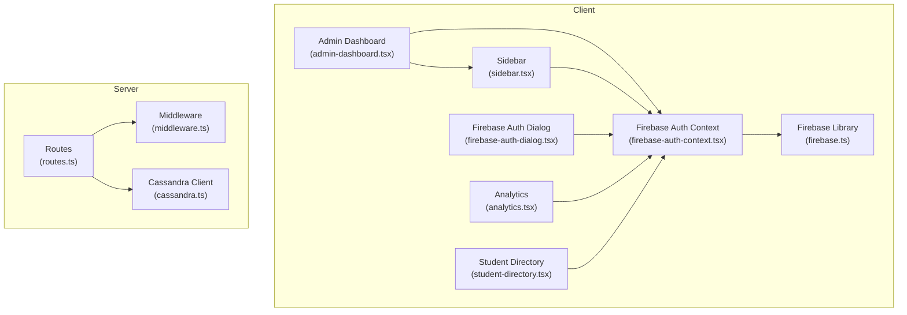
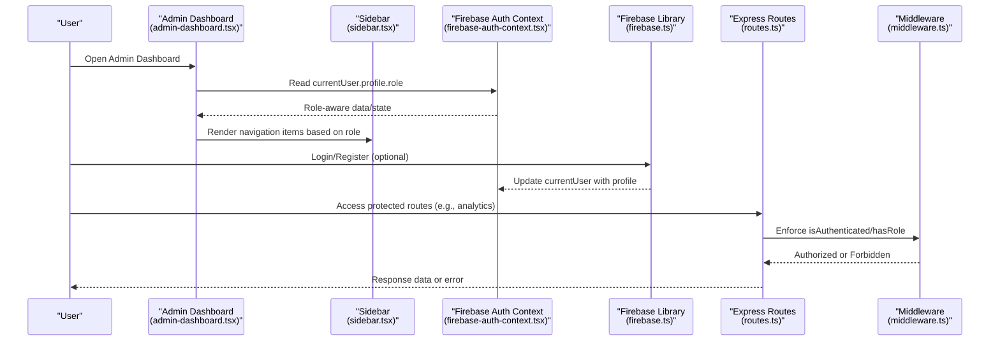
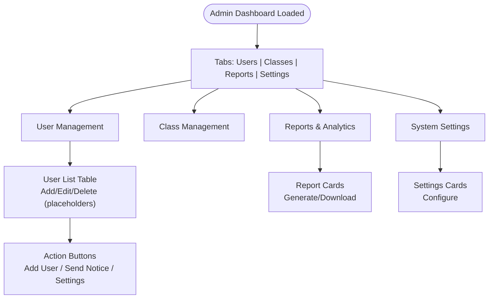
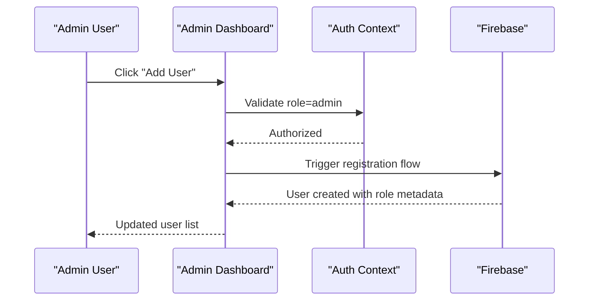
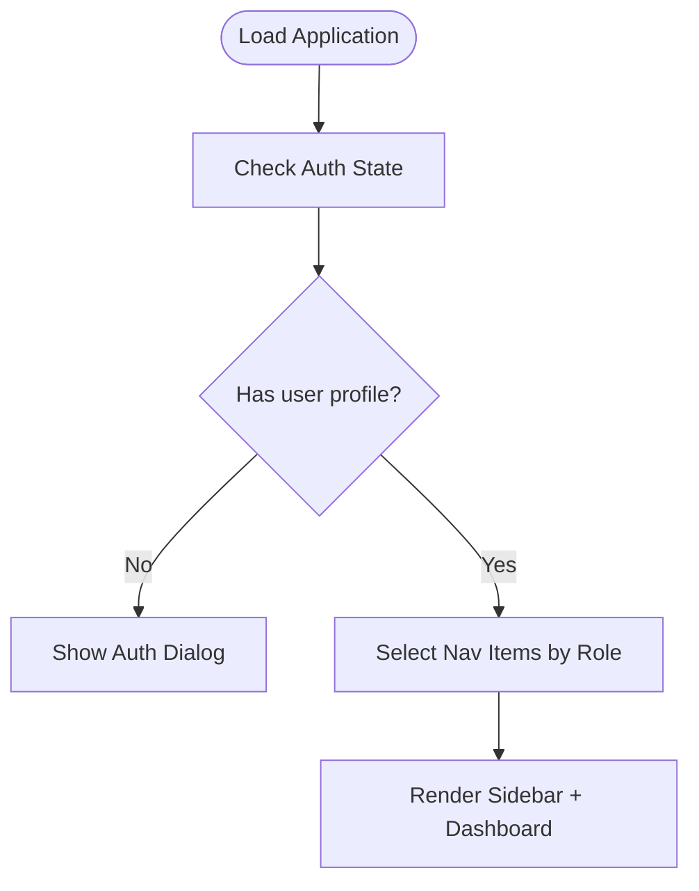
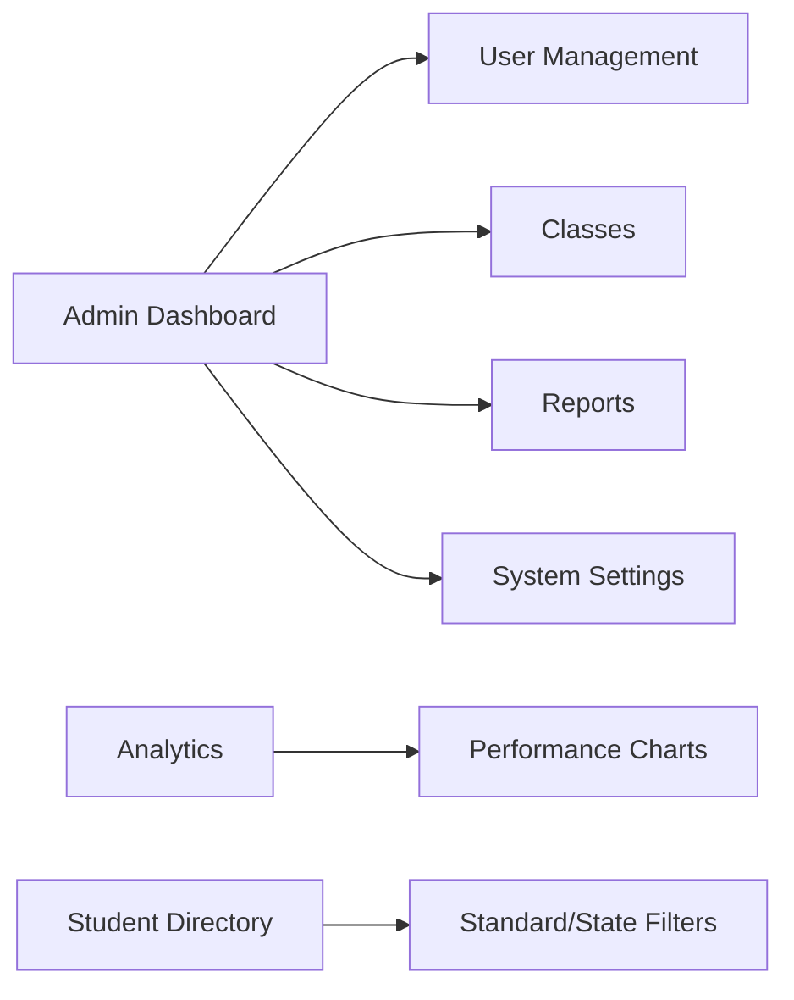
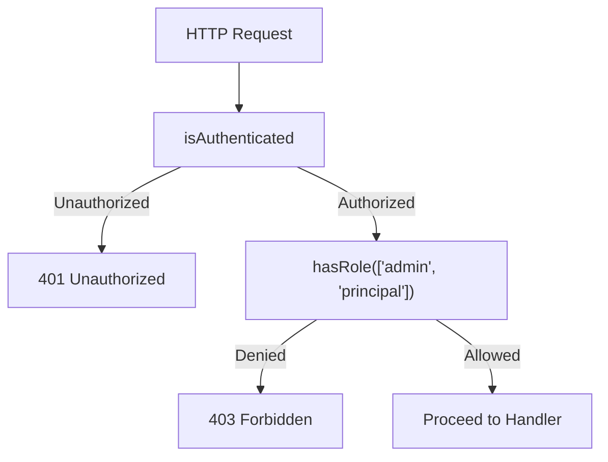
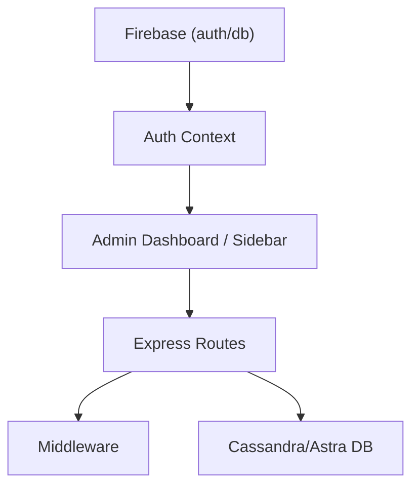

# Administrative Management Tools

<cite>
**Referenced Files in This Document**
- [admin-dashboard.tsx](file://client/src/pages/admin-dashboard.tsx)
- [sidebar.tsx](file://client/src/components/layout/sidebar.tsx)
- [firebase-auth-context.tsx](file://client/src/contexts/firebase-auth-context.tsx)
- [firebase-auth-dialog.tsx](file://client/src/components/auth/firebase-auth-dialog.tsx)
- [firebase.ts](file://client/src/lib/firebase.ts)
- [analytics.tsx](file://client/src/pages/analytics.tsx)
- [student-directory.tsx](file://client/src/pages/student-directory.tsx)
- [routes.ts](file://server/routes.ts)
- [middleware.ts](file://server/middleware.ts)
- [cassandra.ts](file://server/lib/cassandra.ts)
</cite>

## Table of Contents
1. [Introduction](#introduction)
2. [Project Structure](#project-structure)
3. [Core Components](#core-components)
4. [Architecture Overview](#architecture-overview)
5. [Detailed Component Analysis](#detailed-component-analysis)
6. [Dependency Analysis](#dependency-analysis)
7. [Performance Considerations](#performance-considerations)
8. [Troubleshooting Guide](#troubleshooting-guide)
9. [Conclusion](#conclusion)

## Introduction
This document describes the administrative management tools and features implemented in the application. It focuses on user management interfaces, bulk user operations, administrative workflows, role assignments, account status management, administrative permissions, system administration dashboards, user analytics, administrative reporting, user import/export capabilities, batch operations, administrative audit trails, and administrative security measures with privileged access controls.

The application provides:
- A role-aware navigation and dashboards for administrators
- User management UI scaffolding with placeholders for add/edit/delete operations
- Analytics dashboards for performance insights
- Student directory with filtering and grouping
- Backend routes for authentication and role-based access control
- Firebase-based user profiles and role metadata

## Project Structure
The administrative features span the client-side React application and the server-side Express backend. Key areas include:
- Client-side dashboards and navigation for administrators
- Authentication and role-aware routing
- Backend routes enforcing role-based access control
- Analytics and student directory pages
- Database connectivity for analytics and messaging



**Diagram sources**
- [admin-dashboard.tsx](file://client/src/pages/admin-dashboard.tsx#L1-L302)
- [sidebar.tsx](file://client/src/components/layout/sidebar.tsx#L1-L332)
- [firebase-auth-context.tsx](file://client/src/contexts/firebase-auth-context.tsx#L1-L267)
- [firebase-auth-dialog.tsx](file://client/src/components/auth/firebase-auth-dialog.tsx#L1-L500)
- [firebase.ts](file://client/src/lib/firebase.ts#L1-L212)
- [analytics.tsx](file://client/src/pages/analytics.tsx#L1-L177)
- [student-directory.tsx](file://client/src/pages/student-directory.tsx#L1-L453)
- [routes.ts](file://server/routes.ts#L1-L800)
- [middleware.ts](file://server/middleware.ts#L1-L18)
- [cassandra.ts](file://server/lib/cassandra.ts#L1-L40)

**Section sources**
- [admin-dashboard.tsx](file://client/src/pages/admin-dashboard.tsx#L1-L302)
- [sidebar.tsx](file://client/src/components/layout/sidebar.tsx#L1-L332)
- [firebase-auth-context.tsx](file://client/src/contexts/firebase-auth-context.tsx#L1-L267)
- [firebase-auth-dialog.tsx](file://client/src/components/auth/firebase-auth-dialog.tsx#L1-L500)
- [firebase.ts](file://client/src/lib/firebase.ts#L1-L212)
- [analytics.tsx](file://client/src/pages/analytics.tsx#L1-L177)
- [student-directory.tsx](file://client/src/pages/student-directory.tsx#L1-L453)
- [routes.ts](file://server/routes.ts#L1-L800)
- [middleware.ts](file://server/middleware.ts#L1-L18)
- [cassandra.ts](file://server/lib/cassandra.ts#L1-L40)

## Core Components
- Admin Dashboard: Presents tabs for User Management, Classes, Reports, and System Settings. Includes summary cards and placeholders for actions like Add User, Send Notice, and Configure.
- Sidebar: Role-aware navigation that adapts menu items based on the current user’s role, including dedicated admin routes.
- Authentication and Roles: Firebase-based authentication with user profiles containing role metadata. Registration supports role selection, and Google login supports a follow-up role selection for new users.
- Analytics: Performance analytics dashboard with charts and tabs for class and individual insights.
- Student Directory: Filtering and grouping of students by standard and state, with mock data and a disabled query hook indicating future API integration.
- Backend Routes: Authentication endpoints and role-based access control for administrative features.
- Middleware: Authentication and role enforcement helpers for protected routes.
- Database Connectivity: Cassandra/Astra DB client initialization and connection handling.

**Section sources**
- [admin-dashboard.tsx](file://client/src/pages/admin-dashboard.tsx#L1-L302)
- [sidebar.tsx](file://client/src/components/layout/sidebar.tsx#L91-L102)
- [firebase-auth-context.tsx](file://client/src/contexts/firebase-auth-context.tsx#L1-L267)
- [firebase-auth-dialog.tsx](file://client/src/components/auth/firebase-auth-dialog.tsx#L50-L89)
- [firebase.ts](file://client/src/lib/firebase.ts#L47-L63)
- [analytics.tsx](file://client/src/pages/analytics.tsx#L1-L177)
- [student-directory.tsx](file://client/src/pages/student-directory.tsx#L69-L79)
- [routes.ts](file://server/routes.ts#L13-L85)
- [middleware.ts](file://server/middleware.ts#L3-L17)
- [cassandra.ts](file://server/lib/cassandra.ts#L1-L40)

## Architecture Overview
The administrative architecture combines client-side role-aware UI with server-side authentication and authorization:



**Diagram sources**
- [admin-dashboard.tsx](file://client/src/pages/admin-dashboard.tsx#L29-L31)
- [sidebar.tsx](file://client/src/components/layout/sidebar.tsx#L143-L149)
- [firebase-auth-context.tsx](file://client/src/contexts/firebase-auth-context.tsx#L50-L71)
- [firebase.ts](file://client/src/lib/firebase.ts#L117-L150)
- [routes.ts](file://server/routes.ts#L11-L85)
- [middleware.ts](file://server/middleware.ts#L3-L17)

## Detailed Component Analysis

### Admin Dashboard
The Admin Dashboard provides:
- User Management tab with summary cards and a user listing table with placeholders for edit/delete actions.
- Classes tab with grade cards and manage actions.
- Reports & Analytics tab with report generation cards and recent reports list.
- System Settings tab with configuration cards for General Settings, Institution Profile, Academic Calendar, Curriculum Setup, Notification Settings, and User Permissions.



**Diagram sources**
- [admin-dashboard.tsx](file://client/src/pages/admin-dashboard.tsx#L58-L299)

**Section sources**
- [admin-dashboard.tsx](file://client/src/pages/admin-dashboard.tsx#L18-L302)

### Role Assignments and Permissions
The application defines user roles and stores role metadata in user profiles:
- Roles supported: principal, admin, teacher, student, parent.
- Registration forms accept a role selection.
- Google login supports a follow-up role selection for new users.
- Sidebar navigation items are role-specific, ensuring administrators see admin-focused routes.

```mermaid
classDiagram
class UserProfile {
+string uid
+string email
+string displayName
+UserRole role
+string? photoURL
+string? institutionId
+string? classId
+string? studentId
+string[]? subjects
+any createdAt
+any lastLogin
}
class UserRole {
<<enum>>
"principal"
"admin"
"teacher"
"student"
"parent"
}
UserProfile --> UserRole : "has role"
```

**Diagram sources**
- [firebase.ts](file://client/src/lib/firebase.ts#L47-L63)
- [firebase-auth-dialog.tsx](file://client/src/components/auth/firebase-auth-dialog.tsx#L50-L89)
- [sidebar.tsx](file://client/src/components/layout/sidebar.tsx#L143-L149)

**Section sources**
- [firebase.ts](file://client/src/lib/firebase.ts#L47-L63)
- [firebase-auth-dialog.tsx](file://client/src/components/auth/firebase-auth-dialog.tsx#L50-L89)
- [sidebar.tsx](file://client/src/components/layout/sidebar.tsx#L91-L102)

### User Management Interfaces and Bulk Operations
- The Admin Dashboard includes a User Management section with a table and summary cards.
- Placeholder action buttons indicate support for add, edit, and delete operations.
- Bulk operations (e.g., mass role assignment, status updates) are not implemented in the UI; they would require backend endpoints and corresponding client handlers.



**Diagram sources**
- [admin-dashboard.tsx](file://client/src/pages/admin-dashboard.tsx#L73-L76)
- [firebase-auth-context.tsx](file://client/src/contexts/firebase-auth-context.tsx#L97-L125)
- [firebase.ts](file://client/src/lib/firebase.ts#L80-L115)

**Section sources**
- [admin-dashboard.tsx](file://client/src/pages/admin-dashboard.tsx#L66-L130)
- [firebase-auth-context.tsx](file://client/src/contexts/firebase-auth-context.tsx#L97-L125)
- [firebase.ts](file://client/src/lib/firebase.ts#L80-L115)

### Administrative Workflows
- Role-based navigation ensures administrators access admin routes.
- The sidebar dynamically selects navigation items based on the current user’s role.
- Admin Dashboard centralizes administrative tasks across tabs.



**Diagram sources**
- [sidebar.tsx](file://client/src/components/layout/sidebar.tsx#L143-L149)
- [firebase-auth-context.tsx](file://client/src/contexts/firebase-auth-context.tsx#L50-L71)

**Section sources**
- [sidebar.tsx](file://client/src/components/layout/sidebar.tsx#L143-L149)
- [firebase-auth-context.tsx](file://client/src/contexts/firebase-auth-context.tsx#L50-L71)

### System Administration Dashboards and Reporting
- Admin Dashboard provides summary cards and report generation capabilities.
- Analytics page offers performance charts and tabs for class and individual insights.
- Student Directory supports filtering and grouping by standards and states.



**Diagram sources**
- [admin-dashboard.tsx](file://client/src/pages/admin-dashboard.tsx#L58-L299)
- [analytics.tsx](file://client/src/pages/analytics.tsx#L1-L177)
- [student-directory.tsx](file://client/src/pages/student-directory.tsx#L69-L79)

**Section sources**
- [admin-dashboard.tsx](file://client/src/pages/admin-dashboard.tsx#L161-L237)
- [analytics.tsx](file://client/src/pages/analytics.tsx#L1-L177)
- [student-directory.tsx](file://client/src/pages/student-directory.tsx#L69-L79)

### User Import/Export and Batch Operations
- Current UI does not expose explicit import/export or batch operation controls.
- The student directory page disables its data query hook, indicating that API endpoints for bulk operations are pending implementation.

**Section sources**
- [student-directory.tsx](file://client/src/pages/student-directory.tsx#L75-L79)

### Administrative Audit Trails
- The application tracks user login timestamps in the user profile.
- Backend routes do not currently implement explicit audit trail endpoints; audit logging would require server-side persistence and retrieval APIs.

**Section sources**
- [firebase.ts](file://client/src/lib/firebase.ts#L66-L78)
- [routes.ts](file://server/routes.ts#L1-L800)

### Administrative Security Measures and Privileged Access Controls
- Authentication relies on Firebase; session-based checks are enforced in backend routes.
- Middleware provides authentication and role enforcement helpers.
- Route guards restrict access to administrative features based on session role.



**Diagram sources**
- [middleware.ts](file://server/middleware.ts#L3-L17)
- [routes.ts](file://server/routes.ts#L110-L114)

**Section sources**
- [middleware.ts](file://server/middleware.ts#L3-L17)
- [routes.ts](file://server/routes.ts#L110-L114)

## Dependency Analysis
Administrative features depend on:
- Client-side role-aware UI and navigation
- Firebase for authentication and user profile storage
- Backend routes enforcing authentication and role-based access
- Optional database connectivity for analytics and messaging



**Diagram sources**
- [firebase.ts](file://client/src/lib/firebase.ts#L1-L212)
- [firebase-auth-context.tsx](file://client/src/contexts/firebase-auth-context.tsx#L1-L267)
- [admin-dashboard.tsx](file://client/src/pages/admin-dashboard.tsx#L1-L302)
- [sidebar.tsx](file://client/src/components/layout/sidebar.tsx#L1-L332)
- [routes.ts](file://server/routes.ts#L1-L800)
- [middleware.ts](file://server/middleware.ts#L1-L18)
- [cassandra.ts](file://server/lib/cassandra.ts#L1-L40)

**Section sources**
- [firebase.ts](file://client/src/lib/firebase.ts#L1-L212)
- [firebase-auth-context.tsx](file://client/src/contexts/firebase-auth-context.tsx#L1-L267)
- [admin-dashboard.tsx](file://client/src/pages/admin-dashboard.tsx#L1-L302)
- [sidebar.tsx](file://client/src/components/layout/sidebar.tsx#L1-L332)
- [routes.ts](file://server/routes.ts#L1-L800)
- [middleware.ts](file://server/middleware.ts#L1-L18)
- [cassandra.ts](file://server/lib/cassandra.ts#L1-L40)

## Performance Considerations
- Client-side rendering of administrative dashboards is static or uses mock data; consider lazy-loading heavy components.
- Analytics charts rely on external libraries; ensure efficient data updates and avoid unnecessary re-renders.
- Student directory filtering operates on client-side arrays; large datasets may benefit from server-side pagination and filtering.
- Backend route handlers should validate inputs early and minimize database round-trips.

## Troubleshooting Guide
Common issues and resolutions:
- Firebase not configured: The application gracefully falls back to disabled auth features and logs warnings. Ensure environment variables are set for Firebase.
- Authentication state not updating: Verify onAuthStateChanged listeners and profile retrieval logic.
- Role-based navigation incorrect: Confirm the current user’s profile role is correctly populated and that the sidebar role selection logic executes.
- Protected route access denied: Ensure session contains the required role and that middleware is applied to routes.

**Section sources**
- [firebase.ts](file://client/src/lib/firebase.ts#L27-L37)
- [firebase-auth-context.tsx](file://client/src/contexts/firebase-auth-context.tsx#L50-L71)
- [sidebar.tsx](file://client/src/components/layout/sidebar.tsx#L143-L149)
- [routes.ts](file://server/routes.ts#L110-L114)
- [middleware.ts](file://server/middleware.ts#L3-L17)

## Conclusion
The administrative management tools provide a foundation for institution administration with role-aware dashboards, user management UI scaffolding, analytics, and student directory features. While core administrative workflows and role-based access are present, advanced features such as user import/export, batch operations, and comprehensive audit trails are not yet implemented and would require additional backend endpoints and client integrations.