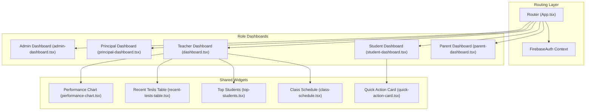
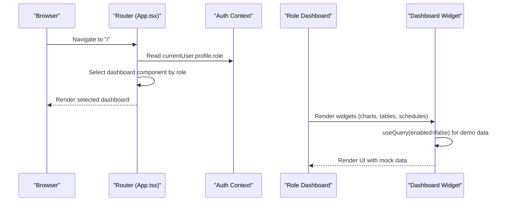
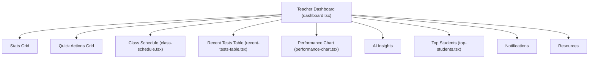
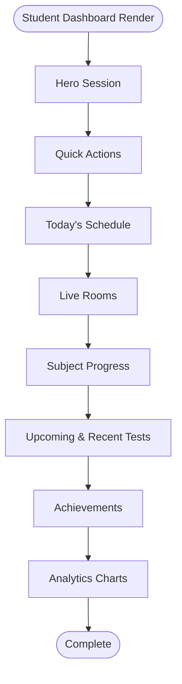
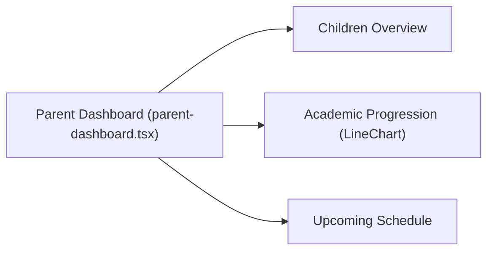
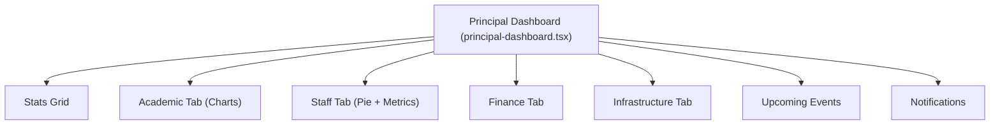
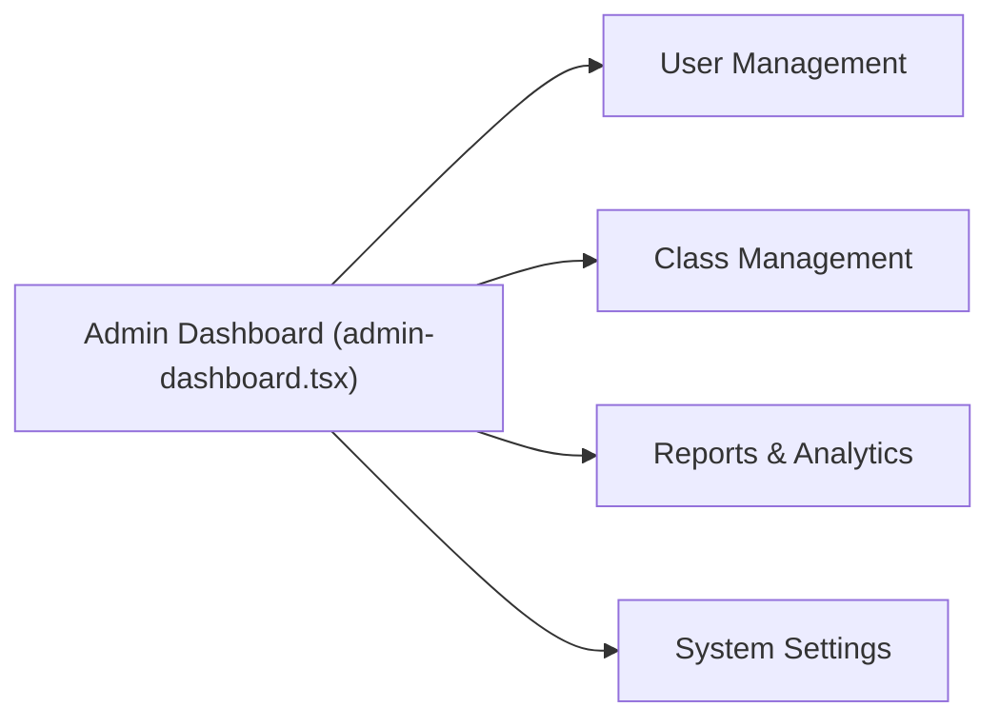
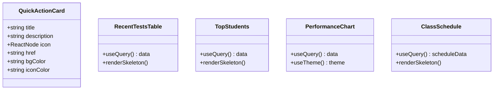
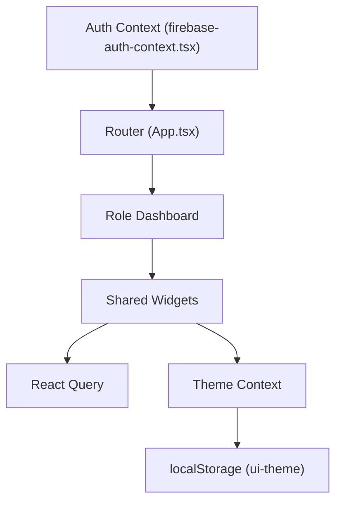

# Dashboard Customization

<cite>
**Referenced Files in This Document**
- [App.tsx](file://client/src/App.tsx)
- [firebase-auth-context.tsx](file://client/src/contexts/firebase-auth-context.tsx)
- [theme-context.tsx](file://client/src/contexts/theme-context.tsx)
- [dashboard.tsx](file://client/src/pages/dashboard.tsx)
- [student-dashboard.tsx](file://client/src/pages/student-dashboard.tsx)
- [parent-dashboard.tsx](file://client/src/pages/parent-dashboard.tsx)
- [admin-dashboard.tsx](file://client/src/pages/admin-dashboard.tsx)
- [principal-dashboard.tsx](file://client/src/pages/principal-dashboard.tsx)
- [quick-action-card.tsx](file://client/src/components/dashboard/quick-action-card.tsx)
- [recent-tests-table.tsx](file://client/src/components/dashboard/recent-tests-table.tsx)
- [top-students.tsx](file://client/src/components/dashboard/top-students.tsx)
- [performance-chart.tsx](file://client/src/components/dashboard/performance-chart.tsx)
- [class-schedule.tsx](file://client/src/components/dashboard/class-schedule.tsx)
- [mockData.ts](file://client/src/data/mockData.ts)
</cite>

## Table of Contents
1. [Introduction](#introduction)
2. [Project Structure](#project-structure)
3. [Core Components](#core-components)
4. [Architecture Overview](#architecture-overview)
5. [Detailed Component Analysis](#detailed-component-analysis)
6. [Dependency Analysis](#dependency-analysis)
7. [Performance Considerations](#performance-considerations)
8. [Troubleshooting Guide](#troubleshooting-guide)
9. [Conclusion](#conclusion)

## Introduction
This document describes the role-based dashboard customization system implemented in the client application. It explains how five distinct dashboard implementations serve different user roles—administrator, principal, teacher, student, and parent—each with tailored widgets, analytics, and features. It also covers dashboard layout management, widget configuration, personalization options, data sources, real-time update strategies, performance metrics display, accessibility features, responsive design, and user preference storage.

## Project Structure
The dashboard system is organized around role-aware routing and modular dashboard pages. Each role has a dedicated page component that composes reusable dashboard widgets. Authentication context determines the active role and routes users to the appropriate dashboard. Theme context manages light/dark/system preferences and applies them globally.

**Diagram sources**
- [App.tsx](file://client/src/App.tsx#L93-L149)
- [admin-dashboard.tsx](file://client/src/pages/admin-dashboard.tsx#L29-L301)
- [principal-dashboard.tsx](file://client/src/pages/principal-dashboard.tsx#L44-L364)
- [dashboard.tsx](file://client/src/pages/dashboard.tsx#L44-L337)
- [student-dashboard.tsx](file://client/src/pages/student-dashboard.tsx#L123-L1001)
- [parent-dashboard.tsx](file://client/src/pages/parent-dashboard.tsx#L36-L248)
- [performance-chart.tsx](file://client/src/components/dashboard/performance-chart.tsx#L21-L98)
- [recent-tests-table.tsx](file://client/src/components/dashboard/recent-tests-table.tsx#L33-L150)
- [top-students.tsx](file://client/src/components/dashboard/top-students.tsx#L14-L74)
- [class-schedule.tsx](file://client/src/components/dashboard/class-schedule.tsx#L35-L179)
- [quick-action-card.tsx](file://client/src/components/dashboard/quick-action-card.tsx#L14-L39)

**Section sources**
- [App.tsx](file://client/src/App.tsx#L93-L149)
- [firebase-auth-context.tsx](file://client/src/contexts/firebase-auth-context.tsx#L114-L124)

## Core Components
- Role-aware routing and dashboard selection:
  - The router selects the appropriate dashboard based on the authenticated user’s role.
  - Default route redirects to the role-specific dashboard.
- Authentication context:
  - Provides user profile with role metadata used for routing and personalization.
- Theme context:
  - Manages theme preference (light, dark, system) and persists it to local storage.
- Dashboard pages:
  - Each role page composes a set of widgets optimized for that role’s needs.
- Shared dashboard widgets:
  - Reusable components for charts, tables, schedules, and quick actions.

**Section sources**
- [App.tsx](file://client/src/App.tsx#L113-L124)
- [firebase-auth-context.tsx](file://client/src/contexts/firebase-auth-context.tsx#L19-L34)
- [theme-context.tsx](file://client/src/contexts/theme-context.tsx#L23-L62)

## Architecture Overview
The system follows a role-based composition pattern:
- Authentication determines the active role.
- Router maps the role to a dashboard page.
- Dashboard page renders role-specific widgets and analytics.
- Widgets use React Query for data fetching and display mock data when endpoints are disabled.
- Theme context applies global theme preferences.

**Diagram sources**
- [App.tsx](file://client/src/App.tsx#L113-L124)
- [dashboard.tsx](file://client/src/pages/dashboard.tsx#L44-L337)
- [performance-chart.tsx](file://client/src/components/dashboard/performance-chart.tsx#L25-L28)
- [recent-tests-table.tsx](file://client/src/components/dashboard/recent-tests-table.tsx#L34-L36)
- [top-students.tsx](file://client/src/components/dashboard/top-students.tsx#L15-L18)
- [class-schedule.tsx](file://client/src/components/dashboard/class-schedule.tsx#L36-L39)

## Detailed Component Analysis

### Role-Based Dashboards Overview
- Administrator dashboard:
  - Tabs for user management, class management, reports, and system settings.
  - Static summaries and lists suitable for administrative tasks.
- Principal dashboard:
  - Academic performance charts, staff distribution, finance summaries, infrastructure overview.
  - Tabs for academic, staff, finance, and infrastructure sections.
- Teacher dashboard:
  - Stats cards, quick actions, class schedule, recent tests, performance analytics, AI insights, top students, notifications, and resource suggestions.
- Student dashboard:
  - Hero session, quick actions, today’s schedule, live rooms, subject progress, upcoming tests, recent results, achievements, and analytics.
- Parent dashboard:
  - Children overview cards, academic progression chart, and upcoming schedule/events.

**Section sources**
- [admin-dashboard.tsx](file://client/src/pages/admin-dashboard.tsx#L29-L301)
- [principal-dashboard.tsx](file://client/src/pages/principal-dashboard.tsx#L44-L364)
- [dashboard.tsx](file://client/src/pages/dashboard.tsx#L44-L337)
- [student-dashboard.tsx](file://client/src/pages/student-dashboard.tsx#L123-L1001)
- [parent-dashboard.tsx](file://client/src/pages/parent-dashboard.tsx#L36-L248)

### Teacher Dashboard Widgets
- Stats cards:
  - Active tests, total students, average score, number of classes.
- Quick actions:
  - Create test, scan paper test, view analytics, AI study plans, live class, messages.
- Class schedule:
  - Tabs for Today, Tomorrow, and Wednesday with session details.
- Recent tests:
  - Table with status badges, completion progress, and actions.
- Performance analytics:
  - Bar chart comparing class average vs school average.
- AI insights:
  - Tailored suggestions with action links.
- Top students:
  - List of top-performing students.
- Notifications:
  - Highlighted unread items with timestamps.
- Resources:
  - Subject-specific resource suggestions.

**Diagram sources**
- [dashboard.tsx](file://client/src/pages/dashboard.tsx#L98-L335)
- [class-schedule.tsx](file://client/src/components/dashboard/class-schedule.tsx#L35-L179)
- [recent-tests-table.tsx](file://client/src/components/dashboard/recent-tests-table.tsx#L33-L149)
- [performance-chart.tsx](file://client/src/components/dashboard/performance-chart.tsx#L21-L89)
- [top-students.tsx](file://client/src/components/dashboard/top-students.tsx#L14-L54)

**Section sources**
- [dashboard.tsx](file://client/src/pages/dashboard.tsx#L98-L335)
- [class-schedule.tsx](file://client/src/components/dashboard/class-schedule.tsx#L35-L179)
- [recent-tests-table.tsx](file://client/src/components/dashboard/recent-tests-table.tsx#L33-L149)
- [performance-chart.tsx](file://client/src/components/dashboard/performance-chart.tsx#L21-L89)
- [top-students.tsx](file://client/src/components/dashboard/top-students.tsx#L14-L54)

### Student Dashboard Widgets
- Hero session:
  - Current topic, progress bar, and resume action.
- Quick actions:
  - Primary and secondary actions with gradient accents.
- Today’s schedule:
  - Horizontal strip with subject icons and “NOW” indicator.
- Live rooms:
  - Cards with live indicators, host info, participants, and join actions.
- Subject progress:
  - Subject-specific progress bars and grades.
- Upcoming tests:
  - Urgent and announced test highlights.
- Recent results:
  - Score visualization with color-coded performance.
- Achievements:
  - Badges for milestones.
- Analytics:
  - Subject radar chart and other visualizations.

**Diagram sources**
- [student-dashboard.tsx](file://client/src/pages/student-dashboard.tsx#L123-L1001)
- [performance-chart.tsx](file://client/src/components/dashboard/performance-chart.tsx#L21-L89)

**Section sources**
- [student-dashboard.tsx](file://client/src/pages/student-dashboard.tsx#L123-L1001)

### Parent Dashboard Widgets
- Children overview:
  - Attendance, average grade, curriculum progress, and status badges.
- Academic progression:
  - Line chart comparing children’s scores over months.
- Upcoming schedule:
  - Event list with icons and time details.

**Diagram sources**
- [parent-dashboard.tsx](file://client/src/pages/parent-dashboard.tsx#L36-L248)

**Section sources**
- [parent-dashboard.tsx](file://client/src/pages/parent-dashboard.tsx#L36-L248)

### Principal Dashboard Widgets
- Stats grid:
  - Total students, teachers, active classes, pass rate.
- Academic tab:
  - Bar charts for average scores and pass rates by subject.
  - Grade distribution visualization.
- Staff tab:
  - Pie chart for department distribution.
  - Staff overview metrics.
- Finance tab:
  - Budget, spent YTD, pending fees.
- Infrastructure tab:
  - Facilities counts and statuses.
- Events and notifications:
  - Upcoming events list and notification panel.

**Diagram sources**
- [principal-dashboard.tsx](file://client/src/pages/principal-dashboard.tsx#L44-L364)

**Section sources**
- [principal-dashboard.tsx](file://client/src/pages/principal-dashboard.tsx#L44-L364)

### Admin Dashboard Widgets
- Tabs:
  - User Management, Class Management, Reports & Analytics, System Settings.
- User Management:
  - Summary cards and user listing.
- Class Management:
  - Grade-wise class listings.
- Reports & Analytics:
  - Report cards and recent reports list.
- System Settings:
  - Configurable categories with action buttons.

**Diagram sources**
- [admin-dashboard.tsx](file://client/src/pages/admin-dashboard.tsx#L29-L301)

**Section sources**
- [admin-dashboard.tsx](file://client/src/pages/admin-dashboard.tsx#L29-L301)

### Shared Widget Components
- Quick action card:
  - Reusable card with icon, title, description, and link.
- Recent tests table:
  - Table with status badges, progress bars, and actions; includes skeleton loader.
- Top students:
  - List with avatars and scores; includes skeleton loader.
- Performance chart:
  - Bar chart comparing class vs school averages; respects theme.
- Class schedule:
  - Tabs for multiple days with session details and live indicators.

**Diagram sources**
- [quick-action-card.tsx](file://client/src/components/dashboard/quick-action-card.tsx#L14-L39)
- [recent-tests-table.tsx](file://client/src/components/dashboard/recent-tests-table.tsx#L33-L150)
- [top-students.tsx](file://client/src/components/dashboard/top-students.tsx#L14-L74)
- [performance-chart.tsx](file://client/src/components/dashboard/performance-chart.tsx#L21-L98)
- [class-schedule.tsx](file://client/src/components/dashboard/class-schedule.tsx#L35-L179)

**Section sources**
- [quick-action-card.tsx](file://client/src/components/dashboard/quick-action-card.tsx#L14-L39)
- [recent-tests-table.tsx](file://client/src/components/dashboard/recent-tests-table.tsx#L33-L150)
- [top-students.tsx](file://client/src/components/dashboard/top-students.tsx#L14-L74)
- [performance-chart.tsx](file://client/src/components/dashboard/performance-chart.tsx#L21-L98)
- [class-schedule.tsx](file://client/src/components/dashboard/class-schedule.tsx#L35-L179)

## Dependency Analysis
- Routing depends on authentication context to select the correct dashboard.
- Dashboard pages depend on shared widgets for consistent UX and data presentation.
- Widgets depend on React Query for data fetching and on theme context for visual styling.
- Theme context persists user preference to local storage and applies it to the document root.

**Diagram sources**
- [App.tsx](file://client/src/App.tsx#L113-L124)
- [firebase-auth-context.tsx](file://client/src/contexts/firebase-auth-context.tsx#L19-L34)
- [theme-context.tsx](file://client/src/contexts/theme-context.tsx#L23-L62)

**Section sources**
- [App.tsx](file://client/src/App.tsx#L113-L124)
- [theme-context.tsx](file://client/src/contexts/theme-context.tsx#L23-L62)

## Performance Considerations
- Data fetching:
  - Widgets currently disable queries (enabled=false) and rely on mock data. This prevents unnecessary network requests during development and avoids blocking renders.
- Skeleton loaders:
  - Widgets provide skeleton loaders to maintain perceived performance while data is being fetched.
- Responsive charts:
  - Charts use responsive containers to adapt to screen sizes without manual breakpoints.
- Theme-aware visuals:
  - Charts adjust grid and axis colors based on theme to reduce contrast issues and improve readability.
- Layout responsiveness:
  - Dashboard pages use CSS grid and flex utilities to adapt to small, medium, and large screens.

Recommendations:
- Enable queries when backend endpoints are ready and implement caching strategies.
- Consider pagination for long lists (e.g., recent tests, top students).
- Lazy-load heavy widgets if they are not immediately visible.
- Debounce or throttle frequent updates for real-time features.

**Section sources**
- [performance-chart.tsx](file://client/src/components/dashboard/performance-chart.tsx#L25-L28)
- [recent-tests-table.tsx](file://client/src/components/dashboard/recent-tests-table.tsx#L34-L36)
- [top-students.tsx](file://client/src/components/dashboard/top-students.tsx#L15-L18)
- [class-schedule.tsx](file://client/src/components/dashboard/class-schedule.tsx#L36-L39)

## Troubleshooting Guide
- Authentication issues:
  - Verify that the authentication provider is initialized and that onAuthStateChanged resolves profile data. The context includes timeouts to prevent hanging.
- Role-based routing:
  - Ensure the user profile includes a valid role. The router defaults to the teacher dashboard if the role is unrecognized.
- Widget data loading:
  - If widgets show skeletons indefinitely, confirm that the query keys match backend endpoints and that queries are enabled.
- Theme not persisting:
  - Confirm that the theme provider is wrapping the app and that localStorage keys are accessible.
- Accessibility:
  - Ensure interactive elements have proper focus styles and ARIA attributes if extended. The current UI relies on semantic HTML and Tailwind utilities.

**Section sources**
- [firebase-auth-context.tsx](file://client/src/contexts/firebase-auth-context.tsx#L43-L71)
- [App.tsx](file://client/src/App.tsx#L113-L124)
- [theme-context.tsx](file://client/src/contexts/theme-context.tsx#L33-L48)

## Conclusion
The role-based dashboard customization system provides a scalable, modular foundation for delivering distinct experiences to administrators, principals, teachers, students, and parents. Through shared widgets, role-aware routing, and theme persistence, the system balances personalization with consistency. As the platform evolves, enabling backend integrations, implementing real-time updates, and optimizing performance will further enhance the user experience across devices and preferences.