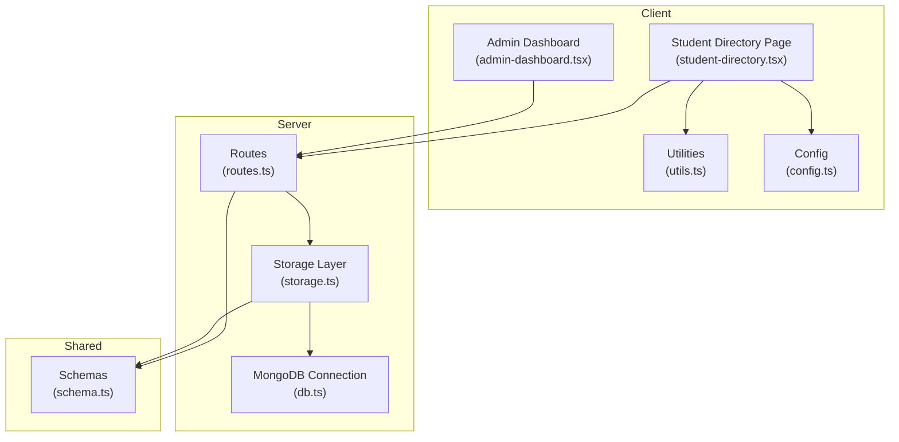
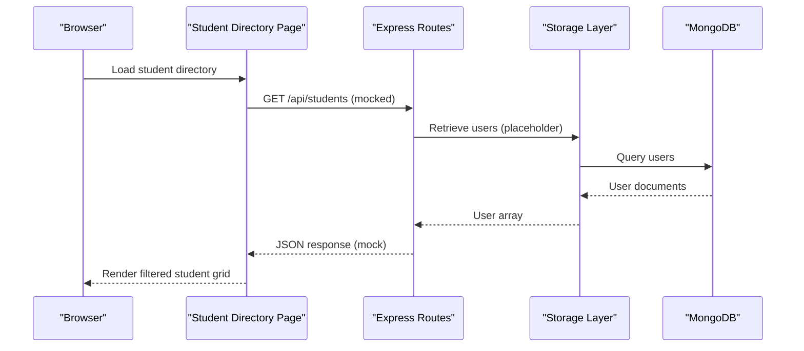
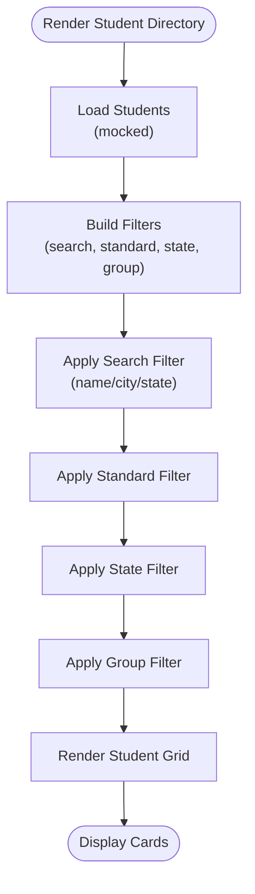
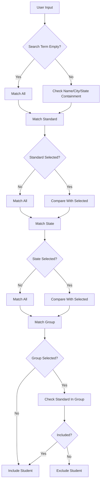
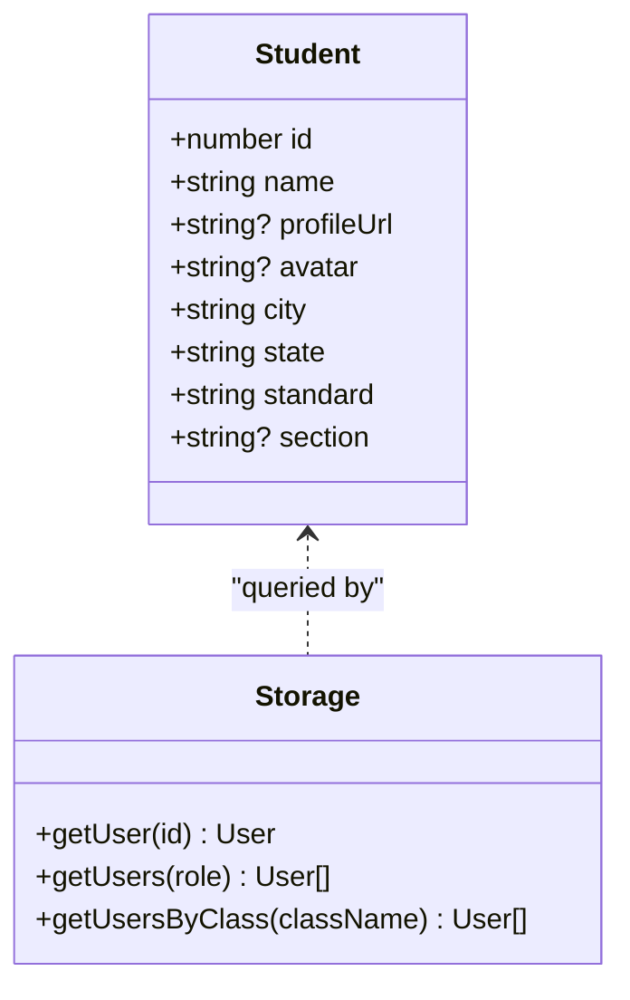
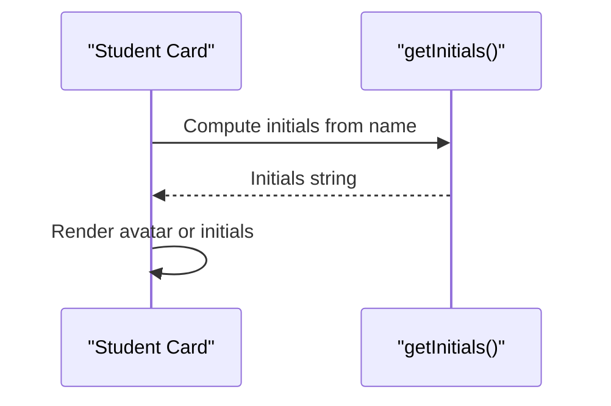
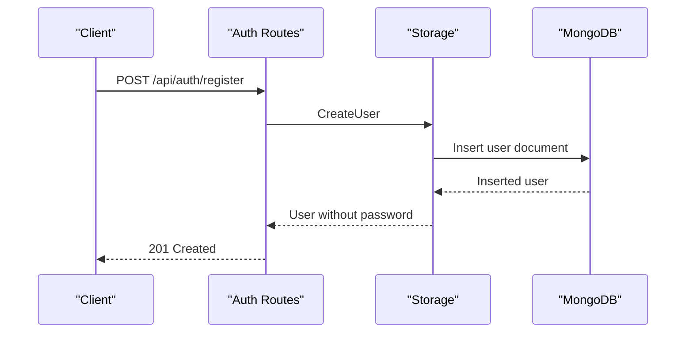
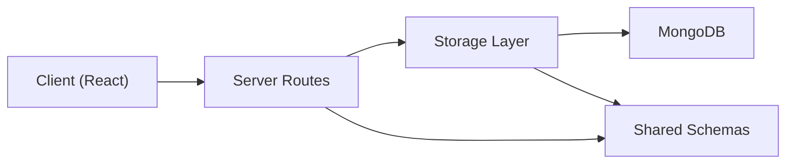

# User Directory System

<cite>
**Referenced Files in This Document**
- [student-directory.tsx](file://client/src/pages/student-directory.tsx)
- [routes.ts](file://server/routes.ts)
- [schema.ts](file://shared/schema.ts)
- [storage.ts](file://server/storage.ts)
- [admin-dashboard.tsx](file://client/src/pages/admin-dashboard.tsx)
- [utils.ts](file://client/src/lib/utils.ts)
- [config.ts](file://client/src/config.ts)
- [db.ts](file://server/db.ts)
</cite>

## Table of Contents
1. [Introduction](#introduction)
2. [Project Structure](#project-structure)
3. [Core Components](#core-components)
4. [Architecture Overview](#architecture-overview)
5. [Detailed Component Analysis](#detailed-component-analysis)
6. [Dependency Analysis](#dependency-analysis)
7. [Performance Considerations](#performance-considerations)
8. [Troubleshooting Guide](#troubleshooting-guide)
9. [Conclusion](#conclusion)

## Introduction
This document describes the User Directory System, focusing on the student directory functionality with grade-level organization, search capabilities, filtering, and display mechanisms. It explains how user listings are presented, how contact information is managed, and how directory navigation works. It also covers search algorithms, sorting mechanisms, pagination, grade-level grouping, class organization, user relationship mapping, privacy controls, bulk operations, and administrative user management features.

## Project Structure
The User Directory System spans the client-side React application and the server-side Express API with MongoDB storage. The key areas involved are:
- Frontend: Student directory page with search, filters, tabs, and student cards
- Backend: Routes for authentication and user management, storage layer for data access, and shared schemas for validation
- Shared: Type-safe schemas for user data and validation rules

**Diagram sources**
- [student-directory.tsx](file://client/src/pages/student-directory.tsx#L1-L453)
- [routes.ts](file://server/routes.ts#L1-L1104)
- [storage.ts](file://server/storage.ts#L1-L346)
- [schema.ts](file://shared/schema.ts#L1-L142)
- [db.ts](file://server/db.ts#L1-L21)
- [admin-dashboard.tsx](file://client/src/pages/admin-dashboard.tsx#L1-L302)
- [utils.ts](file://client/src/lib/utils.ts#L1-L21)
- [config.ts](file://client/src/config.ts#L1-L7)

**Section sources**
- [student-directory.tsx](file://client/src/pages/student-directory.tsx#L1-L453)
- [routes.ts](file://server/routes.ts#L1-L1104)
- [storage.ts](file://server/storage.ts#L1-L346)
- [schema.ts](file://shared/schema.ts#L1-L142)
- [db.ts](file://server/db.ts#L1-L21)
- [admin-dashboard.tsx](file://client/src/pages/admin-dashboard.tsx#L1-L302)
- [utils.ts](file://client/src/lib/utils.ts#L1-L21)
- [config.ts](file://client/src/config.ts#L1-L7)

## Core Components
- Student Directory Page: Implements search, filters, grade grouping, and display of student cards with avatar, badges, and class/section metadata.
- Backend Routes: Provide authentication, user retrieval, and workspace/channel messaging APIs (used for user relationships and communication).
- Storage Layer: Manages user CRUD operations, class-based queries, and workspace membership.
- Shared Schemas: Define user model, validation rules, and types for type safety.
- Utilities: Provide helper functions like initials extraction for avatars.
- Admin Dashboard: Provides administrative UI scaffolding for user management, classes, reports, and settings.

**Section sources**
- [student-directory.tsx](file://client/src/pages/student-directory.tsx#L32-L453)
- [routes.ts](file://server/routes.ts#L88-L107)
- [storage.ts](file://server/storage.ts#L37-L158)
- [schema.ts](file://shared/schema.ts#L4-L13)
- [utils.ts](file://client/src/lib/utils.ts#L8-L20)
- [admin-dashboard.tsx](file://client/src/pages/admin-dashboard.tsx#L18-L302)

## Architecture Overview
The system follows a layered architecture:
- Presentation Layer: React components render the student directory and admin dashboard.
- Application Layer: Express routes handle requests, enforce authentication/authorization, and delegate to the storage layer.
- Data Access Layer: MongoDB-backed storage provides user and workspace operations.
- Shared Contracts: Zod schemas define data contracts and validation.

**Diagram sources**
- [student-directory.tsx](file://client/src/pages/student-directory.tsx#L75-L79)
- [routes.ts](file://server/routes.ts#L1-L1104)
- [storage.ts](file://server/storage.ts#L127-L158)
- [db.ts](file://server/db.ts#L8-L20)

## Detailed Component Analysis

### Student Directory Page
The student directory page provides:
- Search: Case-insensitive search across name, city, and state.
- Filters: Standard selection, state checkboxes, and grade group toggles.
- Tabs: Group students by grade categories (Pre-Primary, Primary, Middle, Secondary, Senior Secondary).
- Display: Grid of student cards with avatar, profile link, city/state badges, class, and optional section.

**Diagram sources**
- [student-directory.tsx](file://client/src/pages/student-directory.tsx#L240-L257)
- [student-directory.tsx](file://client/src/pages/student-directory.tsx#L360-L382)

**Section sources**
- [student-directory.tsx](file://client/src/pages/student-directory.tsx#L32-L453)

### Search and Filtering Logic
- Search Algorithm: Linear scan with case-insensitive substring checks on name, city, and state.
- Sorting: States are extracted and sorted alphabetically for filter options.
- Filtering Options:
  - Standard: Single-select dropdown for individual grades.
  - State: Multi-select via dropdown menu checkboxes.
  - Group: Pre-defined grade groups mapped to sets of standards.
- Pagination: Not implemented in the frontend; grid renders all filtered results.

**Diagram sources**
- [student-directory.tsx](file://client/src/pages/student-directory.tsx#L240-L257)

**Section sources**
- [student-directory.tsx](file://client/src/pages/student-directory.tsx#L237-L257)

### Grade-Level Organization and Class Organization
- Grade Groups: Pre-Primary, Primary, Middle, Secondary, Senior Secondary.
- Class Organization: Students include standard and optional section; class-based queries supported by storage for student retrieval by class.

**Diagram sources**
- [student-directory.tsx](file://client/src/pages/student-directory.tsx#L32-L41)
- [storage.ts](file://server/storage.ts#L149-L158)

**Section sources**
- [student-directory.tsx](file://client/src/pages/student-directory.tsx#L43-L67)
- [storage.ts](file://server/storage.ts#L149-L158)

### Contact Information Management
- Display Fields: Name, city, state, standard/class, optional section, and profile URL.
- Avatar Handling: Uses external avatar service or initials fallback computed from name.
- Privacy Controls: Profile URL visibility depends on data availability; no explicit privacy toggles in the directory UI.

**Diagram sources**
- [student-directory.tsx](file://client/src/pages/student-directory.tsx#L407-L453)
- [utils.ts](file://client/src/lib/utils.ts#L11-L20)

**Section sources**
- [student-directory.tsx](file://client/src/pages/student-directory.tsx#L407-L453)
- [utils.ts](file://client/src/lib/utils.ts#L8-L20)

### Directory Navigation
- Tabs: Switch between "All Students" and grade group tabs; each tab renders a filtered grid.
- Reset Filters: Clear all selections with a single button.
- Navigation Aids: Header and mobile navigation integrated into the page layout.

**Section sources**
- [student-directory.tsx](file://client/src/pages/student-directory.tsx#L360-L382)
- [student-directory.tsx](file://client/src/pages/student-directory.tsx#L344-L357)

### Backend Routes and User Management
- Authentication: Registration, login, logout endpoints with session management.
- User Retrieval: Endpoint to fetch current user profile.
- Workspace/Channel Messaging: Used for user relationships and communication; supports DMs and workspace channels.

**Diagram sources**
- [routes.ts](file://server/routes.ts#L13-L47)
- [storage.ts](file://server/storage.ts#L142-L147)
- [db.ts](file://server/db.ts#L8-L20)

**Section sources**
- [routes.ts](file://server/routes.ts#L13-L85)
- [routes.ts](file://server/routes.ts#L88-L107)
- [routes.ts](file://server/routes.ts#L806-L866)

### Administrative User Management Features
- Admin Dashboard UI: Provides tabs for User Management, Classes, Reports, and System Settings with placeholder actions.
- Role-Specific Data: Configuration demonstrates role-based attributes (e.g., student classId, teacher subjects, principal institutionId).

**Section sources**
- [admin-dashboard.tsx](file://client/src/pages/admin-dashboard.tsx#L18-L302)
- [config.ts](file://client/src/config.ts#L1-L7)

## Dependency Analysis
The system exhibits clear separation of concerns:
- Client depends on shared schemas for type safety and on backend routes for data.
- Server routes depend on storage for persistence and on shared schemas for validation.
- Storage depends on MongoDB for data access.

**Diagram sources**
- [routes.ts](file://server/routes.ts#L1-L1104)
- [storage.ts](file://server/storage.ts#L1-L346)
- [schema.ts](file://shared/schema.ts#L1-L142)
- [db.ts](file://server/db.ts#L1-L21)

**Section sources**
- [routes.ts](file://server/routes.ts#L1-L1104)
- [storage.ts](file://server/storage.ts#L1-L346)
- [schema.ts](file://shared/schema.ts#L1-L142)
- [db.ts](file://server/db.ts#L1-L21)

## Performance Considerations
- Client-side Filtering: Current implementation filters in memory; for large datasets, consider server-side filtering and pagination.
- Rendering: Grid rendering scales linearly with filtered results; virtualization could improve performance for large lists.
- Database Queries: Use indexes on frequently queried fields (e.g., class, role) to optimize storage queries.
- Caching: Implement caching for static grade groups and state lists to reduce recomputation.

## Troubleshooting Guide
- Authentication Issues: Verify session presence and role for protected routes.
- User Not Found: Ensure user IDs exist in MongoDB and that the correct session is used.
- Workspace/Channel Access: Confirm membership and proper workspace/channel ownership for DMs and pins.
- Upload Failures: Validate multipart form data and file presence before processing.

**Section sources**
- [routes.ts](file://server/routes.ts#L3-L8)
- [routes.ts](file://server/routes.ts#L806-L866)
- [routes.ts](file://server/routes.ts#L1065-L1095)

## Conclusion
The User Directory System provides a robust foundation for browsing and searching students with grade-level grouping, filtering, and display. While the current frontend uses mocked data, the backend routes and storage layer support real user data retrieval and administrative features. Enhancements such as server-side filtering, pagination, and improved privacy controls would further strengthen the system for production use.