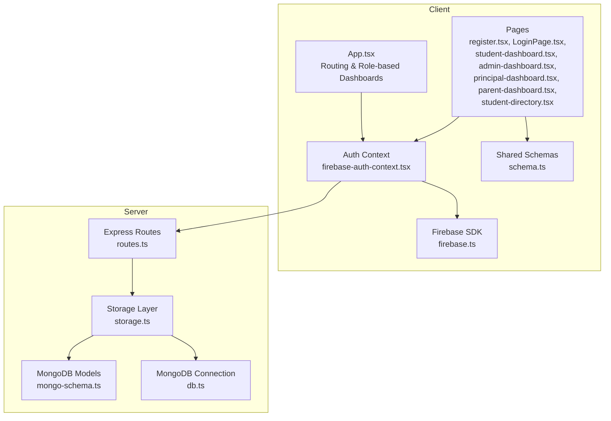
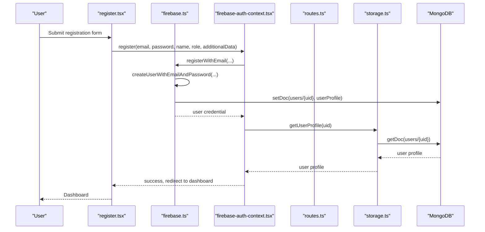
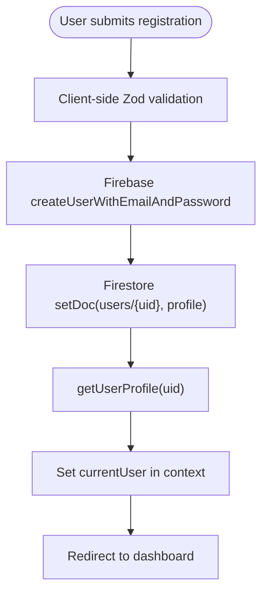
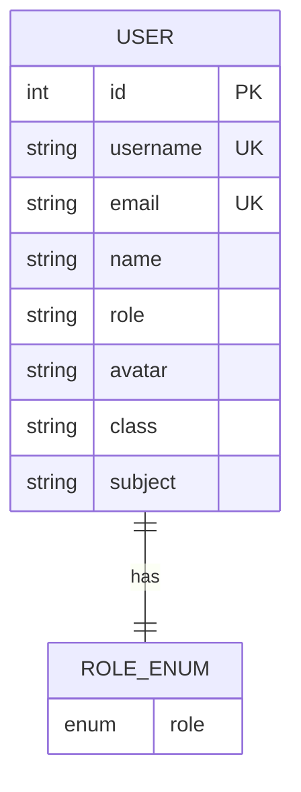
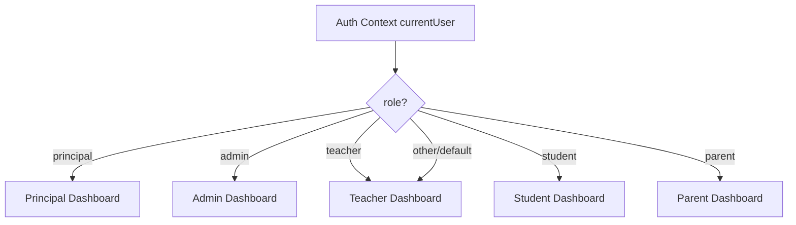
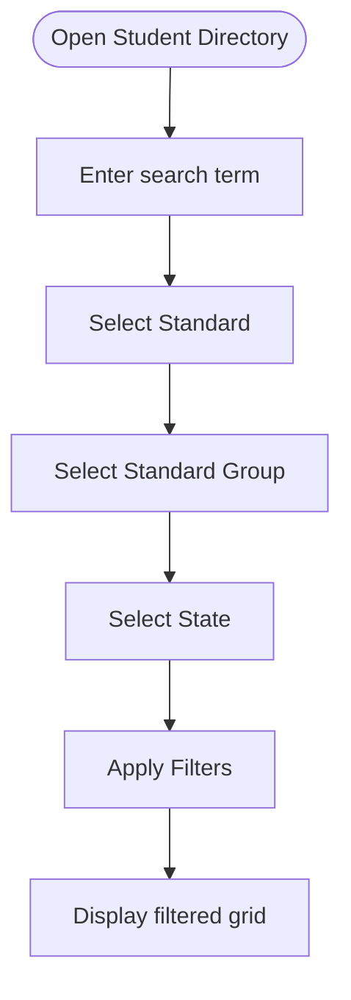
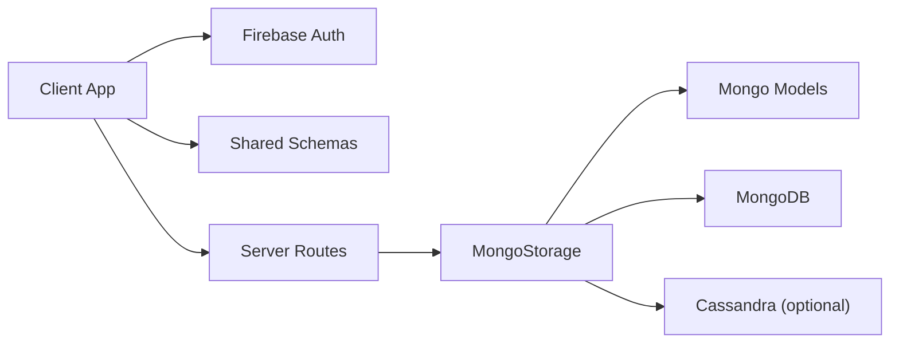

# User Management System

<cite>
**Referenced Files in This Document**
- [register.tsx](file://client/src/pages/register.tsx)
- [LoginPage.tsx](file://client/src/pages/LoginPage.tsx)
- [firebase.ts](file://client/src/lib/firebase.ts)
- [firebase-auth-context.tsx](file://client/src/contexts/firebase-auth-context.tsx)
- [schema.ts](file://shared/schema.ts)
- [routes.ts](file://server/routes.ts)
- [storage.ts](file://server/storage.ts)
- [mongo-schema.ts](file://shared/mongo-schema.ts)
- [dashboard.tsx](file://client/src/pages/dashboard.tsx)
- [student-dashboard.tsx](file://client/src/pages/student-dashboard.tsx)
- [admin-dashboard.tsx](file://client/src/pages/admin-dashboard.tsx)
- [principal-dashboard.tsx](file://client/src/pages/principal-dashboard.tsx)
- [parent-dashboard.tsx](file://client/src/pages/parent-dashboard.tsx)
- [student-directory.tsx](file://client/src/pages/student-directory.tsx)
- [App.tsx](file://client/src/App.tsx)
- [config.ts](file://client/src/config.ts)
</cite>

## Table of Contents
1. [Introduction](#introduction)
2. [Project Structure](#project-structure)
3. [Core Components](#core-components)
4. [Architecture Overview](#architecture-overview)
5. [Detailed Component Analysis](#detailed-component-analysis)
6. [Dependency Analysis](#dependency-analysis)
7. [Performance Considerations](#performance-considerations)
8. [Troubleshooting Guide](#troubleshooting-guide)
9. [Conclusion](#conclusion)

## Introduction
This document describes the user management system for PersonalLearningPro, focusing on user profile management, role-based dashboard customization, and the student directory functionality. It explains the five-user role hierarchy (Student, Teacher, Admin, Principal, Parent), their permissions and dashboard features, user registration and authentication flows, profile updates, and data access patterns. It also covers the student directory system with grade-level organization and search capabilities, along with administrative user management features.

## Project Structure
The user management system spans client-side React components, Firebase authentication, shared validation schemas, and server-side routes backed by MongoDB/Mongoose with optional Cassandra message storage.

**Diagram sources**
- [App.tsx](file://client/src/App.tsx#L93-L133)
- [firebase-auth-context.tsx](file://client/src/contexts/firebase-auth-context.tsx#L1-L267)
- [firebase.ts](file://client/src/lib/firebase.ts#L1-L212)
- [register.tsx](file://client/src/pages/register.tsx#L1-L338)
- [routes.ts](file://server/routes.ts#L1-L1104)
- [storage.ts](file://server/storage.ts#L1-L519)
- [mongo-schema.ts](file://shared/mongo-schema.ts#L1-L159)

**Section sources**
- [App.tsx](file://client/src/App.tsx#L93-L133)
- [routes.ts](file://server/routes.ts#L11-L85)
- [storage.ts](file://server/storage.ts#L33-L106)

## Core Components
- Authentication and user profiles:
  - Firebase-based authentication with email/password and Google OAuth.
  - User profile interface with role, class/subject associations, and timestamps.
  - Auth context manages login, registration, logout, and profile retrieval.
- Registration and validation:
  - Zod schema validates registration inputs including role selection and optional class/subject fields.
  - Client-side form integrates validation and submission to Firebase.
- Server-side user management:
  - Express routes for authentication and user retrieval.
  - Storage layer abstracts MongoDB operations with auto-incremented IDs.
  - Shared Zod schemas define data contracts for validation.
- Role-based dashboards:
  - Dynamic routing selects dashboard based on user role.
  - Role-specific dashboards provide tailored UI and features.
- Student directory:
  - Filtering by standard, state, and standard groups.
  - Mock data and UI scaffolding for future API integration.

**Section sources**
- [firebase.ts](file://client/src/lib/firebase.ts#L47-L63)
- [firebase-auth-context.tsx](file://client/src/contexts/firebase-auth-context.tsx#L18-L34)
- [register.tsx](file://client/src/pages/register.tsx#L36-L48)
- [schema.ts](file://shared/schema.ts#L4-L13)
- [routes.ts](file://server/routes.ts#L13-L47)
- [storage.ts](file://server/storage.ts#L127-L158)
- [App.tsx](file://client/src/App.tsx#L114-L124)
- [student-directory.tsx](file://client/src/pages/student-directory.tsx#L69-L80)

## Architecture Overview
The system uses a client-server architecture with Firebase for authentication and Express for backend APIs. The storage layer abstracts persistence, currently using MongoDB with Mongoose and optionally Cassandra for message-heavy features.

**Diagram sources**
- [register.tsx](file://client/src/pages/register.tsx#L70-L86)
- [firebase-auth-context.tsx](file://client/src/contexts/firebase-auth-context.tsx#L97-L125)
- [firebase.ts](file://client/src/lib/firebase.ts#L80-L115)
- [routes.ts](file://server/routes.ts#L88-L107)
- [storage.ts](file://server/storage.ts#L127-L147)

## Detailed Component Analysis

### User Registration and Authentication
- Registration form:
  - Validates name, email, username, password, role, and optional class/subject.
  - Submits to Firebase and creates Firestore user document with timestamps.
- Login:
  - Email/password and Google OAuth supported.
  - On login, lastLogin timestamp is updated.
- Auth context:
  - Centralizes login, register, logout, and profile retrieval.
  - Handles loading states and error notifications.

**Diagram sources**
- [register.tsx](file://client/src/pages/register.tsx#L70-L86)
- [firebase.ts](file://client/src/lib/firebase.ts#L80-L115)
- [firebase-auth-context.tsx](file://client/src/contexts/firebase-auth-context.tsx#L97-L125)

**Section sources**
- [register.tsx](file://client/src/pages/register.tsx#L36-L86)
- [firebase.ts](file://client/src/lib/firebase.ts#L66-L115)
- [firebase-auth-context.tsx](file://client/src/contexts/firebase-auth-context.tsx#L73-L125)

### User Data Models and Validation
- Client-side user profile interface includes role, class/subject associations, and timestamps.
- Shared Zod schema defines server-side user creation contract with role enum and optional fields.
- Server routes validate incoming data and enforce uniqueness for username/email.

**Diagram sources**
- [mongo-schema.ts](file://shared/mongo-schema.ts#L13-L23)
- [schema.ts](file://shared/schema.ts#L4-L13)

**Section sources**
- [firebase.ts](file://client/src/lib/firebase.ts#L50-L63)
- [schema.ts](file://shared/schema.ts#L4-L13)
- [mongo-schema.ts](file://shared/mongo-schema.ts#L13-L23)

### Role-Based Dashboard Customization
- Routing selects dashboard based on user role:
  - Principal → Principal dashboard
  - Admin → Admin dashboard
  - Teacher → Teacher dashboard
  - Student → Student dashboard
  - Parent → Parent dashboard
- Each dashboard provides role-appropriate UI and features.

**Diagram sources**
- [App.tsx](file://client/src/App.tsx#L114-L124)

**Section sources**
- [App.tsx](file://client/src/App.tsx#L114-L124)
- [principal-dashboard.tsx](file://client/src/pages/principal-dashboard.tsx#L1-L365)
- [admin-dashboard.tsx](file://client/src/pages/admin-dashboard.tsx#L1-L302)
- [dashboard.tsx](file://client/src/pages/dashboard.tsx#L1-L338)
- [student-dashboard.tsx](file://client/src/pages/student-dashboard.tsx#L1-L800)
- [parent-dashboard.tsx](file://client/src/pages/parent-dashboard.tsx#L1-L279)

### Student Directory Functionality
- Filtering and search:
  - Search by name, city, or state.
  - Filter by standard, standard group, and state.
- Grade-level organization:
  - Pre-Primary, Primary, Middle, Secondary, Senior Secondary groups.
- UI scaffolding:
  - Tabs for standard groups and grid display.
  - Mock data demonstrates structure awaiting API integration.

**Diagram sources**
- [student-directory.tsx](file://client/src/pages/student-directory.tsx#L69-L257)

**Section sources**
- [student-directory.tsx](file://client/src/pages/student-directory.tsx#L43-L80)
- [student-directory.tsx](file://client/src/pages/student-directory.tsx#L240-L257)

### Administrative User Management Features
- Admin dashboard provides:
  - User management summary cards.
  - User listing with role counts.
  - Class management overview.
  - Reports and analytics section.
  - System settings panel.
- These are UI scaffolds indicating intended administrative capabilities.

**Section sources**
- [admin-dashboard.tsx](file://client/src/pages/admin-dashboard.tsx#L29-L302)

### Data Access Patterns and Server-Side Implementation
- Authentication routes:
  - POST /api/auth/register validates input and ensures unique username/email.
  - POST /api/auth/login authenticates and sets session.
  - POST /api/auth/logout destroys session.
- User routes:
  - GET /api/users/me retrieves authenticated user profile.
- Storage abstraction:
  - MongoStorage implements CRUD operations with auto-incremented IDs.
  - Supports user lookup by username/email and class-based queries.
- Optional Cassandra integration:
  - Message operations can fall back to MongoDB if Cassandra client is unavailable.

**Section sources**
- [routes.ts](file://server/routes.ts#L13-L85)
- [routes.ts](file://server/routes.ts#L88-L107)
- [storage.ts](file://server/storage.ts#L127-L158)
- [storage.ts](file://server/storage.ts#L413-L437)

## Dependency Analysis
- Client depends on:
  - Firebase SDK for auth and Firestore for user profiles.
  - Zod schemas for validation.
  - TanStack Query for data fetching (student directory).
- Server depends on:
  - Express for routing.
  - Mongoose for MongoDB modeling.
  - Optional Cassandra client for message storage.
- Shared dependencies:
  - Zod schemas for validation contracts.

**Diagram sources**
- [firebase-auth-context.tsx](file://client/src/contexts/firebase-auth-context.tsx#L1-L267)
- [schema.ts](file://shared/schema.ts#L1-L142)
- [routes.ts](file://server/routes.ts#L1-L1104)
- [storage.ts](file://server/storage.ts#L1-L519)
- [mongo-schema.ts](file://shared/mongo-schema.ts#L1-L159)

**Section sources**
- [firebase-auth-context.tsx](file://client/src/contexts/firebase-auth-context.tsx#L1-L267)
- [routes.ts](file://server/routes.ts#L1-L1104)
- [storage.ts](file://server/storage.ts#L1-L519)

## Performance Considerations
- Client-side:
  - Use controlled components and validation to minimize re-renders.
  - Debounce search inputs in the student directory to reduce filtering overhead.
- Server-side:
  - Ensure proper indexing on frequently queried fields (e.g., user class).
  - Consider pagination for large datasets (already present in message fetching).
  - Use auto-increment counters efficiently to avoid contention.

## Troubleshooting Guide
- Authentication issues:
  - Verify Firebase configuration and environment variables.
  - Check toast notifications for login/register failures.
- User profile retrieval:
  - Confirm Firestore user document exists after registration.
  - Ensure session is properly established on login.
- Server errors:
  - Validate input against Zod schemas before hitting routes.
  - Check MongoDB connectivity and collection existence.

**Section sources**
- [firebase-auth-context.tsx](file://client/src/contexts/firebase-auth-context.tsx#L73-L125)
- [routes.ts](file://server/routes.ts#L13-L85)
- [storage.ts](file://server/storage.ts#L127-L147)

## Conclusion
PersonalLearningPro’s user management system combines Firebase authentication with role-aware dashboards and a robust server-side storage layer. The five-role hierarchy is enforced through routing and UI customization, while shared validation schemas ensure data integrity. The student directory provides a foundation for scalable search and filtering, and the admin dashboard outlines administrative capabilities. Future enhancements could include API integration for the student directory, expanded admin features, and improved error handling and monitoring.