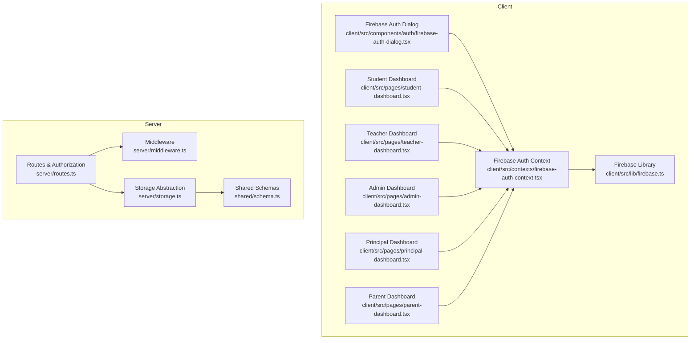
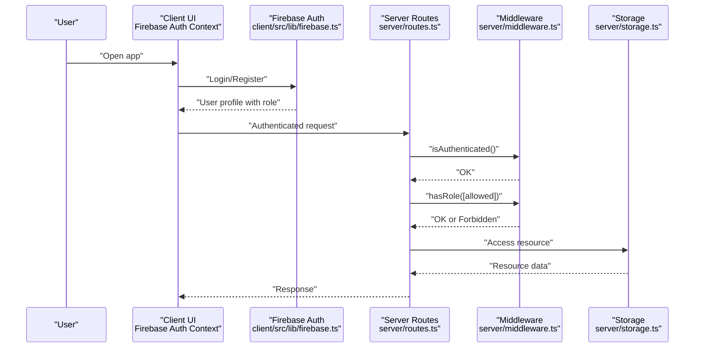
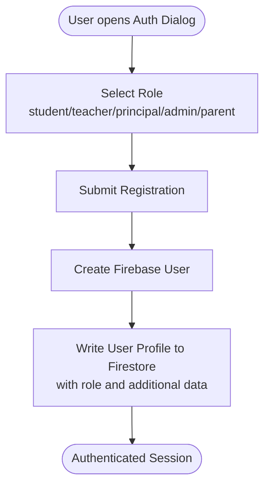
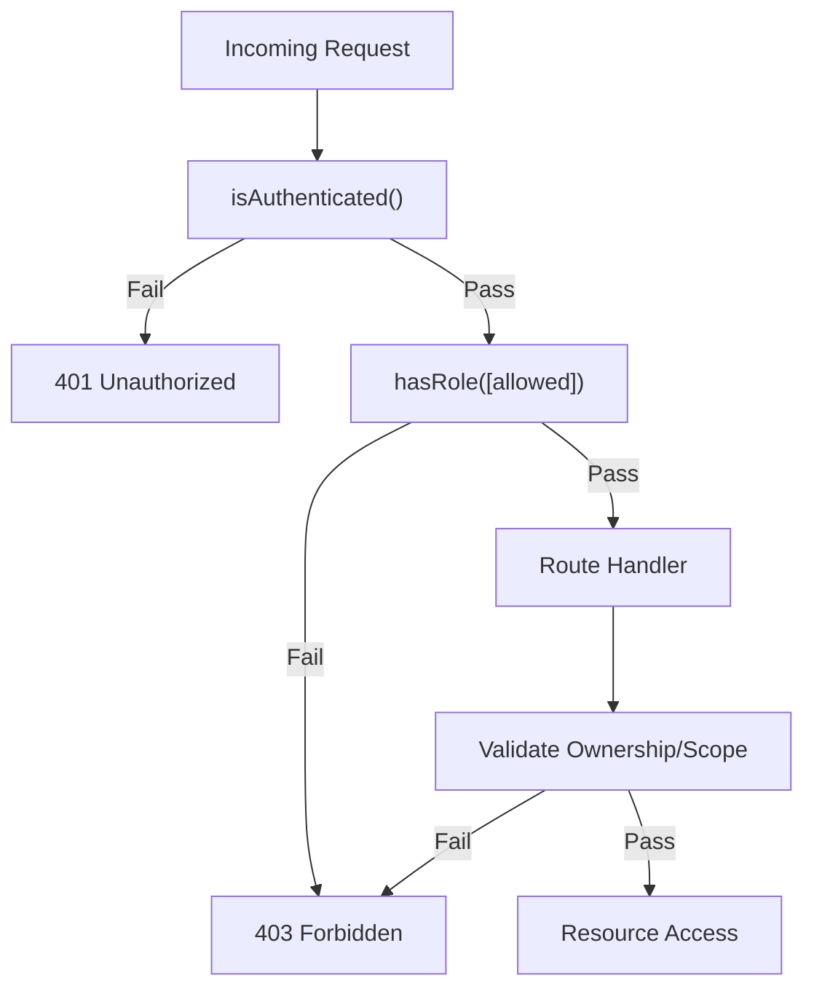
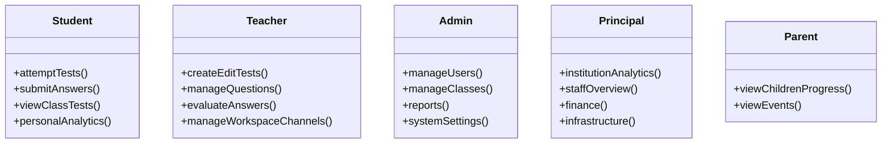
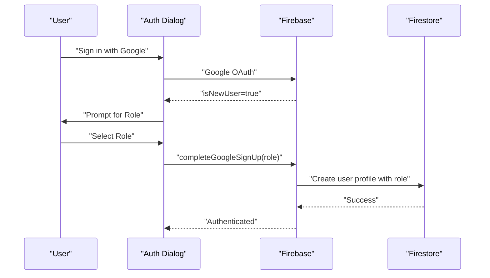
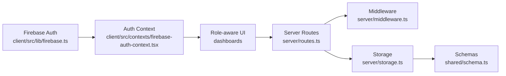

# User Roles & Permissions

<cite>
**Referenced Files in This Document**
- [client/src/lib/firebase.ts](file://client/src/lib/firebase.ts)
- [client/src/contexts/firebase-auth-context.tsx](file://client/src/contexts/firebase-auth-context.tsx)
- [client/src/components/auth/firebase-auth-dialog.tsx](file://client/src/components/auth/firebase-auth-dialog.tsx)
- [client/src/types/chat.ts](file://client/src/types/chat.ts)
- [client/src/pages/admin-dashboard.tsx](file://client/src/pages/admin-dashboard.tsx)
- [client/src/pages/student-dashboard.tsx](file://client/src/pages/student-dashboard.tsx)
- [client/src/pages/parent-dashboard.tsx](file://client/src/pages/parent-dashboard.tsx)
- [client/src/pages/principal-dashboard.tsx](file://client/src/pages/principal-dashboard.tsx)
- [server/middleware.ts](file://server/middleware.ts)
- [server/routes.ts](file://server/routes.ts)
- [server/storage.ts](file://server/storage.ts)
- [shared/schema.ts](file://shared/schema.ts)
- [client/src/config.ts](file://client/src/config.ts)
</cite>

## Table of Contents
1. [Introduction](#introduction)
2. [Project Structure](#project-structure)
3. [Core Components](#core-components)
4. [Architecture Overview](#architecture-overview)
5. [Detailed Component Analysis](#detailed-component-analysis)
6. [Dependency Analysis](#dependency-analysis)
7. [Performance Considerations](#performance-considerations)
8. [Troubleshooting Guide](#troubleshooting-guide)
9. [Conclusion](#conclusion)

## Introduction
This document explains the user role and permission system in PersonalLearningPro. It covers the five-user role hierarchy (Student, Teacher, Admin, Principal, and Parent), role-specific permissions, access controls, and feature availability. It also documents the role-based access control implementation, authentication middleware, and authorization patterns, along with role transition workflows, permission inheritance, and security considerations. Examples of role-specific dashboard features and administrative capabilities are included to illustrate practical usage.

## Project Structure
The role and permission system spans both client and server layers:
- Client-side authentication and role-aware UI rendering
- Server-side session-based authorization and route guards
- Shared schemas and storage abstractions

**Diagram sources**
- [client/src/contexts/firebase-auth-context.tsx](file://client/src/contexts/firebase-auth-context.tsx#L1-L267)
- [client/src/components/auth/firebase-auth-dialog.tsx](file://client/src/components/auth/firebase-auth-dialog.tsx#L1-L500)
- [client/src/lib/firebase.ts](file://client/src/lib/firebase.ts#L1-L212)
- [client/src/pages/student-dashboard.tsx](file://client/src/pages/student-dashboard.tsx#L1-L1001)
- [client/src/pages/admin-dashboard.tsx](file://client/src/pages/admin-dashboard.tsx#L1-L302)
- [client/src/pages/principal-dashboard.tsx](file://client/src/pages/principal-dashboard.tsx#L1-L365)
- [client/src/pages/parent-dashboard.tsx](file://client/src/pages/parent-dashboard.tsx#L1-L279)
- [server/middleware.ts](file://server/middleware.ts#L1-L18)
- [server/routes.ts](file://server/routes.ts#L1-L1104)
- [server/storage.ts](file://server/storage.ts#L1-L519)
- [shared/schema.ts](file://shared/schema.ts#L1-L142)

**Section sources**
- [client/src/contexts/firebase-auth-context.tsx](file://client/src/contexts/firebase-auth-context.tsx#L1-L267)
- [client/src/lib/firebase.ts](file://client/src/lib/firebase.ts#L1-L212)
- [server/middleware.ts](file://server/middleware.ts#L1-L18)
- [server/routes.ts](file://server/routes.ts#L1-L1104)
- [server/storage.ts](file://server/storage.ts#L1-L519)
- [shared/schema.ts](file://shared/schema.ts#L1-L142)

## Core Components
- Authentication and user profiles:
  - Client-side Firebase integration and user context
  - Role-aware registration and login flows
- Authorization and access control:
  - Session-based middleware enforcing authentication and role checks
  - Route-level guards protecting resources
- Role-specific dashboards and features:
  - Student, Teacher, Admin, Principal, and Parent dashboards with role-appropriate UI and actions
- Shared schemas and storage:
  - Validation schemas and storage abstractions used across routes

Key implementation references:
- Client auth and roles: [client/src/lib/firebase.ts](file://client/src/lib/firebase.ts#L47-L63), [client/src/contexts/firebase-auth-context.tsx](file://client/src/contexts/firebase-auth-context.tsx#L19-L34), [client/src/components/auth/firebase-auth-dialog.tsx](file://client/src/components/auth/firebase-auth-dialog.tsx#L55-L64)
- Server middleware: [server/middleware.ts](file://server/middleware.ts#L3-L17)
- Server routes and authorization: [server/routes.ts](file://server/routes.ts#L110-L132), [server/routes.ts](file://server/routes.ts#L250-L278), [server/routes.ts](file://server/routes.ts#L319-L370), [server/routes.ts](file://server/routes.ts#L417-L463), [server/routes.ts](file://server/routes.ts#L584-L676), [server/routes.ts](file://server/routes.ts#L679-L718), [server/routes.ts](file://server/routes.ts#L722-L777)
- Dashboards: [client/src/pages/student-dashboard.tsx](file://client/src/pages/student-dashboard.tsx#L123-L125), [client/src/pages/admin-dashboard.tsx](file://client/src/pages/admin-dashboard.tsx#L29-L30), [client/src/pages/principal-dashboard.tsx](file://client/src/pages/principal-dashboard.tsx#L44-L45), [client/src/pages/parent-dashboard.tsx](file://client/src/pages/parent-dashboard.tsx#L36-L37)

**Section sources**
- [client/src/lib/firebase.ts](file://client/src/lib/firebase.ts#L47-L63)
- [client/src/contexts/firebase-auth-context.tsx](file://client/src/contexts/firebase-auth-context.tsx#L19-L34)
- [client/src/components/auth/firebase-auth-dialog.tsx](file://client/src/components/auth/firebase-auth-dialog.tsx#L55-L64)
- [server/middleware.ts](file://server/middleware.ts#L3-L17)
- [server/routes.ts](file://server/routes.ts#L110-L132)
- [server/routes.ts](file://server/routes.ts#L250-L278)
- [server/routes.ts](file://server/routes.ts#L319-L370)
- [server/routes.ts](file://server/routes.ts#L417-L463)
- [server/routes.ts](file://server/routes.ts#L584-L676)
- [server/routes.ts](file://server/routes.ts#L679-L718)
- [server/routes.ts](file://server/routes.ts#L722-L777)
- [client/src/pages/student-dashboard.tsx](file://client/src/pages/student-dashboard.tsx#L123-L125)
- [client/src/pages/admin-dashboard.tsx](file://client/src/pages/admin-dashboard.tsx#L29-L30)
- [client/src/pages/principal-dashboard.tsx](file://client/src/pages/principal-dashboard.tsx#L44-L45)
- [client/src/pages/parent-dashboard.tsx](file://client/src/pages/parent-dashboard.tsx#L36-L37)

## Architecture Overview
The system enforces role-based access control using session-based middleware and route-level guards. Authentication is handled client-side via Firebase, while server-side routes validate session presence and role membership before granting access to protected resources.

**Diagram sources**
- [client/src/lib/firebase.ts](file://client/src/lib/firebase.ts#L66-L115)
- [client/src/contexts/firebase-auth-context.tsx](file://client/src/contexts/firebase-auth-context.tsx#L73-L125)
- [server/middleware.ts](file://server/middleware.ts#L3-L17)
- [server/routes.ts](file://server/routes.ts#L11-L85)
- [server/storage.ts](file://server/storage.ts#L110-L118)

## Detailed Component Analysis

### Role Model and Registration Flow
- Roles supported on the client and in the auth dialog include: student, teacher, principal, admin, parent.
- Registration captures role and role-specific data, storing it in the user profile.
- Google login supports new-user flow completion by selecting a role.

**Diagram sources**
- [client/src/components/auth/firebase-auth-dialog.tsx](file://client/src/components/auth/firebase-auth-dialog.tsx#L55-L64)
- [client/src/components/auth/firebase-auth-dialog.tsx](file://client/src/components/auth/firebase-auth-dialog.tsx#L111-L118)
- [client/src/lib/firebase.ts](file://client/src/lib/firebase.ts#L80-L115)
- [client/src/lib/firebase.ts](file://client/src/lib/firebase.ts#L152-L177)

**Section sources**
- [client/src/components/auth/firebase-auth-dialog.tsx](file://client/src/components/auth/firebase-auth-dialog.tsx#L55-L64)
- [client/src/components/auth/firebase-auth-dialog.tsx](file://client/src/components/auth/firebase-auth-dialog.tsx#L111-L118)
- [client/src/lib/firebase.ts](file://client/src/lib/firebase.ts#L80-L115)
- [client/src/lib/firebase.ts](file://client/src/lib/firebase.ts#L152-L177)

### Role-Based Access Control Implementation
- Middleware enforces authentication and role checks:
  - isAuthenticated: blocks unauthenticated requests
  - hasRole: allows only specified roles
- Routes implement fine-grained authorization:
  - Tests: only teachers can create/update; access controlled by ownership/class
  - Questions: teacher ownership validated per test
  - Test attempts: student-only creation; class and status checks
  - Answers: student ownership and attempt state validation
  - Chat workspaces/channels: workspace membership and role-based member management
  - Messages: workspace membership or DM ownership validation

**Diagram sources**
- [server/middleware.ts](file://server/middleware.ts#L3-L17)
- [server/routes.ts](file://server/routes.ts#L110-L132)
- [server/routes.ts](file://server/routes.ts#L250-L278)
- [server/routes.ts](file://server/routes.ts#L319-L370)
- [server/routes.ts](file://server/routes.ts#L417-L463)
- [server/routes.ts](file://server/routes.ts#L584-L676)
- [server/routes.ts](file://server/routes.ts#L679-L718)
- [server/routes.ts](file://server/routes.ts#L722-L777)

**Section sources**
- [server/middleware.ts](file://server/middleware.ts#L3-L17)
- [server/routes.ts](file://server/routes.ts#L110-L132)
- [server/routes.ts](file://server/routes.ts#L250-L278)
- [server/routes.ts](file://server/routes.ts#L319-L370)
- [server/routes.ts](file://server/routes.ts#L417-L463)
- [server/routes.ts](file://server/routes.ts#L584-L676)
- [server/routes.ts](file://server/routes.ts#L679-L718)
- [server/routes.ts](file://server/routes.ts#L722-L777)

### Role-Specific Permissions and Feature Availability

- Student
  - Permissions: attempt tests, submit answers, view class tests, access personal analytics
  - UI: dashboard with subjects, schedule, live rooms, tests, results, achievements
  - Access control: test attempts bound to student’s class; answers tied to owned attempts

- Teacher
  - Permissions: create/edit/delete tests, manage questions, evaluate subjective answers, manage workspace channels
  - UI: dashboard features for teaching and collaboration
  - Access control: ownership checks per test and question; workspace member rules

- Admin
  - Permissions: manage users, classes, reports, system settings
  - UI: admin dashboard with user/class management, reports, settings

- Principal
  - Permissions: institution-level analytics, staff overview, finance, infrastructure
  - UI: principal dashboard with stats, charts, events, notifications

- Parent
  - Permissions: view children’s progress, attendance, grades, upcoming events
  - UI: parent dashboard with children cards, progress chart, schedule

**Diagram sources**
- [client/src/pages/student-dashboard.tsx](file://client/src/pages/student-dashboard.tsx#L123-L125)
- [client/src/pages/admin-dashboard.tsx](file://client/src/pages/admin-dashboard.tsx#L29-L30)
- [client/src/pages/principal-dashboard.tsx](file://client/src/pages/principal-dashboard.tsx#L44-L45)
- [client/src/pages/parent-dashboard.tsx](file://client/src/pages/parent-dashboard.tsx#L36-L37)
- [server/routes.ts](file://server/routes.ts#L110-L132)
- [server/routes.ts](file://server/routes.ts#L250-L278)
- [server/routes.ts](file://server/routes.ts#L319-L370)
- [server/routes.ts](file://server/routes.ts#L417-L463)
- [server/routes.ts](file://server/routes.ts#L584-L676)
- [server/routes.ts](file://server/routes.ts#L679-L718)
- [server/routes.ts](file://server/routes.ts#L722-L777)

**Section sources**
- [client/src/pages/student-dashboard.tsx](file://client/src/pages/student-dashboard.tsx#L123-L125)
- [client/src/pages/admin-dashboard.tsx](file://client/src/pages/admin-dashboard.tsx#L29-L30)
- [client/src/pages/principal-dashboard.tsx](file://client/src/pages/principal-dashboard.tsx#L44-L45)
- [client/src/pages/parent-dashboard.tsx](file://client/src/pages/parent-dashboard.tsx#L36-L37)
- [server/routes.ts](file://server/routes.ts#L110-L132)
- [server/routes.ts](file://server/routes.ts#L250-L278)
- [server/routes.ts](file://server/routes.ts#L319-L370)
- [server/routes.ts](file://server/routes.ts#L417-L463)
- [server/routes.ts](file://server/routes.ts#L584-L676)
- [server/routes.ts](file://server/routes.ts#L679-L718)
- [server/routes.ts](file://server/routes.ts#L722-L777)

### Role Transition Workflows
- New Google user flow:
  - Authenticate via Google
  - If new user, prompt to select role and complete registration with role-specific data
- Manual role updates:
  - Admin can modify user roles via admin dashboard
  - Role transitions propagate to UI and route-level access immediately after re-authentication

**Diagram sources**
- [client/src/components/auth/firebase-auth-dialog.tsx](file://client/src/components/auth/firebase-auth-dialog.tsx#L174-L185)
- [client/src/components/auth/firebase-auth-dialog.tsx](file://client/src/components/auth/firebase-auth-dialog.tsx#L128-L139)
- [client/src/lib/firebase.ts](file://client/src/lib/firebase.ts#L117-L150)
- [client/src/lib/firebase.ts](file://client/src/lib/firebase.ts#L152-L177)

**Section sources**
- [client/src/components/auth/firebase-auth-dialog.tsx](file://client/src/components/auth/firebase-auth-dialog.tsx#L174-L185)
- [client/src/components/auth/firebase-auth-dialog.tsx](file://client/src/components/auth/firebase-auth-dialog.tsx#L128-L139)
- [client/src/lib/firebase.ts](file://client/src/lib/firebase.ts#L117-L150)
- [client/src/lib/firebase.ts](file://client/src/lib/firebase.ts#L152-L177)

### Permission Inheritance and Security Considerations
- Permission inheritance:
  - Admin inherits teacher privileges plus administrative controls
  - Principal inherits administrative oversight with institution-level views
- Security considerations:
  - Session-based middleware ensures all protected routes enforce authentication and role checks
  - Ownership checks prevent cross-user data access (e.g., tests, attempts, messages)
  - Workspace membership rules govern channel and message visibility
  - Role-specific data stored during registration supports downstream UI and feature gating

**Section sources**
- [server/middleware.ts](file://server/middleware.ts#L3-L17)
- [server/routes.ts](file://server/routes.ts#L110-L132)
- [server/routes.ts](file://server/routes.ts#L250-L278)
- [server/routes.ts](file://server/routes.ts#L319-L370)
- [server/routes.ts](file://server/routes.ts#L417-L463)
- [server/routes.ts](file://server/routes.ts#L584-L676)
- [server/routes.ts](file://server/routes.ts#L679-L718)
- [server/routes.ts](file://server/routes.ts#L722-L777)

## Dependency Analysis
The role and permission system depends on:
- Client auth context and Firebase library for user identity and role
- Server middleware and routes for enforcement
- Storage abstraction for data access and ownership checks
- Shared schemas for validation

**Diagram sources**
- [client/src/lib/firebase.ts](file://client/src/lib/firebase.ts#L1-L212)
- [client/src/contexts/firebase-auth-context.tsx](file://client/src/contexts/firebase-auth-context.tsx#L1-L267)
- [server/routes.ts](file://server/routes.ts#L1-L1104)
- [server/middleware.ts](file://server/middleware.ts#L1-L18)
- [server/storage.ts](file://server/storage.ts#L1-L519)
- [shared/schema.ts](file://shared/schema.ts#L1-L142)

**Section sources**
- [client/src/lib/firebase.ts](file://client/src/lib/firebase.ts#L1-L212)
- [client/src/contexts/firebase-auth-context.tsx](file://client/src/contexts/firebase-auth-context.tsx#L1-L267)
- [server/routes.ts](file://server/routes.ts#L1-L1104)
- [server/middleware.ts](file://server/middleware.ts#L1-L18)
- [server/storage.ts](file://server/storage.ts#L1-L519)
- [shared/schema.ts](file://shared/schema.ts#L1-L142)

## Performance Considerations
- Session-based middleware is lightweight and efficient for authentication checks.
- Route-level validations leverage stored schemas to minimize runtime errors.
- Storage abstractions support scalable data access patterns; Cassandra integration is available for message-heavy workloads.

## Troubleshooting Guide
Common issues and resolutions:
- Authentication failures:
  - Verify Firebase configuration and credentials
  - Ensure user profile retrieval succeeds after login
- Authorization failures:
  - Confirm session contains userId and role
  - Check hasRole middleware invocation for protected routes
- Ownership violations:
  - Validate test ownership, attempt ownership, and workspace membership before accessing resources
- Role-specific UI not appearing:
  - Confirm role is persisted in user profile and context
  - Re-authenticate after role changes

**Section sources**
- [client/src/lib/firebase.ts](file://client/src/lib/firebase.ts#L27-L42)
- [client/src/contexts/firebase-auth-context.tsx](file://client/src/contexts/firebase-auth-context.tsx#L43-L71)
- [server/middleware.ts](file://server/middleware.ts#L3-L17)
- [server/routes.ts](file://server/routes.ts#L110-L132)
- [server/routes.ts](file://server/routes.ts#L319-L370)
- [server/routes.ts](file://server/routes.ts#L584-L676)

## Conclusion
PersonalLearningPro implements a robust role and permission system combining client-side Firebase authentication with server-side session-based authorization. The five-user hierarchy (Student, Teacher, Admin, Principal, Parent) is enforced through middleware and route-level guards, ensuring secure access to features and resources. Role-specific dashboards provide tailored experiences, while shared schemas and storage abstractions maintain consistency and scalability across the platform.