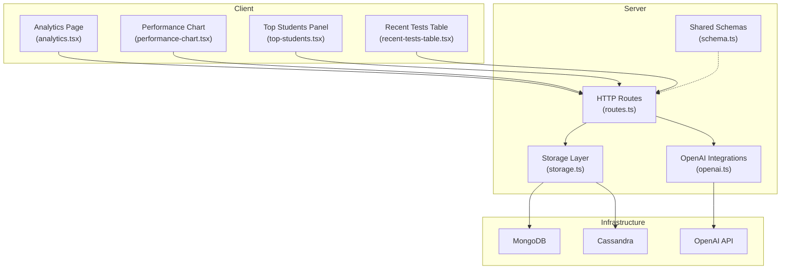
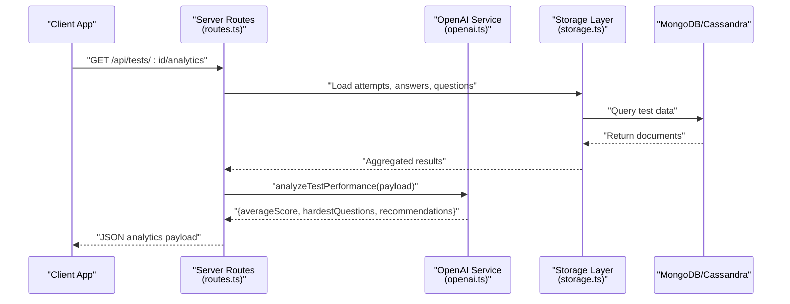
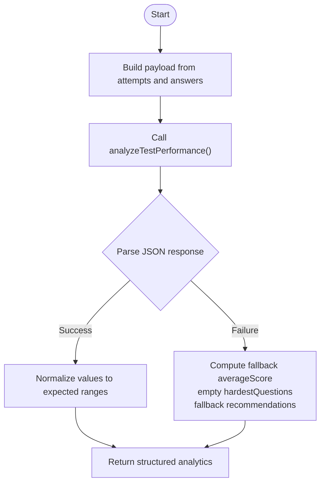
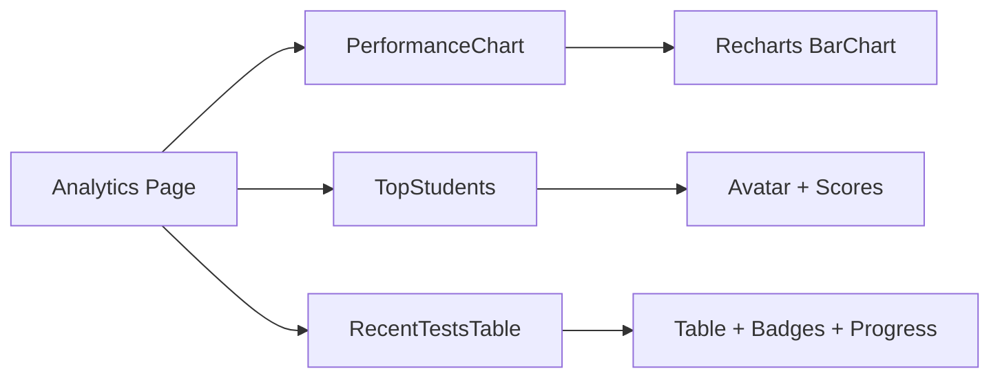
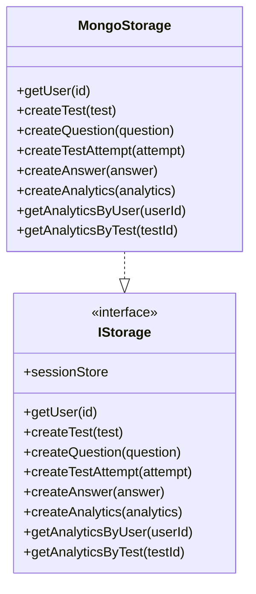
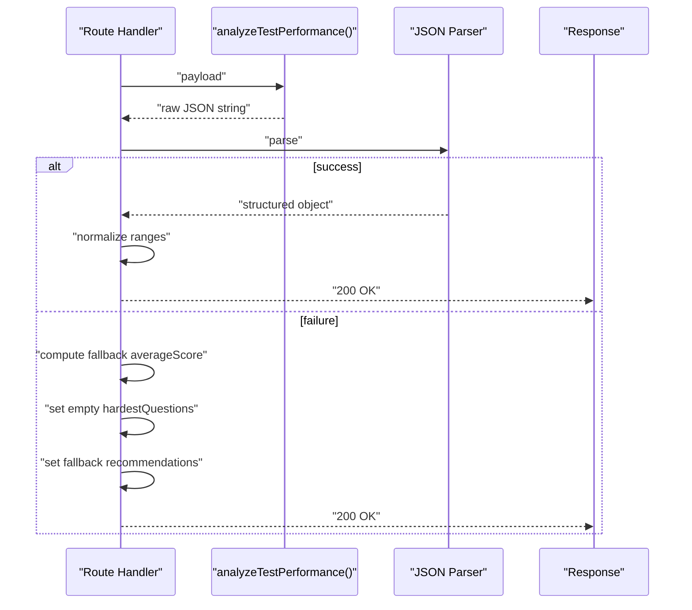
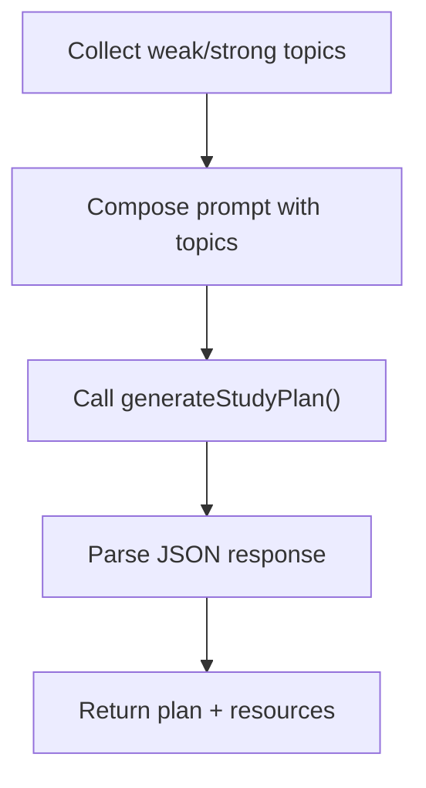
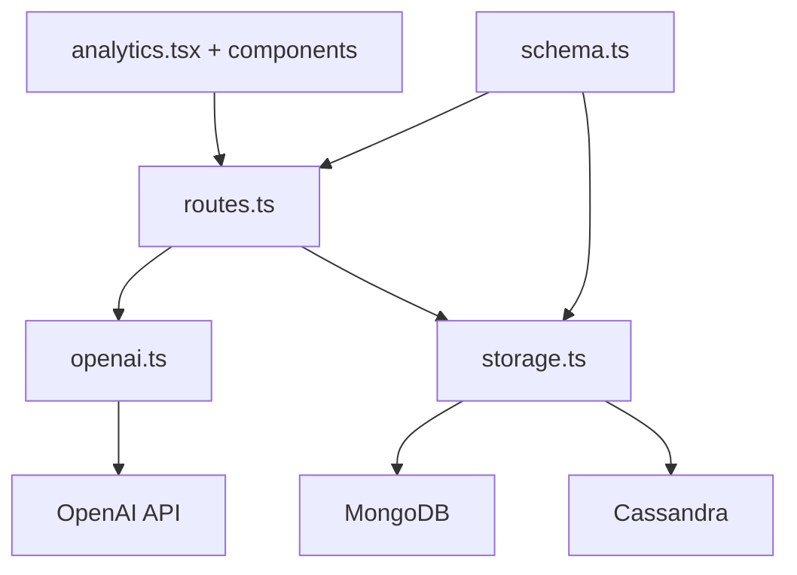

# AI Performance Analytics

<cite>
**Referenced Files in This Document**
- [server/index.ts](file://server/index.ts)
- [server/routes.ts](file://server/routes.ts)
- [server/lib/openai.ts](file://server/lib/openai.ts)
- [server/storage.ts](file://server/storage.ts)
- [shared/schema.ts](file://shared/schema.ts)
- [client/src/pages/analytics.tsx](file://client/src/pages/analytics.tsx)
- [client/src/components/dashboard/performance-chart.tsx](file://client/src/components/dashboard/performance-chart.tsx)
- [client/src/components/dashboard/top-students.tsx](file://client/src/components/dashboard/top-students.tsx)
- [client/src/components/dashboard/recent-tests-table.tsx](file://client/src/components/dashboard/recent-tests-table.tsx)
- [client/src/lib/chat-api.ts](file://client/src/lib/chat-api.ts)
</cite>

## Table of Contents
1. [Introduction](#introduction)
2. [Project Structure](#project-structure)
3. [Core Components](#core-components)
4. [Architecture Overview](#architecture-overview)
5. [Detailed Component Analysis](#detailed-component-analysis)
6. [Dependency Analysis](#dependency-analysis)
7. [Performance Considerations](#performance-considerations)
8. [Troubleshooting Guide](#troubleshooting-guide)
9. [Conclusion](#conclusion)

## Introduction
This document describes the AI-powered performance analytics system that powers classroom insights, test performance analysis, and recommendation generation. It explains how raw assessment data is processed, aggregated, and transformed into actionable insights and visualizations. It also documents the JSON response handling for performance metrics, the identification of the hardest questions, and teaching recommendations. Guidance is included for integrating analytics prompts, visualizing data, and building performance dashboards, alongside privacy, accuracy, and bias mitigation strategies.

## Project Structure
The system is split into:
- Backend (Express server) exposing REST endpoints and orchestrating AI-driven analytics
- Frontend (React) rendering dashboards and visualizations
- Shared schema definitions for typed data exchange
- Storage abstraction supporting MongoDB and Cassandra-backed message persistence

**Diagram sources**
- [client/src/pages/analytics.tsx](file://client/src/pages/analytics.tsx#L1-L177)
- [client/src/components/dashboard/performance-chart.tsx](file://client/src/components/dashboard/performance-chart.tsx#L1-L98)
- [client/src/components/dashboard/top-students.tsx](file://client/src/components/dashboard/top-students.tsx#L1-L74)
- [client/src/components/dashboard/recent-tests-table.tsx](file://client/src/components/dashboard/recent-tests-table.tsx#L1-L234)
- [server/routes.ts](file://server/routes.ts#L1-L800)
- [server/lib/openai.ts](file://server/lib/openai.ts#L1-L217)
- [server/storage.ts](file://server/storage.ts#L1-L519)
- [shared/schema.ts](file://shared/schema.ts#L1-L142)

**Section sources**
- [server/index.ts](file://server/index.ts#L1-L114)
- [server/routes.ts](file://server/routes.ts#L1-L800)
- [server/lib/openai.ts](file://server/lib/openai.ts#L1-L217)
- [server/storage.ts](file://server/storage.ts#L1-L519)
- [shared/schema.ts](file://shared/schema.ts#L1-L142)
- [client/src/pages/analytics.tsx](file://client/src/pages/analytics.tsx#L1-L177)
- [client/src/components/dashboard/performance-chart.tsx](file://client/src/components/dashboard/performance-chart.tsx#L1-L98)
- [client/src/components/dashboard/top-students.tsx](file://client/src/components/dashboard/top-students.tsx#L1-L74)
- [client/src/components/dashboard/recent-tests-table.tsx](file://client/src/components/dashboard/recent-tests-table.tsx#L1-L234)

## Core Components
- AI-driven test performance analysis: Computes average scores, identifies the hardest questions, and generates teaching recommendations.
- Statistical data processing: Aggregates test results and answer-level data to produce per-question averages and class-wide metrics.
- Insight generation: Uses structured prompts and JSON responses to return standardized analytics outputs.
- JSON response handling: Ensures robust parsing and fallbacks when AI responses deviate from expected formats.
- Dashboard components: Visualizes class performance, completion rates, and top students using reusable React components.
- Data aggregation workflows: Orchestrated by server routes that collect test attempts, answers, and compute analytics.
- Recommendation engine: Leverages AI to suggest targeted study plans and resources based on weak and strong topics.

**Section sources**
- [server/lib/openai.ts](file://server/lib/openai.ts#L165-L216)
- [server/routes.ts](file://server/routes.ts#L1-L800)
- [client/src/pages/analytics.tsx](file://client/src/pages/analytics.tsx#L1-L177)
- [client/src/components/dashboard/performance-chart.tsx](file://client/src/components/dashboard/performance-chart.tsx#L1-L98)
- [client/src/components/dashboard/top-students.tsx](file://client/src/components/dashboard/top-students.tsx#L1-L74)
- [client/src/components/dashboard/recent-tests-table.tsx](file://client/src/components/dashboard/recent-tests-table.tsx#L1-L234)

## Architecture Overview
The analytics pipeline integrates client dashboards, backend routes, AI services, and persistent storage.

**Diagram sources**
- [server/routes.ts](file://server/routes.ts#L1-L800)
- [server/lib/openai.ts](file://server/lib/openai.ts#L165-L216)
- [server/storage.ts](file://server/storage.ts#L1-L519)

## Detailed Component Analysis

### AI Test Performance Analyzer
The analyzer consumes structured test results and produces:
- averageScore: computed from student scores
- hardestQuestions: top 3 questions by lowest average score
- recommendations: teaching suggestions derived from the cohort’s performance

**Diagram sources**
- [server/lib/openai.ts](file://server/lib/openai.ts#L165-L216)

**Section sources**
- [server/lib/openai.ts](file://server/lib/openai.ts#L165-L216)

### Analytics Dashboard Components
- PerformanceChart: Renders class vs school averages per subject using Recharts.
- TopStudents: Lists top performers with avatars and scores.
- RecentTestsTable: Displays test status, completion rate, and average scores.
- Analytics page: Composes cards for subject distribution, completion rates, and AI-generated insights.

**Diagram sources**
- [client/src/pages/analytics.tsx](file://client/src/pages/analytics.tsx#L1-L177)
- [client/src/components/dashboard/performance-chart.tsx](file://client/src/components/dashboard/performance-chart.tsx#L1-L98)
- [client/src/components/dashboard/top-students.tsx](file://client/src/components/dashboard/top-students.tsx#L1-L74)
- [client/src/components/dashboard/recent-tests-table.tsx](file://client/src/components/dashboard/recent-tests-table.tsx#L1-L234)

**Section sources**
- [client/src/pages/analytics.tsx](file://client/src/pages/analytics.tsx#L1-L177)
- [client/src/components/dashboard/performance-chart.tsx](file://client/src/components/dashboard/performance-chart.tsx#L1-L98)
- [client/src/components/dashboard/top-students.tsx](file://client/src/components/dashboard/top-students.tsx#L1-L74)
- [client/src/components/dashboard/recent-tests-table.tsx](file://client/src/components/dashboard/recent-tests-table.tsx#L1-L234)

### Data Aggregation and Storage
- Storage layer abstracts MongoDB and Cassandra-backed persistence for messages and analytics.
- Analytics records include weak topics, strong topics, and recommended resources.
- Routes orchestrate data retrieval and pass results to the AI analyzer.

**Diagram sources**
- [server/storage.ts](file://server/storage.ts#L1-L519)
- [shared/schema.ts](file://shared/schema.ts#L61-L88)

**Section sources**
- [server/storage.ts](file://server/storage.ts#L1-L519)
- [shared/schema.ts](file://shared/schema.ts#L61-L88)

### JSON Response Handling for Analytics
- The AI analyzer returns a JSON object with three keys: averageScore, hardestQuestions, recommendations.
- The server parses the response and applies bounds checks; on failure, it falls back to computed values and neutral recommendations.

**Diagram sources**
- [server/lib/openai.ts](file://server/lib/openai.ts#L165-L216)

**Section sources**
- [server/lib/openai.ts](file://server/lib/openai.ts#L165-L216)

### Trend Analysis and Recommendation Engine
- The recommendation engine leverages AI to generate study plans and resource lists based on weak and strong topics.
- The analytics page surfaces “Class Insights” and “Teaching Recommendations,” enabling educators to align instruction with data.

**Diagram sources**
- [server/lib/openai.ts](file://server/lib/openai.ts#L107-L163)

**Section sources**
- [server/lib/openai.ts](file://server/lib/openai.ts#L107-L163)
- [client/src/pages/analytics.tsx](file://client/src/pages/analytics.tsx#L135-L174)

### Data Privacy Considerations
- Session-based authentication ensures only authorized users access analytics endpoints.
- Environment variables control OpenAI API key exposure; missing keys disable AI features with warnings.
- Client requests include credentials to propagate session cookies for CSRF-safe interactions.

**Section sources**
- [server/index.ts](file://server/index.ts#L31-L44)
- [server/lib/openai.ts](file://server/lib/openai.ts#L4-L6)
- [client/src/lib/chat-api.ts](file://client/src/lib/chat-api.ts#L44-L55)

### Statistical Accuracy and Bias Mitigation Strategies
- Fallback mechanisms ensure deterministic outputs when AI responses are invalid.
- Normalization caps scores and confidence to expected ranges.
- Recommendations are grounded in cohort-level trends; educators can override with domain expertise.
- To mitigate bias:
  - Use diverse rubrics and examples in prompts
  - Periodically audit recommendations against external benchmarks
  - Incorporate teacher feedback loops to refine prompts and thresholds

**Section sources**
- [server/lib/openai.ts](file://server/lib/openai.ts#L82-L104)
- [server/lib/openai.ts](file://server/lib/openai.ts#L192-L206)

## Dependency Analysis
The analytics system depends on:
- OpenAI for natural language processing and structured JSON outputs
- MongoDB for general entity storage and Cassandra for scalable message history
- React components for visualization and user interaction
- Zod schemas for input validation across the stack

**Diagram sources**
- [server/routes.ts](file://server/routes.ts#L1-L800)
- [server/lib/openai.ts](file://server/lib/openai.ts#L1-L217)
- [server/storage.ts](file://server/storage.ts#L1-L519)
- [shared/schema.ts](file://shared/schema.ts#L1-L142)
- [client/src/pages/analytics.tsx](file://client/src/pages/analytics.tsx#L1-L177)

**Section sources**
- [server/routes.ts](file://server/routes.ts#L1-L800)
- [server/lib/openai.ts](file://server/lib/openai.ts#L1-L217)
- [server/storage.ts](file://server/storage.ts#L1-L519)
- [shared/schema.ts](file://shared/schema.ts#L1-L142)

## Performance Considerations
- Prefer batch queries for retrieving attempts and answers to minimize round trips.
- Cache frequently accessed analytics results when appropriate to reduce AI call volume.
- Use pagination for message and analytics retrieval to avoid large payloads.
- Monitor OpenAI latency and apply timeouts to prevent slow responses from blocking UI.

## Troubleshooting Guide
- Missing OPENAI_API_KEY: AI features are disabled with a warning; set the environment variable to enable.
- JSON parse failures: The analyzer returns fallback values; inspect logs for malformed responses.
- Unauthorized access: Ensure session cookies are sent and roles match permissions.
- CORS/session issues: Verify credentials inclusion and cookie security flags in production.

**Section sources**
- [server/lib/openai.ts](file://server/lib/openai.ts#L4-L6)
- [server/lib/openai.ts](file://server/lib/openai.ts#L192-L206)
- [server/index.ts](file://server/index.ts#L31-L44)
- [client/src/lib/chat-api.ts](file://client/src/lib/chat-api.ts#L44-L55)

## Conclusion
The AI performance analytics system integrates robust data aggregation, AI-driven insights, and intuitive dashboards to support evidence-based teaching decisions. By normalizing outputs, providing fallbacks, and offering transparent visualizations, it balances automation with reliability. Educators can leverage the analytics to tailor instruction, while the architecture supports scalability and maintainability.