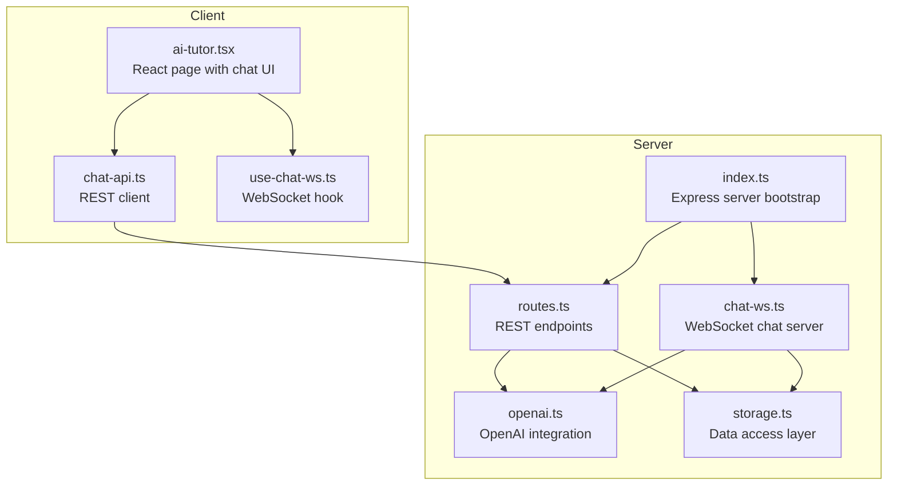
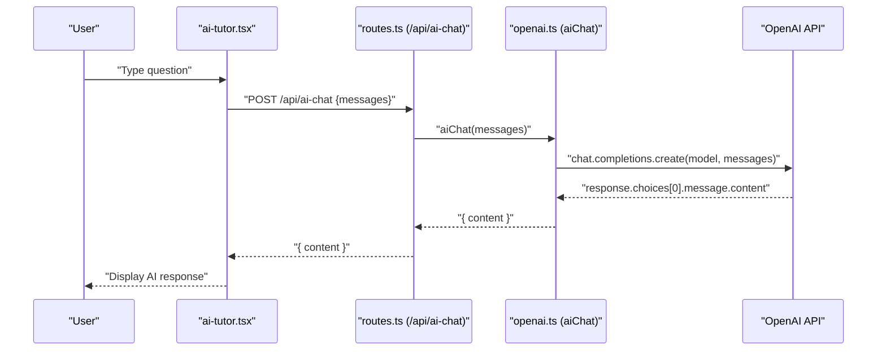
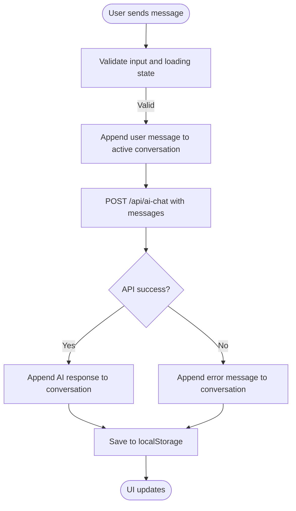
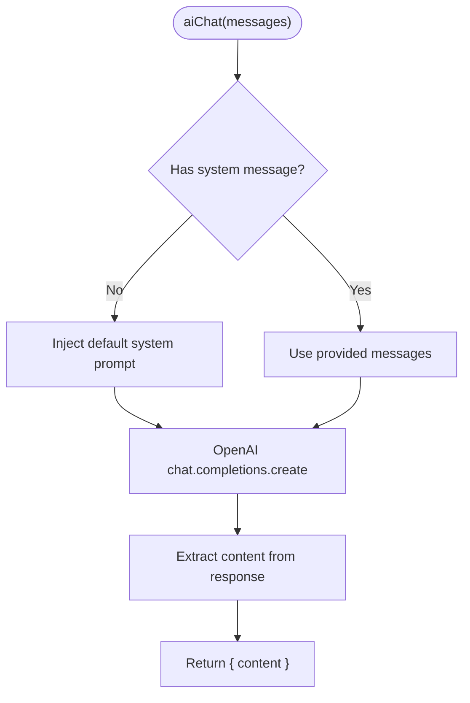
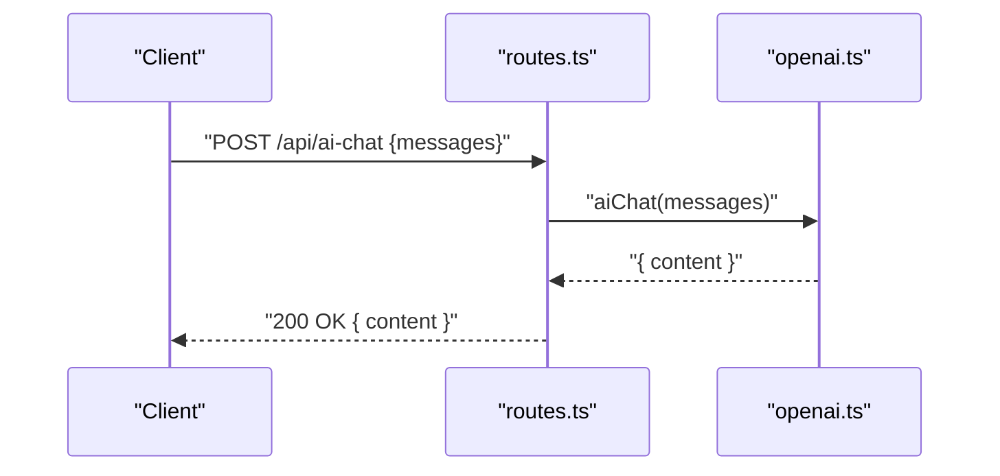
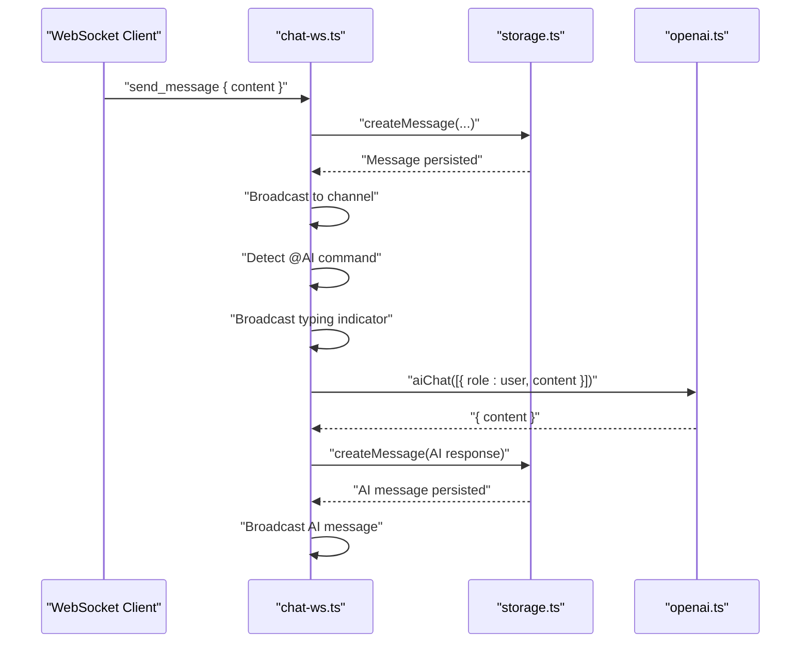
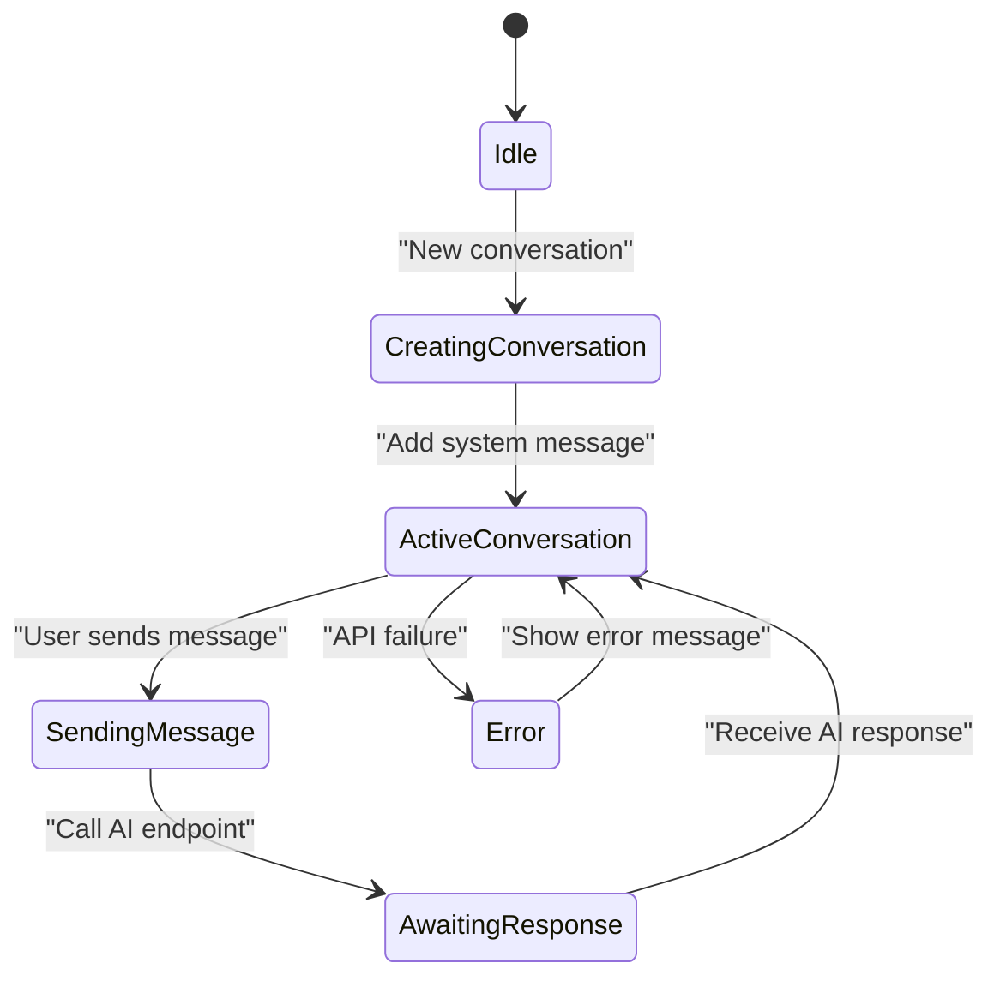
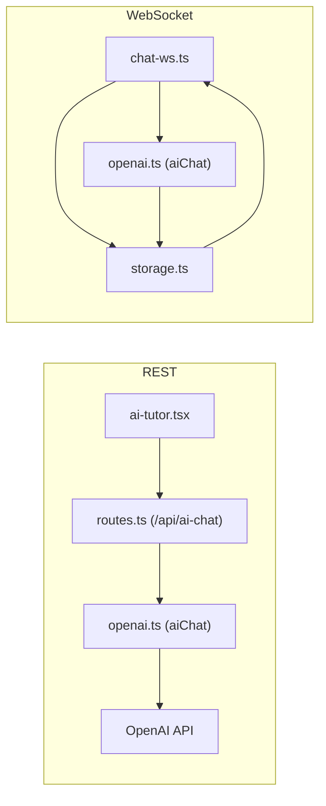
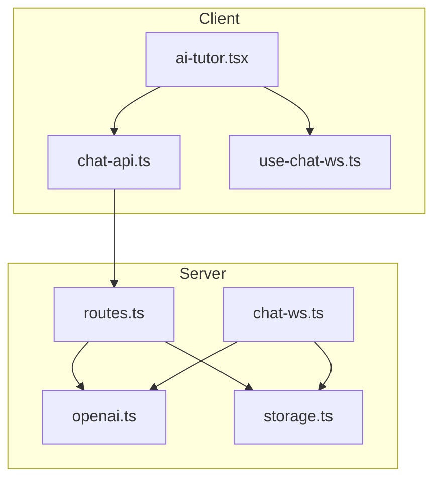

# AI Tutor System

<cite>
**Referenced Files in This Document**
- [ai-tutor.tsx](file://client/src/pages/ai-tutor.tsx)
- [openai.ts](file://server/lib/openai.ts)
- [chat-ws.ts](file://server/chat-ws.ts)
- [chat-api.ts](file://client/src/lib/chat-api.ts)
- [routes.ts](file://server/routes.ts)
- [index.ts](file://server/index.ts)
- [use-chat-ws.ts](file://client/src/hooks/use-chat-ws.ts)
- [storage.ts](file://server/storage.ts)
- [.env.example](file://.env.example)
- [README.md](file://README.md)
</cite>

## Table of Contents
1. [Introduction](#introduction)
2. [Project Structure](#project-structure)
3. [Core Components](#core-components)
4. [Architecture Overview](#architecture-overview)
5. [Detailed Component Analysis](#detailed-component-analysis)
6. [Dependency Analysis](#dependency-analysis)
7. [Performance Considerations](#performance-considerations)
8. [Troubleshooting Guide](#troubleshooting-guide)
9. [Conclusion](#conclusion)

## Introduction
This document explains the AI tutor system implementation, focusing on the OpenAI integration for intelligent tutoring, chat message handling, conversation context management, and response generation. It covers system prompt engineering for high school-level explanations across STEM subjects, message flow architecture, error handling strategies, fallback mechanisms, practical examples of tutor interactions, subject-specific response patterns, conversation state management, performance optimization, rate limiting considerations, and cost management for AI API usage.

## Project Structure
The AI tutor system spans the client and server layers:
- Client-side React components manage the chat UI, conversation history persistence, and API communication.
- Server-side Express routes expose REST endpoints and WebSocket servers for real-time chat and AI integration.
- OpenAI integration encapsulates model selection, prompt engineering, and response parsing with robust error handling and fallbacks.

**Diagram sources**
- [ai-tutor.tsx](file://client/src/pages/ai-tutor.tsx#L1-L604)
- [chat-api.ts](file://client/src/lib/chat-api.ts#L1-L112)
- [use-chat-ws.ts](file://client/src/hooks/use-chat-ws.ts#L1-L218)
- [index.ts](file://server/index.ts#L1-L114)
- [routes.ts](file://server/routes.ts#L1-L800)
- [openai.ts](file://server/lib/openai.ts#L1-L217)
- [chat-ws.ts](file://server/chat-ws.ts#L1-L393)
- [storage.ts](file://server/storage.ts#L1-L200)

**Section sources**
- [README.md](file://README.md#L1-L148)
- [index.ts](file://server/index.ts#L1-L114)

## Core Components
- AI Tutor UI: Manages conversation creation, message composition, local persistence, and API requests.
- OpenAI Integration: Provides chat completions, evaluation, study plan generation, and performance analysis with system prompts and JSON response parsing.
- REST Routes: Exposes endpoints for AI chat, authentication, and chat message persistence.
- WebSocket Chat: Handles real-time chat events, rate limiting, and AI tutor responses triggered by commands.
- Storage Layer: Provides user, channel, and message operations used by both REST and WebSocket flows.

**Section sources**
- [ai-tutor.tsx](file://client/src/pages/ai-tutor.tsx#L1-L604)
- [openai.ts](file://server/lib/openai.ts#L1-L217)
- [routes.ts](file://server/routes.ts#L561-L580)
- [chat-ws.ts](file://server/chat-ws.ts#L119-L393)
- [storage.ts](file://server/storage.ts#L1-L200)

## Architecture Overview
The AI tutor integrates REST and WebSocket pathways:
- REST path: Client sends messages to the AI chat endpoint; server invokes OpenAI and returns the response.
- WebSocket path: Real-time chat supports presence, typing indicators, and AI responses triggered by special commands.

**Diagram sources**
- [ai-tutor.tsx](file://client/src/pages/ai-tutor.tsx#L122-L191)
- [routes.ts](file://server/routes.ts#L561-L580)
- [openai.ts](file://server/lib/openai.ts#L20-L42)

## Detailed Component Analysis

### AI Tutor UI (Client)
Responsibilities:
- Maintains conversation state in localStorage.
- Constructs message arrays for the AI chat endpoint.
- Handles loading states and error fallbacks.
- Uses a system prompt to prime the AI’s behavior.

Key behaviors:
- Conversation lifecycle: create, update, persist.
- Message composition: append user messages, call API, append assistant responses.
- Error handling: display a friendly error message on failures.
- Subject-specific patterns: rely on the system prompt to guide explanations.

**Diagram sources**
- [ai-tutor.tsx](file://client/src/pages/ai-tutor.tsx#L122-L191)

**Section sources**
- [ai-tutor.tsx](file://client/src/pages/ai-tutor.tsx#L50-L191)

### OpenAI Integration (Server)
Responsibilities:
- Ensures a system message is present before invoking the model.
- Calls the OpenAI chat completion API with the configured model.
- Parses and validates JSON responses for specialized tasks (evaluation, study plan, performance analysis).
- Implements fallbacks and sanitization for robustness.

System prompt engineering:
- Targets high school-level STEM explanations.
- Encourages step-by-step math solutions and supportive tone.
- Ensures clarity and conciseness while including examples when helpful.

**Diagram sources**
- [openai.ts](file://server/lib/openai.ts#L20-L42)

**Section sources**
- [openai.ts](file://server/lib/openai.ts#L1-L217)

### REST Routes (Server)
Responsibilities:
- Validates request bodies and session context.
- Delegates AI chat to the OpenAI integration module.
- Returns standardized JSON responses with appropriate HTTP status codes.

Endpoints relevant to AI tutor:
- POST /api/ai-chat: Accepts an array of messages and returns the AI’s response.

**Diagram sources**
- [routes.ts](file://server/routes.ts#L561-L580)
- [openai.ts](file://server/lib/openai.ts#L20-L42)

**Section sources**
- [routes.ts](file://server/routes.ts#L561-L580)

### WebSocket Chat (Server)
Responsibilities:
- Authenticates clients via session cookies.
- Manages subscriptions to channels and broadcasts messages.
- Implements rate limiting for message throughput.
- Triggers AI responses when a special command is detected.

Command handling:
- Detects @AI command variants and responds with a typed indicator, then calls the AI chat function and broadcasts the AI’s reply.

**Diagram sources**
- [chat-ws.ts](file://server/chat-ws.ts#L248-L334)
- [openai.ts](file://server/lib/openai.ts#L20-L42)
- [storage.ts](file://server/storage.ts#L97-L106)

**Section sources**
- [chat-ws.ts](file://server/chat-ws.ts#L119-L393)

### Conversation State Management
Client-side:
- Conversations are stored in localStorage with timestamps and message arrays.
- The active conversation is tracked and updated after each message exchange.
- Titles are auto-generated from the first user message after the initial system message.

Server-side:
- Channels and messages are persisted via the storage layer.
- WebSocket subscriptions maintain channel membership and presence.

**Diagram sources**
- [ai-tutor.tsx](file://client/src/pages/ai-tutor.tsx#L96-L191)
- [chat-ws.ts](file://server/chat-ws.ts#L248-L334)

**Section sources**
- [ai-tutor.tsx](file://client/src/pages/ai-tutor.tsx#L66-L191)
- [storage.ts](file://server/storage.ts#L97-L106)

### Practical Examples of Tutor Interactions
- Physics concept explanation: The system prompt directs the AI to explain concepts clearly and include examples suitable for high school students.
- Math problem solving: The AI is instructed to show step-by-step solutions for math problems.
- Chemistry reactions: The AI provides balanced equations and explains reaction mechanisms with appropriate terminology.
- Biology processes: The AI explains cellular processes and molecular interactions with analogies and diagrams where helpful.

These patterns emerge from the system prompt and are reinforced by the AI’s JSON response parsing for evaluation tasks.

**Section sources**
- [openai.ts](file://server/lib/openai.ts#L20-L42)
- [openai.ts](file://server/lib/openai.ts#L50-L105)

### Message Flow Architecture
- REST flow: Client → routes.ts → openai.ts → OpenAI API → response back to client.
- WebSocket flow: Client → chat-ws.ts → storage.ts → broadcast to channel → openai.ts → storage.ts → broadcast AI response.

**Diagram sources**
- [routes.ts](file://server/routes.ts#L561-L580)
- [openai.ts](file://server/lib/openai.ts#L20-L42)
- [chat-ws.ts](file://server/chat-ws.ts#L248-L334)
- [storage.ts](file://server/storage.ts#L97-L106)

**Section sources**
- [routes.ts](file://server/routes.ts#L561-L580)
- [chat-ws.ts](file://server/chat-ws.ts#L119-L393)

## Dependency Analysis
- Client depends on:
  - REST API for chat responses.
  - WebSocket for real-time chat and typing indicators.
- Server depends on:
  - OpenAI SDK for model inference.
  - Storage layer for persistence.
  - Session store for authentication.

**Diagram sources**
- [ai-tutor.tsx](file://client/src/pages/ai-tutor.tsx#L1-L604)
- [chat-api.ts](file://client/src/lib/chat-api.ts#L1-L112)
- [use-chat-ws.ts](file://client/src/hooks/use-chat-ws.ts#L1-L218)
- [routes.ts](file://server/routes.ts#L561-L580)
- [openai.ts](file://server/lib/openai.ts#L1-L217)
- [chat-ws.ts](file://server/chat-ws.ts#L119-L393)
- [storage.ts](file://server/storage.ts#L1-L200)

**Section sources**
- [index.ts](file://server/index.ts#L1-L114)
- [routes.ts](file://server/routes.ts#L1-L800)

## Performance Considerations
- Model selection: The integration targets a modern model optimized for speed and quality.
- Rate limiting: WebSocket chat enforces a token-based rate limiter to prevent spamming.
- Caching: Client-side localStorage reduces repeated network calls for conversation history.
- Error handling: Robust fallbacks ensure the UI remains responsive during AI service failures.
- Cost management:
  - Use the smallest model capable of meeting quality goals.
  - Batch requests where feasible.
  - Monitor token usage and set quotas.
  - Consider caching frequent prompts and responses.

[No sources needed since this section provides general guidance]

## Troubleshooting Guide
Common issues and resolutions:
- Missing OpenAI API key:
  - Symptom: AI features disabled with warnings.
  - Resolution: Set OPENAI_API_KEY in environment variables.
- Unauthorized WebSocket connections:
  - Symptom: Immediate disconnection with unauthorized error.
  - Resolution: Ensure session cookie is present and valid.
- Rate limit exceeded:
  - Symptom: Error indicating the user is sending messages too fast.
  - Resolution: Wait for refill period or reduce message frequency.
- JSON parsing errors:
  - Symptom: Evaluation and plan generation may fall back to defaults.
  - Resolution: Verify system prompts and response formats; check server logs.

**Section sources**
- [.env.example](file://.env.example#L16-L19)
- [openai.ts](file://server/lib/openai.ts#L38-L42)
- [openai.ts](file://server/lib/openai.ts#L88-L104)
- [openai.ts](file://server/lib/openai.ts#L139-L162)
- [openai.ts](file://server/lib/openai.ts#L200-L215)
- [chat-ws.ts](file://server/chat-ws.ts#L262-L273)

## Conclusion
The AI tutor system combines a user-friendly React interface with robust server-side OpenAI integration and real-time chat capabilities. The system prompt ensures high school-level, STEM-focused explanations, while error handling and fallbacks maintain reliability. Rate limiting and careful model selection contribute to performance and cost control. Together, these components deliver an adaptive, supportive learning experience.