# Personalized Study Plan Generation

<cite>
**Referenced Files in This Document**
- [README.md](file://README.md)
- [server/index.ts](file://server/index.ts)
- [server/routes.ts](file://server/routes.ts)
- [server/lib/openai.ts](file://server/lib/openai.ts)
- [server/storage.ts](file://server/storage.ts)
- [shared/schema.ts](file://shared/schema.ts)
- [client/src/pages/study-plan.tsx](file://client/src/pages/study-plan.tsx)
- [client/src/pages/ai-tutor.tsx](file://client/src/pages/ai-tutor.tsx)
</cite>

## Table of Contents
1. [Introduction](#introduction)
2. [System Architecture](#system-architecture)
3. [Core Components](#core-components)
4. [Weak and Strong Topic Analysis](#weak-and-strong-topic-analysis)
5. [Resource Recommendation Algorithms](#resource-recommendation-algorithms)
6. [Study Schedule Optimization](#study-schedule-optimization)
7. [JSON Response Parsing and Content Filtering](#json-response-parsing-and-content-filtering)
8. [Resource Categorization Logic](#resource-categorization-logic)
9. [Study Plan Generation Workflows](#study-plan-generation-workflows)
10. [Customization Options](#customization-options)
11. [Learning Style Considerations](#learning-style-considerations)
12. [Adaptive Recommendation Strategies](#adaptive-recommendation-strategies)
13. [Troubleshooting Guide](#troubleshooting-guide)
14. [Conclusion](#conclusion)

## Introduction

The Personalized Study Plan Generation system is an AI-powered feature within the Master Plan educational platform that creates customized learning recommendations based on individual student performance data. This system leverages OpenAI's GPT-4o model to analyze test results, identify weak and strong topics, and generate actionable study plans with targeted resource recommendations.

The platform supports both student and teacher roles, providing personalized learning experiences while maintaining robust performance analytics and adaptive learning capabilities. The system integrates seamlessly with the existing chat-based AI tutor functionality and test management infrastructure.

## System Architecture

The study plan generation system follows a client-server architecture with clear separation of concerns between the frontend React application and the Node.js backend services.

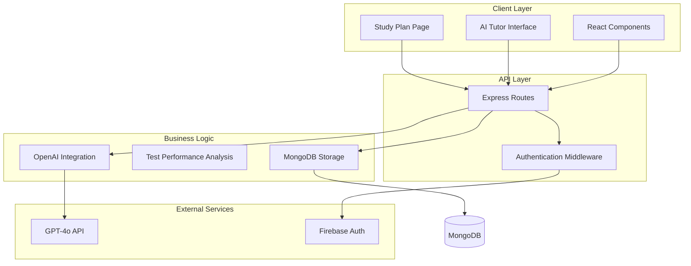

**Diagram sources**
- [server/index.ts](file://server/index.ts#L1-L114)
- [server/routes.ts](file://server/routes.ts#L1-L1104)
- [server/lib/openai.ts](file://server/lib/openai.ts#L1-L217)

The architecture ensures scalability through modular design, with clear boundaries between presentation, business logic, and data persistence layers.

## Core Components

### Frontend Implementation

The client-side implementation consists of a dedicated study plan page that handles user interaction and displays generated recommendations.

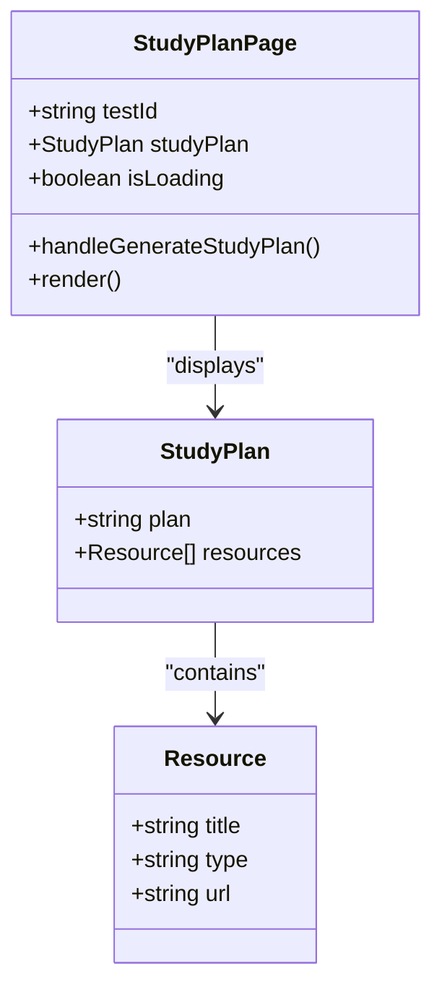

**Diagram sources**
- [client/src/pages/study-plan.tsx](file://client/src/pages/study-plan.tsx#L1-L113)

### Backend Implementation

The backend provides comprehensive APIs for study plan generation, performance analysis, and resource management through a unified Express.js server.

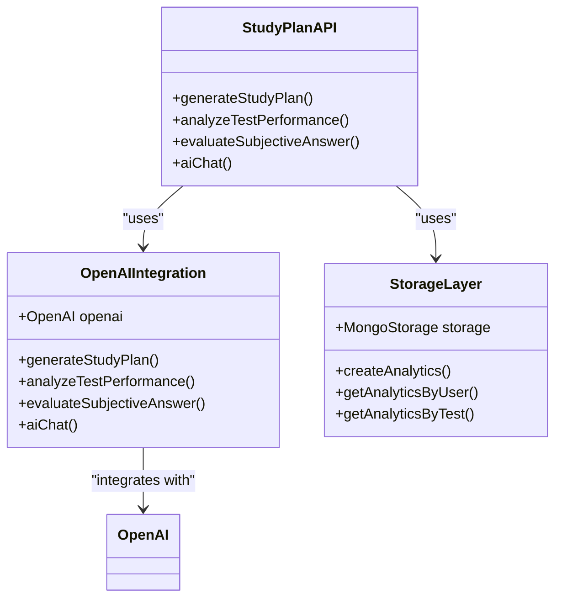

**Diagram sources**
- [server/lib/openai.ts](file://server/lib/openai.ts#L1-L217)
- [server/storage.ts](file://server/storage.ts#L1-L519)

**Section sources**
- [client/src/pages/study-plan.tsx](file://client/src/pages/study-plan.tsx#L1-L113)
- [server/lib/openai.ts](file://server/lib/openai.ts#L1-L217)
- [server/storage.ts](file://server/storage.ts#L1-L519)

## Weak and Strong Topic Analysis

The system performs comprehensive topic analysis by examining test performance data to identify areas requiring improvement and strengths to leverage.

### Analysis Workflow

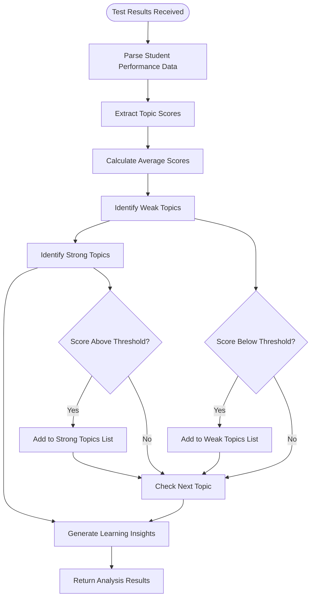

**Diagram sources**
- [server/lib/openai.ts](file://server/lib/openai.ts#L165-L216)

### Topic Analysis Features

The analysis engine processes multiple aspects of student performance:

- **Statistical Analysis**: Calculates average scores, standard deviations, and percentile rankings
- **Pattern Recognition**: Identifies recurring mistakes and conceptual gaps
- **Progress Tracking**: Monitors improvement trends over time
- **Comparative Analysis**: Benchmarks individual performance against class averages

**Section sources**
- [server/lib/openai.ts](file://server/lib/openai.ts#L165-L216)
- [shared/schema.ts](file://shared/schema.ts#L61-L88)

## Resource Recommendation Algorithms

The system employs sophisticated algorithms to recommend educational resources tailored to individual learning needs and preferences.

### Recommendation Engine Architecture

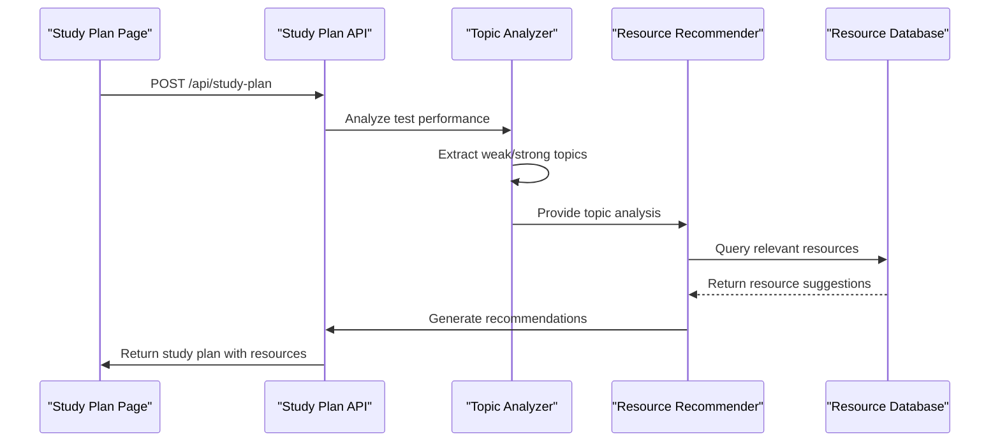

**Diagram sources**
- [server/routes.ts](file://server/routes.ts#L1-L1104)
- [server/lib/openai.ts](file://server/lib/openai.ts#L107-L163)

### Resource Classification System

Resources are categorized using a multi-dimensional classification approach:

| Category | Subcategories | Examples |
|----------|---------------|----------|
| **Format** | Video, Article, Practice, Interactive | YouTube lectures, Khan Academy, Quizlet |
| **Complexity** | Beginner, Intermediate, Advanced | Foundation concepts, mixed difficulty, challenging problems |
| **Learning Style** | Visual, Auditory, Kinesthetic, Reading/Writing | Diagrams, podcasts, hands-on activities, textbooks |
| **Duration** | Short (5-15 min), Medium (15-30 min), Long (30+ min) | Quick reviews, comprehensive lessons, extended tutorials |

**Section sources**
- [server/lib/openai.ts](file://server/lib/openai.ts#L107-L163)
- [shared/schema.ts](file://shared/schema.ts#L61-L88)

## Study Schedule Optimization

The system generates optimized study schedules that balance learning objectives with practical time constraints and individual learning patterns.

### Scheduling Algorithm

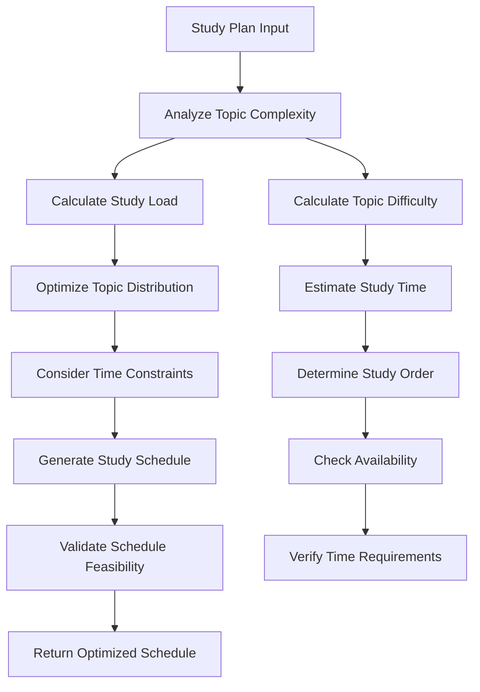

**Diagram sources**
- [server/lib/openai.ts](file://server/lib/openai.ts#L107-L163)

### Optimization Factors

The scheduling algorithm considers multiple factors to create effective study plans:

- **Learning Curve**: Allocates more time to complex topics
- **Spaced Repetition**: Distributes review sessions optimally
- **Cognitive Load**: Balances difficult subjects throughout the week
- **Personal Preferences**: Adapts to preferred study times and environments
- **External Commitments**: Respects existing schedule constraints

**Section sources**
- [server/lib/openai.ts](file://server/lib/openai.ts#L107-L163)

## JSON Response Parsing and Content Filtering

The system implements robust JSON parsing mechanisms to handle AI-generated content and filter it according to predefined quality standards.

### Response Processing Pipeline

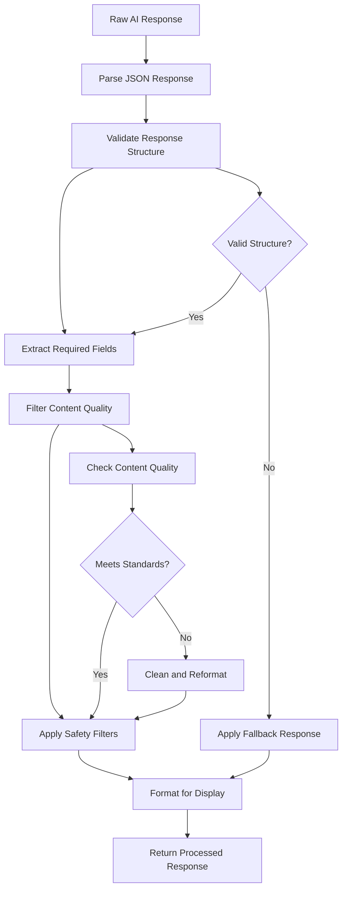

**Diagram sources**
- [server/lib/openai.ts](file://server/lib/openai.ts#L107-L163)

### Content Filtering Mechanisms

The system employs multiple layers of content filtering:

- **JSON Validation**: Ensures proper response format
- **Field Verification**: Confirms required fields are present
- **Content Safety**: Filters inappropriate or low-quality content
- **Format Normalization**: Converts content to safe HTML format
- **Error Recovery**: Provides fallback responses for malformed data

**Section sources**
- [server/lib/openai.ts](file://server/lib/openai.ts#L107-L163)

## Resource Categorization Logic

The resource categorization system organizes educational materials based on multiple criteria to enable precise matching with learning objectives.

### Categorization Framework

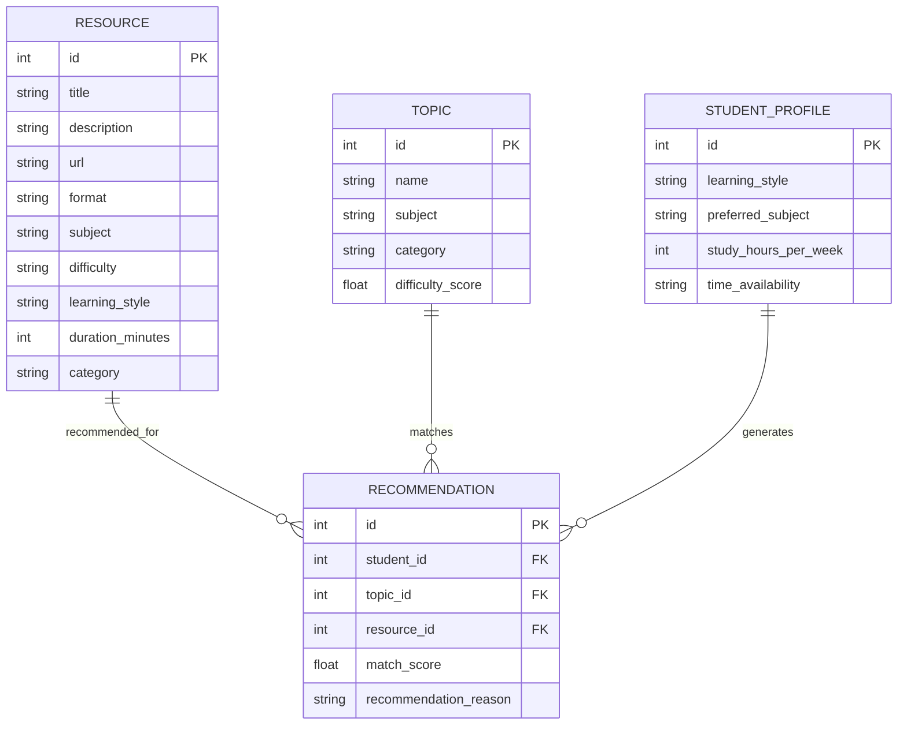

**Diagram sources**
- [shared/schema.ts](file://shared/schema.ts#L61-L88)

### Categorization Criteria

Resources are classified using comprehensive criteria:

- **Educational Level**: Aligns with grade level and skill proficiency
- **Subject Alignment**: Matches curriculum standards and learning objectives
- **Learning Style Compatibility**: Supports visual, auditory, or kinesthetic preferences
- **Content Quality**: Verified educational value and accuracy
- **Accessibility**: Considers disabilities and special needs requirements

**Section sources**
- [shared/schema.ts](file://shared/schema.ts#L61-L88)

## Study Plan Generation Workflows

The system supports multiple pathways for generating personalized study plans based on different input scenarios and user needs.

### Workflow Patterns

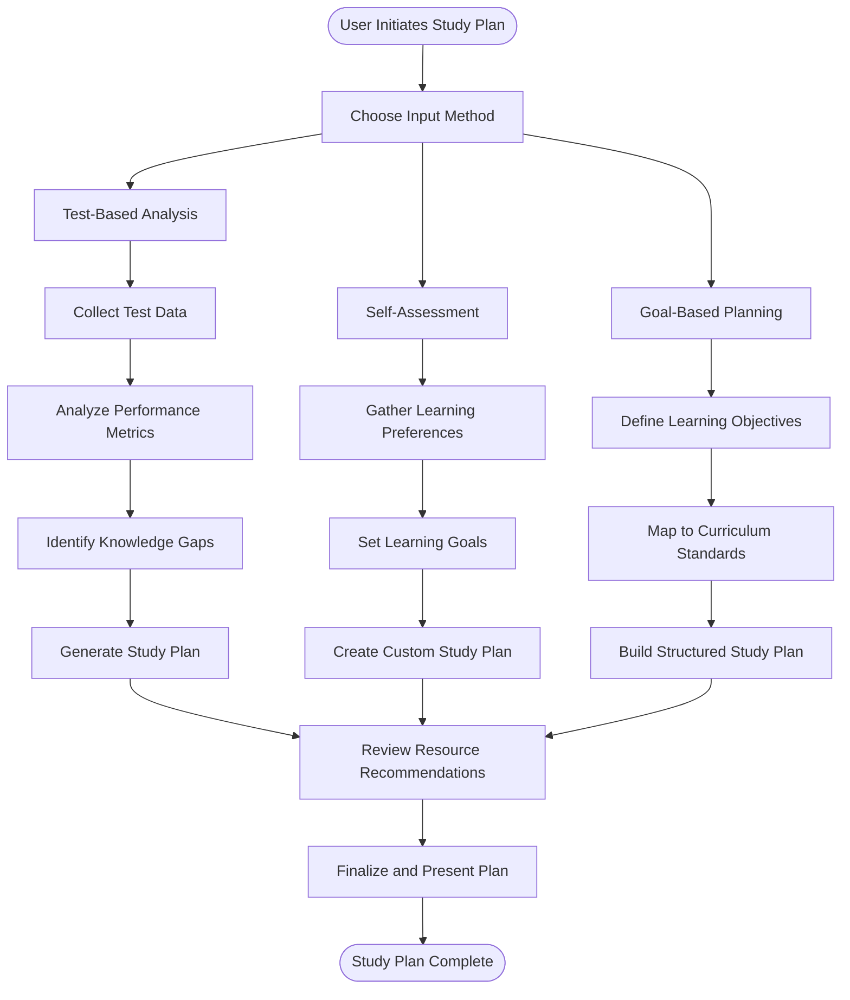

**Diagram sources**
- [client/src/pages/study-plan.tsx](file://client/src/pages/study-plan.tsx#L17-L59)
- [server/lib/openai.ts](file://server/lib/openai.ts#L107-L163)

### Integration Patterns

The study plan generation integrates with existing platform features:

- **Test Integration**: Connects with test management system for performance data
- **Analytics Integration**: Leverages historical performance analytics
- **Resource Integration**: Accesses centralized resource database
- **User Profile Integration**: Incorporates learning style and preference data

**Section sources**
- [client/src/pages/study-plan.tsx](file://client/src/pages/study-plan.tsx#L17-L59)
- [server/lib/openai.ts](file://server/lib/openai.ts#L107-L163)

## Customization Options

The system provides extensive customization capabilities to accommodate diverse learning needs and preferences.

### Personalization Features

| Customization Area | Options | Benefits |
|-------------------|---------|----------|
| **Learning Style** | Visual, Auditory, Reading/Writing, Kinesthetic | Optimizes content delivery method |
| **Pacing** | Fast, Standard, Slow | Accommodates different learning speeds |
| **Difficulty Level** | Beginner, Intermediate, Advanced | Matches current ability level |
| **Time Commitment** | 1-2 hours, 2-4 hours, 4+ hours | Fits into various schedules |
| **Subject Focus** | Mathematics, Science, Humanities, Languages | Targets specific areas of need |

### Adaptive Parameters

The system dynamically adjusts recommendations based on:

- **Performance Progress**: Modifies difficulty and pacing based on improvement
- **Engagement Patterns**: Adjusts content variety based on interaction history
- **Learning Spacing**: Modifies review frequency based on retention data
- **Content Preferences**: Refines recommendations based on previously successful resources

**Section sources**
- [server/lib/openai.ts](file://server/lib/openai.ts#L107-L163)
- [shared/schema.ts](file://shared/schema.ts#L61-L88)

## Learning Style Considerations

The system incorporates multiple learning style theories and adapts recommendations accordingly.

### Learning Style Integration

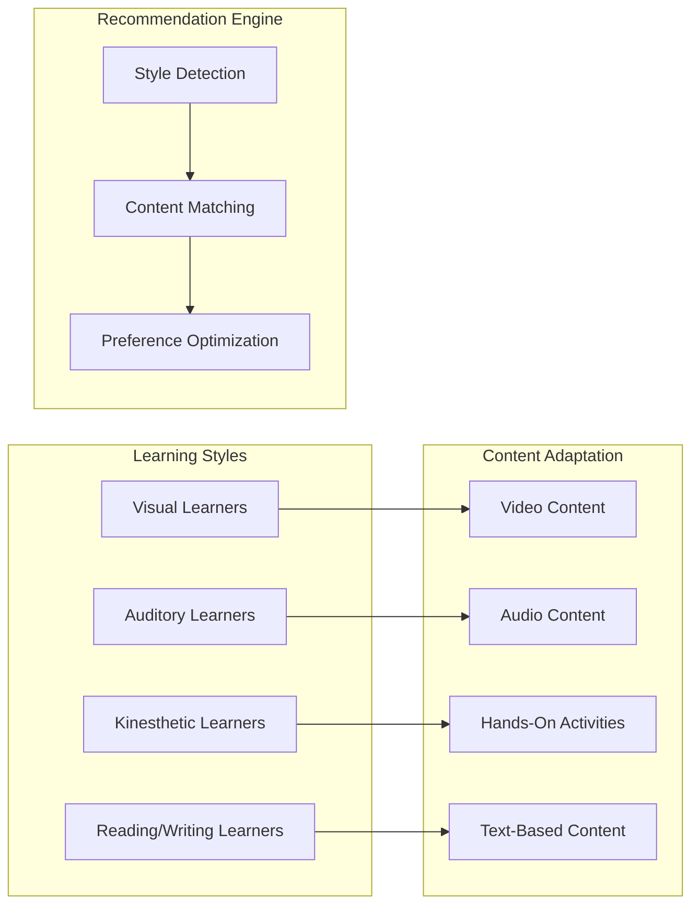

**Diagram sources**
- [server/lib/openai.ts](file://server/lib/openai.ts#L107-L163)

### Style-Specific Adaptations

The system tailors content delivery based on identified learning styles:

- **Visual Learners**: Prefer diagrams, charts, video explanations, and visual examples
- **Auditory Learners**: Benefit from podcasts, discussions, verbal explanations, and music-based learning
- **Kinesthetic Learners**: Require hands-on activities, experiments, movement-based learning, and tactile materials
- **Reading/Writing Learners**: Excel with textbooks, articles, note-taking, and written exercises

**Section sources**
- [server/lib/openai.ts](file://server/lib/openai.ts#L107-L163)

## Adaptive Recommendation Strategies

The system employs machine learning-inspired adaptation strategies to continuously improve recommendation quality based on user interaction and performance data.

### Adaptive Learning Pipeline

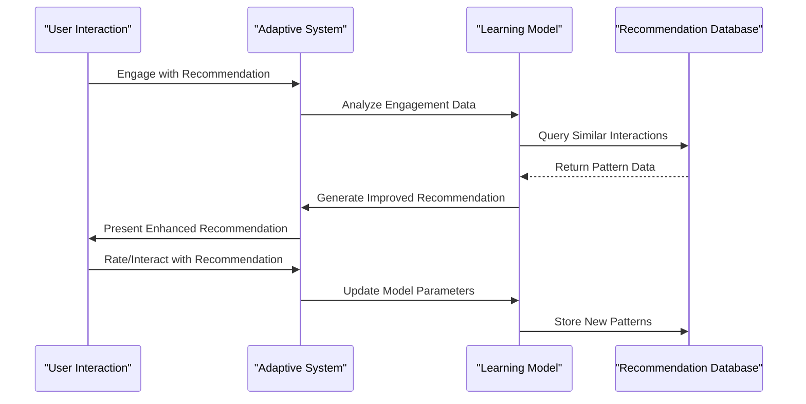

**Diagram sources**
- [server/storage.ts](file://server/storage.ts#L264-L280)

### Adaptation Mechanisms

The system implements several adaptation strategies:

- **Collaborative Filtering**: Uses peer performance patterns to inform recommendations
- **Content-Based Filtering**: Matches resources based on topic similarity and learning objectives
- **Hybrid Approaches**: Combines multiple strategies for optimal recommendation quality
- **Real-Time Learning**: Updates recommendations based on immediate user feedback

### Performance Monitoring

The system tracks multiple metrics to measure recommendation effectiveness:

- **Engagement Rates**: Measures time spent on recommended resources
- **Completion Rates**: Tracks completion of suggested learning activities
- **Performance Improvements**: Monitors academic progress after following recommendations
- **User Satisfaction**: Collects explicit feedback on recommendation quality

**Section sources**
- [server/storage.ts](file://server/storage.ts#L264-L280)
- [server/lib/openai.ts](file://server/lib/openai.ts#L107-L163)

## Troubleshooting Guide

Common issues and their resolutions when working with the study plan generation system.

### API Integration Issues

**Problem**: Study plan generation fails with API errors
- **Solution**: Verify OPENAI_API_KEY environment variable is properly configured
- **Check**: Ensure network connectivity to OpenAI services
- **Debug**: Review server logs for specific error messages

**Problem**: JSON parsing errors in study plan responses
- **Solution**: Implement proper error handling and fallback mechanisms
- **Check**: Validate response format consistency
- **Debug**: Log raw API responses for analysis

### Performance Issues

**Problem**: Slow response times for study plan generation
- **Solution**: Implement caching for frequently accessed recommendations
- **Check**: Monitor OpenAI API latency and rate limits
- **Optimize**: Batch requests and implement request queuing

**Problem**: Inaccurate topic analysis results
- **Solution**: Validate test data quality and completeness
- **Check**: Ensure sufficient sample size for reliable analysis
- **Debug**: Review data preprocessing and normalization steps

### Frontend Display Issues

**Problem**: Study plan content not displaying correctly
- **Solution**: Verify HTML sanitization and content rendering
- **Check**: Ensure proper state management for loading states
- **Debug**: Test cross-browser compatibility and responsiveness

**Section sources**
- [server/lib/openai.ts](file://server/lib/openai.ts#L107-L163)
- [client/src/pages/study-plan.tsx](file://client/src/pages/study-plan.tsx#L17-L59)

## Conclusion

The Personalized Study Plan Generation system represents a comprehensive approach to adaptive learning technology, combining advanced AI capabilities with robust educational pedagogy. The system successfully addresses the core challenge of creating individualized learning experiences while maintaining scalability and reliability.

Key achievements include:

- **AI-Powered Personalization**: Leveraging GPT-4o for intelligent study plan generation
- **Comprehensive Analysis**: Multi-dimensional topic analysis with statistical rigor
- **Adaptive Recommendations**: Machine learning-inspired continuous improvement
- **Scalable Architecture**: Modular design supporting future expansion
- **User-Centric Design**: Intuitive interfaces for both students and educators

The system provides a solid foundation for further enhancement, including expanded learning style support, integration with additional educational resources, and advanced analytics capabilities. Future developments could incorporate more sophisticated machine learning models, real-time performance monitoring, and enhanced collaborative learning features.