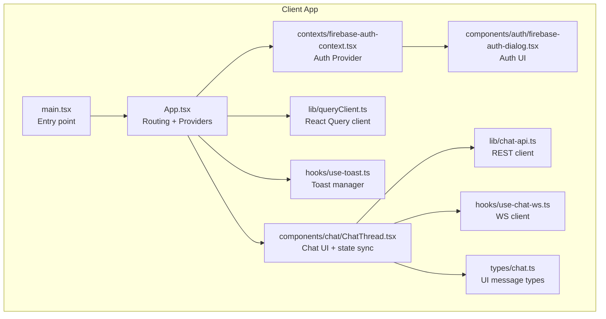
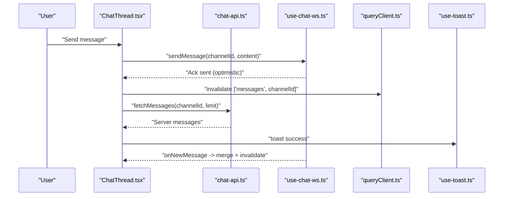
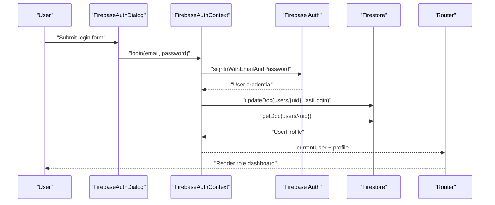
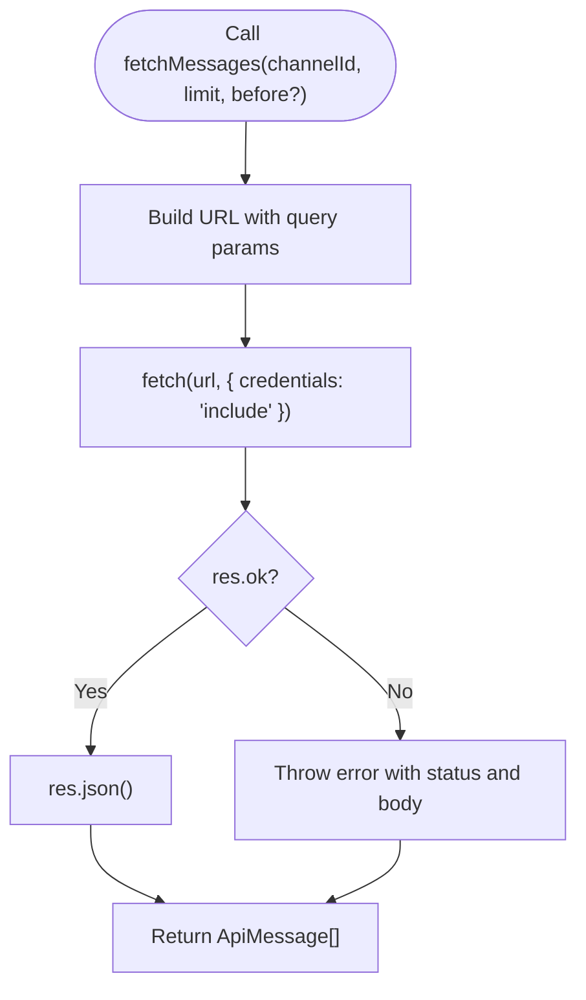
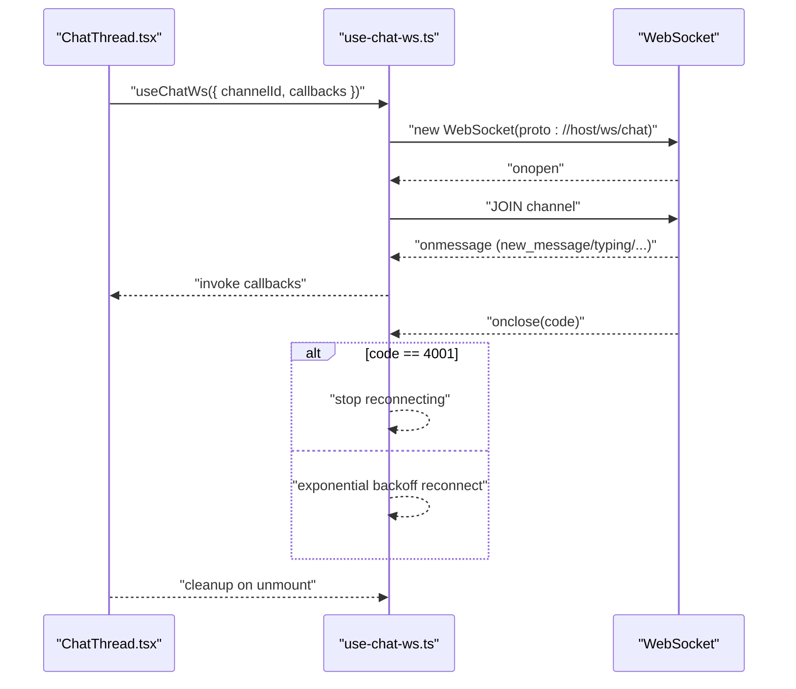
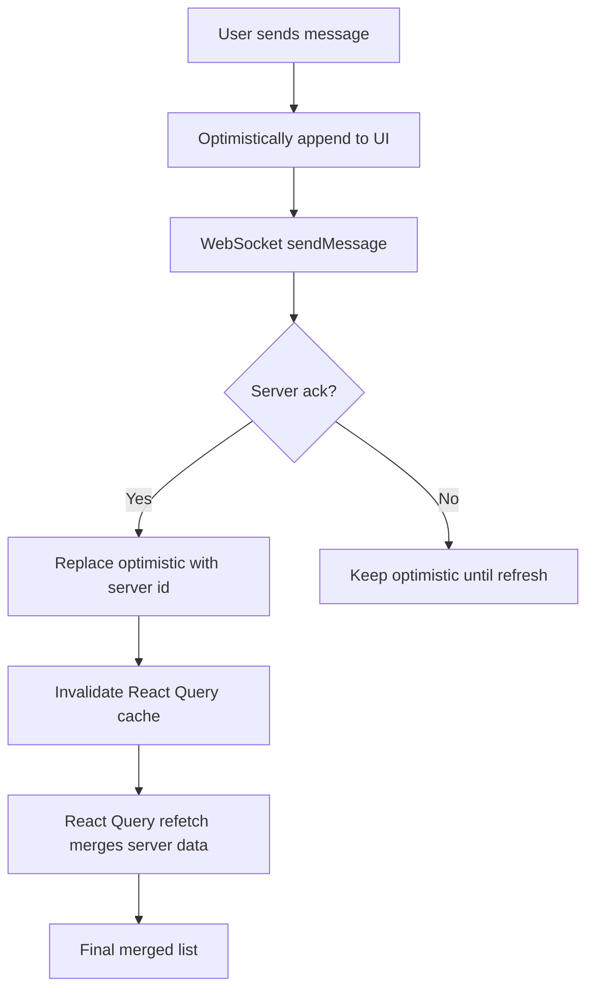
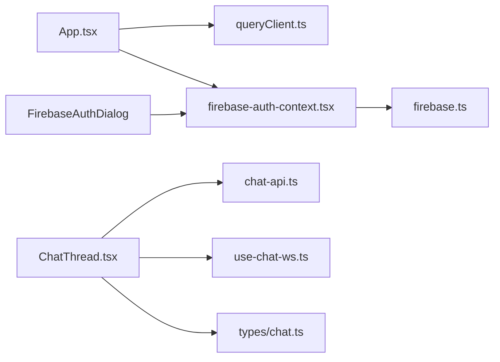

# Client-Side Integration

<cite>
**Referenced Files in This Document**
- [README.md](file://README.md)
- [LOCAL_SETUP.md](file://LOCAL_SETUP.md)
- [client/src/main.tsx](file://client/src/main.tsx)
- [client/src/App.tsx](file://client/src/App.tsx)
- [client/src/contexts/firebase-auth-context.tsx](file://client/src/contexts/firebase-auth-context.tsx)
- [client/src/lib/firebase.ts](file://client/src/lib/firebase.ts)
- [client/src/components/auth/firebase-auth-dialog.tsx](file://client/src/components/auth/firebase-auth-dialog.tsx)
- [client/src/lib/chat-api.ts](file://client/src/lib/chat-api.ts)
- [client/src/hooks/use-chat-ws.ts](file://client/src/hooks/use-chat-ws.ts)
- [client/src/lib/queryClient.ts](file://client/src/lib/queryClient.ts)
- [client/src/hooks/use-toast.ts](file://client/src/hooks/use-toast.ts)
- [client/src/types/chat.ts](file://client/src/types/chat.ts)
- [client/src/components/chat/ChatThread.tsx](file://client/src/components/chat/ChatThread.tsx)
- [client/src/pages/LoginPage.tsx](file://client/src/pages/LoginPage.tsx)
</cite>

## Table of Contents
1. [Introduction](#introduction)
2. [Project Structure](#project-structure)
3. [Core Components](#core-components)
4. [Architecture Overview](#architecture-overview)
5. [Detailed Component Analysis](#detailed-component-analysis)
6. [Dependency Analysis](#dependency-analysis)
7. [Performance Considerations](#performance-considerations)
8. [Troubleshooting Guide](#troubleshooting-guide)
9. [Conclusion](#conclusion)
10. [Appendices](#appendices)

## Introduction
This document provides client-side integration guidance for consuming PersonalLearningPro’s APIs, integrating Firebase authentication, managing WebSocket connections for real-time chat, and synchronizing state across components. It covers REST API client patterns, authentication flows, WebSocket client lifecycle, state synchronization strategies, error handling, loading states, caching, and best practices for building robust UI integrations.

## Project Structure
The client is a React application built with Vite. Key areas for integration:
- Authentication: Firebase integration and context provider
- API clients: REST client for messaging and a React Query client
- Real-time: WebSocket hook for chat
- UI: Pages, dialogs, and components that consume these APIs and sockets
- Routing and layout: Role-aware routing and layout wrappers

**Diagram sources**
- [client/src/main.tsx](file://client/src/main.tsx#L1-L8)
- [client/src/App.tsx](file://client/src/App.tsx#L1-L165)
- [client/src/contexts/firebase-auth-context.tsx](file://client/src/contexts/firebase-auth-context.tsx#L1-L267)
- [client/src/components/auth/firebase-auth-dialog.tsx](file://client/src/components/auth/firebase-auth-dialog.tsx#L1-L500)
- [client/src/lib/chat-api.ts](file://client/src/lib/chat-api.ts#L1-L112)
- [client/src/hooks/use-chat-ws.ts](file://client/src/hooks/use-chat-ws.ts#L1-L218)
- [client/src/lib/queryClient.ts](file://client/src/lib/queryClient.ts#L1-L62)
- [client/src/hooks/use-toast.ts](file://client/src/hooks/use-toast.ts#L1-L192)
- [client/src/types/chat.ts](file://client/src/types/chat.ts#L1-L83)
- [client/src/components/chat/ChatThread.tsx](file://client/src/components/chat/ChatThread.tsx#L1-L376)

**Section sources**
- [README.md](file://README.md#L70-L102)
- [client/src/main.tsx](file://client/src/main.tsx#L1-L8)
- [client/src/App.tsx](file://client/src/App.tsx#L1-L165)

## Core Components
- Firebase Auth integration: initialization, user state tracking, login/register flows, and profile retrieval
- REST API client: typed endpoints for workspaces, channels, DMs, messages, and uploads
- WebSocket client: connection management, event handling, and message queuing
- React Query client: standardized request/response handling and caching behavior
- Toast notifications: centralized feedback for user actions
- Chat thread UI: integrates REST and WebSocket, manages optimistic updates and pagination

**Section sources**
- [client/src/lib/firebase.ts](file://client/src/lib/firebase.ts#L1-L212)
- [client/src/contexts/firebase-auth-context.tsx](file://client/src/contexts/firebase-auth-context.tsx#L1-L267)
- [client/src/lib/chat-api.ts](file://client/src/lib/chat-api.ts#L1-L112)
- [client/src/hooks/use-chat-ws.ts](file://client/src/hooks/use-chat-ws.ts#L1-L218)
- [client/src/lib/queryClient.ts](file://client/src/lib/queryClient.ts#L1-L62)
- [client/src/hooks/use-toast.ts](file://client/src/hooks/use-toast.ts#L1-L192)
- [client/src/components/chat/ChatThread.tsx](file://client/src/components/chat/ChatThread.tsx#L1-L376)

## Architecture Overview
The client composes a role-aware routing layer with authentication, state synchronization, and real-time capabilities:
- Auth state drives routing and UI visibility
- REST endpoints feed initial data and file uploads
- WebSocket events update UI optimistically and invalidate caches
- React Query centralizes caching and error handling
- Toasts provide user feedback for all actions

**Diagram sources**
- [client/src/components/chat/ChatThread.tsx](file://client/src/components/chat/ChatThread.tsx#L69-L119)
- [client/src/lib/chat-api.ts](file://client/src/lib/chat-api.ts#L75-L83)
- [client/src/hooks/use-chat-ws.ts](file://client/src/hooks/use-chat-ws.ts#L199-L214)
- [client/src/lib/queryClient.ts](file://client/src/lib/queryClient.ts#L30-L61)
- [client/src/hooks/use-toast.ts](file://client/src/hooks/use-toast.ts#L142-L169)

## Detailed Component Analysis

### Authentication Integration with Firebase
- Initialization and guards: Firebase initializes only when credentials are present; otherwise, auth features are disabled gracefully
- Auth state management: onAuthStateChanged tracks user presence and fetches profile with a timeout to avoid hanging offline
- Actions: login, register, Google login, password reset, and logout; each emits toast notifications and updates context state
- Role-based UI: router selects dashboard based on profile role

**Diagram sources**
- [client/src/components/auth/firebase-auth-dialog.tsx](file://client/src/components/auth/firebase-auth-dialog.tsx#L98-L104)
- [client/src/contexts/firebase-auth-context.tsx](file://client/src/contexts/firebase-auth-context.tsx#L73-L95)
- [client/src/lib/firebase.ts](file://client/src/lib/firebase.ts#L66-L78)
- [client/src/lib/firebase.ts](file://client/src/lib/firebase.ts#L199-L212)
- [client/src/App.tsx](file://client/src/App.tsx#L113-L124)

**Section sources**
- [client/src/lib/firebase.ts](file://client/src/lib/firebase.ts#L27-L45)
- [client/src/contexts/firebase-auth-context.tsx](file://client/src/contexts/firebase-auth-context.tsx#L43-L71)
- [client/src/components/auth/firebase-auth-dialog.tsx](file://client/src/components/auth/firebase-auth-dialog.tsx#L98-L104)
- [client/src/App.tsx](file://client/src/App.tsx#L93-L124)

### REST API Client Implementation
- Centralized fetch wrapper: includes credentials and parses JSON; throws on non-OK responses
- Endpoints: workspaces, channels, DMs, messages, and file upload
- Usage patterns: pass channel IDs and pagination parameters; handle errors via toast and UI fallbacks

**Diagram sources**
- [client/src/lib/chat-api.ts](file://client/src/lib/chat-api.ts#L44-L55)
- [client/src/lib/chat-api.ts](file://client/src/lib/chat-api.ts#L75-L83)

**Section sources**
- [client/src/lib/chat-api.ts](file://client/src/lib/chat-api.ts#L44-L112)

### WebSocket Client Setup and Management
- Connection lifecycle: builds ws/wss URL from current host, opens socket, joins channel on open
- Event handling: routes incoming events to callbacks; supports new messages, typing, read receipts, presence
- Reconnection: exponential backoff with a cap; stops reconnecting on 4001 (unauthorized)
- Public API: send message, typing, and read receipts; component cleanup closes socket and cancels timers

**Diagram sources**
- [client/src/hooks/use-chat-ws.ts](file://client/src/hooks/use-chat-ws.ts#L95-L162)
- [client/src/hooks/use-chat-ws.ts](file://client/src/hooks/use-chat-ws.ts#L164-L178)
- [client/src/hooks/use-chat-ws.ts](file://client/src/hooks/use-chat-ws.ts#L180-L195)
- [client/src/hooks/use-chat-ws.ts](file://client/src/hooks/use-chat-ws.ts#L199-L214)

**Section sources**
- [client/src/hooks/use-chat-ws.ts](file://client/src/hooks/use-chat-ws.ts#L1-L218)

### State Synchronization Strategies
- Optimistic updates: append outgoing messages immediately; deduplicate on server echo; invalidate queries to refresh
- Pagination: intersection observer triggers older message fetch; prepend to list and update oldest ID
- Read receipts: observe message visibility to mark as read via WebSocket
- Mock fallback: when not a server channel, use mock data for development

**Diagram sources**
- [client/src/components/chat/ChatThread.tsx](file://client/src/components/chat/ChatThread.tsx#L69-L103)
- [client/src/components/chat/ChatThread.tsx](file://client/src/components/chat/ChatThread.tsx#L105-L119)
- [client/src/components/chat/ChatThread.tsx](file://client/src/components/chat/ChatThread.tsx#L127-L133)

**Section sources**
- [client/src/components/chat/ChatThread.tsx](file://client/src/components/chat/ChatThread.tsx#L47-L200)

### Error Handling Patterns and Loading States
- REST errors: non-OK responses throw with status and body; callers should display toasts and fallback UI
- Auth errors: context handlers wrap actions and surface user-friendly messages
- Loading states: auth provider exposes isLoading; LoginPage disables inputs; Router shows spinner while checking auth
- Toasts: centralized toast manager limits concurrent toasts and auto-dismiss

**Section sources**
- [client/src/lib/chat-api.ts](file://client/src/lib/chat-api.ts#L50-L54)
- [client/src/contexts/firebase-auth-context.tsx](file://client/src/contexts/firebase-auth-context.tsx#L73-L95)
- [client/src/App.tsx](file://client/src/App.tsx#L96-L106)
- [client/src/pages/LoginPage.tsx](file://client/src/pages/LoginPage.tsx#L10-L52)
- [client/src/hooks/use-toast.ts](file://client/src/hooks/use-toast.ts#L1-L192)

### Caching Strategies
- React Query defaults: no automatic refetch, staleTime Infinity, retry disabled; centralized 401 handling
- Endpoint-specific: messages query uses enabled flag and select to transform server shape to UI shape
- Cache invalidation: WebSocket new_message triggers invalidation; read receipts update cache directly

**Section sources**
- [client/src/lib/queryClient.ts](file://client/src/lib/queryClient.ts#L48-L61)
- [client/src/components/chat/ChatThread.tsx](file://client/src/components/chat/ChatThread.tsx#L78-L102)

### Component Integration Patterns and Custom Hooks
- useChatWs: returns sendMessage, sendTyping, markRead; manages connection, reconnection, and cleanup
- ChatThread: orchestrates REST + WS; merges optimistic + server messages; handles pagination and read receipts
- LoginPage: validates inputs and delegates submission to parent; disables controls during submit
- FirebaseAuthDialog: encapsulates login/register flows and Google OAuth; handles new user role selection

**Section sources**
- [client/src/hooks/use-chat-ws.ts](file://client/src/hooks/use-chat-ws.ts#L65-L218)
- [client/src/components/chat/ChatThread.tsx](file://client/src/components/chat/ChatThread.tsx#L47-L200)
- [client/src/pages/LoginPage.tsx](file://client/src/pages/LoginPage.tsx#L1-L112)
- [client/src/components/auth/firebase-auth-dialog.tsx](file://client/src/components/auth/firebase-auth-dialog.tsx#L1-L500)

## Dependency Analysis
- App composes providers: QueryClientProvider, ThemeProvider, FirebaseAuthProvider
- ChatThread depends on REST client, WS hook, React Query, and UI types
- Auth dialog depends on auth context and form validation
- Firebase module exports typed user profiles and role enums

**Diagram sources**
- [client/src/App.tsx](file://client/src/App.tsx#L152-L162)
- [client/src/components/chat/ChatThread.tsx](file://client/src/components/chat/ChatThread.tsx#L1-L12)
- [client/src/lib/chat-api.ts](file://client/src/lib/chat-api.ts#L1-L10)
- [client/src/hooks/use-chat-ws.ts](file://client/src/hooks/use-chat-ws.ts#L1-L3)
- [client/src/types/chat.ts](file://client/src/types/chat.ts#L1-L8)
- [client/src/components/auth/firebase-auth-dialog.tsx](file://client/src/components/auth/firebase-auth-dialog.tsx#L1-L8)
- [client/src/contexts/firebase-auth-context.tsx](file://client/src/contexts/firebase-auth-context.tsx#L1-L16)
- [client/src/lib/firebase.ts](file://client/src/lib/firebase.ts#L1-L14)

**Section sources**
- [client/src/App.tsx](file://client/src/App.tsx#L1-L165)
- [client/src/components/chat/ChatThread.tsx](file://client/src/components/chat/ChatThread.tsx#L1-L376)
- [client/src/contexts/firebase-auth-context.tsx](file://client/src/contexts/firebase-auth-context.tsx#L1-L267)

## Performance Considerations
- Prefer React Query for caching and deduplication of requests
- Use intersection observers for infinite scroll to avoid heavy DOM updates
- Limit concurrent toasts to reduce re-renders
- Avoid unnecessary re-renders by memoizing callbacks passed to hooks
- Use optimistic UI for perceived responsiveness; always reconcile with server data

## Troubleshooting Guide
- Firebase not configured: app warns and disables auth features; ensure environment variables are set and prefixed correctly
- Auth hangs: onAuthStateChanged uses a timeout when fetching profile; verify network connectivity and Firestore rules
- WebSocket disconnects: unauthorized (4001) prevents reconnect; check session cookies and server auth
- REST failures: non-OK responses throw; inspect status and response body; show user-friendly messages via toast
- Pagination issues: ensure oldestId and hasMore are updated on fetch; verify intersection observer thresholds

**Section sources**
- [client/src/lib/firebase.ts](file://client/src/lib/firebase.ts#L27-L45)
- [client/src/contexts/firebase-auth-context.tsx](file://client/src/contexts/firebase-auth-context.tsx#L53-L58)
- [client/src/hooks/use-chat-ws.ts](file://client/src/hooks/use-chat-ws.ts#L144-L156)
- [client/src/lib/chat-api.ts](file://client/src/lib/chat-api.ts#L50-L54)

## Conclusion
The client integrates Firebase authentication, REST APIs, and WebSockets cohesively. By leveraging React Query for caching, optimistic UI for responsiveness, and a robust WebSocket hook for real-time updates, the application delivers a smooth, role-aware user experience. Following the patterns outlined here ensures consistent error handling, loading states, and performance across features.

## Appendices

### Practical Examples and Patterns
- REST calls: use the REST client functions to fetch workspaces, channels, DMs, and messages; handle errors with toasts and fallback UI
- WebSocket usage: initialize the hook with a channel ID; subscribe to events; use public methods to send messages and typing indicators
- Loading states: expose isLoading from auth context; disable inputs during async operations; show spinners in routers and pages
- Caching: rely on React Query defaults for strict caching; invalidate on WS events; transform server shapes in selectors
- Authentication tokens and sessions: credentials are included automatically; ensure cookies are accepted and server maintains session state

**Section sources**
- [client/src/lib/chat-api.ts](file://client/src/lib/chat-api.ts#L59-L112)
- [client/src/hooks/use-chat-ws.ts](file://client/src/hooks/use-chat-ws.ts#L65-L218)
- [client/src/contexts/firebase-auth-context.tsx](file://client/src/contexts/firebase-auth-context.tsx#L243-L252)
- [client/src/lib/queryClient.ts](file://client/src/lib/queryClient.ts#L48-L61)
- [client/src/App.tsx](file://client/src/App.tsx#L96-L106)