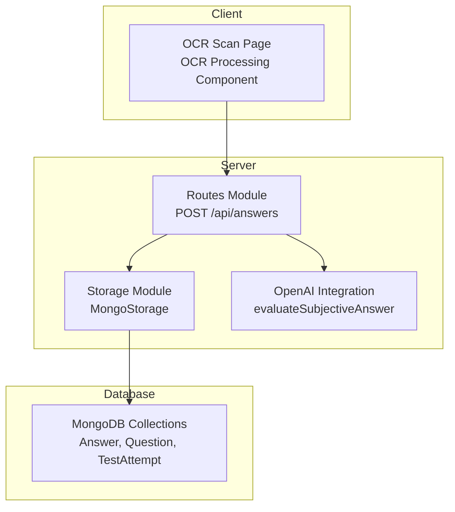
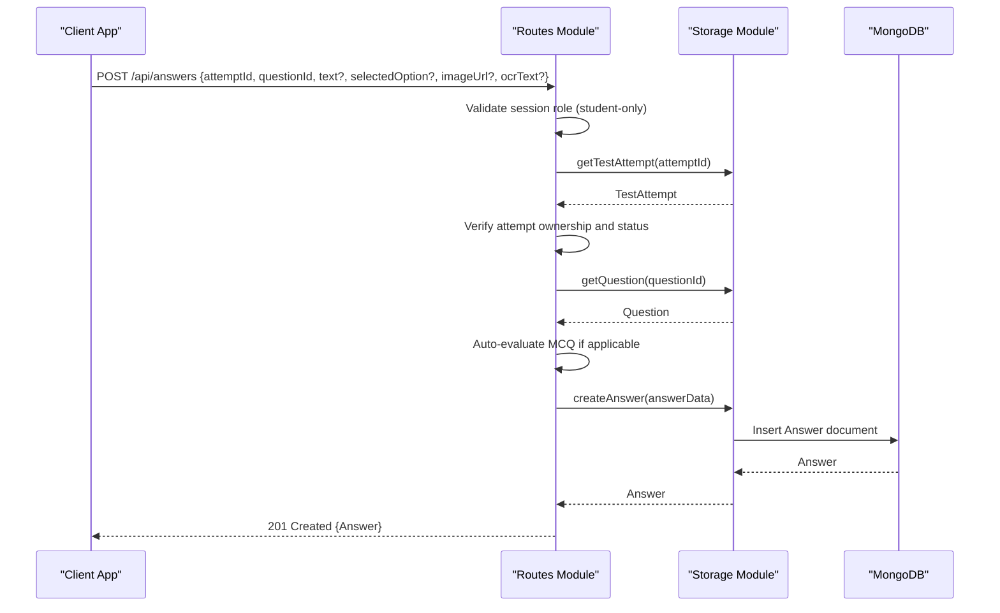
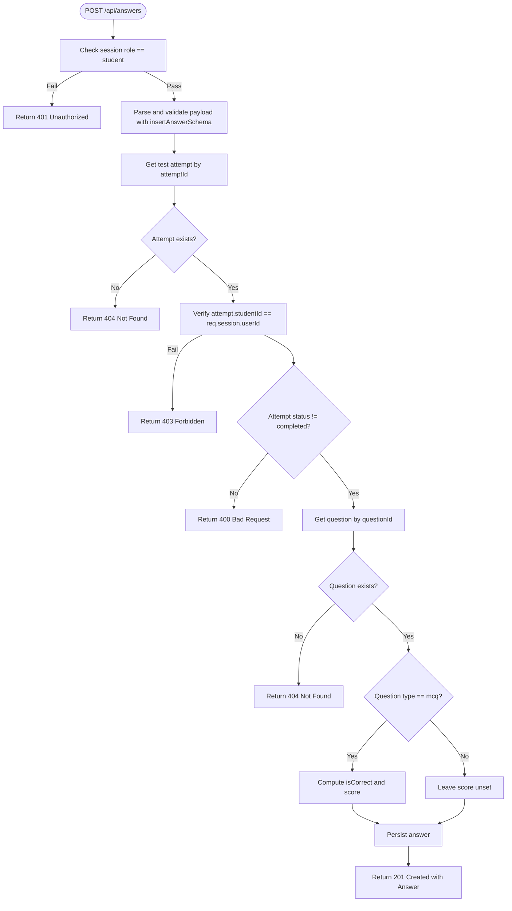
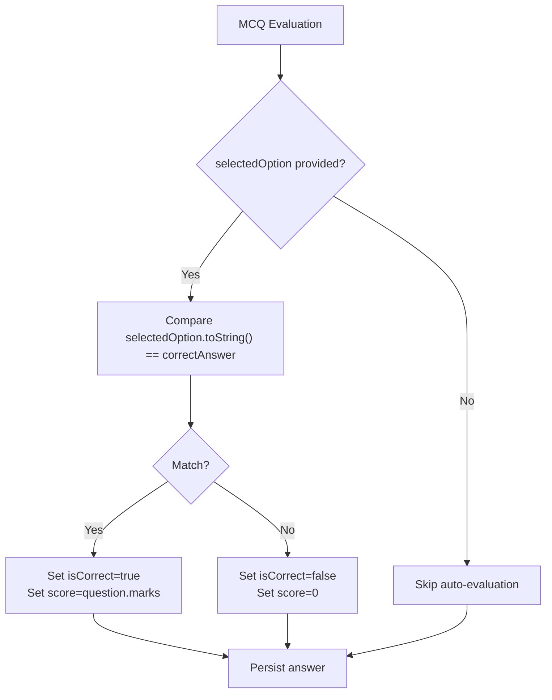
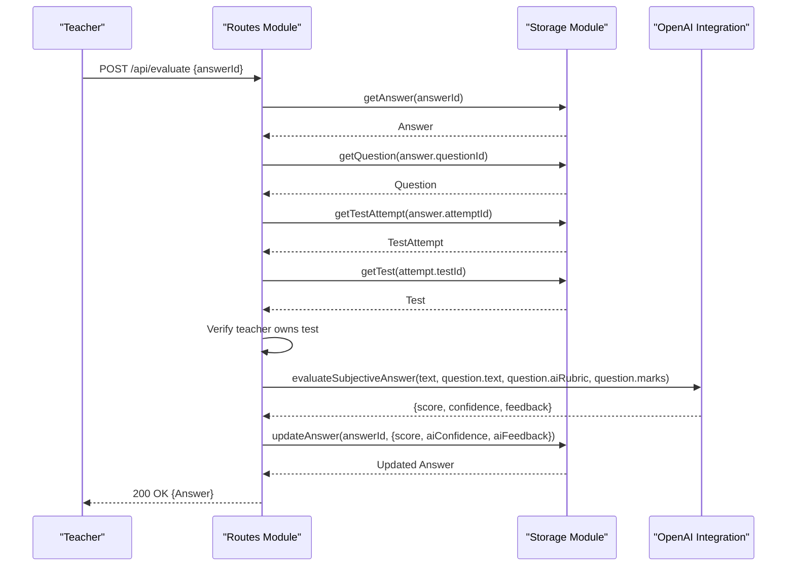
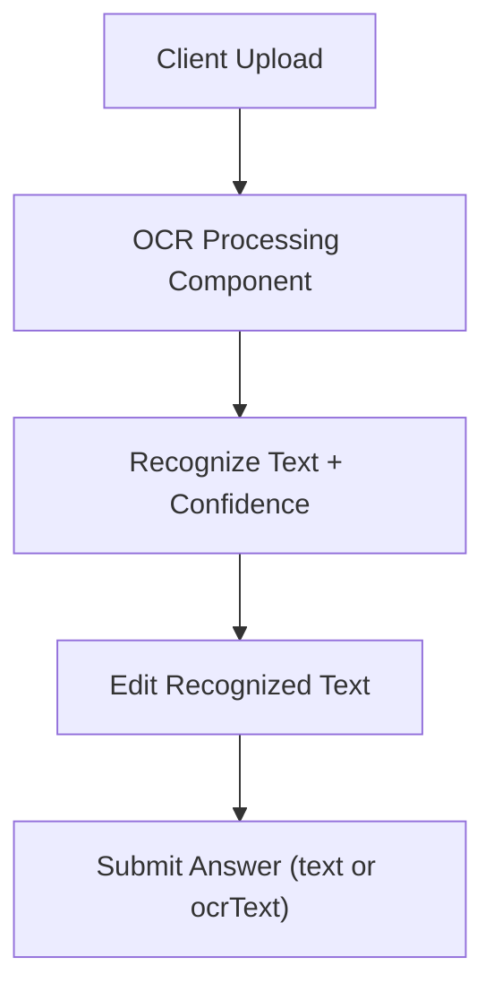
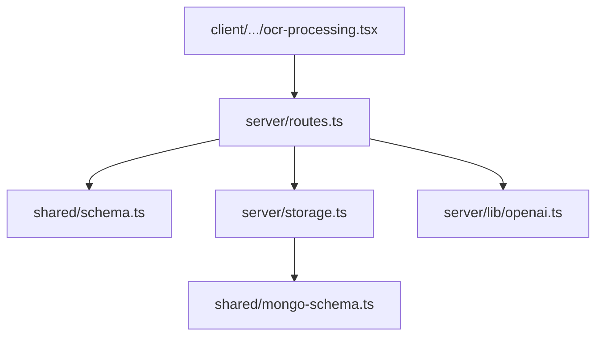

# Answer Submission Endpoints

<cite>
**Referenced Files in This Document**
- [server/index.ts](file://server/index.ts)
- [server/routes.ts](file://server/routes.ts)
- [server/storage.ts](file://server/storage.ts)
- [server/lib/openai.ts](file://server/lib/openai.ts)
- [shared/schema.ts](file://shared/schema.ts)
- [shared/mongo-schema.ts](file://shared/mongo-schema.ts)
- [client/src/pages/ocr-scan.tsx](file://client/src/pages/ocr-scan.tsx)
- [client/src/components/test/ocr-processing.tsx](file://client/src/components/test/ocr-processing.tsx)
</cite>

## Table of Contents
1. [Introduction](#introduction)
2. [Project Structure](#project-structure)
3. [Core Components](#core-components)
4. [Architecture Overview](#architecture-overview)
5. [Detailed Component Analysis](#detailed-component-analysis)
6. [Dependency Analysis](#dependency-analysis)
7. [Performance Considerations](#performance-considerations)
8. [Troubleshooting Guide](#troubleshooting-guide)
9. [Conclusion](#conclusion)

## Introduction
This document provides comprehensive API documentation for answer submission endpoints, focusing on POST /api/answers for student answer submission. It covers access control, attempt ownership verification, test completion validation, automatic MCQ evaluation logic, request/response schemas, validation rules, scoring algorithms for different question types, integration with AI evaluation, and practical examples for both automatic scoring and manual evaluation workflows.

## Project Structure
The answer submission feature spans the backend server routes, shared schemas, MongoDB persistence, and client-side OCR integration:
- Backend: Routes define the POST /api/answers endpoint and integrate with storage and AI evaluation.
- Shared schemas: Define request/response structures and validation rules.
- Storage: Implements CRUD operations for answers and integrates with MongoDB.
- AI evaluation: Provides automatic evaluation for subjective answers.
- Client: Supports OCR processing to extract text from handwritten answers.

**Diagram sources**
- [server/routes.ts](file://server/routes.ts#L416-L463)
- [server/storage.ts](file://server/storage.ts#L241-L262)
- [server/lib/openai.ts](file://server/lib/openai.ts#L50-L105)
- [shared/mongo-schema.ts](file://shared/mongo-schema.ts#L62-L74)
- [client/src/pages/ocr-scan.tsx](file://client/src/pages/ocr-scan.tsx#L1-L95)
- [client/src/components/test/ocr-processing.tsx](file://client/src/components/test/ocr-processing.tsx#L1-L117)

**Section sources**
- [server/routes.ts](file://server/routes.ts#L416-L463)
- [shared/schema.ts](file://shared/schema.ts#L48-L59)
- [shared/mongo-schema.ts](file://shared/mongo-schema.ts#L62-L74)
- [server/storage.ts](file://server/storage.ts#L241-L262)
- [server/lib/openai.ts](file://server/lib/openai.ts#L50-L105)
- [client/src/pages/ocr-scan.tsx](file://client/src/pages/ocr-scan.tsx#L1-L95)
- [client/src/components/test/ocr-processing.tsx](file://client/src/components/test/ocr-processing.tsx#L1-L117)

## Core Components
- POST /api/answers: Student-only endpoint to submit answers for a specific test attempt and question.
- Validation: Zod schemas enforce request payload structure and types.
- Access control: Session-based role checks ensure only authenticated students can submit answers.
- Attempt ownership: Verifies that the attempt belongs to the authenticated student.
- Test completion validation: Prevents submissions to completed attempts.
- Automatic MCQ evaluation: Compares selected option against the correct answer and assigns score.
- AI evaluation integration: Teachers can manually evaluate subjective answers using AI-assisted rubrics.

**Section sources**
- [server/routes.ts](file://server/routes.ts#L416-L463)
- [shared/schema.ts](file://shared/schema.ts#L48-L59)
- [shared/mongo-schema.ts](file://shared/mongo-schema.ts#L62-L74)
- [server/lib/openai.ts](file://server/lib/openai.ts#L50-L105)

## Architecture Overview
The answer submission flow involves the client sending an answer payload, the server validating and enforcing access/control rules, performing automatic MCQ scoring when applicable, persisting the answer, and optionally integrating with AI evaluation for subjective questions.

**Diagram sources**
- [server/routes.ts](file://server/routes.ts#L416-L463)
- [server/storage.ts](file://server/storage.ts#L241-L262)
- [shared/mongo-schema.ts](file://shared/mongo-schema.ts#L62-L74)

## Detailed Component Analysis

### POST /api/answers Endpoint
- Purpose: Allow authenticated students to submit answers for a specific test attempt and question.
- Authentication and Authorization:
  - Requires a valid session with role set to student.
  - Rejects requests from unauthorized roles.
- Request Validation:
  - Uses insertAnswerSchema to validate payload fields.
  - Enforces presence of attemptId and questionId.
- Attempt Ownership and Status:
  - Retrieves the associated test attempt and verifies ownership.
  - Prevents submissions if the attempt status is completed.
- Question Type Handling:
  - For MCQ questions, automatically evaluates correctness and sets score.
  - For subjective questions, stores raw text and leaves scoring to AI or teacher.
- Persistence:
  - Creates an answer document with computed or provided fields.

**Diagram sources**
- [server/routes.ts](file://server/routes.ts#L416-L463)
- [shared/schema.ts](file://shared/schema.ts#L48-L59)

**Section sources**
- [server/routes.ts](file://server/routes.ts#L416-L463)
- [shared/schema.ts](file://shared/schema.ts#L48-L59)

### Request and Response Schemas
- Request Body (insertAnswerSchema):
  - attemptId: number (required)
  - questionId: number (required)
  - text: string | null (optional)
  - selectedOption: number | null (optional)
  - imageUrl: string | null (optional)
  - ocrText: string | null (optional)
  - score: number | null (optional)
  - aiConfidence: number | null (optional)
  - aiFeedback: string | null (optional)
  - isCorrect: boolean | null (optional)
- Response Body (Answer):
  - id: number (auto-generated)
  - attemptId: number
  - questionId: number
  - text: string | null
  - selectedOption: number | null
  - imageUrl: string | null
  - ocrText: string | null
  - score: number | null
  - aiConfidence: number | null
  - aiFeedback: string | null
  - isCorrect: boolean | null

Validation Rules:
- Required fields: attemptId, questionId.
- Optional fields: text, selectedOption, imageUrl, ocrText, score, aiConfidence, aiFeedback, isCorrect.
- For MCQ: selectedOption must be present to enable auto-evaluation.

**Section sources**
- [shared/schema.ts](file://shared/schema.ts#L48-L59)
- [shared/mongo-schema.ts](file://shared/mongo-schema.ts#L62-L74)

### Automatic MCQ Evaluation Logic
- Trigger: Question type equals mcq and selectedOption is provided.
- Logic:
  - Compare selectedOption (converted to string) with question.correctAnswer.
  - Set isCorrect to true if match; otherwise false.
  - Set score to question.marks if correct; otherwise 0.
- Outcome: Persisted answer includes computed score and correctness flag.

**Diagram sources**
- [server/routes.ts](file://server/routes.ts#L447-L452)

**Section sources**
- [server/routes.ts](file://server/routes.ts#L447-L452)

### Manual Evaluation for Subjective Answers
- Workflow:
  - Student submits answer text (and optional OCR text).
  - Teacher initiates evaluation via POST /api/evaluate with answerId.
  - System retrieves answer, question, and test to verify ownership.
  - AI evaluates the answer using question text, rubric, and max marks.
  - Updates answer with AI-generated score, confidence, and feedback.
- Access Control:
  - Only authenticated teachers can call /api/evaluate.
  - Teacher must own the test associated with the answer attempt.

**Diagram sources**
- [server/routes.ts](file://server/routes.ts#L487-L559)
- [server/lib/openai.ts](file://server/lib/openai.ts#L50-L105)
- [server/storage.ts](file://server/storage.ts#L259-L262)

**Section sources**
- [server/routes.ts](file://server/routes.ts#L487-L559)
- [server/lib/openai.ts](file://server/lib/openai.ts#L50-L105)
- [shared/schema.ts](file://shared/schema.ts#L28-L37)

### OCR Integration for Subjective Answers
- Client-side OCR:
  - Users upload answer sheet images.
  - OCR processing extracts text and confidence metrics.
  - Recognized text can be reviewed and edited before submission.
- Server-side handling:
  - OCR text can be stored in answer.ocrText for subsequent AI evaluation.
  - If OCR text exists, AI evaluation uses ocrText instead of raw text.

**Diagram sources**
- [client/src/pages/ocr-scan.tsx](file://client/src/pages/ocr-scan.tsx#L1-L95)
- [client/src/components/test/ocr-processing.tsx](file://client/src/components/test/ocr-processing.tsx#L1-L117)
- [server/routes.ts](file://server/routes.ts#L533-L538)

**Section sources**
- [client/src/pages/ocr-scan.tsx](file://client/src/pages/ocr-scan.tsx#L1-L95)
- [client/src/components/test/ocr-processing.tsx](file://client/src/components/test/ocr-processing.tsx#L1-L117)
- [server/routes.ts](file://server/routes.ts#L533-L538)

## Dependency Analysis
- Routes depend on:
  - Shared Zod schemas for validation.
  - Storage module for database operations.
  - OpenAI integration for AI evaluation.
- Storage depends on:
  - MongoDB collections for answers, questions, and test attempts.
- Client depends on:
  - OCR components to prepare answer text for submission.

**Diagram sources**
- [server/routes.ts](file://server/routes.ts#L1-L11)
- [shared/schema.ts](file://shared/schema.ts#L1-L142)
- [server/storage.ts](file://server/storage.ts#L1-L106)
- [shared/mongo-schema.ts](file://shared/mongo-schema.ts#L40-L76)
- [client/src/components/test/ocr-processing.tsx](file://client/src/components/test/ocr-processing.tsx#L1-L117)

**Section sources**
- [server/routes.ts](file://server/routes.ts#L1-L11)
- [shared/schema.ts](file://shared/schema.ts#L1-L142)
- [server/storage.ts](file://server/storage.ts#L1-L106)
- [shared/mongo-schema.ts](file://shared/mongo-schema.ts#L40-L76)
- [client/src/components/test/ocr-processing.tsx](file://client/src/components/test/ocr-processing.tsx#L1-L117)

## Performance Considerations
- Validation overhead: Zod parsing occurs on every request; keep payloads minimal and avoid unnecessary fields.
- Database queries: Each submission triggers retrieval of attempt and question; ensure indexes on id fields for fast lookup.
- AI evaluation latency: /api/evaluate calls OpenAI; consider caching rubrics and batching evaluations where feasible.
- Concurrency: Multiple concurrent submissions per student should be safe due to attempt ownership checks and completed-status prevention.

## Troubleshooting Guide
Common issues and resolutions:
- 401 Unauthorized (student-only):
  - Ensure the session has role set to student.
- 403 Forbidden (attempt ownership):
  - Verify that the attempt.studentId matches the authenticated user.
- 400 Bad Request (attempt completed):
  - Completed attempts cannot accept new answers; finalize the attempt or create a new one.
- 404 Not Found (attempt or question missing):
  - Confirm attemptId and questionId exist and are valid.
- MCQ scoring not applied:
  - Ensure question.type is mcq and selectedOption is provided.
- AI evaluation failures:
  - Check OPENAI_API_KEY environment variable and network connectivity.
  - Review fallback responses and adjust rubrics for clarity.

**Section sources**
- [server/routes.ts](file://server/routes.ts#L416-L463)
- [server/routes.ts](file://server/routes.ts#L487-L559)
- [server/lib/openai.ts](file://server/lib/openai.ts#L4-L9)

## Conclusion
The answer submission endpoint provides a robust, role-protected mechanism for students to submit answers, with built-in automatic MCQ evaluation and seamless integration with AI-powered subjective evaluation. The design emphasizes validation, access control, and extensibility for future enhancements such as batch operations and advanced AI scoring.